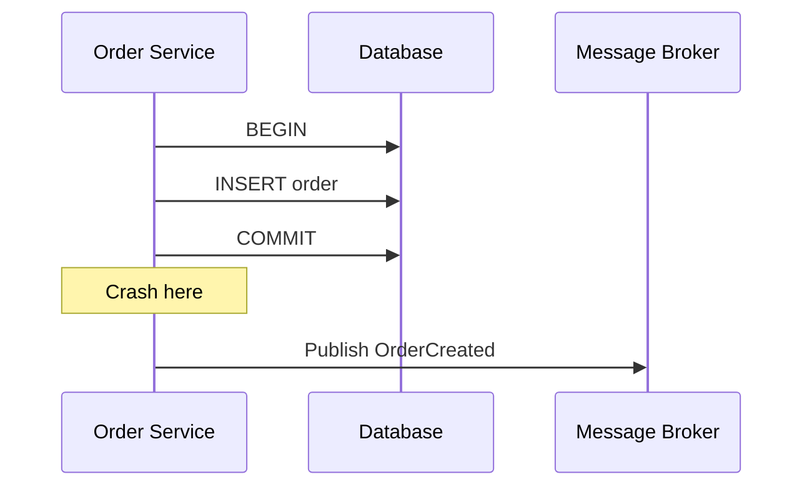
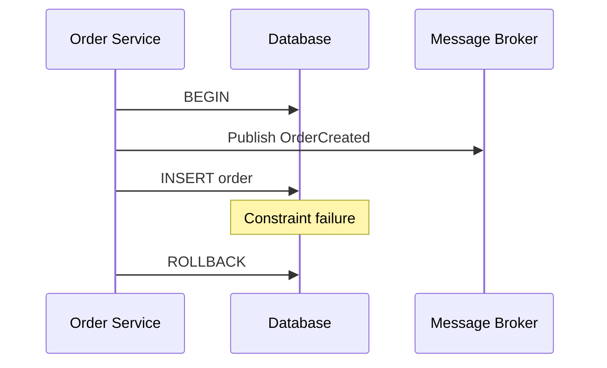
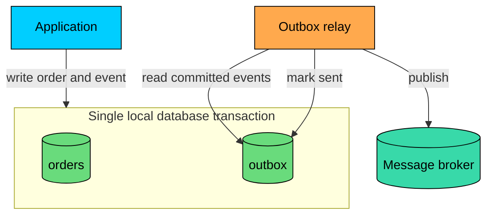
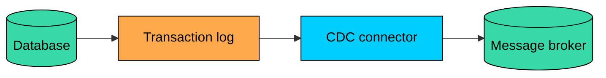
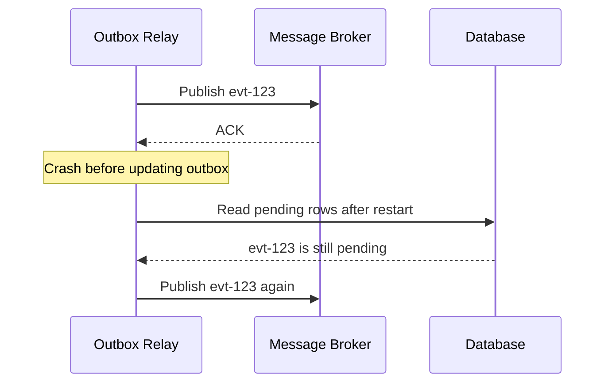
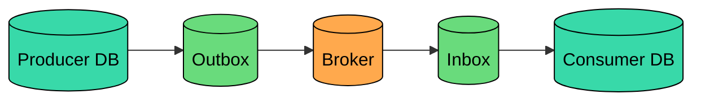

The **Outbox pattern** lets a service update its database and publish an event without a distributed transaction across the two.

The problem it solves is the **dual-write problem**. A service that commits to its database and then publishes to a message broker is updating two independent systems. Either side can succeed while the other fails, and no safe ordering between the two writes makes both atomic.

The pattern removes that dual write. The service writes the business change and an event record in the same local database transaction. A separate relay later reads the outbox table and publishes the message to the broker. The database remains the source of truth, and the broker becomes an asynchronous projection of committed facts.

---

# 1. The Dual-Write Problem

> [!PAYWALL] This content is for premium members only.

A dual write happens when one operation must update two systems, but there is no single local transaction covering both writes.

### Database First, Then Publish



The order exists, but no event is published. Any workflow waiting for `OrderCreated` is now stuck unless another reconciliation process finds and repairs the missing event.

### Publish First, Then Commit



The event is visible to consumers, but the order never commits. Downstream services may reserve inventory, charge a customer, or send notifications for a record that does not exist.

### Unknown Publish Outcome

Even if the application writes to the database first and then publishes, the publish result can be ambiguous.

```mermaid
flowchart LR
    Commit[Database commit succeeds]:::green
    Publish[Publish event]:::orange
    Timeout[Network timeout]:::red
    Unknown[Was the event stored by the broker"]:::yellow

    Commit --> Publish --> Timeout --> Unknown

    classDef green fill:#69db7c,stroke:#000,color:#000
    classDef orange fill:#ffa94d,stroke:#000,color:#000
    classDef red fill:#ff8787,stroke:#000,color:#000
    classDef yellow fill:#ffd43b,stroke:#000,color:#000
```

If the application retries, it may publish a duplicate. If it does not retry, it may lose the event.

There is no safe ordering between a local database transaction and an external broker publish. One side can succeed while the other fails.

---

# 2. How the Outbox Pattern Works

The Outbox pattern changes the write path:

1. The application starts a normal database transaction.
2. It writes the business data.
3. It writes an outbox row describing the event to publish.
4. It commits the transaction.
5. A relay publishes unsent outbox rows to the broker.
6. The relay marks rows as sent, or deletes them after a retention period.



The important guarantee is narrow but powerful:

- If the business transaction commits, the outbox row commits with it.
- If the business transaction rolls back, the outbox row rolls back with it.
- The relay can crash and restart without losing committed events.

The pattern does not make the database and broker one atomic system. It removes the unsafe dual write from the request path and turns event publication into a retryable background job.

---

# 3. Outbox Table Design

A production outbox table should support batching, retries, observability, and cleanup. A simple `sent = false` column is often enough for a demo, but real systems usually need more state.

| Column | Purpose |
|--------|---------|
| `id` | Stable event identifier used for deduplication |
| `aggregate_type` | Entity category, such as `Order` or `Payment` |
| `aggregate_id` | Entity identifier, often used as the broker partition key |
| `event_type` | Business fact, such as `OrderCreated` |
| `event_version` | Schema version for consumers |
| `payload` | Event body |
| `headers` | Correlation ID, causation ID, tenant ID, trace context |
| `status` | `pending`, `published`, `failed`, or similar |
| `attempts` | Number of publish attempts |
| `available_at` | Next time the relay may retry this row |
| `locked_until` | Short lease used by relay workers |
| `published_at` | When the broker acknowledged the publish |
| `last_error` | Last failure message for debugging |

Keep the outbox row small. Large blobs, full object snapshots, or deeply nested payloads make the table expensive to scan and replicate. Put only what consumers need, and store large artifacts elsewhere.

---

# 4. Writing to the Outbox

The application writes the domain change and the outbox event in the same transaction.

After the commit, the API can return success to the caller. The event may not have reached the broker yet, but it is durable and publishable.

That delay is part of the contract. Systems using the Outbox pattern should be designed for eventual propagation, not immediate cross-service visibility.

---

# 5. Publisher Implementations

The relay is the process that moves committed outbox rows to the message broker. There are two common implementations.

## Polling Relay

A polling relay periodically claims a batch of pending rows, publishes them, and marks successful rows as published.

```mermaid
flowchart TD
    Poll[Find pending rows]:::orange
    Claim[Claim batch]:::yellow
    Publish[Publish to broker]:::green
    Ack{Broker ACK"}:::yellow
    Sent[Mark published]:::green
    Retry[Schedule retry]:::red

    Poll --> Claim --> Publish --> Ack
    Ack -->|yes| Sent --> Poll
    Ack -->|no| Retry --> Poll

    classDef orange fill:#ffa94d,stroke:#000,color:#000
    classDef yellow fill:#ffd43b,stroke:#000,color:#000
    classDef green fill:#69db7c,stroke:#000,color:#000
    classDef red fill:#ff8787,stroke:#000,color:#000
```

With multiple relay workers, workers must not publish the same row concurrently. Databases that support row-level claiming can use `FOR UPDATE SKIP LOCKED` to claim work in batches.

The worker publishes the returned rows outside the database transaction, then marks each successful row as `published`. If the worker dies, another worker can reset expired `in_progress` rows back to `pending` after `locked_until`.

Polling is simple, portable, and easy to reason about. Its main cost is extra database reads and a latency floor equal to the polling interval.

## CDC Relay

A CDC relay reads inserts from the database transaction log and forwards outbox events to the broker.



Tools such as Debezium can read PostgreSQL WAL, MySQL binlogs, and other database logs. Debezium also has an outbox event routing pattern that can turn outbox table inserts into broker messages.

CDC usually gives lower latency and avoids polling queries against the primary tables. The trade-off is operational complexity: replication slots, connector offsets, schema changes, broker configuration, and failure recovery now matter.

### Polling vs CDC

| Aspect | Polling Relay | CDC Relay |
|--------|---------------|-----------|
| Latency | Usually milliseconds to seconds | Usually low milliseconds to seconds |
| Database load | Repeated indexed scans | Reads transaction log |
| Complexity | Low | Medium to high |
| Portability | Works with almost any database | Depends on database log access |
| Operations | Worker leases and retry logic | Connector health, offsets, log retention |
| Ordering | Must be designed carefully | Follows commit/log order, then broker partitioning |

Use polling when you want simplicity and control. Use CDC when you already operate CDC infrastructure or need lower latency at higher write volume.

---

# 6. Delivery Guarantees

The Outbox pattern usually provides **at-least-once publication**.

The relay can publish an event and then crash before marking the outbox row as published. On restart, it sees the row as pending and publishes it again.



This is not a bug. It is the normal failure mode of the pattern.

Because duplicates are possible, consumers must be idempotent.

### Idempotent Consumers

A common approach is to store processed event IDs in the same transaction as the consumer's business update.

The important detail is atomicity on the consumer side. The consumer should not record an event as processed unless its own business changes commit too.

### About Exactly-Once

Be careful with the phrase "exactly-once."

Some brokers and stream processors provide exactly-once guarantees within a bounded system, such as Kafka transactionally consuming from one topic and producing to another. That does not automatically make an external database update, an email send, or a payment API call exactly once.

For most service-to-service workflows, the practical target is:

- At-least-once delivery
- Stable event IDs
- Idempotent consumers
- Transactional recording of processed IDs
- Reconciliation for rare operational gaps

That combination is what keeps real systems correct.

---

# 7. Ordering

Outbox does not automatically solve ordering. You need to design for the ordering scope you actually require.

Most systems do not need a total order of all events. They need events for the same aggregate to be processed in order.

For example:

Use the aggregate ID as the broker partition key. In Kafka, this sends all events for the same order to the same partition, where they are read in order.

Also include a monotonically increasing aggregate version when the domain model supports it. Consumers can then detect duplicates, gaps, and out-of-order delivery.

| Technique | Why it matters |
|-----------|----------------|
| Partition by `aggregate_id` | Keeps events for one entity on the same broker partition |
| Include `event_id` | Allows duplicate detection |
| Include aggregate version | Allows gap and ordering checks |
| Avoid parallel publishing for one aggregate | Prevents reordering before the broker |
| Make consumers tolerant | Retries, rebalances, and manual replays still happen |

Do not rely only on `created_at` timestamps for ordering. Clocks, transaction timing, retries, and concurrent writers can make timestamp order misleading.

---

# 8. Retries and Failure Handling

The relay should treat publishing as a retryable operation, but retries need guardrails.

### Retry Policy

Use exponential backoff with jitter. A broker outage should not turn every relay worker into a tight retry loop against the database and broker.

### Poison Events

Some events will never publish successfully because of bad data, schema problems, authorization issues, or broker constraints.

After a configured number of attempts, move the row to a `failed` state and alert. Do not let one poison row block the whole outbox.

### Reconciliation

Even well-designed systems need repair tools. Useful reconciliation jobs include:

- Find old `pending` rows that have not been published
- Find `in_progress` rows whose lease expired
- Requeue failed rows after an operator fixes the cause
- Compare business tables with outbox rows for critical workflows

The outbox table is not just a queue. It is also an audit trail for message publication.

---

# 9. Cleanup and Retention

The outbox table grows forever unless you manage it.

A common policy is:

1. Keep pending and recent published rows in the hot outbox table.
2. Delete or archive published rows after a retention window.
3. Keep failed rows until they are inspected or reprocessed.

At high volume, partition the outbox table by time and drop old partitions instead of running large deletes. Large deletes can create table bloat, replication lag, and lock pressure.

Keep the pending index small. A partial index on `status = 'pending'` is usually more effective than indexing every historical row.

---

# 10. When to Use the Outbox Pattern

Use the Outbox pattern when:

- A service owns a database and must publish events after local commits
- You are building sagas or event-driven workflows
- Losing an event would create inconsistent state
- You want to avoid distributed transactions across a database and broker
- Consumers can handle at-least-once delivery

Avoid or reconsider it when:

- The operation is entirely inside one database and does not need a broker
- The message is best-effort telemetry where occasional loss is acceptable
- The system already uses event sourcing and the event log is the source of truth
- You cannot make consumers idempotent

Outbox is often paired with the **Inbox pattern** on the consumer side. The inbox records received events before processing them, which gives consumers their own retry and deduplication boundary.



---

# 11. Common Mistakes

### Publishing Inside the Transaction

Do not publish to the broker before the database transaction commits. Consumers can see an event for data that later rolls back.

### Treating Outbox as Exactly-Once

Outbox prevents lost committed events. It does not prevent duplicate publication. Design consumers accordingly.

### No Consumer Idempotency

If duplicate events can charge a customer twice, reserve inventory twice, or send conflicting commands, the system is not safe.

### No Ordering Strategy

If ordering matters, define the ordering key. Usually that means partitioning by aggregate ID and including an aggregate version.

### Unbounded Table Growth

A busy service can create millions of outbox rows quickly. Retention, partitioning, and partial indexes should be part of the design from the start.

### Weak Observability

Track relay lag, pending row count, failed row count, publish latency, retry count, and oldest pending event age. The most useful alert is often "oldest pending event is older than expected."

---

# Summary

The Outbox pattern is a practical way to publish reliable events without distributed transactions.

The core idea is simple: write business data and the event record in one local database transaction, then publish the event asynchronously from the outbox.

In production, the important details are:

- The pattern gives durable, retryable publication, not automatic exactly-once processing.
- Duplicates are expected, so consumers must be idempotent.
- Ordering requires a clear key, usually the aggregate ID.
- Relays need leases, retries, poison-event handling, cleanup, and monitoring.
- CDC can reduce latency, but it adds operational complexity.

Used well, the Outbox pattern gives event-driven systems a reliable handoff between local state changes and asynchronous messaging. It is one of the most useful patterns for building distributed workflows that remain correct when services crash, networks fail, and brokers retry.

---

# Quiz
