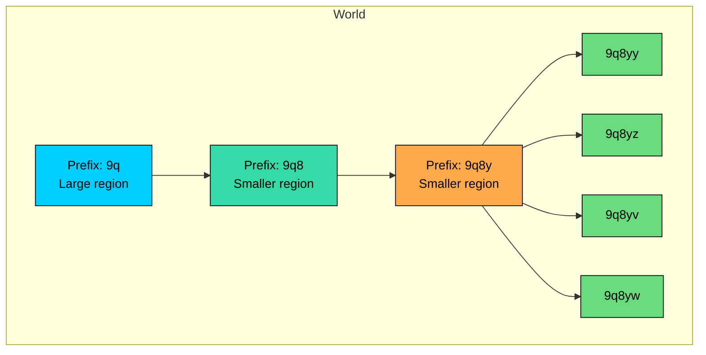
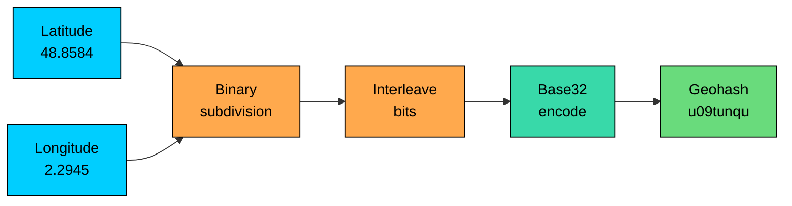
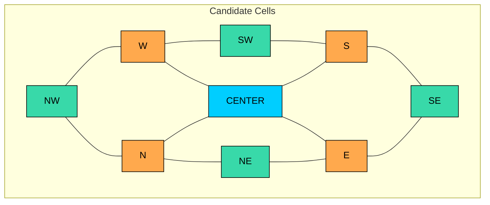

Many location systems need to find nearby places without scanning every latitude and longitude row.

Geohash converts a two-dimensional location into a hierarchical string. Nearby points often share a prefix, so ordinary ordered indexes can fetch a small set of candidate locations.

Geohash is a coarse filter, not an exact distance engine. Production queries still need neighboring cells, exact distance checks, and careful precision choices.

---

# 1. What Is Geohash"

**Geohash** is a hierarchical spatial encoding for latitude and longitude. It divides the Earth into rectangular cells and assigns each cell a short Base32 string.

Longer strings represent smaller cells:

- `9q8yy` covers a broad area around San Francisco.
- `9q8yyk` covers a smaller cell inside that area.
- `9q8yyk8` covers a still smaller cell.

Invented by Gustavo Niemeyer in 2008, Geohash became popular because it fits cleanly into existing storage systems. A geohash is just a string, so you can store it in a normal column, sort it, prefix-match it, and index it with a B-tree.

> 💡 **Key Insight:**

> **TIP**
>
> Points with the same geohash prefix are in the same rectangular region. Points near each other often share a prefix, but not always. Cell boundaries are the main edge case you must design for.

Here is the core idea:

This hierarchy is why prefix queries work. Searching for `9q8yy%` means "find points stored in this cell and its descendants."

---

# 2. How Geohash Encoding Works

> [!PAYWALL] This content is for premium members only.

Geohash encoding has three steps:

1. Repeatedly split longitude and latitude ranges in half.
2. Interleave the resulting bits, starting with longitude.
3. Encode every 5 bits using a Geohash-specific Base32 alphabet.

## 2.1 Coordinate Ranges

Latitude ranges from `-90` to `+90`.

Longitude ranges from `-180` to `+180`.

As an example, encode the Eiffel Tower:

- Latitude: `48.8584`
- Longitude: `2.2945`

## 2.2 Binary Subdivision

For each coordinate, the encoder repeatedly asks one question:

> Is the target value in the lower half or upper half of the current range"

Use `0` for the lower half and `1` for the upper half.

For longitude `2.2945`, start with `[-180, 180]`:

| Iteration | Range | Midpoint | Value | Bit |
|-----------|-------|----------|-------|-----|
| 1 | `[-180, 180]` | `0` | Right of midpoint | `1` |
| 2 | `[0, 180]` | `90` | Left of midpoint | `0` |
| 3 | `[0, 90]` | `45` | Left of midpoint | `0` |
| 4 | `[0, 45]` | `22.5` | Left of midpoint | `0` |
| 5 | `[0, 22.5]` | `11.25` | Left of midpoint | `0` |

The first five longitude bits are:

For latitude `48.8584`, start with `[-90, 90]`:

| Iteration | Range | Midpoint | Value | Bit |
|-----------|-------|----------|-------|-----|
| 1 | `[-90, 90]` | `0` | Upper half | `1` |
| 2 | `[0, 90]` | `45` | Upper half | `1` |
| 3 | `[45, 90]` | `67.5` | Lower half | `0` |
| 4 | `[45, 67.5]` | `56.25` | Lower half | `0` |
| 5 | `[45, 56.25]` | `50.625` | Lower half | `0` |

The first five latitude bits are:

## 2.3 Interleaving Bits

Geohash interleaves longitude and latitude bits. Longitude goes first:

This interleaving is a Morton code, also called a Z-order curve. It maps two dimensions into one ordered value while preserving some spatial locality.

## 2.4 Base32 Encoding

Geohash uses this Base32 alphabet:

The letters `a`, `i`, `l`, and `o` are not used, which avoids several common reading mistakes.

Group the interleaved bits into 5-bit chunks:

So the first two characters of the Eiffel Tower geohash are `u0`. With 8 characters, the Eiffel Tower geohash is:

The full flow looks like this:

---

# 3. Precision Levels

Geohash precision is controlled by string length. Each additional character adds 5 bits, so the cell area shrinks quickly.

Approximate cell sizes near the equator:

| Length | Cell Width | Cell Height | Typical Use |
|--------|------------|-------------|-------------|
| 1 | 5,000 km | 5,000 km | Continent-scale grouping |
| 2 | 1,250 km | 625 km | Country or large region |
| 3 | 156 km | 156 km | Metro region |
| 4 | 39.1 km | 19.5 km | City-level grouping |
| 5 | 4.9 km | 4.9 km | Neighborhood search |
| 6 | 1.2 km | 0.61 km | Nearby candidates |
| 7 | 153 m | 153 m | Block-level candidates |
| 8 | 38 m | 19 m | Building-level candidates |
| 9 | 4.8 m | 4.8 m | Fine outdoor positioning |
| 10 | 1.2 m | 0.6 m | Very fine positioning |
| 11 | 15 cm | 15 cm | More precise than most app data needs |
| 12 | 3.7 cm | 1.9 cm | Usually beyond GPS accuracy |

These sizes are approximations. Latitude height is fairly stable, but longitude width shrinks as you move toward the poles because longitude lines converge.

For example, a 6-character cell is about `1.2 km` wide at the equator. Around San Francisco, the same cell is narrower east-to-west because San Francisco is at roughly 38 degrees north.

> 💡 **Key Insight:**

> **TIP**
>
> Pick precision from the query radius and expected data density. A cell that is too large returns too many candidates. A cell that is too small forces you to query many neighboring cells.

A common starting point:

- Use 5 characters for broad discovery, such as "restaurants in this area."
- Use 6 or 7 characters for nearby drivers, couriers, stores, or pickup points.
- Use 8 or more only when the dataset and GPS accuracy justify it.

Do not choose precision by intuition alone. Measure candidate counts in dense and sparse regions. Manhattan, Bengaluru, and rural Kansas will produce very different query behavior.

---

# 4. Proximity Search with Geohash

The production pattern is usually:

1. Convert the query point to a geohash.
2. Choose a precision appropriate for the radius.
3. Generate geohash cells that cover the query area.
4. Fetch candidates using indexed geohash ranges or prefixes.
5. Apply an exact distance filter.
6. Rank and page the final results.

## 4.1 Prefix Lookup

If a customer is in cell `9q8yy`, you can fetch records in that cell with a prefix query:

In many databases this can use a B-tree index, but the details matter. PostgreSQL, for example, may need a suitable collation or a `text_pattern_ops` index for efficient `LIKE 'prefix%'` searches:

Another portable approach is to issue lexicographic range scans:

That range means "all strings starting with `9q8yy`" because `9q8yz` is the next prefix in Geohash Base32 order.

## 4.2 Boundary Problem

Prefix matching alone is incomplete.

Two restaurants can be 10 meters apart and still have different prefixes if they sit on opposite sides of a cell boundary:

A query for only `9q8yy%` can miss nearby results in adjacent cells.

This is the most common Geohash bug: the system works in demos, then misses results near cell edges in production.

## 4.3 Query Neighboring Cells

For small-radius searches, you usually query the center cell plus its 8 immediate neighbors:

The SQL often becomes a set of prefix scans:

This 9-cell pattern is useful, but it is not universal. It works when the radius fits within the center cell plus immediate neighbors at the selected precision.

For larger radii, generate a covering set of cells across the query bounding box. The larger the radius or the finer the precision, the more cells you need to query.

## 4.4 Exact Distance Filtering

Geohash returns candidates. The final result must still use exact distance:

This two-stage design is common across spatial systems:

- The spatial index does coarse pruning.
- The distance function enforces correctness.
- Ranking uses business rules such as ETA, open status, inventory, courier capacity, price, or model score.

For AI-powered search and recommendation systems, Geohash is often used as a retrieval feature or partitioning key. For example, a restaurant ranking model might only score candidates from nearby cells. That keeps model inference focused on plausible results instead of wasting compute on irrelevant locations.

---

# 5. Production Design Notes

Geohash is simple, but production systems still need careful design.

## 5.1 Store the Raw Coordinates

Always store latitude and longitude separately from the geohash.

The geohash is an index key. It is not the source of truth.

Keep raw coordinates because you still need them for exact distance filtering, map display, route and ETA calculations, debugging precision issues, and rebuilding the geohash column if precision or encoding changes.

## 5.2 Combine Geohash with Business Filters

A real query rarely searches by location alone. It usually also filters by status, category, availability, tenant, region, or freshness.

For example:

Index design should match that query shape. If most reads only need open restaurants, a partial index may be better than a wider global index:

For multi-tenant systems, include the tenant or region in the access pattern. You do not want one customer query scanning shared geohash ranges across every tenant.

## 5.3 Handle Moving Objects Carefully

Drivers, couriers, scooters, and delivery robots move. Their geohash changes whenever they cross a cell boundary.

For moving objects:

- Store the latest location in a low-latency store such as Redis, DynamoDB, Cassandra, or a sharded in-memory service.
- Use TTLs or heartbeats so stale locations disappear.
- Batch or debounce updates if devices report too frequently.
- Separate write-heavy live location state from historical location events.

Do not update a relational row on every GPS ping if the system receives thousands of pings per second. That design usually creates write amplification, lock contention, and noisy replication.

## 5.4 Use Existing Spatial Indexes When Available

If your database already has mature geospatial support, use it before building your own geohash query layer.

Examples:

- PostgreSQL with PostGIS can use GiST/SP-GiST indexes for `geometry` and `geography` queries.
- MongoDB supports `2dsphere` indexes for GeoJSON and spherical queries.
- Redis supports geospatial commands backed by sorted sets.
- Elasticsearch supports `geo_point`, `geo_shape`, distance queries, and geospatial grid aggregations.

Geohash is still useful when you need a simple key for sharding, caching, bucketing, or coarse filtering. It is not always the best primary query engine.

---

# 6. Current Platform Examples

The platform landscape has changed enough that older Geohash explanations often make misleading claims. Here is the practical view.

## 6.1 Redis

Redis has built-in geospatial commands. Use `GEOSEARCH` for new code instead of the older `GEORADIUS` command.

Internally, Redis stores geospatial members in a sorted set using a geohash-like integer score. Query cost depends on the number of elements in the searched area, not just the total number of elements in the key.

Redis is a good fit for live nearby-entity lookup when the active dataset fits in memory and the query patterns are simple.

## 6.2 MongoDB

MongoDB's recommended path is a `2dsphere` index on a GeoJSON field:

Use MongoDB's geospatial index rather than storing a custom geohash unless you need geohash for a separate reason such as partitioning, cache keys, or analytics buckets.

## 6.3 Elasticsearch

Elasticsearch supports geospatial queries on `geo_point` and `geo_shape` fields. It also supports `geohash_grid` aggregations, which group documents into geohash-labeled buckets for maps and heatmaps.

For map tiling, Elasticsearch also supports `geotile_grid`. For hexagonal analysis, it supports `geohex_grid`, which is based on H3. Pick the grid that matches the product need instead of assuming Geohash is always the right bucket format.

## 6.4 H3 and S2

H3 and S2 are common alternatives to Geohash in modern systems.

H3 partitions the world into mostly hexagonal cells and is widely used for analytics, marketplace balancing, surge maps, delivery zones, and regional aggregation.

S2 partitions the sphere using cells derived from a cube projection. It handles global geometry, antimeridian behavior, and hierarchical covering well.

Geohash remains attractive when you want a small string key and simple prefix scans. H3 or S2 is often a better fit for global-scale spatial analytics, polygon covering, or systems where cell adjacency and area uniformity matter.

---

# 7. Limitations and Edge Cases

Geohash is useful because it is simple. Its limitations come from the same simplicity.

## 7.1 Boundary Discontinuities

Nearby points can have different prefixes if they are on opposite sides of a cell boundary.

This can happen at any precision. It can also happen at major boundaries where nearby points differ early in the string.

**Design response:** query neighboring cells or generate a covering set for the full search area.

## 7.2 Non-Uniform Cell Size

Geohash subdivides latitude and longitude, not physical meters. Longitude degrees become smaller as absolute latitude increases.

At the equator, a degree of longitude is about 111 km. Near the poles, it approaches zero.

**Design response:** choose precision with latitude in mind, and measure candidate counts by region.

## 7.3 Rectangular Cells

Geohash cells are rectangles in latitude/longitude space, not circles.

A circular radius search over a rectangular grid always has false positives near the corners. That is expected.

**Design response:** use the grid for candidate retrieval and the Haversine formula or database geospatial distance function for the final filter.

## 7.4 Antimeridian and Poles

The International Date Line is awkward for Geohash prefix logic. Points near `+180` and `-180` longitude are physically close but can have very different prefixes.

Very high latitudes also behave poorly because longitude lines converge.

**Design response:** use explicit wraparound logic, or use a spherical spatial index such as S2 or a database geospatial index that handles these cases.

## 7.5 Hot Cells

Popular regions can concentrate huge traffic in a few cells. A single downtown cell may receive more reads and writes than entire rural regions.

**Design response:** shard by region plus load, add secondary bucketing for hot areas, cache read-heavy cells, and keep live-location writes out of slow storage paths.

---

# 8. Comparison with Other Spatial Indexes

| Method | Strengths | Weaknesses | Good Fit |
|--------|-----------|------------|----------|
| **Geohash** | Simple string key, prefix scans, easy storage | Boundary issues, rectangular cells, latitude distortion | Coarse filtering, cache keys, sharding, simple nearby search |
| **PostGIS / R-tree-style indexes** | Mature spatial queries, polygons, intersections, distance predicates | Requires spatial database support and operational knowledge | Geographic applications with rich query needs |
| **S2** | Spherical geometry, strong covering operations, handles global edge cases well | More complex than Geohash | Global systems, polygon covering, antimeridian-safe queries |
| **H3** | Hexagonal cells, good neighbor behavior, strong analytics ecosystem | Hierarchy is approximate geometrically; pentagons are special cases | Spatial analytics, marketplace balancing, heatmaps |
| **Quad Tree** | Easy to understand, adaptive subdivision | Custom implementation and rebalancing concerns | Games, simulations, custom in-memory spatial indexes |

Use Geohash when the simplicity is valuable and the query semantics are modest.

Use a real geospatial index when correctness across shapes, global boundaries, or complex predicates matters.

---

# 9. Code Implementation (Python)

The following implementation is small enough to study. It includes encoding, decoding, neighbor lookup, and distance filtering.

For production code, prefer a maintained library. Edge cases around poles, antimeridian wrapping, precision, and query covering are easy to get subtly wrong.

Expected output:

---

# 10. Key Takeaways

Geohash is a compact spatial index that turns latitude and longitude into a sortable string.

Its main value is coarse pruning: use prefixes or ranges to fetch a small candidate set, then apply exact distance filtering.

Do not rely on one prefix for a radius search. Query neighboring cells or generate a covering set, especially near boundaries.

Cell size varies by latitude, and hot cells can become operational bottlenecks. Precision should be chosen from measured candidate counts, not from a fixed table alone.

For simple proximity lookup, Geohash is often enough. For complex geospatial queries, global edge cases, polygons, or high-volume analytics, consider PostGIS, S2, H3, Redis GEO, MongoDB `2dsphere`, or Elasticsearch geospatial features.

---

# Quiz
