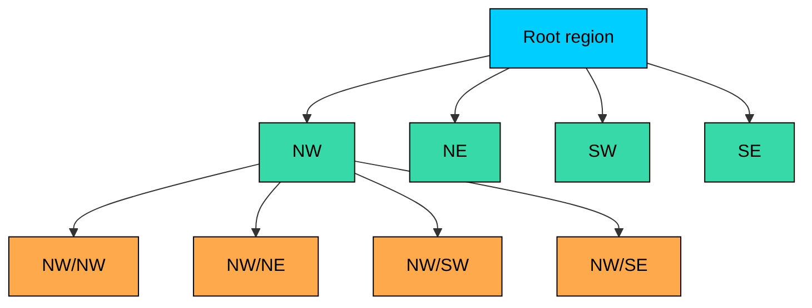
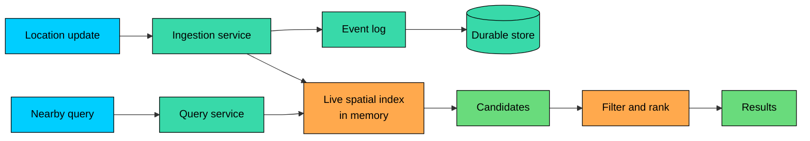

Many systems need to find nearby objects in two-dimensional space without checking every point.

A **Quad Tree** recursively partitions space into four regions. During range or radius queries, it skips entire regions that cannot contain relevant objects.

Quad Trees are practical for bounded, in-memory point data. Their performance depends on data distribution, query size, update rate, and safeguards such as max depth.

---

# 1. The Problem: Proximity Search

Suppose a service tracks active drivers:

To find available drivers near San Francisco, you might start with a bounding box:

This is a reasonable first filter, but it is incomplete. The bounding box returns false positives near the corners, ordinary B-tree indexes do not understand two-dimensional locality, and the final result still needs exact distance filtering.

Production systems usually use a database spatial index such as PostGIS GiST/SP-GiST or MySQL spatial indexes, a grid index such as Geohash, S2, or H3, or an in-memory spatial index such as a Quad Tree, KD-tree, or R-tree.

Quad Trees are most useful when you own the in-memory query path and need fast spatial lookups over point-like objects.

---

# 2. What Is a Quad Tree"

> [!PAYWALL] This content is for premium members only.

A **Quad Tree** recursively divides two-dimensional space into four quadrants.

Each node represents a rectangular region. If a region contains too many points, it splits into:

- northwest
- northeast
- southwest
- southeast



Visually:

The common production variant for point lookups is a **Point-Region Quad Tree**, often shortened to PR Quad Tree. Internal nodes divide space, leaf nodes store points, and a leaf splits when it exceeds a configured capacity. The tree stops splitting at a maximum depth or minimum cell size.

That last rule matters. Without a max depth, duplicate points or heavily clustered data can force pathological subdivision.

---

# 3. How Quad Trees Make Queries Fast

The key operation is region pruning.

When querying a rectangle:

1. Start at the root.
2. If the node's region does not intersect the query rectangle, skip the entire subtree.
3. If the node intersects, inspect points stored in that node.
4. Recurse into child nodes that intersect the query rectangle.

```mermaid
flowchart TD
    START["Start at root"]:::primary --> CHECK{"Node intersects<br/>query region""}:::yellow
    CHECK -->|"No"| SKIP["Skip subtree"]:::green
    CHECK -->|"Yes"| POINTS["Check local points"]:::orange
    POINTS --> CHILDREN{"Has children""}:::yellow
    CHILDREN -->|"No"| DONE["Return matches"]:::green
    CHILDREN -->|"Yes"| RECURSE["Search intersecting children"]:::secondary
    RECURSE --> CHECK

    classDef primary fill:#00ceff,stroke:#000,color:#000
    classDef yellow fill:#ffd43b,stroke:#000,color:#000
    classDef secondary fill:#38d9a9,stroke:#000,color:#000
    classDef orange fill:#ffa94d,stroke:#000,color:#000
    classDef green fill:#69db7c,stroke:#000,color:#000
```

For a radius search, use a two-stage query:

1. Query the bounding box around the circle.
2. Filter candidates by exact distance.

This pattern is used because rectangle intersection is cheap and maps naturally to the tree. Exact distance is still required for correctness.

## 3.1 Complexity

Quad Tree performance depends heavily on the data distribution and query shape.

| Operation | Typical Behavior | Worst Case |
|-----------|------------------|------------|
| Insert | Proportional to tree depth | Can degrade with clustered or duplicate points |
| Delete / move | Proportional to lookup depth, plus maintenance | Can be expensive if the tree constantly splits and merges |
| Range query | Visits only intersecting nodes plus matching points | Can visit most nodes if the query is large |
| Nearest neighbor | Efficient with pruning and a priority search | Can degrade without good pruning |

Avoid teaching Quad Trees as guaranteed `O(log n)`. A balanced tree over well-distributed points behaves well. A bad distribution can create deep branches unless the implementation enforces capacity, max depth, and duplicate handling.

---

# 4. Types of Quad Trees

Different Quad Tree variants solve different problems:

| Type | How It Works | Good Fit |
|------|--------------|----------|
| **Point Quad Tree** | Each inserted point becomes a node that divides space | Mostly historical; sensitive to insertion order |
| **Point-Region Quad Tree** | Fixed quadrant splits; leaves hold multiple points | In-memory point indexes, games, location lookup |
| **Region Quad Tree** | Recursively subdivides regions by occupancy/value | Images, raster data, occupancy grids |
| **Compressed Quad Tree** | Removes long chains of empty or single-child nodes | Sparse datasets |
| **Loose Quad Tree** | Child regions are expanded slightly to reduce churn | Moving objects and collision systems |

For most system-design discussions, assume a Point-Region Quad Tree unless stated otherwise.

---

# 5. Code Implementation (Python)

This Python implementation is intentionally small. It is suitable for understanding the mechanics, not for dropping into a production service unchanged.

It stores points in a node until the node reaches `MAX_POINTS`. A full node splits into four children, moves existing points into those children, and stops subdividing at `MAX_DEPTH`. Radius queries use bounding-box lookup followed by exact distance filtering.

Expected output:

For latitude and longitude, do not blindly treat degrees as meters. A degree of longitude is much smaller near the poles than at the equator. For small local searches, many systems project coordinates into a local planar coordinate system before using a Quad Tree. For global geography, use a spherical index or a database geospatial type.

---

# 6. Quad Trees in Distributed Systems

A single in-memory Quad Tree is useful, but it is not a complete distributed design. At scale, the hard problems are ownership, updates, consistency, and hot regions.

## 6.1 Common Architecture



The live index serves low-latency reads. The event log and durable store support recovery, replay, analytics, and auditing.

This split is common for moving entities. The read path needs current-enough state. The durable path needs correctness and history.

## 6.2 Sharding by Space

A large system usually partitions ownership by geography.

Fixed regions are simple:

Fixed regions are easy to route but often uneven. Dense cities can overload one shard while large rural regions stay idle.

A more flexible approach is to assign ownership by higher-level cells. Hot cells can split when load grows, cold cells can merge when load drops, and boundary queries can route to every shard whose region intersects the query box.

This is where Quad Trees, Geohash, S2, and H3 start to overlap conceptually. They all provide hierarchical spatial cells. The operational question is which cell system gives you the routing, balancing, and query behavior you need.

## 6.3 Cross-Shard Queries

A radius search near a shard boundary must query multiple shards.

The final ranking step is usually more important than raw distance. A dispatch or delivery system may rank by ETA, capacity, freshness, eligibility, price, fairness constraints, or a machine-learned score.

For AI-assisted products, the Quad Tree often sits before the model. It narrows millions of entities to a few hundred candidates so a ranking model can spend compute on plausible matches.

## 6.4 Moving Objects

Moving objects create operational pressure: frequent inserts and deletes, stale locations, noisy GPS updates, boundary crossings, and duplicate updates arriving out of order.

Practical mitigations include keeping a map from object ID to its current node or cell, ignoring tiny movements, expiring objects with TTLs or heartbeats, processing updates by timestamp or sequence number, periodically rebuilding fragmented trees, and using a loose Quad Tree when boundary crossings cause churn.

The clean data-structure diagram is only half the design. The update path is usually where production systems fail first.

---

# 7. When to Use Quad Trees

Quad Trees are a good fit when the data is mostly two-dimensional points, the index is in memory, queries are rectangular or radius-based, update latency matters, and approximate candidate retrieval followed by exact filtering is acceptable.

They are less attractive for complex polygons or routes, robust global geography across the antimeridian and poles, workloads that already have mature database spatial indexes, analytical aggregation over huge historical datasets, or point distributions with severe hot spots.

In those cases, consider PostGIS, Elasticsearch geospatial fields, MongoDB `2dsphere`, S2, H3, or an R-tree-style index.

---

# 8. Quad Tree vs Geohash vs R-Tree

| Index | Strengths | Weaknesses | Good Fit |
|-------|-----------|------------|----------|
| **Quad Tree** | Adaptive subdivision, easy in-memory range queries, simple mental model | Can become unbalanced; custom implementation; awkward for global spherical geography | Games, live point lookup, custom in-memory indexes |
| **Geohash** | String key, prefix scans, easy database storage and sharding | Boundary issues, fixed rectangular grid, latitude distortion | Simple nearby search, cache keys, coarse partitioning |
| **R-Tree** | Handles rectangles, polygons, and spatial overlap; widely used in databases | More complex; overlapping bounding boxes can increase search work | Spatial databases, GIS, shape queries |
| **S2** | Spherical geometry and robust coverings | More complex than Geohash or Quad Trees | Global systems, polygon covering, antimeridian-safe queries |
| **H3** | Hexagonal grid, useful analytics ecosystem, good neighbor behavior | Not a traditional tree; pentagons and hierarchy require care | Heatmaps, regional aggregation, marketplace balancing |

There is no universal best spatial index.

Use the simplest structure that matches the query semantics, data shape, and operational constraints. For many production systems, that means using the database's spatial index. For low-latency in-memory point lookup, a Quad Tree is still a strong option.

---

# 9. Trade-offs and Limitations

## 9.1 Advantages

1. **Spatial pruning:** large irrelevant regions can be skipped.
2. **Adaptive detail:** dense areas can split more deeply than sparse areas.
3. **Simple range queries:** rectangle intersection is easy to implement and reason about.
4. **Works well in memory:** pointer-based or array-backed implementations can be very fast.
5. **Good candidate generation:** useful before exact distance filters or ranking models.

## 9.2 Limitations

1. **Distribution sensitivity:** clustered data can create deep or overloaded regions.
2. **Memory overhead:** nodes store boundaries, point lists, and child references.
3. **Update churn:** moving objects can cause frequent remove/insert operations.
4. **2D focus:** Quad Trees do not generalize cleanly to high-dimensional search.
5. **Geometry limits:** polygons, routes, and spherical geography usually need richer indexes.

## 9.3 Mitigations

| Problem | Mitigation |
|---------|------------|
| Too many points in one region | Set max depth, increase leaf capacity, add secondary bucketing |
| Duplicate coordinates | Store duplicates in the leaf instead of splitting forever |
| Moving objects churn | Track object-to-node mapping, debounce updates, use loose Quad Trees |
| Memory pressure | Use compressed trees, arrays, or implicit cell IDs such as Morton codes |
| Global geography edge cases | Use S2, H3, or database geospatial indexes |

---

# 10. Key Takeaways

Quad Trees partition two-dimensional space into four recursive regions so queries can skip irrelevant areas.

They are best understood as candidate-generation indexes. Use them to reduce the number of objects inspected, then apply exact geometry, distance, eligibility, and ranking logic.

Do not assume guaranteed `O(log n)` behavior. Performance depends on distribution, query size, max depth, leaf capacity, and update patterns.

For real-time point data, especially in memory, Quad Trees are practical and easy to reason about. For durable geospatial queries, global geography, polygons, and analytics, use a spatial database or a grid system such as S2 or H3.

---

# Quiz
