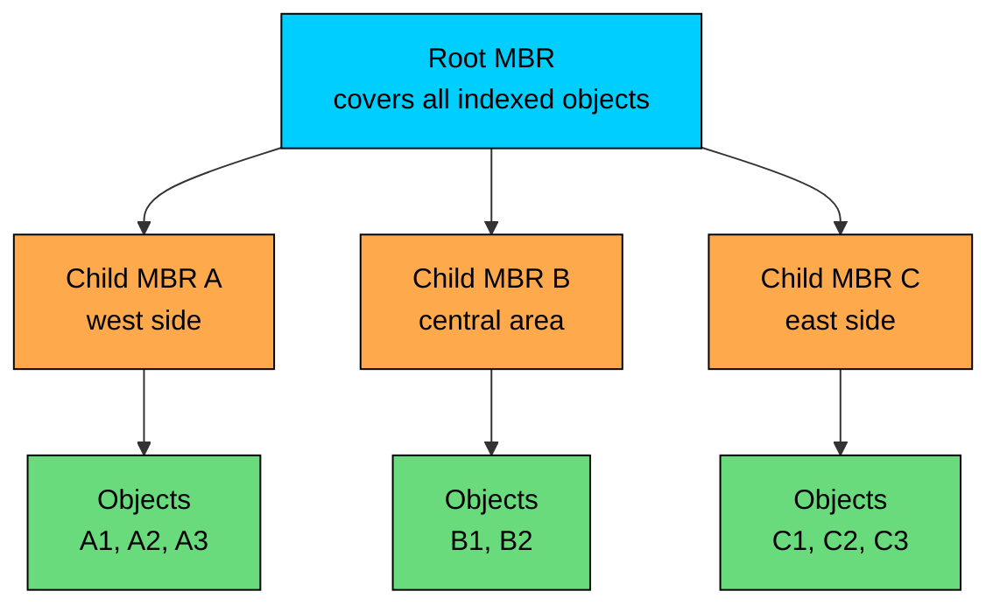
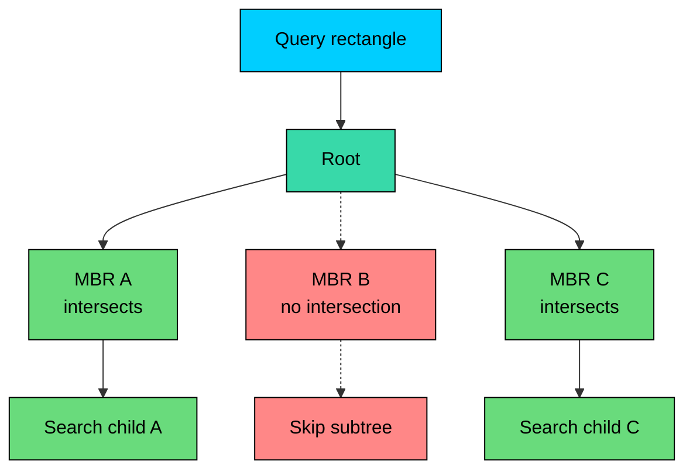

Many spatial systems need to query objects by shape, such as points, rectangles, lines, and polygons.

An **R-tree** indexes objects by their minimum bounding rectangles. Queries use those rectangles to skip large parts of the dataset before running exact geometry checks.

R-trees are a strong fit for database-backed spatial queries. Their main trade-off is overlap: when bounding rectangles overlap heavily, a search may need to follow multiple branches.

---

# 1. The Problem with Spatial Data

Suppose a food delivery service stores restaurants and delivery zones. Each restaurant has a location, but each delivery zone may be a polygon.

Common queries include:

- Which restaurants are visible in this map viewport"
- Which delivery zones contain this customer location"
- Which stores are within 2 km of this point"
- Which roads or neighborhoods intersect this polygon"

The brute-force approach checks every object:

This is `O(n)` per query. With millions of shapes, it is too slow for interactive maps, marketplace search, or high-volume backend APIs.

## 1.1 Why a B-Tree Is Not Enough

A B-tree can help with one dimension:

That index can narrow a latitude range. It does not understand longitude at the same time, and it does not understand that a polygon overlaps another polygon.

A composite B-tree on `(latitude, longitude)` can help some bounding-box queries, but it still imposes a one-dimensional sort order. Spatial predicates such as `intersects`, `contains`, and `nearest` need an index that can reason about regions.

## 1.2 The Bounding Box Pattern

Spatial systems commonly use a two-stage filter:

1. Use cheap bounding rectangles to find candidates.
2. Run exact geometry checks on the candidates.

For example, a complex polygon can be wrapped by a simple rectangle:

The rectangle may return false positives, but it should not return false negatives. Exact geometry filtering removes candidates whose bounding boxes overlap but whose actual shapes do not.

R-trees organize those bounding boxes efficiently.

---

# 2. What Is an R-Tree"

> [!PAYWALL] This content is for premium members only.

An **R-tree** is a balanced tree for spatial objects. Each entry stores a **Minimum Bounding Rectangle (MBR)**, also called a bounding box.

The MBR is the smallest axis-aligned rectangle that fully contains the object.

For a point, the MBR can be a zero-area rectangle.

For a road, it is the rectangle covering the line.

For a polygon, it is the rectangle covering the polygon.

Each internal node stores bounding rectangles for its child nodes. Each child rectangle contains every object below that child.

Important properties include balanced height, page-oriented layout, a bounding hierarchy, allowed overlap, and node fill limits. All leaves are at the same depth, nodes hold many entries for database-page behavior, and every parent rectangle covers its children.

Overlap is the core trade-off. It makes R-trees flexible for arbitrary rectangles and shapes, but it also means a query may inspect several branches.

---

# 3. How R-Tree Search Works

The most common R-tree query is a **window query**: find all objects whose bounding boxes intersect a query rectangle.

Algorithm:

1. Start at the root.
2. For each entry in the node, check whether the entry MBR intersects the query rectangle.
3. If it does not intersect, skip that subtree.
4. If it intersects and the entry points to a child node, descend into that child.
5. If it intersects and the entry is a leaf object, return it as a candidate.
6. Run exact geometry checks if the query needs more than bounding-box intersection.

This is fast when bounding rectangles are selective. It is weaker when many rectangles overlap the query or each other.

## 3.1 False Positives

R-tree search often returns candidates by bounding box first.

Consider a crescent-shaped polygon. Its bounding box may intersect a query rectangle even if the actual crescent does not.

That is expected. Spatial databases use the index as a pre-filter, then evaluate the exact predicate:

Under the hood, the spatial index narrows candidates using bounding boxes. The exact `ST_Intersects` check enforces correctness.

## 3.2 Nearest Neighbor Search

Nearest-neighbor search uses branch-and-bound:

1. Order nodes by the minimum possible distance from the query point to the node MBR.
2. Visit the most promising node first.
3. Keep the best object found so far.
4. Stop exploring branches whose minimum possible distance is worse than the best candidate.

Databases may expose this through KNN search operators or specialized nearest-neighbor functions, depending on the engine.

---

# 4. Insert, Split, and Overlap

Insertion is where R-tree quality is determined.

To insert an object:

1. Start at the root.
2. At each internal node, choose the child whose MBR needs the least enlargement to include the new object.
3. Insert into the selected leaf.
4. If the leaf overflows, split it.
5. Propagate MBR changes and splits upward.

The hard part is splitting.

When a node has too many entries, the implementation must divide them into two nodes. A poor split creates large, overlapping rectangles. That causes future queries to visit more branches.

Common split strategies:

| Strategy | Idea | Trade-off |
|----------|------|-----------|
| **Linear split** | Cheap seed selection and greedy assignment | Fast inserts, weaker tree quality |
| **Quadratic split** | Chooses seeds that would waste the most area if grouped together | Better grouping, more CPU |
| **R\*-tree split** | Minimizes overlap, margin, and area; may reinsert entries | Better query performance, more complex writes |

For read-heavy spatial workloads, better split quality usually pays for itself. For very write-heavy workloads, the extra insertion cost may matter.

---

# 5. R-Tree Variants

## 5.1 R\*-Tree

The **R\*-tree** improves insertion and splitting to reduce overlap and coverage.

Key ideas:

- choose subtrees using overlap enlargement near the leaf level
- split nodes by considering overlap, area, and perimeter
- sometimes remove and reinsert entries instead of splitting immediately

R\*-trees are widely used because overlap reduction often improves query performance significantly.

## 5.2 R+-Tree

The **R+-tree** avoids overlap between internal nodes by allowing objects to be duplicated across multiple nodes when they cross boundaries.

This can improve search because fewer branches overlap. The cost is more storage and more complicated updates.

R+-trees are attractive for read-heavy workloads with many intersection queries, but they are less convenient when objects are large or frequently updated.

## 5.3 Hilbert R-Tree

A **Hilbert R-tree** orders objects using a Hilbert space-filling curve. Nearby objects in two-dimensional space tend to have nearby Hilbert values.

That ordering helps produce more predictable node grouping and can work well for bulk loading.

## 5.4 Bulk-Loaded R-Trees

For static or mostly static datasets, bulk loading can build a better tree than inserting rows one at a time.

A common approach is Sort-Tile-Recursive (STR):

1. Sort objects spatially.
2. Divide them into tiles.
3. Pack leaf pages densely.
4. Build upper levels from those packed leaves.

Bulk loading is common in GIS, map tiles, and analytical datasets where the index can be rebuilt offline.

---

# 6. Database Reality

It is useful to understand R-trees, but most production teams should not implement one inside an application service unless they have a strong reason.

Use the database or spatial engine when it already provides the index, concurrency control, persistence, query planner integration, and exact geometry functions.

## 6.1 PostGIS

PostGIS commonly uses GiST indexes for spatial data. Conceptually, the geometry index behaves like an R-tree implemented through PostgreSQL's GiST framework.

Two practical details matter:

- The query must use spatial-index-aware predicates, such as `ST_DWithin`, `ST_Intersects`, or `ST_Contains`.
- Coordinate systems matter. `geometry` operates in the units of its spatial reference system. `geography` handles spheroidal Earth calculations but has different performance characteristics.

## 6.2 MySQL

MySQL supports `SPATIAL` indexes on spatial columns. Current MySQL documentation describes spatial indexes as R-tree indexes.

Use the database's spatial functions rather than manually splitting latitude and longitude into separate indexed columns.

## 6.3 SQLite

SQLite provides an R\*Tree module as a virtual table. It is commonly used for local geospatial lookup, map applications, and embedded indexing.

The R\*Tree table stores bounding boxes. Application tables usually store the full object attributes and geometry.

## 6.4 MongoDB

MongoDB supports geospatial indexes, especially `2dsphere` for GeoJSON and spherical queries.

Do not describe MongoDB `2dsphere` as a plain R-tree. Treat it as a database-provided geospatial index with its own behavior, query operators, and spherical semantics.

---

# 7. R-Trees in System Design

R-trees are a good fit when the system needs durable or query-planner-integrated spatial search over shapes. Common examples include map viewport queries over roads, buildings, and parcels; polygon intersection and containment; geofencing; spatial joins; nearest facility lookup; and collision candidates for mostly static objects.

They are a weaker fit for very high-rate live-location updates where objects move every few seconds. A live driver marketplace may use an in-memory grid, H3/S2 cells, Redis GEO, or a custom spatial service for current positions, while storing historical shapes and durable geospatial data in a spatial database.

For AI systems, R-trees often sit in the retrieval path. For example, an incident-response system may first retrieve facilities, roads, and sensors intersecting an affected polygon, then pass those candidates to a ranking model or optimization service. The R-tree reduces the candidate set before expensive model inference or routing logic runs.

---

# 8. Code Implementation (Python)

This implementation demonstrates insertion, splitting, and range search. It is intentionally compact, but unlike many toy examples, it propagates root splits so inserted objects remain searchable.

For production code, use a mature library or database index. Correct deletion, bulk loading, concurrency, persistence, and query planning are substantial work.

Expected output:

---

# 9. R-Tree vs Other Spatial Indexes

| Index | Strengths | Weaknesses | Good Fit |
|-------|-----------|------------|----------|
| **R-tree** | Handles rectangles, polygons, overlap, and spatial joins | Overlap can cause multiple branch visits; implementation is complex | Spatial databases, GIS, shape queries |
| **Quad Tree** | Simple in-memory 2D partitioning, adaptive detail | Can become unbalanced; weaker for complex shapes | Games, live point lookup, custom in-memory indexes |
| **Geohash** | String key, prefix scans, easy storage and sharding | Boundary issues, rectangular grid, latitude distortion | Simple proximity lookup and coarse partitioning |
| **KD-tree** | Efficient nearest-neighbor search for point data | Poor fit for frequent updates and complex shapes | Static or mostly static point datasets |
| **S2 / H3** | Hierarchical global cell systems | Different query model from shape indexes | Global covering, analytics, regional aggregation |

Choose R-trees when shape-aware queries matter. Choose a grid or cell system when partitioning, bucketing, and operational routing are the main problem.

---

# 10. Key Takeaways

R-trees index spatial objects by their minimum bounding rectangles.

They are designed for multidimensional predicates such as intersection, containment, range search, and nearest-neighbor search.

The index usually acts as a candidate generator. Exact geometry checks are still required for predicates involving real shapes.

Performance depends heavily on overlap, split quality, data distribution, and query shape. Avoid presenting R-trees as guaranteed `O(log n)` for every spatial query.

In modern production systems, prefer mature spatial indexes from PostGIS, MySQL, SQLite, search engines, or geospatial libraries unless there is a clear reason to implement your own.

---

# Quiz
