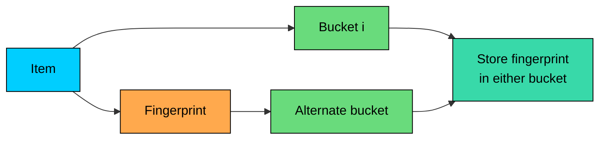

Some systems need approximate membership checks, but also need deletion.

A **Cuckoo Filter** is a probabilistic membership structure similar in spirit to a Bloom Filter. It answers "probably present" or "definitely absent," but stores small fingerprints in buckets instead of setting bits.

The main attraction is that Cuckoo Filters can support deletion without rebuilding the whole filter, as long as the implementation tracks fingerprints correctly.

---

# 1. The Problem with Deleting from Bloom Filters

Standard Bloom Filters cannot safely delete individual items. When an item sets several bits, those bits may also be used by other items. Clearing them can create false negatives for items that are still present.

Counting Bloom Filters solve this by replacing bits with counters, but that costs more memory and introduces counter overflow concerns.

Cuckoo Filters take a different approach. They store short fingerprints in candidate buckets. To delete an item, the filter removes the matching fingerprint from one of its possible buckets.

---

# 2. How a Cuckoo Filter Stores Items

> [!PAYWALL] This content is for premium members only.

For each item, a Cuckoo Filter computes:

1. A short fingerprint of the item.
2. A primary bucket index.
3. An alternate bucket index derived from the primary index and fingerprint.

The item's fingerprint can live in either bucket. A lookup checks both buckets. If the fingerprint appears in either one, the item is probably present. If it appears in neither, the item is definitely absent.

The filter does not store the original item. It stores only fingerprints, so false positives are possible when different items produce the same fingerprint.

---

# 3. Insert and Eviction

Insertion starts by trying the two candidate buckets. If either bucket has space, the filter stores the fingerprint there.

If both buckets are full, the filter evicts an existing fingerprint from one bucket and moves that evicted fingerprint to its own alternate bucket. This can trigger a short chain of evictions.

If the chain cannot find space after a configured number of kicks, insertion fails. Production systems must handle that failure by resizing, rebuilding, or routing to a fallback structure.

---

# 4. Lookup and Delete

Lookup is cheap:

1. Compute the fingerprint.
2. Check the primary bucket.
3. Check the alternate bucket.
4. Return probably present if either bucket contains the fingerprint.

Deletion follows the same lookup path. If the fingerprint is found, remove one copy from one of the candidate buckets.

This is why deletion works better than in a standard Bloom Filter. The structure removes a stored fingerprint rather than clearing shared bits.

---

# 5. Where Cuckoo Filters Fit

Cuckoo Filters are useful when a system needs compact approximate membership plus deletion. Examples include cache admission and eviction tracking, stream deduplication with expiry, security blocklists, storage-engine pre-checks, and distributed systems that need to remove stale keys.

They are a weaker fit when insertion failure is unacceptable, the filter is expected to run near full capacity, or false positives would cause product correctness problems.

---

# 6. Design Trade-offs

| Decision | Effect |
|----------|--------|
| Fingerprint size | Larger fingerprints reduce false positives but use more memory |
| Bucket size | Larger buckets reduce insertion failures but increase lookup work |
| Load factor | High load improves memory efficiency but makes insertion failures more likely |
| Max kicks | More kicks improve insertion success but increase tail latency |
| Resize policy | Determines what happens when insertions start failing |

The main operational mistake is treating a Cuckoo Filter as if insertion always succeeds. Unlike a Bloom Filter, a full Cuckoo Filter can reject new inserts.

---

# 7. Code Implementation (Python)

This implementation is intentionally small. It demonstrates fingerprints, two candidate buckets, insertion with evictions, lookup, and deletion.

Production implementations need stronger hashing, careful serialization, concurrency control, monitoring for load factor, and a resize/rebuild path.

Expected output:

---

# 8. Cuckoo Filter vs Bloom Filter

| Structure | Strengths | Weaknesses |
|-----------|-----------|------------|
| **Bloom Filter** | Simple, fast inserts, compact, no insertion failure before saturation semantics degrade | No safe deletion in standard form |
| **Counting Bloom Filter** | Supports deletion through counters | More memory, counter overflow risk |
| **Cuckoo Filter** | Supports deletion, often good lookup locality | Insertions can fail at high load; implementation is more complex |

Use a Bloom Filter when append-only membership checks are enough. Use a Cuckoo Filter when deletion is important and you can handle insertion failure or resizing.

---

# 9. Key Takeaways

Cuckoo Filters provide approximate membership with support for deletion.

They store fingerprints in one of two candidate buckets. Lookup checks both buckets, and deletion removes the matching fingerprint.

They can return false positives, but a correctly used filter should not return false negatives for inserted items that have not been deleted.

The key operational concern is insertion failure at high load. Production designs need a resize, rebuild, or fallback strategy.
