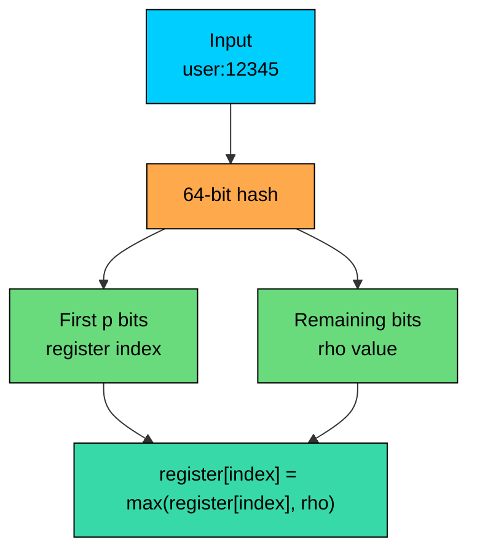
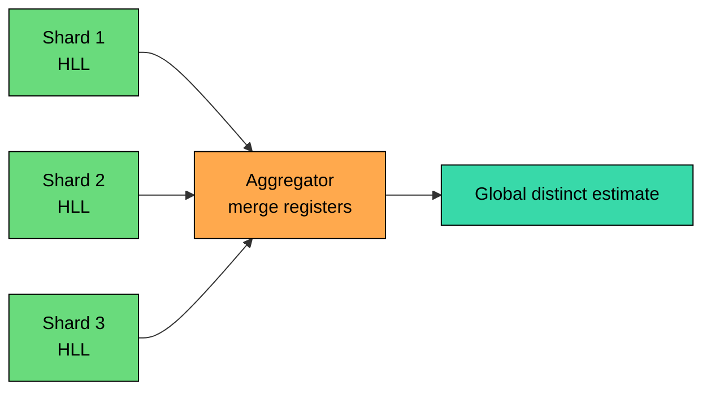

Analytics systems often need distinct counts across shards, time buckets, tenants, and experiments.

**HyperLogLog** estimates cardinality using a compact, mergeable sketch. It can combine summaries from many producers without moving raw identifiers.

HyperLogLog trades exactness for fixed memory. It cannot answer membership queries, list elements, or delete individual items.

---

# 1. The Counting Problem

The exact approach is a set:

This is exact, but memory grows with the number of unique items.

The real memory cost is usually much higher than the raw ID size. A set stores keys, hash-table metadata, load-factor slack, object headers, allocator overhead, and sometimes string contents. A billion distinct identifiers can easily mean many gigabytes.

Now multiply that by dimensions such as page, tenant, country, device type, hour, experiment variant, and retention period.

Exact sets become expensive quickly.

| Question | Exact Set Cost | HyperLogLog Cost |
|----------|----------------|------------------|
| Daily unique users | Grows with unique users | Fixed by sketch precision |
| Weekly unique users | Requires deduping all days | Merge daily sketches |
| Unique users per page | One set per page | One sketch per page |
| Global unique users across shards | Shuffle IDs or sets | Merge sketches |

HyperLogLog is useful when the exact identities are not needed after counting.

---

# 2. The Core Idea

> [!PAYWALL] This content is for premium members only.

HyperLogLog relies on uniform hashing.

If a hash function behaves like random bits, the position of the first `1` bit tells us something about how many distinct values we have likely seen.

For random binary hashes:

Seeing a hash with 10 leading zeros is uncommon. It suggests the stream has probably contained many distinct items.

A single observation is noisy, so HyperLogLog does not keep one maximum. It keeps many small registers and combines their estimates.

---

# 3. Registers

HyperLogLog splits each hash into two parts:

1. The first `p` bits choose a register.
2. The remaining bits are used to compute `rho`, the position of the first `1` bit.

If `p = 14`, there are `2^14 = 16,384` registers.

Each register tracks the largest `rho` value seen for items assigned to that register.

Duplicates do not matter. The same input hashes to the same register and same `rho`, so adding it again does not change the sketch.

---

# 4. Estimation

After processing the stream, HyperLogLog estimates cardinality from the register values.

The raw estimate is:

This is based on a harmonic mean. The harmonic mean reduces the effect of registers with unusually large values, which would otherwise pull the estimate upward.

Production implementations also apply corrections for small cardinalities, large cardinalities, and estimator bias. For example, they may use linear counting when many registers are still zero, account for hash-space saturation near the hash width, or use empirically tuned bias corrections.

The standard relative error is approximately:

| Precision `p` | Registers | Dense Size at 6 Bits/Register | Standard Error |
|---------------|-----------|-------------------------------|----------------|
| 10 | 1,024 | 768 bytes | ~3.25% |
| 12 | 4,096 | 3 KB | ~1.63% |
| 14 | 16,384 | 12 KB | ~0.81% |
| 16 | 65,536 | 48 KB | ~0.41% |

The 12 KB number comes from a dense representation with 16,384 six-bit registers. Redis uses this configuration. Other systems may use different precision, sparse encodings, or serialized formats.

> 💡 **Key Insight:**

> **TIP**
>
> HyperLogLog memory is constant for a chosen precision, not universally 12 KB. The sketch size is a design choice.

### Simulation

<!-- Simulation: hyperloglog -->

---

# 5. Mergeability

The most important engineering property of HyperLogLog is mergeability.

To merge two sketches with the same precision and hash function, take the element-wise maximum of their registers:

The merged sketch estimates the cardinality of the union.

This makes HyperLogLog useful in distributed systems:

Common patterns include merging hourly sketches into a daily sketch, shard-local sketches into a global sketch, per-region sketches into a worldwide estimate, or stored daily sketches into weekly and monthly reports.

The merge works only when the sketches use compatible parameters: same hash function, same precision, and same interpretation of register values.

---

# 6. Where HyperLogLog Works Well

HyperLogLog is a good fit for high-cardinality analytics where approximate counts are acceptable: active users, unique visitors per page, distinct API callers, unique search queries, unique IPs or network flows, ad reach, experiment reach, and rough deduplication metrics.

It is a poor fit when you need exact billing numbers, membership queries, enumeration, individual deletion, reliable small intersections, or protection against adversarially chosen inputs.

HyperLogLog estimates cardinality. It is not a set.

---

# 7. Sliding Windows and Time Buckets

Standard HyperLogLog cannot remove one item. Once a register increases, the sketch does not know which item caused it.

For time windows, use buckets:

When a bucket expires, drop the whole sketch. This gives bounded memory and avoids per-item deletion.

The trade-off is window granularity. Minute buckets approximate a rolling hour more closely than hourly buckets, but they require more sketches.

---

# 8. Intersections

Union is native. Intersection is not.

You can estimate intersection with inclusion-exclusion:

This can be very noisy when the intersection is small relative to the sets. Small errors in `|A|`, `|B|`, and `|A union B|` get subtracted from each other.

For accurate set intersections, consider other sketches such as Theta sketches, MinHash for similarity, or exact sets when the data size permits.

---

# 9. Production Examples

## 9.1 Redis

Redis provides HyperLogLog through:

Redis HyperLogLog uses up to 12 KB per key and has a standard error of 0.81%.

Example:

Redis HLLs are useful for operational counters and rough analytics. They are not appropriate for billing, fraud decisions, or anything requiring exact user-level evidence.

## 9.2 BigQuery

BigQuery supports HyperLogLog++ sketch functions:

Use `APPROX_COUNT_DISTINCT` when you only need the result now. Use `HLL_COUNT.INIT`, `HLL_COUNT.MERGE`, and `HLL_COUNT.EXTRACT` when you want materialized sketches that can be stored and re-aggregated.

## 9.3 Trino

Trino exposes HyperLogLog sketches directly:

This pattern is common in data warehouses: store sketches at a fine grain, then merge them later for coarser reports.

## 9.4 Sketch Libraries

Apache DataSketches provides production-grade sketch implementations, including HLL. It also documents an important caveat: HLL is primarily for distinct counting and unions. If you need intersections or differences with good accuracy, use a sketch family designed for set expressions.

---

# 10. Code Implementation (Python)

This implementation is for learning. It uses a 64-bit BLAKE2b hash and a dense register array.

Real systems should use a tested implementation with known bias corrections, serialization compatibility, and stable hash behavior.

Expected output:

---

# 11. Design Checklist

Before using HyperLogLog in a system design, decide:

- What precision do you need"
- Is approximate counting acceptable for this product decision"
- Do you need to store sketches and merge them later"
- Are all producers using the same hash function and precision"
- What time-bucket size do you need for rolling windows"
- Do you need deletion, membership, intersection, or enumeration"
- Could inputs be adversarial"

The biggest production mistakes are using HLL where exactness is required, mixing incompatible sketches, and treating intersection estimates as reliable when the overlap is small.

---

# 12. Key Takeaways

HyperLogLog estimates the number of distinct items using a compact sketch.

Its accuracy is controlled by the number of registers: more registers mean lower error and more memory.

The merge operation is the reason HyperLogLog is so useful in distributed analytics. You can combine sketches from shards, time buckets, and regions without moving raw IDs.

HyperLogLog cannot answer membership queries, cannot list elements, cannot delete individual elements, and is weak for small intersections.

Use it for high-cardinality approximate distinct counts. Use exact sets, Theta sketches, MinHash, or other structures when the query semantics require them.

---

# Quiz
