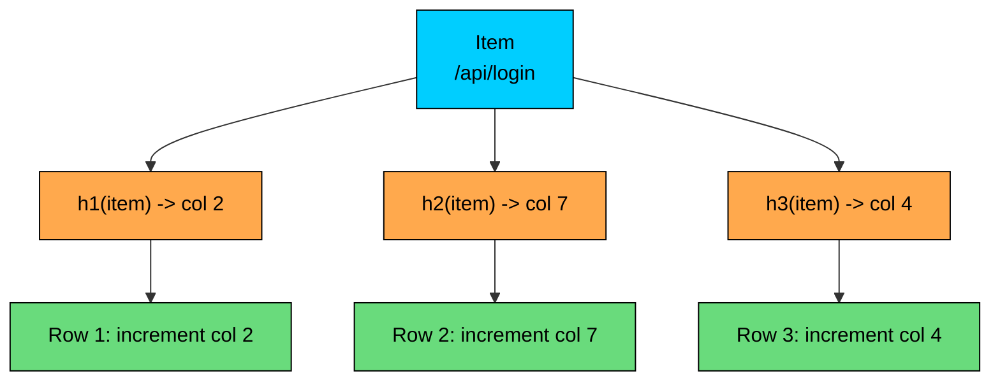
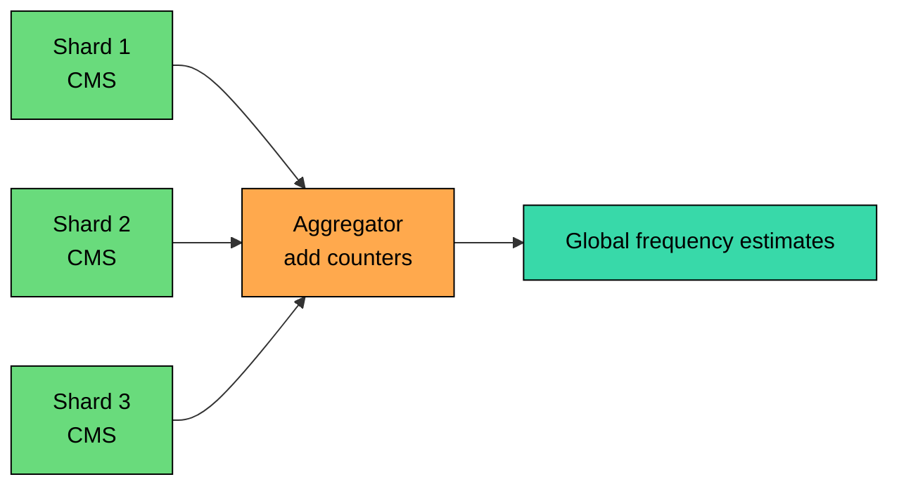
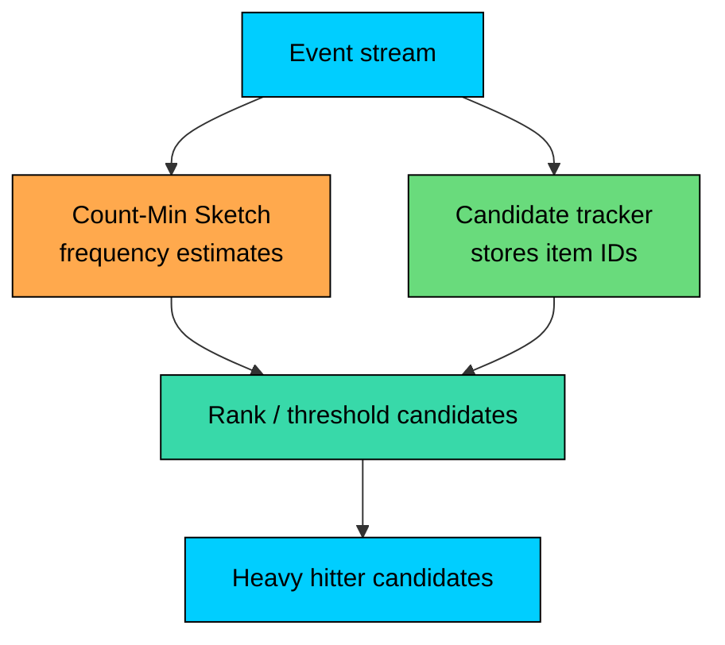

Streaming systems often need frequency estimates for large, unbounded, or distributed event streams.

A **Count-Min Sketch** estimates item counts with a fixed-size matrix of counters. Compatible sketches can be merged across shards by adding corresponding counters.

Count-Min Sketch never underestimates in the standard non-negative update model, but hash collisions can cause overestimation. It estimates counts for queried items; it does not enumerate items by itself.

---

# 1. The Problem with Exact Frequency Counting

The exact approach is a hash map:

This is exact and simple, but every distinct item carries more than just a counter. The system also stores the key, hash-table metadata, allocator overhead, and any replication or checkpointing cost.

In a stream with millions or billions of distinct keys, exact maps become expensive. They are also hard to merge efficiently if every shard has a large local map.

Count-Min Sketch is useful when the stream is large, approximate counts are acceptable, memory must be bounded, and sketches need to merge across partitions. It is not useful when you need exact counts, item enumeration, or accurate counts for rare items.

---

# 2. What Count-Min Sketch Stores

> [!PAYWALL] This content is for premium members only.

A Count-Min Sketch is a matrix of counters with `d` rows, `w` columns, and one hash function per row.

To add an item with count `c`, increment one counter in every row:

To estimate an item's count, read the same counters and take the minimum:

The minimum is used because collisions only add extra counts. If one row is polluted by another item, another row may have fewer collisions.

---

# 3. Error Guarantees

In the standard insertion-only model with non-negative counts, Count-Min Sketch has this property:

It never underestimates. It may overestimate because unrelated items collide into the same counters.

The common probabilistic bound is:

Where:

- `N` is the total count added to the sketch
- `epsilon` controls additive error
- `delta` controls failure probability

Sizing:

| Target | epsilon | delta | Width | Depth | Memory with 32-bit Counters |
|--------|---------|-------|-------|-------|-----------------------------|
| Rough | `0.01` | `0.10` | 272 | 3 | ~3.2 KB |
| Standard | `0.001` | `0.01` | 2,719 | 5 | ~53 KB |
| Higher accuracy | `0.0001` | `0.001` | 27,183 | 7 | ~743 KB |
| Very high accuracy | `0.00001` | `0.0001` | 271,829 | 10 | ~10.4 MB |

The error is additive against total stream volume, not relative to the item.

That matters:

- For an item with count `1,000,000`, an error of `10,000` is small.
- For an item with count `100`, an error of `10,000` makes the estimate useless.

Count-Min Sketch is best for frequent items and threshold-style monitoring. It is weak for rare-item accuracy.

---

# 4. Mergeability

Count-Min Sketch is mergeable.

To merge two compatible sketches, add corresponding counters:

The merged sketch estimates frequencies over the union of both streams.

This only works when sketches use the same:

- width
- depth
- hash functions
- counter semantics

Mergeability is why Count-Min Sketch fits stream processors, network collectors, telemetry pipelines, and edge aggregation.

---

# 5. Heavy Hitters

Count-Min Sketch estimates counts for items you query. It does not list the items it has seen.

This is an important distinction.

If you ask:

> How many times did `/api/login` occur"

CMS can answer.

If you ask:

> What are the top 100 endpoints"

CMS alone cannot answer because it does not store item identities.

To detect heavy hitters, pair CMS with a candidate-tracking structure such as a bounded heap, a candidate set from recent events, Space-Saving, Misra-Gries, or an exact map for a small candidate pool.

Be careful with guarantees. A naive heap that only admits items after their CMS estimate crosses a threshold can miss a real heavy hitter if the candidate policy is wrong or if the heap evicts it too early.

For heavy-hitter enumeration with stronger semantics, algorithms such as Space-Saving or Misra-Gries are often a better primary choice. CMS can still be useful as an estimator or secondary filter.

### Simulation

<!-- Simulation: count-min-sketch -->

---

# 6. Conservative Update

Standard CMS increments all `d` counters for an item.

**Conservative update** first reads the current estimate, then only increments counters that are equal to the current minimum.

This often reduces overestimation in practice, but it is slightly more expensive because it must read before writing. It can also change merge behavior if different shards used conservative updates independently.

For distributed systems, standard additive CMS is easier to reason about. Conservative update is most attractive inside a single process or when merge semantics are well understood for the implementation.

---

# 7. Sliding Windows

Standard CMS does not know how to expire old events.

For "last hour" queries, use time buckets:

When a bucket expires, drop the whole sketch.

This gives bounded memory, but the cost is proportional to the number of active buckets if you query by merging on demand. Many systems maintain a rolling aggregate or use coarser buckets for cheaper queries.

If you need arbitrary deletions or exact expiration by item, CMS is usually the wrong structure.

---

# 8. Production Uses

## 8.1 RedisBloom

RedisBloom provides Count-Min Sketch commands:

Example:

Use it for approximate high-volume counters where false positives are acceptable or can be verified later.

## 8.2 Network Monitoring

CMS fits packet and flow monitoring because the stream is large and the key space is huge. Common keys include source IP, destination IP, source-destination pairs, source-port pairs, or full flow tuples.

The sketch can flag candidates above a packet or byte threshold. A second stage can verify or sample those candidates before alerting.

## 8.3 Stream Processing

In a stream processor, each worker can maintain a local sketch. Periodically, workers emit sketches to an aggregator. The aggregator merges them and serves approximate frequency queries.

This avoids shuffling raw event keys across the cluster.

## 8.4 Query Planning and Telemetry

Frequency sketches can help estimate high-cardinality value distributions such as URL path frequencies, customer event volumes, feature flag exposure counts, query-template frequencies, and hot partition keys.

For database query planning, CMS is only one possible summary. Histograms, top-N statistics, samples, and distinct-count sketches may be more appropriate depending on the predicate.

---

# 9. Code Implementation (Python)

This implementation is intentionally small and deterministic. It supports increment, estimate, merge, and conservative update as an option.

It does not enumerate heavy hitters. That requires a separate candidate-tracking structure.

Expected output:

The estimates for rare or missing items show the key limitation: collisions can create nonzero estimates even for items that did not appear.

---

# 10. Count-Min Sketch vs Alternatives

| Structure | Answers | Strength | Limitation |
|-----------|---------|----------|------------|
| **Exact hash map** | Exact frequency of each stored item | Accurate and enumerable | Memory grows with distinct items |
| **Count-Min Sketch** | Approximate frequency of a queried item | Fixed memory, mergeable | Overestimates; no enumeration |
| **Count Sketch** | Approximate frequency with signed counters | Better for streams with negative updates | Can under/overestimate |
| **Misra-Gries** | Frequent-item candidates | Strong heavy-hitter candidate tracking | Less useful for arbitrary point queries |
| **Space-Saving** | Top-k candidates | Practical heavy-hitter tracking | Stores only candidate items |
| **Bloom Filter** | Membership | Compact set membership | Does not count frequency |
| **HyperLogLog** | Distinct count | Compact cardinality estimate | Does not estimate per-item frequency |

Use CMS when point frequency estimates and mergeability matter. Use Space-Saving or Misra-Gries when heavy-hitter enumeration is the main requirement.

---

# 11. Design Checklist

Before using Count-Min Sketch, decide:

- What is the expected total count `N` per sketch"
- What additive error can the product tolerate"
- What failure probability is acceptable"
- Are counts insertion-only"
- Do you need to merge sketches"
- Do you need to enumerate heavy hitters"
- Are false positives acceptable, or will you verify candidates"
- Are inputs adversarial"
- Can counters overflow"

Operationally, watch the total count and counter width. A sketch sized for one hour of traffic may produce poor estimates if it accidentally accumulates a week of events.

---

# 12. Key Takeaways

Count-Min Sketch estimates item frequencies using fixed memory.

It never underestimates in the standard non-negative update model, but it can overestimate because of hash collisions.

Its error is additive in total stream volume, so it is most useful for frequent items and threshold monitoring.

It is mergeable when sketches share dimensions and hash functions.

It cannot enumerate items by itself. For top-k or heavy-hitter detection, pair it with a candidate-tracking algorithm or use a dedicated heavy-hitter sketch.

---

# Quiz
