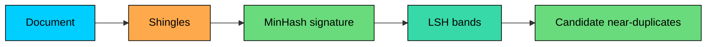

Many systems need to compare sets without comparing every element.

**MinHash** is a probabilistic technique for estimating Jaccard similarity between sets. It creates compact signatures that let systems compare documents, users, queries, or item sets efficiently.

It is useful when the question is not "how many distinct items exist"" but "how similar are these two sets""

---

# 1. The Similarity Problem

Suppose a system has millions of documents and needs to find near-duplicates. Comparing every pair directly is too expensive.

For two sets, Jaccard similarity is:

If two documents share many shingles, their Jaccard similarity is high. If they share few shingles, it is low.

The exact calculation requires the full sets. MinHash compresses each set into a fixed-size signature that approximates this similarity.

---

# 2. The Core Idea

> [!PAYWALL] This content is for premium members only.

For a single random hash function, hash every element in a set and keep the minimum hash value.

The surprising property is:

One hash is noisy. A MinHash signature uses many independent hash functions. The fraction of positions where two signatures match estimates Jaccard similarity.

---

# 3. Shingling

Text documents are usually converted into sets of shingles before MinHash is applied.

A shingle is a short contiguous sequence, such as a word 3-gram:

Shingling preserves local structure better than treating a document as an unordered bag of individual words.

The shingle size controls sensitivity. Small shingles catch more loose similarity but create more false matches. Larger shingles are stricter but may miss paraphrases or short edits.

---

# 4. Signatures

A MinHash signature is an array of minimum hash values:

To compare two documents, compare their signatures position by position. If 80 out of 100 positions match, the estimated Jaccard similarity is about `0.80`.

More signature positions reduce variance but use more memory and CPU.

---

# 5. Where MinHash Works Well

MinHash is a good fit for near-duplicate detection, plagiarism detection, web crawling deduplication, similar-user or similar-item candidate generation, log template similarity, and clustering large collections of sparse sets.

It is not a semantic similarity model. Two documents can mean the same thing with different wording and have low shingle overlap. Conversely, boilerplate text can make unrelated pages look similar unless common shingles are filtered.

---

# 6. MinHash and LSH

MinHash estimates similarity, but it does not by itself avoid comparing every signature to every other signature.

Large systems often pair MinHash with **Locality-Sensitive Hashing (LSH)**. LSH splits signatures into bands and hashes each band. Documents that share a band become candidates for exact or higher-quality comparison.

This two-stage pattern is common: LSH generates candidates, then another step verifies them.

---

# 7. Code Implementation (Python)

This implementation builds word-shingle sets, computes MinHash signatures, and compares estimated Jaccard similarity with exact Jaccard similarity.

Expected output:

---

# 8. MinHash vs Related Sketches

| Structure | Answers | Good Fit |
|-----------|---------|----------|
| **HyperLogLog** | How many distinct items" | Cardinality and unions |
| **MinHash** | How similar are two sets" | Near-duplicates and Jaccard similarity |
| **Theta Sketch** | Set size and set operations | More accurate intersections and differences |
| **Count-Min Sketch** | How often did this item appear" | Frequency estimates |

Use MinHash when similarity is the product question. Use HyperLogLog when distinct count is the product question.

---

# 9. Key Takeaways

MinHash creates compact signatures that estimate Jaccard similarity between sets.

It is useful for near-duplicate detection, candidate generation, and clustering sparse sets at scale.

It works best when set overlap is meaningful. For text, that usually means choosing a shingling strategy and filtering boilerplate carefully.

At large scale, MinHash is often paired with LSH so the system compares only likely candidates instead of every pair.
