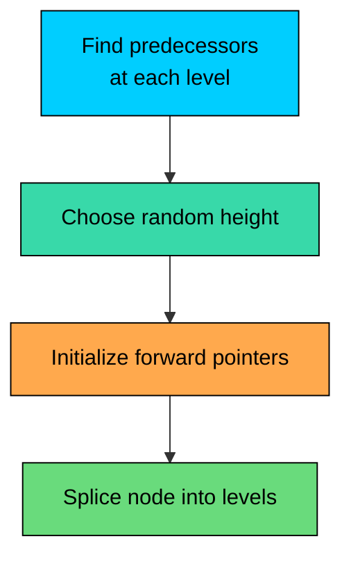
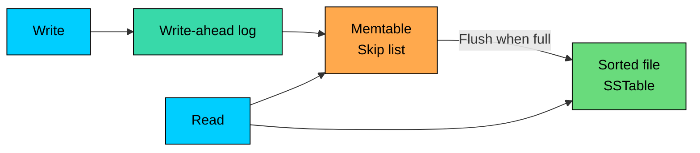

Many systems need an ordered in-memory structure for lookups, updates, range scans, and iteration.

A **Skip List** is a sorted linked list with probabilistic higher-level lanes. Those lanes let searches skip over large parts of the list while keeping updates local.

Skip lists provide expected `O(log n)` operations, not deterministic worst-case bounds. They are useful when simplicity, range scans, and concurrency-friendly updates matter more than strict balancing guarantees.

---

# 1. The Problem: Ordered Data with Fast Updates

Suppose you are building an in-memory index for a storage engine. New writes arrive continuously. Reads need to find individual keys, and flushes need to scan keys in sorted order before writing immutable files to disk.

The structure needs fast `get(key)`, `put(key, value)`, `delete(key)`, and `scan(start_key, end_key)` operations.

A plain linked list keeps sorted order, but search is linear:

A balanced tree gives logarithmic operations, but insertions and deletions may rotate nodes to preserve balance. That is fine in many systems. It becomes harder when several threads update the structure concurrently, range scans need stable ordered traversal, the implementation must stay small enough to audit, or the structure sits on a hot write path.

Skip lists take a different approach: instead of enforcing balance with rotations, they use randomness to build a hierarchy of shortcuts.

---

# 2. What Is a Skip List"

> [!PAYWALL] This content is for premium members only.

A **Skip List** is a probabilistic ordered data structure.

Level 0 is a normal sorted linked list containing every key. Higher levels contain a subset of the keys. The higher the level, the fewer nodes it contains.

<!-- Visualization -->

Each node stores the key, the value, and an array of forward pointers, one per level the node participates in.

When inserting a new node, the implementation randomly chooses the node's height. With probability `p`, the node is promoted to the next level. With `p = 0.5`, about half the nodes appear at level 1, one quarter at level 2, one eighth at level 3, and so on.

That random height distribution gives the structure its expected logarithmic behavior.

> 💡 **Key Insight:**

> **TIP**
>
> A skip list is not balanced by rotations. It is balanced statistically by random node heights.

---

# 3. Search

Search starts at the highest active level.

At each level:

1. Move right while the next key is less than the target.
2. If moving right would pass the target, move down one level.
3. Continue until level 0.

Searching for `50`:

Instead of scanning every node at level 0, the search uses sparse upper levels to get close to the target.

Expected search cost is `O(log n)`.

Worst-case search cost is `O(n)`, because the structure is probabilistic. With a good random generator and sensible maximum height, the bad case is rare enough for many production systems. If strict worst-case latency is mandatory, use a deterministic balanced tree or a B-tree-family structure.

---

# 4. Insert and Delete

## 4.1 Insert

Insertion has three steps:

1. Search for the position where the key belongs.
2. Record the predecessor node at each level.
3. Splice the new node into each level it participates in.

The important property is locality. Insertion changes a small set of forward pointers around the insertion point. There are no rotations that rewrite a subtree.

## 4.2 Delete

Deletion is similar:

1. Find the node and its predecessors at each level.
2. Update predecessor pointers to bypass the node.
3. Optionally reduce the current top level if it becomes empty.

In concurrent skip lists, deletion is usually split into two phases:

- **Logical deletion:** mark the node as deleted so other threads stop treating it as live.
- **Physical removal:** unlink the node from the list.

This separation lets other threads help finish deletion and avoids exposing partially removed nodes as valid results.

### Simulation

<!-- Simulation: skip-lists -->

---

# 5. Why Skip Lists Work Well in Concurrent Systems

Skip lists are useful in concurrent systems because updates are local and the structure has fewer global invariants than a balanced tree.

Balanced trees must preserve strict shape rules. Insertions and deletions may require rotations that modify parent, child, and sibling links. Fine-grained concurrent trees exist, but they are difficult to implement and verify.

Skip lists still require careful engineering. A concurrent skip list is not just a normal skip list with a few atomic pointers added. Correct implementations must handle compare-and-swap retries, logically deleted nodes, memory reclamation, ABA hazards in unmanaged languages, iterators observing concurrent changes, and the ordering guarantees required by the language or database.

The advantage is that the update path is easier to localize.

## 5.1 Compare-And-Swap

Lock-free skip lists commonly use compare-and-swap (CAS).

CAS means:

1. Read a pointer.
2. Check that it still has the expected value.
3. Replace it with a new value only if it was unchanged.

If another thread changed the pointer first, CAS fails and the operation retries from a known safe point.

## 5.2 Lock-Free Insert: Conceptual Flow

A lock-free insertion usually works bottom-up:

1. Find predecessors and successors for each level.
2. Link the new node at level 0 first.
3. Link higher levels one by one with CAS.
4. If a CAS fails, re-find the affected predecessors and retry.

Level 0 is the source of truth. Once the node is visible there, it is in the set. Higher levels are shortcuts; they can be repaired or completed by retries.

## 5.3 Lock-Free Delete: Conceptual Flow

Deletion usually works in the opposite direction:

1. Mark higher-level links so new searches do not rely on them.
2. Mark the level-0 link to make deletion logically visible.
3. Unlink the node physically from predecessor pointers.

This is why production lock-free skip lists are subtle. The high-level idea is simple. The memory-model details are not.

---

# 6. Skip Lists in Production Systems

Skip lists appear in real systems, but for different reasons in each one.

## 6.1 Redis Sorted Sets

Redis sorted sets maintain unique members ordered by score.

Common operations include adding or updating a member score, reading members by score range, reading members by rank, and removing score ranges.

For larger sorted sets, Redis uses a dictionary plus a skip list. The dictionary maps member to score for direct lookup, while the skip list maintains sorted order by `(score, member)`. Skip-list spans support rank operations efficiently.

This is not mainly about multi-threaded access inside Redis commands. Redis command execution is generally serialized per data structure. The skip list is used because it is a compact, practical ordered index for range and rank operations.

For small sorted sets, Redis may use a compact encoding instead of a skip list. The implementation changes with size and configuration, but the large sorted-set design is the important system-design idea.

## 6.2 LevelDB and RocksDB Memtables

LevelDB and RocksDB are LSM-tree storage engines. Recent writes first go to a **memtable**, an in-memory sorted structure. Later, the memtable is flushed to immutable sorted files on disk.

Skip lists fit memtables because they provide fast inserts for incoming writes, ordered iteration when flushing to disk, efficient point lookup before checking older files, and relatively small implementation complexity.

RocksDB supports multiple memtable representations, but the default implementation is skip-list based. RocksDB also supports concurrent memtable writes for skip-list memtables.

## 6.3 Java ConcurrentSkipListMap

Java's `ConcurrentSkipListMap` is a concurrent sorted map.

It is useful when you need both concurrency and sorted-map operations:

The Java API documents expected average logarithmic time for core operations such as `get`, `put`, `remove`, and `containsKey`.

Use it when ordering matters. If you only need concurrent key-value lookup without sorted traversal, a concurrent hash map is usually a better fit.

---

# 7. Performance and Memory

With promotion probability `p = 0.5`, the expected number of forward pointers per node is about 2.

That does not mean skip lists are always memory-light. Each node may carry object headers, allocation overhead, pointer arrays, key/value references, and optional span metadata. In managed runtimes, object layout can dominate the theoretical pointer count.

Expected performance:

| Operation | Expected Time | Notes |
|-----------|---------------|-------|
| Search | `O(log n)` | Probabilistic, not strict worst case |
| Insert | `O(log n)` | Includes search plus pointer updates |
| Delete | `O(log n)` | Concurrent versions often mark then unlink |
| Range scan | `O(log n + k)` | Find start, then walk `k` nodes at level 0 |
| Ordered iteration | `O(n)` | Simple level-0 traversal |

Practical tuning points include max level, promotion probability, allocator behavior, span metadata, and comparator cost. A lower `p` saves pointers but may lengthen searches; span metadata helps rank queries but adds memory and update cost.

---

# 8. Skip Lists vs Balanced Trees

Both structures are useful. The right choice depends on workload and implementation constraints.

| Aspect | Skip List | Balanced Tree |
|--------|-----------|---------------|
| Search | Expected `O(log n)` | Worst-case `O(log n)` |
| Insert/delete | Expected `O(log n)` with local pointer changes | Worst-case `O(log n)` with possible rotations |
| Range scans | Very natural through level 0 | Good through in-order traversal |
| Concurrency | Lock-free and fine-grained designs are practical | Possible, but rotations complicate updates |
| Implementation | Usually simpler | More invariants and edge cases |
| Memory | Extra forward pointers and node overhead | Fewer links per node in binary trees |
| Worst-case guarantee | Probabilistic | Deterministic |

Use a skip list when you need an ordered in-memory structure, range scans are common, concurrent updates matter, implementation simplicity matters, and expected performance is acceptable.

Use a balanced tree when strict worst-case bounds matter, memory overhead must be minimized, the platform already provides a reliable tree implementation, or single-threaded point operations dominate.

Use a B-tree or B+ tree when the structure is disk/page oriented, cache-line and page locality matter more than pointer-level simplicity, or you are building a durable database index.

---

# 9. Code Implementation (Python)

This implementation shows the mechanics of search, insert, delete, and range scan.

It is single-threaded. A correct concurrent skip list needs atomic operations and memory-model handling that Python does not expose at this level.

Expected output:

---

# 10. Key Takeaways

Skip lists maintain sorted order using a hierarchy of linked-list shortcuts.

They provide expected `O(log n)` search, insert, and delete operations, plus efficient range scans.

Their main engineering advantage is local pointer updates. That makes them easier to implement and adapt for concurrent sorted maps than many balanced-tree designs.

They do not provide deterministic worst-case bounds. They also have pointer and allocation overhead, and high-performance implementations require careful memory layout.

Use skip lists for ordered in-memory indexes, memtables, leaderboards, rank/range queries, and concurrent sorted maps. Use balanced trees or B-tree-family structures when worst-case guarantees, memory locality, or page-oriented storage matter more.

---

# Quiz
