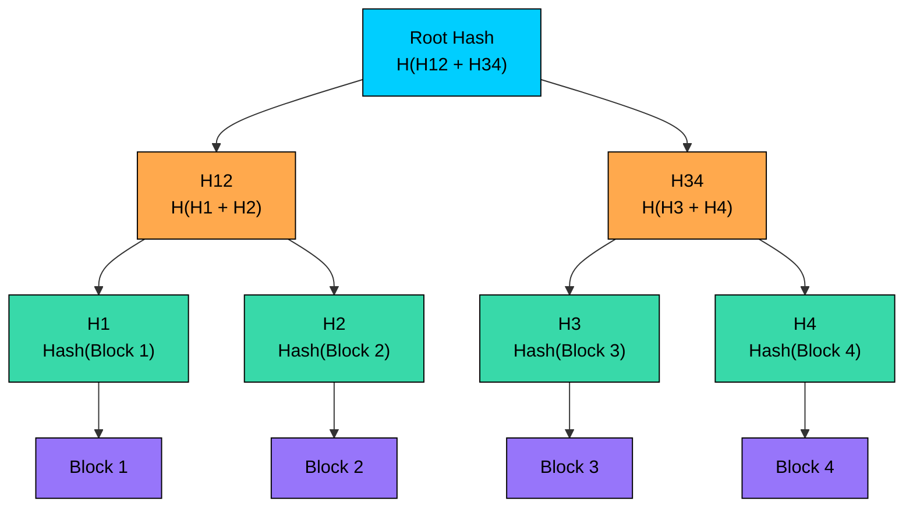
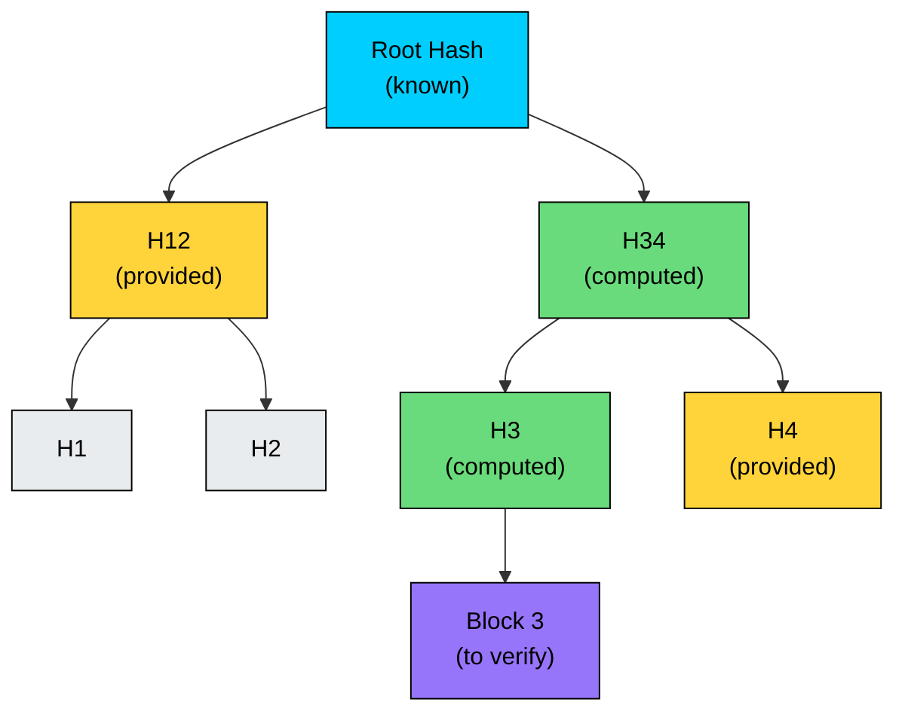
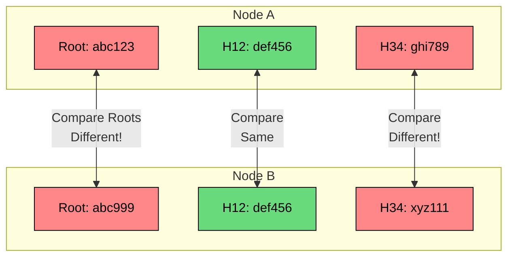
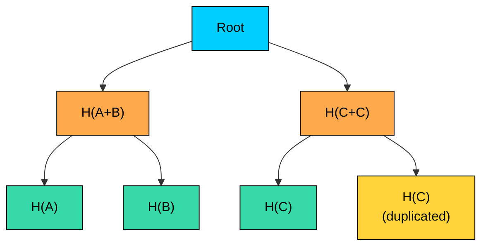
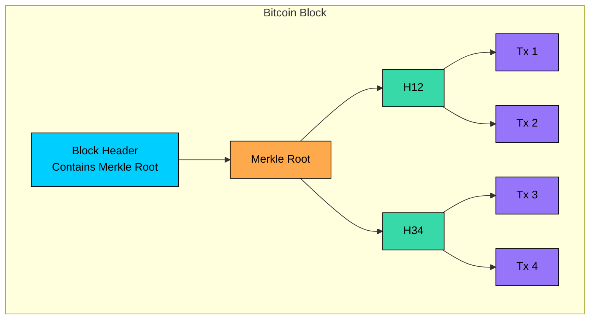

When you download a large file from the internet, how do you know it hasn't been corrupted or tampered with" You could compare a checksum of the entire file, but what if only one small piece is corrupted" You'd have to download the whole file again.

**Merkle Trees** solve this problem elegantly. They allow you to verify the integrity of large datasets efficiently, identifying exactly which parts are corrupted or different without checking everything.

Originally invented by **Ralph Merkle in 1979**, Merkle Trees are now a fundamental data structure in distributed systems. They power **Git's** version control, **Bitcoin's** transaction verification, and data synchronization in databases like **Cassandra** and **DynamoDB**.

In this chapter, we'll explore what Merkle Trees are, how they work, why they're so efficient, and how to implement one in code.

---

# 1. The Problem with Data Verification

Imagine you're building a **distributed database** that stores data across multiple nodes. Each node holds a copy of the data for redundancy. But here's the challenge: how do you efficiently detect when one node's data becomes out of sync with others"

```mermaid
flowchart TB
    subgraph Node1["Node 1"]
		direction TB
        D1[Data Block 1]
        D2[Data Block 2]
        D3[Data Block 3]
        D4[Data Block 4]
    end

    subgraph Node2["Node 2"]
		direction TB
        D5[Data Block 1]
        D6[Data Block 2]
        D7["Data Block 3 (corrupted)"]
        D8[Data Block 4]
    end

    Node1 <--> |"Sync""| Node2

    style D7 fill:#ff8787,stroke:#000,color:#000
    style D1 fill:#69db7c,stroke:#000,color:#000
    style D2 fill:#69db7c,stroke:#000,color:#000
    style D3 fill:#69db7c,stroke:#000,color:#000
    style D4 fill:#69db7c,stroke:#000,color:#000
    style D5 fill:#69db7c,stroke:#000,color:#000
    style D6 fill:#69db7c,stroke:#000,color:#000
    style D8 fill:#69db7c,stroke:#000,color:#000
```

### The Naive Approach: Compare Everything

The simplest solution is to compare every piece of data between nodes:

1. Hash each data block on Node 1
2. Hash each data block on Node 2
3. Compare all hashes to find differences

This works, but it's **inefficient**. If you have 1 million data blocks, you need to transfer and compare 1 million hashes just to find one corrupted block.

### A Better Approach: Single Hash

What if we compute a single hash of all the data"

Now we only need to compare one hash. But there's a problem: if the hashes don't match, we know *something* is different, but we don't know *what*. We'd have to fall back to comparing everything.

### The Solution: Merkle Trees

This is where Merkle Trees come in. They give us the best of both worlds:

- **Efficient detection**: Compare just one hash to know if anything is different
- **Efficient localization**: Quickly narrow down exactly which data is different using O(log n) comparisons

---

# 2. What is a Merkle Tree"

> [!PAYWALL] This content is for premium members only.

A **Merkle Tree** (also called a **hash tree**) is a binary tree where:

- **Leaf nodes** contain hashes of individual data blocks
- **Non-leaf nodes** contain hashes of their children's hashes
- **The root** (called the **Merkle Root**) is a single hash that represents the entire dataset



> 💡 **Key Insight:**

> **TIP**
>
> The key insight is that **any change to any data block will propagate up and change the root hash**. This makes tampering immediately detectable.

### How the Hashes Cascade

Let's trace through how changing a single block affects the entire tree:

1. **Block 3** is modified
2. **H3** changes (it's the hash of Block 3)
3. **H34** changes (it's the hash of H3 + H4)
4. **Root** changes (it's the hash of H12 + H34)

The changed hashes form a path from the modified leaf to the root. This path is crucial for efficient verification.

---

# 3. How Merkle Trees Enable Efficient Verification

The real power of Merkle Trees becomes apparent when we need to verify data or find differences. Let's look at both scenarios.

### 3.1 Verifying a Single Block (Merkle Proof)

Suppose you download Block 3 from an untrusted source and want to verify it's correct. You already know the trusted Merkle Root.

Instead of downloading all blocks and recomputing the entire tree, you only need the **Merkle Proof**, a small set of hashes that lets you verify Block 3.



**The Merkle Proof for Block 3 contains:**

- H4 (the sibling of H3)
- H12 (the sibling of H34)

#### **Verification steps:**

1. Compute `H3 = Hash(Block 3)`
2. Compute `H34 = Hash(H3 + H4)` using the provided H4
3. Compute `Root = Hash(H12 + H34)` using the provided H12
4. Compare computed Root with the trusted Root

If they match, Block 3 is verified. With just **2 hashes** (O(log n)), we verified one block among many.

### 3.2 Finding Differences Between Two Trees

Now let's see how Merkle Trees help two nodes synchronize their data efficiently.

**Scenario:** Node A and Node B each have a Merkle Tree. They want to find which blocks are different.



#### **Synchronization Algorithm:**

1. **Compare root hashes**
   - If equal: Trees are identical, done
   - If different: Proceed to children
2. **Compare H12 hashes**
   - They match (def456), so Blocks 1 and 2 are identical
   - No need to check these blocks
3. **Compare H34 hashes**
   - They differ, so the problem is in Blocks 3 or 4
   - Continue drilling down
4. **Compare H3 and H4 hashes**
   - Find exactly which block(s) differ

With this approach, finding differences in a tree with **1 million blocks** takes at most **20 comparisons** (log2 of 1 million) instead of 1 million.

---

# 4. Building a Merkle Tree

Let's walk through constructing a Merkle Tree step by step.

### Step 1: Hash the Data Blocks

Start with your data blocks and compute a hash for each one.

### Step 2: Pair and Hash

Combine adjacent hashes and hash them together to create the next level.

### Step 3: Handle Odd Numbers

What if you have an odd number of blocks" The common approach is to **duplicate the last hash**.



This ensures the tree remains balanced, maintaining O(log n) performance.

---

# 5. Code Implementation (Python)

Here's a complete implementation of a Merkle Tree:

**Output:**

**Key Methods:**

1. **`_build_tree()`**: Constructs the tree bottom-up, hashing pairs at each level
2. **`get_proof()`**: Returns the sibling hashes needed to verify a specific leaf
3. **`verify_proof()`**: Recomputes the root using the proof and checks against the known root

---

# 6. Real-World Applications

Merkle Trees are used throughout modern software systems. Here are the most common applications:

### 6.1 Git Version Control

Git uses Merkle Trees to track changes in repositories. Every commit is identified by a hash that depends on:

- The content of all files (as a tree of hashes)
- The parent commit's hash
- The commit metadata

This means any change to any file in history would change all subsequent commit hashes. It's why Git can quickly detect if a repository has been tampered with or corrupted.

### 6.2 Bitcoin and Blockchains

Bitcoin stores transactions in blocks, with each block containing a Merkle Tree of all transactions. This enables:

- **Efficient verification**: Light clients (SPV wallets) can verify a transaction is in a block without downloading all transactions
- **Tamper detection**: Changing any transaction would change the block's Merkle Root, invalidating the block



### 6.3 Distributed Databases (Cassandra, DynamoDB)

Distributed databases use Merkle Trees for **anti-entropy repair**, detecting and fixing inconsistencies between replicas:

1. Each node builds a Merkle Tree of its data
2. Nodes exchange Merkle Roots
3. If roots differ, they traverse down to find divergent data
4. Only the differing data is synchronized

Amazon's DynamoDB calls this process **Merkle Tree-based anti-entropy** and uses it to maintain consistency across geographically distributed replicas.

### 6.4 File Synchronization (rsync)

The rsync algorithm uses a similar concept. When synchronizing files:

1. The receiver computes checksums of file blocks
2. The sender identifies which blocks match and which differ
3. Only differing blocks are transferred

This dramatically reduces bandwidth for syncing large files with small changes.

### 6.5 Certificate Transparency

Certificate Transparency (CT) logs use Merkle Trees to create an append-only log of SSL/TLS certificates. This allows:

- Auditors to verify that certificates were properly logged
- Detection of rogue or misissued certificates
- Proof that the log hasn't been tampered with

---

# 7. Merkle Trees vs Other Data Structures

| Feature | Hash List | Merkle Tree | Bloom Filter |
|---------|-----------|-------------|--------------|
| **Verify single element** | O(n) | O(log n) | O(k) |
| **Detect any tampering** | Yes | Yes | No |
| **Find which element changed** | O(n) | O(log n) | N/A |
| **Space complexity** | O(n) | O(n) | O(m) |
| **Use case** | Simple integrity | Data sync, proofs | Membership testing |

Merkle Trees shine when you need both integrity verification and efficient difference detection.

---

# 8. Key Takeaways

- **Merkle Trees** are binary trees where each node is a hash of its children, enabling efficient data verification
- The **Merkle Root** is a single hash representing the entire dataset. Any change to any data changes the root
- **Merkle Proofs** allow verifying a single element with O(log n) hashes instead of checking everything
- **Difference detection** between two trees takes O(log n) comparisons, making synchronization efficient
- Used in **Git**, **Bitcoin**, **Cassandra**, **DynamoDB**, and many other systems where data integrity and efficient synchronization matter

---

# Quiz
