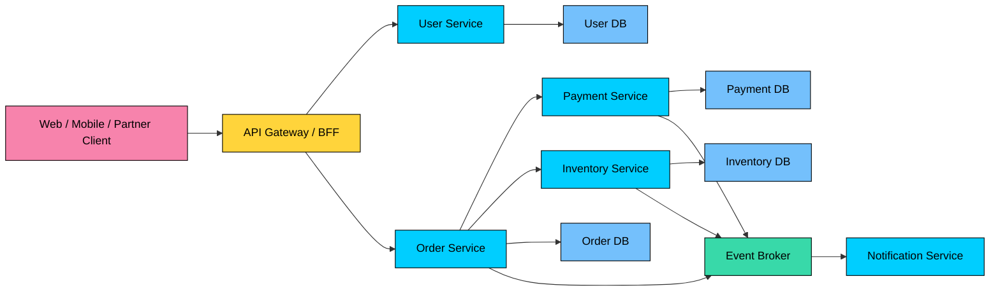
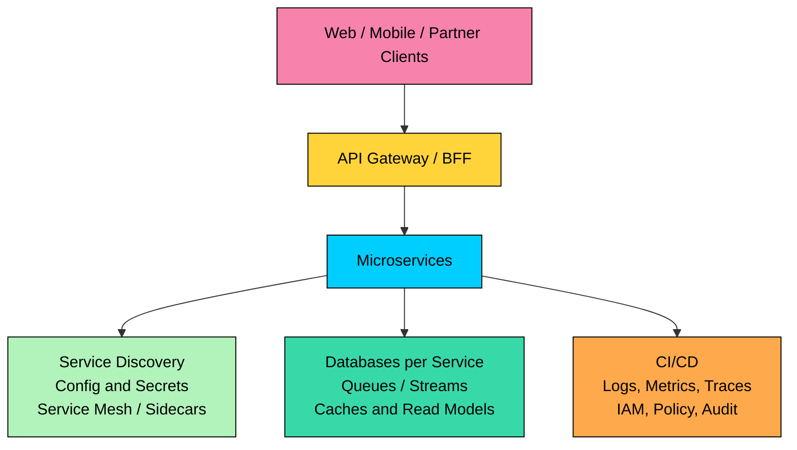
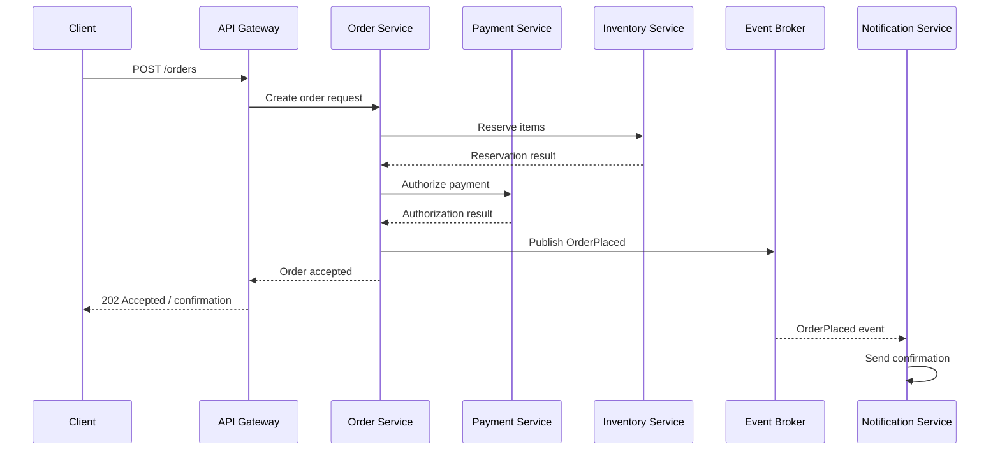

Microservices architecture structures a system as independently deployable services organized around business capabilities.

It can improve ownership, scaling, and failure isolation, but it adds network calls, distributed data, deployment coordination, and operational overhead.

This chapter covers what microservices architecture means, how services are bounded and owned, core platform components, communication patterns, data consistency, resilience, deployment, security, observability, and tradeoffs.

---

# 1. What Is Microservices Architecture"

> [!PAYWALL] This content is for premium members only.

A microservice is a small, independently deployable service built around a business capability. It exposes a clear interface, owns its internal implementation, and can be changed without redeploying the whole system.

The important word is **independently**. If services are split into separate processes but still require coordinated deployments, share the same tables, and break whenever another team changes code, the system is not getting the main benefit of microservices. It is closer to a distributed monolith.

### From Monolith to Microservices

- **Monolith:** One deployable application. Simple to build and operate, but internal coupling and shared deployment can become painful as the product and team grow.
- **Modular monolith:** One deployable application with explicit internal module boundaries. Often the best intermediate step.
- **Service-oriented architecture:** Coarse-grained services connected through shared enterprise infrastructure. Older SOA implementations often became coupled through shared schemas and centralized middleware.
- **Microservices:** Smaller services with stronger ownership, independent deployment, decentralized data ownership, and explicit contracts.

Microservices work best when service boundaries align with real ownership boundaries: teams, domains, data, reliability needs, and scaling profiles.

### Key Traits

- **Business capability boundaries:** Services are organized around domains such as orders, payments, search, identity, billing, or recommendations.
- **Independent deployment:** A team can release a service without redeploying unrelated services.
- **Data ownership:** A service owns its data model. Other services access that data through APIs, events, or read models, not direct table access.
- **Explicit contracts:** Services communicate through versioned APIs, events, schemas, and compatibility rules.
- **Operational ownership:** The team that owns a service owns its reliability, metrics, alerts, and incident response.
- **Failure isolation:** A failure should be contained, degraded, or recovered without cascading through the whole system.

---

# 2. Core Building Blocks of Microservices

Microservices require platform capabilities around the services themselves. Without that platform, teams spend their time rebuilding deployment, discovery, security, and observability instead of product behavior.

## Services

Each service owns a bounded responsibility. A good service has a clear API, a clear data boundary, a small set of owners, independent deployability, health checks, metrics, logs, alerts, and a documented failure mode.

Service size is not measured by lines of code. It is measured by cohesion and ownership. A service that is too small can create unnecessary network chatter and operational overhead.

## API Gateway and BFF

Clients should not know every internal service. An API gateway or Backend for Frontend provides a controlled entry point.

Common responsibilities include routing, authentication integration, rate limiting, request validation, response shaping, protocol translation, and edge observability.

Avoid putting all business logic in the gateway. When gateways become large policy-and-orchestration engines, they turn into another monolith in front of the services.

## Service Discovery

Services need a way to find healthy instances of other services.

In modern platforms, discovery may come from Kubernetes Services and DNS, cloud load balancers, Consul or etcd, service mesh control planes, or managed platform registries.

The implementation matters less than the contract: callers should not depend on hardcoded IP addresses or manually maintained instance lists.

## Configuration and Secrets

Configuration should be externalized, versioned, audited, and environment-aware. Secrets should be encrypted, rotated, and scoped to the service that needs them.

Examples include cloud secret managers, HashiCorp Vault, Kubernetes Secrets with external secret operators, parameter stores, and feature flag systems.

## Database per Service

Each service should own its persistence model. That may mean a separate database, separate schema, separate tables, or separate storage system. The key rule is ownership, not the number of database servers.

Other services should not directly read or write a service's private tables. Direct database access creates hidden coupling and makes independent deployment unsafe.

## Message Broker or Event Stream

Asynchronous messaging decouples services in time. A service can publish an event and continue without waiting for every downstream consumer.

Common choices include Kafka, RabbitMQ, NATS, cloud Pub/Sub systems, SQS/SNS, EventBridge, and Pulsar. The right choice depends on ordering, replay, throughput, latency, retention, and operational skill.

---

# 3. Microservices Example: Placing an Order

Consider an e-commerce order flow.

This flow raises design questions that a monolith can often hide:

- Should inventory reservation be synchronous or asynchronous"
- What happens if payment succeeds but order persistence fails"
- What happens if the notification service is down"
- Which service owns the order state visible to the user"
- How do duplicate requests avoid duplicate orders"
- Which events are facts, and which are commands"

The technical split is only half the design. The business state machine matters more.

### A More Production-Oriented Flow

In many systems, the order service persists an order in a pending state, writes an outbox event in the same transaction, and a background publisher emits the event. Downstream services react and publish their own facts, such as `PaymentAuthorized` or `InventoryReserved`. The order service updates the order state as those facts arrive.

This avoids pretending the whole workflow is one atomic operation. It makes the state transitions explicit.

---

# 4. Communication Between Microservices

Microservices communicate over the network. Every call can be slow, fail, time out, be retried, or return stale information.

## Synchronous Communication

Synchronous communication uses request/response calls. HTTP/REST is simple and widely understood, gRPC is efficient for strongly typed internal service calls, and GraphQL is often used at the edge or BFF layer to shape data for clients.

Use synchronous calls when the caller needs an immediate answer to continue.

| Good Fits | Risks |
| --- | --- |
| Fetching profiles, checking permissions, validating carts, or authorizing payments when an immediate answer is required. | Tight runtime coupling, cascading failures, increased tail latency, complex retries, and hidden dependency chains. |

## Asynchronous Communication

Asynchronous communication uses queues, events, streams, or pub/sub systems.

Use it when work can happen after the request path or when multiple consumers need to react independently.

| Good Fits | Risks |
| --- | --- |
| Sending emails, updating analytics, generating search indexes, processing media, creating embeddings, and propagating state to read models. | Eventual consistency, duplicate delivery, out-of-order events, harder debugging, schema evolution, poison messages, and replay mistakes. |

### Events vs Commands

Be precise:

- **Command:** "ReserveInventory" asks another service to do something.
- **Event:** "InventoryReserved" states that something already happened.

Confusing commands and events leads to unclear ownership and fragile workflows.

---

# 5. Data Management and Consistency

Data is the hardest part of microservices.

In a monolith, one transaction can update orders, payments, inventory, and audit records. In microservices, each service owns its data. This improves autonomy but removes easy cross-domain transactions.

## Database Ownership

Good rule:

> A service may own its tables. Other services may not directly write them, and should not rely on their internal schema.

This does not require a separate physical database for every service on day one. Separate schemas or ownership boundaries can be enough. What matters is that data access follows the service contract.

## Querying Across Services

Cross-service reads are common. Teams usually handle them with API composition, event-fed read models, search indexes, or analytics stores outside the transaction path.

Avoid making user-facing requests call a long chain of services just to render a screen. That creates latency and reliability problems.

## Distributed Transactions

Most microservice systems avoid two-phase commit across services because it couples availability and increases operational risk.

Common alternatives include sagas for multi-step workflows, outbox records for reliable event publication, idempotency keys for safe retries, inbox or deduplication tables for consumers, and process managers for workflows that need explicit state.

Consistency must be designed explicitly. "Eventual consistency" is not a strategy by itself. You need to define what users see while the system is between states.

---

# 6. Resilience Patterns

Failures are normal in microservices. Design for partial failure from the beginning.

## Timeouts

Every network call needs a timeout. No service should wait indefinitely for another service.

Timeouts should be shorter than the caller's own deadline. If the user request has two seconds left, a downstream call should not wait five seconds.

## Retries With Backoff and Jitter

Retries help with transient failures, but careless retries amplify outages.

Use exponential backoff, jitter, retry budgets, and idempotency. Do not retry non-idempotent operations unless the downstream API supports safe retry semantics.

## Circuit Breakers

A circuit breaker stops sending traffic to a failing dependency for a period of time. This protects the dependency and prevents callers from wasting resources on calls likely to fail.

Circuit breakers are useful, but they are not a replacement for timeouts, backpressure, and capacity planning.

## Bulkheads

Bulkheads isolate resources so one dependency or tenant cannot consume everything.

Examples include separate thread pools, separate connection pools, per-tenant rate limits, queue isolation, and dedicated worker pools for expensive jobs.

## Fallbacks and Degradation

Not every failure should produce a full outage. A product page might show cached recommendations when the recommendation service is down. A checkout flow, however, should not fake a payment authorization.

Design fallbacks based on business correctness, not convenience.

## Backpressure and Load Shedding

When a service is overloaded, it should fail fast or shed lower-priority work instead of collapsing slowly.

Queues, rate limits, adaptive concurrency, and priority classes help keep the system alive during spikes.

---

# 7. Deployment and Scalability

Microservices only help if services can actually be deployed and operated independently.

## Packaging and Runtime

Containers are common, but they are not the definition of microservices. A microservice can run on Kubernetes, ECS, Nomad, serverless containers, managed PaaS, or virtual machines.

Use the runtime that your team can operate reliably.

## Orchestration

Orchestration platforms handle scheduling, health checks, rolling deploys, service discovery, and scaling.

Kubernetes is common for large microservice environments, but it is not mandatory. Managed platforms can be a better fit for smaller teams.

## CI/CD

Each service needs its own build, test, security scan, deployment, and rollback path.

Independent pipelines are useful only if contracts are stable. If every service deployment requires five other services to deploy first, the system is still coupled.

## Release Strategies

Common strategies include:

- Rolling deployments
- Blue-green deployments
- Canary releases
- Feature flags
- Shadow traffic
- Automated rollback based on metrics

## Scaling

Microservices let you scale specific services independently, but bottlenecks often move elsewhere: databases, queues, third-party APIs, shared caches, or rate limits.

Scaling a service without scaling its dependencies can make incidents worse.

---

# 8. Observability

Observability is not optional in microservices. A single user request may cross a gateway, three services, a queue, and two databases.

You need:

- **Structured logs:** Include service name, operation, user or tenant context where safe, request ID, and error details.
- **Metrics:** Track request rate, error rate, latency, saturation, queue lag, retries, and dependency health.
- **Distributed tracing:** Propagate trace IDs across synchronous calls and asynchronous messages.
- **Correlation IDs:** Make it possible to connect logs and events across services.
- **Service-level objectives:** Define what reliability means for each service.
- **Runbooks:** Document what to check and what action to take during incidents.

Without this, teams debug production by guessing.

---

# 9. Security in Microservices

Microservices increase the number of network paths and identities. Security must cover both external and internal traffic.

## Authentication and Authorization

External requests are often authenticated at the gateway using OAuth 2.0, OpenID Connect, session cookies, API keys, or mTLS depending on the client.

Downstream services should not blindly trust headers unless the gateway and network path are controlled. Sensitive authorization decisions should be enforced in the service that owns the resource.

## Service-to-Service Identity

Internal services need identity too.

Common approaches include mTLS with workload identities, short-lived service tokens, cloud IAM roles, and service mesh identity.

The goal is to know which service is calling, not just which network it came from.

## Secrets Management

Do not hardcode credentials or distribute secrets through source control.

Use secret managers, scoped IAM, rotation, audit logs, and short-lived credentials where possible.

## Least Privilege

Each service should have only the permissions it needs: database access to owned schemas, queue access to relevant topics or queues, cloud permissions scoped to required resources, and separate production and non-production identities.

## Supply Chain Security

Microservices multiply dependencies, containers, build pipelines, and deployment artifacts.

Use dependency scanning, container image scanning, signed artifacts, SBOMs where required, and controlled base images.

---

# 10. When to Use Microservices

Microservices are a good fit when multiple teams need independent ownership, different domains have different scaling or reliability needs, some workloads require specialized technology, the organization has strong platform support, and service boundaries are understood well enough to draw safely.

They are a poor fit when the product domain is still unclear, the team is small, the real bottleneck is code quality, the organization cannot operate many services reliably, most workflows require strong cross-domain transactions, or the split is driven by fashion rather than a specific problem.

Start with a monolith or modular monolith when the system is young. Extract services when a boundary has a clear reason to exist.

---

# 11. Common Mistakes

| Mistake | Why It Hurts |
| --- | --- |
| Splitting too early | Service boundaries are hard to change once APIs, data, and teams depend on them. |
| Sharing databases | Direct table access destroys service independence. |
| Creating tiny services | Too many small services create latency, deployment overhead, and unclear ownership. |
| Ignoring data consistency | Distributed workflows need explicit state handling. |
| Treating Kubernetes as the architecture | Orchestration is infrastructure, not service design. |
| Skipping observability | Without tracing, metrics, and structured logs, incidents become slow and expensive. |
| Centralizing all logic in the gateway | This recreates a monolith at the edge. |
| No ownership model | Every service needs an owning team and on-call responsibility. |

---

# 12. Key Takeaways

- Microservices are independently deployable services organized around business capabilities.
- The main benefit is independent ownership and evolution, not smaller code files.
- Data ownership is the hardest and most important boundary.
- Network calls introduce latency, partial failure, retries, timeouts, and versioning concerns.
- Asynchronous messaging improves decoupling but requires idempotency, schema evolution, and replay discipline.
- Microservices require serious platform maturity: CI/CD, observability, security, incident response, and automation.
- A well-structured monolith is often better than a poorly operated microservice system.

---

# Quiz
