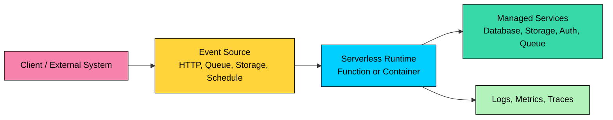
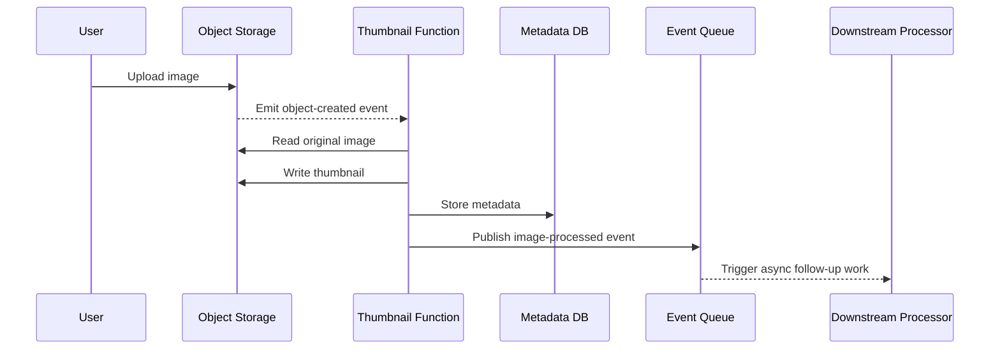

Serverless architecture runs application code on provider-managed compute and backend services.

It reduces direct server management, but teams still own event design, permissions, retries, idempotency, latency, observability, service limits, and cost.

This chapter covers what serverless architecture means, its core components, how serverless execution works, common design patterns, data management choices, operational challenges, and when dedicated compute is a better fit.

---

# 1. What Is Serverless Architecture"

> [!PAYWALL] This content is for premium members only.

Serverless architecture is a cloud application model where the provider manages the execution environment, scaling mechanics, and much of the operational infrastructure. Developers package code or configure services, and the platform runs that code in response to events.

The term **serverless** usually includes several related ideas:

- **Function as a Service (FaaS):** Small units of code run in response to events. Examples include AWS Lambda, Azure Functions, and Google Cloud Run functions.
- **Serverless containers:** Containerized services scale without managing nodes or clusters. Examples include Cloud Run, AWS App Runner, AWS Fargate, and Azure Container Apps.
- **Backend as a Service (BaaS):** Managed services provide authentication, databases, file storage, queues, and APIs. Examples include Firebase, Supabase, DynamoDB, S3, EventBridge, and managed Pub/Sub services.
- **Edge functions:** Code runs close to users at CDN or edge locations. These are useful for routing, authentication checks, personalization, and lightweight request handling.
- **Managed orchestration:** Workflow engines coordinate multi-step processes without a custom worker fleet. Examples include AWS Step Functions, Google Workflows, and Azure Durable Functions.

### Key Characteristics

- **Event-driven execution:** Compute starts because something happened: an HTTP request, queue message, storage event, database change, scheduled job, or webhook.
- **Managed scaling:** The platform creates and removes execution capacity based on demand, within account and service limits.
- **Stateless compute:** Function instances should not depend on local memory or disk for durable state. Persistent state belongs in databases, object storage, queues, or workflow services.
- **Pay for usage:** Billing is usually tied to invocations, duration, memory or CPU allocation, requests, and managed-service usage.
- **Short-lived execution:** Many FaaS platforms impose maximum execution durations. Long jobs often need queues, batch systems, workflows, or serverless containers.
- **Provider-managed operations:** The provider manages hosts and runtimes, but the team still owns architecture, code quality, permissions, configuration, observability, and incident response.

---

# 2. Core Components of a Serverless System

A serverless system is usually a composition of managed components rather than one long-running application process.

## Event Sources

An event source triggers work. Common sources include HTTP requests through an API gateway or load balancer, object storage uploads, queue or stream messages, database change events, schedules, and SaaS webhooks.

The event shape matters. A good event contains enough information for the function to do its work, but not so much data that it becomes expensive, slow, or hard to evolve.

## Function Runtime

The runtime executes your code. It loads the deployment artifact, initializes dependencies, runs the handler, returns a result, and may keep the execution environment warm for future invocations.

The initialization phase matters in production. Large packages, slow dependency loading, heavyweight SDK clients, and network calls during startup can increase cold start latency.

## Managed Services

Serverless applications lean heavily on managed databases, queues, streams, object storage, identity services, and workflow engines. Examples include DynamoDB, Firestore, Aurora Serverless, SQS, Pub/Sub, EventBridge, S3, Google Cloud Storage, Cognito, Firebase Auth, Step Functions, Durable Functions, Temporal Cloud, and Google Workflows.

The architecture is only as reliable as the contracts between these services: delivery semantics, retry behavior, ordering, deduplication, throughput limits, and failure handling.

## API Gateway

For HTTP APIs, an API gateway or managed load balancer often sits in front of the compute layer.

It can handle routing, authentication hooks, request validation, rate limiting, throttling, CORS, access logs, and custom domains.

Keep the gateway responsibilities clear. It should protect and route traffic; business decisions should usually live in application code or dedicated policy services.

> 💡 **Key Insight:**

> **TIP**
>
> ### Putting It Together
>
> A serverless request often flows through four parts:
>
> 1. An event source receives work.
> 2. A runtime executes code.
> 3. The code reads or writes managed services.
> 4. Logs, metrics, traces, and alarms record what happened.

---

# 3. How Serverless Works

Consider an image upload pipeline.

The platform handles the execution lifecycle:

1. **An event arrives.** A storage upload, queue message, API request, or schedule triggers work.
2. **The platform selects execution capacity.** If a warm execution environment is available, it may reuse it. Otherwise, it creates a new one.
3. **The runtime initializes.** It loads code, dependencies, environment variables, and runtime configuration.
4. **The handler runs.** Your code processes the event, calls managed services, and returns or fails.
5. **The platform records the result.** Logs, metrics, and traces are emitted. Depending on the trigger, failures may be retried, sent to a dead-letter queue, or returned to the caller.
6. **Capacity scales down.** Idle environments may be removed. Future invocations may start warm or cold.

### Cold Starts

A **cold start** happens when the platform has to create a fresh execution environment before running your handler. Cold start impact depends on runtime, package size, VPC or network configuration, initialization code, memory and CPU allocation, and provider implementation.

Cold starts are not always a problem. They matter most for latency-sensitive synchronous APIs. They matter less for background queue processing, scheduled jobs, and asynchronous pipelines.

---

# 4. Challenges and Limitations

Serverless removes server management, but it does not remove system design.

## Cold Start Latency

Cold starts can add latency to user-facing paths. Mitigations include smaller deployment packages, faster runtimes, lazy initialization, provisioned concurrency, serverless containers with minimum instances, and moving latency-sensitive work out of cold paths.

Scheduled "warming" requests are a weak substitute for understanding the real scaling behavior. They can reduce some cold starts, but they add noise and do not handle sudden concurrency spikes well.

## Statelessness

Serverless compute should treat local memory and local disk as temporary. You can cache within a warm instance as an optimization, but correctness must not depend on it.

Durable state belongs in external systems: databases, object storage, caches, queues, or workflow engines.

## Execution Limits

FaaS platforms limit execution duration, memory, payload size, deployment size, and concurrency. These limits vary by provider and runtime.

Long-running jobs, video processing, large model inference, browser automation, and heavy ETL may need serverless containers, batch jobs, workflow decomposition, or dedicated compute.

## Retries and Duplicate Events

Many event sources provide **at-least-once delivery**. That means a function may receive the same event more than once.

Production handlers must be idempotent. Use idempotency keys, conditional writes, unique constraints, deduplication tables, or workflow state to prevent duplicate charges, duplicate emails, duplicate orders, or repeated side effects.

## Database Connections

Serverless functions can scale faster than a traditional database can accept connections. A sudden burst of function invocations may exhaust database connection limits.

Use connection pooling, managed proxies, serverless-friendly databases, queues, or concurrency controls. For relational databases, this is one of the most common production failure modes.

## Observability

A request may cross an API gateway, function, queue, stream processor, database, and workflow engine. Without correlation IDs and distributed tracing, debugging becomes guesswork.

Logs alone are not enough. You need metrics, traces, structured logs, dashboards, alarms, and clear runbooks.

## Vendor Lock-In

Serverless systems often depend on provider-specific event formats, IAM models, deployment tools, and managed services. This can be a good tradeoff, but it should be deliberate.

Avoid pretending portability is free. If portability matters, isolate provider-specific code behind small adapters and use open standards where they do not compromise the design.

## Cost Surprises

Serverless can be cheaper for bursty or spiky workloads. It can be more expensive for steady high-throughput workloads, chatty function chains, excessive logging, inefficient memory settings, or heavy managed-service calls.

Cost modeling must include compute duration, request count, network egress, storage, queue operations, database reads and writes, traces, logs, and provisioned concurrency.

---

# 5. Common Design Patterns in Serverless Systems

## API Gateway + Function

This pattern exposes an HTTP endpoint backed by one or more functions.

Use it for lightweight APIs, webhook receivers, internal tools, and simple mobile or web backends.

Be careful with large APIs made of many tiny functions. Too much fragmentation can make local testing, deployment, tracing, and versioning harder.

## Queue-Based Processing

Producers write messages to a queue. Functions consume messages asynchronously.

This pattern is useful for email sending, image processing, payment reconciliation, webhook fan-out, and background AI tasks such as embedding generation.

Queues absorb spikes, isolate failures, and let you control concurrency. Always define retry limits and dead-letter queue behavior.

## Event Fan-Out

One event is delivered to multiple subscribers. For example, an `OrderPlaced` event may trigger inventory reservation, email notification, analytics, and fraud checks.

Fan-out reduces coupling, but it also makes end-to-end behavior harder to reason about. Use clear event schemas, versioning, and ownership.

## Workflow Orchestration

Multi-step processes need orchestration when steps must happen in order, branch, retry, wait, or compensate for failure.

Use workflow engines for order processing, KYC or onboarding flows, data import pipelines, human approval workflows, and multi-stage AI pipelines with retrieval, inference, evaluation, and persistence.

Avoid hiding complex business workflows inside a chain of queue-triggered functions with no visible state machine.

## Scheduled Jobs

Scheduled functions are useful for maintenance tasks, report generation, cleanup jobs, and periodic synchronization.

Keep them idempotent. A scheduler can fire late, fire twice, or overlap with a previous run unless you design locking or deduplication.

## Edge Request Handling

Edge functions run near users and are useful for lightweight request logic such as redirects, authentication checks, header rewriting, A/B assignment, geo-aware routing, and small personalization decisions.

They are usually not a good place for heavy computation, large dependencies, or direct database-heavy workflows.

---

# 6. Data Management in Serverless Systems

Serverless compute is stateless, so data design becomes central.

## Managed Databases

Serverless pairs well with managed databases, but the database must match the access pattern. Key-value and document stores fit high-scale event-driven access, relational databases fit transactions and joins when connection management is handled carefully, and serverless SQL platforms reduce operational overhead while still carrying latency, transaction, connection, and cost tradeoffs.

Do not choose a database only because it is labeled serverless. Choose it because it matches the consistency, query, latency, and cost requirements.

## Object Storage

Object storage is a strong fit for serverless systems. It is durable, cheap, event-driven, and good for large binary objects.

Use object storage for images, videos, documents, backups, data lake files, model artifacts, and batch input or output files.

Store metadata in a database, not only in object names.

## Event Streams and Queues

Queues and streams are the backbone of many serverless systems. Use queues when each message should be processed by one consumer, pub/sub or event buses when multiple consumers need the same event, and streams when ordering, replay, or continuous processing matters.

Understand the delivery semantics. At-least-once delivery is common, so duplicate-safe handlers are mandatory.

## Caches

Caching can improve latency and reduce database load, but serverless makes cache placement less obvious.

Options include CDN or edge caches for HTTP responses, managed Redis or Memcached for shared low-latency data, and in-memory caches inside warm instances as best-effort optimizations.

Never rely on in-memory function cache for correctness.

---

# 7. Real-World Use Cases

Serverless works best when work is event-driven, bursty, and decomposable. Common examples include media processing, webhook handling, e-commerce workflows, IoT ingestion, automation, data pipelines, and AI-adjacent tasks such as embedding generation, asynchronous moderation, model request routing, post-processing, evaluation, or lightweight chat streaming.

For AI workloads, be careful with execution limits, GPU availability, model load time, payload size, streaming behavior, privacy, and cost. Serverless is often excellent around the AI workflow, even when the core model inference runs on dedicated or specialized infrastructure.

---

# 8. Best Practices

| Practice | Why It Matters |
| --- | --- |
| Design for idempotency | Events can be retried or delivered more than once. |
| Keep handlers focused | A function should have a clear responsibility without fragmenting one cohesive workflow into dozens of tiny functions. |
| Use queues for burst control | Queues protect expensive or fragile consumers from sudden spikes. |
| Set timeouts deliberately | A timeout should reflect expected work and failure behavior, not the provider maximum. |
| Control concurrency | Reserved concurrency, queue batch size, rate limits, or worker pools protect databases and downstream APIs. |
| Use least privilege IAM | Each function should have only the permissions it needs. |
| Manage secrets properly | Use a secret manager or parameter store instead of hardcoded credentials. |
| Instrument from day one | Structured logs, correlation IDs, metrics, traces, alarms, and dashboards make production behavior visible. |
| Define failure paths | Retries, dead-letter queues, poison-message handling, and manual replay procedures make failures recoverable. |
| Use infrastructure as code | Terraform, AWS CDK, Pulumi, Serverless Framework, or equivalent tools keep functions, queues, permissions, schedules, alarms, and gateways reproducible. |
| Test with real events | Stored sample events and realistic staging flows catch issues unit tests miss. |
| Watch cost as a metric | Track cost per request, cost per workflow, log volume, retry rate, and downstream service calls. |

---

# 9. When to Use Serverless

Serverless is a good fit when traffic is bursty, unpredictable, or event-driven; when you want to reduce infrastructure management; when work can be decomposed into independent tasks; when scaling to zero matters; and when managed services match your data and workflow needs.

It is a poor fit when the workload has steady high utilization, requires very low predictable latency, exceeds platform limits for long-running or hardware-heavy work, depends on complex local state or long-lived connections, needs deep runtime control, or cannot accept provider lock-in.

---

# 10. Key Takeaways

- Serverless does not remove servers. It removes direct server management.
- The model works best for event-driven, bursty, stateless workloads.
- Managed services are part of the architecture, not implementation details.
- Retries, duplicate events, idempotency, concurrency, and database connections are central design concerns.
- Cold starts matter for some paths, but they are only one part of serverless performance.
- Serverless can reduce operational burden, but it still requires disciplined engineering, observability, security, and cost control.

---

# Quiz
