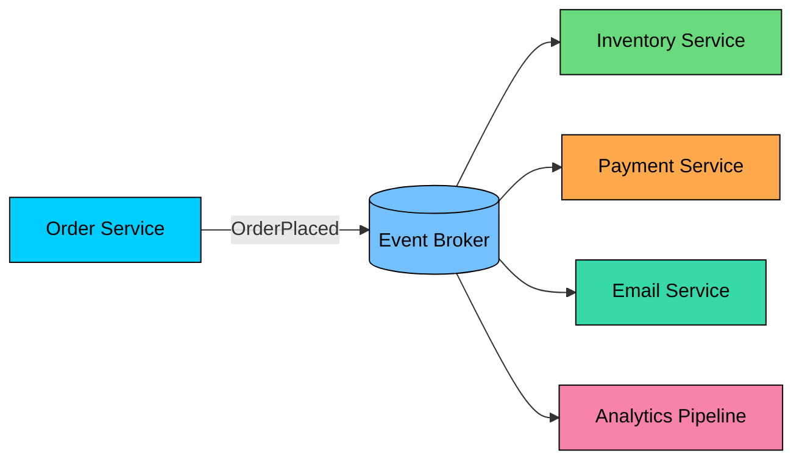
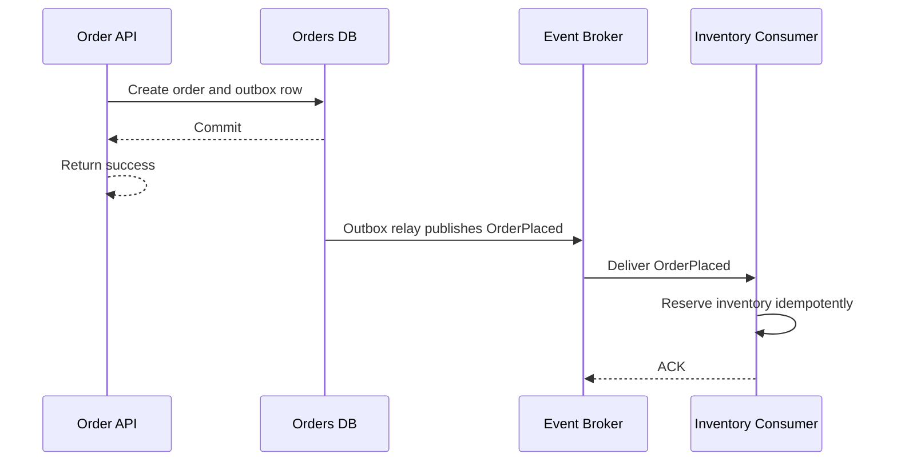

Event-driven architecture lets systems publish facts about business changes and lets interested consumers react asynchronously.

It decouples producers from consumers, but it requires explicit handling for eventual consistency, duplicates, ordering, schema evolution, and observability.

This chapter covers what event-driven architecture means, how events differ from commands and queries, how producers, brokers, and consumers work together, plus event contracts, payload styles, delivery semantics, ordering, schema evolution, reliability, replays, and tradeoffs.

---

# 1. What Is Event-Driven Architecture"

> [!PAYWALL] This content is for premium members only.

Event-driven architecture is a style where services communicate by producing and consuming events.

An **event** is an immutable record of a fact:

- `OrderPlaced`
- `PaymentAuthorized`
- `InventoryReservationFailed`
- `UserEmailChanged`

Events describe something that already happened. They are not requests.

The producer does not call each consumer. It publishes an event to a broker. Each consumer processes the event independently.

The result is loose runtime coupling:

- Producers do not need to know every consumer.
- Consumers can be added without changing the producer.
- Slow consumers do not block the producer's request path.
- Consumers can scale independently.

The cost is that the system becomes asynchronous. The producer may return success before every consumer has processed the event.

---

# 2. Events, Commands, and Queries

Many systems become messy because they call everything an event.

These concepts are different.

| Message type | Meaning | Example |
|--------------|---------|---------|
| Event | A fact that already happened | `OrderPlaced` |
| Command | A request for someone to do something | `ReserveInventory` |
| Query | A request for information | `GetOrderStatus` |

Events should be named in the past tense because they record facts. `OrderPlaced` is an event. `PlaceOrder` is a command.

This distinction matters for ownership:

- The producer owns the meaning of its events.
- The receiver of a command owns whether the command succeeds.
- The provider of a query owns the response shape and freshness.

If you use events as hidden commands, consumers become tightly coupled to producer intent. For example, publishing `OrderPlaced` and assuming the payment service must charge the customer is a workflow decision. In a complex flow, that decision often belongs in a saga or workflow orchestrator.

---

# 3. Core Components

An event-driven system has four main parts.

### Producer

A producer is the service that publishes an event after a local business change.

For example, the order service publishes `OrderPlaced` after the order is committed.

Producers should publish events reliably. If a service updates its database and then publishes an event, use the Outbox pattern so the database change and event record commit together.

### Broker

The broker stores, routes, and delivers events.

Depending on the technology, the broker may provide:

- Topics or queues
- Durable storage
- Consumer groups
- Message acknowledgment
- Replay
- Partitioning
- Dead-letter queues
- Retention policies

### Consumer

A consumer subscribes to events and performs work.

Consumers must assume events can be duplicated, delayed, or replayed. Any important consumer should be idempotent.

### Event Contract

An event contract defines the event name, schema, semantics, versioning rules, and compatibility expectations.

The contract is as important as an API contract. A badly designed event can couple services more tightly than a synchronous API.

---

# 4. Event Flow

A typical event flow looks like this:

The key point is timing. The order can be committed before inventory processes the event.

That means consumers and user interfaces must tolerate intermediate states:

- `ORDER_PENDING`
- `PAYMENT_AUTHORIZED`
- `INVENTORY_RESERVED`
- `ORDER_CONFIRMED`
- `ORDER_CANCELLED`

Event-driven systems work best when these states are explicit in the domain model.

---

# 5. Event Payload Styles

There are two common ways to design event payloads.

## Event Notification

An event notification says that something happened and includes only enough data to identify it.

The consumer fetches details from the producer or a read model.

Notification events keep payloads small, avoid duplicating too much data, and let consumers fetch fresh state. The tradeoff is that consumers become coupled to producer APIs, extra synchronous calls happen after delivery, producer API outages can block consumers, and fetched state may have changed by the time it is read.

## Event-Carried State Transfer

Event-carried state transfer includes the data consumers need to act.

Event-carried state lets consumers process without calling the producer, improves fault isolation, and works well for projections, search indexes, and analytics. The tradeoff is larger payloads, more schema evolution work, possible action on older snapshots, and a greater risk of sensitive data spreading too widely.

Use event-carried state when consumer autonomy matters. Use notification events when payload size, privacy, or freshness matters more.

---

# 6. Broker Choices

Different brokers optimize for different workloads.

| Broker style | Good for | Trade-offs |
|--------------|----------|------------|
| Log-based streaming | High-throughput streams, replay, ordered partitions | Requires partition design and retention planning |
| Queue-based messaging | Work distribution, background jobs, command handling | Replay and fanout may be limited or modeled differently |
| Pub/Sub services | Fanout to many subscribers | Delivery behavior varies by provider |
| Workflow engines | Durable business workflows | Less general-purpose event streaming |

Examples:

- Kafka and Pulsar are commonly used for durable event streams.
- RabbitMQ and similar brokers are commonly used for queues, routing, and task distribution.
- Managed cloud services provide pub/sub, queues, event routing, and streaming without operating broker clusters directly.
- Workflow engines such as Temporal, Step Functions, or Camunda are often better for explicit long-running workflows than raw event choreography.

Do not choose a broker because it is popular. Choose based on delivery model, retention, replay needs, ordering, throughput, operational skill, and failure recovery.

---

# 7. Delivery Semantics

Most production event systems should assume **at-least-once delivery**.

That means an event should not be lost after the broker accepts it, but consumers may receive it more than once.

| Semantic | Meaning | Design requirement |
|----------|---------|--------------------|
| At-most-once | Events may be lost, but not retried | Use only when loss is acceptable |
| At-least-once | Events are retried, duplicates are possible | Consumers must be idempotent |
| Exactly-once | Processing happens once within a defined boundary | Understand the boundary carefully |

Be careful with "exactly-once." A broker may provide exactly-once behavior for a narrow stream-processing path, but that does not automatically make external side effects exactly once. Sending an email, charging a card, or updating another database still needs idempotency and transactional boundaries.

### Idempotent Consumers

Consumers should record processed event IDs when duplicate processing would be harmful.

The processed event record and the business update should commit together. Otherwise, a crash can create either duplicate processing or lost processing.

---

# 8. Ordering

Event ordering is usually scoped, not global.

Most systems do not need every event in one total order. They need events for the same entity to be processed in order.

For example:

Use an ordering key such as `orderId` as the partition key. Include an aggregate version when the domain supports it.

| Problem | Mitigation |
|---------|------------|
| Events for one entity arrive out of order | Partition by aggregate ID |
| Duplicate events | Include event ID and deduplicate |
| Missing events | Include aggregate version and detect gaps |
| Replayed old events | Compare event version with current state |
| Parallel consumers reorder side effects | Process one aggregate serially or use optimistic concurrency |

Do not rely on timestamps alone for ordering. Clocks, retries, and concurrent writers make timestamp order unreliable.

---

# 9. Schema Evolution

Events live longer than API responses. They may be stored, replayed, consumed by old services, and used by systems you do not control directly.

Design event schemas for change.

Good rules are mostly about compatibility and meaning: add fields instead of renaming or removing them, keep old fields until consumers migrate, use explicit versions for breaking changes, avoid leaking internal database schemas, prefer stable business names, use schema registries or contract tests for important events, and document semantics rather than only JSON shape.

Event names should represent business facts. `OrderPlaced` is clearer than `OrderTableRowInserted`.

---

# 10. Reliability Patterns

### Outbox Pattern

If a service updates its database and publishes an event, use Outbox to avoid the dual-write problem.

Without Outbox:

1. Database commit succeeds.
2. Service crashes before publishing.
3. Downstream services never see the event.

Outbox makes the event record part of the same local transaction as the business change.

### Dead-Letter Queues

A dead-letter queue stores messages that cannot be processed after repeated attempts.

DLQs are useful, but they are not a substitute for fixing bad consumers. Monitor them and provide a reprocessing path.

### Backpressure

Consumers fail slowly before they fail completely. Watch consumer lag, queue depth, processing latency, and retry rates.

Backpressure strategies include scaling consumers, reducing producer rate, batching, pausing low-priority consumers, moving poison messages to a DLQ, and applying per-consumer rate limits.

### Replays

Replay is powerful and dangerous. Replaying old events can rebuild projections, but it can also resend emails, duplicate external calls, or overwrite newer state.

Before replaying, know which consumers are replay-safe and which must be disabled or run in a special mode.

---

# 11. When to Use Event-Driven Architecture

Use EDA when multiple consumers need to react to the same business fact, producers should not block on downstream work, consumers need independent scaling, or the system needs audit trails, projections, analytics, search indexing, or integration without direct service-to-service calls.

Avoid or reconsider EDA when the caller needs an immediate answer, the operation is simple and local, strong consistency is required before returning to the user, the team lacks observability and operational maturity, the workflow has complex branching better modeled with an orchestrator, or events would expose sensitive data too widely.

Synchronous APIs and events are complementary. Many good systems use both: commands or APIs for direct intent, events for facts and fanout.

---

# 12. Common Mistakes

### Publishing Events Before the Database Commit

Consumers can see an event for data that later rolls back. Publish from committed state, usually through Outbox.

### Treating Events as RPC

If the producer expects one specific consumer to do one specific thing immediately, a command or workflow may be clearer than an event.

### No Idempotency

Duplicate delivery is normal. Consumers that cannot tolerate duplicates will eventually corrupt data.

### No Event Ownership

Every event needs an owning service, a schema, and compatibility rules. Shared events with unclear ownership become dangerous.

### Overloading One Event

Do not make one giant event serve every consumer. Consumers with very different needs may require separate events or projections.

### Weak Observability

You need to trace an event from producer commit to broker publish to consumer processing. Without correlation IDs, lag metrics, and failure dashboards, asynchronous systems become guesswork.

---

# 13. Key Takeaways

Event-driven architecture lets services communicate through facts instead of direct calls.

The benefits are real: loose coupling, independent scaling, fanout, replay, and better separation between the producer's write path and downstream work.

The costs are also real:

- Events are asynchronous.
- Consumers must handle duplicates.
- Ordering must be designed.
- Schemas must evolve safely.
- Broker lag and failures must be observable.
- Local state changes need reliable publication, usually with Outbox.

Use events for business facts that other systems may care about. Use commands for intent. Use queries for information. The best event-driven systems are not the ones with the most events; they are the ones where event boundaries, ownership, and failure behavior are deliberately designed.

---

# Quiz
