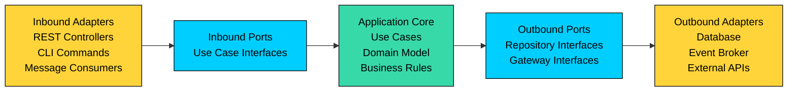
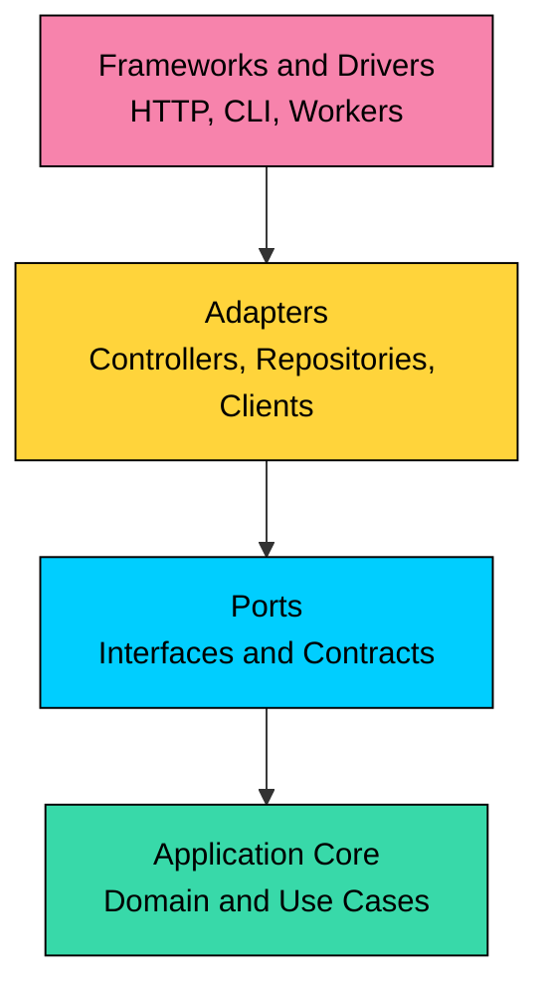
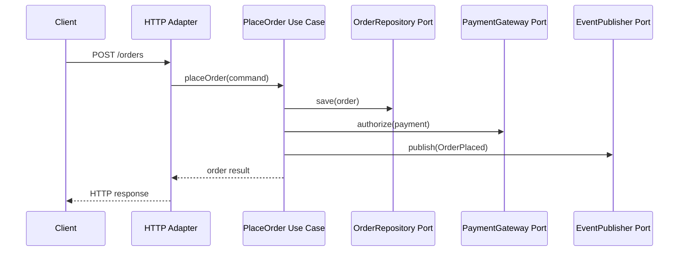
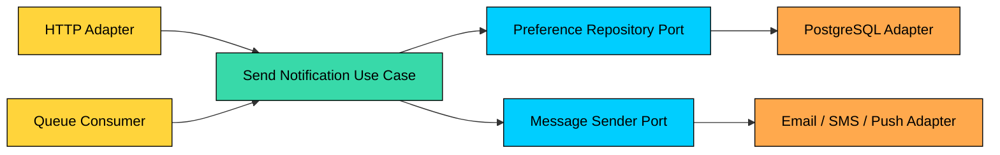

Hexagonal architecture organizes an application so business logic stays at the center and external systems connect through explicit ports and adapters.

It helps teams change databases, APIs, message brokers, frameworks, and third-party integrations without rewriting the core domain behavior.

This chapter covers what hexagonal architecture means, how ports and adapters work, dependency direction, request flow, testing strategy, common mistakes, and when the pattern is useful or unnecessary.

---

# 1. What Is Hexagonal Architecture"

> [!PAYWALL] This content is for premium members only.

> 💡 **Key Insight:**

> **What is Hexagonal Architecture"**
>
> Hexagonal architecture, also called ports and adapters, separates the application core from external delivery mechanisms and infrastructure details.

The "hexagon" is not important as a shape. The important idea is that the core application should not depend directly on web frameworks, database clients, queues, cloud SDKs, or vendor APIs.

The application core defines what it needs from the outside world. Adapters translate between those needs and concrete technologies.

For example, an order use case might need to load an order, charge a payment, and publish an event. The core should know those capabilities exist, but it should not know whether orders come from PostgreSQL, payments go through Stripe, or events are published to Kafka.

---

# 2. Ports and Adapters

Hexagonal architecture is built around two ideas: ports define application-facing contracts, and adapters connect those contracts to the outside world.

| Concept | Responsibility | Examples |
| --- | --- | --- |
| **Application core** | Owns use cases, domain rules, entities, value objects, and policies | `PlaceOrder`, `RefundPayment`, `InventoryPolicy` |
| **Inbound port** | Describes how the outside world asks the application to do work | `PlaceOrderUseCase`, `CreateAccountCommandHandler` |
| **Inbound adapter** | Converts external input into calls to inbound ports | REST controller, GraphQL resolver, CLI command, queue consumer |
| **Outbound port** | Describes what the core needs from external systems | `OrderRepository`, `PaymentGateway`, `EventPublisher` |
| **Outbound adapter** | Implements an outbound port using a concrete technology | SQL repository, Redis cache, Kafka producer, cloud storage client |

Ports belong to the application boundary. Adapters belong to the infrastructure edge. This keeps business decisions separate from transport, persistence, and vendor details.

## Inbound Side

The inbound side is about entering the application. A user request, scheduled job, webhook, or consumed message is translated into a use case call.

An inbound adapter should parse input, authenticate where appropriate, validate request shape, call a use case, and map the result back to the transport format. It should not contain the business rules that decide whether an order is valid, a refund is allowed, or a subscription can be renewed.

## Outbound Side

The outbound side is about leaving the application. The core asks for persistence, messaging, payment, search, email, or file storage through outbound ports.

The concrete adapter handles SQL queries, API payloads, retry behavior, serialization, credentials, and provider-specific errors. The core receives domain-oriented results instead of infrastructure-specific objects.

---

# 3. Dependency Direction

The most important rule is simple: dependencies point inward.

The core should not import a web framework, ORM model, HTTP client, cloud SDK, or message broker library. Those dependencies live in adapters.

This direction allows the core to be tested without starting a web server, database, broker, or cloud emulator. It also makes technology changes less invasive because the adapter can change while the port remains stable.

---

# 4. Request Flow

Consider a checkout request in an e-commerce system.

The controller is just one way to trigger the use case. The same use case could also be triggered by an admin CLI, a scheduled job, or a message consumer.

The use case depends on ports such as `OrderRepository`, `PaymentGateway`, and `EventPublisher`. At runtime, those ports are wired to concrete adapters such as a PostgreSQL repository, a payment provider client, and an event broker publisher.

---

# 5. Typical Code Structure

There is no single required folder layout, but the structure should make the dependency direction obvious.

The `composition` or bootstrap layer is where concrete adapters are connected to ports. That wiring layer is allowed to know about frameworks and infrastructure because its job is to assemble the application.

Avoid treating this folder structure as the architecture by itself. The real architecture is enforced by dependency rules, test boundaries, and code review discipline.

---

# 6. Relationship to Layered Architecture

Hexagonal architecture and layered architecture are related, but they emphasize different boundaries.

| Architecture | Main Question | Common Risk |
| --- | --- | --- |
| **Layered architecture** | Which technical layer owns this responsibility" | Business logic leaks into controllers, repositories, or service glue. |
| **Hexagonal architecture** | Is the application core isolated from external systems" | Ports become too generic or mirror infrastructure details. |
| **Clean architecture** | How do dependency rules protect use cases and entities" | Too many abstractions for a small problem. |
| **Onion architecture** | How do domain concepts stay at the center" | Overemphasis on domain purity when simple application logic is enough. |

Layered architecture often separates presentation, application, domain, and infrastructure. Hexagonal architecture focuses more directly on input and output boundaries around the core.

In practice, teams often combine them: domain and use cases live in the center, inbound adapters sit on one side, outbound adapters sit on another side, and the infrastructure layer implements concrete integrations.

---

# 7. Testing Benefits

Hexagonal architecture makes testing easier because the core can be tested through ports.

Use case tests can replace external systems with in-memory fakes or test doubles. A `PlaceOrder` test can verify inventory rules, payment decisions, and emitted events without running PostgreSQL, Kafka, or a payment sandbox.

| Test Type | Focus | Typical Boundary |
| --- | --- | --- |
| **Domain tests** | Business rules and invariants | Entities, value objects, policies |
| **Use case tests** | Application workflows | Inbound port with fake outbound ports |
| **Adapter tests** | Technology mapping and integration behavior | SQL repository, HTTP client, message publisher |
| **End-to-end tests** | Full wiring and critical user flows | Real or production-like adapters |

This does not eliminate integration testing. It reduces how much logic must be tested through slow end-to-end paths.

---

# 8. Advantages

Hexagonal architecture is useful when the business rules matter more than the current delivery mechanism or infrastructure choice.

It gives teams clearer boundaries, easier unit testing, replaceable adapters, less framework lock-in, and a safer path for evolving from one interface to many interfaces. A product can start with HTTP requests and later add message consumers, admin tools, or scheduled workflows without duplicating core behavior.

It also improves code review. When a controller starts making pricing decisions or a repository starts deciding refund eligibility, the boundary violation is easier to spot.

---

# 9. Tradeoffs

Hexagonal architecture adds ceremony. Small CRUD applications may not need separate ports, adapters, use cases, and domain models for every operation.

The pattern can also be misused. Teams sometimes create interfaces for everything, even when there is only one implementation and no meaningful boundary. Others create ports that simply copy database operations, such as `insertRow` or `findBySqlQuery`, which leaks persistence thinking back into the core.

The goal is not maximum abstraction. The goal is to protect business behavior from volatile external details.

---

# 10. Common Mistakes

| Mistake | Why It Hurts |
| --- | --- |
| Putting business logic in adapters | The core becomes thin, and behavior gets duplicated across HTTP, worker, and CLI paths. |
| Designing ports around infrastructure | A port named after SQL or Kafka details forces the core to think like the adapter. |
| Creating too many tiny interfaces | The code becomes harder to navigate without improving isolation. |
| Letting ORM entities become domain models automatically | Persistence concerns can leak into invariants and use cases. |
| Skipping integration tests | Adapter bugs still happen even when the core is well tested. |
| Treating the folder layout as enforcement | Dependency direction must be protected by code ownership, tests, or tooling. |

The healthiest implementations are pragmatic. They isolate the parts of the system that are likely to change or carry important business rules, while keeping simple paths simple.

---

# 11. When to Use Hexagonal Architecture

Hexagonal architecture is a good fit when business rules are important, multiple input channels need to reuse the same behavior, infrastructure may change, tests are becoming slow because too much logic requires real dependencies, or the team wants a clear boundary between domain decisions and delivery mechanisms.

It is usually unnecessary for simple CRUD admin tools, prototypes, scripts, or services where the main job is to pass data from one API to another with little domain behavior.

Use the pattern when it buys clarity. Avoid it when it only adds files.

---

# 12. Example: Notification Service

Imagine a notification service that can send email, SMS, and push notifications.

The core use case decides whether a notification should be sent, which template should be used, how user preferences apply, and whether the request is allowed. Outbound ports describe capabilities such as `NotificationPreferenceRepository`, `TemplateRenderer`, and `MessageSender`.

If the team switches from one email provider to another, the message sender adapter changes. If the product adds a scheduled digest worker, a new inbound adapter calls the same use case. The core behavior remains stable.

---

# 13. Key Takeaways

- Hexagonal architecture separates the application core from external systems through ports and adapters.
- Inbound adapters call the application; outbound adapters implement capabilities the application needs.
- Dependencies should point inward toward use cases and domain logic.
- The pattern improves testability, replaceability, and boundary clarity.
- Ports should describe application needs, not database tables, HTTP payloads, or vendor APIs.
- Hexagonal architecture is useful for domain-heavy systems, but it can be overkill for simple CRUD.

---

# Quiz
