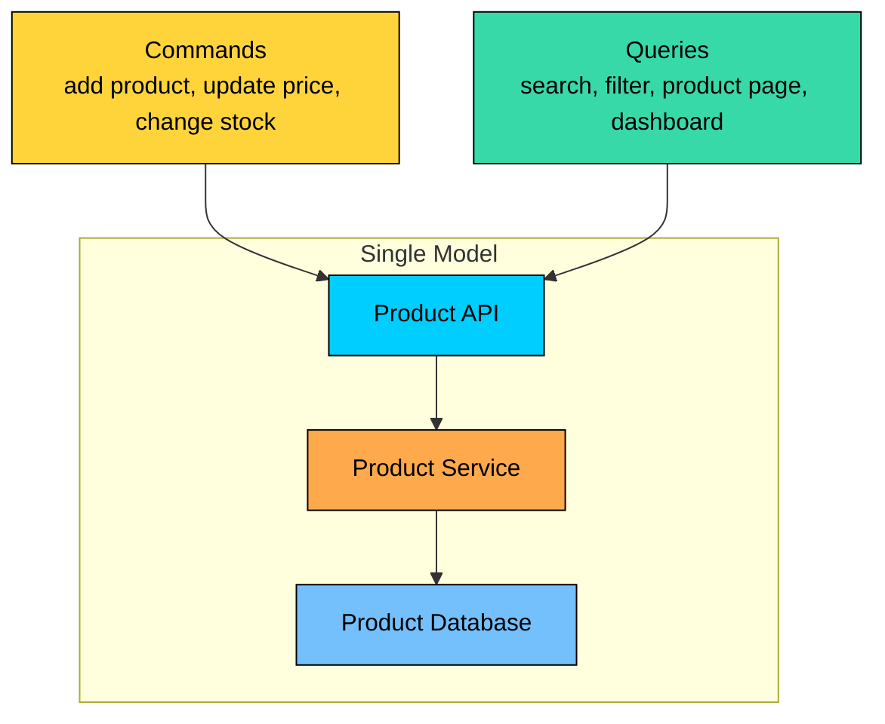
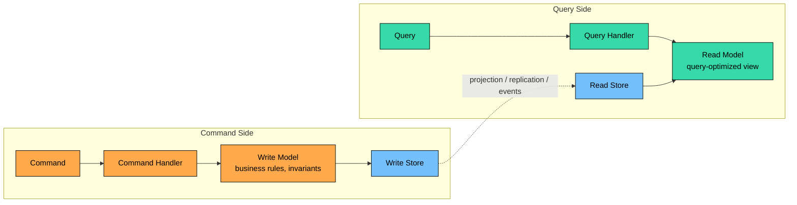
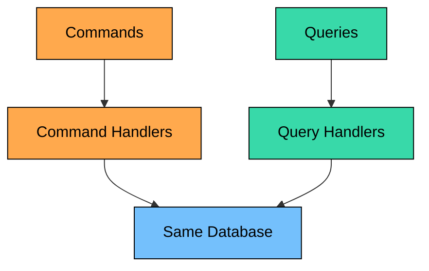
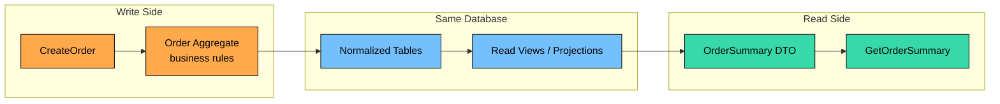
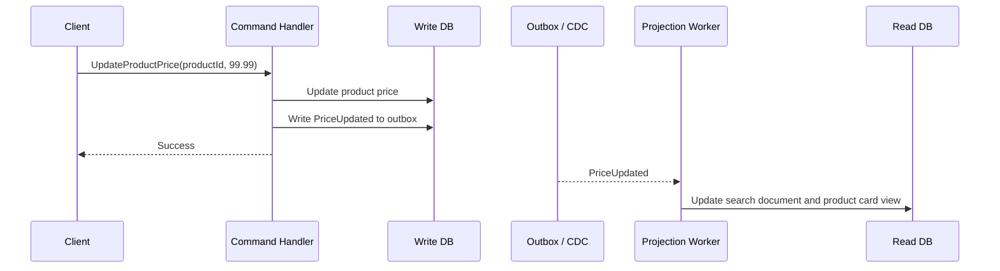
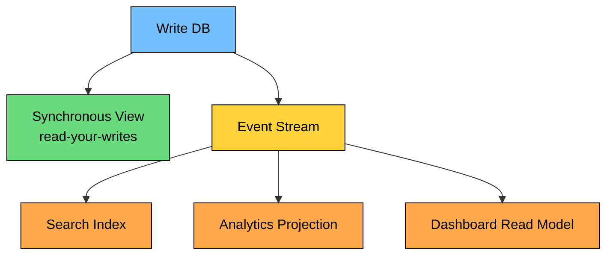
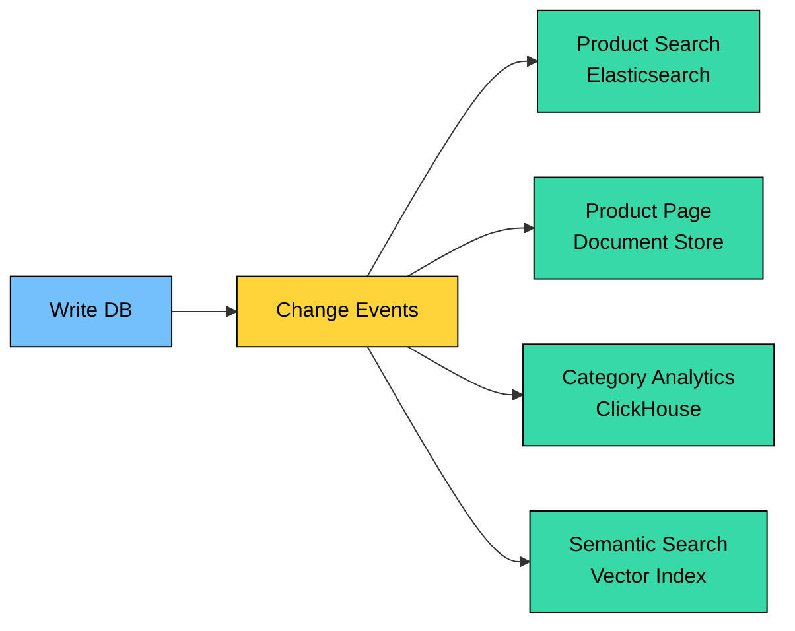
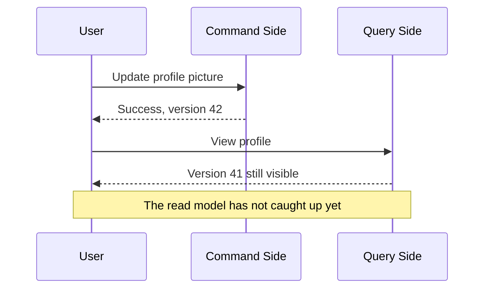
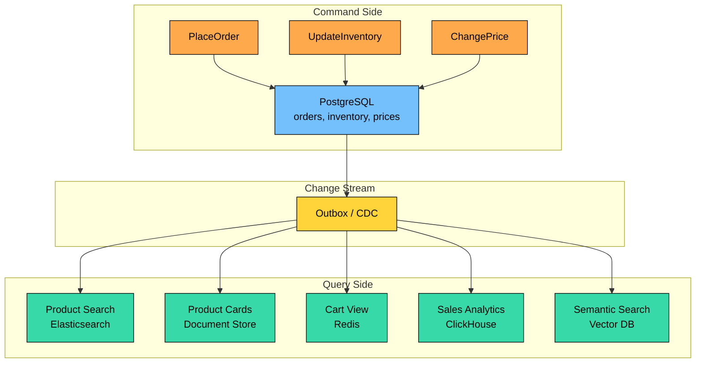

CQRS separates commands that change state from queries that read state.

It helps when writes and reads need different models, performance characteristics, or consistency guarantees, but it adds complexity when simple CRUD would be enough.

This chapter covers what commands and queries are, how CQRS differs from ordinary CRUD, implementation levels, read model synchronization, eventual consistency, its relationship with event sourcing, and when CQRS is useful or unnecessary.

---

# 1. The Problem CQRS Solves

> [!PAYWALL] This content is for premium members only.

Consider a product catalog. The write side handles actions such as adding products, updating prices, changing availability, approving seller changes, and recording audit history. The read side handles search, browsing, filtering, product detail pages, recommendation widgets, and admin dashboards.

At first, one model is attractive because there is one schema, one service, one transaction boundary, and one code path to understand.

The pressure appears when reads and writes optimize in opposite directions.

| Concern | Write Side | Read Side |
| --- | --- | --- |
| **Primary goal** | Preserve correctness | Return data quickly |
| **Model shape** | Domain model with rules | DTOs, documents, projections |
| **Storage shape** | Normalized, constrained, transactional | Denormalized, indexed, query-specific |
| **Consistency** | Usually stronger | Often can tolerate lag |
| **Scaling driver** | Business transactions | Query volume and fan-out |
| **Failure mode** | Invalid state or duplicate side effects | Stale or missing read results |

If you force both sides through the same model, the model often becomes bad at both jobs. Domain entities become bloated with display concerns. Queries become slow because they reconstruct the same view repeatedly. Writes become risky because read optimizations leak into transactional code.

CQRS separates those responsibilities.

---

# 2. The CQRS Principle

CQRS separates commands from queries.

The separation can be conceptual or physical. You do not need two databases to use CQRS. You do need separate responsibilities.

## Commands

A command expresses intent to change the system.

Good commands:

- Use imperative names
- Contain the data needed to make the decision
- Run through validation, authorization, and business rules
- Produce a success/failure outcome
- Avoid returning large query-shaped responses
- Are safe under retries, usually through idempotency keys or natural uniqueness

## Queries

A query asks for information and must not change state.

Good queries:

- Return read-specific DTOs
- Avoid side effects
- Can be cached
- Can use denormalized tables, views, search indexes, or materialized projections
- Are optimized around access patterns, not write-side domain purity

---

# 3. Levels of CQRS

CQRS is not one architecture. It is a spectrum.

## Level 1: Separate Handlers, Same Model and Database

The simplest form separates command logic from query logic in code.

This is often the best first step. It improves clarity without adding new infrastructure.

## Level 2: Separate Models, Same Database

The write side uses domain objects and invariants. The read side uses query-specific DTOs, SQL views, materialized views, or denormalized tables.

This level keeps one operational database while acknowledging that read and write models are different.

## Level 3: Separate Read and Write Stores

The write side and read side use different storage systems.

```mermaid
flowchart LR
    subgraph CommandSide["Command Side"]
        CommandAPI["Command API"]:::command
        CommandHandler["Command Handler"]:::command
        WriteModel["Write Model"]:::command
        WriteDB["PostgreSQL<br/>transactional store"]:::db
    end

    EventBus["Event Stream / CDC"]:::bus

    subgraph QuerySide["Query Side"]
        Projector["Projection Worker"]:::query
        ReadDB["Elasticsearch / Redis / DynamoDB / ClickHouse"]:::db
        QueryAPI["Query API"]:::query
    end

    CommandAPI --> CommandHandler --> WriteModel --> WriteDB
    WriteDB --> EventBus --> Projector --> ReadDB --> QueryAPI

    classDef command fill:#ffa94d,stroke:#000,color:#000
    classDef query fill:#38d9a9,stroke:#000,color:#000
    classDef db fill:#74c0fc,stroke:#000,color:#000
    classDef bus fill:#ffd43b,stroke:#000,color:#000
```

This is the version people often picture when they hear CQRS. It can work well, but it introduces projection lag, replay logic, schema evolution, duplicate handling, monitoring, and operational cost.

Use it when the read side has clear needs that the write store cannot satisfy cleanly.

---

# 4. CQRS vs Event Sourcing

CQRS and event sourcing are related, but they are not the same pattern.

| Pattern | What It Separates or Stores |
| --- | --- |
| **CQRS** | Separates write operations from read operations. |
| **Event Sourcing** | Stores state changes as an append-only sequence of events. |

You can use CQRS without event sourcing:

- Write current state to PostgreSQL.
- Publish changes through an outbox or CDC.
- Build read models for search and dashboards.

You can use event sourcing without a large CQRS setup:

- Store events as the source of truth.
- Rehydrate aggregates from events.
- Query directly from a simple projection.

They are often combined because event streams are useful for rebuilding read models, but one does not require the other.

---

# 5. Synchronizing Read Models

Once the read model is separate from the write model, you need a synchronization strategy.

## Synchronous Projection

The command updates the write model and read model in the same transaction or same request path.

This works when both models live in the same database or when a small amount of extra write work is acceptable.

#### Pros

- Read model is current when the command returns.
- Simpler user experience for read-after-write flows.

#### Cons

- Slower writes.
- Read-side failures can block writes.
- Atomicity is difficult across different storage systems.

Use synchronous projection for small, critical read models where correctness matters more than throughput.

## Asynchronous Projection

The command writes to the write store and emits a change. A projector consumes that change and updates the read store.

#### Pros

- Write path remains focused.
- Read models can scale and evolve independently.
- Multiple read models can be updated from the same change stream.

#### Cons

- Read model may lag behind the write model.
- Projectors must handle duplicate messages, ordering gaps, and failed deliveries.
- Rebuilds and replays need operational tooling.

The safest implementation usually uses the **outbox pattern** or **change data capture (CDC)**. Publishing an event after a database commit without an outbox creates a failure window: the write may succeed, but the event may be lost.

## Hybrid Projection

Many production systems mix both approaches:

- Update a small read-your-writes cache synchronously.
- Update search indexes asynchronously.
- Update analytics projections asynchronously.
- Query the write store for critical confirmation screens.

---

# 6. Read Model Patterns

The query side should be shaped around actual access patterns.

## Denormalized Views

Reads often need display-ready data.

The read model avoids repeated joins and transformation work on every request.

## Materialized Aggregates

Dashboards often need precomputed totals.

Instead of running that query repeatedly under user traffic, store a projection:

## Search Documents

Search engines usually want documents, not normalized relational rows.

For product search, a read document might include product name, category, seller, price, rating, availability, tags, and precomputed ranking signals. The search index can evolve independently from the write-side product schema.

## AI-Oriented Read Models

Modern AI systems often need query-side structures that do not resemble the write model:

- Embeddings for semantic search
- Chunked document stores for retrieval
- Feature tables for ranking or recommendations
- Moderation or safety labels
- Conversation summaries

These are read models. They should be updated from controlled write-side changes or events, not by letting inference code mutate the core transactional model directly.

## Multiple Read Models

One write-side change can feed several read models.

---

# 7. Handling Eventual Consistency

When read models update asynchronously, they lag behind the write model.

This is not automatically wrong. It becomes wrong when the product experience assumes immediate consistency.

## Read Your Writes

After a command succeeds, route that user's next read to a fresher source.

Options:

- Read from the write store for a short window.
- Update a small cache synchronously.
- Return enough data from the command response to update the UI.
- Use session consistency rules for the user who made the change.

## Optimistic UI

The client updates the screen immediately and reconciles later.

This is appropriate for low-risk user-local changes such as settings, profile metadata, or UI preferences. It is not appropriate for payments, inventory, account balances, or security-sensitive state unless the product explicitly handles correction.

## Wait for Projection

For workflows where the user expects processing time, return an operation ID and let the client poll or subscribe.

Examples:

- Image processing
- Report generation
- Large imports
- Embedding generation
- Order state transitions

## Version Tracking

Attach a version to write-side changes.

The query side can return fresh data, briefly wait for the projection, or return a clear "still processing" response.

## Monitor Projection Lag

Projection lag is a production metric. Track it like latency or error rate.

Useful signals:

- Oldest unprocessed event age
- Consumer lag
- Projection error rate
- Dead-letter queue depth
- Last successful projection timestamp

---

# 8. Operational Concerns

CQRS systems fail in specific ways. Projectors must be idempotent, out-of-order events need versions or conflict rules, poison events need isolation, schemas and projections need careful versioning, and replay must not resend emails, charge cards, or trigger external side effects. Teams also need backfill procedures, access-control reviews for denormalized read models, and deletion or retention rules for copies in search indexes, caches, embeddings, and analytics stores.

CQRS adds value only when the team can operate these failure modes.

---

# 9. When to Use CQRS

| Good Fit | Why CQRS Helps |
| --- | --- |
| **Different read/write models** | Domain writes and query views can evolve separately. |
| **High read complexity** | Search, dashboards, feeds, and aggregates can use purpose-built models. |
| **Read-heavy paths** | Read models can be cached, denormalized, and scaled separately. |
| **Event-driven systems** | Events or CDC can feed projections naturally. |
| **Multiple consumers of the same state** | Each consumer can get a read model shaped for its use case. |
| **AI retrieval or recommendation paths** | Vector indexes and feature stores can be maintained as query-side projections. |

| Poor Fit | Why CQRS Adds Cost |
| --- | --- |
| **Simple CRUD** | Separate models add ceremony without enough benefit. |
| **Small team or early product** | Operational overhead can slow delivery. |
| **Strict immediate consistency everywhere** | Async read models may violate product expectations. |
| **Simple query patterns** | Indexes, SQL views, or caching may be enough. |
| **No projection ownership** | Read models will drift or break without owners. |

### Decision Heuristic

Start with ordinary CRUD or Level 1 CQRS. Move further only when you can name the specific pressure: the domain model is being polluted by read concerns, queries need a shape the write schema cannot provide cleanly, read and write traffic scale differently, purpose-built stores are needed for search or analytics, the product can tolerate eventual consistency, and the team can operate projection pipelines.

---

# 10. Example: E-Commerce CQRS

The write side protects transactional correctness. The read side serves different query workloads with different stores.

This is useful only if those stores solve real problems. If a relational database with good indexes handles the product catalog well, full CQRS is unnecessary.

---

# 11. Key Takeaways

- CQRS separates commands that change state from queries that read state.
- CQRS does not require separate databases, event sourcing, or microservices.
- Start with code and model separation before adding read/write database separation.
- Read models are purpose-built views, not blind copies of the write database.
- Async projections introduce eventual consistency, duplicate handling, replay, schema evolution, and monitoring needs.
- Event sourcing and CQRS are often combined, but they solve different problems.
- Use CQRS when read and write requirements truly diverge. Avoid it for simple CRUD.

---

# Quiz
