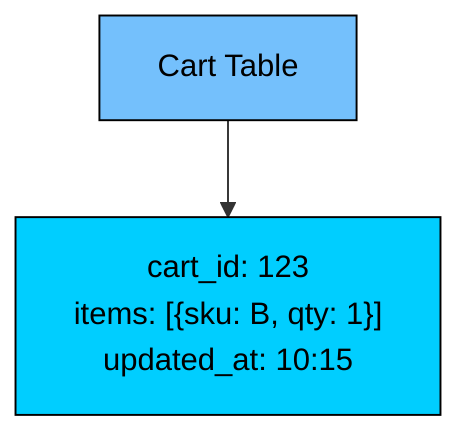
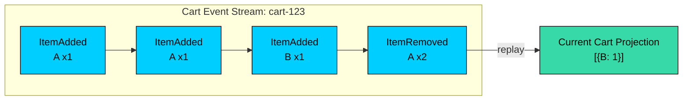
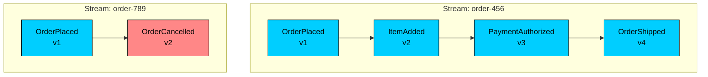
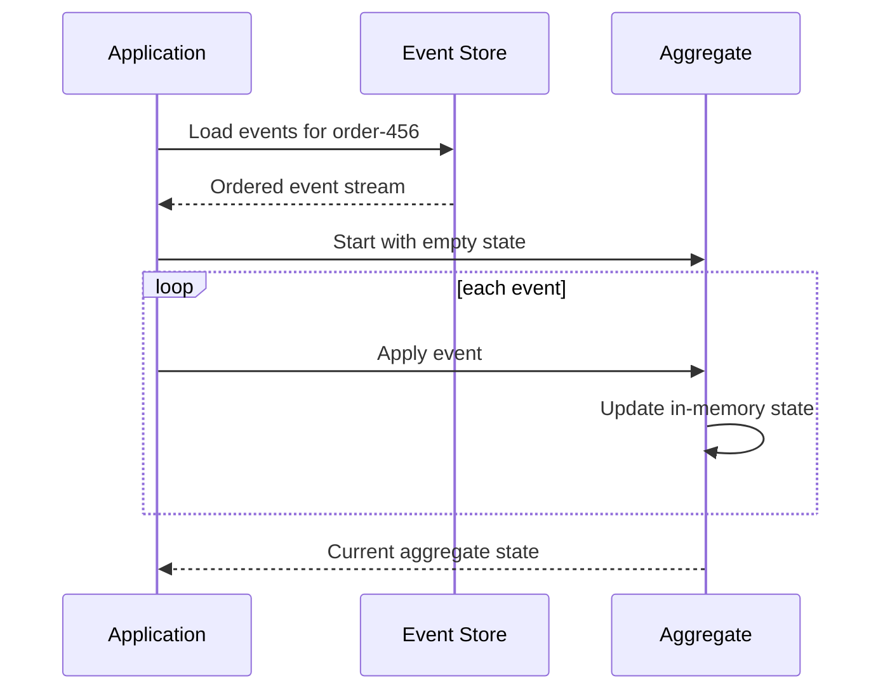
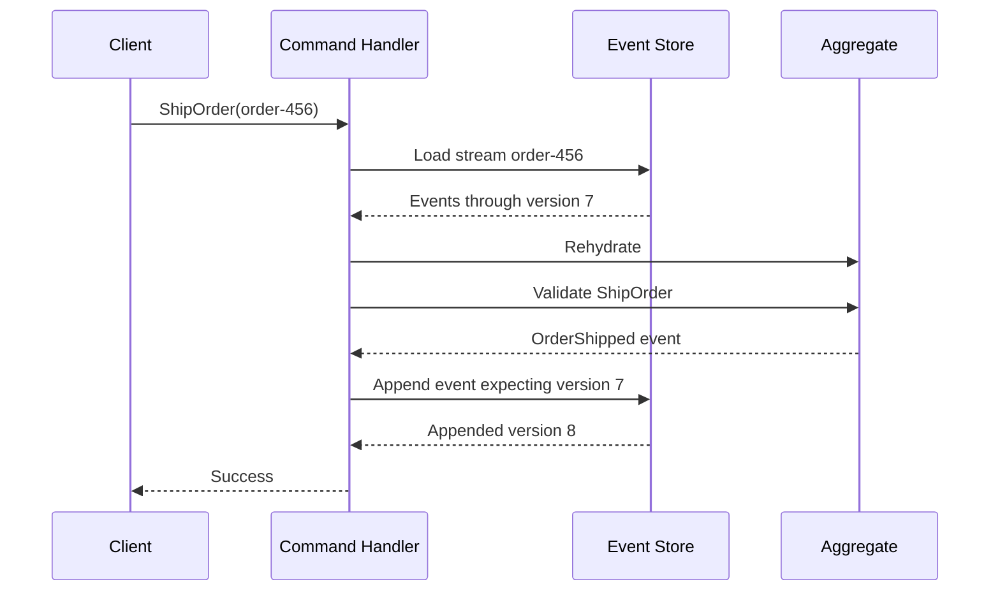
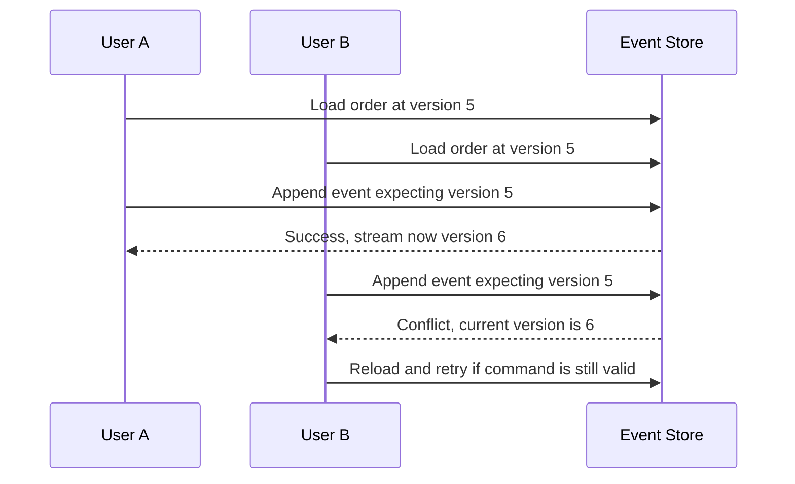
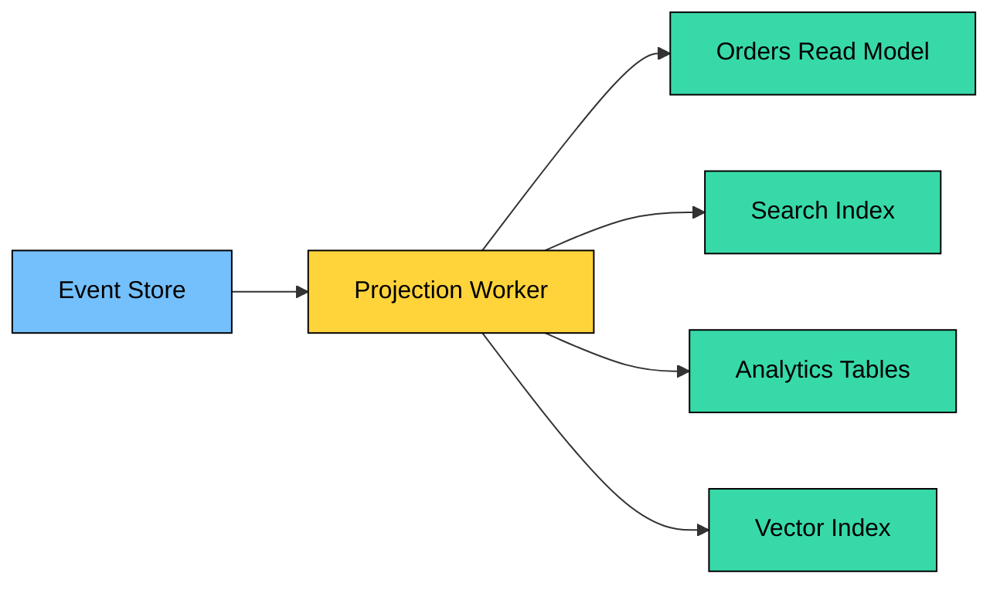
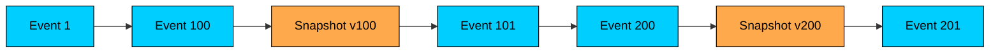
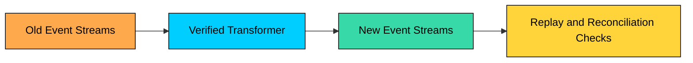
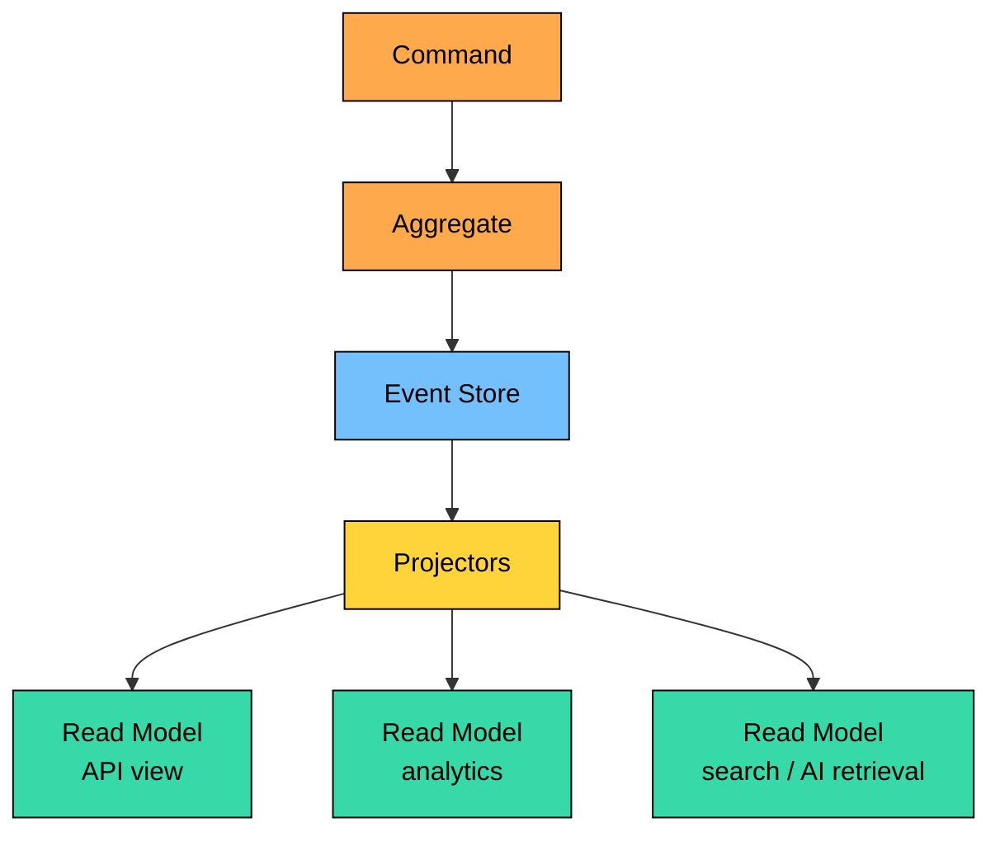

Event sourcing stores state changes as an append-only sequence of events instead of storing only the latest state.

It is useful when history is part of the domain, but it changes how teams model data, query state, evolve schemas, replay events, and handle privacy.

This chapter covers how event sourcing differs from state-based persistence, how event streams are structured, how state is rebuilt, snapshots, projections, command handling, optimistic concurrency, schema evolution, its relationship with CQRS, operational risks, and when to use the pattern.

---

# 1. State-Based vs Event-Sourced Storage

> [!PAYWALL] This content is for premium members only.

Consider a shopping cart.

## State-Based Storage

State-based storage keeps the latest representation.

The cart row is updated each time the user changes the cart.

## Event-Sourced Storage

Event sourcing stores the facts.

The current cart is computed by applying events in order.

| Aspect | State-Based | Event-Sourced |
| --- | --- | --- |
| **Source of truth** | Current state | Event stream |
| **Write operation** | Update or replace state | Append event |
| **History** | Separate audit log required | Built into the model |
| **Current state** | Stored directly | Derived through replay or projection |
| **Queries** | Query state tables | Query projections/read models |
| **Schema evolution** | Migrate current state | Version and upcast historical events |

Event sourcing does not mean data can never be removed under any circumstances. Real systems still need retention, legal deletion, redaction, encryption key destruction, and privacy controls. The point is that domain state changes are modeled as append-only facts.

---

# 2. Events and Event Streams

An event is an immutable record of something that already happened.

Good event names are past tense:

- `OrderPlaced`
- `PaymentAuthorized`
- `InventoryReserved`
- `EmailChanged`
- `DocumentEmbeddingGenerated`

Avoid vague names such as `OrderUpdated`. They hide the business meaning.

## Event Structure

Important fields:

- **eventId:** Unique identifier for idempotency and tracing.
- **streamId:** The aggregate or entity stream the event belongs to.
- **streamVersion:** Position in that stream, used for ordering and concurrency.
- **eventType:** Business fact that happened.
- **eventSchemaVersion:** Version of the event payload shape.
- **metadata:** Operational context such as correlation ID, actor, source, and causation.

## Event Streams

Events are usually grouped by aggregate or entity.

The event store must preserve order within a stream. Global ordering across all streams is useful for projections, but not always required for aggregate correctness.

## Storage Technologies

| Technology | Common Use |
| --- | --- |
| **EventStoreDB** | Purpose-built event store with streams and subscriptions. |
| **PostgreSQL** | Practical event store for many systems using append-only tables and JSONB. |
| **Kafka / Redpanda / Pulsar** | High-throughput event logs and stream processing, often paired with another source of truth. |
| **DynamoDB** | Managed append-only stream patterns with conditional writes. |
| **Cloud streams** | Kinesis, Pub/Sub, Event Hubs for managed event pipelines. |

Kafka is an event log, but it is not automatically a complete event-sourcing database for every domain. You still need to think about stream identity, retention, compaction, replay, ordering, idempotency, and how aggregates are loaded.

---

# 3. Rebuilding State From Events

In event sourcing, current state is a function of history.

This is often called **rehydration** when rebuilding an aggregate for command handling.

Rehydration should be deterministic. Applying the same events in the same order should produce the same state. Avoid event handlers that depend on current time, random values, external API calls, or mutable global configuration.

---

# 4. Commands and Optimistic Concurrency

Commands request changes. Events record changes that have been accepted.

Command flow:

1. Load the aggregate event stream.
2. Rehydrate current state.
3. Validate the command against business rules.
4. Produce one or more new events.
5. Append events with an expected stream version.

## Optimistic Concurrency

Event stores usually use expected versions to prevent lost updates.

This is where conflict detection belongs: at the stream boundary. The retry should re-run business rules against the new state. Do not blindly append after a conflict.

## Idempotency

Clients and message handlers retry. Event-sourced systems still need idempotency.

Common approaches:

- Include a command ID or idempotency key.
- Store processed command IDs.
- Enforce natural uniqueness in events or streams.
- Make command handlers detect when the intended event already exists.

Without idempotency, a retry can append duplicate business facts.

---

# 5. Projections and Read Models

Event streams are optimized for appending and replaying by stream, not for arbitrary queries.

To answer product questions, dashboard questions, or API queries, you build **projections**.

Examples:

- `order_summary_by_customer`
- `open_orders_by_warehouse`
- `account_balance`
- `product_search_document`
- `customer_lifetime_value`
- `document_embedding_index`

Projection handlers must be idempotent. If a projector sees the same event twice, the read model should still be correct.

Projection lag is a first-class operational metric. Track consumer lag, oldest unprocessed event age, projector error rate, and dead-letter queue depth.

---

# 6. Snapshots

Replaying events from the beginning is simple, but long streams can become slow.

A **snapshot** stores aggregate state at a specific stream version. Events remain the source of truth; snapshots are an optimization.

Loading with snapshots:

1. Load the latest snapshot.
2. Load events after the snapshot version.
3. Apply only those later events.

Snapshot when it solves a measured problem. Many streams never need snapshots. A stream with thousands of events or expensive replay logic might.

Practical rules:

- Store the snapshot version.
- Keep snapshots rebuildable.
- Do not treat snapshots as the source of truth.
- Validate snapshot compatibility when event schemas evolve.

---

# 7. Event Schema Evolution

Events are long-lived. Code changes faster than history.

You need a plan before the first production event is written.

## Prefer Additive Changes

Add optional fields rather than renaming or removing fields.

Good:

Risky:

## Upcasting

Upcasting transforms older event shapes into the shape expected by current code at read time.

## Versioned Event Types

Some teams keep event type names stable and version the schema in metadata. Others encode versions into names such as `UserCreatedV2`.

Either can work. The important part is that consumers know what contract they are reading and that compatibility is tested.

## Copy-Transform

For major migrations, you may copy old streams into new streams with transformed events.

This is a serious migration. It needs checksums, reconciliation, rollback plans, and read-side rebuilds.

---

# 8. Event Sourcing and CQRS

Event sourcing and CQRS are often used together, but they solve different problems.

| Pattern | Purpose |
| --- | --- |
| **Event Sourcing** | Stores facts as the source of truth and derives state by replay. |
| **CQRS** | Separates command paths from query paths. |

You can use event sourcing without CQRS if the query needs are simple. You can use CQRS without event sourcing if the write store keeps current state and publishes changes through an outbox or CDC.

They combine naturally because event-sourced systems usually need projections for queries.

---

# 9. Advantages of Event Sourcing

## Auditability

The event stream records what happened and when. If events include actor and correlation metadata, you can reconstruct business history without a separate audit system.

## Temporal Reasoning

You can answer questions such as:

- What was this account balance after transaction 57"
- What was the subscription state on March 1"
- Which events led to this order being cancelled"

## Debugging and Replay

When a bug appears, you can replay the event stream through old and new code to reproduce the state transition. This is extremely useful in complex domains.

## New Projections

You can build new read models from historical events:

- Analytics dashboards
- Search indexes
- Customer timelines
- Fraud features
- AI retrieval indexes

This is one of the strongest practical benefits, but only if events were modeled with enough stable business meaning.

## Integration

Events can feed other systems without scraping current-state tables. This is useful for notifications, analytics, compliance, ML pipelines, and operational workflows.

---

# 10. Disadvantages and Risks

## Higher Complexity

You must understand events, streams, aggregates, projections, snapshots, replay, schema evolution, idempotency, and concurrency. That is a lot of machinery for a simple CRUD application.

## Query Limitations

The event store is not your query database. Most user-facing queries need projections. Every new query pattern may need a new read model or a change to an existing one.

## Eventual Consistency

If projections update asynchronously, a command may succeed before the query side reflects it. Product flows need read-your-writes handling, optimistic UI, polling, or clear "processing" states.

## Storage Growth

Events accumulate. You need partitioning, archiving, retention policies, cold storage, and backup strategies. Some domains require indefinite retention; others legally require deletion or redaction.

## Privacy and Compliance

Do not casually put sensitive personal data into immutable events.

Use strategies such as:

- Store references instead of raw sensitive values.
- Encrypt sensitive fields with rotatable keys.
- Keep personal data in separate erasable stores.
- Redact or tombstone when legally required.
- Avoid putting prompts, model outputs, secrets, or regulated data in events unless retention is intentional.

This is especially important in AI systems, where prompts and outputs may contain user-provided sensitive data.

## Replay Hazards

Replay should rebuild state. It should not repeat side effects.

Projection code must not send emails, charge cards, call external APIs, or publish user-visible notifications during replay unless explicitly designed to do so.

---

# 11. When to Use Event Sourcing

| Good Fit | Why It Helps |
| --- | --- |
| **Audit-heavy domains** | History is a core requirement. |
| **Financial or ledger-like workflows** | Ordered facts matter more than mutable rows. |
| **Complex business state machines** | Events explain how state changes over time. |
| **Temporal queries** | You need to answer past-state questions. |
| **Rebuildable read models** | New projections can be built from history. |
| **Event-driven integration** | Other systems need trustworthy business facts. |

| Poor Fit | Why It Hurts |
| --- | --- |
| **Simple CRUD** | The machinery outweighs the benefit. |
| **Ad-hoc reporting only** | A warehouse or audit table may be simpler. |
| **Weak domain events** | If events are just row-change logs, the model adds little value. |
| **Small teams without operational capacity** | Projections, replay, and schema evolution need ownership. |
| **Sensitive data with strict deletion needs** | Immutable history complicates privacy controls. |

Use event sourcing when history is part of the business model, not merely because events are fashionable.

---

# 12. Real-World Examples

## Banking and Ledgers

Financial systems have long used ledger-like records: deposits, withdrawals, transfers, fees, reversals, adjustments. Current balance is derived from ordered facts. Not every ledger implementation is event sourcing in the software architecture sense, but the underlying idea is similar: preserve the facts that changed the balance.

## Order Management

Orders move through states: placed, paid, packed, shipped, delivered, returned, refunded. Event sourcing can help customer support, compliance, and analytics understand exactly what happened.

## Collaborative Systems

Document editing, workflow tools, and collaboration products often benefit from operation history, replay, conflict handling, and user timelines.

## AI and Data Workflows

Event sourcing can record durable business facts around AI systems:

- Document uploaded
- Embedding generated
- Retrieval index updated
- Model response approved
- Moderation decision recorded

Be careful not to store raw prompts or sensitive outputs by default. Event sourcing should support auditability without creating a permanent privacy problem.

---

# 13. Key Takeaways

- Event sourcing stores business facts as the source of truth.
- Current state is rebuilt by replaying events or reading projections derived from events.
- Events should be named as past-tense facts and designed as long-lived contracts.
- Snapshots optimize replay but do not replace the event stream.
- Optimistic concurrency protects streams from lost updates.
- Projections are required for most real query patterns.
- Event sourcing and CQRS pair well, but they are different patterns.
- The hard parts are schema evolution, replay safety, idempotency, privacy, projection lag, and operations.
- Use event sourcing when history is central to the domain. Avoid it for simple CRUD.

---

# Quiz
