Service discovery helps services find each other inside the system. External clients still need a stable and controlled way to enter it.

A mobile app, browser, or partner integration should not need to know the internal service map. Directly exposing every backend service creates chattiness, duplicated edge policy, and tight coupling to backend boundaries.

The **API Gateway pattern** places a controlled entry point in front of backend services. Clients call the gateway, and the gateway handles edge concerns such as routing, authentication, rate limits, request shaping, protocol translation, observability, and selected aggregation.

The goal is to keep the public API stable while backend services evolve behind it.

---

# The Problem: Exposing Services Directly

Consider a commerce mobile app. The home screen needs product recommendations, cart state, recent orders, promotional banners, and user profile data.

Without a gateway, the app calls each backend service directly.

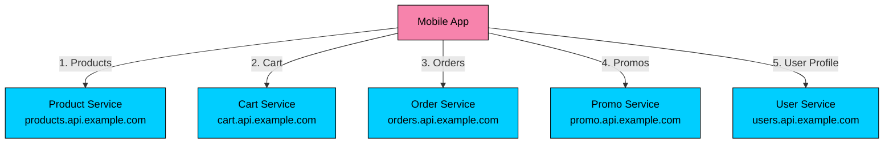

This design creates four problems.

### 1. Client Chattiness

Every network round trip adds latency and failure probability. Parallel requests help, but connection setup, TLS negotiation, cellular network variance, retries, and request coordination still happen in the client.

| Home Screen Dependency | Example Latency |
|------------------------|-----------------|
| Product recommendations | 150 ms |
| Cart summary | 120 ms |
| Recent orders | 180 ms |
| Promotional banners | 100 ms |
| User profile | 130 ms |

If these calls run sequentially, the screen waits on the sum. If they run in parallel, the screen still waits on the slowest dependency, plus client-side orchestration overhead. On a mobile network, each extra request is another timeout, retry, or partial-render case.

### 2. Tight Coupling to Backend Boundaries

Direct clients become coupled to internal service ownership.

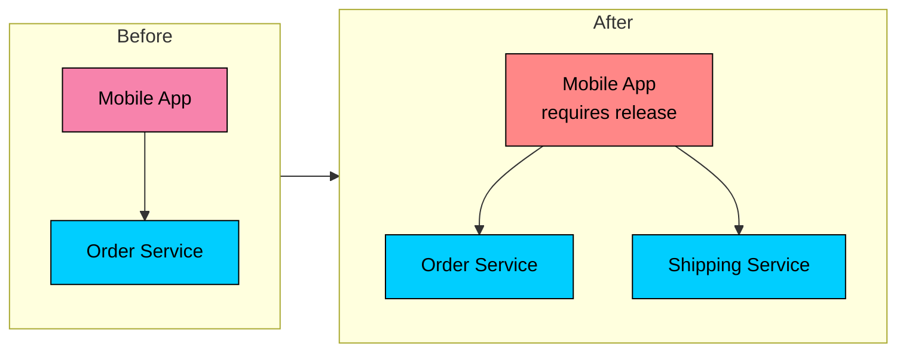

If the order domain splits into order, shipping, and fulfillment services, every direct client must learn the new topology. Mobile clients make this worse because old app versions may stay active for months.

### 3. Duplicated Edge Concerns

External-facing concerns tend to be repeated poorly when every service exposes its own public API.

| Concern | Direct Exposure Problem |
|---------|-------------------------|
| Authentication | Each service validates external tokens separately |
| Authorization | Policy decisions drift between services |
| Rate limiting | Limits are inconsistent across endpoints |
| TLS and certificates | Every service manages public edge security |
| CORS | Browser policy is configured in many places |
| Request logging | Logs use different fields, formats, and correlation IDs |

The edge is also the first security boundary. Inconsistent behavior at that boundary becomes an operational risk.

### 4. Protocol and Payload Mismatch

External clients usually want stable HTTPS APIs. Internal services may use gRPC, event streams, queues, private HTTP endpoints, or provider-specific APIs.

Browsers usually consume HTTPS APIs. Mobile clients need stable screen-oriented endpoints, independent of the current backend decomposition. Partner APIs should receive public contract fields, not internal fields such as `password_hash`, fraud flags, or service-specific debug metadata.

---

# The Solution: API Gateway

> [!PAYWALL] This content is for premium members only.

An API gateway is an edge service that receives client requests, applies policy, and routes the request to one or more backend services.

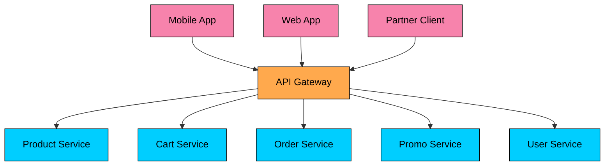

The gateway commonly handles:

- Request routing
- Authentication and coarse authorization
- Rate limiting, quotas, and abuse controls
- TLS termination and mTLS to internal services
- Request validation and schema enforcement
- Protocol translation
- Response shaping and field filtering
- Observability, audit logs, and correlation IDs
- Response aggregation for selected use cases

Keep business rules in the domain services that own the data and invariants.

---

# API Gateway, Load Balancer, Ingress, and Service Mesh

These terms overlap, but each one solves a different part of the traffic path.

| Component | Primary Role |
|-----------|--------------|
| **Load balancer** | Distribute traffic across healthy instances |
| **Reverse proxy** | Forward requests, terminate TLS, apply proxy-level rules |
| **Kubernetes Ingress** | Expose HTTP(S) services into a Kubernetes cluster |
| **Kubernetes Gateway API** | Define richer, role-oriented traffic routing for Kubernetes |
| **API gateway** | Manage client-facing APIs, policies, routing, and API contracts |
| **Service mesh** | Manage service-to-service traffic, identity, retries, and telemetry |

A product may use several of these together. For example, traffic may enter through a cloud load balancer, reach an Envoy-based gateway, route to Kubernetes Services, and then use a mesh for internal mTLS. The gateway is the client-facing API boundary in that chain.

---

# Core Responsibilities

### 1. Request Routing

The gateway maps client-facing routes to backend services.

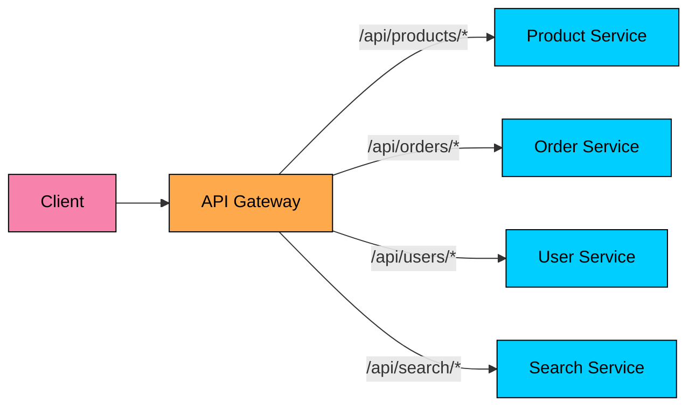

Routing can use multiple inputs.

| Routing Input | Example |
|---------------|---------|
| Path | `/api/v1/products` -> Product Service |
| Method | `GET /orders` -> Order Query API, `POST /orders` -> Order Command API |
| Header | `X-Client-Version: 8` -> New route set |
| Hostname | `partner.example.com` -> Partner API |
| Tenant | `tenant_id=acme` -> Region-specific backend |
| Weight | 5% of traffic -> Canary service |

Routing rules are configuration, but they still need ownership. Unreviewed route changes can break clients as easily as code changes.

### 2. Authentication and Authorization

The gateway is usually the first place to authenticate external requests.

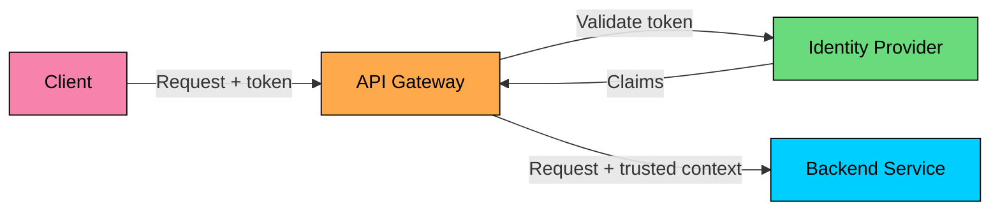

Common patterns include:

| Pattern | Use |
|---------|-----|
| JWT validation | Verify signature, issuer, audience, and expiry at the edge |
| OAuth2/OIDC integration | Delegate identity to an identity provider |
| API keys | Identify partners, applications, or service consumers |
| mTLS | Authenticate clients or internal services with certificates |
| Token exchange | Replace an external token with a narrower internal token |
| Context propagation | Pass verified user, tenant, and request attributes downstream |

Header propagation needs care. The gateway must strip inbound spoofable headers such as `X-User-ID` before adding trusted versions. Downstream services should trust those headers only from the gateway or from authenticated internal traffic.

Services still own domain authorization. The order service owns rules such as "this user can cancel this order" because it owns the order state.

### 3. Rate Limiting, Quotas, and Abuse Controls

The gateway can reject abusive or excessive traffic before it consumes backend capacity.

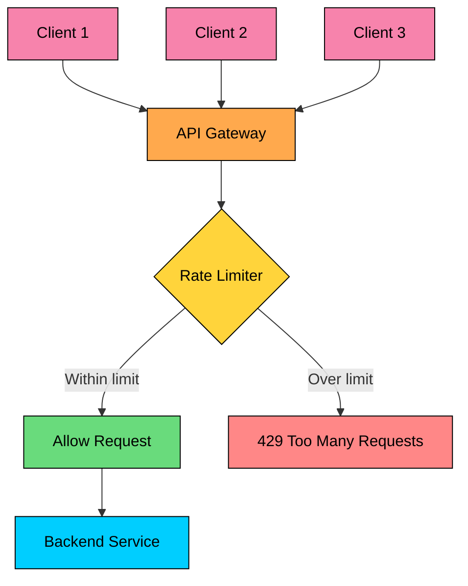

| Strategy | Behavior | Good Fit |
|----------|----------|----------|
| Fixed window | N requests per time window | Simple public APIs |
| Sliding window | Counts recent requests over a moving interval | Smoother enforcement |
| Token bucket | Tokens refill over time, bursts are allowed | APIs with natural traffic bursts |
| Leaky bucket | Requests drain at a steady rate | Protecting fragile backends |
| Per-user limit | One user cannot consume the whole service | SaaS applications |
| Per-endpoint limit | Expensive endpoints get stricter limits | Search, export, report generation |

Some APIs need more than request counts. A search, export, report, or inference request may vary widely in cost, so gateways often enforce tenant quotas, concurrency limits, and endpoint-specific budgets instead of only counting raw requests.

### 4. Request Validation and Transformation

The gateway can reject malformed requests before they reach backend code.

Useful checks include:

- Required headers and query parameters
- JSON schema or OpenAPI request validation
- Maximum body size
- Content type
- Allowed methods
- API version

The gateway can also transform requests and responses, but this should stay mechanical: rename fields, remove internal fields, add correlation IDs, or adapt one protocol shape to another. Business calculations should stay in services.

Transformations are useful, but excessive transformation logic turns the gateway into a hidden application layer.

### 5. Protocol Translation

The public API and internal protocol do not have to match.

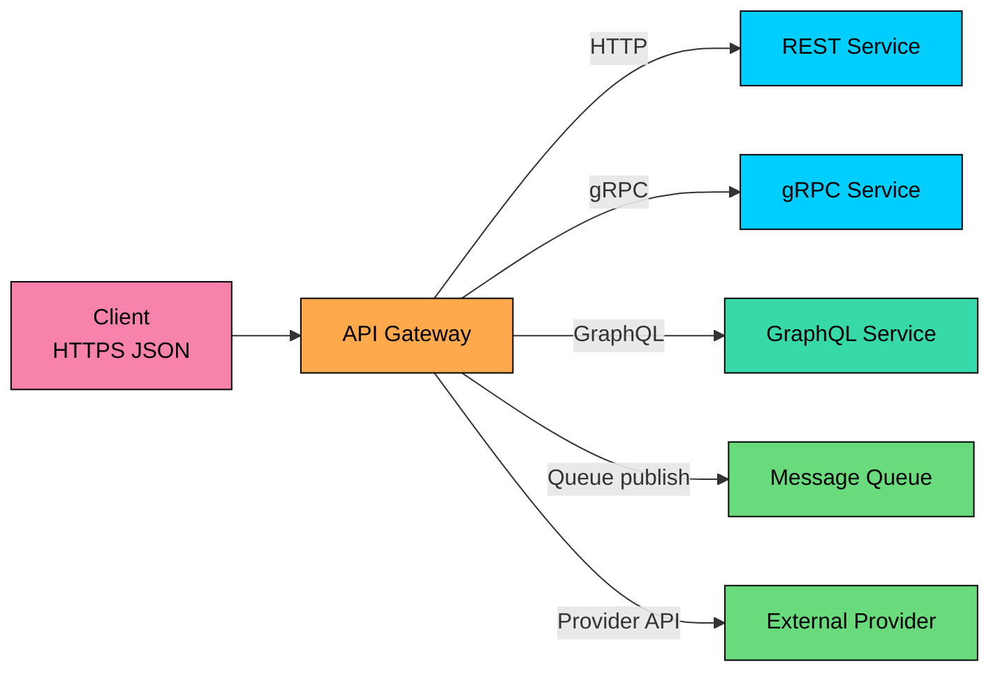

This is common when browser and mobile clients use HTTPS JSON, while internal services use gRPC, async messaging, or provider-specific APIs. The gateway can hide those internal protocol choices without exposing them to clients.

### 6. Request Aggregation

The gateway can call several services and compose one response.

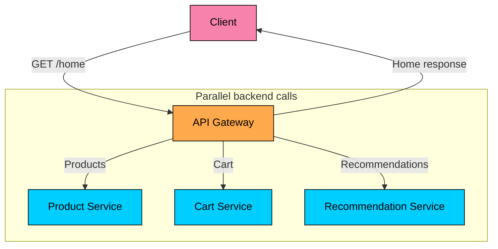

Aggregation reduces client complexity, especially for mobile screens. It also moves fanout to the server side, where timeouts, retries, caching, and partial responses can be controlled consistently.

Aggregation has a cost. If one gateway request fans out to eight services, the tail latency and failure probability of the overall request can rise quickly. Use tight timeouts, bounded concurrency, partial responses, and fallback behavior. For heavy composition, a Backend for Frontend or GraphQL layer may be a better owner than a general gateway.

### 7. Observability and Audit

The gateway sees every external request, so it is a natural place to standardize telemetry.

It should emit:

- Request ID and trace context
- Client identity, tenant, and API key where applicable
- Route matched and upstream service
- Status code and error class
- Latency, request size, and response size
- Rate-limit decisions
- Authentication and authorization outcomes

For expensive or sensitive APIs, gateway logs may also need quota decisions, provider names, estimated cost, cache hits, and policy outcomes. Sensitive request and response bodies should be logged only under explicit policy because they may contain user data, secrets, or regulated information.

---

# Gateway Architecture Patterns

### Single Gateway

A single gateway tier handles all public API traffic.

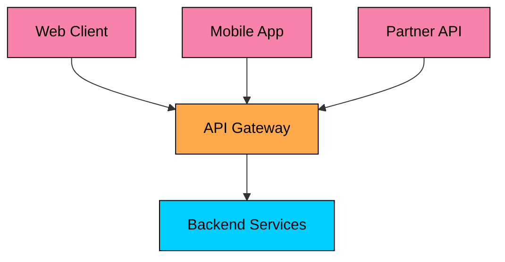

This works well when clients have similar requirements and the organization can keep gateway policy disciplined.

### Backend for Frontend

A Backend for Frontend, or BFF, creates separate gateway-like backends for different client experiences.

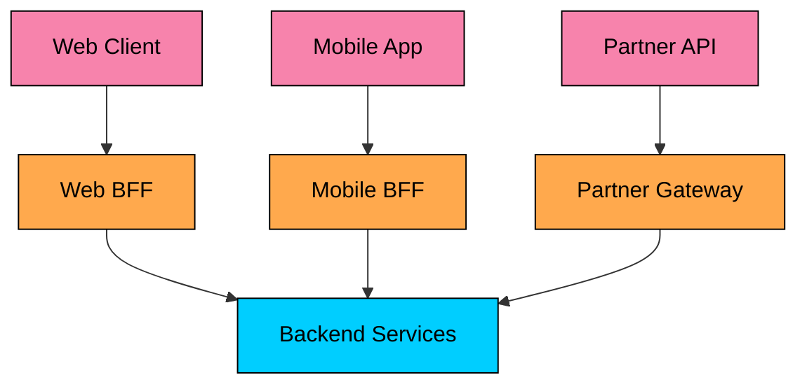

BFFs are useful when web, mobile, and partner APIs need different payloads, authentication flows, release cycles, or aggregation behavior. They cost more to operate, but they prevent one shared gateway from becoming a pile of client-specific exceptions.

### Gateway Plus Service Mesh

The gateway handles north-south traffic, meaning client traffic entering the system. A service mesh handles east-west traffic between services.

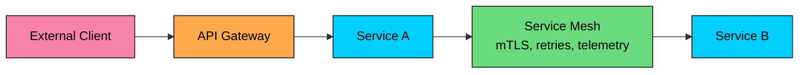

This split avoids pushing internal service-to-service policy into the public gateway.

---

# API Gateway Implementations

### Managed Cloud Gateways

Managed gateways reduce operational work and integrate with cloud identity, serverless, logging, and private networking.

AWS API Gateway supports REST APIs, HTTP APIs, and WebSocket APIs. REST APIs have a larger feature set, including capabilities such as API keys, per-client throttling, request validation, request body transformation, private endpoints, caching, and response streaming. HTTP APIs are simpler and lower cost, but have fewer management features. WebSocket APIs support bidirectional client communication.

Cloud options are useful when the workload fits the provider model. They are less attractive when traffic volume, latency, custom plugins, multi-cloud requirements, or local development workflows make managed constraints expensive.

### Kong, Apache APISIX, and Similar Gateways

Kong and Apache APISIX are plugin-oriented gateways. They are common when teams want self-hosted or hybrid API management with authentication, rate limiting, transformations, observability, developer portals, and custom plugins.

Kong also has AI gateway features for model routing, provider abstraction, token-level limits, semantic caching, guardrails, PII handling, and model observability. Treat those features as gateway policy around AI traffic, not as a replacement for application-level safety and evaluation.

### NGINX and HAProxy

NGINX and HAProxy are mature proxies often used for routing, TLS termination, load balancing, and edge controls. They are strong choices for high-throughput HTTP or TCP routing, especially when the gateway needs to stay thin.

They can be extended, but complex API management workflows may require commercial editions, modules, Lua, external policy services, or a separate API management layer.

### Envoy and Envoy Gateway

Envoy is a modern L4/L7 proxy with dynamic configuration, rich telemetry, retries, circuit breaking, and advanced load balancing. It is widely used as a building block for service meshes and gateways.

Envoy Gateway brings Envoy into the Kubernetes Gateway API model. Gateway API is the newer Kubernetes traffic API that addresses many limitations of the older Ingress model by using resources such as `GatewayClass`, `Gateway`, and `HTTPRoute`.

### Comparison

| Option | Good Fit | Tradeoff |
|--------|----------|----------|
| Managed cloud gateway | Serverless APIs, cloud-native auth, low ops burden | Provider-specific features, pricing, limits |
| Kong / APISIX | API management, plugins, hybrid deployments | Operate the control plane and plugins carefully |
| NGINX / HAProxy | Thin, fast proxying and load balancing | Less API-management behavior without extensions |
| Envoy / Envoy Gateway | Kubernetes Gateway API, mesh-adjacent routing, dynamic config | More concepts and operational surface |
| BFF service | Client-specific aggregation and payload shaping | More application code to own |

---

# Design Considerations

### High Availability

The gateway sits on the request path. Run it as a highly available tier.

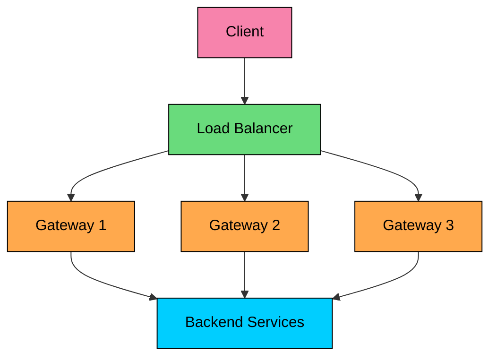

Use multiple instances, health checks, zone redundancy, automated rollout rollback, and configuration validation. A bad gateway config can be as damaging as a bad deployment.

### Keep Gateway Logic Thin

The gateway should enforce edge policy and route traffic. Domain behavior belongs in services.

### Good Gateway Responsibilities

- Route `/api/orders/*` to Order Service
- Validate tokens and attach trusted context
- Apply tenant and endpoint rate limits
- Remove internal fields from responses

### Poor Gateway Responsibilities

- Calculate order totals
- Decide refund eligibility
- Send notification emails
- Update domain databases

A gateway with business logic becomes a second monolith, but with worse ownership because every team depends on it.

### Latency and Fanout

The gateway adds work to every request. Keep the hot path short.

Minimize latency with connection pooling, efficient TLS, HTTP/2 or HTTP/3 where supported, local service discovery, bounded middleware chains, and caching where correctness allows it.

Aggregation needs stricter control. A gateway endpoint that fans out to many services should set per-upstream timeouts and decide what partial response is acceptable.

### Security Boundaries

Treat the gateway as an edge control point inside a broader security model.

- Validate external identity at the gateway.
- Strip untrusted inbound headers before adding trusted context.
- Use mTLS or another strong trust mechanism between gateway and services.
- Keep service-level authorization for domain-specific decisions.
- Apply WAF, bot protection, and DDoS controls at or before the gateway when needed.
- Avoid logging secrets, access tokens, prompts, or sensitive payloads by default.

For AI APIs, also consider prompt injection controls, PII redaction, model allowlists, tool-use policy, and tenant-level cost limits.

### API Versioning

Gateways can route different API versions while clients migrate.

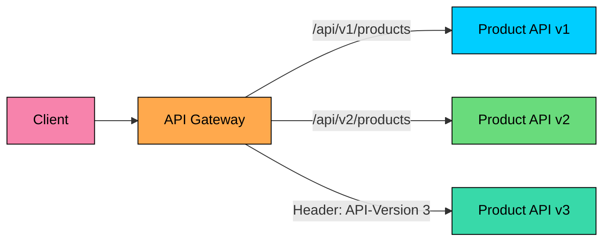

Common versioning options:

- URL path, such as `/api/v1`
- Header, such as `API-Version: 2`
- Media type, such as `Accept: application/vnd.example.v2+json`
- Separate hostname, such as `v2.api.example.com`

Versioning through the gateway helps traffic migration. Clear deprecation windows and compatibility tests are still required.

---

# When to Use an API Gateway

Use a gateway when the system has external clients, multiple backend services, shared edge policies, partner APIs, protocol translation, or client-specific aggregation.

| Scenario | Why a Gateway Helps |
|----------|---------------------|
| Mobile and web clients | Stable API contract and fewer client round trips |
| Multiple backend services | Centralized routing and edge policy |
| Partner APIs | API keys, quotas, audit logs, and contract isolation |
| Internal protocols differ from public API | Translation between HTTPS JSON, gRPC, queues, or provider APIs |
| Expensive API operations | Quotas, cost controls, concurrency limits, and provider abstraction |

Avoid adding a gateway by default when a single service already owns the public API, latency is tight enough that another hop is unacceptable, or the gateway would duplicate a service mesh or ingress layer without adding API-level policy.

For service-to-service calls inside the system, direct discovery, a mesh, or platform load balancing is usually a better fit than routing everything through the public API gateway.

---

# Summary

An API gateway is the controlled entry point for client-facing APIs.

- Direct client-to-service communication creates chattiness, coupling, duplicated edge concerns, and protocol mismatch.
- A gateway handles routing, authentication, rate limits, validation, transformations, protocol translation, observability, and selected aggregation.
- Downstream services still own domain authorization and business rules.
- Gateway aggregation can simplify clients, but fanout increases tail latency and failure probability.
- BFFs work well when web, mobile, and partner clients need different API shapes.
- Modern gateway choices include managed cloud gateways, Kong or APISIX, NGINX or HAProxy, Envoy, Envoy Gateway, and Kubernetes Gateway API implementations.
- Expensive API surfaces often use gateway policy for quotas, provider abstraction, cost controls, PII handling, and observability.

The gateway should make the public API stable while allowing the backend architecture to evolve. Keep it thin, observable, highly available, and owned like production infrastructure.

---

# Quiz
