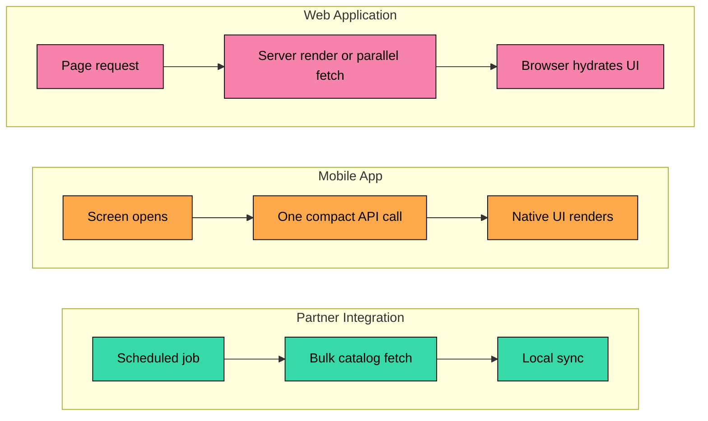
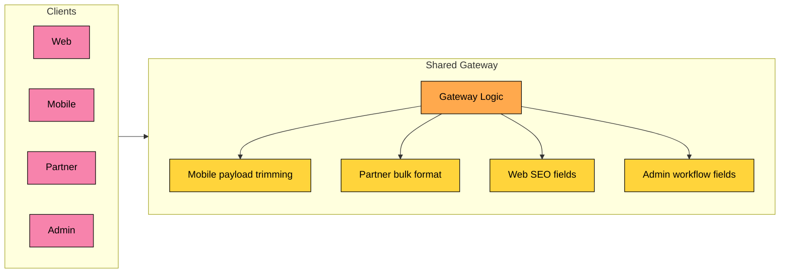
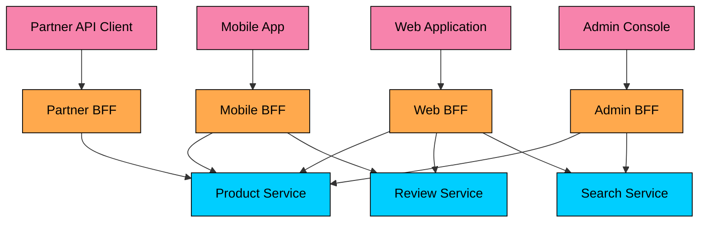
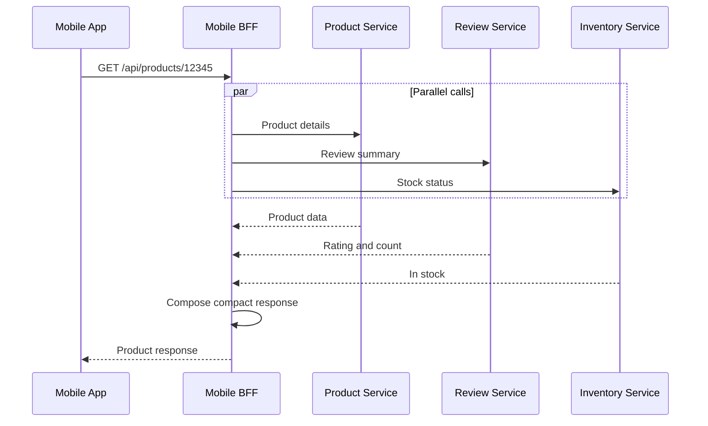
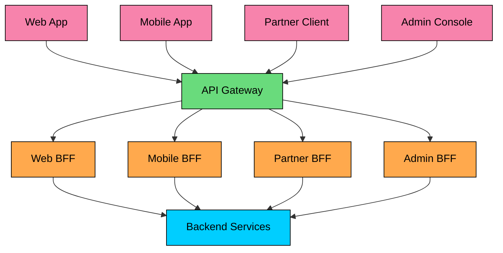
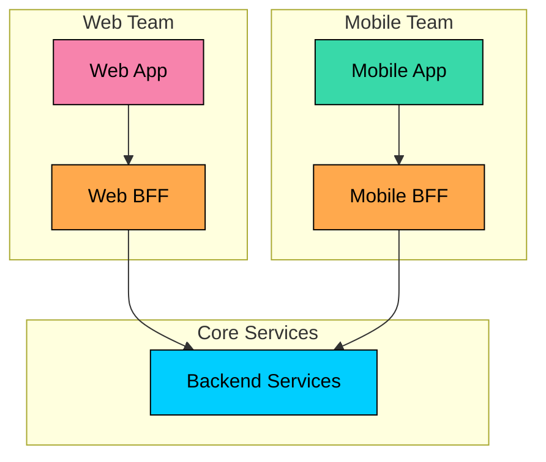
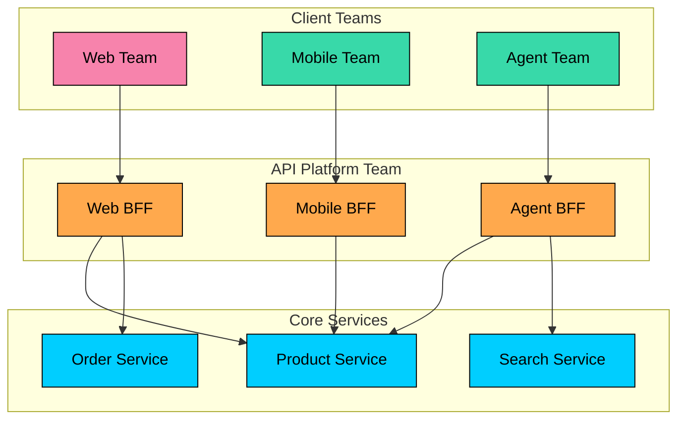
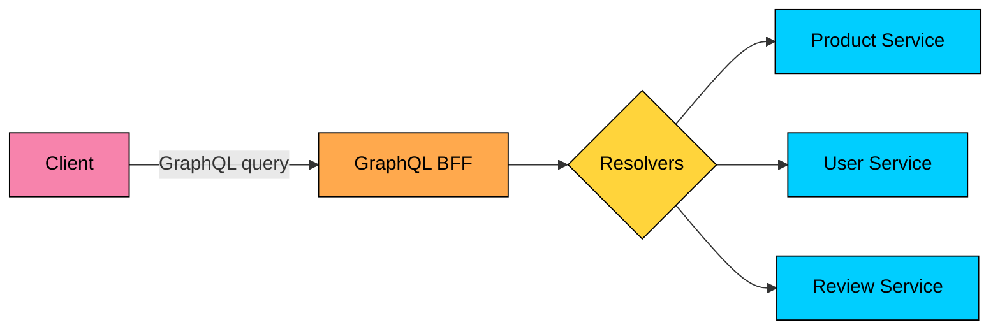
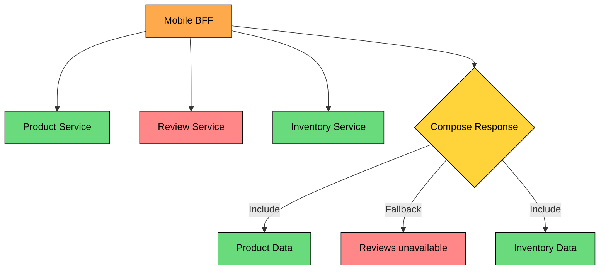
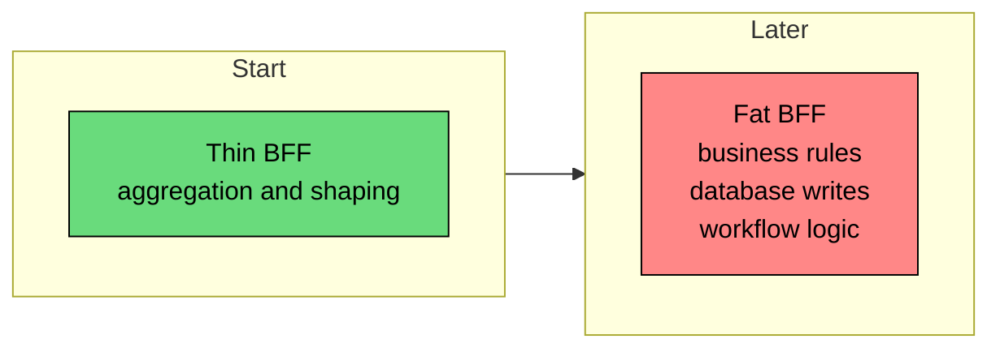

An API gateway gives clients a controlled entry point. A Backend for Frontend goes one step further: it gives each client experience an API shaped for that experience.

A web app, mobile app, partner integration, and admin console may use the same product domain but need different payloads, caching behavior, latency budgets, permissions, and release cycles.

The **Backend for Frontend (BFF)** pattern creates a small backend for one client family. It receives client requests, calls backend services, composes the result, and returns a response that fits that client.

The goal is to keep client-specific behavior close to the client without polluting core services or turning a shared gateway into a pile of client-specific branches.

---

# The Problem: One API Shape Does Not Fit Every Client

Consider a product detail page used by three clients.

| Client | Needs |
|--------|-------|
| Web app | Full description, large images, reviews, related products, SEO metadata |
| Mobile app | Compact description, small images, rating summary, stock status |
| Partner API | Product ID, SKU, price, availability, bulk sync metadata |

Those clients are asking about the same product, but they are not asking for the same representation.

### Different Interaction Patterns

The mobile app is sensitive to payload size and unreliable networks. The web app may care about server rendering, SEO metadata, and rich interaction. The partner API may prefer stable bulk-oriented contracts over UI-friendly responses.

### Different Release Cycles

| Client | Typical Release Constraint |
|--------|----------------------------|
| Web app | Can deploy many times per day |
| iOS app | App Store review and slow client upgrade curve |
| Android app | Faster than iOS in many teams, still client-version constrained |
| Partner API | Breaking changes may require months of notice |
| Admin console | Operational workflows may need fast iteration and richer permissions |

A shared API must protect the slowest-moving consumer. BFFs let each client contract evolve at the pace of that client.

### Shared Gateway Drift

When every client-specific concern goes into one gateway, the gateway stops being a clean edge layer.

Changes for one client start creating risk for every other client. Ownership also gets murky: the platform team owns the gateway, but product teams keep adding product-specific behavior to it.

---

# The Solution: Backend for Frontend

> [!PAYWALL] This content is for premium members only.

A BFF is a client-specific backend. It sits between one frontend experience and the core backend services.

Each BFF owns the client-facing contract for one client family:

- URL paths, GraphQL schema, or tool schema
- Payload shape and field naming
- Aggregation strategy
- Client-specific caching and fallback behavior
- API versioning for that client
- Translation between frontend needs and backend service APIs

Business invariants still belong in core services. A BFF can shape a checkout request for mobile. The order service still validates inventory, pricing, payment state, and order rules.

---

# Example: Product Detail Endpoint

A mobile BFF returns a compact representation.

A web BFF returns data needed by a richer page.

The backend product service may expose neither of these shapes. It can expose a domain-oriented product API. The BFF adapts that API for the client.

---

# How a BFF Handles Aggregation

The BFF turns one client request into several backend calls. This is useful, but it changes the failure model.

If the review service is slow, the product page should probably still load with `reviewsUnavailable: true`. If the inventory service is unavailable, the BFF may need to hide the buy button. These are product decisions, and the BFF is often the right place to encode the client-facing fallback.

Use:

- Short per-service timeouts
- Bounded parallelism
- Partial responses when the product can tolerate them
- Clear error fields for optional data
- Retries only for safe operations
- Request tracing across every downstream call

---

# BFF and API Gateway Together

BFFs and API gateways are commonly used together.

The API gateway handles shared edge concerns:

- TLS termination
- Authentication entry point
- WAF, bot protection, and abuse controls
- Global rate limits
- Request logging
- Routing to the correct BFF

The BFF handles client-specific concerns:

- Payload shape
- Client-specific aggregation
- Frontend version compatibility
- UI-oriented fallback behavior
- Client-specific caching
- Admin workflow contracts and permissions

This split keeps the gateway from becoming an application layer while still giving clients tailored APIs.

---

# Ownership Models

### Frontend Team Ownership

The team that owns the frontend also owns its BFF.

This model gives the client team control over release cadence and API shape. It works well when frontend engineers are comfortable owning server-side code, observability, security reviews, and incident response.

### Platform Ownership

A platform or API team owns the BFF layer for all clients.

This model improves consistency, but it can slow product teams down. It also risks recreating the same one-size-fits-all API problem inside a different team.

The best ownership model depends on team maturity. A common compromise is platform-owned infrastructure and templates, with product teams owning BFF behavior.

---

# BFF vs API Gateway

| Aspect | API Gateway | BFF |
|--------|-------------|-----|
| Primary job | Shared edge policy and routing | Client-specific API contract |
| Typical owner | Platform or infrastructure team | Client/product team, sometimes platform |
| Logic | Auth entry point, rate limits, routing, logging | Aggregation, shaping, fallbacks, client compatibility |
| Scope | Many clients | One client family |
| Coupling | Low coupling to client UI | Intentionally coupled to one client experience |
| Failure impact | Broad if shared gateway fails | Usually limited to one client family |

A BFF is not a replacement for an API gateway. It is a place for client-specific behavior that should not live in the gateway or core services.

---

# Implementation Options

### Dedicated Service

A BFF can be a normal service written in Node.js, Java, Go, Python, C#, or another backend stack. This is the clearest model when the BFF has nontrivial aggregation, background caching, strict SLOs, or complex dependencies.

### Framework-Integrated BFF

Modern frontend frameworks often include server-side capabilities. For example, Next.js supports BFF-style endpoints through Route Handlers and proxy behavior. This can be a good fit when the BFF is closely tied to a web app.

There are constraints. Route handlers are public HTTP endpoints and need proper authentication, validation, and error handling. For server-rendered components, calling your own route handler can add an unnecessary HTTP round trip; fetching directly from the data source or shared server module is usually better.

### Serverless BFF

Serverless functions are useful for small BFF endpoints, webhooks, and low-operations workloads. Watch cold starts, execution limits, connection management, and provider-specific behavior.

### GraphQL BFF

GraphQL can act as a BFF when clients need flexible field selection.

GraphQL helps with over-fetching and under-fetching, but it is not automatically simpler. It needs query complexity limits, authorization at field or resolver boundaries, caching strategy, schema governance, and good resolver performance. In larger organizations, GraphQL federation can combine multiple APIs into a single graph, which may reduce the need for many separate BFFs.

### Agent BFF

AI agents introduce a newer version of the BFF problem. An agent may need tool schemas, constrained actions, retrieval endpoints, model selection, and safety checks that are different from a human UI.

An Agent BFF can:

- Expose stable tool contracts
- Convert tool calls into backend service calls
- Apply tenant and permission checks
- Limit dangerous operations
- Add retrieval context
- Enforce model and token budgets
- Return machine-readable errors that the agent can recover from

Treat agent-facing APIs as client contracts. A small schema change can alter agent behavior even when the backend service still works.

---

# Design Rules

### Keep BFFs Thin

BFFs should aggregate, adapt, and protect client contracts. Core business logic belongs in domain services.

### Good BFF Responsibilities

- Combine product, review, and inventory data
- Return mobile-specific image sizes
- Translate backend errors into client-safe errors
- Add pagination metadata for one client

### Poor BFF Responsibilities

- Calculate shipping costs
- Apply discount eligibility rules
- Decide whether payment can be captured
- Update domain databases directly

### Define Explicit Contracts

Each BFF should have a documented contract. Use OpenAPI, GraphQL schema, protobuf, AsyncAPI, or tool schema definitions depending on the interface.

Contracts prevent accidental coupling. They are especially important for mobile apps, partners, and AI agents because client upgrades are not always immediate.

### Share Infrastructure, Not Client Behavior

Share:

- Deployment templates
- Observability libraries
- Authentication middleware
- Generated service clients
- Error handling conventions
- Security scanning and dependency management

Avoid sharing:

- Client response schemas
- Endpoint definitions
- UI-specific transformations
- Agent tool prompts or tool schemas

Shared libraries are useful until they become a hidden shared BFF. Keep shared code boring and infrastructural.

### Design for Partial Failure

BFFs often fan out to multiple services. A single slow dependency can dominate the user experience.

Define which dependencies are required and which are optional. Product details may be required. Reviews may be optional. Inventory may be required if the screen includes a buy button.

### Monitor Per Client

Track BFF metrics separately:

- Request rate
- p50, p95, and p99 latency
- Error rate by route
- Downstream call count per request
- Response size
- Cache hit rate
- Partial response rate
- Client version
- Tenant or partner where applicable

For Agent BFFs, also track tool-call success, recoverable errors, rejected actions, token usage, model fallback, and safety-policy outcomes.

---

# Common Pitfalls

### 1. BFF Becomes a Monolith

The BFF starts as a thin composition layer and gradually absorbs business rules, persistence, and workflow orchestration.

Review BFF code for business rules during design and code review. Move durable rules into the service that owns the data.

### 2. Too Many BFFs

Create BFFs for meaningful differences in client behavior, not every platform variant.

| Usually Too Many | Usually Reasonable |
|------------------|--------------------|
| iPhone BFF | Mobile BFF |
| iPad BFF | Web BFF |
| Android Phone BFF | Partner BFF |
| Android Tablet BFF | Agent BFF |
| Mobile Web BFF | Admin BFF |

iOS and Android can often share a Mobile BFF if their API needs are similar. Split them only when the contracts, release constraints, or behavior truly diverge.

### 3. Hidden Duplication

Some duplication is acceptable because clients differ. Dangerous duplication is business logic copied into multiple BFFs.

Use generated clients, shared middleware, contract tests, and platform templates to reduce accidental duplication. Keep client-specific response shaping local to each BFF.

### 4. Missing Version Strategy

Mobile and partner BFFs need explicit versioning and deprecation policies.

Use client version headers, URL versions, capability negotiation, or separate routes. Support old mobile versions long enough for realistic upgrade curves. For agent tools, version schemas because agents may depend on field names and error shapes.

### 5. Security Drift

Multiple BFFs can drift in authentication, authorization, logging, and header handling.

Centralize shared security middleware where possible. Strip untrusted headers at the edge. Pass trusted identity context downstream. Keep domain authorization in backend services.

---

# When to Use BFF

| Good Fit | Reason |
|----------|--------|
| Web and mobile clients need different payloads | Each client gets a contract shaped for its experience |
| Mobile apps have slow upgrade cycles | BFF can preserve compatibility per client version |
| Partner APIs need stable bulk contracts | Partner BFF isolates external contracts from internal services |
| Frontend teams need independent release cadence | Team-owned BFF reduces coordination delay |
| AI agents need stable tools and safety policy | Agent BFF isolates tool contracts and guardrails |

Avoid a BFF when there is only one client, client needs are nearly identical, the API gateway already provides enough routing and transformation, or the team cannot operate another production service responsibly.

GraphQL may reduce the need for many BFFs when one well-governed graph can serve multiple clients. It can also become its own BFF layer, depending on ownership and schema design.

---

# Summary

Backend for Frontend creates a client-specific backend that adapts core services to one frontend experience.

- A shared API shape creates friction when web, mobile, partner, admin, and agent clients need different contracts.
- A BFF owns client-specific aggregation, response shaping, fallback behavior, and compatibility.
- API gateways and BFFs work well together: the gateway handles shared edge policy, while BFFs handle client-specific API behavior.
- Frontend-team ownership gives speed, but requires backend operational maturity.
- Platform ownership improves consistency, but can become a bottleneck.
- GraphQL, serverless functions, and framework-integrated route handlers are implementation options, not automatic replacements for good ownership and boundaries.
- Keep BFFs thin. Durable business rules belong in the services that own the data.
- Monitor per client, design for partial failure, and version contracts explicitly.

Use BFF when client differences are real enough to justify another backend surface. The pattern is useful when it lets clients move independently without corrupting shared backend APIs.

---

# Quiz
