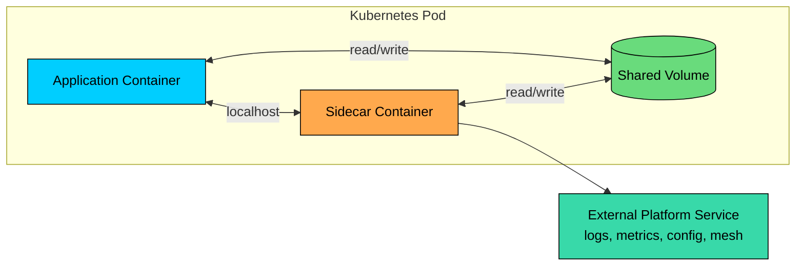
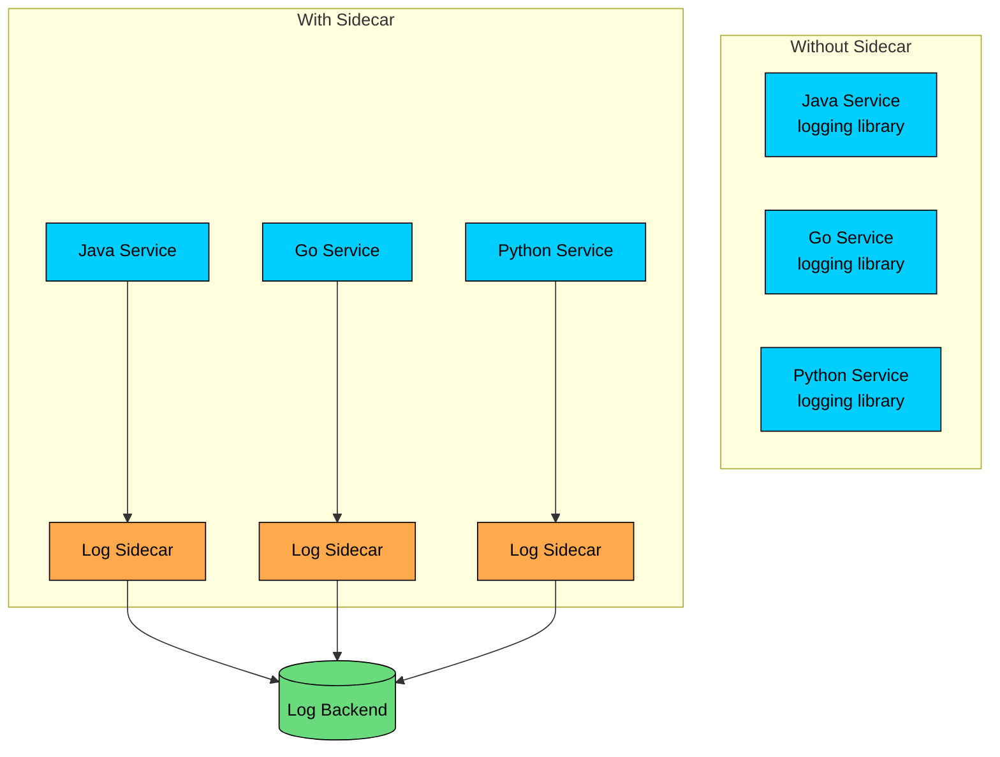
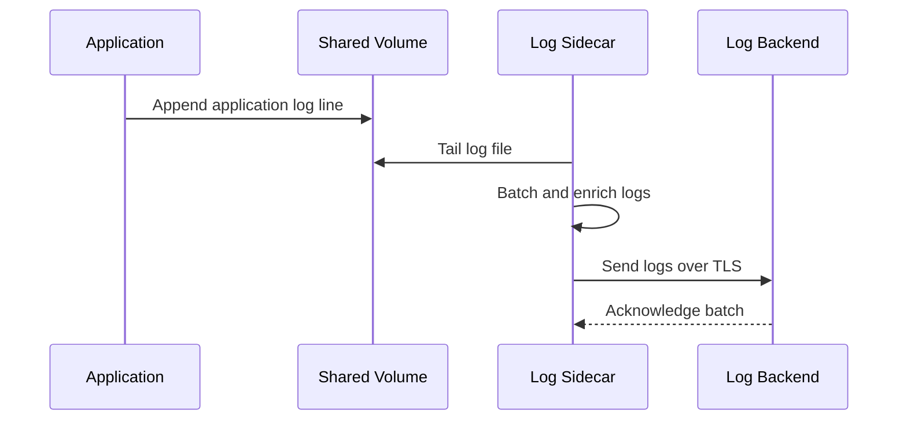
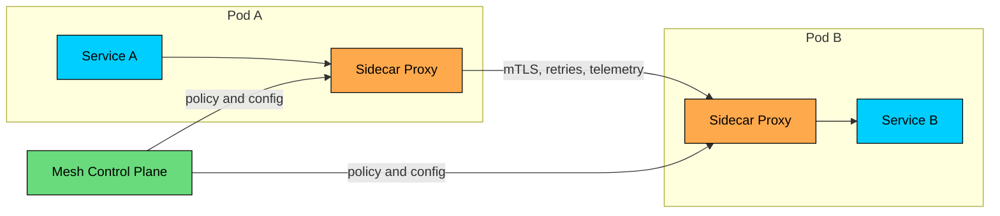

Distributed systems repeat the same operational work across many services: log shipping, metrics collection, TLS, tracing, configuration sync, and traffic policy.

Embedding that behavior into every application creates duplicated libraries, uneven upgrades, and drift across teams and languages.

The **Sidecar Pattern** runs a helper process next to the application. The application keeps doing its main job, while the sidecar handles supporting behavior that should be consistent across workloads.

The goal is to add infrastructure behavior through a colocated component that can communicate locally, but still be built, configured, and operated separately.

---

# What Is a Sidecar"

A sidecar is an auxiliary component deployed alongside a primary application to extend the application's behavior without putting that behavior directly into the application code.

The sidecar may run in the same Pod, on the same VM, or beside the application process in another supervisor. In container platforms, the Pod model is the clearest example because containers share a network namespace and can share volumes.

### Core Properties

| Property | Meaning |
|----------|---------|
| Co-location | The sidecar runs next to one application instance |
| Shared fate | If the Pod is removed, both application and sidecar go away |
| Local communication | The application and sidecar can use `localhost`, Unix sockets, or shared files |
| Separate implementation | The sidecar can use a different language, release cycle, and configuration model |
| Narrow responsibility | The sidecar handles one infrastructure concern or a small related set |

A sidecar is not a general-purpose plugin system. It should have a clear operational reason to be colocated with the application.

---

# Why Use a Sidecar"

Sidecars are useful when a capability must be consistent across many services, but embedding it into every service would create coupling or duplicated work.

Common examples:

- Log collection and forwarding
- Metrics export
- Distributed tracing agents
- Service mesh proxies
- Local TLS termination or mTLS identity
- Configuration or secret refresh
- File synchronization
- Local adapters for legacy services

The operational logic moves into one reusable component. Application teams keep emitting logs or making local network calls. The platform team owns the collection, forwarding, retry, buffering, and policy details.

---

> [!PAYWALL] This content is for premium members only.

# Kubernetes Sidecars

Kubernetes 1.29 and later enables native sidecar container semantics by default. A sidecar can be defined as an `initContainer` with `restartPolicy: Always`. It starts during Pod initialization and keeps running for the lifetime of the Pod.

This matters because older Kubernetes patterns treated sidecars as ordinary containers and required workarounds for startup order and Job completion. Native sidecars improve lifecycle behavior:

- Sidecars can start before the main container.
- A readiness probe on the sidecar can affect Pod readiness.
- On termination, Kubernetes stops sidecars after the main application container.
- For Jobs, a native sidecar does not keep the Job running after the main container completes.

You can still run multiple normal containers in one Pod when startup order does not matter. Native sidecar semantics are useful when the helper must be available before or during the application lifecycle.

---

# Example: Log Shipping Sidecar

The application writes logs to a local file. The sidecar reads that file and forwards logs to a central backend.

The application only needs to produce logs. The sidecar handles batching, retry, compression, authentication, and delivery.

This design works well when the log shipper needs local file access or when every application must use the same forwarding pipeline. It works poorly if the sidecar becomes a place for application-specific log parsing rules that should live in the application or platform pipeline.

---

# Example: Service Mesh Sidecar

The most common modern sidecar is a proxy injected beside the application. Envoy is the common proxy in many mesh systems.

The proxy can handle:

- mTLS between services
- Service identity
- Traffic routing and splitting
- Retries and timeouts
- Circuit breaking
- Request metrics and traces
- L7 policy enforcement

This keeps network behavior consistent across services written in different languages. It also means the sidecar is now on the hot path for every request. Configuration mistakes, proxy resource pressure, and mesh control-plane issues can affect the application even when application code is healthy.

---

# Sidecar vs Ambient Mesh

Sidecars are still widely used, but service mesh designs have changed. Istio, for example, now supports both sidecar mode and ambient mode.

In sidecar mode, each workload gets its own proxy. In ambient mode, Layer 4 traffic can be handled by a node-level proxy, with optional waypoint proxies for Layer 7 features.

| Model | How It Works | Tradeoff |
|-------|--------------|----------|
| Sidecar mesh | One proxy per workload instance | Full feature set close to the app, higher per-Pod cost |
| Ambient mesh | Node proxy for L4, waypoint proxy for L7 when needed | Lower sidecar overhead, different operational model |
| No mesh | App or platform handles networking directly | Simpler runtime, more responsibility in apps or gateways |

This does not make the sidecar pattern obsolete. It means "use a sidecar for every service" is no longer the automatic answer for service mesh adoption. Use sidecars when per-workload locality and full L7 behavior are worth the cost. Consider ambient, node-level agents, DaemonSets, or platform features when the same goal can be met with less per-Pod overhead.

---

# Sidecar, Ambassador, Adapter, and DaemonSet

These patterns are related but solve different problems.

| Pattern | Where It Runs | Main Purpose | Example |
|---------|---------------|--------------|---------|
| Sidecar | Next to one app instance | Extend that app instance | Envoy proxy, log shipper |
| Ambassador | Between app and outside dependency | Hide remote access details | Local proxy to external database |
| Adapter | Between incompatible interfaces | Convert protocol or shape | SOAP to REST adapter |
| DaemonSet agent | One per node | Serve many Pods on the node | Node log collector, node proxy |
| API gateway | At system edge | Manage client-facing APIs | Kong, Envoy Gateway, AWS API Gateway |

A sidecar is scoped to one workload instance. A DaemonSet agent is scoped to a node. An API gateway is scoped to traffic entering the system. Confusing these scopes leads to wasteful designs.

---

# Where Sidecars Fit in Specialized Workloads

Some workloads need local helper behavior around compute-heavy services, data-processing workers, and legacy runtimes.

Useful sidecar examples:

- A metrics sidecar exposing accelerator utilization and request latency.
- A log sidecar redacting sensitive fields before forwarding logs.
- A local proxy enforcing tenant budgets or outbound allowlists.
- A configuration sidecar refreshing routing rules.
- A file sync sidecar downloading indexes, rules, or local data files into a shared volume.

Be careful with large artifacts. A sidecar that downloads multi-gigabyte files on every Pod start can slow rollouts, overload object storage, and complicate autoscaling. For large assets, image preloading, node-local caches, init containers, persistent volumes, or workload-specific platform features may be better choices.

---

# Benefits

| Benefit | What It Gives You |
|---------|-------------------|
| Separation of concerns | Application code stays focused on domain behavior |
| Language independence | One sidecar can support services written in many languages |
| Consistency | Logging, telemetry, and security behavior can be standardized |
| Locality | Sidecar can use `localhost`, sockets, or shared volumes |
| Independent implementation | Platform teams can own the helper component |
| Legacy support | Capabilities can be added around apps that are hard to modify |

The value is strongest when many services need the same operational capability and the sidecar can stay generic.

---

# Costs and Failure Modes

### Resource Overhead

Each sidecar consumes CPU, memory, file descriptors, connections, and sometimes persistent buffers. A 50 MB sidecar sounds small until it is deployed beside 2,000 Pods.

Capacity planning must include sidecar requests and limits. Autoscaling signals should account for both the application and the sidecar.

### Startup and Readiness Coupling

Some applications cannot serve traffic until the sidecar is ready. For example, a mesh-injected application may need the proxy ready before inbound traffic is allowed.

Use startup probes, readiness probes, and explicit dependency checks. Avoid races where the application starts accepting traffic before its proxy, log shipper, or config sidecar is ready.

### Shared Fate

The sidecar and application share the same Pod lifecycle. A broken sidecar can make a healthy application unavailable. A sidecar that uses too much memory can contribute to Pod eviction or OOM failures.

### Debugging Complexity

Sidecars add another process, another set of logs, another health status, and sometimes another network hop. When a request fails, the failure may be in the app, sidecar, control plane, policy config, DNS, or upstream service.

Good operations require correlated logs, traces, metrics, and clear ownership.

### Upgrade Risk

Sidecar upgrades can change behavior across many services at once. A proxy upgrade can affect timeouts, retries, connection pooling, or TLS behavior. Treat sidecar upgrades like platform rollouts: canary them, monitor them, and keep rollback simple.

---

# Design Rules

### Keep the Sidecar Generic

A sidecar should handle infrastructure behavior, not domain rules.

### Good Sidecar Responsibilities

- Forward logs to a central pipeline
- Export metrics for scraping
- Enforce mTLS
- Sync configuration files
- Proxy outbound requests with consistent timeouts

### Poor Sidecar Responsibilities

- Decide whether an order is valid
- Rewrite business payloads based on product rules
- Own database writes for the application
- Implement workflow decisions

### Set Resource Requests and Limits

Sidecars are part of the workload. Give them explicit CPU and memory requests. Monitor their actual usage. Avoid placing a heavy sidecar beside every low-throughput service without measuring the cost.

### Define Health Semantics

Decide whether the Pod should be unready when the sidecar is unhealthy.

For a metrics sidecar, the application may still serve traffic if metrics are temporarily unavailable. For a mesh proxy enforcing inbound mTLS, the Pod may need to be unready until the proxy is ready.

### Secure the Sidecar

Sidecars often have sensitive access: service identity, certificates, tokens, logs, or traffic contents. Run them with the least privileges possible. Avoid mounting broad secrets into every sidecar. Validate sidecar images and keep them patched.

### Prefer Node-Level Agents When Locality Is Not Required

If one agent can safely serve many Pods on the node, a DaemonSet may be cheaper than one sidecar per Pod. Node-level log collectors are often more efficient than a log shipper sidecar for every service.

### Test Shutdown Behavior

Shutdown is where many sidecar designs fail. Test rolling updates, node drains, Jobs, and failed sidecars. Confirm that logs flush, connections drain, and Jobs complete as expected.

---

# When to Use the Sidecar Pattern

| Good Fit | Reason |
|----------|--------|
| Polyglot services need one operational capability | Avoids reimplementing libraries in every language |
| Legacy app needs added behavior | Adds capability without modifying app code |
| Helper needs local access | Uses `localhost`, Unix sockets, or shared volumes |
| Per-workload traffic policy is required | Mesh sidecar can enforce L7 behavior close to the app |
| Client workload needs a local adapter | Sidecar hides external dependency complexity |

Avoid sidecars when a shared node agent, gateway, library, platform feature, or ambient mesh can solve the problem with less per-Pod cost. Also avoid sidecars for simple applications where the operational overhead is larger than the benefit.

---

# Summary

The sidecar pattern runs a helper component next to an application instance to extend the application without embedding infrastructure logic into the app.

- Sidecars are useful for logging, metrics, tracing, mTLS, traffic policy, configuration sync, and local adapters.
- In modern Kubernetes, restartable sidecar containers use `initContainers` with `restartPolicy: Always`.
- Sidecars share network and storage namespaces with the application container, making local communication simple.
- Service mesh sidecars provide strong traffic and security features, but add resource cost and operational complexity.
- Ambient mesh, DaemonSets, gateways, and platform features can sometimes replace per-Pod sidecars.
- Sidecars should stay generic. Business logic belongs in the application or domain services.
- Production sidecars need resource limits, health checks, observability, secure configuration, and tested shutdown behavior.

Use a sidecar when locality and separation of concerns are both valuable. Measure the overhead before applying the pattern everywhere.

---

# Quiz
