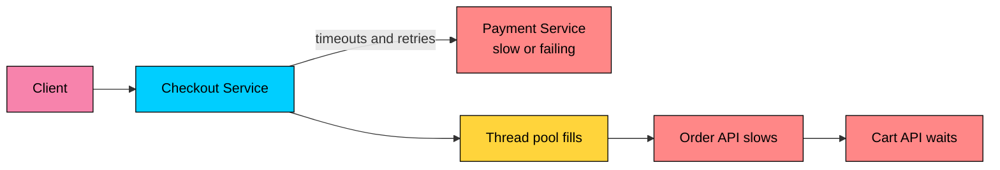
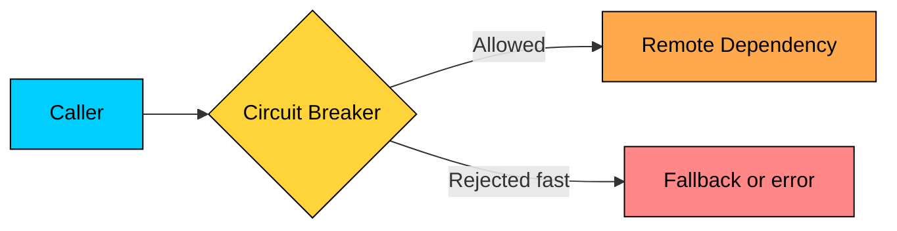
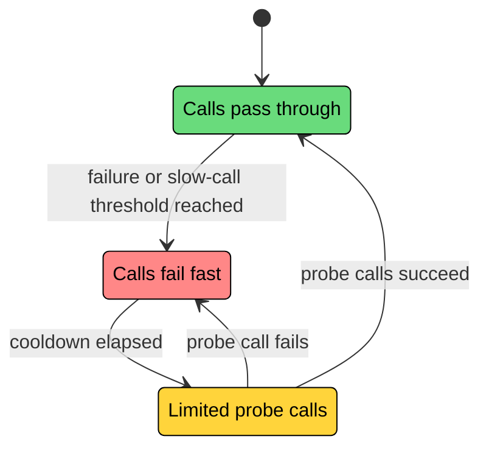
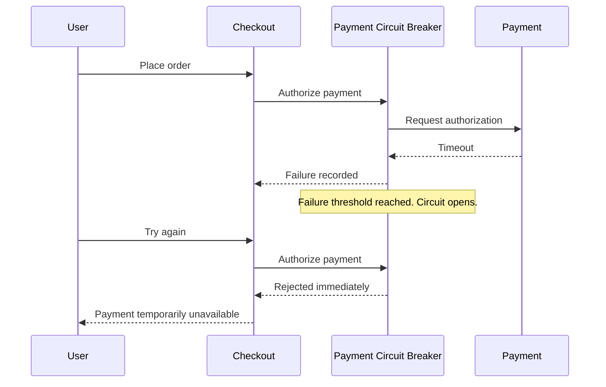
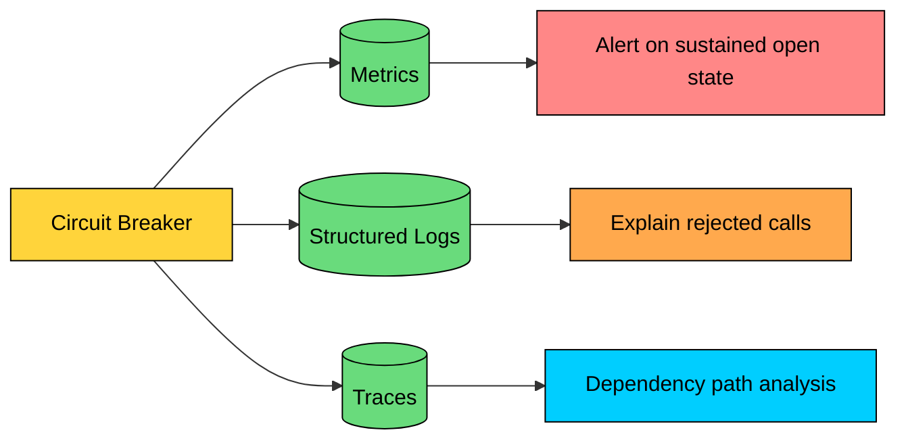

Remote calls fail in ways local function calls do not. A dependency can return errors, time out, throttle requests, or become so slow that callers run out of threads and connection pools while waiting.

The dangerous failure is amplification. Callers wait, resources fill, retries add more traffic, and the slowdown spreads into services that were otherwise healthy.

The **Circuit Breaker pattern** wraps a risky operation and decides whether calls should be attempted. When failure or latency crosses a threshold, the breaker opens and rejects new calls quickly before trying limited probe traffic later.

The pattern does not make a broken dependency healthy. It protects the caller, gives the dependency room to recover, and forces the system to degrade deliberately.

---

# What Is a Circuit Breaker"

> [!PAYWALL] This content is for premium members only.

A circuit breaker is a stateful guard around an operation that may fail, usually a network call or access to a shared remote resource.

The guarded operation can be:

- HTTP call to another service
- gRPC call
- Database query
- Cache call
- Message broker publish
- Third-party API request
- LLM or embedding provider call

The breaker decides whether a call is allowed before the caller spends resources on it.

The breaker usually tracks:

- Failure rate
- Slow-call rate
- Timeouts
- Specific exception or status-code classes
- Minimum sample size before opening
- Cooldown time in the open state
- Number of probe calls allowed in half-open state

A circuit breaker should be scoped to a specific dependency or operation. A single breaker for every outbound call from a service is too coarse.

---

# The Three States

A circuit breaker is a small state machine.

### Closed

The dependency is considered usable. Calls pass through. The breaker records outcomes in a sliding window.

If the failure rate or slow-call rate crosses the configured threshold after enough samples have been collected, the breaker moves to `OPEN`.

### Open

Calls are rejected immediately. The application may return a fallback response, a cached response, a 503, or a product-specific degraded result.

Open circuits are meant to be temporary. The breaker starts a cooldown timer before allowing any recovery traffic.

### Half-Open

The breaker allows a small number of probe calls. If the probes succeed, the breaker closes and normal traffic resumes. If probes fail or remain too slow, the breaker opens again.

Half-open prevents a recovering dependency from receiving the full request load immediately.

---

# Failure Rate and Slow-Call Rate

Older explanations often describe circuit breakers as "open after five failures." That can work for simple cases, but production systems usually need rate-based decisions.

| Signal | Meaning | Example |
|--------|---------|---------|
| Failure rate | Percentage of calls that failed in a window | 50% failed in last 100 calls |
| Slow-call rate | Percentage of calls slower than a threshold | 70% slower than 2 seconds |
| Minimum calls | Sample size required before calculating rate | At least 20 calls |
| Open wait duration | Cooldown before probing recovery | 30 seconds |
| Half-open probes | Calls allowed while testing recovery | 5 calls |

Slow-call detection matters. A dependency can be technically "up" but so slow that callers exhaust resources. Opening on slow-call rate protects callers before the dependency becomes fully unavailable.

---

# Circuit Breaker vs Timeout vs Retry vs Bulkhead

These patterns work together, but they solve different problems.

| Pattern | Question It Answers |
|---------|---------------------|
| Timeout | How long will the caller wait for one attempt" |
| Retry | Should the caller try again after a transient failure" |
| Circuit breaker | Should the caller attempt this dependency at all right now" |
| Bulkhead | How much caller capacity can this dependency consume" |
| Rate limiter | How much traffic is allowed into a system or dependency" |

Use timeouts on every remote call. A circuit breaker without timeouts can still leave threads blocked for too long.

Use retries sparingly. Retrying through a breaker is fine, but retries must stop when the breaker says the dependency is unavailable. Retry budgets are safer than unbounded or aggressive retries because they cap retry volume during partial failures.

Use bulkheads for concurrency isolation. A circuit breaker records failures and rejects calls when a dependency looks unhealthy. It does not necessarily limit how many concurrent calls can be in flight while the circuit is closed.

---

# Example: Checkout Calls Payment

Checkout depends on payment authorization. Payment is required for order placement, so there is no honest "success" fallback. The best fallback is a fast, explicit failure that preserves the user's cart and asks them to retry later.

The breaker improves the incident in three ways:

- Checkout stops tying up resources waiting for payment timeouts.
- Payment stops receiving repeated traffic while it is recovering.
- Users get a fast response instead of a long wait that fails anyway.

The breaker does not invent a successful payment. For write operations such as payment, order creation, or job submission, fallbacks must respect correctness.

---

# Fallback Design

A fallback is the behavior used when the circuit is open or the dependency call fails.

| Fallback | Good Fit | Risk |
|----------|----------|------|
| Cached data | Product catalog, feature flags, recommendations | Stale data |
| Empty response | Optional widgets, optional suggestions | Hiding a degraded feature |
| Partial response | Home page sections, dashboards | Client must handle missing fields |
| Queue for later | Non-urgent emails, analytics, background tasks | Duplicate work if idempotency is weak |
| Alternate provider | Search provider, LLM provider, payment route | Inconsistent behavior or cost |
| Fast error | Payments, auth, high-risk writes | User-facing degradation |

Fallbacks must be explicit. A fallback that returns fake success without signaling degradation can corrupt data or hide an outage.

For AI systems, fallback design is especially important:

- An LLM gateway may route to a cheaper or smaller model when the primary model provider is unavailable.
- A RAG service may return an answer without reranking if the reranker circuit is open.
- An embedding pipeline may queue documents for later if the embedding provider is throttling.
- A user-facing agent should receive machine-readable degraded errors instead of hallucinated tool results.

Do not return fabricated model outputs or pretend that a tool action succeeded.

---

# Where to Implement Circuit Breakers

### Application Layer

Application-layer breakers understand business context. They can choose the right fallback for a specific operation and classify failures with domain knowledge.

Examples:

- Checkout treats payment failures differently from recommendation failures.
- Search can degrade to keyword search when vector search is unavailable.
- A model gateway can fallback from one provider to another only for eligible tenants.

### Proxy or Service Mesh Layer

Proxies such as Envoy can enforce network-level circuit breaking without changing application code. This is useful for connection limits, pending request limits, active request limits, retry limits, and broad back-pressure.

Proxy-level breakers are language agnostic, but they usually know less about business correctness. They are good at protecting infrastructure capacity. They are weaker at deciding whether a payment can be queued, whether stale data is acceptable, or which tenants can use a fallback model.

### Gateway Layer

API gateways can protect expensive public endpoints, partner integrations, third-party APIs, and LLM providers. They can combine circuit breaking with rate limits, quotas, authentication, and cost controls.

Many mature systems use more than one layer: proxy-level limits for infrastructure protection, application-level breakers for operation-specific degradation.

---

# Implementation Example: Resilience4j

Resilience4j is a common Java library for circuit breakers, retries, rate limiters, bulkheads, and time limiters. Netflix Hystrix popularized circuit breakers in Java microservices, but it is historical at this point. For new Java systems, Resilience4j or framework-supported abstractions are the usual choices.

This configuration says:

- Record the last 100 calls.
- Do not calculate failure rate until at least 20 calls are recorded.
- Open the circuit if at least 50% of calls fail.
- Open the circuit if at least 50% of calls take longer than 2 seconds.
- Stay open for 30 seconds before trying half-open probes.
- Allow 5 probe calls in half-open state.

The exact values should come from latency budgets, traffic volume, and dependency recovery behavior. Copying thresholds between services usually produces bad results.

---

# Tuning the Breaker

### Choose the Right Scope

Create breakers per dependency and operation, not per service process.

Better:

- `payment-authorize`
- `payment-refund`
- `catalog-read`
- `embedding-provider-openai`
- `reranker-service`

Too coarse:

- `all-outbound-http`
- `payment-service-all`
- `database`

Independent operations fail differently. Reads may have cached fallbacks. Writes may need fast errors or durable queues.

### Classify Failures Carefully

Not every error should count the same way.

| Signal | Usually Count as Breaker Failure" |
|--------|-----------------------------------|
| Timeout | Yes |
| Connection refused | Yes |
| HTTP 500, 502, 503, 504 | Yes |
| HTTP 429 | Often yes, with special cooldown handling |
| HTTP 400 | Usually no, caller sent a bad request |
| HTTP 401, 403 | Usually no, auth or permission problem |
| Business validation error | Usually no |

For provider APIs, `429` may mean quota exhaustion. The breaker may need to open for that provider and tenant while allowing other tenants or providers to continue.

### Set Minimum Sample Size

Small samples create noisy breakers. If a low-traffic endpoint opens after two failures, it may stay degraded for no good reason.

Use a minimum number of calls before calculating failure rate. For low-volume operations, time-based windows or manual health checks may be more useful than aggressive automatic opening.

### Use Separate Timeouts

The timeout should be shorter than the caller's end-to-end latency budget. If the user-facing request budget is 1 second, a downstream timeout of 30 seconds is not a resilience strategy.

Set:

- Per-attempt timeout
- Total request deadline
- Retry budget
- Circuit breaker thresholds
- Bulkhead limit

Those settings need to agree. A long timeout with a short breaker cooldown can still exhaust caller resources.

---

# Observability

Circuit breakers must be visible. A breaker that opens without alerts or dashboards turns an outage into silent degradation.

Track:

- Current state: closed, open, half-open
- State transitions
- Failure rate
- Slow-call rate
- Rejected calls
- Fallback count
- Probe success and failure
- Open duration
- Dependency and operation name
- Tenant, region, or provider where relevant

Alerting should account for intent. A breaker opening for an optional recommendation service may be a warning. A payment breaker opening is usually a page.

---

# Common Mistakes

### Missing Timeouts

A breaker cannot protect the caller if each allowed call blocks for too long. Timeouts are required.

### Retrying After the Breaker Opens

Retry loops must stop when the breaker rejects a call. Retrying a rejected call creates waste and noisy logs.

### One Breaker for Too Much

A global outbound breaker can block healthy dependencies because one dependency is failing. Keep breaker scope narrow.

### Fake Success Fallbacks

Returning success when a write did not happen is data corruption. For high-risk writes, fast failure is often the correct fallback.

### No Half-Open Limit

If the breaker sends full traffic immediately after cooldown, the recovering dependency can fail again. Half-open traffic must be limited.

### No Manual Override

Some incidents need an operator to force a circuit open or closed. Manual override should be audited and visible.

---

# When to Use Circuit Breaker

| Good Fit | Reason |
|----------|--------|
| Remote dependency can be slow or unavailable | Prevents caller resource exhaustion |
| Dependency failure would trigger retries | Stops retry storms |
| Optional feature can degrade | Allows partial response or cached response |
| Third-party API has quotas or throttling | Prevents quota burn and cost spikes |
| AI provider or model endpoint is unstable | Enables fallback, queuing, or fast degraded response |
| Multi-region service needs controlled failover | Can route around unhealthy providers or regions |

Avoid the pattern for local in-memory operations, simple validation errors, or cases where normal retry and platform health checks already provide enough protection. Message-driven systems may rely more on backoff, dead-letter queues, and consumer pause controls than request-path circuit breakers.

---

# Best Practices

- Put a timeout on every remote call.
- Use retry budgets and jitter.
- Scope breakers per dependency and operation.
- Combine breakers with bulkheads for concurrency isolation.
- Count failures based on error type instead of treating every exception the same way.
- Track slow-call rate alongside hard failures.
- Design fallbacks explicitly.
- Never fake success for high-risk writes.
- Emit metrics and logs for every state transition.
- Test open and half-open behavior with fault injection.
- Canary threshold changes before rolling them out broadly.

---

# Summary

The circuit breaker pattern prevents repeated calls to a dependency that is likely to fail.

- `CLOSED` means calls pass through and outcomes are recorded.
- `OPEN` means calls fail fast without touching the dependency.
- `HALF_OPEN` means limited probe calls test recovery.
- Circuit breakers protect callers from resource exhaustion and protect dependencies from retry storms.
- Timeouts, retries, bulkheads, rate limits, and circuit breakers solve different parts of resilience.
- Slow-call rate is as important as failure rate because slow dependencies can exhaust callers.
- Application-layer breakers know business context. Proxy or mesh breakers enforce network-level limits.
- Fallbacks must preserve correctness, especially for payments, orders, job submission, and AI tool actions.

Use circuit breakers to contain failure, not to hide it. A good breaker makes degradation fast, visible, and reversible.

---

# Quiz
