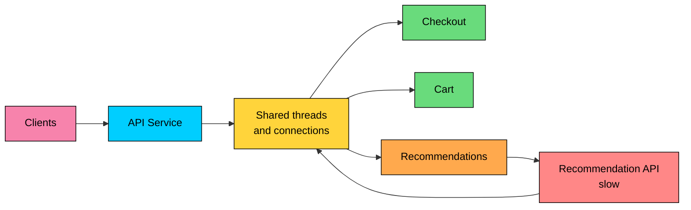
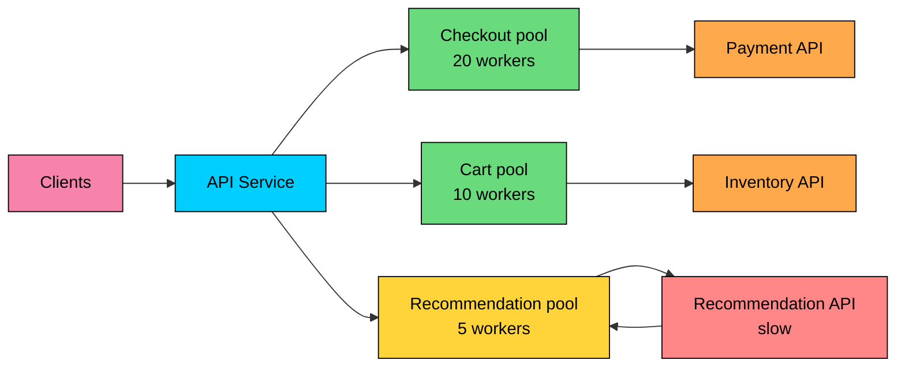
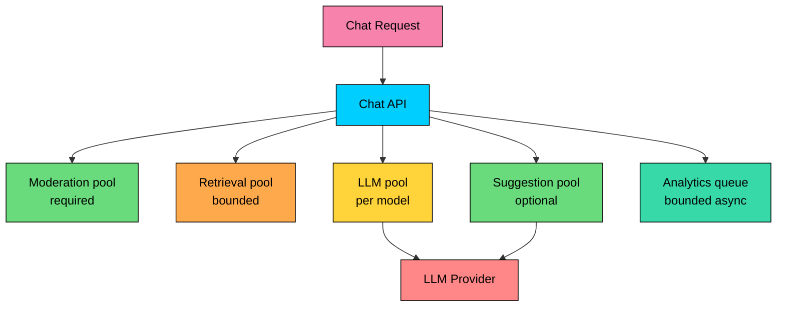

A distributed system often fails through shared resources before it fails through code.

One slow dependency can fill every request thread. One noisy tenant can consume the whole connection pool. One optional feature can build a queue so large that required work waits behind it.

The **Bulkhead Pattern** prevents one overloaded path from consuming all capacity. It partitions scarce resources into isolated pools so failure stays inside a defined boundary.

The goal is to decide how much capacity one dependency, feature, tenant, or workload can consume before it affects the rest of the system.

---

# The Problem Bulkheads Solve

Consider an e-commerce backend with checkout, cart, and recommendations handled by the same service. Recommendations call a third-party API. During an incident, that API becomes slow but does not fail immediately.

If all request handlers share one executor and one outbound connection pool, recommendation calls can occupy the same resources needed by checkout.

The failure path looks like this:

1. Recommendation requests wait on a slow dependency.
2. Threads remain occupied until timeout.
3. Connection pools and queues fill.
4. Checkout requests wait behind recommendation work.
5. The service appears down even though checkout itself is healthy.

The slow recommendation API is only part of the incident. The service allowed an optional path to spend resources required by a high-priority path.

---

> [!PAYWALL] This content is for premium members only.

# What a Bulkhead Does

A bulkhead creates a hard boundary around capacity.

Instead of one shared pool, the service uses separate pools for different flows:

- Checkout gets a protected pool.
- Cart gets its own capacity.
- Recommendations get a smaller pool.
- Background analytics uses a bounded queue.
- Each tenant or model can receive its own concurrency limit.

If the recommendation pool fills, new recommendation calls are rejected, skipped, or served from cache. Checkout still has capacity.

The system degrades by feature instead of failing as one large unit.

---

# Bulkhead vs Circuit Breaker

Bulkheads and circuit breakers are often used together, but they protect different failure modes.

| Pattern | Main Question | Example |
|---------|---------------|---------|
| Timeout | How long can one attempt wait" | Payment call times out after 2 seconds |
| Circuit breaker | Should this dependency be called right now" | Stop calling payment after repeated failures |
| Bulkhead | How much caller capacity can this path consume" | Payment can use at most 20 concurrent calls |
| Rate limiter | How much traffic can enter over time" | Tenant gets 100 requests per second |
| Queue limit | How much work can wait" | Embedding jobs queue holds 1,000 items |

A circuit breaker can be closed while a dependency is still slow enough to consume many threads. A bulkhead caps the number of concurrent calls before the caller is exhausted.

A bulkhead can reject calls even when the dependency is healthy, because the local capacity assigned to that path is full.

Use both when remote calls can be slow, expensive, or bursty.

---

# Where Bulkheads Apply

Bulkheads are not limited to thread pools. They apply anywhere a shared resource can be exhausted.

| Bulkhead Type | What It Isolates | Example |
|---------------|------------------|---------|
| Concurrency semaphore | In-flight operations | At most 30 concurrent calls to a model endpoint |
| Thread pool | Blocking work | Separate executor for PDF generation |
| Connection pool | Database or HTTP connections | Checkout and analytics use different DB pools |
| Queue | Waiting work | Payment events do not wait behind clickstream events |
| Consumer group | Message processing capacity | Order consumers separate from email consumers |
| Kubernetes resource limits | CPU and memory | Batch workers cannot starve API pods |
| Node pool or workload pool | Machine-level capacity | GPU inference separate from CPU API serving |
| Tenant partition | Customer capacity | One enterprise tenant cannot starve all others |
| Provider quota partition | External API usage | Summarization cannot consume quota needed for moderation |

The same service can use several bulkheads at once. A checkout API may have its own request workers, its own database connection pool, a payment circuit breaker, and a separate queue for asynchronous order emails.

---

# Semaphore Bulkhead vs Thread Pool Bulkhead

Resilience libraries commonly expose two forms of bulkheads.

### Semaphore Bulkhead

A semaphore bulkhead limits concurrent calls. The caller keeps running on its current thread or event loop. If all permits are used, the call is rejected or waits for a configured duration.

This works well for async HTTP calls, non-blocking clients, and operations where an extra thread pool would add overhead.

### Thread Pool Bulkhead

A thread pool bulkhead runs the protected operation on a dedicated executor with its own queue. If the pool and queue are full, the call is rejected.

This works well for blocking calls, legacy clients, CPU-heavy operations, and libraries that cannot be made non-blocking.

The queue must be bounded. An unbounded queue only moves the outage from threads to memory and latency.

| Choice | Use When | Watch For |
|--------|----------|-----------|
| Semaphore bulkhead | Calls are non-blocking or already run on managed worker threads | Permit waits can still add latency |
| Thread pool bulkhead | Calls block threads or run CPU-heavy work | Extra threads and queues cost memory and scheduling overhead |

---

# Example: AI Chat Service

Consider an AI chat application that performs several operations per user request:

- Load conversation state.
- Run moderation.
- Retrieve documents from a vector database.
- Call an LLM for the final answer.
- Generate optional suggestions.
- Write analytics events.

The LLM call is expensive and slow compared with local validation. The suggestion generator is optional. Analytics can run later. Moderation may be required before the model call.

Without isolation, an increase in suggestion traffic or a slow analytics sink can consume workers needed for moderation and chat responses.

A practical design might use:

- A small protected pool for moderation.
- A per-model concurrency limit for generation.
- A lower priority pool for suggestions.
- A bounded queue for analytics.
- Separate provider quotas for required and optional model calls.
- Tenant-level limits for large customers.

When the suggestion pool fills, the response can omit suggestions. When analytics fills, events can be sampled, batched, or dropped according to product requirements. When the required generation pool fills, the API should reject quickly or return a clear retryable error instead of waiting behind a long queue.

Bulkheads also control latency, cost, and external quota consumption.

---

# Implementation Example

The exact API depends on the language and runtime. In a Java service using Resilience4j, a semaphore bulkhead can cap concurrent calls, and a thread-pool bulkhead can isolate blocking work.

This configuration expresses two different decisions:

- Payment authorization can have at most 20 concurrent calls. Extra calls fail fast.
- Recommendation calls run on a separate executor. At most 20 recommendation requests can wait in its queue.

The numbers are examples. Production values should come from traffic, latency, dependency behavior, and the amount of degradation the product can tolerate.

---

# Sizing a Bulkhead

Bulkhead sizing is capacity planning at a smaller scope.

Start with four inputs:

- Expected arrival rate for that path.
- Normal and p95 or p99 latency of the protected operation.
- Maximum latency the caller can tolerate.
- Resource budget available to the service as a whole.

A useful starting estimate is:

If a dependency normally handles 50 requests per second and each call takes 200 ms, it needs about 10 concurrent slots on average. Add headroom for burst and tail latency, then cap the pool below the point where it can harm higher priority paths.

Sizing is a trade-off:

| Setting | Too Small | Too Large |
|---------|-----------|-----------|
| Concurrency limit | Rejects useful traffic during normal bursts | Weakens isolation |
| Thread pool | Underuses CPU and increases rejections | Adds memory and scheduling overhead |
| Connection pool | Creates artificial bottlenecks | Can overload the database |
| Queue capacity | Drops work too early | Hides overload and increases latency |
| Per-tenant limit | Hurts legitimate large tenants | Allows noisy tenants to affect others |

Do not tune bulkheads only for the happy path. Test slow dependencies, partial outages, retry storms, and tenant bursts.

---

# What Happens When a Bulkhead Is Full"

A full bulkhead is a normal operating condition during overload. The system should handle it deliberately.

Good options include:

- Reject fast with a retryable error.
- Return a partial response without optional data.
- Serve cached data.
- Enqueue work in a durable queue if delayed processing is acceptable.
- Drop low-value telemetry after recording the drop count.
- Route to a cheaper or lower quality model if the product allows it.

Bad options include:

- Waiting indefinitely.
- Creating an unbounded queue.
- Retrying immediately into the same full pool.
- Letting optional work borrow capacity from required work during an incident.

Failure behavior must match business semantics. A payment authorization should not return success if the call was never made. A recommendation widget can disappear. An analytics event can often be sampled or dropped.

---

# Platform-Level Bulkheads

Application code is only one layer. Modern systems also use platform controls.

### Kubernetes

Kubernetes pods do not automatically provide complete isolation. Pods share nodes, network bandwidth, storage, and often downstream services. Resource requests, resource limits, quotas, priority classes, separate node pools, and horizontal scaling policies define how much isolation the workload actually has.

For example:

- API pods can run in a separate node pool from batch jobs.
- GPU inference pods can be separated by model size or tenant tier.
- Namespace quotas can prevent one team or tenant from consuming all cluster resources.
- Pod disruption budgets can protect minimum availability during maintenance.

### Service Mesh and Proxies

Sidecars, gateways, and proxies can enforce connection limits, request limits, outlier detection, and retry budgets. These controls help when teams need consistent protection across many services.

Proxy-level isolation is useful, but it does not replace application-level bulkheads. The application still knows which work is required, which work is optional, and which fallback is correct.

### Message Brokers

Queues and streams need their own isolation. Separate topics, queues, partitions, and consumer groups prevent low-priority events from delaying high-priority work.

For example, order placement events should not wait behind product-view analytics events. Both may be important, but they do not deserve the same failure behavior.

---

# Observability

A bulkhead without metrics is a hidden traffic policy. Operators need to know which boundary is saturated and what work is being rejected.

Track these metrics per bulkhead:

- Active calls or permits in use.
- Available permits.
- Queue depth.
- Queue wait time.
- Rejected calls.
- Timeout count.
- Error count by cause.
- Thread pool utilization.
- Connection pool utilization.
- Work completed, dropped, or degraded.
- Saturation by tenant, dependency, model, or priority class.

Alerting should respect priority. A full recommendation pool may be a warning if checkout is healthy. A full payment pool during business hours usually needs immediate attention.

Dashboards should show both the protected path and the shared resource underneath it. If each service has its own thread pool but all of them share one database connection limit, the real bulkhead may be weaker than it looks.

---

# Common Mistakes

### One Shared Pool for Everything

A single executor or connection pool is simple, but it lets optional work affect required work. Separate high-priority paths first.

### Unbounded Queues

Unbounded queues hide overload until latency and memory become the outage. Queue capacity is part of the bulkhead.

### Bulkheads Only at Service Boundaries

Splitting services helps, but it does not isolate shared databases, caches, providers, or worker pools. Downstream resources need their own limits.

### Too Many Tiny Pools

Every pool has overhead. Too many small pools waste capacity and make operations harder. Partition by risk, priority, dependency, and tenant impact.

### No Tenant Isolation

Multi-tenant systems need per-tenant or per-tier boundaries. One customer's batch job should not consume capacity meant for everyone else.

### Missing Timeouts

A bulkhead limits the number of stuck calls, but stuck calls still occupy the isolated capacity. Timeouts release capacity and keep queues from growing.

### Optional Work Borrowing Critical Capacity

Borrowing sounds efficient during normal traffic and dangerous during incidents. Optional features should degrade before required flows lose capacity.

---

# When to Use Bulkheads

| Good Fit | Reason |
|----------|--------|
| A service calls slow or unreliable dependencies | Prevents caller resource exhaustion |
| Critical and optional features share a runtime | Keeps optional failures away from required flows |
| A database serves mixed workloads | Prevents analytics or batch queries from starving transactions |
| Message processing has different priorities | Keeps order or payment events ahead of low-priority events |
| Multi-tenant traffic has uneven demand | Limits noisy tenant impact |
| AI workloads share models, GPUs, or provider quotas | Protects required inference, moderation, and customer tiers |
| Batch jobs run near online services | Prevents background work from taking online capacity |

Avoid unnecessary bulkheads for small applications with one traffic path, low concurrency, and no expensive shared dependencies. Isolation adds configuration, metrics, testing, and operational work. Add it where failure impact justifies the cost.

---

# Best Practices

- Isolate required flows before optional flows.
- Bound every queue.
- Put timeouts on every remote call.
- Size limits from traffic and latency data.
- Separate blocking operations from non-blocking request paths.
- Keep database pools separate for workloads with different priorities.
- Add per-tenant limits for multi-tenant systems.
- Track rejections and queue wait time alongside error rate.
- Test slow dependencies and saturated queues.
- Combine bulkheads with circuit breakers, retries, timeouts, and rate limits.
- Document the degradation behavior for each full bulkhead.

---

# Summary

The Bulkhead Pattern partitions capacity so one failing or overloaded path cannot consume the whole system.

- Bulkheads isolate threads, connections, queues, CPU, memory, tenants, models, and external quotas.
- A semaphore bulkhead limits concurrency. A thread-pool bulkhead isolates execution.
- A circuit breaker decides whether to call a dependency. A bulkhead decides how much capacity that call path can consume.
- Full bulkheads should fail fast, degrade optional work, or queue durable work within a strict limit.
- Sizing requires traffic data, latency data, and clear priority decisions.
- Platform controls such as Kubernetes quotas and node pools help, but they do not replace application-level isolation.
- Observability must be per bulkhead, because global service health can hide saturation in one path.

Bulkheads make degradation explicit. The system keeps serving the work that matters instead of letting one slow path turn every shared resource into a single point of failure.

---

# Quiz
