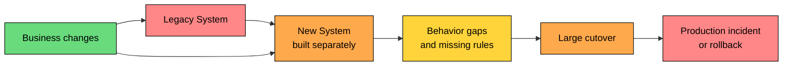
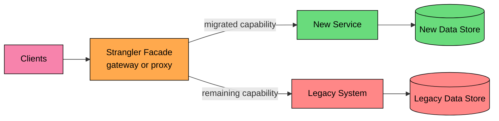
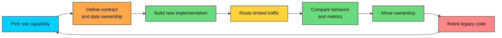
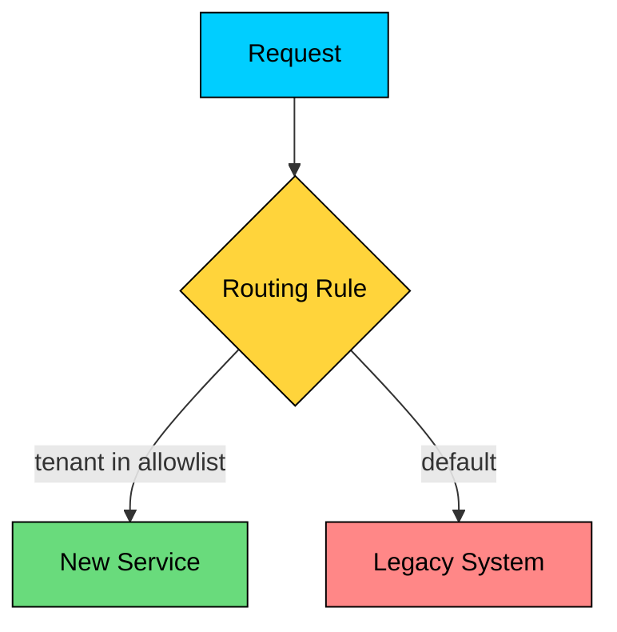
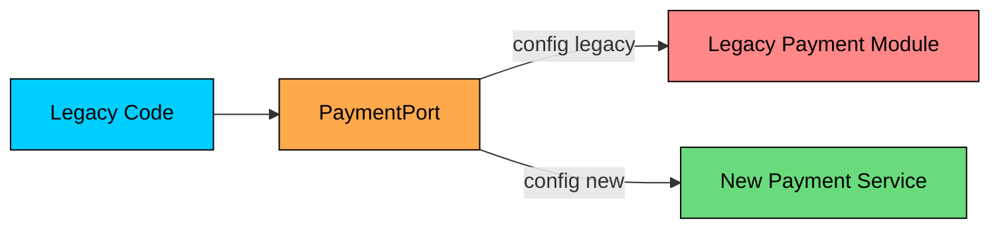
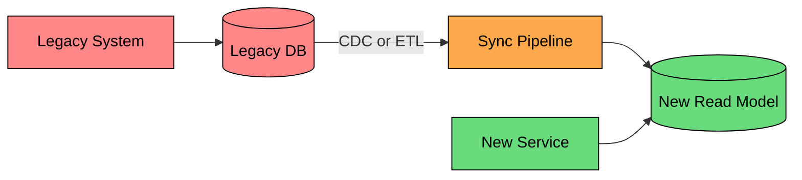
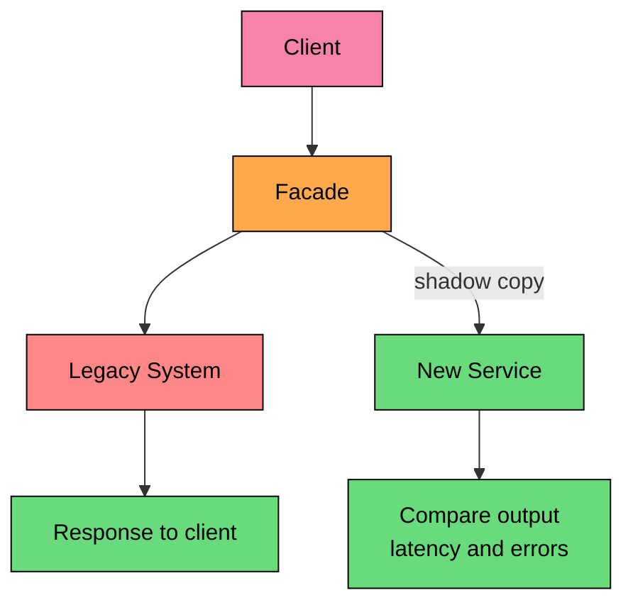
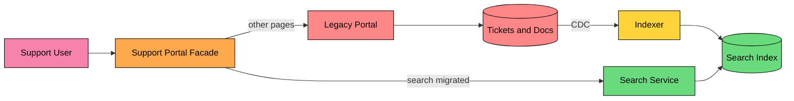

Modernization usually happens while the old system is still serving users.

A full rewrite asks the organization to reproduce years of behavior, data rules, permissions, edge cases, and integrations before production feedback arrives. That concentrates risk into one large cutover.

The **Strangler Fig Pattern** takes a different path. It migrates a system incrementally by placing a routing layer in front of the legacy application and moving one capability at a time to a new implementation.

The goal is to keep the client entry point stable while the legacy system shrinks until it has no remaining responsibility.

---

# The Problem With Full Rewrites

A full rewrite can work for a small system with clear behavior and few integrations. It becomes risky when the old system is large, business-critical, and poorly documented.

The usual failure mode is uncertainty: hidden rules, changing requirements, and late production feedback.

Large rewrites run into predictable problems:

| Problem | What Happens |
|---------|--------------|
| Hidden behavior | The legacy system contains business rules that exist only in code, data, or operator habits |
| Moving requirements | The old system keeps changing while the replacement is being built |
| Long feedback cycle | The new system learns from production late in the project |
| All-at-once cutover | Risk is concentrated into one release window |
| Data mismatch | The new system implements the wrong source of truth or misses historical edge cases |
| Organizational drift | Teams optimize for the rewrite instead of shipping value during the migration |

The Strangler Fig pattern reduces this risk by turning one large replacement into many smaller replacements.

---

> [!PAYWALL] This content is for premium members only.

# What the Pattern Does

The pattern introduces a facade, proxy, gateway, routing layer, or adapter in front of the legacy system.

At first, the facade routes all traffic to the legacy application. As new services take over specific capabilities, the facade routes those requests to the new implementation. The legacy system keeps handling everything else.

The old and new systems coexist for a while. That coexistence is the hard part. The routing layer, data synchronization, rollback plan, and observability are temporary architecture with production-grade requirements.

---

# The Migration Loop

The pattern works as a repeatable loop.

Each loop should produce a production change:

1. Select one capability with a clear boundary.
2. Define the external contract and source of truth.
3. Build the new implementation.
4. Route a controlled amount of traffic.
5. Compare results against the legacy behavior.
6. Move the capability fully to the new system.
7. Delete or disable the replaced legacy path.

The last step matters. A migration that never deletes old code becomes a second system to operate, secure, and explain.

---

# Choosing the First Slice

Start with a slice that teaches the team how to migrate without putting the highest-risk business flow first.

Good first candidates have clear inputs, clear outputs, observable behavior, and limited coupling to the legacy database.

| Better First Candidate | Why It Works |
|------------------------|--------------|
| Read-only profile endpoint | Lower write risk and easy response comparison |
| Search endpoint | Can run new search index beside the old query path |
| Notification delivery | Clear side effects and retry model |
| File upload or media service | Well-defined storage boundary |
| Report export | Often asynchronous and easier to validate |
| New read model or search view | Can be introduced beside the legacy write path |

Poor first candidates are usually tangled with many workflows:

| Risky First Candidate | Why It Is Hard |
|----------------------|----------------|
| Payment settlement | Correctness and audit risk are high |
| Order state machine | Many side effects and downstream dependencies |
| Shared database schema | Every module may depend on it |
| Authorization model | Small mistakes become security incidents |
| End-of-month billing | Historical rules and exceptions are common |

The first slice should be valuable enough to prove the approach and small enough to finish.

---

# Routing Strategies

The strangler facade needs a routing rule. The rule should be explicit, observable, and reversible.

### Path-Based Routing

Path-based routing works well when the legacy system has stable API paths or pages.

This approach is simple, but it can break down when one endpoint mixes several business capabilities.

### Header, Cookie, or Tenant Routing

Route selected users, tenants, regions, or internal employees to the new service.

This is useful for staged rollout, but the system must avoid splitting one user's state across old and new paths in unsafe ways.

### Percentage-Based Routing

Percentage routing canary-tests the new implementation under production load.

Use it after request compatibility is proven. Percentage routing is dangerous when requests have durable side effects, because the same user may bounce between two systems unless routing is sticky.

### Feature Flag Routing

Feature flags work well when rollout rules depend on product, tenant, user segment, or environment.

A good flag includes:

- Owner
- Expiration date
- Rollback behavior
- Metrics
- Change history

A flag without an owner becomes a permanent branch in production.

### Branch by Abstraction

When the legacy call cannot be intercepted at the network boundary, introduce an internal interface and move callers behind it.

This is common when the legacy system is a single process and the migration starts inside the codebase.

---

# Handling Data Migration

Data migration is usually harder than routing.

The key question is simple:

**Which system owns each piece of data at each stage of the migration"**

Avoid vague ownership such as "both systems write customer data." That creates conflict, reconciliation work, and hard-to-debug incidents.

### Shared Database

The new service reads or writes the legacy database directly.

| Benefit | Risk |
|---------|------|
| Fastest way to start | New service inherits legacy schema coupling |
| No data synchronization pipeline | Schema changes can break both systems |
| Easy response comparison | Hard to enforce service ownership |

Use this as a temporary bridge, not as the final architecture.

### Read Replica or Read Model

The legacy system remains the source of truth. The new service reads from a replicated store built through ETL, CDC, or event processing.

This works well for search, reporting, recommendations, and AI retrieval. It is less suitable for workflows that require immediate consistency across writes.

### Dual Write Bridge

The system writes to both old and new stores during migration.

Dual writes are risky because one write can succeed while the other fails. Use idempotency keys, retries, reconciliation jobs, and clear operational ownership. For high-value writes such as orders, payments, and identity changes, prefer a transactional outbox or event log over ad hoc dual writes.

### New System as Source of Truth

After validation, the new service becomes the owner for a capability. The facade routes writes to the new system. The legacy system either calls the new service, reads a replicated view, or stops handling that capability.

This is the real cutover. It should have a rollback plan, but rollback must account for data written after the cutover.

---

# Shadow Traffic and Comparison

Shadow traffic sends a copy of production requests to the new implementation while the legacy response still goes to the user.

Shadowing is safer for reads than writes. For write paths, the shadow request must not trigger emails, payments, inventory changes, model fine-tuning, or other side effects.

Comparison should be domain-aware:

- Exact response match for deterministic fields.
- Tolerance for timestamps, generated IDs, ordering, and rounding.
- Policy checks for authorization decisions.
- Statistical comparison for search, ranking, and recommendations.
- Manual review for high-risk differences before routing user traffic.

Nondeterministic features need extra care because exact string comparison may not be enough. Compare user-visible contracts, ranking quality, latency, data sources, and policy outcomes alongside simple equality checks.

---

# Example: Migrating Support Search

Consider a legacy support portal with keyword search built into a monolith. The team wants to move search into a dedicated service, but the portal still owns authentication, tickets, billing status, and case history.

A strangler approach might look like this:

1. Add a facade in front of `/support/search`.
2. Keep all traffic on legacy search while indexing documents into a new search store.
3. Send shadow search requests to the new search service.
4. Compare result quality, latency, authorization filtering, and missing documents.
5. Route internal employees to the new service.
6. Route 5% of customer tenants with sticky tenant routing.
7. Move all search traffic to the new service.
8. Remove the old search code and retire the legacy index.

The migration is not "monolith to microservices" in the abstract. It is one capability, one route, one data feed, one rollout plan, and one retirement plan.

---

# Observability and Control

Running old and new paths together requires more than basic service dashboards.

Track these signals per migrated capability:

- Request count by route target.
- Error rate by route target.
- Latency by route target.
- Response differences.
- Authorization decision differences.
- Data synchronization lag.
- Failed events, retries, and dead-letter counts.
- Rollback count and reason.
- Cost per request, especially for AI and third-party calls.
- Legacy traffic remaining after cutover.

Every routed request should carry a correlation ID across the facade, legacy system, new service, queues, and data pipelines. Without that, comparison and incident response become guesswork.

---

# Decommissioning

The pattern succeeds when legacy responsibility reaches zero.

Retirement should be part of the migration plan from the start:

1. Confirm no production traffic reaches the legacy path.
2. Disable scheduled jobs and message consumers tied to that path.
3. Remove feature flags and routing rules.
4. Remove code, configuration, credentials, dashboards, alerts, and runbook entries.
5. Archive data according to retention policy.
6. Delete infrastructure.

Do not rely only on code search to decide something is unused. Check access logs, batch schedules, message consumers, database queries, and support workflows. Legacy systems often have hidden callers outside the main application.

---

# Common Mistakes

### Migrating Around Unclear Ownership

If no team owns a capability, the strangler facade becomes a routing workaround instead of a modernization plan. Assign product, engineering, and operational ownership before moving traffic.

### Treating the Facade as Permanent Architecture

The facade can remain if it serves a product purpose, such as API management or client compatibility. If it only exists for migration, plan its removal. Otherwise it becomes another layer every request must pay for.

### Sharing the Database Forever

A shared database may start the migration, but it preserves the tight coupling that made the legacy system hard to change. Move data ownership deliberately.

### Skipping Reconciliation

Response comparison and data reconciliation catch behavior gaps before customers do. They should run before, during, and after cutover.

### Splitting One Workflow Across Two Systems

Routing reads to the new system and writes to the old system can be valid. Splitting one state transition across two systems without clear ownership creates race conditions and inconsistent behavior.

### Leaving Old Code Alive

Dead legacy paths still need security patches, monitoring, credentials, and tribal knowledge. Delete them after the rollback window closes.

---

# When to Use the Strangler Fig Pattern

| Good Fit | Reason |
|----------|--------|
| Large legacy system must stay online | Migration can happen while traffic continues |
| Business cannot pause feature delivery | New capabilities can ship during modernization |
| Behavior is partly undocumented | Production comparison reveals gaps earlier |
| Teams can intercept requests | A facade can route old and new paths |
| Data can be migrated in stages | Ownership can move capability by capability |
| New read paths wrap legacy data | Search, reporting, or recommendations can move beside existing workflows |

Avoid the pattern when the system is small enough to replace directly, when requests cannot be intercepted, when the old system must be shut down immediately, or when the organization cannot operate old and new systems at the same time.

---

# Best Practices

- Define the business outcome before choosing services to extract.
- Start with one bounded capability.
- Keep client contracts stable during migration.
- Make routing rules observable and reversible.
- Use sticky routing for stateful users, tenants, or workflows.
- Decide the source of truth for each data entity.
- Use shadow traffic for reads and side-effect-free paths.
- Add reconciliation before cutover.
- Track legacy traffic remaining by route.
- Remove migration flags, routes, and code after each slice.
- Treat temporary architecture as production architecture while it exists.

---

# Summary

The Strangler Fig Pattern modernizes a legacy system by replacing it one capability at a time.

- A facade routes requests to either the legacy system or the new implementation.
- The migration loop is select, build, route, compare, cut over, and retire.
- Routing can use paths, headers, tenants, percentages, feature flags, or internal abstractions.
- Data ownership is the hardest design decision. Shared databases and dual writes are temporary bridges with real risk.
- Shadow traffic and reconciliation reduce surprises before user traffic moves.
- Modernization fits the pattern when new search, reporting, or recommendation flows can wrap existing systems without forcing a full replacement.
- The work is complete only when old code, routes, jobs, data dependencies, and infrastructure are retired.

Use this pattern to reduce migration risk, keep production learning tight, and turn modernization into small, finished slices.

---

# Quiz
