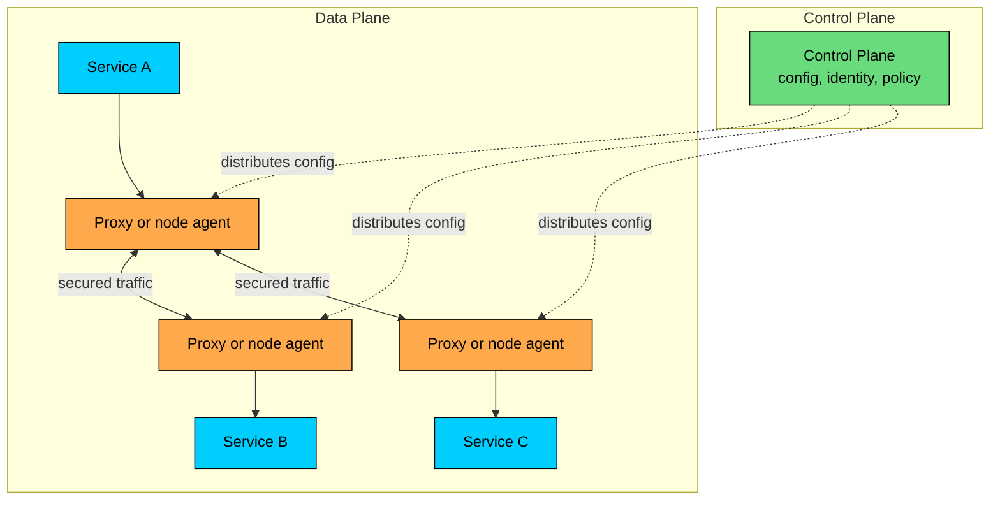
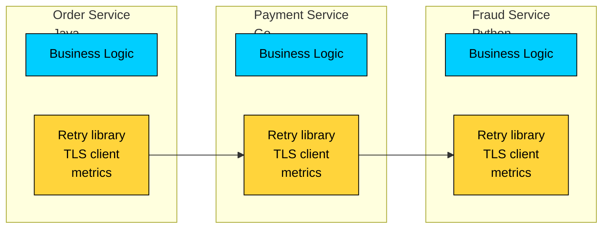
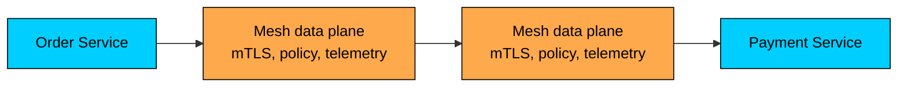
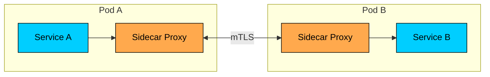
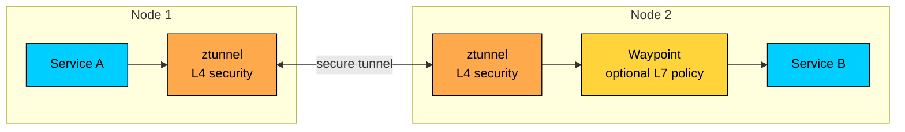
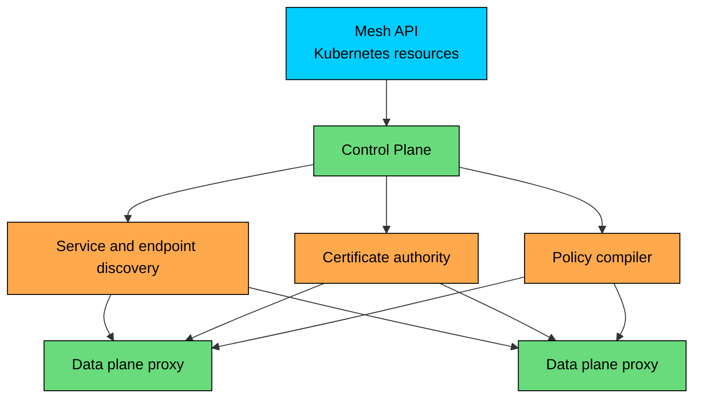
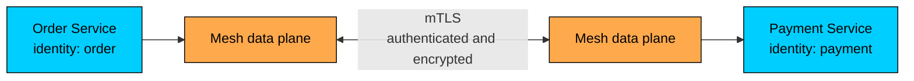
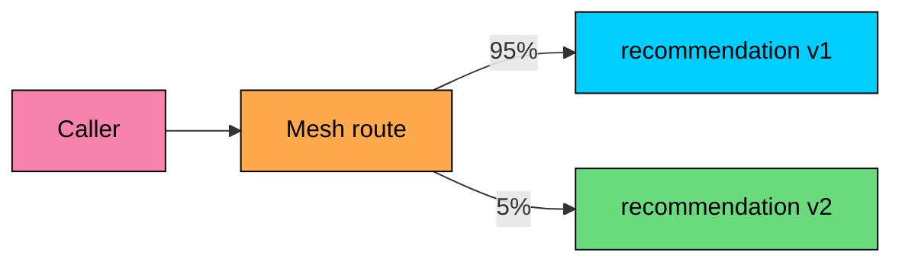
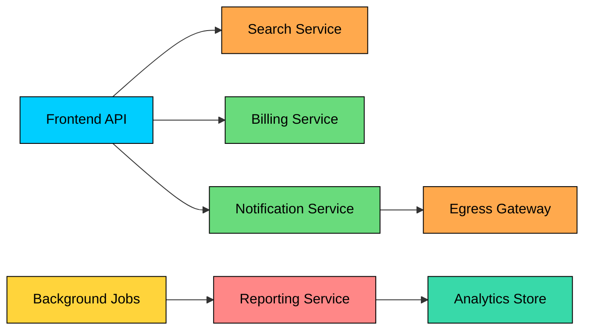
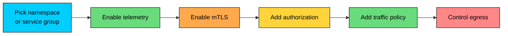

Service-to-service communication becomes hard to govern once a system has many independently deployed services.

Each service needs discovery, identity, encryption, authorization, timeouts, retries, metrics, and trace context. Implementing all of that inside every codebase creates duplicated logic and uneven behavior across languages and teams.

A **service mesh** moves a large part of that networking responsibility into the platform.

Applications still make normal HTTP, gRPC, or TCP calls. The mesh applies policy, records telemetry, and forwards traffic through a managed data path.

The goal is to govern east-west traffic consistently without reimplementing the same networking, security, and telemetry behavior in every service.

---

# What a Service Mesh Is

A service mesh is an infrastructure layer for managing communication between workloads.

It usually has two parts:

- **Data plane:** Proxies or network agents that sit on the request path.
- **Control plane:** Components that configure the data plane, issue identities, distribute policies, and integrate with service discovery.

The mesh can provide:

- Mutual TLS between services.
- Workload identity.
- Authorization policies.
- Routing and traffic splitting.
- Retries, timeouts, and outlier detection.
- Metrics, access logs, and trace integration.
- Egress control for calls leaving the mesh.

The mesh does not remove the need for good application behavior. Services still need correct timeouts, idempotency, fallback semantics, schema compatibility, and domain-level authorization.

---

# Why Teams Add a Mesh

Without a mesh, each application owns its own networking behavior.

That model works for small systems. It becomes expensive when every language needs the same security policy, telemetry format, retry behavior, certificate rotation, and traffic rollout mechanism.

With a mesh, platform policy moves closer to the network path.

The result is a consistent enforcement point for concerns that should not be reimplemented differently in every service.

---

> [!PAYWALL] This content is for premium members only.

# Data Plane Models

Older explanations often define a service mesh as "one sidecar proxy per pod." That is still common, but it is no longer the only model.

### Sidecar Data Plane

In the sidecar model, each workload gets a proxy inside the same pod or runtime unit. Traffic enters and leaves through the proxy.

Sidecars give each workload its own data-plane process. They support rich Layer 7 behavior close to the application, but every injected pod pays CPU, memory, startup, upgrade, and debugging overhead.

Istio sidecar mode commonly uses Envoy. Linkerd uses its own Rust proxy. Other meshes use different proxies or eBPF-assisted traffic capture.

### Ambient or Node-Level Data Plane

Some meshes reduce sidecar overhead by moving part of the data plane to the node.

Istio ambient mode uses a per-node Layer 4 proxy called `ztunnel`. Workloads can opt into optional waypoint proxies when they need Layer 7 behavior such as HTTP routing, header-based policy, or request-level telemetry.

This model separates baseline security from advanced request processing. It can reduce per-pod overhead, but it changes the operational model. Teams need to understand which policies run at Layer 4 and which require a waypoint.

### Proxyless and CNI-Integrated Approaches

Some platforms integrate mesh-like capabilities into clients, gateways, CNI layers, or eBPF-based networking. The design question stays the same:

**Where is policy enforced, and what traffic is actually on that path"**

Do not evaluate a mesh only by its API. Evaluate its data path.

---

# Control Plane Responsibilities

The control plane does not usually carry application traffic. It configures the components that do.

It typically handles:

- Workload discovery.
- Routing configuration.
- Certificate issuance and rotation.
- Trust domain and identity configuration.
- Authorization policy distribution.
- Telemetry configuration.
- Gateway and egress configuration.
- Validation and status for mesh resources.

In Istio, the current control plane is centered around `istiod`; older components such as Pilot, Citadel, and Galley were consolidated years ago. Documentation or diagrams that still show those as separate active components are outdated.

---

# Core Capabilities

### Security

The most common reason to adopt a mesh is service-to-service security.

#### Mutual TLS

mTLS gives each workload a cryptographic identity and encrypts traffic between mesh participants.

mTLS is useful, but it is not a complete security model. It proves workload identity and protects traffic in transit. It does not decide whether a specific user is allowed to refund an order or access a document. Application-level authorization still matters.

#### Authorization

Mesh authorization answers questions such as:

- Can `frontend` call `checkout`"
- Can `checkout` call `payment`"
- Can this namespace call services in another namespace"
- Can calls to an admin endpoint come from only a trusted workload"

Layer 7 authorization may depend on HTTP methods, paths, headers, or JWT claims. In sidecar mode that processing usually happens in the workload proxy. In ambient designs it may require a waypoint or another L7 enforcement point.

### Traffic Management

A mesh can route and shape service-to-service traffic:

- Split traffic between versions.
- Route by header, method, path, or tenant.
- Mirror traffic for testing.
- Apply timeouts.
- Configure retries.
- Eject unhealthy endpoints.
- Enforce connection limits.
- Route egress through controlled gateways.

Traffic management can create incidents when configured casually. Retries can multiply load during outages. Long timeouts can pin resources. Header routing can violate tenant isolation. Canary splits can break stateful workflows if routing is not sticky.

Treat mesh traffic policy like application code: review it, test it, and roll it out gradually.

### Observability

The mesh sees traffic between workloads, so it can emit useful telemetry without adding instrumentation to every service.

Common signals include:

- Request rate.
- Error rate.
- Latency distribution.
- Source and destination workload.
- Response codes.
- Connection opens and closes.
- mTLS status.
- Authorization denials.
- Retry and timeout counts.

Mesh telemetry is strongest at the network boundary. It cannot explain business intent by itself. A mesh can show that `checkout` received a `403` from `payment`; it cannot explain which fraud rule denied the payment unless the application emits that detail.

#### Distributed Tracing

Meshes can help create spans and report timing, but trace propagation still requires correct headers across services. If an application drops or rewrites trace context, the mesh cannot reconstruct the full causal chain.

OpenTelemetry is now the common direction for traces, metrics, and logs. Older examples that only mention Jaeger, Zipkin, or B3 headers are incomplete.

---

# Mesh, Gateway, Ingress, and CNI

These components overlap, but they are not the same thing.

| Component | Main Responsibility |
|-----------|---------------------|
| API gateway | Public API boundary, client auth, quotas, request shaping, product-level API policy |
| Ingress controller | North-south HTTP routing into a Kubernetes cluster |
| Kubernetes Gateway API | Standard Kubernetes APIs for L4/L7 routing across implementations |
| Service mesh | East-west service communication, identity, policy, telemetry, traffic management |
| CNI | Pod networking, IP allocation, network policy, packet routing |
| Load balancer | Distributes traffic across endpoints or nodes |

Gateway API deserves special attention. It is the Kubernetes project for L4 and L7 routing and is increasingly used for both ingress and mesh routing. The GAMMA initiative defines how Gateway API applies to service mesh use cases.

This does not make every Gateway API controller a full service mesh. Gateway API is an API surface. A mesh still needs an implementation that enforces the policy on the traffic path.

---

# Example: Multi-Tenant Application Platform

Consider a SaaS product with separate services for frontend APIs, search, billing, reporting, notifications, and background jobs.

Several calls have different risk profiles:

- The frontend API calls search, billing, and notification services.
- Reporting jobs can run expensive queries.
- Billing must record usage accurately.
- Background jobs should not affect production latency.
- Some services need controlled egress to third-party providers.

A mesh can help enforce:

- The frontend API can call search, billing, and notifications.
- Search cannot call billing.
- Notifications can egress only through an approved gateway.
- Background jobs use separate routing and do not share production canary policy.
- All internal calls use workload identity and mTLS.
- Latency and error metrics are tagged by source and destination workload.

The mesh should not decide refund eligibility, data retention, or billing correctness. Those rules belong in application and policy services. The mesh enforces network-level boundaries around them.

---

# Implementations and Current Landscape

### Istio

Istio is a feature-rich mesh with strong traffic management, security, observability, and gateway support. Its current control plane is `istiod`. Istio supports sidecar mode and ambient mode.

Use Istio when the platform needs rich policy, advanced routing, multi-cluster patterns, or deep Envoy integration. Budget time for configuration design, upgrades, and operational training.

### Linkerd

Linkerd focuses on operational simplicity and uses a Rust-based proxy designed for the service mesh use case. Its data plane is sidecar-based, with native sidecar support evolving alongside Kubernetes.

Use Linkerd when the main goals are mTLS, reliability, and observability with a smaller operational surface.

### Consul Service Mesh

Consul service mesh fits environments that already use Consul for service discovery or need a mesh spanning Kubernetes, VMs, and mixed runtimes.

It is often considered when the platform is not purely Kubernetes.

### Cilium Service Mesh

Cilium combines CNI, eBPF-based networking, Gateway API support, and service mesh capabilities. It is relevant when teams want networking, network policy, gateway, and selected mesh behavior in one platform.

Evaluate which features run through Envoy, which run through eBPF, and what observability and policy semantics the platform exposes.

### AWS App Mesh

As of 2026, AWS App Mesh should be treated as a legacy choice. AWS has announced that support ends on September 30, 2026. New designs on AWS should evaluate current AWS application networking options, Gateway API-compatible controllers, ECS Service Connect for ECS cases, or open-source meshes such as Istio and Linkerd depending on runtime and requirements.

### Service Mesh Interface

Service Mesh Interface, or SMI, was an attempt to standardize mesh APIs. CNCF archived the project in 2023. As of 2026, Gateway API and its mesh workstream are the active Kubernetes standardization direction for routing APIs.

---

# When a Mesh Helps

| Good Fit | Reason |
|----------|--------|
| Many services across several teams | Central policy and telemetry reduce inconsistent implementations |
| Polyglot services | Networking behavior does not depend on each language stack |
| Strict service-to-service security | Workload identity, mTLS, and authorization can be enforced consistently |
| Complex internal routing | Canary, mirroring, failover, and traffic splitting can be handled at the platform layer |
| Regulated internal traffic | Encryption, identity, and access logs are easier to standardize |
| Multi-tenant SaaS platform | Tenant and workload boundaries need consistent enforcement |
| Controlled egress is required | External calls can be routed through approved gateways |

A mesh is usually premature for a small system with a few services, one language, simple security requirements, and basic routing. A library, ingress controller, managed load balancer, or API gateway may be enough.

---

# Adoption Path

Adopt a mesh in stages. A full-platform rollout without clear goals creates more confusion than value.

A practical rollout order:

1. Choose a bounded namespace or service group.
2. Enable telemetry and verify the traffic map.
3. Enable permissive mTLS if the mesh supports a migration mode.
4. Move to strict mTLS after dependencies are known.
5. Add authorization policies in audit or dry-run mode when available.
6. Add timeouts and retries only after measuring baseline behavior.
7. Add traffic splitting and canaries for services that need them.
8. Control egress after teams understand external dependency flows.

Migration should include rollback procedures. Mesh misconfiguration can block production traffic as effectively as a bad deployment.

---

# Trade-Offs

| Trade-Off | Practical Impact |
|-----------|------------------|
| Operational complexity | Teams must operate another distributed control plane and data path |
| Resource overhead | Proxies or node agents consume CPU and memory |
| Latency overhead | Extra processing can affect low-latency paths |
| Debugging complexity | Incidents may involve application code, proxy config, DNS, certificates, and policy |
| Configuration risk | A small routing or authorization change can affect many services |
| Upgrade coordination | Control plane and data plane versions need planned rollout |
| Ownership ambiguity | Platform and service teams must agree who owns mesh policy |

Do not use fixed overhead numbers from a blog post as a design assumption. Measure in the target environment with representative traffic, mTLS settings, telemetry settings, and request sizes.

---

# Common Mistakes

### Using the Mesh as a Substitute for Application Design

A mesh can enforce network policy and retry rules. It cannot fix non-idempotent writes, missing timeouts in business workflows, unclear ownership, or poor API contracts.

### Turning on Retries Everywhere

Retries can create a load multiplier during partial outages. Use retry budgets, conservative retry counts, jitter, and idempotency checks.

### Treating mTLS as Complete Authorization

mTLS proves workload identity. It does not prove user intent. Combine mesh authorization with application authorization.

### Ignoring Egress

Internal service identity is incomplete if workloads can call any external endpoint directly. Systems that handle sensitive data need egress control for third-party APIs, data export paths, and provider integrations.

### Applying One Policy to Every Namespace

Platform defaults help, but each namespace may have different ownership, sensitivity, and rollout needs. Start with clear scopes.

### Skipping Data-Plane Debugging Skills

Teams need to know how to inspect proxy config, certificates, route decisions, policy decisions, and telemetry gaps. A mesh without debugging fluency becomes a black box.

### Choosing Based on Feature Lists Alone

The better mesh is the one the team can operate. Evaluate upgrade behavior, failure modes, control-plane dependency, policy clarity, resource cost, and how well it fits the existing platform.

---

# Best Practices

- Define the reason for adopting the mesh before installing it.
- Start with one namespace or service group.
- Measure overhead with real traffic.
- Keep retry policies conservative.
- Put explicit timeouts on important calls.
- Use mTLS for workload identity and transport security.
- Add authorization policies gradually.
- Prefer Gateway API where it fits the platform.
- Keep API gateway, ingress, mesh, and CNI responsibilities separate.
- Document ownership for mesh configuration.
- Test proxy and control-plane upgrades in staging.
- Make mesh telemetry part of incident response.

---

# Summary

A service mesh provides a platform layer for internal service communication.

- The data plane handles traffic. The control plane configures identity, routing, policy, and telemetry.
- Sidecar meshes remain common, but node-level and ambient data planes are now part of the landscape.
- mTLS, workload identity, authorization, traffic management, and observability are the core capabilities.
- Gateway API is becoming the common Kubernetes API surface for ingress and mesh routing, while SMI is archived.
- AWS App Mesh is no longer a recommended new choice because support ends on September 30, 2026.
- A mesh helps when many services need consistent networking, security, and telemetry.
- A mesh adds operational cost and can create outages through bad configuration.

Use a service mesh when the platform needs consistent service-to-service policy at scale. Keep business correctness in the application, and treat the mesh as production infrastructure with its own design, rollout, and debugging discipline.

---

# Quiz
