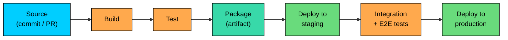
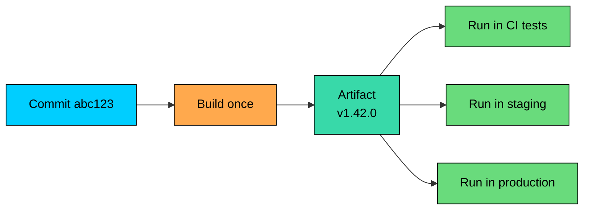
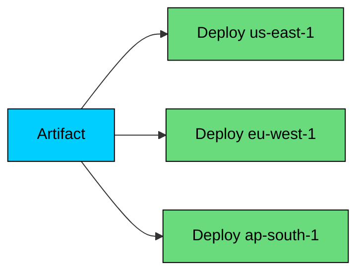

A **CI/CD pipeline** is the automated path that a code change travels from a developer's commit to a running version of the application in production.

<!-- Simulation: cicd -->

Humans are unreliable at repeating careful steps, so a pipeline turns the long checklist of "build the code, run the tests, package the artifact, push it somewhere, update the running version" into a repeatable, auditable process.

---

# 1. Three Letters, Two Different "CD"s

The terms get blurred constantly. Pinning them down once makes the rest of the chapter easier.

| Term | What It Means | What Triggers Production Deploys |
|------|---------------|----------------------------------|
| **CI (Continuous Integration)** | Every commit is automatically built and tested against the main branch. | Nothing. CI stops at "the artifact is good." |
| **CD (Continuous Delivery)** | Every successful CI build produces a release artifact ready to deploy. Deploying to production is a one-click human action. | Manual approval. |
| **CD (Continuous Deployment)** | Every successful CI build is automatically deployed to production, no human in the loop. | The pipeline itself. |

The gap between the two CDs is mostly cultural and operational. Internal services and dev tools often run continuous deployment; payment systems, regulated industries, and anything with manual compliance checks usually stop at continuous delivery with a human approval step.

---

# 2. Why Pipelines Exist

Before pipelines, deployments were a senior engineer running scripts from a laptop on a Friday. The problems were predictable: environment drift between machines, slow feedback on bugs, unauditable releases, bus factor of one, and inconsistent test coverage. A pipeline fixes these by making every step repeatable, visible, and version-controlled. The benefits compound at scale: five minutes saved per change is hours per day across a hundred engineers.

---

# 3. The Anatomy of a Pipeline

Most pipelines follow the same skeleton, regardless of the tool that runs them.

Each stage has a clear job and a clear pass/fail criterion. If any stage fails, the pipeline stops and the change does not move forward.

### 3.1 Source

The pipeline starts when something happens in the source repository: a pull request opens, a branch updates, a tag gets pushed. The pipeline grabs the exact commit and uses it as input for every subsequent stage. The pipeline definition, dependencies, and build configuration all live in version control so any production version can be recreated from the commit hash alone.

### 3.2 Build

The build stage turns source code into a runnable form: a Go binary, a Node bundle, a Java jar, or most commonly a container image. Three principles matter:

- **Reproducibility:** Building the same commit twice should produce the same artifact. Lockfiles and pinned dependencies make this easier.
- **Speed:** Build caches (Docker layer cache, Gradle daemon, npm cache, Bazel remote cache) cut build time from minutes to seconds.
- **Isolation:** Run in a clean container or VM, not on a shared machine with leftover state.

### 3.3 Test

Tests run on the built code. The pipeline usually layers tests in stages, from fast to slow.

| Test Type | What It Verifies | Typical Speed |
|-----------|------------------|---------------|
| **Static checks** | Linting, type checking, formatting, security scans | Seconds |
| **Unit tests** | Individual functions and classes | Seconds to a minute |
| **Integration tests** | Modules talking to real dependencies (DB, queue) | Minutes |
| **End-to-end (E2E) tests** | Whole system through public APIs or UI | Tens of minutes |
| **Performance tests** | Latency and throughput under load | Tens of minutes |
| **Smoke tests** | A handful of critical paths after deploy | Seconds |

Fast tests run first so a broken commit fails the pipeline in seconds, not in an hour. Expensive tests run later, often in parallel, so the pipeline does not block on them needlessly.

### 3.4 Package

The output of the test stage is a candidate. The package stage turns it into something that can be deployed. The artifact must be **immutable**: once published, it never changes. This is the foundation of safe deployment.

Common artifact types:

- **Container images** in a registry (Docker Hub, ECR, GCR, GHCR)
- **Binary packages** in an artifact store (Artifactory, Nexus, S3)
- **Language packages** (npm, PyPI, Maven Central)
- **Cloud-specific bundles** (AWS Lambda zip, GCP Cloud Function bundle)

Every artifact gets a unique, immutable identifier, usually the commit hash, a build number, or a semantic version. A production system should always be able to say "this version came from this artifact, which came from this commit." That chain is what makes rollbacks fast and audits possible.

### 3.5 Deploy to Staging

Staging is a production-like environment used for verification. The same artifact that will go to production gets deployed there first, catching configuration mistakes, missing environment variables, broken migrations, and dependency mismatches. A staging deploy that uses different artifacts than production defeats the purpose.

### 3.6 Integration and End-to-End Tests

Once deployed to staging, the pipeline runs tests that need a running system: full HTTP flows, browser-driven UI tests, contract tests with partner systems. Slow and flakier than unit tests, but they catch a different class of bugs.

### 3.7 Deploy to Production

The same artifact, verified in staging, gets pushed to production using one of the standard deployment strategies (rolling, blue-green, canary). In continuous delivery, this stage is gated by human approval. In continuous deployment, the green checkmark from the previous stage is the gate.

---

# 4. Artifacts and Immutability

The single most important concept in modern CI/CD is the **immutable artifact**.

The rule is: the bits that ran in CI tests are the bits that run in production. The artifact is built once, tested in successive environments, and promoted forward. It is never rebuilt for production.

The reason this matters: any difference between environments has to come from **configuration**, not from the binary. Environment-specific values (database hostnames, API keys, log levels, feature flag defaults) get injected at runtime, not baked into the artifact.

Building separate artifacts per environment is a common antipattern. It looks convenient but it means staging never tests what production runs. When a bug appears in production but not in staging, the team has no good way to know whether the bug is in the code or in the build process.

---

# 5. Configuration and Secrets

Configuration is everything the application needs that is not code: connection strings, API endpoints, feature flag values, log levels, rate limits. The 12-factor recommendation is to inject configuration through environment variables or a config service; the artifact stays the same and the environment changes.

Secrets (database passwords, API keys, signing certificates) need extra care. They should not be in version control, in plain environment variables in the pipeline config, or in the artifact. The standard pattern: secrets live in a dedicated secrets manager (AWS Secrets Manager, Vault, GCP Secret Manager), and the application reads them at startup with a short-lived identity. The pipeline never sees the actual values, only the references. This also makes credential rotation possible without a redeploy.

---

# 6. Quality Gates

A **quality gate** is a check that must pass for the pipeline to move forward. The pipeline becomes a series of gates, each one cheap enough to run but valuable enough to block bad changes.

Common gates:

| Gate | What It Checks | Where It Sits |
|------|----------------|---------------|
| **Lint and format** | Style rules, dead imports, formatting | Before build |
| **Type check** | Static type errors | Before build |
| **Unit tests** | Function-level correctness | After build |
| **Code coverage** | Tests exercise enough lines | After unit tests |
| **Security scan** | Known vulnerabilities in dependencies | Parallel to build |
| **Container scan** | Vulnerabilities in base image and layers | After package |
| **License check** | Allowed open-source licenses only | After build |
| **Integration tests** | Cross-component correctness | After deploy to staging |
| **Smoke tests** | Critical paths return 200 | After deploy to production |
| **Performance regression** | Latency or throughput within budget | After staging deploy |

The art is in choosing which gates to enforce strictly and which to surface as warnings. Strict gates on slow tests can grind the pipeline to a halt. No gates at all means broken changes ship freely. A mature pipeline tunes this balance over time.

---

# 7. Branching and Triggers

How the pipeline reacts to commits depends on the branching strategy.

- **Trunk-based development.** Engineers commit to a single main branch; short-lived feature branches merge back quickly. The pipeline runs on every commit to main, and risky features ship behind feature flags rather than long-lived branches.
- **GitFlow and variants.** Long-lived develop, release, and main branches each get different pipeline behavior. More common in regulated environments and long release cycles.
- **Pull request builds.** The pipeline runs on every PR, giving reviewers a green/red signal alongside human review. The most common form of CI in practice and the safest place to catch regressions.

---

# 8. Pipeline Topologies

In a small system, the pipeline is one repo, one pipeline, one application. In larger systems, things get more interesting.

### 8.1 Monorepo Pipelines

A single repository holds many services. The pipeline has to figure out which services changed and only build those.

Tools like Bazel, Buck, Nx, and Turborepo do this through dependency graphs. A change to a shared library triggers builds of every service that depends on it. A change to one service does not trigger the others.

### 8.2 Multi-Repo Pipelines

Each service has its own repository and its own pipeline. This is simpler per repo but harder to coordinate when several services need to change together. Contract testing and version compatibility become more important.

### 8.3 Pipeline Fan-Out

A single pipeline can deploy to multiple regions, multiple environments, or multiple cell-based shards in parallel. The deploy stage becomes a fan-out:

Each parallel deploy can have its own canary, its own health checks, and its own rollback. Pipeline orchestration tools like Spinnaker, Argo CD, and GitHub Actions handle this kind of fan-out.

---

# 9. Pipeline as Code

The pipeline definition itself should live in version control alongside the application code. The file format varies by tool (`.github/workflows/*.yml`, `Jenkinsfile`, `.gitlab-ci.yml`, `buildkite/pipeline.yml`, `argocd.yaml`), but the principle is the same: a change to the pipeline goes through the same review process as a change to the code.

A simple example, in GitHub Actions style:

The pipeline is now a reviewable, versioned artifact. Adding a new test step is a pull request, not a screenshot in a chat message.

---

# 10. GitOps

In **GitOps**, the state of production is described in a Git repository, and a controller in the cluster (Argo CD, Flux) reconciles live state with what is in Git. CI builds an artifact and updates a deployment manifest in the repo; the controller notices and applies it. Every deploy is a Git commit, every rollback is a `git revert`, and there is a single source of truth for what should be running. Common in Kubernetes; the pattern generalizes wherever infrastructure can be expressed declaratively.

---

# 11. Pipeline Performance and Observability

Slow pipelines stop being useful: engineers stop watching them, batches grow, and the feedback loop breaks. A useful target is under ten minutes from commit to "ready to merge."

Common levers for keeping pipelines fast:

- **Caching** of build outputs, dependencies, and container layers.
- **Parallelism** for independent test suites.
- **Selective execution** in a monorepo, only building what changed.
- **Failing fast:** cheapest checks first (linter in seconds, E2E in minutes).

The pipeline is also a production system and needs observability: build duration per stage, failure rate per job, flaky test rate, queue time, and the DORA metrics (deployment frequency, lead time, change failure rate, mean time to recover). Without these, a pipeline that drifted from 5 to 25 minutes will not get fixed until the team is already frustrated.

---

# 13. Common Pitfalls

A handful of patterns show up across teams adopting CI/CD seriously for the first time.

1. **One artifact per environment.** Breaks the immutability guarantee. Build once, promote forward.
2. **Secrets in plain environment variables in pipeline config.** Move them to a secrets manager.
3. **Flaky tests treated as background noise.** Trains engineers to retry until green. Fix or quarantine.
4. **No rollback path.** Every pipeline that pushes to production should also push the previous artifact back.
5. **Manual steps inside the pipeline.** Any "edit this YAML by hand before deploying" step is a future outage.
6. **Tests that hit the real internet.** Network flakiness becomes pipeline flakiness. Mock external services.

---

# Summary

A CI/CD pipeline is the path from source code to running production. It is the part of the system that makes safe deployment strategies possible.

#### **Key takeaways:**

1. **CI, continuous delivery, and continuous deployment are different.** CI ends at a verified artifact; delivery awaits approval; deployment ships automatically.
2. **Pipelines follow the same skeleton:** source, build, test, package, deploy to staging, integration test, deploy to production.
3. **The artifact is immutable.** The same bits that pass tests run in production. Environment differences come from configuration, not from rebuilds.
4. **Secrets and configuration are injected at runtime.** They live in a secrets manager or config service, outside the artifact.
5. **Quality gates control progression.** Lint, type checks, tests, security scans, smoke tests block bad changes at different stages.
6. **Pipeline-as-code makes the pipeline reviewable.** GitOps extends this to infrastructure state.
7. **Pipeline speed and observability matter.** Slow pipelines erode the feedback loop; DORA metrics make degradation visible.

The pipeline is the conveyor belt. The deployment strategy on top of it decides how the artifact at the end becomes the version users see.

---

# Quiz
