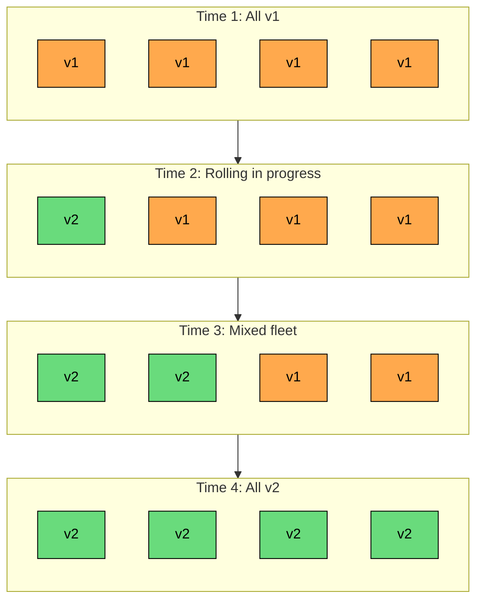
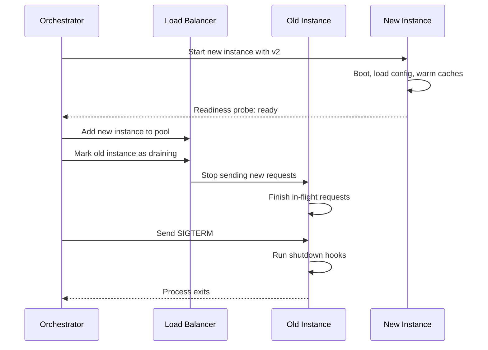

A **rolling deployment** replaces the running version of an application incrementally. The system swaps out instances a batch at a time: new instances come up on the new version, old instances drain and shut down, and some part of the fleet keeps serving traffic at every moment.

Rolling is the default in Kubernetes, AWS ECS, Nomad, and almost every modern orchestrator. The simplicity hides some real depth, though: the application runs in a mixed-version state against the same database and load balancer, and most rolling-deployment failures come from how the system passes through that state.

---

# 1. The Core Idea

The fleet starts with N instances of version v1. A rolling deployment moves the fleet to N instances of v2 by replacing instances in batches.

The fleet always has enough healthy capacity to serve traffic. The deployment finishes when every instance is on the new version. Everything else in the chapter is about the practical details of doing this safely.

---

# 2. Why Rolling Works

Rolling is popular because it avoids downtime without a second fleet, uses only a few extra instances during the rollout, ships natively in Kubernetes and ECS, composes with autoscaling, and is reversible mid-flight. The trade-off is that two versions run side by side. Anything the new version does that the old cannot tolerate, or vice versa, will show up during the rollout.

---

# 3. The Two Knobs That Control Everything

A rolling deployment is controlled by two main parameters. The names vary across systems but the concepts are the same.

### 3.1 maxUnavailable

How many instances can be down at once during the rollout. A `maxUnavailable` of 1 keeps at least N-1 healthy; 25% lets a quarter of the fleet be down. Lower values are safer (more capacity stays online) but slower.

### 3.2 maxSurge

How many extra instances are allowed during the rollout. A `maxSurge` of 25% allows 25% extra capacity temporarily. Higher values are faster (new instances come up before old ones come down) but use more capacity briefly.

### 3.3 Picking the Combination

| Configuration | Behavior | Trade-off |
|---------------|----------|-----------|
| `maxUnavailable=0`, `maxSurge=25%` | Always full capacity. New instances start before old ones stop. | Safest, but uses extra capacity. |
| `maxUnavailable=25%`, `maxSurge=0` | Stop instances first, then start new ones. | Cheapest, but reduces serving capacity during the rollout. |
| `maxUnavailable=25%`, `maxSurge=25%` | Balanced. Both happen in parallel. | Default in Kubernetes Deployments. |
| `maxUnavailable=1`, `maxSurge=1` | Strictly one-at-a-time. | Safest for fragile services or small fleets. |

A `kubectl` example of these settings:

The combination of `maxSurge` and `maxUnavailable` cannot leave the fleet with zero serving capacity. If both are zero, the orchestrator will refuse to start the rollout.

---

# 4. The Rolling Step, in Detail

A single step of a rolling deployment looks the same regardless of platform.

The critical points: the new instance becomes ready *before* the old one is removed, the readiness probe gates traffic to it, the old instance drains in-flight requests before shutdown, and the application catches SIGTERM for a clean exit. Skipping any step produces user-visible 5xx errors or cut connections.

---

# 5. Readiness vs Liveness Probes

The two kinds of health probes are not interchangeable.

| Probe | Question It Answers | What Happens If It Fails |
|-------|---------------------|--------------------------|
| **Readiness** | Should this instance receive traffic right now" | Load balancer removes the instance from the pool. |
| **Liveness** | Is this process alive at all" | Orchestrator restarts the container. |

For rolling deployments, readiness is the critical one. A new instance that starts in 3 seconds but takes 30 seconds to warm caches should not receive traffic until the readiness probe says it is ready. A useful pattern: the readiness probe checks the same dependencies the application needs to serve a real request (database, cache, downstream service); liveness only checks that the process is responding.

---

# 6. Draining and Graceful Shutdown

Removing an instance from the load balancer takes it out of rotation, but the instance still has open connections and in-flight requests.

The draining sequence:

1. **Mark the instance as draining.** The load balancer stops sending new requests.
2. **In-flight requests finish.** The application continues serving the requests it already accepted.
3. **Long-lived connections close.** WebSocket connections, gRPC streams, and Server-Sent Events connections need explicit handling. Either the application closes them and the client reconnects, or the connections survive a max-age.
4. **The orchestrator sends SIGTERM.** The application catches it.
5. **Shutdown hooks run.** Flush buffers, close database connections, deregister from service discovery, stop accepting new work.
6. **The process exits.** If it does not exit within a grace period, the orchestrator sends SIGKILL.

A Node.js example of a graceful shutdown:

The 5-second delay between marking the readiness probe as 503 and closing the server gives the load balancer time to notice and stop routing new requests. Without it, the server can close while the load balancer is still sending traffic.

A grace period that is too short cuts off in-flight requests. A grace period that is too long slows the rollout. Typical values land between 30 seconds and a few minutes.

---

# 7. The Mixed-Version Window

For the duration of the rollout, v1 and v2 instances both receive traffic. Any single user request might hit either version. This is the source of most rolling-deployment incidents and shapes how code, schemas, APIs, and messages have to evolve.

The rule: during the rollout, v2 must understand data written by v1, and v1 must understand data written by v2. This pulls everything toward additive changes only.

- **Database schemas** follow **expand-contract** (or **parallel change**): add the new column or table, deploy code that writes both old and new shapes, backfill, deploy code that reads from the new shape, then drop the old. Each step is independently rollback-safe.
- **APIs** evolve additively, or use versioning (`/v1/...` vs `/v2/...`) so consumers can opt in.
- **Asynchronous messages** require updating consumers first to handle both formats, then producers.

---

# 8. Failure Modes

- **Slow startup, aggressive rollout.** If the orchestrator continues before new instances are warm, the fleet ends up cold-but-new and latency spikes. Fix in the readiness probe.
- **Bad readiness probe.** A probe that returns 200 from a process that cannot serve real requests defeats the purpose. Exercise the real serving path.
- **Cascading failure on rollout.** If v2 uses more memory or DB connections than v1, the rollout saturates downstream as more v2 instances come up. Test capacity-affecting changes at full fleet scale.
- **Long-lived connections.** WebSockets, gRPC streams, SSE connections may not reconnect cleanly when the server drains. Needs explicit reconnect handling and a max-connection-age.
- **Schema-breaking change.** v2 needs a column v1 cannot handle, or vice versa. The rollout breaks both, and rollback does not help because the schema already changed. Expand-contract is the prevention.
- **Stalled rollout.** A few instances refuse to come up; the rollout stalls at 80%. Usually a transient infrastructure issue or per-node config mismatch. Alert on stalled rollouts.

---

# 9. Rolling Back

A rolling rollback is another rolling deployment, this time toward v1. The same mechanism that put v2 in place puts v1 back.

The good news: if expand-contract was followed, both code versions can coexist. Rolling back the code does not require rolling back the schema.

The bad news: the rollback is rolling, which means it is not instant. While v1 instances come up and v2 instances drain, the fleet is again mixed. If the bug in v2 is making the system unstable, the rollback may not happen fast enough.

When rollback speed matters more than infrastructure cost, blue-green is a better fit. Rolling is a good default; blue-green is a good escape hatch.

---

# 10. Rolling for Stateful Workloads

Stateless web services roll cleanly. Stateful workloads (databases, queues, caches, stream processors) are harder.

A stateful instance often has identity: it owns a shard, holds in-memory state, or coordinates with peers. Rolling a stateful workload usually means:

1. Replace one instance at a time, never more.
2. Wait for the replacement to rejoin the cluster and catch up.
3. Only proceed when the cluster reports healthy.

Kubernetes calls this a **StatefulSet rolling update**. Database operators (Patroni for Postgres, Vitess for MySQL, Strimzi for Kafka) build similar logic into their controllers.

Stateful rolling deployments are slower and require deeper application coordination than stateless ones. Other deployment strategies (blue-green, canary) often do not apply to stateful workloads at all.

---

# 11. When Rolling Fits

Rolling deployments are a good default for:

- Stateless web services and APIs.
- Background workers and queue consumers (with care for in-flight messages).
- Services where rollback time of a few minutes is acceptable.
- Steady-state traffic where mixed-version behavior can be reasoned about.
- Teams that want zero downtime without paying for a parallel environment.

Rolling is less useful for:

- Changes that cannot run in a mixed-version fleet (incompatible API contracts, schema-breaking migrations not done with expand-contract).
- Services that need second-level rollback (use blue-green).
- High-risk changes that need to be tested on a small slice of real traffic first (use canary).
- Long-lived connections with poor reconnect support.

---

# Summary

A rolling deployment is the simplest way to ship a new version without downtime. It replaces the fleet incrementally, keeping enough capacity online to serve traffic at every step.

#### **Key takeaways:**

1. **Rolling replaces instances in batches.** The fleet stays partly on v1 and partly on v2 during the rollout.
2. **maxUnavailable and maxSurge control speed vs safety.** Lower `maxUnavailable` keeps more capacity online; higher `maxSurge` makes the rollout faster at extra cost.
3. **Readiness probes gate the swap.** Traffic should only reach an instance once it can serve real requests.
4. **Draining is mandatory.** Stop new traffic, finish in-flight work, then shut down.
5. **The mixed-version window is the danger zone.** Both versions must tolerate each other's data, APIs, and messages; schema changes need expand-contract.
6. **Rollback is also a rolling deploy.** Acceptable when minutes of rollback are acceptable; pick blue-green when seconds matter.
7. **Stateful workloads need extra care.** Replace one at a time, wait for cluster health, use specialized operators.

A rolling deployment is the conveyor belt that moves the fleet from v1 to v2, one careful step at a time. Done well, users never notice. Done badly, the rollout is the incident.

---

# Quiz
