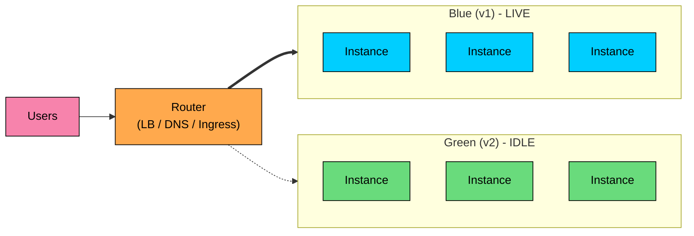
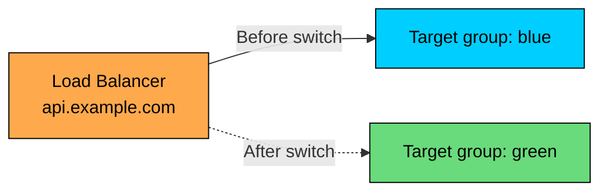
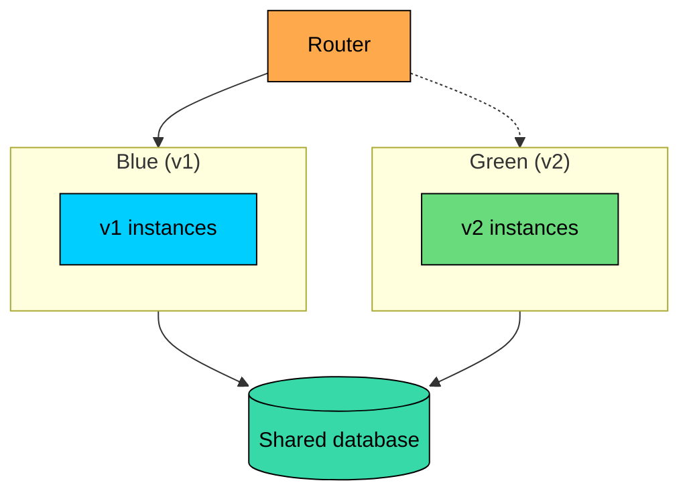

A **blue-green deployment** runs two complete copies of the production environment side by side. **Blue** serves live traffic. **Green** runs the new version. When green is ready, the system flips traffic from blue to green in one step, with blue staying online as a hot standby for fast rollback.

The strategy trades infrastructure cost for rollback speed: a blue-green rollback is a traffic decision that takes seconds, vs minutes for rolling. For services where short outages are expensive, that difference is the entire point of the strategy.

---

# 1. The Core Idea

The system runs two identical fleets. At any moment, one is **live** and the other is **idle** (or running the candidate version). A router, usually a load balancer or DNS layer, decides which fleet receives production traffic.

A deployment moves through these steps:

1. **Stand up green** with the new version. The green fleet boots, configures itself, and warms up.
2. **Smoke test green** while it is idle. Run a synthetic test suite against the green endpoints. No real users are involved.
3. **Switch traffic** from blue to green at the router.
4. **Watch green under real load** for a chosen observation window.
5. **Tear down or repurpose blue** once green is confirmed healthy.

The switch in step 3 is the moment that defines the strategy. Everything else is preparation or cleanup.

---

# 2. Why Blue-Green

**Strengths:** near-instant rollback (flip the router), risk-free pre-production validation against real config and the production network, atomic cutover (no mixed-version window), and clean before/after metrics.

**Weaknesses:** double infrastructure during the cutover, shared-database coupling (schema changes still need expand-contract), in-flight requests on blue that need to drain, stateful resources (caches, in-memory state) that do not move with the switch, and more operational machinery to maintain.

Blue-green is most valuable when the cost of a slow rollback exceeds the cost of running a second fleet for a short window.

---

# 3. The Switch: Mechanisms for Flipping Traffic

The switch is the part of blue-green that varies the most between platforms. Three mechanisms cover almost every real-world setup.

### 3.1 Load Balancer Target Switch

The load balancer points to a **target group** (in AWS terms) or **upstream pool** (in NGINX terms). Blue and green are two target groups. The switch updates the listener to point to the other group.

This is the most common pattern. AWS ALB, GCP Cloud Load Balancer, Azure Load Balancer, NGINX, HAProxy, and Envoy all support it. The switch is a single API call or configuration update. New connections immediately go to the new target group.

The only catch is **existing connections**. The load balancer keeps them open against the old target group, so the user still talks to blue until the connection closes. For short-lived HTTP requests this finishes in seconds. For long-lived connections (WebSockets, gRPC streams), it can drag on.

### 3.2 DNS Switch

The DNS record for the public hostname points at blue's IP address (or load balancer). The switch updates DNS to point at green.

DNS switches are simple but slow. Caching makes the change non-atomic: different clients see the change at different times, depending on their DNS resolvers and TTLs. Even with a short TTL of 60 seconds, the transition can take minutes.

DNS-based blue-green is acceptable when the strategy is being applied at a coarser level (entire regions, full sites) and when a slow cutover is acceptable.

### 3.3 Service Mesh / Ingress Routing

In Kubernetes, the switch is often a label or weight change on a `Service` or an Istio `VirtualService`. Both blue and green run as separate `Deployments` with different labels. The `Service` selector decides which pods receive traffic.

A one-line label change moves all traffic. Istio, Linkerd, and Gateway API resources let teams do this with finer-grained controls (weighted routing, header-based routing) while keeping the strategy fundamentally blue-green.

---

# 4. Smoke Testing Green Before the Switch

The whole point of blue-green is to gain confidence before exposing real users. Smoke tests run against the green environment while it is idle and exercise critical user paths, database connectivity, downstream integrations, config sanity, and a performance baseline against blue.

The green environment needs a way to receive test traffic without being on the public load balancer, usually through a separate hostname (`green.api.example.com`) or an internal load balancer. Smoke tests run as part of the deployment pipeline, and the switch only happens if every test passes.

---

# 5. The Database Problem

In most blue-green setups, both fleets share a single database. This is the strategy's most important constraint.

The implications: schema changes must be backward compatible because blue still serves traffic against the same database while green is being validated, and blue must keep working through the observation window in case rollback is needed. Data green writes after the switch is real and not easily undone if rollback happens later.

The **expand-contract pattern** is the standard discipline: every schema change is split into additive steps (add the new shape, dual-write, backfill, switch reads, drop the old shape) so both versions coexist with the same database.

Some teams give green its own database to eliminate the coupling, but this creates a new problem (how does data written during validation reach production") that is rarely worth the complexity for transactional systems.

---

# 6. In-Flight Requests and Long-Lived Connections

The switch happens at the router. Existing connections to blue do not move; they continue to be served by blue until they close.

For short HTTP requests, this is fine. The blue fleet drains naturally within a few seconds as in-flight requests complete.

For long-lived connections, the picture is different:

1. **WebSockets, gRPC streams, Server-Sent Events:** These connections can last minutes or hours. They sit on blue even after the switch.
2. **File uploads:** A large upload in progress on blue completes on blue.
3. **Long-running API calls:** A 30-second model inference call sticks with the version that started it.

A few strategies handle this:

- **Bleed the connections.** Let them close naturally over a drain window. Set a maximum connection age so they eventually move.
- **Force disconnect.** Close all connections on blue after the switch. Clients reconnect to green. This requires solid reconnect logic on the client.
- **Migrate via session continuation.** Some protocols allow session handoff between servers. This is complex and rarely worth it for most applications.

The simpler the protocol, the smoother the switch. Long-lived stateful protocols make blue-green harder than the diagrams suggest.

---

# 7. Stateful Resources Do Not Flip

The router moves traffic; it does not move state. In-memory caches, WebSocket sessions, in-progress workflows, and local queues all stay on blue, and green starts cold.

The practical implications: green sees a latency spike after the switch as caches refill (pre-warming reduces but does not eliminate this), in-flight workflows on blue continue on blue, and background workers consuming queues need their own deployment strategy (typically rolling). Blue-green is most natural for stateless request-response services; stateful services usually need a different pattern.

---

# 8. The Cost Model

The cost of blue-green is usually described as "double infrastructure," but it is only doubled during the cutover window.

| Phase | Cost Profile |
|-------|--------------|
| **Steady state** | Single fleet, normal cost. |
| **Green warming + switch + observation** | ~2x compute until blue is torn down (minutes to hours). |
| **Post-cleanup or rollback** | Back to single fleet, normal cost. |

With on-demand cloud pricing, the dollar cost for teams that deploy a few times per day is a small fraction of total compute. The bigger cost is operational: standing up a second environment reliably, keeping configuration in sync, managing the router, building smoke tests. The strategy is more expensive in engineering complexity than in infrastructure.

For very large systems, a true blue-green is sometimes financially impractical. A 50,000-instance fleet does not get spun up twice for every deploy; those systems usually combine canary and rolling, sometimes with cell-based blue-green at a smaller granularity.

---

# 9. Rollback in Blue-Green

Rollback is the strategy's biggest selling point. After the switch, blue is still warm, its caches are full, and its data integrity is intact. The router updates, traffic flips back to blue, green drains and gets investigated. Total time: seconds.

Caveats: data green wrote stays in the database (rollback does not undo bad writes), blue must still be around (the observation window before tearing down blue is what makes rollback possible), and some schema changes (column drops) are not reversible without a backup restore. The observation window is the key parameter: too short and slow-emerging problems are missed; too long and the team pays for double infrastructure. Common ranges are 15 minutes to a few hours.

---

# 10. Variations and Combinations

- **Blue-green + canary.** Instead of an instant switch, shift 1%, 5%, 25% of traffic to green before the full cutover. Supported natively by AWS CodeDeploy, Argo Rollouts, and Spinnaker.
- **Cell-based blue-green.** Each cell (per-region or per-tenant) has its own blue and green. Contains blast radius and reduces cost since only one cell is doubled at a time.
- **Rainbow deployments.** Several versions coexist while traffic shifts gradually. Useful for fast-versioned systems (model services) where rollback paths to several previous versions are valuable.
- **Read-only blue-green.** Writes go to blue; reads can be tested on green. Sidesteps some database coupling at the cost of more routing complexity.

---

# 11. Failure Modes

- **Configuration drift.** Green should be identical to blue except for the code version. Drift through manual production changes is the most common cause of "green misbehaves." Pipeline-as-code and infrastructure-as-code reduce but do not eliminate the risk.
- **Cold caches cause latency spikes.** Right after the switch, green serves the first wave of requests against empty caches. Pre-warming reduces this; some teams misread the spike as "green is broken."
- **Routing misconfiguration.** The router is a single point of failure during the switch. A misconfigured target group or DNS record can take down both colors. Test switches in pre-production; exercise the rollback path, do not just document it.
- **Database migration coupling.** A schema migration that is not backward compatible forces a choice between breaking blue, skipping the migration, or accepting downtime. Expand-contract avoids this.
- **Tear down too soon.** If blue is gone five minutes after the switch and a bug appears 30 minutes later, the rollback path is gone. The observation window must outlast the time-to-detection.
- **Long-lived connections pin users to blue.** If WebSocket clients never reconnect, blue has to stay up indefinitely. Force-close at switch time with reconnect logic, or set a hard max-connection-age.

---

# 12. When Blue-Green Fits

Blue-green is a strong choice for:

- Stateless request-response services where rollback speed matters.
- Services that handle critical business flows (payments, auth, checkout).
- Teams that have the operational maturity to manage two environments.
- Systems with manageable database coupling and a discipline around backward-compatible migrations.
- Cases where the cost of a rolling rollback (minutes of mixed-version pain) is too high.

It fits less well for:

- Very large fleets where doubling infrastructure is impractical.
- Stateful workloads (databases, queues, in-memory caches).
- Services with long-lived connections and weak client reconnect logic.
- Systems with frequent breaking schema changes (the strategy will not save them).

Teams reach for blue-green when "we need to be able to roll back in seconds" is a hard requirement.

---

# Summary

A blue-green deployment runs two parallel environments and switches traffic between them. The cost is extra infrastructure during the cutover. The benefit is near-instant rollback.

#### **Key takeaways:**

1. **Two complete environments run side by side.** Only one serves live traffic at a time.
2. **The switch is the strategy.** A single router change (load balancer, DNS, or service mesh) moves traffic from blue to green.
3. **Smoke tests on green before the switch build confidence.** Run against production-like infrastructure with production configuration.
4. **The database is usually shared.** Schema changes still need expand-contract.
5. **In-flight requests, long-lived connections, and warm caches do not move with the switch.** Drain windows, reconnect logic, and pre-warming are required.
6. **Rollback is near-instant if the observation window keeps blue warm.** Tear blue down only after green is confirmed healthy.
7. **Cost is double infrastructure for the cutover, not forever.** The real cost is operational complexity.
8. **Pick blue-green when rollback speed matters more than infrastructure cost** and the workload is stateless enough to flip cleanly.

The strategy buys a clean line in time between v1 and v2. Smoke test before crossing it, watch metrics after, and keep the path back open until the new version has proven itself.

---

# Quiz
