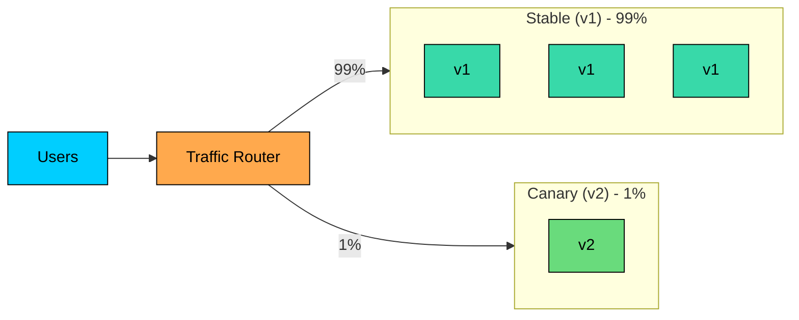

A **canary release** sends a small slice of production traffic to a new version, watches what happens, and only continues if the metrics look good. Named after the canaries miners carried to detect dangerous gases: a small subject goes in first, and the rest follow only if it survives.

This is the most controlled deployment strategy in common use. It costs more than rolling, demands more operational machinery than blue-green, and requires real metrics discipline. The payoff is that high-risk changes can ship without exposing the whole user base to a bad version.

---

# 1. The Core Idea

A small percentage of traffic is routed to the new version while the rest continues to hit the old version. At each step, the system measures how the new version is performing and decides whether to expand, hold, or roll back.



The shape of a typical canary rollout:

1. **Deploy a single canary instance** (or a small percentage of capacity) on the new version.
2. **Route 1% of traffic** to the canary.
3. **Watch metrics** for an observation window: error rate, latency, saturation, business signals.
4. **Promote to 5%** if metrics look good. Watch again.
5. **Promote to 25%, then 50%, then 100%**, each with its own observation window.
6. **Tear down or repurpose the old fleet.**

If any stage shows degradation, the rollout halts and traffic shifts back to the old version. Blast radius is limited to whatever percentage was on the canary at the time.

---

# 2. Why Canary

**Strengths:** smallest possible blast radius (a broken v2 only affects the canary slice), real production data (bugs that hide in staging often show up immediately), gradual confidence built step by step, automatable rollouts, and clean composition with feature flags so code can ship dark.

**Weaknesses:** mixed-version window for the full rollout duration (same backward-compatibility constraints as rolling), needs traffic-splitting infrastructure and version-aware metrics, slow rollouts (minutes to hours), and low-traffic services may not generate enough statistical signal in a 1% slice.

Canary fits high-risk changes on high-traffic services. The cost is justified by the size of the user base that gets protected.

---

# 3. Traffic Splitting

The router has to send a fraction of requests to the canary fleet. A few mechanisms are common.

### 3.1 Random Percentage Split

The simplest model: the router decides per-request which fleet to send traffic to.

A user can hit both versions across requests. Fine for stateless services; not for features that need session consistency.

### 3.2 Sticky Splitting

The router hashes a user identifier (session, user ID, IP) so each user lands on the same fleet for the rollout's duration. Keeps individual users on a consistent version. The downside is that the canary slice is a fixed cohort; if those users are unusually heavy or quiet, the metrics are skewed.

### 3.3 Targeted Routing

Split by attributes: geography, device, account tier, internal vs external users, beta opt-in. Useful for releasing to specific cohorts (internal employees, beta users) before a percentage rollout. This is where feature flag systems intersect with canary: the flag controls which users see the new behavior, while the deployment puts the code on every instance.

---

# 4. The Metrics That Drive Decisions

The canary is only as good as the signal that decides whether to promote it. The metrics fall into three categories.

### 4.1 The Golden Signals

The classic four signals from SRE practice:

| Signal | What It Measures | Why It Matters |
|--------|------------------|----------------|
| **Latency** | Time per request, especially p95 and p99 | Catches slowdowns from inefficient code or new dependencies |
| **Errors** | Rate of failed requests (5xx, exceptions, timeouts) | The most direct signal of broken behavior |
| **Traffic** | Requests per second | Confirms the canary is receiving its expected share |
| **Saturation** | CPU, memory, queue depth, connection pool usage | Catches resource exhaustion before it causes errors |

Latency and error rates are usually the primary promotion criteria. Saturation is a leading indicator that lets the system roll back before user impact.

### 4.2 Business and Service-Specific Metrics

Golden signals miss product-level regressions: a canary that returns 200 responses with worse search results looks fine on system-level metrics. Business metrics (orders per minute, sign-ups, conversions, payment authorization rate, cache hit rate) move slower but catch what technical metrics miss.

Some changes need service-specific signals: a new ranking model compared on click-through and dwell time, a new cache compared on hit rate and tail latency, a new payment processor on authorization success rate. The canary system should be able to compare these in real time between canary and stable.

---

# 5. Automated Canary Analysis

Manual canary analysis (an engineer watching dashboards) works at low scale but does not scale to hundreds of deploys a day or signals that move slowly. **Automated canary analysis (ACA)** compares canary metrics to stable on a fixed schedule and either promotes or rolls back automatically.

```mermaid
flowchart LR
    DEPLOY["Deploy<br/>canary at 1%"]:::primary
    WAIT["Observation<br/>window<br/>(e.g. 5 min)"]:::orange
    COMPARE["Compare<br/>canary vs stable<br/>on metrics"]:::orange
    DECIDE{"Promote""}:::teal
    EXPAND["Move to<br/>next step<br/>(5%, 25%, ...)"]:::green
    ROLLBACK["Roll back<br/>to stable"]:::red

    DEPLOY --> WAIT --> COMPARE --> DECIDE
    DECIDE -- "Yes" --> EXPAND
    DECIDE -- "No" --> ROLLBACK

    classDef primary fill:#00ceff,stroke:#000,color:#000
    classDef orange fill:#ffa94d,stroke:#000,color:#000
    classDef teal fill:#38d9a9,stroke:#000,color:#000
    classDef green fill:#69db7c,stroke:#000,color:#000
    classDef red fill:#ff8787,stroke:#000,color:#000
```

The decision logic involves a same-time baseline comparison (canary vs stable on similar traffic, controlling for time-of-day effects), a statistical confidence test (Mann-Whitney U or simpler thresholds), configurable per-metric thresholds (e.g. error rate within 10% of baseline, p99 latency within 20%), and a weighted score combining them into one decision. Tools include Spinnaker (with Kayenta), Argo Rollouts (with Prometheus or Datadog providers), AWS CodeDeploy hooks, and Harness. ACA is the difference between a strategy and a system: a team with ACA can promote canaries without anyone watching.

---

# 6. Choosing the Stages

The rollout proceeds through a sequence of percentages. The choice of stages depends on traffic volume, risk profile, and observation window.

A few typical sequences:

| Pattern | Stages | Total Duration |
|---------|--------|----------------|
| **Aggressive** | 1% → 25% → 100% | 30 minutes |
| **Standard** | 1% → 5% → 25% → 50% → 100% | 1-2 hours |
| **Conservative** | 0.1% → 1% → 5% → 25% → 50% → 100% | 4-24 hours |
| **Geographic** | One region → second region → all regions | Hours to days |
| **Tenant-staged** | Internal users → beta cohort → 10% public → 100% | Days |

A useful rule: each stage's observation window should be long enough to detect the slowest-emerging problems the team is worried about. A memory leak that takes an hour to manifest will not be caught by a 5-minute observation. A latency spike that appears within a second can be caught quickly.

Different metrics need different windows. Error rates show up in seconds. Memory pressure shows up in minutes. Business metric regressions can take hours to be statistically significant.

---

# 7. Canary Capacity

The canary fleet needs enough capacity to serve its share of traffic comfortably. A common mistake: deploying a single canary instance and then routing 50% of traffic to it. The instance gets crushed, looks broken, and the rollout aborts for the wrong reason.

A safer rule: the canary fleet's capacity-per-percent-of-traffic should at least match the stable fleet's. If the stable fleet has 100 instances handling 99% of traffic, the canary needs roughly 1 instance per 1% of traffic.

For a small canary slice (1%, 5%), this often means deploying exactly one or two canary instances. For larger slices (25%, 50%), the canary fleet grows accordingly.

In Kubernetes terms, this is usually managed by scaling the canary `Deployment` proportionally as the rollout advances. Argo Rollouts and Flagger handle the scaling automatically.

---

# 8. The Mixed-Version Window

For the entire duration of a canary rollout, the system is mixed. v1 and v2 are both serving traffic. The standard mixed-version constraints apply:

1. **Schema changes must be backward compatible.** Use expand-contract.
2. **APIs must be additive.** v1 clients of v2 (and vice versa) must not break on each other's responses.
3. **Asynchronous messages must work across versions.** Consumers handle both formats.

The canary window is often longer than a rolling deployment window because canary rollouts proceed slowly. A 4-hour canary means the system spends 4 hours with two versions of the application talking to the same database and the same queue. The discipline around compatibility has to last that long.

---

# 9. Feature Flags and Canary

The two solve different problems: a canary controls *which version of the code* serves a request, while a feature flag controls *which behavior* the code exhibits.

A common pattern: ship the new code through canary with the behavior gated behind a flag. The canary verifies the code is safe under real traffic; only once the code is at 100% does the team ramp the flag to expose the behavior. The code can ship with the feature off (a bug stays invisible), and the feature can be turned off without a redeploy. Canary plus flags is the operational pattern behind most modern continuous deployment systems.

---

# 10. Failure Modes

- **Underpowered canary.** A 1% canary with half the per-request capacity of stable runs hot and looks broken. Fix: scale canary capacity to its traffic share.
- **Insufficient traffic for signal.** A low-traffic service at 1% sees a few requests per minute; error rate is statistically meaningless. Fix: increase the slice, lengthen the window, or do not canary low-traffic services.
- **Stale baseline.** Comparing canary against a baseline from a different time gives misleading results. Fix: collect baseline from the stable fleet during the same window.
- **Metrics that move too slowly.** Revenue per user can take hours to move; by then the canary is at 50%. Fix: gate promotion on faster signals (errors, latency); use slower business metrics for post-rollout checks.
- **Bad user cohort.** Sticky splitting that lands on an unusual cohort (one region, one device type) skews the metrics. Fix: use random splitting, or stratify the comparison.
- **Canary that never completes.** The canary grows but never finishes the rollout. Fix: every canary should have a defined end state.
- **Async side effects on rollback.** A canary that wrote messages, sent webhooks, or triggered downstream actions cannot undo those by rolling back. Fix: design changes to be idempotent or compensable.

---

# 11. Canary in Different Environments

The mechanics vary across platforms; the principles do not.

- **Kubernetes** does not natively support canary. The common approach is two `Deployments` (stable and canary) with a `Service`, `Ingress`, or service mesh splitting traffic. **Argo Rollouts** and **Flagger** add canary as a managed resource that handles scaling, metric collection, promotion, and rollback.
- **Cloud provider native:** AWS CodeDeploy has canary configurations ("Canary10Percent5Minutes") integrated with CloudWatch alarms. Google Cloud Deploy and Azure DevOps offer similar.
- **Self-managed:** Some teams build canary on plain load balancers and metric pipelines. Reasonable for medium-sized systems, but requires building the metric comparison and rollback logic explicitly.
- **Edge-level canary:** For static assets and edge-rendered content, canary can run at the CDN (Cloudflare Workers, Fastly Compute, Lambda@Edge), routing before traffic reaches the origin.

---

# 12. When Canary Fits

Canary fits:

- High-risk changes: algorithm updates, schema-coupled features, performance-sensitive paths.
- High-traffic services where 1% is still a meaningful sample.
- Teams with mature observability (per-version metrics, real-time dashboards, alerting).
- Changes where bugs only appear under real production load.
- Critical user-facing services where a fast rollback is required.

Canary is less useful for:

- Low-traffic services where small slices do not generate statistical signal.
- Trivial changes (config tweaks, copy edits) where the operational cost outweighs the benefit.
- Services without good per-version metrics. Without comparison, the canary becomes a slower rolling deploy without added safety.
- Stateful workloads. Canary on a database is complex; canary on a request-serving service in front of the database is fine.

In practice, mature systems combine canary with rolling: the canary verifies the change at a small slice, then a rolling deployment finishes the rollout efficiently.

---

# Summary

A canary release sends a small slice of traffic to a new version, watches metrics, and promotes only if the data looks good. It is the safest deployment strategy in common use and the most operationally demanding.

#### **Key takeaways:**

1. **Canary routes a percentage of traffic to the new version.** Typical rollouts step through 1%, 5%, 25%, 50%, 100%.
2. **The promotion decision is metric-driven.** Latency, errors, saturation, and business signals decide whether to expand or roll back.
3. **Automated canary analysis (ACA) compares canary to stable in real time** using a same-time baseline and configured thresholds.
4. **Traffic splitting can be random, sticky, or targeted.** Each has different effects on metrics and user experience.
5. **Canary capacity must match traffic share.** Undersized canaries look broken even when the code is fine.
6. **Backward compatibility applies for the full rollout duration.** Expand-contract for schemas, additive APIs, version-tolerant consumers.
7. **Feature flags pair naturally with canary.** Ship the code through canary, then ramp the feature through flags.
8. **Canary is often the safety net on top of rolling deployments.** The canary slice catches issues; the rolling deploy finishes the rollout efficiently.

A canary release turns a risky change into a series of small, observable, reversible decisions. The price is operational machinery; for high-traffic systems where a bad release is expensive, that price is the best deal in deployment.

---

# Quiz
