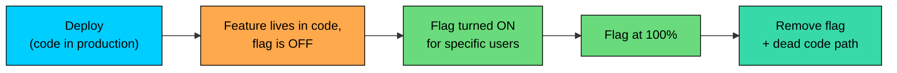
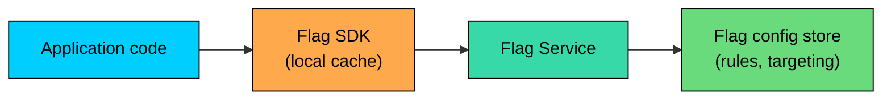

A **feature flag** is a conditional in the code that decides at runtime whether a particular behavior is on or off. The deployment ships the code; the flag turns the feature on.

This two-line idea has remade how modern teams ship software. Risky changes release to internal employees, then beta, then 1%, then 10%, then everyone, all without touching the deployment pipeline. Broken features turn off without a rollback. Different users see different behavior based on geography, account tier, or experiment cohort. Deploy and release become separate events.

---

# 1. The Idea: Deploy is Not the Same as Release

A **deploy** moves code onto servers. A **release** makes new behavior visible to users. Without flags, those two events are the same: the moment new code lands in production, every user sees the new behavior. Feature flags break that link.

A flag-gated feature follows its own lifecycle independent of the deployment: ship dormant code, activate for internal employees, expand to beta, ramp to 1%/10%/50%/100%, roll back by flipping the flag without redeploying, then remove the flag and old code path. This is the operational pattern behind continuous deployment in mature engineering organizations.

---

# 2. A Minimal Example

In the simplest form, a feature flag is a conditional.

Both code paths exist in the deployed binary. The flag service decides which one runs for a given user at a given moment, and a web dashboard toggles the flag without touching code. The real work happens inside `flags.isEnabled`: it consults a local cache, a remote config service, a percentage rule, or a targeting expression. The application code stays simple; the flag system handles the policy.

---

# 3. Types of Feature Flags

A useful taxonomy from Pete Hodgson's work lists four distinct types, each with its own lifecycle.

| Type | Purpose | Typical Lifetime | Removed When |
|------|---------|------------------|--------------|
| **Release toggle** | Gate a new feature during rollout | Weeks | Feature is fully released |
| **Experiment toggle** | Random assignment for A/B testing | Days to weeks | Experiment concludes |
| **Ops toggle** | Runtime control: circuit breakers, kill switches, expensive-feature throttles | Months to years | Underlying behavior is removed |
| **Permission toggle** | Per-user feature access (tier, geography, plan) | Permanent | Feature is removed |

Release toggles make a single launch safer; they are technical debt the moment they linger past 100% rollout. Experiment toggles drive A/B tests and convert to release toggles when a winner is picked. Ops toggles are part of the production toolbox, not features. Permission toggles express the product's access model in code.

Mixing the types causes confusion: a release toggle that quietly became a permission decision is debt in disguise. Naming and documenting the type up front keeps the system honest.

---

# 4. Where the Decision Happens

A flag check is one line of code, but the question "is this flag on"" can be answered in a few different places, and the trade-offs matter.

### 4.1 Server-Side Evaluation

The application server asks the flag SDK for a decision; the SDK has rules cached locally or contacts a flag service. Safest for security-sensitive flags because the client never sees the rules, only the result. Also makes the flag value consistent within a single request.

### 4.2 Client-Side Evaluation

A web or mobile client asks the flag service directly to drive UI behavior. Necessary for purely visual changes (a redesigned button, layout, or copy). The trade-off is that the client can see and potentially manipulate the value, so do not gate sensitive features here; the server must re-check on any privileged action.

### 4.3 Edge Evaluation

A CDN or edge function evaluates the flag and rewrites the response or routes the request before it reaches the origin. Fastest but the most constrained (limited user information, limited code execution). Useful for geographic targeting, A/B-tested static pages, and gating that has to happen before the request travels.

### 4.4 SDK Caching

In every model, the SDK caches flag rules locally and evaluates in-process. The hot path is microseconds, not a round trip. Rules refresh every 30-60 seconds, balancing flag-change propagation against load on the flag service.

---

# 5. Targeting Rules

Flag systems support several targeting modes:

- **Boolean toggle.** On or off globally. Useful for ops toggles and the endpoints of a release lifecycle.
- **Percentage rollout.** On for a fraction of users, decided by hashing the user identifier into a bucket. Requires **sticky hashing** so the same user keeps the same answer across visits.
- **Attribute targeting.** Rules depend on user properties (country, plan, signup date, app version, employee status). This is how cohort releases work: employees first, then one country, then a percentage of users in that country.
- **List-based targeting.** Specific users get the flag by ID. Useful for beta testers, support escalations, and demos.

A real flag combines these into ordered rules:

The rule engine evaluates conditions in order and returns the first match. Complex rule trees become unmaintainable; keep targeting simple and document why each rule exists.

---

# 6. Sticky Hashing in Detail

A percentage rollout has to be **stable**: a user who saw the feature yesterday should still see it today. The standard approach hashes the user identifier together with the flag key, takes the result modulo 100, and checks against the rollout threshold.

The flag key is part of the hash input so two flags at the same 10% rollout select different 10% slices; otherwise, the same unlucky users would see every new feature. The user identifier must be stable across sessions: hash on user ID (or device ID for anonymous traffic), not session ID or IP.

---

# 7. Latency and Availability of the Flag System

The flag check sits on the critical path of every request, so its latency and availability are part of the application's. A few practical rules: evaluate locally in the SDK (microseconds, not network round trips), pick a deterministic fallback for when the flag service is unreachable (usually the flag's default value), keep cache TTLs in seconds, and treat the flag service as a tier-1 dependency with redundant deployment, on-call coverage, and SLOs. A flag system that adds 100ms of latency to every request is a worse problem than the bug it gates.

---

# 8. Flag Lifecycle and Technical Debt

A flag that ships is easy. A flag that gets removed is rare.

Each unremoved flag is a permanent fork in the code:

A codebase with a hundred lingering release toggles has a hundred forks. Testing has to cover all permutations. Old code rots and develops bugs nobody notices because no traffic exercises that path.

The mature pattern: name flags with type and intent (`release-new-checkout-flow-2026-q1` is harder to forget than `checkout-flag`), set a removal date that the dashboard tracks, treat flag removal as part of the feature work, audit flags regularly (quarterly for release toggles, annually for ops), and limit who can create flags. A team that ships flags faster than it removes them will eventually drown in them.

---

# 9. Flags in Different Layers

Flags can live in any part of the stack. The choice depends on where the decision needs to happen.

| Layer | Use Case | Trade-off |
|-------|----------|-----------|
| **Backend code** | Server logic, API responses, business rules | Most flexible, requires deploy to add new flag check |
| **Frontend code** | UI changes, layout, copy | Visible to client, requires backend re-check for security |
| **Edge / CDN** | Geographic routing, static page variants | Fast, but limited info and code |
| **Configuration** | Tuning parameters, rate limits, retry counts | Often called "dynamic config" rather than flags |
| **Database** | Per-tenant features in SaaS | Permission flags expressed as data |

A single feature often uses flags in several layers at once: a backend flag controls the API behavior, a frontend flag shows the UI, and an edge flag routes a percentage of users. Keeping them in sync is part of the operational cost.

---

# 10. Flags and Other Strategies

Feature flags compose with the standard deployment strategies:

- **Flags + canary:** The canary releases the code; the flag releases the feature. A canary can hit 100% with the feature still off, then the flag ramps on its own schedule without redeploys.
- **Flags + blue-green:** The new feature ships in both blue and green; the flag decides whether the feature is visible. The blue-green switch is operational; the flag flip is product.
- **Flags + schema changes:** Flags do not solve migration problems but can defer the moment a new column is required. Deploy code that knows about the new column with the flag off, run the expand and backfill steps, then turn the flag on.
- **Flags + A/B testing:** A flag is the assignment mechanism. Most A/B testing platforms are built on a feature flag system, layering random assignment and metric analysis on top.

---

# 11. Common Pitfalls

- **Flag creep.** Flags grow without bound because nobody removes them. Budget flag removal as part of every release; track flag count and age as metrics.
- **The forever-release toggle.** A release toggle was set to 100% months ago and forgotten. Alert on release toggles that have been at 100% for too long.
- **Stateful inconsistency.** The flag changes mid-session and a user gets two halves of an incompatible flow. Use sticky hashing; cache the flag value for the duration of a workflow.
- **The flag that cannot be turned off.** The "old code path" rotted while the flag was on, so flipping it back crashes. Keep both paths exercised in tests until the flag is removed.
- **Targeting rule explosion.** Fifty rules nobody understands. Keep targeting simple; complex logic belongs in code.
- **Sensitive logic on the client.** A client-side flag deciding admin access is trivially manipulable. Never gate security on a client-side flag; the server must re-check.
- **Flags as a replacement for tests.** Shipping untested code behind a flag means bugs surface as soon as the flag flips. Flags are a safety net, not a substitute for staging and canary.

---

# 12. Build vs Buy

The basic functionality is straightforward (config service, SDK, sticky hashing), but a production-quality system has sharp edges: per-user evaluation at scale, audit logs, rule editors with safety guards, observability integrations, and SDKs in every language the team uses.

| Option | When It Fits |
|--------|--------------|
| **Hand-rolled** | Small teams, simple needs, ops toggles only |
| **Open-source (Unleash, GrowthBook, OpenFeature)** | Teams that want control and have engineering bandwidth to operate the service |
| **Commercial (LaunchDarkly, Split, Statsig, Optimizely)** | Teams that want the system to work out of the box; per-seat pricing can get expensive at scale |
| **Cloud provider (CloudWatch Evidently, GCP Feature Manager)** | Teams already deep in one cloud |

A common path: start hand-rolled or open-source, migrate to a commercial vendor when operational cost outweighs the license cost.

---

# Summary

A feature flag is a runtime conditional that decouples deploying the code from releasing the behavior. Used well, it is the single most powerful operational pattern in modern engineering.

#### **Key takeaways:**

1. **Deploy is not release.** Flags separate "the code is in production" from "users see the new behavior."
2. **Four types of flags serve different jobs:** release, experiment, ops, permission. Each has its own lifecycle.
3. **Evaluation can happen on the server, client, or edge.** Each layer has different security and latency trade-offs.
4. **Sticky hashing keeps percentage rollouts stable per user.** Hash on a stable identifier with the flag key as part of the input.
5. **Targeting combines boolean toggles, percentage rollouts, attributes, and lists.** Keep rules simple; complex logic belongs in code.
6. **The flag system is on the critical path.** Local SDK evaluation, cached rules, defined fallback behavior.
7. **Flags compose with canary, blue-green, schema migrations, and A/B tests.** They are infrastructure for safe change.
8. **Flag debt is real.** Budget flag removal as part of every feature: done = shipped, flag at 100%, flag removed, dead path deleted.

A feature flag is one line of code with a lifetime of operational discipline behind it. Used well, it turns risky releases into controlled experiments. Used badly, it turns the codebase into a maze.

---

# Quiz
