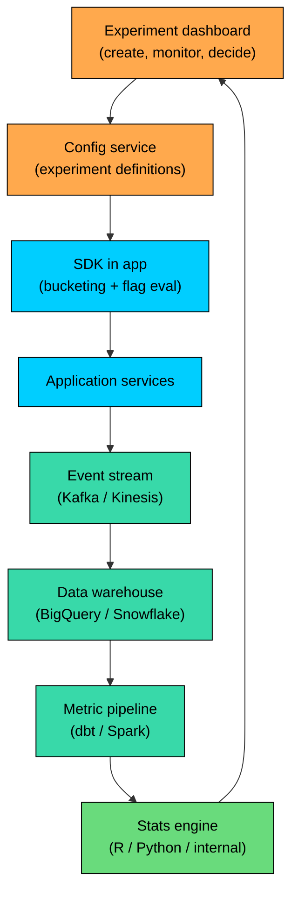

An **A/B test** randomly assigns users to two or more variants of a product experience, measures how each variant performs on a chosen metric, and uses the difference to decide which version to ship. The infrastructure that powers it is what lets a company go from "we think the new checkout flow is better" to "the new checkout flow lifted revenue per visitor by 1.8% with 95% confidence over four weeks on 12 million users."

A/B testing is a system design problem disguised as a product practice. Biased random assignment, statistically meaningless metrics, network effects contaminating the control group, pipelines that aggregate events incorrectly: each can turn a careful experiment into a confident wrong answer.

---

# 1. What the System Has to Do

An A/B testing platform has to do a few things, and it has to do them at scale, reliably, and reproducibly.

```mermaid
flowchart LR
    USER["User request"]:::primary
    ASSIGN["Assign to variant<br/>(bucketing)"]:::orange
    SERVE["Serve variant<br/>(application logic)"]:::orange
    EVENT["Emit exposure<br/>+ outcome events"]:::orange
    PIPE["Metric pipeline<br/>(aggregate, join)"]:::teal
    STATS["Statistical<br/>analysis"]:::teal
    DECIDE["Ship / kill /<br/>iterate"]:::green

    USER --> ASSIGN --> SERVE --> EVENT --> PIPE --> STATS --> DECIDE

    classDef primary fill:#00ceff,stroke:#000,color:#000
    classDef orange fill:#ffa94d,stroke:#000,color:#000
    classDef teal fill:#38d9a9,stroke:#000,color:#000
    classDef green fill:#69db7c,stroke:#000,color:#000
```

The steps: **assign** each user to a variant in a stable way, **serve** it from the application, **log** the exposure event and the subsequent outcome events, **aggregate** across millions of users, **analyze** the difference with the right statistical method, and **decide** what to do. Every step is part of the system, and every step is a place things can go wrong.

---

# 2. Bucketing: Assigning Users to Variants

Bucketing is the foundation. If users are not assigned cleanly to variants, nothing downstream is trustworthy.

### 2.1 The Hash Function

The standard mechanism is a hash of a stable user identifier together with an experiment identifier. The hash output gets divided into buckets, and the buckets are assigned to variants.

Two properties matter:

1. **Stable.** The same user gets the same variant every time. A user who saw the new checkout yesterday must see the new checkout today.
2. **Independent across experiments.** The experiment key is part of the hash input, so the same user can be in different cohorts in different experiments. Without that, the same unlucky 10% would be in the treatment group of every experiment, contaminating results.

### 2.2 What to Hash On

The identifier matters. Common choices:

| Identifier | Pros | Cons |
|------------|------|------|
| **User ID** | Stable across devices and sessions | Requires login; anonymous traffic can't use it |
| **Device ID / cookie** | Works for anonymous users | Same user on two devices gets two assignments |
| **Session ID** | Always available | Same user gets different variants across sessions |
| **Account ID (for B2B)** | Stable per organization | Multiple users in one account share a variant (can be desired or not) |

The choice depends on whether the experiment is about an individual user or about a session, and whether users can be identified across logins. Mature platforms support hashing on user ID when available and falling back to device ID for anonymous traffic.

### 2.3 Traffic Allocation and Holdouts

Not every experiment needs 50/50. High-risk changes start at 95% control / 5% treatment, then ramp up once the system confirms no obvious breakage. The infrastructure has to change allocations without rebucketing users already in the experiment.

Some platforms reserve a **global holdout**: a small percentage of users who never enter any experiment. This serves as a long-term baseline for the cumulative effect of everything the platform has shipped; without it, years of small wins can quietly fail to compound at the product level.

---

# 3. Exposure Logging

A bucketing decision alone is not enough; the experiment needs to know which users were **exposed**, not only assigned. A user assigned to a checkout experiment who never opens the checkout page should not be counted, or they dilute the effect.

The pattern: when the user reaches the experiment surface (renders the page, calls the API, sees the feature), the application emits an **exposure event** with the user ID, variant, experiment key, and timestamp. That event defines experiment membership for analysis. A common bug is emitting at assignment time instead of at exposure, which counts everyone who could have seen the feature and washes out the effect.

---

# 4. Outcome Events and the Metric Pipeline

Once exposure is recorded, the system has to measure what users do afterward.

### 4.1 Event Stream and Joining

The application emits events for everything that matters (page views, clicks, purchases, sign-ups, errors) into a stream processor (Kafka, Kinesis) that lands in a data warehouse (BigQuery, Snowflake, Redshift, Databricks). Events carry user ID, timestamp, and properties; experiment metadata is not needed because the platform joins exposures to outcomes by user ID and time:

The query counts outcomes within a defined attribution window. A 1-day window captures immediate impact; a 14-day window captures longer-term effects but introduces more noise.

### 4.2 Metric Types

Experiments track four classes of metrics: a **primary** (the one the experiment is decided on), **secondary** metrics that should also move or at least not regress, **guardrail** metrics that should never get worse (latency, errors, payment success rate), and **diagnostic** metrics that explain mechanism (cart additions, clicks). A "winning" experiment that wrecks a guardrail should not ship.

Metrics are usually recomputed hourly for operational catch-up and nightly for decisions; freshness matters more for catching breakage than for statistical significance.

---

# 5. Statistical Foundation

A difference between variants does not mean the difference is real. The variant with a 2.1% conversion rate vs the control's 2.0% might have done better by chance alone. Statistical analysis is what separates signal from noise.

### 5.1 P-values and Sample Size

The null hypothesis is that there is no difference between variants. The experiment collects evidence, and a **p-value** below 0.05 is the conventional threshold for declaring the difference **statistically significant** (the probability of seeing a result this extreme under the null is below 5%).

Smaller true effects need bigger samples. The **minimum detectable effect (MDE)** is the smallest difference the experiment can reliably detect at a given sample size. A simple rule of thumb for binary metrics like conversion rate:

For p = 5% conversion and MDE = 0.5 percentage points, that gives roughly 30,000 users per variant. A platform that does not surface MDE upfront leaves teams running experiments that could not have produced a clear answer regardless of outcome.

### 5.2 Confidence Intervals and Multiple Comparisons

Confidence intervals are more informative than a binary "significant or not." "The new checkout lifted conversion by 1.2% (95% CI: 0.6% to 1.8%)" tells the team both that the lift is real (the interval excludes zero) and the likely range of the effect. Most platforms now report intervals alongside p-values.

With many metrics, the **multiple comparisons problem** appears: with 20 metrics, one will probably look "significant" at the 0.05 level by chance. Mitigations: pre-register the primary metric before the experiment runs, apply corrections like Bonferroni or Benjamini-Hochberg, and treat secondary metrics as supporting evidence, not as decisions.

---

# 6. The Pitfall: Peeking

**Peeking** is the most common mistake: looking at results repeatedly during the experiment and stopping as soon as something looks significant. The math behind p-values assumes a fixed sample size; aggressive peeking can push the actual false positive rate above 30%.

Two mitigations: a **fixed-horizon design** (predetermined sample size or time, look only at the end), or **sequential testing** methods (SPRT, mSPRT, Bayesian methods with appropriate priors) that produce p-values valid at any time. Mature platforms (Optimizely, Statsig, Eppo, internal tools at Microsoft and Netflix) default to sequential methods so teams can check dashboards without breaking the math.

---

# 7. Sample Ratio Mismatch (SRM)

If a 50/50 experiment shows 52/48 in the analysis, something is broken. **Sample Ratio Mismatch (SRM)** is detected with a chi-square test against the expected allocation. The results of an SRM-positive experiment cannot be trusted.

Common causes: uneven hash distribution, variant-specific bugs that crash users before the exposure event fires, exposure events dropped or delayed for one variant, and CDN caching that serves one variant's response to users assigned to the other. Any SRM-positive experiment should be paused and investigated, not used for decisions.

---

# 8. Network Effects and Interference

A/B tests assume **independence**: one user's outcome is not affected by which variant other users see. That assumption breaks in marketplaces (a buyer in treatment buys from a seller in control), social networks (treatment users interact with control users), auction systems (treatment and control bidders compete for the same impressions), and ride-share (dispatch spans the whole platform).

Under interference, the variant difference under- or over-estimates the true effect. Fixes: **cluster-randomized designs** (allocate at the market or region level), **switchback tests** (switch the whole system between variants over time), or **holdout markets** (treatment in some markets, control in others). Most platforms cannot diagnose interference automatically; the experimenter has to know it is a risk.

---

# 9. The Experimentation Platform as a System

A real experimentation platform is several services working together.

The pieces:

1. **Experiment dashboard.** Web app where teams define experiments, allocate traffic, monitor progress, and read results.
2. **Config service.** Stores experiment definitions: variants, allocations, targeting rules. Same shape as a feature flag service.
3. **SDK.** Library in the application that fetches config, makes assignments, emits exposure events.
4. **Event stream.** Kafka, Kinesis, or similar, carrying exposure events and outcome events.
5. **Data warehouse.** Long-term storage where events accumulate.
6. **Metric pipeline.** Scheduled jobs (Airflow, dbt, Spark) that aggregate events into experiment metrics.
7. **Stats engine.** Library or service that runs the statistical tests on aggregated metrics.

The dashboard reads from the stats engine. The whole system loops back: experiments defined in the dashboard, executed by the SDK, observed in the events, aggregated in the warehouse, surfaced back to the dashboard.

Many companies build only some of these layers in-house. The SDK and dashboard are often vendor-provided; the data pipeline is usually custom because every company's metrics are unique.

---

# 10. Experiment Lifecycle and Governance

Without governance, the platform either produces results nobody trusts or results everyone trusts too much. The basics: every experiment is **registered** with an owner, hypothesis, primary metric, duration, and decision rule. **Power analysis upfront** shows the expected MDE for the chosen sample size. The platform monitors for SRM and pauses experiments that show it. **Decisions** are made on the primary metric with guardrail checks, and surprising negative results get a second pair of eyes. Shipped variants continue under **post-launch monitoring** because effects can fade. An **experiment graveyard** records every experiment ever run, including those that did not ship, for institutional memory.

---

# 11. Common Pitfalls

- **Peeking and early stopping.** Use sequential analysis or a fixed horizon.
- **Ignored SRM.** Treat as a stop signal, not a footnote.
- **Exposure logged at assignment time.** Dilutes the effect. Emit at point of actual exposure.
- **Cherry-picked metrics.** Pre-register the primary; correct for multiple comparisons.
- **Underpowered experiments.** Calculate MDE first; do not run experiments that cannot answer.
- **Network effects ignored.** Marketplace and social experiments need cluster designs or switchbacks.
- **Drifting metric definitions.** Pin definitions per experiment so mid-flight changes do not invalidate the comparison.
- **No guardrails.** A "winning" variant that doubles page load time should not ship.
- **Overlapping treatments.** Ten experiments on the same surface produce confounded results. Use mutual exclusion or factorial designs.
- **Results that do not replicate.** Treat flashy wins with skepticism; rerun important ones.

---

# 12. When A/B Testing Fits

A/B testing fits when the change is measurable, the user base is large enough to give a usable MDE, effects are independent, and the team can wait at least one business cycle. It does not fit qualitative decisions ("is the new design more on-brand""), small samples (B2B with a hundred users), platform-wide policy changes that affect everyone, or developer tools that affect engineers more than users. For these, other techniques apply: usability studies, qualitative interviews, before/after analysis, holdout markets, switchback designs.

---

# Summary

A/B testing turns "I think this is better" into "this is better by X%, with Y confidence, on Z metric." The infrastructure that supports it is what makes that statement trustworthy.

#### **Key takeaways:**

1. **The pipeline is: assign, serve, log exposure, log outcomes, aggregate, analyze, decide.** Each step is a system component.
2. **Bucketing uses a stable hash of user ID and experiment key.** Sticky per user, independent across experiments.
3. **Exposure events define experiment membership.** They must fire when the user sees the variant, not at assignment time.
4. **Statistical analysis turns differences into decisions.** P-values, confidence intervals, and MDE are the core concepts.
5. **Peeking inflates false positive rates.** Sequential methods make repeated looks safe.
6. **Sample ratio mismatch is a stop signal.** A broken split means broken results.
7. **Network effects break independence assumptions.** Marketplaces, social networks, and auctions need cluster or switchback designs.
8. **Governance matters as much as math.** Registration, power analysis, guardrails, and post-launch monitoring keep the system honest.

A/B testing is a system design problem disguised as a product practice. The teams that ship from experimentation reliably are the ones that have built the infrastructure to make trustworthy answers the default.

---

# Quiz
