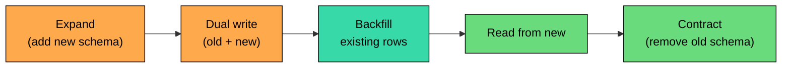
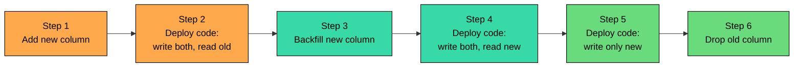

A **schema migration** is any change to the structure of a database: adding a column, renaming, dropping a table, changing a type, adding an index. On a small project, it is one command and a restart. On a production system with live users, the same change is one of the most operationally fraught events in the calendar.

The database is shared, persistent, and under load. The application has many instances running mixed versions of the code, all reading and writing the same tables. A migration that locks the database brings the application down; a migration that changes a column's meaning out from under running code corrupts data; an unindexed update on a billion-row table can lock for hours. Zero-downtime schema migration is the practice of making these changes without taking the system down, breaking the application, or putting data at risk.

---

# 1. The Two Hard Constraints

Most of the difficulty in production schema migrations comes from two constraints that exist together:

1. **The application is running.** Multiple code versions (mid-deployment) read and write the same tables. The migration cannot assume the application is paused, restarted, or even aware of the change.
2. **The database is big.** A few hundred million rows cannot be migrated instantly. Long-running migrations hold locks, build up replication lag, exhaust memory, or run so long nobody knows when they will finish.

Together, these constraints push every schema change toward a multi-step pattern: small, reversible steps where the application keeps working through each one.

---

# 2. The Expand-Contract Pattern

The single most important idea in production schema migration is **expand-contract** (also called **parallel change**). Rather than swapping the schema in one step, the change is split into stages that the application can handle gracefully.

The five stages:

1. **Expand.** Add the new schema element without removing anything. Old code ignores it; new code might use it.
2. **Dual write.** Application writes both old and new shapes. New data exists in both places.
3. **Backfill.** Populate the new shape for existing rows as a rate-limited background job.
4. **Switch reads.** Application reads from the new shape; the old shape is still maintained.
5. **Contract.** Once nothing reads or writes the old shape, drop it.

Every stage is independently deployable and reversible. If something goes wrong at stage 3, the application still works because nothing has stopped writing or reading the old shape. The migration can pause indefinitely between stages.

---

# 3. Adding a Column

The simplest schema change. The procedure depends on whether the column has a default value, whether it is NULLable, and how big the table is.

### 3.1 Adding a NULLable Column

A nullable column with no default is usually safe to add directly:

On modern Postgres and MySQL (8.0+), adding a nullable column with no default is an instant metadata change. The table is not rewritten and existing rows treat the new column as NULL. Old application instances ignore the column.

### 3.2 Adding a Column with a Default Value

A default value can rewrite the table. Postgres 11+ and MySQL 8.0 do this as metadata-only in many cases; older versions rewrite. On a billion rows, a rewrite is hours of locking. When in doubt, add the column NULL, backfill the default in batches, then enforce the default in a separate ALTER.

### 3.3 Adding a NOT NULL Column

The naive form `ALTER TABLE users ADD COLUMN tier VARCHAR(20) NOT NULL DEFAULT 'free'` can rewrite the table and lock concurrent writes for the duration. The safe pattern: add nullable, write values for new rows, backfill existing rows in batches, then add `NOT NULL` separately (in Postgres, with `NOT VALID` first, then validate). Slower in wall-clock time but does not block production traffic.

---

# 4. Removing a Column

Removing a column is expand-contract in reverse: stop writing, stop reading, wait until in-flight transactions complete and monitoring confirms nothing uses the column, then drop. Skipping any step produces errors on instances still selecting the column.

A useful intermediate step is to rename the column to a "deprecated" name first, watch for errors for a few days, then drop. This catches stragglers without losing the data immediately.

---

# 5. Renaming a Column

Renaming sounds simple. In practice it is the trickiest of the common operations because the application has to know about both names simultaneously.

The pattern:

Six deploys for one rename. Some steps are typically combined (steps 2 and 3, or 4 and 5), but the conceptual pattern is the same. Even when the database supports atomic column rename (Postgres), the application still has to know both names during deployments. The application coordination is the hard part, not the database.

---

# 6. Changing a Column's Type

Type changes are usually rewrites and use the same expand-contract pattern: add a new column, dual-write, backfill, switch reads, drop. Widening `VARCHAR` on Postgres is metadata-only on recent versions; widening integer types is a rewrite in most databases; narrowing types is always a rewrite plus a data validation step.

Type changes that affect semantics (e.g., timestamp to a JSON column with embedded timestamps) are schema redesigns dressed as type changes. Treat them as such.

---

# 7. Adding an Index

Most modern databases support building an index without blocking writes: Postgres has `CREATE INDEX CONCURRENTLY`, MySQL InnoDB is online by default for most index types, SQL Server has `WITH (ONLINE = ON)`. The online build is slower than a regular index creation; it reads through the table while traffic continues and briefly locks at the end to finalize.

Things to watch: disk space (the new index needs room before the old one is dropped), CPU and IO load during the build (schedule off-peak if the database is near capacity), and the Postgres failure mode where a failed `CREATE INDEX CONCURRENTLY` leaves an invalid index that must be dropped before retrying.

Replacing an index is just create-then-drop in that order; both exist briefly during the overlap. Removing an index is usually fast but operationally risky because queries that relied on the index switch to a different plan, possibly slower. Verify with `EXPLAIN` and slow query logs before dropping.

---

# 8. Large-Table Backfills

The backfill step is often the longest part of a schema migration. Naive backfills run into trouble fast.

### 8.1 The Naive Approach

On a small table, this runs in seconds. On a hundred-million-row table, it locks every row it touches, holds the locks for the duration, fills the transaction log, and starves concurrent writes.

### 8.2 Batched Backfill

The safe pattern is to update in batches with a controlled rate.

Each batch is its own transaction. Locks are held for milliseconds, not hours. The sleep between batches keeps the database from being overwhelmed.

Batch size is a trade-off: bigger batches finish faster but hold locks longer and produce more replication lag; smaller batches are gentler but take longer overall. Typical batch sizes are 1,000-10,000 rows.

### 8.3 Replication Lag

A long backfill on the primary generates write activity that has to be replicated to replicas. If the replicas cannot keep up, lag grows.

Monitor replication lag during backfills. If lag exceeds a threshold, pause the backfill and let replicas catch up.

### 8.4 Idempotency

Backfills get interrupted: deploys, database restarts, operational changes. The backfill should be safe to restart from where it left off. The standard pattern is to track the last processed key (primary key, timestamp) and resume from that point.

---

# 9. Online Schema Change Tools

For databases where DDL is still blocking (older MySQL, very large tables, complex changes), specialized tools perform schema changes without locking.

- **gh-ost (GitHub)** is used heavily at GitHub. It creates a ghost table with the new schema, copies rows in batches, tails the binary log to apply ongoing changes, and swaps the ghost into the original's place via a brief metadata rename.
- **pt-online-schema-change (Percona)** is the older tool. It uses triggers on the original table to mirror writes during the copy. Triggers add overhead and can cause issues under high write load. gh-ost replaced pt-osc as the default at many large MySQL shops, but pt-osc is still common.
- **pg_repack / pgroll (Postgres)** are less common because most online operations are supported natively. `pg_repack` rebuilds tables and indexes without long locks; `pgroll` adds an expand-contract layer on top of Postgres DDL.

Cloud-managed databases (Aurora, Cloud SQL, Azure) add their own constraints: some operations are slower due to snapshots and replication, others are smoother because the service handles failover transparently. The pattern is the same; the tooling differs.

---

# 10. Schema Versioning and Migration Tools

The migrations themselves are managed by tools that keep a version history of schema changes.

| Tool | Ecosystem | Style |
|------|-----------|-------|
| **Flyway** | Java, polyglot | SQL or Java migrations, linear versioning |
| **Liquibase** | Java, polyglot | XML/YAML/SQL migrations, change sets |
| **Alembic** | Python (SQLAlchemy) | Python migrations, autogenerated diffs |
| **Active Record migrations** | Ruby on Rails | Ruby DSL, generated by `rails generate` |
| **Sequelize** | Node.js | JavaScript migrations |
| **goose, golang-migrate** | Go | SQL or Go migrations |
| **Prisma Migrate, Drizzle** | TypeScript | Schema-first, auto-generated migrations |

Most tools follow the same model: migration files in version control with sequential identifiers, a `schema_migrations` table tracking what has run, a command that applies pending migrations in order, and optional "down" migrations for rollback. The tool does not solve the safety problem; a Flyway migration that runs `ALTER TABLE huge_table ADD COLUMN ... NOT NULL DEFAULT ...` is still dangerous, the tool only records that the change happened. Some teams build linters that block pull requests containing operations known to lock big tables.

---

# 11. Migrations and Deployments

A schema migration is part of a deployment, and the order matters. Two simple orderings exist: **migrate first, then deploy** (works for purely additive changes), or **deploy first, then migrate** (works when the application must handle both schemas). For expand-contract, the order is interleaved: deploy, migrate, deploy, migrate, deploy, with each step independently reversible.

Migrations should run **from the deployment pipeline**, not from application startup. Pipeline-driven migrations are centralized, reproducible, and auditable; startup-based migrations risk multiple instances racing to apply the same migration. Application instances should assume the schema is already at the right version.

For rolling, blue-green, and canary deployments, old and new application versions run simultaneously and the schema has to support both. Expand-contract ensures this. The canary mismatch can last hours; the expand-contract steps move slowly enough to match the canary's pace.

---

# 12. Rollbacks for Schema Changes

Some schema changes are not reversible.

| Change | Reversibility |
|--------|---------------|
| Adding a column | Reversible (drop it) |
| Adding an index | Reversible (drop it) |
| Adding a table | Reversible (drop it) |
| Dropping a column | Reversible only by restoring from backup or accepting data loss |
| Dropping a table | Reversible only by backup |
| Renaming | Reversible if done before contract step |
| Changing a type with data loss | Not reversible without backup |

The asymmetry shapes the migration sequence: additive changes go first (safe to roll back), destructive changes go last. Migration tools support "down" migrations but they are mostly aspirational in production. The real rollback path is to roll back the application code, leave additive schema changes in place, and restore from backup only when data was destroyed. The third option is expensive and rare; avoiding it is most of why expand-contract exists.

---

# 13. Failure Modes

- **The big bang migration.** Schema change and code change in the same deploy, no expand-contract. Half the fleet breaks during the rollout. Separate them.
- **Locking ALTER on a big table.** A naive `ALTER TABLE big_table ADD COLUMN x INT NOT NULL DEFAULT 0` locks for an hour. Use add-nullable-then-backfill or an online schema change tool.
- **Backfill causes replication lag.** Replicas fall hours behind, read traffic gets stale data. Rate-limit; monitor lag and pause.
- **Migration tool races itself.** Multiple instances run pending migrations at startup. Run migrations from the pipeline.
- **Forgotten read path.** A nightly batch job nobody remembered breaks the next morning after a drop. Audit references; use rename-to-deprecated to catch stragglers.
- **Untested down migrations.** The team tries to roll back; the down migration does not work. Test down migrations or design so rolling back code alone is enough.
- **Replicas lag the schema change.** Read traffic hits replicas with the old schema. Wait for propagation before deploying dependent code.

---

---

# Summary

A schema migration in production is a coordinated sequence of small, reversible steps that keep the application running while the database changes underneath it.

#### **Key takeaways:**

1. **The application is running and the database is big.** Those two constraints make naive migrations dangerous.
2. **Expand-contract splits every change into stages.** Add the new shape, dual-write, backfill, switch reads, drop the old.
3. **Adding columns is usually safe; removing them is multi-step.** Stop writing, stop reading, wait, then drop.
4. **Renames and type changes need both shapes simultaneously.** Multiple deploys, expand-contract throughout.
5. **Indexes can be built without locking.** Use `CONCURRENTLY` (Postgres) or InnoDB's online algorithms.
6. **Backfills run in batches with rate limiting.** Watch replication lag.
7. **Online tools (gh-ost, pt-osc, pgroll) handle DDL the database cannot do online natively.**
8. **Migrations run from the deployment pipeline.** Application startup is the wrong place.
9. **Some changes are irreversible.** Drop columns and tables only after the team is sure.

Schema migration is the place where deployment strategies meet data durability. Expand-contract is the discipline that makes both possible at once.

---

# Quiz
