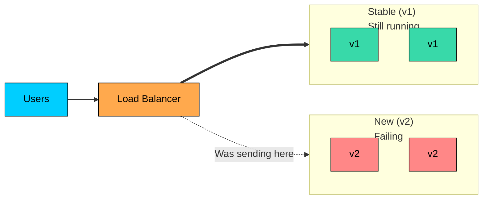
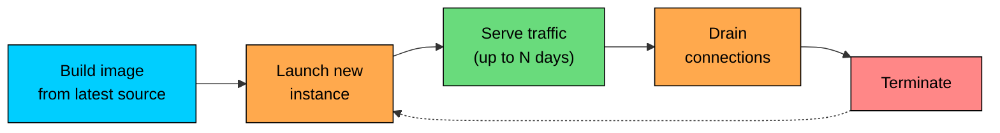

A **rollback** moves a system from a broken state back to a known good state. **Immutable infrastructure** is the practice of building infrastructure once and never modifying it in place, so that "a known good state" exists as a concrete artifact the team can return to.

In a mutable world, "rolling back" means trying to undo changes on a running server: config files edited, packages upgraded, months of accumulated state both intentional and accidental. The pre-change state exists only as a memory. In an immutable world, rolling back is deploying an older artifact from a registry and shifting traffic away from the new one. It is a controlled action, not a recovery effort.

---

# 1. The Two Models

The contrast between mutable and immutable infrastructure is sharp once seen.

| Aspect | Mutable | Immutable |
|--------|---------|-----------|
| **Server provisioning** | Provision once, modify in place over time | Re-provision from scratch for every change |
| **Updates** | `apt upgrade`, edit configs, restart services | Build a new image, replace the old instances |
| **Configuration drift** | Inevitable; every server slightly different | Avoided; servers are identical by construction |
| **Debugging** | "What changed on this box"" requires audit logs and luck | "Which artifact is this"" answered by a tag |
| **Rollback** | Reverse the changes (often impossible) | Deploy the previous artifact |
| **State on the server** | Persists across changes | Treated as ephemeral; persistent state lives elsewhere |

The shift from mutable to immutable was driven by container images, infrastructure-as-code tools, and the realization that "pets" (carefully maintained servers with unique identities) scale badly compared to "cattle" (interchangeable servers built from the same template).

A useful test: if you SSH into a production server and change something to fix a problem, you are in a mutable system. If the only way to change a production server is to deploy a new version, you are in an immutable one.

---

# 2. What Immutable Infrastructure Means in Practice

Immutable infrastructure has a few concrete properties:

- **Build once, deploy many.** The artifact is built once and the same bits move through every environment. Differences come from configuration injected at runtime, not from separate builds. The idea extends from "the application code is the same" to "the entire server image is the same."
- **Replace, don't modify.** A configuration change is a new artifact and a new deployment. No `ssh server && edit config && systemctl restart`. Every change goes through the pipeline, adding friction but removing risk.
- **Server lifetime is bounded.** Servers do not live forever. Some teams replace every server every 7 days regardless. If a server cannot be replaced cleanly after a week, that brokenness gets discovered fast. Container orchestrators implement this implicitly.
- **State lives elsewhere.** Immutable servers cannot hold persistent state because it vanishes on replacement. State lives in databases, object stores, caches, queues. Stateful workloads need their own strategies; they cannot just be "another immutable container."

---

# 3. Why Rollback is a First-Class Operation

Rollback gets less attention than deploy, and that asymmetry is the source of many incidents. When a deploy goes wrong, the team has to realize something is broken, identify the new version as the cause, choose a remediation (rollback, roll forward, or accept), execute it, and verify recovery. If rollback is reliable, the choice is easy and execution is fast; if not, the team is forced to debug under pressure or accept extended impact.

A rollback path that "should work" but has not been tested is a hope, not a procedure.

---

# 4. Rollback as a Traffic Decision

In mature systems, rollback is not "redeploy the old version." It is "shift traffic to instances already running the old version."

In a **blue-green deployment**, rollback is a router change. The blue environment is still warm; flipping the load balancer back is a configuration update that takes seconds.

In a **canary release**, rollback shifts traffic away from the canary slice. The stable fleet is already serving the rest of the traffic; the canary just stops getting promoted. Many platforms automate this: if golden signals cross a threshold, the canary is automatically halted and traffic re-shifts to stable.

In a **rolling deployment**, rollback is another rolling deploy, this time toward the previous version. It takes minutes because the fleet has to be replaced again, but the old artifact is still in the registry and the deploy mechanics are well-rehearsed.

In all three cases, the previous version exists as something the system can return to. The immutable artifact in the registry, plus the deploy machinery that put it there, equals a reliable rollback path.

---

# 5. The Two Failure Modes

The classic distinction in incident response is **roll back** vs **roll forward**.

Roll back is the default for most service-level incidents: return to the previous known-good version when the cause is clearly the new version, the previous version was working, and the schema and data state allow it (no destructive migration in between).

Roll forward ships a fix on top of the new version. Best when the previous version is also broken in a different way, a schema change has made rollback impossible, a small fix is ready quickly, or rolling back would discard data accumulated on the new version. It takes longer but leaves the system on the latest version with a clean fix rather than regressing.

| Signal | Lean toward |
|--------|-------------|
| Severity climbing fast | Roll back |
| Cause clearly identified | Roll back |
| Schema migration in between | Roll forward |
| Fix is small and tested | Roll forward |
| Confidence in the fix is low | Roll back |
| Previous version had its own bugs | Roll forward |

Mature teams default to rollback because it is fast and reversible. Roll-forward is a deliberate choice for cases where rollback would be worse.

---

# 6. The Rollback Path

A reliable rollback path has several properties:

- **The previous artifact exists.** Keep at least the last N production-shipped artifacts in the registry. N = 10-30 covers normal operation.
- **The deploy mechanism works in reverse.** The same pipeline that deploys v2 deploys v1, accepting an artifact identifier. No "rollback mode" is required; rollback is a deploy aimed at an older artifact. The pipeline must not have implicit dependencies on the current version.
- **The database schema is compatible.** If v1 and v2 use the same schema (or v2's schema is backward compatible with v1), rolling back is a deploy. If not, rolling back the code is not enough. This is why **expand-contract** matters: splitting schema changes into stages where both code versions coexist with the database keeps every step rollback-safe.
- **Data written by the new version stays.** Rolling back to v1 does not undo bad data v2 wrote. Data cleanup is a separate operation after the system is stable.
- **In-flight operations complete.** The same draining and graceful shutdown discipline applies in both directions.
- **The rollback is practiced.** A rollback that has never been exercised is not actually fast. Periodic "rollback drills" in production-like environments make sure the first real rollback is the team's tenth, not first.

---

# 7. Versioned Artifacts and Atomic Deploys

Two properties make rollback meaningful. **Versioned artifacts** have unique, immutable identifiers (commit hash plus build number); once tagged, never overwritten, so `v1.42.3` always means the same thing. **Atomic deploys** mean each instance is running exactly one artifact, not a partial application of v2 on top of v1. The fleet may be mixed for a few minutes during a rolling deployment, but no single instance is in a state nobody designed.

This is the difference between an immutable deploy and a config-management deploy. With Chef or Puppet on long-lived servers, a partial run can leave a server in an undesigned state. With container images on Kubernetes, the container is running either the new image or the old one.

---

# 8. Configuration vs Code

Is a configuration change a deploy" In a strict immutable system, yes: configuration is part of the artifact's input and a change goes through the pipeline like code. In looser systems, configuration is fetched at runtime from a dynamic config service. That is faster but introduces a failure mode where a bad config change can take down the fleet without showing up as a deploy in the audit log.

A practical hybrid: config that affects safety (connection strings, feature flag defaults, security settings) follows the deploy path; config that affects tuning (rate limits, retry counts, cache TTLs) is dynamic with audit logs and rollback; feature flags have their own evaluation system and rollback path. Anything that, if wrong, takes down production goes through the deploy path.

---

# 9. Infrastructure as Code

The immutable idea extends to the infrastructure under the application. Infrastructure-as-code tools (Terraform, Pulumi, CloudFormation, Crossplane) describe cloud resources declaratively and reconcile live state with the declared state. Changes go through code review, produce an inspectable plan, and roll back by reverting the code and running the tool again.

The reality is messier than the ideal: some cloud resources are not cleanly reversible (deleting a load balancer kills its IP), some changes are slow (twenty minutes for a managed database update). But the direction is the same: infrastructure as immutable artifacts with a defined rollback path.

---

# 10. Phoenix Servers

Named for the mythological bird that burns and is reborn, a **phoenix server** is a server that is periodically destroyed and rebuilt from scratch. The pattern enforces immutability through routine destruction.

The discipline:

1. Every production server has a creation timestamp.
2. Servers older than a defined age (say, 7 days) are automatically terminated.
3. The orchestrator replaces them with fresh instances built from the latest image.

The benefits:

- **No accumulated state.** Whatever drift has crept in during a week is gone.
- **Forced testability of provisioning.** If the build pipeline breaks, server replacement breaks, and someone notices fast.
- **Hardened against gradual rot.** Memory leaks, file system buildup, log rotation issues all reset.

The downside is the operational cost: more deploys, more cold starts, more cycling. For high-reliability services, the trade is worth it; for very small fleets, it can be overkill.

Phoenix servers are most natural in container orchestrators where the lifecycle is short anyway. Long-lived VMs are harder to retire cleanly without specialized tooling.

---

# 11. Snapshots and Backups

Immutable infrastructure shifts where state lives, but it does not eliminate state. Databases, object stores, and persistent caches all need their own rollback paths.

The standard mechanism is **snapshots**: point-in-time copies of stateful resources.

- **Database snapshots.** Most managed databases automatically snapshot daily and provide point-in-time recovery for the last 7-35 days.
- **Volume snapshots.** Persistent disks (EBS, Persistent Disk) can be snapshotted on a schedule.
- **Object store versioning.** S3 and similar services can keep multiple versions of every object.

These are different from artifact rollback. Artifact rollback restores the compute. Snapshot restore restores the data. They are independent operations and might be needed together for severe incidents.

A useful drill: every team should know how long it takes to restore from the most recent snapshot, and whether the restored state would be acceptable. "We can restore in 4 hours and lose up to 1 hour of data" is a different posture than "we can restore in 20 minutes and lose 5 minutes of data."

---

# 12. Failure Modes

- **The rollback that never worked.** Untested. Previous artifact garbage collected or deploy mechanism refuses an older version. Practice rollback; keep artifact retention long enough.
- **Configuration drift survives the rollback.** An out-of-band config change made during the incident sticks around after the code reverts. Capture all configuration as code; roll it back with the artifact.
- **Schema migration blocks rollback.** The new code shipped a schema change the old code cannot handle. Use expand-contract; never combine a schema-breaking migration with a code change.
- **Data written by the new version causes errors after rollback.** The old version reads records in the new shape and fails. Keep the read path tolerant or design the new shape to be backward compatible.
- **Rollback is too slow.** A 45-minute pipeline rollback is too slow for a critical service. Use blue-green or canary traffic shift for seconds-scale rollback.
- **Mutation crept in.** SSH access, manual edits, and "small fixes" outside the pipeline mean production state does not match the artifact. Remove SSH access from production; treat out-of-band changes as incidents.
- **No plan for stateful components.** Databases, queues, and persistent caches are not immutable. Have separate rollback plans for code, configuration, schema, and data.

---

---

# Summary

Immutable infrastructure and reliable rollback are two sides of the same idea: production should be a state the team can navigate confidently in both directions.

#### **Key takeaways:**

1. **Immutable infrastructure means building once and replacing, not modifying in place.** Servers become interchangeable; the previous state is always a real place to return to.
2. **Rollback is a first-class operation.** Treat it with the same care as deployment.
3. **In mature systems, rollback is a traffic decision, not a redeploy.** Blue-green and canary make rollback a matter of seconds.
4. **Roll back vs roll forward depends on the situation.** Schema state, data integrity, and confidence in the fix all factor in.
5. **A reliable rollback path requires versioned artifacts, atomic deploys, schema compatibility, and practice.**
6. **Configuration follows the deploy path when safety matters.** Dynamic configuration only with audit and rollback.
7. **Infrastructure as code extends immutability to the platform.** Phoenix servers force replaceability by destroying servers on a schedule.
8. **Stateful components need their own rollback plan.** Snapshots and point-in-time recovery are not artifact rollback.
9. **The discipline is harder than the technology.** SSH access, out-of-band changes, and ignored schema constraints all undermine immutability.

A system that can be rolled back in seconds is a system that can be deployed in confidence. Investing in the rollback path pays back the first time a deploy goes wrong, and every time after that.

---

# Quiz
