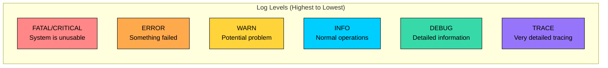
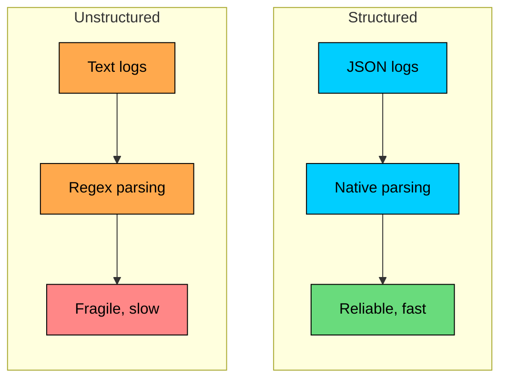
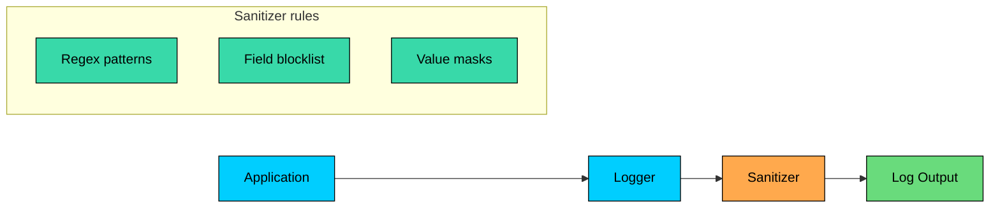
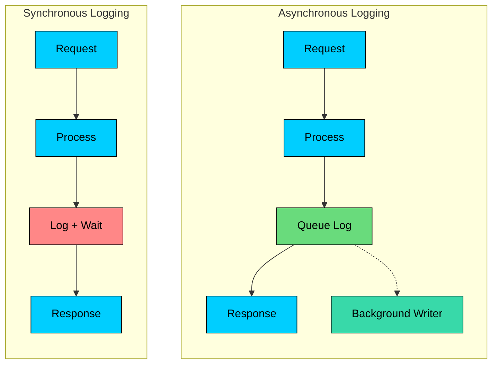
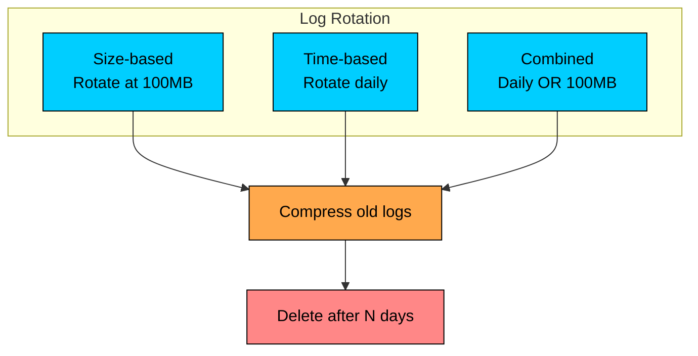

Logging records meaningful events from a running system so engineers can understand what happened during normal operation, failures, and investigations.

In production systems, useful logs need context, structure, safe handling of sensitive data, and consistent fields across services. Without those qualities, logs become noisy text rather than operational evidence.

In this chapter, you will learn how to choose log levels, include useful context, use structured logs, avoid common mistakes, and keep logging efficient at scale.

---

# Log Levels

Log levels categorize messages by importance. Using them well is the foundation of useful logging, because levels decide what gets stored, what gets alerted on, and what gets ignored.

### The Standard Levels



| Level | When to Use | Example | Production Setting |
|-------|-------------|---------|-------------------|
| **FATAL** | System cannot continue, immediate attention required | Database connection lost | Always logged |
| **ERROR** | Operation failed, needs investigation | Payment processing failed | Always logged |
| **WARN** | Something unexpected, but system continues | Retry succeeded after failure | Always logged |
| **INFO** | Normal business events worth recording | Order placed, job completed | Usually logged |
| **DEBUG** | Detailed information for debugging | SQL query executed, cache hit/miss | Disabled in production |
| **TRACE** | Very fine-grained tracing | Entering/exiting methods, loop iterations | Rarely used |

### Choosing the Right Level

The most common mistake is overusing ERROR and underusing WARN.

**Bad Example:** Logging expected conditions as ERROR

Ask yourself: **“Should this wake someone up at 2 AM"”** If yes, it is usually **ERROR** or **FATAL**. If no, it is probably **WARN** or lower.

> 💡 **Key Insight:**

> **NOTE**
>
> ERROR logs should be actionable. If you cannot do anything about it, it probably should not be an ERROR.

### Level Selection Guide

```mermaid
flowchart TD
    Start[Something happened]:::primary --> Q1{Did an operation fail"}:::yellow
    Q1 --> |Yes| Q2{Can the system continue"}:::yellow
    Q1 --> |No| Q3{Is it unexpected"}:::yellow

    Q2 --> |No| FATAL[FATAL]:::red
    Q2 --> |Yes| ERROR[ERROR]:::orange

    Q3 --> |Yes| WARN[WARN]:::yellow
    Q3 --> |No| Q4{Is it a significant<br/>business event"}:::yellow

    Q4 --> |Yes| INFO[INFO]:::primary
    Q4 --> |No| DEBUG[DEBUG]:::teal

    classDef red fill:#ff8787,stroke:#000,color:#000
    classDef orange fill:#ffa94d,stroke:#000,color:#000
    classDef yellow fill:#ffd43b,stroke:#000,color:#000
    classDef primary fill:#00ceff,stroke:#000,color:#000
    classDef teal fill:#38d9a9,stroke:#000,color:#000
```

---

# What to Log

A log message is only useful if it contains enough information to understand what happened. The goal is simple: someone should be able to read one log line and immediately know what it means, what it affects, and what to do next.

### The Essential Elements

Every log entry should answer these questions:

### Good vs Bad Log Messages

#### Bad: vague and unhelpful

#### Good: specific and actionable

### The Context Checklist

Before writing a log statement, ask: **“If I saw only this log line, would I understand what happened"”**

Always include identifiers such as `user_id`, `order_id`, `correlation_id`, or `request_id` when they apply. Add values like amount or size when relevant, state such as status or retry count during state changes, error details for failures, timing fields for performance-related events, and source details for external interactions.

### Including the Right Amount of Context

**Too little context makes logs useless:**

**Too much context creates noise:**

**Just right:**

Include what you need to debug, nothing more.

---

# Structured Logging

Structured logging means writing logs in a machine-parseable format, typically JSON, rather than plain text.

### Why Structured Logging Matters



With **unstructured** logs, you end up treating logs like text files: parsing with regex, maintaining rules for every format variation, and risking broken dashboards or alerts after small wording changes.

With **structured** logs, logs behave like data through native JSON parsing, consistent fields across services, and reliable filtering.

#### **Unstructured log:**

Parsing this requires regex. Different log formats require different regex patterns. Slight format changes break your parsers.

#### **Structured log:**

Now you can query large orders with `event.name=order_placed AND amount>100`, all activity for a user with `user_id=789`, or order service errors with `service.name=order-service AND level=ERROR`.

### Structured Logging Format

Use consistent field names across all services:

| Field | Type | Description | Required |
|-------|------|-------------|----------|
| `timestamp` | ISO 8601 | When the event occurred | Yes |
| `level` | string | Log level (INFO, ERROR, etc.) | Yes |
| `service.name` | string | Name of the service | Yes |
| `event.name` | string | What happened (snake_case) | Yes |
| `message` | string | Human-readable description | Optional |
| `trace_id` | string | Distributed trace ID | When available |
| `span_id` | string | Span that emitted the log | When available |
| `correlation_id` or `request_id` | string | Request or support correlation ID | When available |
| `user_id` | string | User identifier | When relevant |
| `error_code` | string | Error classification | For errors |
| `duration_ms` | number | Operation duration | For timed operations |

### Implementation Example

Most languages have good structured logging support. The main idea is the same: log an event name and attach key-value context.

Once your logs are structured, you can filter, group, and correlate across services without fighting formatting.

---

# Logging Sensitive Data

One of the biggest logging risks is accidentally exposing sensitive information. Logs get shipped to central systems, copied into tickets, and shared across teams. If a secret lands in logs, assume it will leak.

### What Not to Log

Never log passwords, API keys, secrets, credit card numbers, government identifiers, full session tokens, refresh tokens, JWTs, or personal health information. Treat email addresses, phone numbers, and IP addresses carefully; depending on policy and regulation, they may need masking or exclusion.

### Masking Techniques

When you need to reference sensitive data for debugging, log the minimum needed for correlation.

#### Bad (exposing full values):

#### Good (masked for safety):

### Automatic Sanitization

Do not rely on developers remembering to redact every time. Add sanitization to the logging pipeline so it happens by default.



Typical controls include field blocklists for keys like `password`, `token`, `authorization`, and `api_key`, value masks for safe partial reveals, and regex detection for secrets embedded in free-text logs.

Useful detection patterns include credit card numbers like `\b\d{4}[\s-]"\d{4}[\s-]"\d{4}[\s-]"\d{4}\b`, API keys like `(api[_-]"key|secret)[=:]\s*\w+`, passwords in URLs like `password=\w+`, and bearer tokens like `Bearer\s+\w+`.

---

# Performance Considerations

Logging is not free. In high-throughput systems, even “small” logging overhead can become a real performance and cost problem.

### The Cost of Logging

```mermaid
flowchart LR
    Log[Log Statement]:::primary --> Format[String Formatting]:::orange
    Format --> Serialize[Serialization]:::orange
    Serialize --> Write[I/O Write]:::red
    Write --> Sync{Sync"}:::yellow
    Sync --> |Yes| Flush[Disk Flush]:::red
    Sync --> |No| Buffer[Buffer]:::green

    classDef primary fill:#00ceff,stroke:#000,color:#000
    classDef yellow fill:#ffd43b,stroke:#000,color:#000
    classDef orange fill:#ffa94d,stroke:#000,color:#000
    classDef red fill:#ff8787,stroke:#000,color:#000
    classDef green fill:#69db7c,stroke:#000,color:#000
```

A typical log line can trigger string formatting, JSON serialization, memory allocations, and I/O to disk or the network. The expensive part is almost always **I/O**, especially if it happens on the request thread.

### Performance Best Practices

#### 1. Use lazy evaluation

Do not compute expensive values if the log will not be written.

**Bad (always computes expensive data):**

**Good (only computes if debug is enabled):**

**Better (let the framework defer evaluation when supported):**

#### 2. Use async logging

Synchronous logging can block request processing while waiting for disk or network.



With synchronous logging, the request waits while the log is written. With asynchronous logging, the request enqueues the log and returns while a background thread writes to disk or ships over the network.

Async logging queues log messages and writes them in a background thread. This prevents I/O from blocking request processing.

#### 3. Pick the right production log level

Use DEBUG or TRACE in development, DEBUG in staging, INFO as the normal production default, and temporary scoped DEBUG during incidents.

A common practice is “INFO by default, DEBUG on demand,” with a time limit and scope (specific service, endpoint, or user) so you do not drown in noise.

#### 4. Sample high-volume events

For events that happen constantly (cache hits, heartbeats), log only a sample.

**Probabilistic sampling (1%):**

**Deterministic sampling (every 1000th event):**

If you want accurate counts, do not rely on logs for that. Use **metrics** (counters, histograms) and keep logs for context.

### Rough performance impact (ballpark)

These numbers vary by language, hardware, and logging pipeline, but they help build intuition. Synchronous disk logging can add 1-10ms per log because it blocks the request, asynchronous disk logging is often below 0.1ms per log, synchronous network logging can add 5-50ms, JSON serialization often costs 0.01-0.1ms, and simple string formatting is usually much cheaper.

At **10,000 requests/sec**, even **0.1ms** of extra overhead per request adds up fast. That is roughly **1 second of CPU time per second**, just for logging work.

The goal is not “log less.” It is “log smarter”: correct levels, structured context, async I/O, and sampling where needed.

---

# Common Logging Mistakes

Avoid these patterns that make logs less useful:

### 1. Logging Without Context

### 2. Inconsistent Formats

### 3. Excessive Logging

### 4. Swallowing Exceptions

### 5. Log Message in Code, Context in Exception

---

# Log Rotation and Retention

Logs consume disk space. If you do not manage them, they will eventually fill the disk and take your service down in the most avoidable way.

### Rotation Strategies

Rotation means closing the current log file and starting a new one on a schedule.



The most common strategies are size-based rotation when a file reaches a limit such as 100MB, time-based rotation on a schedule such as daily at midnight, or a combined policy that rotates when either condition is met.

After rotation, it is common to compress older files with gzip and delete logs after a retention window.

### Retention Guidelines

Retention depends on what the logs are used for and whether compliance applies.

| Log Type | Retention | Reason |
|----------|-----------|--------|
| Application logs | 7-30 days | Debugging recent issues |
| Access logs | 30-90 days | Traffic analysis, security |
| Audit logs | 1-7 years | Compliance requirements |
| Security logs | 1-7 years | Incident investigation |
| Debug logs | 1-7 days | Short-term debugging |

**Tip:** keep long-term logs in cheaper storage (object storage) and keep hot logs in the logging system for fast search.

---

# Summary

Effective logging requires intentional design. Log levels control importance, context makes entries useful, structured JSON makes logs searchable, sanitization protects sensitive data, async I/O and lazy evaluation keep overhead manageable, and rotation plus retention prevent logs from becoming a reliability problem.

Before adding a log, ask whether it would help during an incident. Prefer structured fields, include correlation identifiers where useful, avoid sensitive data, and sample high-frequency events instead of logging everything.

---

# Quiz
