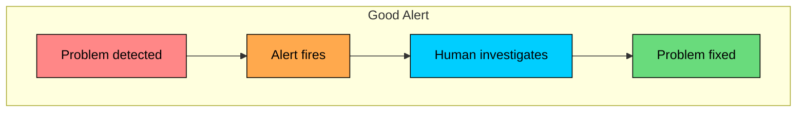
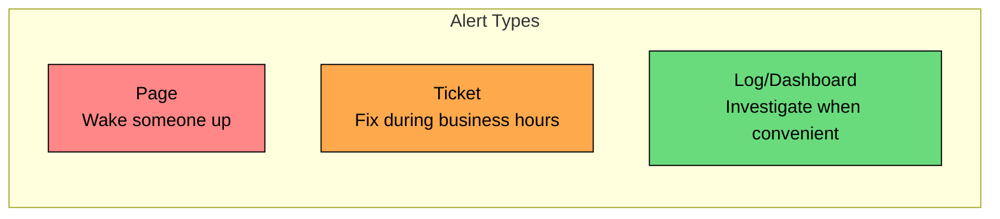
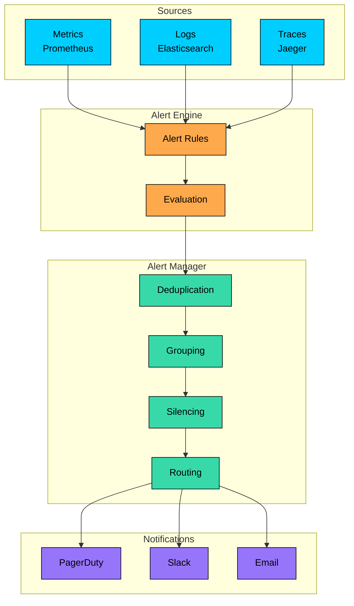
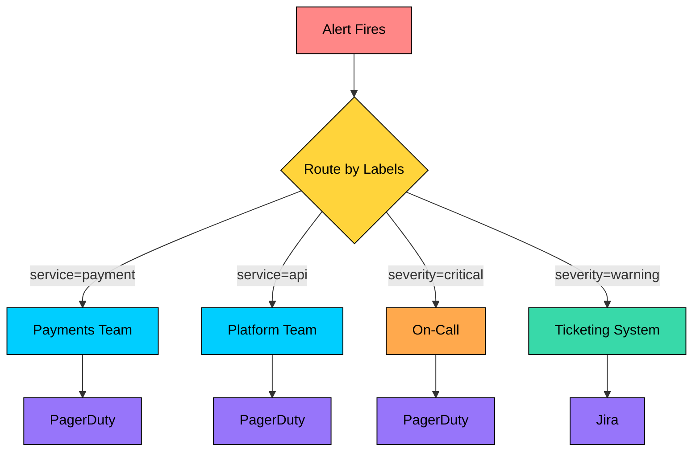
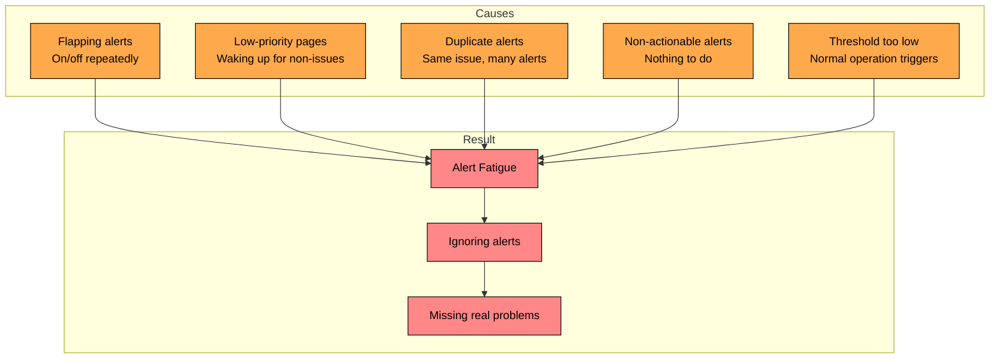
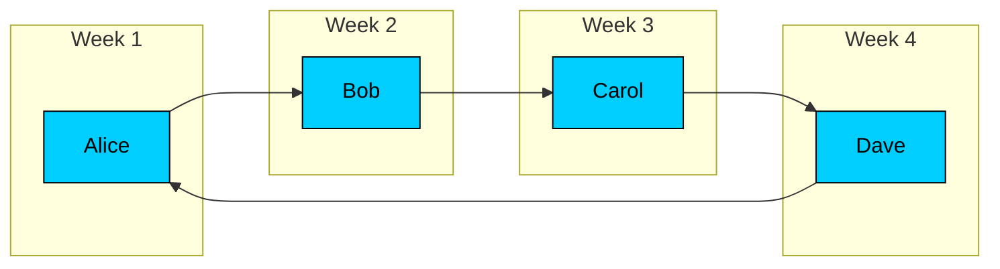
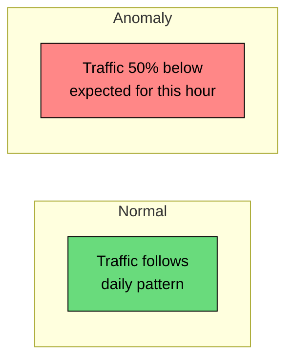

Alerting turns important observability signals into timely notifications when a system needs human attention.

In production systems, alerting must balance detection with noise. Too few alerts miss problems, too many alerts create fatigue, and poorly defined alerts fire during normal operation instead of pointing to actionable issues.

In this chapter, you will learn how to design actionable alerts, route and escalate them, reduce alert fatigue, and support healthy on-call response.

---

# The Purpose of Alerting

> [!PAYWALL] This content is for premium members only.

Alerts serve one purpose: to get human attention when automated systems cannot handle a problem.

### When to Alert

Alert when users are impacted or will be impacted soon, automated remediation failed or is not possible, and human judgment is required. Do not alert when the system can fix itself, nothing can be done until business hours, or the information is interesting but not actionable.

### The Alert Spectrum

| Severity | Response Time | Examples |
|----------|--------------|----------|
| **Page** | Minutes | Service down, high error rate, data loss |
| **Ticket** | Hours to days | Disk 80% full, certificate expiring in 7 days |
| **Log only** | When convenient | Performance degradation, unusual patterns |

**Interview Insight:** When discussing alerting, emphasize that every page-level alert must be actionable. If you are waking someone up, they must be able to do something about it immediately.

---

# Designing Good Alerts

A good alert has these characteristics:

### 1. Actionable

Every alert must require human action. If the recipient cannot do anything, it should not be an alert.

### 2. Relevant

Alert on symptoms (user impact) rather than causes (system metrics):

### 3. Clear

The alert message should explain what is wrong:

### 4. Timely

Alert early enough to prevent user impact, but not so early that it creates false positives:

### Alert Message Format

Include these elements in every alert:

Example:

---

# Alerting Architecture

A typical alerting system has several components:

### Alert Rules

Rules define when to alert based on metrics:

### Alert Manager

The alert manager processes firing alerts:

**Deduplication:** Same alert firing multiple times becomes one notification

**Grouping:** Related alerts are grouped together:

**Silencing:** Temporarily suppress alerts during maintenance

**Routing:** Send alerts to the right team based on labels

---

# Alert Routing and Escalation

Different alerts go to different teams through different channels.

### Routing Rules

### Routing Configuration Example

### Escalation

If an alert is not acknowledged within a time window, escalate to backup:

Escalation ensures critical alerts do not go unnoticed if the primary responder is unavailable.

---

# Alert Fatigue

Alert fatigue is when too many alerts cause responders to ignore them. This is dangerous because real problems get missed.

### Causes of Alert Fatigue

### Measuring Alert Health

Track these metrics for your alerting system:

| Metric | Target | Meaning |
|--------|--------|---------|
| **Alerts per week** | <20 per person | Volume is manageable |
| **False positive rate** | <10% | Most alerts are real |
| **Time to acknowledge** | <5 min for critical | Alerts are being seen |
| **Alerts per incident** | <3 | Good grouping |
| **Flapping alerts** | 0 | Stable thresholds |

### Reducing Alert Fatigue

**1. Raise thresholds**

If an alert fires frequently without user impact, the threshold is too low:

**2. Add duration requirements**

Brief spikes are often normal:

**3. Alert on symptoms, not causes**

Users care about errors, not CPU:

**4. Implement auto-remediation**

If a problem can be fixed automatically, do not page:

**5. Group related alerts**

One incident should generate one notification:

---

# On-Call Best Practices

On-call is the practice of having engineers available to respond to alerts outside business hours.

### On-Call Rotation

Healthy rotations share the burden weekly, include primary and secondary coverage, allow shift swaps for personal needs, and compensate on-call time through time off or pay.

### On-Call Responsibilities

During on-call shifts, responders acknowledge pages within SLA, investigate and mitigate issues, escalate when needed, and document incidents.

### Reducing On-Call Burden

Reducing on-call burden means fixing recurring alerts, improving automation, writing better runbooks, using post-incident reviews to prevent recurrence, and keeping thresholds reasonable so responders are not paged for noise.

### On-Call Health Metrics

| Metric | Healthy | Action Needed |
|--------|---------|---------------|
| **Pages per shift** | <5 | Investigate if higher |
| **Night pages** | <2 per month | Prioritize fixing |
| **MTTR** | <30 min | Improve runbooks |
| **Escalations** | <10% | Training or coverage |

---

# Common Alerting Patterns

### Pattern 1: Symptom-Based Alerting

Alert on what users experience, not internal metrics:

### Pattern 2: Multi-Window Alerting

Use different windows for different severities:

Short windows catch severe problems fast. Long windows avoid false positives.

### Pattern 3: Burn Rate Alerting

Alert based on how fast you are consuming error budget (covered in SLO chapter):

### Pattern 4: Anomaly Detection

Alert when metrics deviate from normal patterns:

This is useful for detecting traffic drops that threshold alerts often miss, catching unusual patterns, and monitoring services with variable baselines.

---

# Common Alerting Anti-Patterns

### Anti-Pattern 1: Alert on Every Metric

### Anti-Pattern 2: Immediate Alerts

### Anti-Pattern 3: Binary Thresholds

### Anti-Pattern 4: Alerting Without Runbooks

### Anti-Pattern 5: Silencing Instead of Fixing

---

# Summary

Alerting transforms observability data into action. Good alerts are actionable, relevant, clear, timely, focused on user-facing symptoms, and packaged with enough context to start investigation quickly.

Alert management keeps response sane through deduplication, grouping, routing, and escalation. Alert fatigue is reduced by tuning thresholds, adding duration requirements, fixing noisy alerts, using auto-remediation where appropriate, and tracking alert health. Healthy on-call practice depends on fair rotation, clear SLAs, incident documentation, review, and continuous improvement.

---

# Quiz
