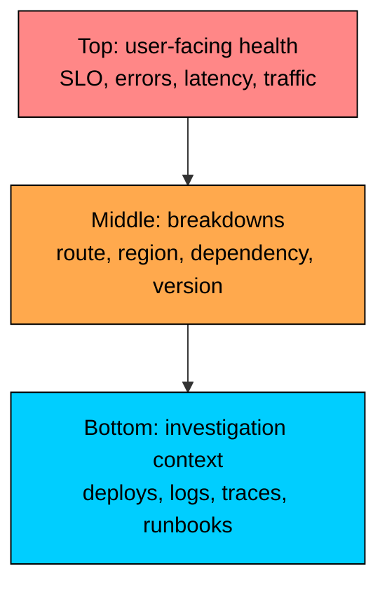
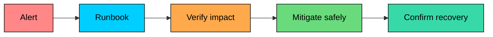
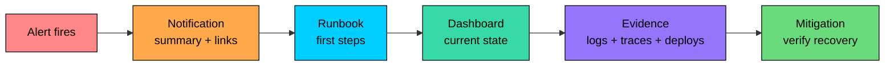

Dashboards organize observability data for decision-making, and runbooks turn operational knowledge into repeatable response steps.

During incident response, responders need dashboards that show what is broken, who is affected, and what changed. They also need runbooks that explain how to verify impact, narrow the cause, mitigate safely, and escalate.

In this chapter, you will learn how to design dashboards and runbooks that guide incident response from alert to evidence, mitigation, verification, and maintenance.

---

# Dashboard Hierarchy

> [!PAYWALL] This content is for premium members only.

Dashboards should follow the way engineers investigate incidents. Start with user-visible health, then drill into services, dependencies, and infrastructure.

```mermaid
flowchart TB
    L1["Level 1: Product / SLO Overview<br/>Are users affected""]:::primary
    L2["Level 2: Service Health<br/>Which service is off""]:::orange
    L3["Level 3: Service Detail<br/>What changed in this service""]:::teal
    L4["Level 4: Dependency / Component<br/>Which dependency explains it""]:::purple

    L1 --> L2 --> L3 --> L4

    classDef primary fill:#00ceff,stroke:#000,color:#000
    classDef orange fill:#ffa94d,stroke:#000,color:#000
    classDef teal fill:#38d9a9,stroke:#000,color:#000
    classDef purple fill:#9775fa,stroke:#000,color:#000
```

The hierarchy matters. Many teams start with CPU, memory, and pod counts because those metrics are easy to collect. That is backwards. Users do not care if a pod has high CPU unless the product is slow, unavailable, or wrong.

Start with symptoms. Drill into causes.

### Level 1: Product and SLO Overview

This is the first screen during an incident. It answers: **Are users affected, and how badly"**

It should fit on one screen and show user-facing outcomes:

This view should focus on SLOs and user journeys, show current values beside targets, include recent deploys and configuration changes, and link to the service dashboards behind the affected journey. Low-level internals belong here only when they explain user impact.

This dashboard is useful for engineering, support, customer success, and incident command. It should not require deep system knowledge to read.

### Level 2: Service Health

Once you know users are affected, the next question is: **Which service looks abnormal"**

Service health dashboards should compare services using consistent metrics and units.

For request-serving services, the core view is usually the RED method: rate for request volume, errors for failed requests, and duration for latency distribution. For resource pools and infrastructure, use the USE method: utilization, saturation, and errors.

This dashboard should make outliers obvious. If every service has a custom layout and different definitions, responders waste time translating dashboards instead of debugging.

### Level 3: Service Detail

After identifying a suspect service, zoom in and ask: **What changed inside this service"**

Good service dashboards show both symptoms and likely explanations. They also include change markers. During incidents, "what changed"" is one of the highest-value questions.

For AI-facing services, include domain-specific signals where they affect reliability, such as model provider error rate, time to first token, generation latency, token throughput, context length distribution, safety filter rejects, fallback model usage, embedding cache hit rate, retrieval latency, and empty-result rate.

Do not bury these signals in a generic "AI dashboard." If the model gateway is part of checkout, its health belongs in the checkout investigation path.

### Level 4: Dependency and Component Detail

When a trace, log query, or service dashboard points to a dependency, use a narrower dashboard.

Common examples include database clusters, Redis or Memcached, Kafka topics and consumer groups, search clusters, object storage, payment providers, LLM providers, vector databases, and retrieval pipelines.

Component dashboards are not where responders should start. They are where responders go after the symptom dashboard points at a likely cause.

---

# Dashboard Design Principles

Good dashboards are decision tools. They answer a specific question with enough context to choose the next action.

### 1. One Dashboard, One Job

Every dashboard should have a clear purpose.

Good dashboards answer questions like "Is checkout meeting its SLO right now"", "Why is payment-api returning errors"", or "Is Kafka consumer lag causing delayed notifications"" Weak dashboards have vague purposes like "All production metrics", "Everything about payments", or "Useful graphs."

If a dashboard cannot be described in one sentence, split it.

### 2. Put User Impact First

Put the most important signals at the top: availability, error rate, latency percentiles, SLO burn rate, request volume, and successful business operations.

CPU, memory, garbage collection, thread pools, and pod restarts matter, but they are usually explanatory signals. They should not be the first thing an on-call engineer sees unless the dashboard is specifically for infrastructure.



### 3. Use Consistent Metric Definitions

Dashboards fail when teams use the same word for different measurements.

Define error counting, latency percentiles, retry handling, cancelled requests, HTTP 4xx semantics, synthetic traffic, and health-check filtering consistently.

Use shared labels and resource attributes such as `service.name`, `service.version`, `deployment.environment.name`, `region`, `http.route`, and `http.response.status_code`. Consistent naming makes dashboards reusable across services and teams.

### 4. Show Context, Not Just Lines

A line chart without context forces responders to guess.

Add context such as SLO lines, alert thresholds, deployment annotations, configuration changes, feature flag changes, incident markers, comparisons with previous periods, and normal baseline bands.

The point is not to make graphs busier. The point is to make the first explanation visible.

### 5. Choose Time Ranges Deliberately

Different workflows need different defaults.

| Dashboard Type | Default Range | Typical Resolution |
|----------------|---------------|--------------------|
| Live incident response | 30 minutes to 2 hours | seconds to 1 minute |
| Service investigation | 6 to 12 hours | 1 to 5 minutes |
| Daily operations review | 24 to 48 hours | 5 to 15 minutes |
| Weekly reliability review | 7 to 14 days | 1 hour |
| Capacity planning | 30 to 180 days | hours to days |

Short ranges show spikes. Long ranges show trends. Neither is "correct" in isolation.

### 6. Avoid Dashboard Theater

A wall of graphs can look impressive and still be useless.

Common problems include unused panels, unowned metrics, permanent "no data" panels, charts without thresholds, latency averages instead of percentiles, high-cardinality breakdowns that time out, inconsistent service dashboard layouts, and dashboards that load too slowly during incidents.

Remove charts that do not drive decisions. Signals collected but never used in dashboards, alerts, or investigations are candidates for removal or lower retention.

### 7. Link Panels to Evidence

A dashboard should not be a dead end.

Useful panel links include logs filtered to the same service and time range, traces for the same route or exemplar, deployment diffs, release notes, feature flag history, dependency status pages, owner information, escalation channels, and the runbook tied to the alert.

The responder should be able to move from symptom to evidence without searching through five tools.

---

# Building Effective Graphs

### Choose the Right Visualization

| Data | Good Visualization | Avoid |
|------|--------------------|-------|
| Time series | Line chart | Pie chart |
| Current status | Stat panel, table, status grid | Dense line chart |
| Latency distribution | Histogram, heatmap, percentile lines | Average-only line |
| Top offenders | Bar chart, sorted table | Unsorted table |
| Error composition | Stacked area or table | Pie chart with many slices |
| Dependency map | Service map plus drill-down links | Static architecture diagram |

Visualization choice should make the next question obvious.

### Latency: Prefer Percentiles and Histograms

Averages hide tail latency. If ten requests complete in 50ms and one takes 10 seconds, the average may look acceptable while a real user is stuck.

Show p50 for the typical request, p95 or p99 for user pain, histograms or heatmaps when distribution shape matters, and separate latency by route or operation when different paths have different expectations.

Do not average percentiles across instances. Use histogram-based aggregation where your metrics backend supports it.

### Error Rate: Separate Expected From Unexpected

Not all errors mean the same thing.

Separate HTTP 5xx from HTTP 4xx, dependency timeouts from validation failures, user cancellations from server failures, model provider errors from safety filter rejections, and retryable failures from terminal failures.

If every non-2xx response is shown as one error line, the dashboard will mislead responders.

### Saturation: Show Queues and Limits

Many incidents are saturation incidents: exhausted connection pools, growing worker queues, increasing Kafka consumer lag, saturated thread pools, reached rate limits, or maxed-out GPU and model-serving concurrency.

For saturation, show both current usage and the limit. "850 active connections" is only meaningful if the safe limit is visible.

### Avoid Misleading Axes

Use axes that match the question. Start at zero when comparing magnitudes, use narrow ranges only when small changes matter and the panel makes that clear, keep units consistent across related panels, and avoid dual y-axes unless there is no better option.

Dashboards should build trust. If engineers learn that graphs exaggerate, they stop relying on them.

---

# What Are Runbooks"

A runbook is a step-by-step operational guide for a known alert, task, or failure mode.

It should help a responder confirm the alert, determine user impact and severity, check likely causes, apply safe mitigations, escalate with the right context, verify recovery, and record what happened.



Runbooks are not architecture documents. They are operational procedures. Background context belongs below the action path or in linked design docs.

### Why Runbooks Matter

Without runbooks, senior engineers become the only people who can handle incidents, responders improvise under pressure, risky commands get copied from chat history, and the same diagnosis gets repeated during every incident. Good runbooks make first response consistent, speed up known mitigations, improve escalation context, preserve operational knowledge, and turn incidents into improvements instead of only interruptions.

Every paging alert should have a runbook. If an alert is important enough to wake someone, it is important enough to explain.

---

# Runbook Structure

Use a consistent template. The responder should know where to find impact, commands, escalation, and rollback without reading the whole document.

### Template

### The First Five Minutes Matter

The first section should be short and concrete. It should help the responder avoid treating a non-user-impacting alert like a major incident, while also preventing them from spending too long debugging privately when users are affected.

Good first steps confirm whether the alert is still firing, identify the affected product, region, tenant tier, or endpoint, compare error rate and latency against SLOs, check recent deploys and config changes, and open the incident channel when customer impact is confirmed.

Do not start with "read this architecture overview." Put the responder on the operational path first.

---

# Writing Effective Runbooks

A runbook is useful only if it works under pressure. The reader may be tired, unfamiliar with the service, and responsible for a customer-facing outage.

### 1. Be Specific

Vague instructions slow people down.

Bad:

Good:

### 2. Include Expected Output

Commands are not enough. Show what good and bad results look like.

Expected output prevents responders from wondering whether a command worked.

### 3. Put Safety Before Speed

A fast wrong action can make an incident worse.

For risky steps, include the required permission level, expected blast radius, data loss risk, customer impact, rollback steps, and verification steps.

Example:

### 4. Include Decision Points

A runbook should branch based on evidence.

Decision points keep responders from running irrelevant or risky steps.

### 5. Explain Why, Briefly

Do not turn the runbook into a textbook. Add enough explanation to prevent blind command execution.

### 6. Make Escalation Concrete

Escalation should not depend on social memory. The runbook should say when to escalate, who owns the service, where to ask for help, what context to include, and which actions require approval.

---

# Runbook Types

Different runbooks serve different jobs. Keep them separate.

### Alert Runbooks

Alert runbooks are tied to specific paging alerts.

They should include the exact alert condition, likely causes, dashboards and queries already filtered to the service, first mitigation steps, escalation criteria, and recovery checks.

### Operational Runbooks

Operational runbooks describe routine tasks such as deploying a service, rolling back a deployment, rotating a secret, running a backfill, draining a region, rebuilding a search index, or rotating model provider credentials.

These should emphasize prerequisites, safety checks, rollback, and verification.

### Troubleshooting Guides

Troubleshooting guides are broader than alert runbooks. They help when the symptom is known but the cause is not.

Examples include "Checkout is slow," "Notifications are delayed," "LLM responses are timing out," "Search results are stale," and "Kafka consumer lag is growing."

These guides can be diagnostic trees rather than strict checklists.

### Break-Glass Procedures

Break-glass procedures are high-risk emergency actions, such as disabling a product feature globally, failing over a primary database, bypassing a dependency, revoking compromised credentials, pausing a data pipeline, or routing traffic away from a failing AI model provider.

They need explicit approval rules, audit logging, rollback steps, and post-action review.

---

# Connecting Everything

Dashboards, runbooks, and alerts should form one incident response path.



### Alert to Runbook

Every alert notification should include the alert name, current value and threshold, affected service, route, region, environment, start time, dashboard link, runbook link, and trace or log links when available.

An alert that says "HighErrorRate" without context wastes the responder's first minutes.

### Runbook to Dashboard

Every runbook step that says "check X" should link directly to X.

Good:

Bad:

### Dashboard to Evidence

Important panels should link to logs filtered by service, route, status, region, and time range; traces filtered by operation and latency; deployment history; feature flag audit logs; dependency status pages; and related runbooks.

This is where exemplars are useful: a latency spike can link directly to a representative trace from that point in time.

### Example Incident Flow

The value is not that every incident becomes easy. The value is that the first response becomes disciplined.

---

# Maintenance and Governance

Dashboards and runbooks decay. Services change, alerts change, links break, teams reorganize, and commands stop working.

Treat operational assets like production code.

### Ownership

Every dashboard and runbook should have an owning team, service or product area, last reviewed date, source repository or document location, related alerts, and escalation path.

Unowned dashboards become clutter. Unowned runbooks become dangerous.

### Review Checklist

Dashboard review should confirm that the dashboard still answers a clear question, every panel has data or an intentional "no data" meaning, SLOs and thresholds match current targets, links still work, queries load quickly enough during incidents, service names and units are consistent, and unused panels have been removed.

Runbook review should confirm that commands still work with current tooling and permissions, expected output matches current systems, mitigations are ordered from lowest to highest risk, rollback steps are correct, escalation contacts are current, links still work, and lessons from recent incidents are reflected.

### Dashboard as Code

For critical dashboards, prefer versioned definitions in source control, review high-impact changes, reuse service dashboard templates, keep variables and labels consistent, and automate provisioning through CI/CD where practical.

Dashboard-as-code is not about making every chart hard to edit. It is about preventing critical operational views from being silently broken by manual changes.

### Update After Incidents

Every incident should reveal which dashboard helped, which dashboard was missing, which runbook step was wrong, which command was unsafe or unclear, which link was stale, and which alert lacked context.

If a responder had to ask in chat, "Where is the dashboard"" or "What command should I run"", that is a runbook improvement waiting to be made.

---

# Summary

Dashboards help responders understand system state. Good dashboards start with user impact and SLOs, use consistent service health views, show change markers and thresholds, link to logs, traces, deploys, and runbooks, and remove panels that do not support decisions.

Runbooks help responders act safely. Good runbooks are tied to alerts and operational tasks, start with impact verification, include exact commands and expected output, branch based on evidence, make risky actions explicit, and include escalation, rollback, and recovery checks.

The best incident response path is connected: alert notification to runbook, runbook to dashboard, dashboard to evidence, evidence to mitigation, mitigation to verification. That connection is what turns observability data into operational capability.

---

# Quiz
