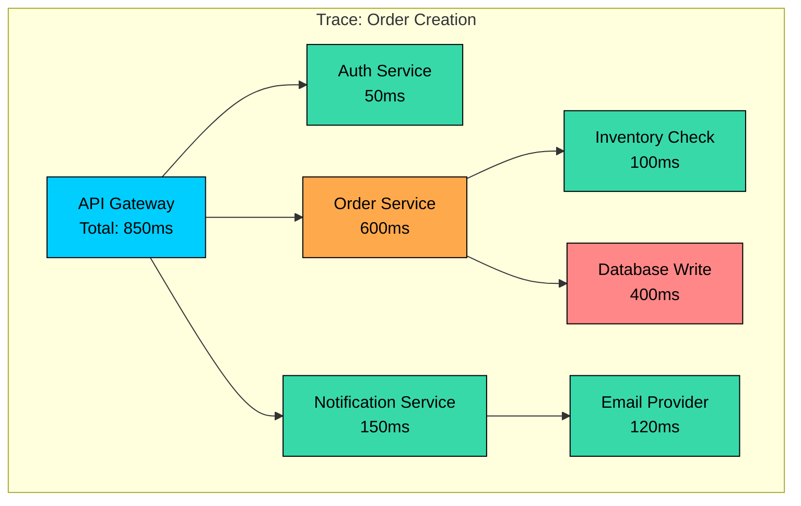
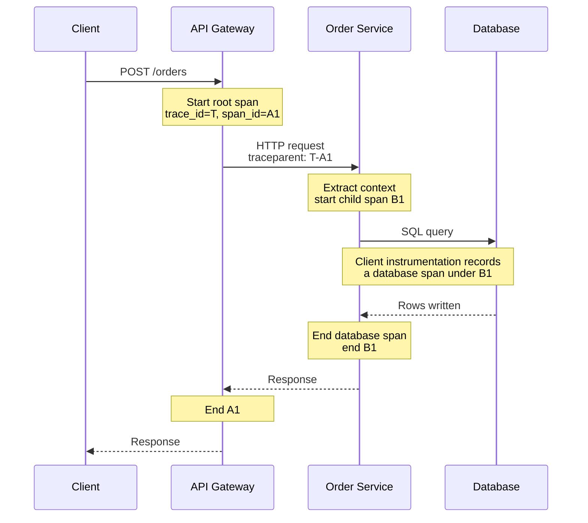
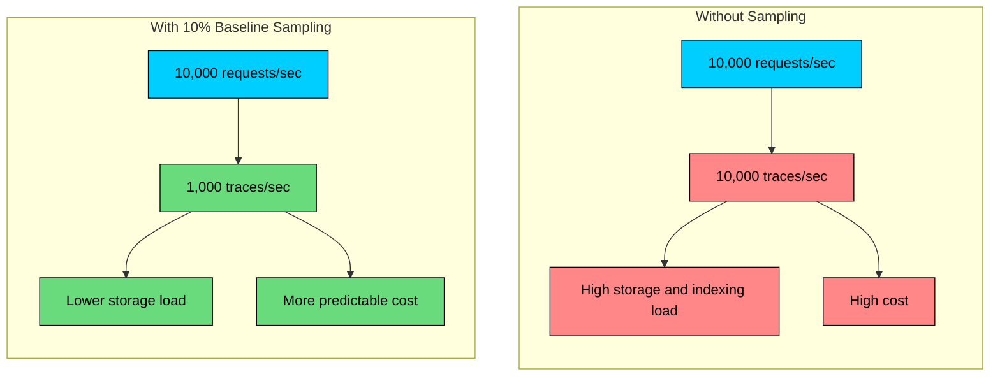
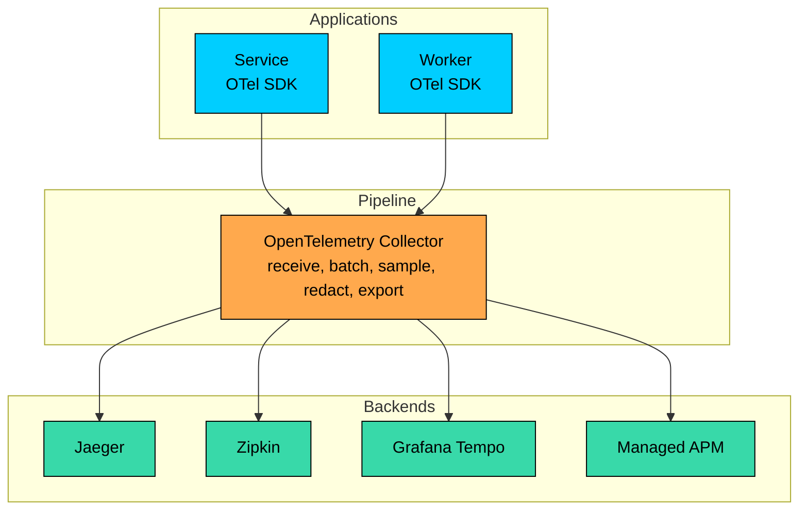
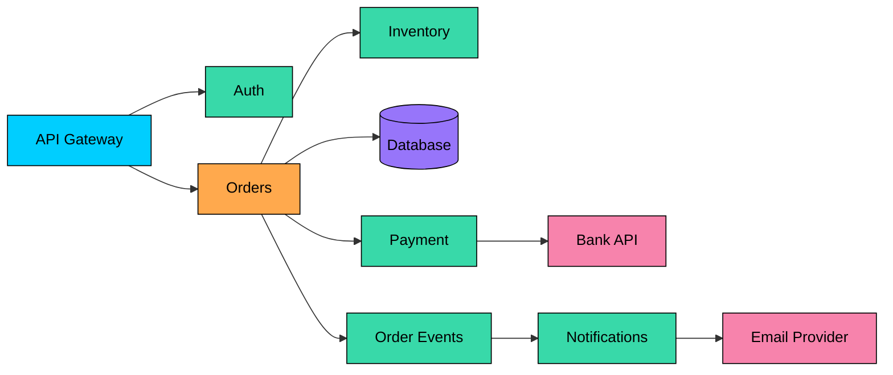
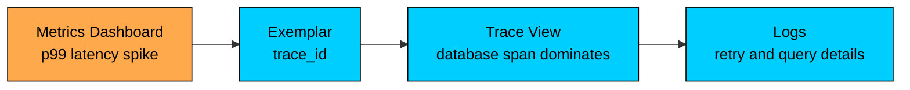

Distributed tracing records the path of a request or workflow through instrumented parts of a system.

In distributed systems, metrics can show that latency increased and logs can explain what happened inside individual services, but neither provides the full request timeline by itself. Traces show each significant operation, how long it took, which operation called which dependency, and where errors were recorded.

In this chapter, you will learn how traces, spans, context propagation, instrumentation, sampling, and tracing backends reveal request timelines across distributed systems.

---

# What Is Distributed Tracing"

A distributed trace is a record of one request or workflow as it moves through a distributed system. It is made of spans. Each span represents one operation, such as handling an HTTP request, calling another service, executing a database query, publishing a message, or processing a queue item.

Traces are only as complete as your instrumentation and sampling policy allow. They do not observe uninstrumented code, and in production you usually keep only a subset of all traces. That is fine. You do not need every trace to debug most problems; you need enough representative traces, plus the important outliers.

From this trace, you can see that the request took 850ms end to end, the order service consumed most of that time, the database write was the slowest child operation, and auth, inventory, and notification work were not the primary cause.

Without tracing, you would piece this together from logs, timestamps, and guesses about which service called which dependency. With tracing, the timeline is explicit.

---

# Traces and Spans

> [!PAYWALL] This content is for premium members only.

Distributed tracing is built on two concepts: a **trace**, which is the end-to-end record of one request or workflow, and a **span**, which is one timed unit of work inside that trace.

Once you understand those two pieces, a trace view becomes a call tree with timing data.

### Traces

A trace represents the complete observed journey of a request through your system.

A trace usually includes a trace ID, start time, duration, spans, status, and searchable attributes. This helps answer which services handled the request, which operation dominated latency, where a failure began, whether the request fanned out into parallel work, and whether the slow path differed from the normal path.

### Spans

A span represents one operation, such as an inbound HTTP request, an outbound HTTP or gRPC call, a database query from the client side, a cache lookup, a message publish or consume operation, a background job step, or a meaningful business operation such as `reserveInventory` or `chargePayment`.

Spans form a tree for synchronous request flows. The first span is the root span. Downstream work becomes child spans. If work fans out in parallel, the trace still shows the parent-child relationship and the overlapping durations.

Here is the same order request as a span tree:

This tree shows that the gateway was slow because downstream work was slow, the order service dominated the request, and the database write was the largest child span under the order service.

### Span Anatomy

A good span carries enough information to answer three questions: what happened, where did it happen, and how long did it take"

| Field | Description | Example |
|-------|-------------|---------|
| **Trace ID** | Shared identifier for the full trace | `4bf92f3577b34da6a3ce929d0e0e4736` |
| **Span ID** | Unique identifier for this span | `00f067aa0ba902b7` |
| **Parent Span ID** | Span that caused this operation | `b7ad6b7169203331` |
| **Operation Name** | Short name for the work | `POST /orders`, `orders.create` |
| **Service Name** | Service that emitted the span | `order-service` |
| **Start Time** | When the operation began | `2026-05-25T10:23:45.123Z` |
| **Duration** | How long the operation took | `45ms` |
| **Attributes** | Searchable key-value metadata | `http.response.status_code=500` |
| **Events** | Timestamped events inside the span | `retry scheduled`, `exception thrown` |
| **Status** | Result of the operation | `OK`, `ERROR` |

Attributes make traces queryable. Without attributes, you can inspect one trace at a time. With well-chosen attributes, you can search for slow `POST /orders` traces, isolate traces where `payment.provider=stripe` and status is `ERROR`, compare version `2026.05.25-3` against the previous deployment, or find database spans where the query summary is `SELECT orders`.

The word "well-chosen" matters. A trace filled with raw request bodies, user emails, and full SQL text is expensive, risky, and hard to search. A trace with stable operation names and useful attributes is an operational tool.

---

# Context Propagation

Distributed tracing works only when trace context flows across process boundaries. The context tells the next service which trace it belongs to and which span caused the current operation.

This is the same basic idea as a correlation ID, but more structured. Instead of passing one request ID, the caller passes a trace ID, the current span ID, trace flags, and sometimes vendor-specific state.

### W3C Trace Context

The common propagation standard for HTTP is **W3C Trace Context**. OpenTelemetry uses it by default in many modern setups.

It defines two HTTP headers: `traceparent` for the core trace identifiers and flags, and `tracestate` for optional vendor-specific state.

#### `traceparent` format

The pieces are the header version, usually `00`; the trace ID shared by every span; the parent ID, which is the caller's current span ID; and trace flags, where the low bit is commonly used for the sampling decision.

#### `tracestate` format

Application code should usually treat `tracestate` as opaque. It exists so tracing systems and vendors can carry implementation-specific state. Do not use it as a general-purpose place for user IDs, tenant IDs, or business data.

If you need to propagate cross-cutting application context, OpenTelemetry also has **baggage**. Use baggage sparingly. It is copied across service boundaries and can easily create privacy, security, and payload-size problems.

### Propagation Flow

Here is how trace context moves through a synchronous service call:

Notice the database call. Most databases do not participate in HTTP-style trace propagation for ordinary SQL queries. The application records a client-side database span around the query. Some databases and proxies can expose deeper telemetry, but you should not assume the database itself will continue the trace unless you have explicitly integrated it.

### What Every Service Must Do

For traces to stay connected, each service needs the same basic loop: extract trace context from incoming request, message, or RPC metadata; start a child span; attach useful attributes and events while the operation runs; inject updated context into outgoing calls and message headers; and end the span on both success and failure.

If a service fails to inject context into an outgoing call, the downstream service will start a new trace. The result is a broken timeline: two partial traces instead of one end-to-end view.

### Async Work and Message Queues

Asynchronous systems need extra care. A request may publish an event, return to the user, and then continue processing in a worker minutes later. That work is related, but it is not always part of the same synchronous call stack.

Common patterns include producer spans for publishing messages, consumer spans for processing them, trace context in message headers so consumers can connect their work to producers, and span links for cases where strict parent-child structure is misleading, such as batch processing or fan-in from many messages.

For example, if a worker processes 500 messages in one batch, making one message the parent of the whole batch is inaccurate. A span with links to the input message contexts is usually a better model.

---

# Instrumenting for Tracing

Tracing starts with instrumentation: code or agents that create spans, attach attributes, and export trace data.

Modern systems usually use **OpenTelemetry** for instrumentation. OpenTelemetry provides vendor-neutral APIs, SDKs, auto-instrumentation, semantic conventions, and the OpenTelemetry Protocol (OTLP). You can send the same instrumented data to Jaeger, Zipkin-compatible systems, Grafana Tempo, Datadog, Honeycomb, New Relic, AWS X-Ray, Google Cloud Trace, Azure Monitor, or another backend.

### Automatic Instrumentation

Automatic instrumentation hooks into common frameworks and libraries. It can create useful spans with little or no application code.

Auto-instrumentation commonly covers inbound HTTP server requests, outbound HTTP client calls, gRPC calls, database clients, Redis and Memcached operations, message publish and consume operations, and common cloud SDK calls. It gives broad coverage quickly, applies consistent span names and attributes, catches dependencies developers often forget to instrument, and provides a practical starting point across many services.

It still has limits. Auto-instrumentation may not understand your business workflow, may create spans that are technically correct but not useful, can miss custom code, and may expose sensitive data if defaults are not reviewed.

Automatic instrumentation is the right starting point. It is not the finish line.

### Manual Instrumentation

Manual instrumentation adds spans around the business operations that matter to your system.

Use it for steps such as `validateOrder`, `reserveInventory`, `scoreFraudRisk`, `callModelGateway`, `writeAuditRecord`, and `dispatchShipment`.

These names should match the language engineers use during incidents. If people say, "fraud scoring is slow," the trace should contain a span that makes that visible.

#### Example pseudocode

The pattern is simple: put spans around operations you need to reason about, add a small number of useful attributes, record exceptions, set error status when the operation fails, and always end the span.

### What to Instrument First

Do not instrument every function. That creates large traces, high cost, and visual noise. Start where the debugging value is highest.

Start with service boundaries such as HTTP endpoints and gRPC methods, then external dependencies such as databases, caches, and third-party APIs. Messaging spans for producers, consumers, and batch jobs are also high value. Business milestones are useful when they explain the request path, while internal computation should be instrumented only when it is expensive or operationally important.

A good first milestone is simple: for any slow request, you should be able to tell whether time was spent in your service, a downstream service, a database, a queue, or a third-party dependency.

---

# Sampling Strategies

Tracing every request in production is often unnecessary and expensive. A busy service can generate millions of spans per minute. Storage, indexing, query performance, and vendor bills all become real concerns.

Sampling decides which traces to keep.

### Why Sampling Exists

Imagine a service handling 10,000 requests per second. If each request creates 20 spans, that is 200,000 spans per second before retries, fan-out, background work, or database calls.

The goal is not to keep the fewest traces possible. The goal is to keep the traces that answer operational questions.

### Head-Based Sampling

Head-based sampling decides whether to keep a trace at the beginning, usually in the first service that receives the request.

**Pros:** head-based sampling is easy to implement, keeps volume and cost predictable, and propagates the decision consistently through the trace.

**Cons:** it can miss rare errors or slow requests because the system does not know the final outcome yet, and it may keep many uninteresting successful traces during an incident.

Head-based sampling is a good baseline for normal traffic. It is not enough when you must guarantee that error and latency outliers are retained.

### Tail-Based Sampling

Tail-based sampling waits until most or all spans in a trace have arrived, then decides whether to keep the trace.

A tail-sampling policy might keep all traces with errors, all traces slower than 2 seconds, all traces touching checkout or payments, more traces from a newly deployed service, and a small random sample of normal traffic.

**Pros:** tail-based sampling keeps the traces engineers usually need during incidents, can use final duration, status, and span attributes, and works well for rare failures and latency outliers.

**Cons:** it requires buffering spans before making the decision, adds complexity in the collector or backend, can create variable volume, and needs careful tuning as traffic patterns change.

Tail-based sampling is often worth the complexity for high-volume production systems, especially when missed error traces are expensive.

### Policy-Based Sampling

In practice, teams often combine policies: keep all error traces and very slow requests, keep a higher percentage of critical flows, keep a small sample of normal high-volume traffic, and drop or heavily sample low-value traffic such as health checks.

The important detail is where the decision can be made. A pure head sampler cannot know that a request will fail later. To keep all errors or slow traces, you need tail sampling, backend sampling, or an instrumentation pattern that records those failures through another signal.

### Sampling Trade-Offs

| Strategy | Cost Predictability | Captures Outliers | Complexity |
|----------|---------------------|-------------------|------------|
| **No sampling** | Poor | Yes | Low |
| **Head-based** | Good | Sometimes | Low |
| **Tail-based** | Variable | Yes | Higher |
| **Combined policies** | Medium | Usually | Medium |

A practical default uses head-based sampling for normal traffic, tail-based or backend policies to retain errors and slow traces, drops low-value noise such as health checks, and revisits sampling after major traffic growth or architecture changes.

---

# Tracing Systems

Instrumentation creates trace data. A tracing backend receives, stores, indexes, and visualizes it.

### OpenTelemetry

OpenTelemetry is not a tracing backend. It is the instrumentation and telemetry pipeline standard used by much of the current ecosystem.

A common setup looks like this:

The OpenTelemetry Collector is often the control point for production telemetry. It can batch data, redact attributes, enrich resource metadata, apply sampling policies, and export to one or more backends.

### Jaeger

Jaeger is an open-source distributed tracing system originally created at Uber and now part of the CNCF ecosystem. It is commonly used with OpenTelemetry instrumentation.

Jaeger is useful for trace search and visualization, service dependency graphs, local or self-hosted tracing setups, and teams that want an open-source tracing backend.

Modern Jaeger deployments commonly receive OTLP through the OpenTelemetry Collector or Jaeger's own OTLP support.

### Zipkin

Zipkin is another mature open-source tracing system, originally developed at Twitter. It is simple to run and still appears in many systems and libraries.

Zipkin is useful when the organization already uses Zipkin-compatible instrumentation, B3 propagation is already present, or a simple open-source tracing backend is enough.

Many older systems use B3 headers such as `x-b3-traceid` or the compact `b3` header. Newer systems often standardize on W3C Trace Context, but mixed environments are common. OpenTelemetry propagators can usually handle both during migration.

### Managed Observability Platforms

Managed platforms reduce operational work. AWS X-Ray, Google Cloud Trace, and Azure Monitor are common choices for teams already committed to those clouds. Datadog APM, New Relic, Honeycomb, and Grafana Cloud Tempo are common when teams want managed trace storage, querying, dashboards, exemplars, log correlation, alerting, retention controls, and high-cardinality analysis.

Managed services save engineering time, but cost controls matter. Sampling, retention, attribute hygiene, and noisy endpoints should be reviewed before production volume grows.

---

# Analyzing Traces

Traces are most valuable when you use them as part of a debugging workflow, not as another dashboard to stare at.

Metrics tell you something changed. Traces show where the request spent time. Logs explain the detailed behavior around the failing operation.

### Finding Slow Traces

Start by filtering to the incident window and the affected operation.

Example query:

Then narrow the search by filtering to `status=ERROR`, comparing slow and normal traces, filtering by deployment version, region, tenant tier, or feature flag, and looking for repeated dependency spans, retries, queue waits, or fan-out.

### Identifying Bottlenecks

When you open a slow trace, do not stop at the first long bar. Ask why that bar is long.

This trace says the API gateway is waiting on the order service, the order service is mostly waiting on the database, and the database query is the likely bottleneck.

The next step is not "optimize the order service." The next step is to inspect the database span attributes, compare query shapes, and check database metrics and logs.

### Comparing Fast and Slow Traces

A single slow trace is useful. A comparison is often better.

The difference is actionable. The slow path is not just "the database is slow." It is a different query shape returning far more rows.

### Reading Trace Timelines Correctly

Trace duration is not the sum of all span durations. Parallel spans overlap.

If one request fans out to five services and each call takes 200ms, the trace may still finish in 250ms if the calls happen concurrently. A naive sum would say 1 second, which is wrong for end-to-end latency.

Look for the critical path that determines total latency, parallel fan-out, retries, queue delay between publish and consume, and missing spans where code is doing work without instrumentation.

### Service Dependency Maps

Tracing backends can build service maps by analyzing which services call which dependencies.

Service maps help you spot unexpected dependencies, high fan-out services, failure propagation paths, shared dependencies that deserve stronger SLOs, and services that appear in critical user journeys.

Treat dependency maps as evidence, not architecture diagrams. They reflect observed traffic, which means they depend on instrumentation coverage and the selected time window.

---

# Connecting Traces to Logs and Metrics

The strongest observability setups let engineers move from a symptom to evidence quickly:

**metrics -> traces -> logs**

Metrics detect the problem. Traces locate the slow or failing operation. Logs explain the details around that operation.

### Traces to Logs

Every structured log entry should include the current `trace_id`. Including `span_id` is even better because it lets you jump directly from a span to the logs emitted while that span was active.

This gives you a clean workflow: open a slow or failed trace, select the span where the problem appears, jump to logs for the same `trace_id` and `span_id`, and read the exact application events and errors for that operation.

### Traces to Metrics

Metrics show aggregate behavior. Traces show examples. **Exemplars** connect the two by attaching a trace reference to a metric sample.

When a latency graph spikes, an exemplar lets you click from the graph into a representative trace from that point in time.

### Incident Workflow

During a real incident, a good flow starts with a metric alert, uses the dashboard to identify scope, opens an exemplar trace from the spike window, follows the critical path to the slow dependency, checks logs for the same span, and confirms the explanation with dependency metrics.

The trace does not replace metrics or logs. It connects them.

---

# Best Practices

### 1. Start at Service Boundaries

Instrument inbound and outbound boundaries first: HTTP and gRPC requests, outbound service calls, database and cache client calls, message producers and consumers, scheduled jobs, and workers.

This gives you the request shape before you add detailed business spans.

### 2. Use OpenTelemetry Semantic Conventions

Consistent attribute names make traces searchable across languages, teams, and vendors.

Use current semantic conventions where your instrumentation supports them. Common examples include `service.name`, `service.version`, and `deployment.environment.name` for service resources; `http.request.method`, `http.route`, and `http.response.status_code` for HTTP; `db.system.name`, `db.namespace`, `db.operation.name`, and `db.query.summary` for databases; `rpc.system.name` and `rpc.method` for RPC; and `messaging.system`, `messaging.destination.name`, and `messaging.operation.name` for messaging.

You will still see older names such as `http.method`, `http.status_code`, `db.system`, and `db.statement` in existing systems and older libraries. Do not rename everything blindly during an incident. Standardize deliberately as part of instrumentation maintenance.

### 3. Keep Span Names Stable

Good span names are low-cardinality and easy to group.

| Avoid | Prefer |
|-------|--------|
| `GET /users/12345/orders/98765` | `GET /users/{user_id}/orders/{order_id}` |
| `SELECT * FROM orders WHERE id = 123` | `SELECT orders by id` |
| `process order 918273` | `orders.process` |

High-cardinality names break aggregation. Put identifiers in attributes only when they are safe and useful, and avoid indexing attributes that will explode cardinality.

### 4. Be Careful with Sensitive Data

Traces often cross more tools and teams than application logs. Treat them as production data.

Do not put passwords, tokens, full request or response bodies, credit card numbers, raw prompts containing private user data, session cookies, or unredacted SQL with user-provided literals into spans. Prefer summaries and buckets such as `order.value_bucket=100-500`, `db.query.summary=SELECT orders by user_id`, `model.request.token_count=1200`, and `tenant.tier=enterprise`.

### 5. Add Business Attributes Deliberately

Business attributes are valuable when they help compare behavior across dimensions such as `tenant.tier`, `feature.flag`, `payment.provider`, `region`, `deployment.version`, `model.name`, or `queue.name`.

Do not add attributes just because the data is available. Every indexed attribute has cost and privacy implications.

### 6. Watch for Span Explosion

Large traces are hard to store and harder to read.

Common causes include creating a span for every loop iteration, tracing every row in a batch job, adding spans for trivial functions, instrumenting high-volume health checks, or recording every token or chunk in a streaming response as a span.

Use span events, metrics, or logs when per-item detail is useful but a span per item would make the trace unreadable.

### 7. Design Sampling as an Operational Policy

Sampling is not a one-time SDK setting.

A production policy should specify the baseline sampling rate for normal traffic, which endpoints are dropped or heavily sampled down, which errors and slow traces are retained, where sampling decisions happen, how long different trace classes are retained, and who reviews sampling when traffic changes.

For most teams, the policy evolves from simple head sampling to collector or backend policies as traffic grows.

### 8. Verify Tracing in CI and Staging

Tracing breaks quietly. A missing middleware, queue header, or proxy configuration can split traces for months.

Test that inbound requests create server spans, outbound calls propagate trace context, logs contain `trace_id`, message consumers continue or link trace context, service names and environments are set correctly, and sensitive fields are redacted.

For critical flows, keep a small smoke test that exercises the full path and verifies that a connected trace appears in the backend.

---

# Common Pitfalls

### Treating Traces as Complete Truth

Traces show what was instrumented and retained. Missing spans can mean missing instrumentation, sampling, dropped telemetry, or a real gap in the request. Always corroborate with metrics and logs.

### Confusing Trace Duration with Total Work

Parallel spans overlap. A trace with ten 200ms child spans may still complete in 250ms. Focus on the critical path when investigating latency.

### Using Traces as Logs

Span events are useful for important milestones, but traces should not become a second logging system. Detailed payloads, debug messages, and large error context usually belong in logs linked by `trace_id`.

### Ignoring Async Boundaries

Queues, streams, schedulers, and batch workers often break traces if message headers are not propagated. Async workflows may also need span links instead of simple parent-child relationships.

### Letting Instrumentation Drift

Different teams may use different span names, service names, attribute conventions, or propagation formats. That makes cross-service analysis painful. Standardize conventions and review them the same way you review API contracts.

---

# Summary

Distributed tracing gives you the request timeline that metrics and logs cannot provide on their own.

The core ideas are simple: a **trace** represents one observed request or workflow, a **span** represents one timed operation inside that trace, **context propagation** connects spans across services, **instrumentation** determines what you can see, **sampling** determines what you keep, and **trace IDs in logs** plus **exemplars in metrics** connect the observability workflow.

Use tracing to follow evidence. Metrics tell you that something changed. Traces show where the time or failure occurred. Logs explain the detailed behavior around that point. The combination is what makes distributed systems debuggable under real production pressure.

---

# Quiz
