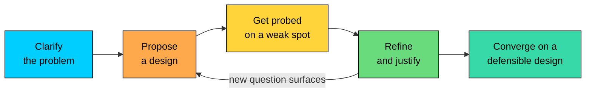
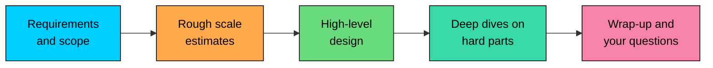

A system design interview is an open-ended conversation where you are asked to design a real-world system in 45 to 60 minutes.

For mid-level and senior roles, this round carries a lot of weight because it tests how you think beyond code.

Unlike coding interviews, there is no single correct answer. Two candidates can design the same system differently and still be right, as long as they understand the trade-offs behind their choices.

That is what makes system design interviews difficult. The questions are intentionally vague, the scope is broad, and you do not always know whether your answer was too shallow, too complex, or simply focused on the wrong things.

This chapter will help you understand what a system design interview really is, why companies use it, and what a strong answer looks like.

---

# 1. What a System Design Interview Actually Is

In a system design interview, you are typically handed a deliberately under-specified question, something like "Design a URL shortener" or "Design a news feed," and your task is to work out an architecture for it.

You are expected to drive the discussion. You clarify what needs to be built, identify the core requirements, sketch the major components, choose data stores and communication patterns, and then go deeper into the parts that matter most.

The key thing to understand is this: a system design interview is a conversation, not a presentation. You are not supposed to sit silently for 30 minutes and then reveal a perfect blueprint.

You propose an approach, the interviewer challenges it, and you refine the design. They may ask what happens when a database fails, how the system handles a traffic spike, or why you chose one storage model over another. Each question reveals a new constraint, and your design becomes stronger as you respond.

The interview usually follows a loop like this:

You rarely move in a straight line from requirements to the final answer. Instead, you cycle through proposing, getting challenged, and improving the design several times.

---

# 2. Why Companies Run System Design Interviews

Companies run system design interviews because the round mirrors real engineering work.

In real projects, problems rarely arrive as clean tasks with obvious solutions. They arrive as vague goals like “users should be able to share files” or “search is too slow.” Someone has to turn that into requirements, architecture, trade-offs, and a plan that can survive production.

A system design interview is a compressed version of that work.

Coding interviews test whether you can implement a well-defined solution. System design interviews test whether you can handle ambiguity, break a large problem into parts, choose the right building blocks, and explain your decisions clearly.

These skills matter more as engineers become more senior. That is why this round becomes more important for mid-level, senior, and staff-level roles.

A good system design answer creates signal across several areas:

| Signal | What it means | How it shows up |
|---|---|---|
| Handling ambiguity | Turning a vague question into concrete requirements | The clarifying questions you ask before designing anything |
| Structured thinking | Breaking a large system into coherent parts | Whether the architecture has a clean shape |
| Technical breadth | Knowing common building blocks | Choosing suitable databases, caches, queues, load balancers, and APIs |
| Technical depth | Understanding how key components work | Explaining bottlenecks, failure modes, and internals when asked |
| Trade-off reasoning | Defending choices with context | Explaining why you picked one approach over another |
| Communication | Keeping the interviewer oriented | Making the design easy to follow |

Breadth and depth both matter.

If a design names ten components but cannot explain how any of them work, it feels shallow. If it spends all its time tuning one database index but never explains the overall architecture, it feels narrow.

A strong answer does both: It starts with a clear high-level design, then goes deeper into the parts where the real risk lives: scale, consistency, latency, failure handling, or operational complexity.

---

# 3. The Format and Logistics

The exact setup varies by company, but the shape is usually the same. You get one interviewer, a shared drawing surface, and 45 to 60 minutes.

In remote interviews, the drawing surface is usually a tool like Excalidraw, FigJam, Miro, or a shared document. On-site, it is usually a physical whiteboard. Either way, you draw the system using simple boxes for services, cylinders for data stores, and arrows for requests or data flow.

The diagram is not judged for artistic quality. It is judged for clarity.

A readable diagram gives both you and the interviewer something to point at as the design evolves. It keeps the conversation grounded and makes it easier for the interviewer to probe a specific part of the system.

A good practice is to narrate as you draw. Label the components. Label the important arrows. Keep the layout simple enough that someone can understand the design at a glance.

A typical live interview roughly flows like this:

Treat this as a pacing guideline, not a strict schedule. A real interview will move back and forth as new questions come up.

The biggest mistake is spending too long at the start. Requirements and estimates are important, but they exist to support the design. If half the interview is gone before you draw the first component, you will not have enough time to show how you handle the hard parts.

---

# 4. What a Good Answer Looks Like

A strong system design answer follows a clear arc. The details change from problem to problem, but the process stays mostly the same.

You do not need to memorize architectures. You need a repeatable way to think through any system.

A good answer usually moves through five stages:

- **Clarify the problem.** Understand what you are building, who it is for, and which workflows matter most.
- **Estimate the scale.** Get a rough sense of reads, writes, storage, and traffic. A system for thousands of users looks very different from one for hundreds of millions.
- **Design the high-level architecture.** Draw enough boxes and arrows to show how a request flows through the system.
- **Deep dive into the hard parts.** Focus on the bottlenecks, failure modes, consistency issues, and trade-offs.
- **Explain your trade-offs.** Do not just say what you chose. Explain what you considered and why you rejected it.

The deep dives usually carry the most weight. The high-level design shows that you can assemble a system. The deep dives show that you understand the pieces well enough to defend them.

That is why you should move through the early stages efficiently and save enough time for depth.

Here is how the clarification stage might sound for a problem:

> 💡 **Key Insight:**

> **DISCUSSION**
>
> **Prompt:** "Design a URL shortener."
>
> **Candidate:** "Before I start designing, can I clarify scope" Are we focusing only on creating short links and redirecting users, or should we also support analytics, custom aliases, and link expiration""
>
> **Interviewer:** "Focus on shortening and redirecting. We can discuss basic analytics if time permits."
>
> **Candidate:** "Got it. Do we have a rough sense of scale" How many new URLs are created per day, and how read-heavy is the system""
>
> **Interviewer:** "Assume around 100 million new URLs a day, and reads heavily outnumber writes."
>
> **Candidate:** "That makes this a read-heavy system. I’ll optimize the redirect path with caching and size the key space for years of growth. I’ll keep analytics out of the core design for now."

That short exchange already changes the design.

Because the system is read-heavy, caching becomes important. Because the write volume is high, the short-key space must support long-term growth. Excluding analytics keeps the scope small enough to finish in the interview.

A good answer does not jump straight into architecture. It first uses clarification to make sure the system being designed is the right one.

This chapter only introduces the arc. In a later chapter, we will break each stage into concrete steps, so you have a repeatable method for any system design problem.

---

# 5. Summary

System design interviews feel unfamiliar at first because they do not work like the interview rounds most people practice for. They are less about finding one correct answer and more about showing how you think through an ambiguous problem.

- A system design interview is an open-ended, collaborative conversation where you design a real-world system in 45 to 60 minutes.
- It mirrors real engineering work: clarifying vague requirements, choosing an architecture, reasoning about scale, and defending trade-offs.
- Unlike a coding interview, you cannot quietly solve the problem in your head and reveal the answer at the end.
- The bar also rises with seniority. The underlying building blocks may be the same, but senior candidates are expected to bring more structure, identify risks earlier, and drive the conversation with less guidance.
- A good answer follows a simple arc: clarify the problem, estimate the scale, design the high-level architecture, deep dive into the hard parts, and explain trade-offs throughout.

---

Not all system design questions need the same answering approach. Some are about full products. Some are about one component. Others focus on data pipelines, APIs, class design, or scaling an existing system.

In the next chapter, we will walk through the main types of questions asked in system design interviews and how to answer them.
