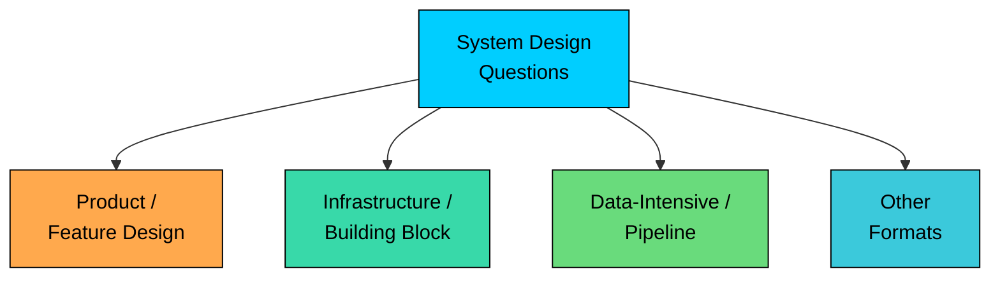
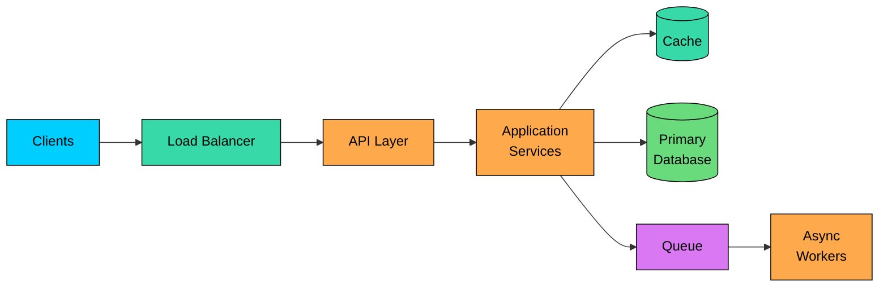
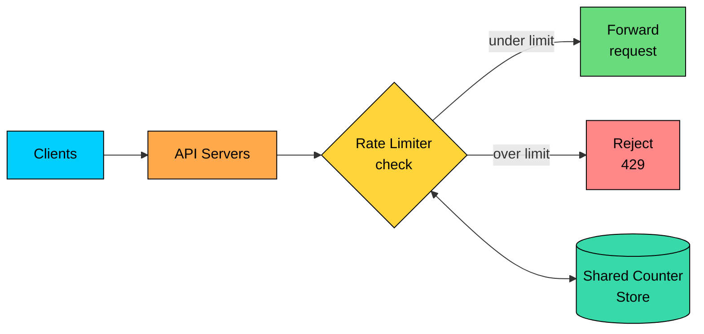
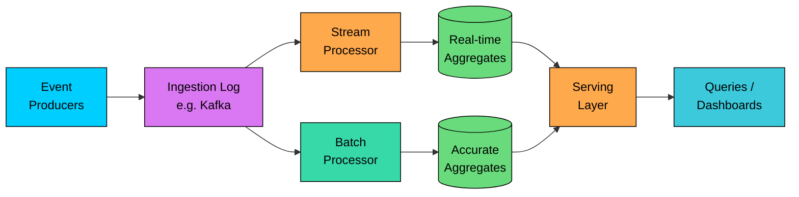
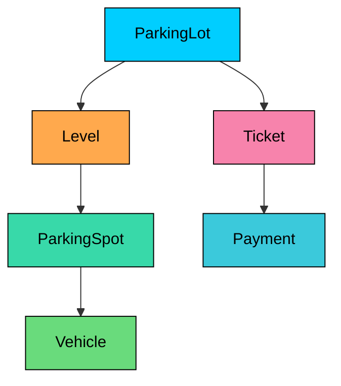

Not every system design question should be answered the same way.

At first, many questions look similar. You gather requirements, draw a few components, choose a database, add caching, and talk about scaling. But each question usually tests something different.

“Design Instagram” is mostly about feeds, timelines, and user activity. “Design a rate limiter” is about controlling traffic correctly and quickly. “Design an ad click aggregator” is about handling a large number of events and turning them into useful data.

In this chapter, we will look at common types of system design questions, what each type is testing, and how to adjust your answer for each one.

---

# 1. The Main Types at a Glance

Most system design questions fall into a few common types. The boundaries are not strict, and some questions may combine more than one type, but each type expects a different kind of answer.

At a high level, you will usually see three main types, plus a set of other formats that are narrower or sit next to system design:



The table below summarizes what each type usually sounds like, what it mainly tests, and where you should spend most of your time.

| Type | Sounds like | Main focus | Where your time should go |
|---|---|---|---|
| Product / Feature Design | "Design Twitter/X", "Design Uber" | A user-facing application end to end | Requirements, data model, APIs, read/write paths, and the busiest parts of the system |
| Infrastructure / Building Block Design | "Design a rate limiter", "Design a message queue" | One distributed-systems component | Algorithm, data structures, consistency, failure cases, and behavior across machines |
| Data-Intensive / Pipeline Design | "Design an ad click aggregator", "Design trending topics" | Ingesting and processing large volumes of data | Ingestion, processing, aggregation, storage, and accuracy trade-offs |
| Other Formats | "Design a parking lot", "Scale this design", "Design the API" | A narrower or adjacent skill | The specific area the interviewer asks you to focus on |

Product and feature design is the most common type in a full system design round, so we will start there.

---

# 2. Product and Feature Design

The question usually names a real product or a major feature: “Design Twitter/X,” “Design Instagram,” “Design WhatsApp,” “Design Uber,” “Design Tinder,” “Design a URL shortener,” or “Design YouTube.”

These questions are broad by design. You are not just designing one service or one database table. You need to understand the main features, define the APIs, model the data, explain the read and write flows, and show how the system handles growth.

The goal is to show that you can take an unclear product idea, turn it into clear requirements, design a working system, and then improve the parts that will break first under real traffic.

### 2.1 What This Type Tests

A product design question tests whether you can move from a vague idea to a working system without getting lost in details too early.

A strong answer usually covers:

- Clear requirements: what the system must do, and what quality bar it needs to meet for latency, availability, and scale.
- Rough load estimates: reads, writes, read/write ratio, and storage growth.
- A high-level design that connects clients, APIs, services, and storage.
- Clear read and write paths.
- A data model that supports the main access patterns.
- One or two deep dives into the parts most likely to become slow, expensive, or unreliable.

The goal is not to mention every possible component. The goal is to show that you can design the full system first, then spend your time on the parts that matter most.

### 2.2 The Shape of the Answer

Most product design answers start with a similar structure.

Clients send requests through a load balancer to an API layer. The API layer calls application services. Those services read from caches, write to databases, and use queues for work that can happen later.



This diagram is intentionally generic. Many systems start from this shape. What makes the answer strong is how you adapt it to the actual problem.

For a feed product like Twitter or Instagram, the important part is usually feed generation. Do you build the feed when a user posts, when another user opens the app, or use a mix of both"

For a location product like Uber, the important part is finding nearby drivers and matching them quickly. For a messaging product like WhatsApp, the important parts are open connections, message delivery, retries, and ordering.

The structure gives you a starting point. The real interview signal comes from the part you choose to go deep on.

### 2.3 How the Approach Shifts

Product questions are broad, so the biggest mistake is spending a little time on everything and not enough time on the hard part.

A good approach is simple:

1. Clarify the main requirements.
2. Build a complete high-level design.
3. Check that the read and write paths work.
4. Pick one or two risky parts and go deeper.

The numbers help you decide where to focus. For example, a URL shortener with 1 billion redirects per day and 10 million new links per day is heavily read-heavy. That pushes the design toward caching, read replicas, and a fast redirect path.

You do not need perfect math. You just need enough estimation to justify your choices.

> 💡 **Key Insight:**

> **TIP**
>
> In a product design question, try to reach a complete high-level design in the first third of the interview. The rest of the time should go into the parts that are hardest to scale or most likely to fail.

---

# 3. Infrastructure and Building-Block Design

The second type focuses on one component instead of a full product.

The question usually sound like: “Design a rate limiter,” “Design a distributed cache,” “Design a message queue,” “Design a unique ID generator,” “Design a web crawler,” “Design a notification service,” or “Design a key-value store.”

There is usually very little product behavior to discuss. You are not designing user profiles, feeds, or payments. You are designing one component that other systems depend on.

The interview is about whether that component works correctly, handles high traffic, and continues to behave well when it runs across many machines.

### 3.1 What This Type Tests

This type goes deep on one component.

A strong answer usually covers:

- The main algorithm or data structure behind the component, such as token bucket or sliding window for a rate limiter.
- How the component handles many requests at the same time.
- What changes when it runs on multiple machines instead of one.
- How shared state is stored and kept reasonably correct.
- What happens when a machine fails, state is lost, or the component becomes temporarily unavailable.

The goal is not to draw a large system around the component. The goal is to show that the component itself is correct, fast, and reliable under real conditions.

### 3.2 The Shape of the Answer

A building-block answer often starts with the simplest version: one machine.

Take a rate limiter. On one server, a token bucket is just a counter and a timestamp. The logic is easy to explain.

The harder part starts when the rate limiter runs across many servers. Now the limit must be enforced across the whole system, not just one machine. That means the counter has to live in a shared place, and you need to think about latency, consistency, and failure.



The diagram is small because the system is small. The depth is in the details.

Where is the counter stored" Is every request checked before it is served" How much inaccuracy is acceptable" What happens if the shared store is slow or down" Do you allow requests and risk overload, or reject requests and risk blocking valid users"

### 3.3 How the Approach Shifts

The clarification stage is shorter for building-block questions. There is usually no large product scope to define.

For a rate limiter, a few questions are enough:

- What is the limit based on: user, IP address, API key, or something else"
- What is the time window"
- Is a small amount of over-limit traffic acceptable"
- Should the system fail open or fail closed when the limiter is unavailable"

After that, move quickly into the mechanism.

Instead of spending time on many services, spend it on correctness. Explain the data structure, walk through concurrent requests, and then show what changes when the component runs on many machines.

Capacity estimates still help, but they should support a specific decision. For example, how much memory the counters need, or how many reads and writes the shared store must handle.

---

# 4. Data-Intensive and Pipeline Design

The third type is about collecting and processing large amounts of data.

The questions usually sound like: “Design an ad click aggregator,” “Design trending topics,” “Design a metrics and monitoring system,” “Design a system to count video views,” “Design an analytics dashboard,” or “Design a recommendation pipeline.”

These systems are less about serving one user request at a time and more about handling a continuous flow of events. Clicks, views, logs, and metrics arrive in huge numbers. The system must collect them, process them, and produce something useful, such as counts, rankings, aggregates, or top-K lists.

The user-facing part may be small. The hard part is the data pipeline behind it.

### 4.1 What This Type Tests

These questions test whether you can handle high-volume data without losing important events or making the system too expensive.

A strong answer usually covers:

- **Ingestion:** how events enter the system safely, usually through a durable queue or log that can handle bursts.
- **Processing:** whether results are computed as events arrive, in scheduled batches, or both.
- **Aggregation:** how raw events become counts, rankings, or summaries, and where those results are stored.
- **Accuracy:** whether the result must be exact, or whether an approximate answer is acceptable to reduce cost and complexity.
- **Delay:** how fresh the result needs to be. Some systems need near real-time results, while others can be a few minutes or hours behind.

The main goal is to show that you can move data through the system reliably and turn it into useful results at scale.

### 4.2 The Shape of the Answer

Most data pipeline answers follow the same basic flow: collect, process, and serve.

Events first land in a durable log or queue. Processing jobs read those events and turn them into useful results, such as counts, rankings, summaries, or top-K lists. A serving layer then answers queries from those processed results.



A common design is to use two paths.

The stream path gives quick results as events arrive. These results may be slightly off, but they are fresh.

The batch path runs later and produces more accurate results. It can fix mistakes, remove duplicates, and rebuild counts from raw data if needed.

This split is common because exact real-time processing over billions of events is expensive. Many systems accept small temporary errors, then correct them later.

### 4.3 How the Approach Shifts

The questions you ask at the start are different from a product design question.

Instead of asking only about features, ask about the data:

- How many events arrive per second"
- How large is each event"
- How fresh do the results need to be"
- Does the answer need to be exact"
- Can we tolerate duplicates or late events"

These answers drive the design.

Throughput matters a lot here. If the system receives millions of events per second, that affects how you partition the ingestion log, how many workers you need, and how aggregation is split across machines.

One common issue is a hot key. For example, a viral video or popular ad may receive far more events than everything else. If all those events go to one partition or one worker, that machine becomes the bottleneck. A strong answer explains how to split or smooth that load.

> 💡 **Key Insight:**

> **NOTE**
>
> A common decision in this type is exact versus approximate. Counting every unique viewer exactly may require storing every viewer ID. An approximate method like HyperLogLog uses much less memory, but allows a small error. The right choice depends on the product requirement.

---

# 5. Other Formats You Might See

Beyond the three main types, a few other formats show up often enough to recognize. Most of them are narrower than a full system design question. Sometimes they are the whole interview, but often they appear as follow-up questions after the main design.

One format, low-level design, is important enough to call out separately because it usually belongs in its own round.

### 5.1 Low-Level and Object-Oriented Design

Low-level design works at a smaller scale.

Instead of designing a distributed system, you design the internals of a single program. Common examples include “Design a parking lot,” “Design an elevator system,” “Design a vending machine,” or “Design a chess game.”

This is usually called low-level design, or LLD. The focus is not servers, databases, queues, caches, or traffic scale. The focus is how you model the problem in code.

A strong answer covers the main classes, their attributes, and how they relate to each other. For a parking lot, that might include vehicles, spots, tickets, levels, and payments.

The output looks more like a class diagram than a system architecture diagram.



The discussion is mostly about classes, interfaces, composition, inheritance, and clean responsibilities. You are usually not talking about sharding, replication, or caching.

Because this course focuses on distributed system design, low-level design has its own dedicated material. It appears here so you can recognize that “Design a parking lot” and “Design Twitter” are very different questions.

### 5.2 Scale or Deep-Dive on an Existing Design

Sometimes the interviewer gives you a working design and asks you to improve one part of it.

The question may sound like:

- “Here is a simple version of the system. How would you make it handle 100 times more traffic"”
- “What happens when this database becomes the bottleneck"”
- “How would you make this work across multiple regions"”
- “Where does this system fail first"”

Here, you are not starting from scratch. The goal is to find the weak point and fix it.

A good answer usually follows this flow:

1. Identify what fails first.
2. Explain why it fails.
3. Design the fix.
4. Discuss the trade-offs.

The fix could be adding a cache, sharding a table, moving slow work to a queue, adding read replicas, or splitting a large service into smaller services.

This format often appears inside a product design question. You may start with “Design Instagram,” then the interviewer may zoom in and ask, “Now how would you scale timeline generation"”

### 5.3 API or Contract Design

Some questions focus on the interface instead of the full backend.

The interviewer may ask you to design the API for orders, payments, search, comments, notifications, or file uploads.

A strong answer covers endpoints, request and response formats, pagination, error handling, retries, idempotency, and versioning.

The important questions are practical. What happens if the same request is retried" How does a client page through a long list" What error format does every endpoint use" How do you add new fields without breaking older clients"

This format is less about drawing a large architecture and more about designing a clear boundary between systems.

### 5.4 Machine Learning System Design

Some teams ask system design questions around recommendations, search ranking, spam detection, or fraud detection.

Common examples include:

- “Design a recommendation system for a video app.”
- “Design a spam classifier.”
- “Design search ranking.”
- “Design a fraud detection system.”

These questions still involve normal system design. You still need ingestion, storage, APIs, serving, monitoring, and scaling.

But they also add machine learning concerns: collecting training data, building features, training models, serving predictions, measuring quality, and learning from user behavior.

The key signal is that the system is not only storing and serving data. It is also making predictions or ranking results.

You do not need to turn the answer into a machine learning lecture. But you should recognize when the hard part is data quality, model freshness, evaluation, and what happens when the model gives poor results.

---

# 6. How to Recognize the Type Quickly

In most interviews, the question tells you its type in the first few seconds. You just need to listen for the main signal.

Is it about a product, a single component, a data pipeline, or a class model" Once you know that, you know where to spend your time.

| If the prompt... | It is likely... | Start with... |
|---|---|---|
| Names a product or feature ("Design Instagram") | Product / Feature design | Requirements, read/write paths, and the hardest part of the product |
| Names one reusable component ("Design a rate limiter") | Infrastructure / Building block | The core algorithm and how it works across machines |
| Centers on counting, ranking, or processing events ("Design an ad click aggregator") | Data-intensive / Pipeline | Ingestion, stream vs batch, and aggregation trade-offs |
| Asks for the classes of a single program ("Design a parking lot") | Low-level / Object-oriented | Entities, relationships, and interfaces |
| Hands you a design and asks to scale or extend it | A deep-dive format | The first bottleneck and how you would fix it |

The recognition flow is straightforward: figure out whether the prompt is about a product, a component, a data flow, or a class model, and that decides where your time goes.

```mermaid
flowchart TD
    A[Read the prompt]:::primary --> B{Is it a single<br/>program's classes"}:::yellow
    B -- yes --> C[Low-level design]:::rose
    B -- no --> D{Is it mainly<br/>processing events<br/>at high volume"}:::yellow
    D -- yes --> E[Data-intensive<br/>pipeline]:::green
    D -- no --> F{One component,<br/>or a whole product"}:::yellow
    F -- one component --> G[Building block]:::teal
    F -- whole product --> H[Product /<br/>feature design]:::orange

    classDef primary fill:#00ceff,stroke:#000,color:#000
    classDef yellow fill:#ffd43b,stroke:#000,color:#000
    classDef rose fill:#f783ac,stroke:#000,color:#000
    classDef green fill:#69db7c,stroke:#000,color:#000
    classDef teal fill:#38d9a9,stroke:#000,color:#000
    classDef orange fill:#ffa94d,stroke:#000,color:#000
```

These categories are not strict rules. Many real questions mix more than one type.

“Design Uber” is a product question, but it also has a hard real-time matching problem inside it. “Design a notification service” is a building-block question, but it may also include user preferences, delivery rules, retries, and failures.

When a question mixes types, say that clearly. Then decide which part matters most and spend your depth there.

The point is not to put every question into a perfect category. The point is to recognize, early, where the hard part lives.

---

# 7. Summary

System design questions usually fall into a few common types. The type tells you where to spend your time.

- **Product / Feature design:** Build the system end to end, then go deep on the hardest path. Example: “Design Twitter.”
- **Infrastructure / Building block:** Focus on one component and explain how it works correctly at scale. Example: “Design a rate limiter.”
- **Data-intensive / Pipeline:** Show how events are collected, processed, and turned into useful results. Example: “Design an ad click aggregator.”
- **Other formats:** Some questions focus on class design, scaling an existing system, API design, or machine learning systems.

These categories are guides, not strict rules. Many questions combine more than one type.

The important skill is to recognize what the question is really testing. Once you know that, you can spend less time following a generic template and more time on the part that actually matters.

---

System design interviews can look very different depending on the level you are interviewing for. A junior engineer, a mid-level engineer, a senior engineer, and a staff engineer may all get similar questions, but the interviewer is not looking for the same signal from each of them.

In the next chapter, we will break down what system design interviewers expect at each level, so you can prepare for the bar you are actually being evaluated against.
