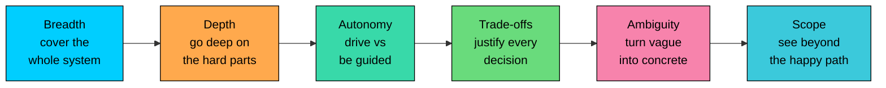
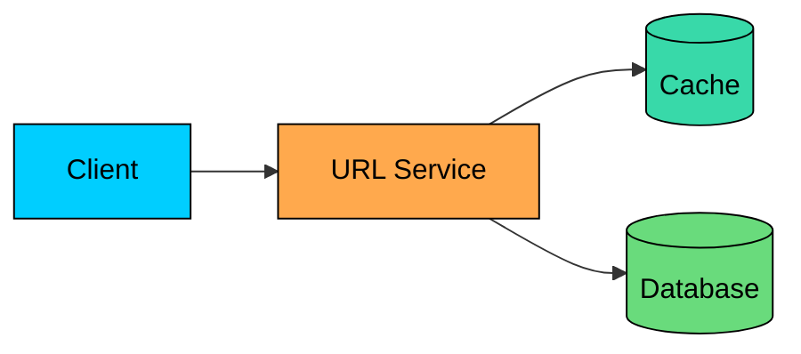
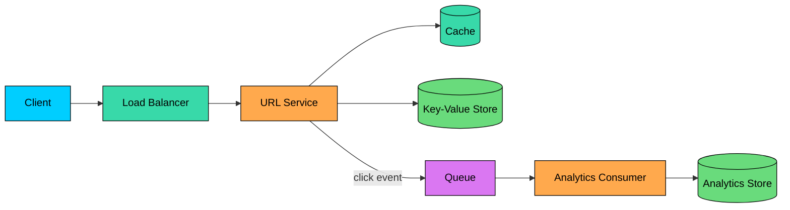

A system design interview is not graded on one universal scale.

The same answer that works for a new grad may feel too shallow for a senior engineer. As the level goes up, interviewers expect you to handle more ambiguity, make better trade-offs, reason through failures, drive the discussion with less help, and connect technical decisions to real operational and business constraints.

This chapter explains what a strong system design answer looks like at each level, from new grad to staff, and how your approach should change based on the level you are targeting.

---

# 1. Why the Same Question Is Scored Differently

Most companies have an internal career ladder. The titles differ, but the pattern is similar: as engineers become more senior, they are expected to own larger systems, work with less guidance, handle more ambiguity, and make stronger trade-offs.

So when two candidates get the same problem, the real question is not just: “Can they design a working system"”. It is: “Can they design it at the depth expected for their level"”

A new grad may pass by showing good fundamentals and a reasonable high-level design. A senior engineer is expected to go further: identify bottlenecks, discuss failure modes, justify trade-offs, and show ownership of the system beyond the happy path.

The titles vary across companies, but the common mapping roughly looks like this:

| Rung | Google | Meta | Amazon | Microsoft |
|---|---|---|---|---|
| Entry / New Grad | L3 (SWE II) | E3 | SDE I | SDE |
| Mid-Level | L4 (SWE III) | E4 | SDE II | SDE II |
| Senior | L5 (Senior SWE) | E5 (Senior) | SDE III (Senior SDE) | Senior SWE |
| Staff+ | L6+ (Staff and above) | E6+ (Staff and above) | Principal SDE | Principal SWE |

Treat this table as approximate. Company ladders change, and the same title can mean different things depending on the team, org, and hiring bar. What matters is the expectation pattern.

Full system design rounds are most common from mid-level upward. New grad and junior interviews often skip them, or include a lighter design discussion inside another round, because early-career engineers are not usually expected to have owned large production systems yet.

---

# 2. The Dimensions That Scale With Level

Seniority in a system design interview is not about adding more boxes to the diagram. It shows up in a few specific dimensions that each grow as you go up the ladder.

**Breadth** means covering the system end to end: clients, APIs, services, storage, data flow, and the read/write paths.

**Depth** means going beyond surface-level components. Anyone can say "add a cache." Depth is explaining what you cache, where, how misses behave under load, how invalidation works, and what happens when the cache goes down.

**Autonomy** is how much help you need. Stronger candidates move through requirements, high-level design, bottlenecks, and deep dives without being prompted at every step. They still collaborate, but they do not need the interviewer to carry the session.

**Trade-off reasoning** is explaining choices, not just naming technologies. "I'll use Cassandra" is a decision. "I'll use Cassandra over PostgreSQL because the access pattern is high-volume key-based lookups with no joins or multi-row transactions" shows reasoning.

**Handling ambiguity** is turning a vague prompt into a concrete problem. A prompt rarely hands you scale, consistency needs, latency targets, or feature scope, so a strong candidate asks the right questions and makes reasonable assumptions.

**Scope** is how far beyond the core feature you can see. At lower levels the focus is the happy path. Higher up, a strong answer also weighs failures, abuse, cost, operations, observability, migrations, and how the system fits into the larger product.

The same six dimensions apply at every level. What changes is how many you cover and how deep you go on each, as the matrix below summarizes.

| Dimension | Junior | Mid-Level | Senior | Staff+ |
|---|---|---|---|---|
| Breadth | Covers core components with guidance | Covers the full happy path | Covers the full design independently | Covers the system plus adjacent systems |
| Depth | Explains concepts | Goes deep on one important component | Goes deep on two or three critical areas | Goes deep where the largest risks are |
| Autonomy | Needs step-by-step guidance | Drives with occasional nudges | Drives the session end to end | Drives and reshapes the problem |
| Trade-offs | Names possible options | Justifies main choices | Compares trade-offs clearly | Connects choices to business, cost, and long-term impact |
| Ambiguity | Responds when asked | Asks the key clarification questions | Sets scope proactively | Challenges weak assumptions when needed |
| Scope | Focuses on the happy path | Covers the happy path plus basic failures | Covers scale, failures, and bottlenecks | Covers failure, abuse, cost, operations, and organization impact |

The rest of this chapter walks through each level, then uses one problem to show how the answer changes as the bar goes up.

---

# 3. Level-by-Level Expectations

This section describes what a strong answer looks like at each level and what is usually missing. These are patterns, not rigid rules, since interviews vary by company, interviewer, and role.

## 3.1 Junior and New Grad

At the entry level, the bar is not a highly scalable distributed system. It is understanding the basic building blocks and reasoning through a simple design with some guidance. The focus is on correctness, clarity, and structure.

### Strong Answer

- A simple end-to-end flow, such as client → API → service → database.
- Correct use of basic components, like a database for persistence, a cache for faster reads, and a load balancer when there are multiple servers.
- A reasonable data model with the main entities and relationships.
- Clear thinking out loud, especially when you are unsure.
- Willingness to start simple instead of over-engineering too early.

### Common Mistakes

- Drawing components before clarifying what the system needs to do.
- Adding advanced components like Kafka, Kubernetes, sharding, or microservices without a real need.
- Memorizing a design instead of explaining why each part exists.
- Going quiet when stuck instead of walking through your thought process.

## 3.2 Mid-Level

At mid-level, the answer should reflect experience with real production systems. You do not need to design everything perfectly, but you should be able to take a vague question, clarify the scope, estimate the scale, and produce a complete working design with limited help.

### Strong Answer

- A quick requirements pass that separates functional and non-functional needs.
- Basic capacity estimates, such as requests per second, read/write ratio, and storage growth.
- A complete high-level design that covers the main read and write paths.
- Clear explanation of the main components and why they are needed.
- One important component explored in depth, such as caching, indexing, database schema, or queue processing.
- Trade-offs behind the main choices, instead of only naming technologies.

### Common Mistakes

- Designing for scale without first estimating what the scale actually is.
- Listing tools like Redis, Kafka, Cassandra, or Kubernetes without tying them to a requirement.
- Covering only the write path and forgetting the read path, or the other way around.
- Stopping at the first workable design without discussing what breaks as traffic grows.
- Treating trade-offs as a checklist instead of explaining the actual decision.

## 3.3 Senior

At senior level, the answer should reflect having owned systems, not just implemented features inside them. A strong senior answer does not stop at a working design. It explains where the design will struggle, which parts need deeper thought, what trade-offs are being made, and how the system behaves when things fail. The focus is on judgment, depth, and ownership.

### Strong Answer

- Proactive scoping: clearly stating assumptions, defining what is in and out, and confirming the direction before going deep.
- A complete design that covers the main flows, not just isolated components.
- Two or three deep dives into the riskiest parts of the system.
- Clear trade-offs between realistic alternatives, with a recommendation.
- Numbers that support the design, such as request rate, storage growth, cache hit rate, or replication needs.
- Failure handling as part of the design, not something added at the end.
- Awareness of bottlenecks like hot keys, slow queries, overloaded queues, failed replicas, or regional outages.

### Common Mistakes

- Spending the whole interview on the high-level diagram and never going deep.
- Naming alternatives without explaining why one is better for this problem.
- Designing only for the happy path.
- Adding scale-related components without explaining what bottleneck they solve.
- Waiting for the interviewer to ask about failures, trade-offs, or bottlenecks.

> 💡 **Key Insight:**

> **TIP**
>
> At senior level and above, a useful habit after the happy-path design is to ask: “What breaks first as this grows"”
>
> Then design around that failure point. This is often what moves an answer from a decent system sketch to a strong senior-level discussion.

## 3.4 Staff and Above

At staff level and above, the answer has to go beyond the system diagram. The question is no longer just "Can you design a working system"" It is also "Can you shape the problem, identify the real constraints, and make decisions that hold up across teams, products, and years of operation""

A strong staff-level answer still includes the core architecture, but it also connects that architecture to cost, reliability, abuse, migration, ownership, and business goals.

### Strong Answer

- Ability to question the premise, narrow the scope, or reshape the problem when the requirements are unclear or unrealistic.
- Clear connection between technical choices and business constraints, such as cost, compliance, retention, latency, or availability.
- Awareness of adjacent systems: where the data comes from, who consumes it, and what contracts need to exist.
- Failure, abuse, cost, and operations treated as core design concerns.
- Practical thinking about rollout, migration, monitoring, ownership, and long-term maintenance.
- Judgment about what not to build, not just what to build.

### Common Mistakes

- Staying only at the technical component level and never discussing cost, risk, or operations.
- Accepting weak or unrealistic requirements without pushing back.
- Over-polishing one part of the design while ignoring migration, ownership, or failure handling.
- Designing something impressive but too expensive or too complex for the actual problem.
- Forgetting that real systems are maintained by teams, not by diagrams.

---

# 4. Same Question, Four Answers

The easiest way to understand level expectations is to keep the problem the same and change only the bar.

In this section, we will use the question: **“Design a URL shortener.”**

The core system is the same each time: users create short links, and others follow those links to reach the original URLs. What changes across levels is the depth of reasoning, the trade-offs discussed, the failure cases considered, and how much of the surrounding system the candidate thinks about.

To keep the numbers consistent across all four, assume the following scale for the mid-level answer and above.

> 💡 **Key Insight:**

> **NOTE**
>
> #### Assumptions:
>
> - New short URLs created per day: **10 million**
> - Redirects (reads) per day: **1 billion**
> - Read/write ratio: **100:1**
> - Data retained for: **5 years**

From those inputs, the derived load is:

- Write QPS: 10,000,000 ÷ 86,400 ≈ **116 writes/sec**, with a 3x peak factor ≈ **350 writes/sec**.
- Read QPS: 1,000,000,000 ÷ 86,400 ≈ **11,600 reads/sec**, peak ≈ **35,000 reads/sec**.
- Storage: 10M/day × 365 × 5 years ≈ **18 billion records**. At roughly 500 bytes each (short code, long URL, metadata), that's about **9 TB** before replication.

This is a read-heavy system with moderate write volume and large long-term storage needs, and that imbalance shapes most of the design. The redirect path must be fast and highly available. The write path can be simpler, but it still needs safe ID generation, collision handling, and durable storage.

As we move up the levels, the answer should reflect more of those realities.

The Junior Answer

A junior answer focuses on building a simple, correct system. It identifies the two core operations: create a short URL and redirect a short URL to the original URL.

The storage can be a single table that maps each `shortCode` to its `longUrl`. The short code could be generated from an auto-incrementing ID or a random string. For reads, a cache can sit in front of the database because popular links may be opened many times.

This is a good entry-level answer. It is easy to understand, handles the happy path, and shows the candidate knows how requests, storage, and caching fit together. What is missing is scale: how large the database becomes and what breaks when traffic grows. That is acceptable here, since the goal is clear thinking and a correct basic design.

The Mid-Level Answer

A mid-level answer starts by clarifying the requirements before designing anything.

For a URL shortener, useful questions include: Should the same long URL always produce the same short code" Do links expire" Are custom aliases allowed" Do we need click analytics"

Once the scope is clear, the candidate uses the given numbers to size the system.

The key signal is the read/write ratio. With 10 million new URLs per day and 1 billion redirects per day, this is clearly a read-heavy system. That should shape the design.

The mid-level answer makes a few deliberate choices:

| Decision | Choice | Reason |
|---|---|---|
| ID generation | Counter + base62 | Gives unique short codes without collision handling |
| Database | Key-value store | Redirects are simple lookups by `shortCode` |
| Read scaling | Replicas + cache | Reads dominate writes by roughly 100:1 |
| Redirect type | 301 vs 302 | 301 is cache-friendly, 302 is better if click tracking matters |

For ID generation, a counter with base62 encoding is a simple and reliable choice. It avoids the collision problem that comes with hashing or random generation. Each generated ID maps to one short code.

For storage, the access pattern is simple: given a `shortCode`, return the `longUrl`. This does not require joins or complex queries, so a key-value store is a good fit.

For reads, the design adds a cache in front of storage because popular links are likely to be opened repeatedly. A read-through or cache-aside strategy works well here. On a cache miss, the service reads from the database and stores the result in cache with a TTL.

This is also a good place to go one level deeper. Since the mapping from `shortCode` to `longUrl` usually does not change after creation, cache invalidation is simple. Stale reads are not a major concern unless the system supports link deletion, expiration, or editing.

This is a strong mid-level answer: complete, sized, and justified, covering both paths and going deeper on one component.

What keeps it from senior-level is that it stays on the happy path, leaving failures, hot keys, abuse, and retention unexplored.

The Senior Answer

A senior answer includes the mid-level design, but it does not stop there. It identifies the parts most likely to fail or become bottlenecks, compares alternatives, and explains the trade-offs clearly.

The first deep dive is **ID generation**.

A single global counter is simple, but it can become a bottleneck and a single point of failure once many application servers are creating URLs at the same time. At around 350 writes per second at peak, the system does not need an exotic solution, but it does need a reliable one.

| Approach | Pros | Cons |
|---|---|---|
| Single database counter | Simple, easy to reason about | Bottleneck, single point of failure |
| ID ranges per server | No coordination on every write | Unused IDs are lost if a server dies |
| Hash of long URL | No central coordination | Collisions need detection and retry |
| Pre-generated key service | Decouples key creation from writes | Extra service to build and operate |

A practical senior-level recommendation is to allocate ID ranges to application servers. Each server reserves a block of IDs from a central source, then generates short codes locally using base62 encoding.

This avoids coordination on every write while still keeping IDs unique. The trade-off is that some IDs may be skipped if a server crashes before using its full range. For a URL shortener, that is fine. Short codes do not need to be gap-free.

The second deep dive is the **read path under hot keys**.

The average peak read load is around 35,000 redirects per second, but traffic will not be evenly distributed. A celebrity, news article, or viral campaign can send a large share of traffic to one short link. That can overload the cache node responsible for that key.

A senior answer calls this out and designs for it. Common options include replicating hot keys across cache nodes, using local in-memory caching for extremely hot mappings, or serving very hot redirects from the CDN edge so the request does not always reach the origin.

The third deep dive is **analytics**.

This starts with an important correction: if the service uses a `301` redirect, browsers may cache the redirect, which means repeat clicks may never hit the server again. That is good for performance, but bad for accurate click tracking.

If analytics matter, the service should usually use a `302` redirect so each click reaches the backend. But the redirect path is the hottest path in the system, so click counting should not happen synchronously.

Instead, the URL service should emit a click event to a queue and return the redirect quickly. A separate analytics consumer can process those events and write them to an analytics store. If analytics falls behind, redirects should still work.

This is a strong senior answer because it drives the discussion beyond the happy path, covering ID generation, hot keys, cache behavior, redirect semantics, analytics, and failure isolation. It is still centered on making this one system work well.

A staff-level answer also asks how the system fits into the larger product, how it is abused, how much it costs, and how it evolves over time.

The Staff+ Answer

A staff-level answer includes the senior design, then steps back and asks what changes the shape of the problem.

The first question is retention. Should short links live forever, or should they expire"

That decision has real consequences. If most links receive traffic only in the first few days or weeks, old mappings can be moved to cheaper storage or deleted after a defined period. That can reduce cost significantly. But if the product promises permanent links, the system must support long-term storage as an explicit requirement, not an assumption.

Abuse is also a core part of the design. A URL shortener can easily be used for phishing, spam, and malware distribution. A staff-level answer should include link scanning at creation time, rate limits on link creation, abuse detection, and a way to block or take down malicious links. At this scale, abuse handling is not an optional add-on. It is part of the product.

Cost and operations matter too. With roughly 18 billion records and 9 TB of raw data before replication, storage choices affect the budget. A staff-level answer should discuss whether old links belong in a cheaper storage tier, what latency trade-off that introduces, and whether the added operational complexity is worth it.

> A retention and cold-storage policy can reduce the cost of storing billions of links. The trade-off is extra complexity: tiering jobs, slower reads for cold links, and a product decision about whether links are allowed to expire.

The operational story should also be clear. Who owns this service" How is the key-generation system monitored" What alerts fire when redirect latency increases" What happens when the cache is unavailable"

Finally, the staff answer connects the URL shortener to the systems around it. Click analytics may feed dashboards, billing, or marketing tools. The creation API may be used by mobile apps, internal tools, and external partners. Abuse detection may depend on shared security infrastructure. These contracts need to be stable because other teams build on top of them.

At this level, the URL shortener is not treated as an isolated diagram. It is treated as a real production service that has to survive cost pressure, abuse, incidents, migrations, and changing product needs.

---

# 5. Summary

The same system design question is judged differently at each level. A junior, mid-level, senior, and staff engineer may get the same question, but the expected answer is not usually the same.

As the level rises, the bar moves toward more ownership, less guidance, stronger trade-offs, and better handling of ambiguity, along the six dimensions: breadth, depth, autonomy, trade-offs, ambiguity, and scope.

Each level adds a different signal:

- Junior: simple, correct design
- Mid-level: sized design with justified choices
- Senior: deep dives into risks, scale, and failures
- Staff+: cost, abuse, operations, ownership, and adjacent systems

The best way to practice is to take one problem, answer it out loud at your target level, and then push beyond the happy path into the parts of the system that carry real risk.
