Understanding system design concepts is essential. But you also need to know the technologies that implement those concepts.

When you say "I'd use a cache here," the interviewer might ask "Which caching solution would you choose and why"" Knowing the difference between Redis and Memcached, or when to use Kafka versus RabbitMQ, demonstrates real-world knowledge.

The good news: you don't need deep expertise in dozens of technologies. In practice, the same 15-20 tools show up in most system design discussions. Know these well, understand their trade-offs, and you'll be equipped for any interview.

This chapter covers the technologies that matter most, organized by category. For each one, I'll explain what it does, when to use it, and how to talk about it in an interview.

---

# Technology Landscape

Before diving into specifics, here's the mental map. Every system design essentially combines technologies from these categories:

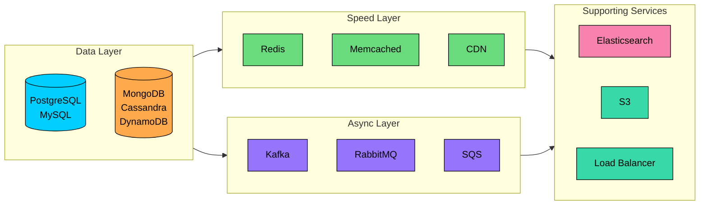

Think of it this way: your **data layer** is the source of truth. Your **speed layer** makes things fast. Your **async layer** decouples and buffers. And **supporting services** handle specialized needs like search, file storage, and traffic distribution.

Let's explore each category.

---

# 1. Relational Databases

Relational databases are the workhorses of most applications. When your data has clear structure, relationships matter, and you need transactions that actually work, this is where you start.

## PostgreSQL

<!-- Icon: devicon:postgresql -->

If I had to pick one database to recommend for most applications, it would be PostgreSQL. It's the Swiss Army knife of databases: powerful enough for complex analytics, reliable enough for financial transactions, and flexible enough to handle JSON when you need it.

#### **What makes PostgreSQL stand out:**

PostgreSQL does everything a relational database should do, and then some. Full ACID compliance means your transactions actually behave correctly. MVCC (Multi-Version Concurrency Control) means readers don't block writers. But where PostgreSQL really shines is in its advanced features:

- **Rich data types:** Native support for JSON, arrays, and even custom types. Need to store a user's preferences as JSON while keeping their core profile relational" PostgreSQL handles both.
- **Powerful indexing:** Beyond basic B-trees, you get GIN indexes for full-text search and array containment, GiST indexes for geometric data, and partial indexes for when you only care about a subset of rows.
- **Extensibility:** PostGIS turns PostgreSQL into a geospatial database. TimescaleDB turns it into a time-series database. The extension ecosystem is massive.

#### **Reach for PostgreSQL when:**

- Your data has relationships and you need JOINs
- Transactions must be reliable (e-commerce, banking, inventory)
- You need complex queries or reporting
- You want one database that can handle multiple data patterns

#### **Think twice when:**

- You need to scale writes to millions per second (sharding PostgreSQL is possible but painful)
- Your access pattern is purely key-value lookups at massive scale
- You need linear horizontal scaling as a primary feature

> 💡 **Key Insight:**

> **DISCUSSION**
>
> **In interviews:** PostgreSQL is the safe default. When the interviewer asks about your database choice for structured data, start here. You can always explain when you'd move to NoSQL, but PostgreSQL handles more use cases than most people realize.

---

## MySQL

<!-- Icon: devicon:mysql -->

MySQL is everywhere. It powers much of the web, from WordPress blogs to major internet companies. While PostgreSQL is feature-rich, MySQL is battle-tested and simple.

#### **Why MySQL still matters:**

MySQL's strength is its simplicity and proven track record. The InnoDB storage engine provides solid ACID transactions. Read replicas are straightforward to set up. The ecosystem is enormous: every language has mature MySQL drivers, every cloud offers managed MySQL, and every ops team knows how to run it.

For read-heavy web applications with straightforward data patterns, MySQL just works. It's not trying to be everything. It's trying to be a reliable, fast relational database, and it succeeds at that.

#### **MySQL vs PostgreSQL:**

| Dimension | MySQL | PostgreSQL |
|--------|-------|------------|
| Simple reads | Faster | Slightly slower |
| Complex queries | Limited optimizer | Sophisticated optimizer |
| JSON support | Functional | First-class |
| Replication | Simple, mature | More flexible, more complex |
| Extensions | Limited | Extensive ecosystem |
| Learning curve | Gentler | Steeper |

#### **Which to choose"**

Here's my honest take: for new projects, I lean toward PostgreSQL. Its feature set is broader, and you're less likely to outgrow it. But MySQL is a perfectly valid choice, especially if your team knows it well, your use case is straightforward, or you're working with existing MySQL infrastructure.

In interviews, either is fine. What matters is that you can explain your reasoning. "I'd use MySQL because this is a read-heavy workload with simple queries, and our team has strong MySQL experience" is a good answer.

---

# 2. NoSQL Databases

NoSQL is a broad category, and "NoSQL" alone doesn't tell you much. The real question is: what type of NoSQL" Document stores, wide-column stores, and key-value stores solve different problems. 

Understanding which to use when is what separates informed technology choices from buzzword bingo.

## MongoDB

<!-- Icon: devicon:mongodb -->

MongoDB is what most people think of when they hear "NoSQL." It stores data as JSON-like documents, making it natural for applications that already think in JSON.

#### **Why MongoDB works:**

The document model is intuitive. A user profile isn't just a row in a table. It's a document with nested addresses, preferences, and order history. In a relational database, that's multiple tables and JOINs. In MongoDB, it's one document you read in a single query.

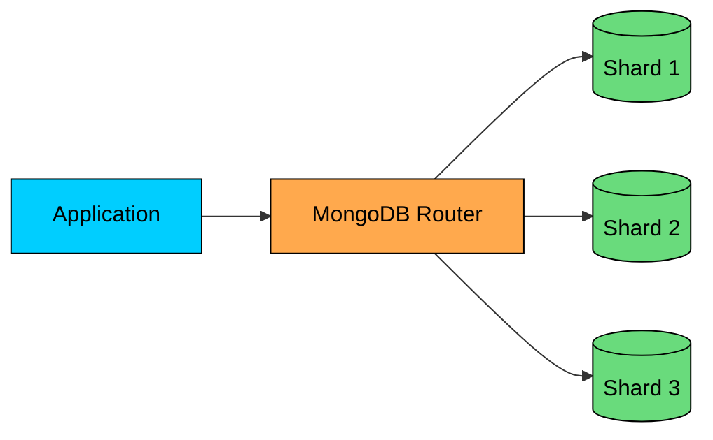

MongoDB shards automatically by a shard key you choose. Each shard is itself a replica set for high availability. This gives you horizontal scaling with automatic failover.

#### **MongoDB shines when:**

- Your data is naturally document-shaped (articles, products, user profiles)
- Schema evolves frequently (startup environment, rapid iteration)
- You need horizontal scaling without giving up rich queries
- Your access patterns read/write complete documents

#### **MongoDB struggles when:**

- You have truly relational data with complex cross-document relationships
- You need multi-document transactions constantly (MongoDB supports them, but they're expensive)
- Strong consistency is more important than availability

> 💡 **Key Insight:**

> **TIP**
>
> #### **Interview tip**
>
> MongoDB is a good choice for content management systems, product catalogs, and user profiles. Mention it when you see document-shaped data that doesn't have complex relationships.

---

## Cassandra

<!-- Icon: devicon:cassandra -->

Cassandra is built for one thing: massive scale with high availability. If you need to handle millions of writes per second across multiple data centers with no single point of failure, Cassandra is purpose-built for that.

#### **Why Cassandra exists:**

Cassandra was born at Facebook to solve their inbox search problem, then open-sourced and adopted by companies like Netflix, Apple, and Instagram. It's designed around the assumption that at massive scale, nodes will fail constantly, and the system must keep running regardless.

Every node is equal. There's no master. Data is automatically distributed using consistent hashing, and you can tune how many nodes must acknowledge a write (consistency level).

Need strong consistency" Require a quorum. Need maximum availability" Accept a single acknowledgment.

#### **Cassandra is the right choice when:**

- You have a write-heavy workload (Cassandra excels at writes)
- You're dealing with time-series data (logs, metrics, IoT sensor data)
- You need multi-region deployment with local writes
- Your scale is truly massive (petabytes of data, millions of operations per second)

#### **Cassandra is the wrong choice when:**

- You need complex queries with JOINs (Cassandra doesn't support them)
- Your data model requires frequent updates to existing rows (deletes and updates create tombstones)
- You need strong consistency as the default (Cassandra favors availability)
- Your dataset is small (Cassandra's overhead isn't worth it for modest scale)

> 💡 **Key Insight:**

> **TIP**
>
> #### **Interview tip**
>
> Mention Cassandra specifically for time-series data, logging systems, or IoT platforms. It's also a strong choice for anything requiring multi-region writes with high availability.

---

## DynamoDB

<!-- Icon: devicon:dynamodb -->

DynamoDB is AWS's fully managed NoSQL offering. You don't manage servers, replication, or scaling. You create a table, specify your capacity (or let it auto-scale), and AWS handles everything else.

#### **The DynamoDB proposition:**

DynamoDB trades flexibility for operational simplicity. You get single-digit millisecond latency at any scale, automatic replication across availability zones, and zero infrastructure to manage. The cost is that you're locked into AWS and must design your data model around DynamoDB's constraints.

Those constraints are significant. DynamoDB is essentially a key-value store with some document features. You have a partition key (and optionally a sort key), and queries are fast only when you know the keys. 

Want to query by an arbitrary field" You need a secondary index. Want complex aggregations" You're better off with something else.

#### **DynamoDB makes sense when:**

- You're building on AWS and want zero database ops
- Your access patterns are key-based (get user by ID, get orders by user_id + date)
- You need predictable latency regardless of scale
- Session storage, shopping carts, user preferences, gaming leaderboards

#### **DynamoDB doesn't make sense when:**

- You need complex queries or ad-hoc analytics
- Vendor lock-in is a concern
- Your access patterns aren't well-defined upfront (DynamoDB requires you to design for your queries)
- Cost predictability matters more than ops simplicity (DynamoDB pricing can surprise you)

> 💡 **Key Insight:**

> **TIP**
>
> #### **Interview tip**
>
> Mention DynamoDB for serverless architectures or when operational simplicity is paramount. It's a natural fit for AWS Lambda-based systems and mobile app backends.

## Choosing Between NoSQL Databases

Here's a decision framework:

```mermaid
flowchart TD
    A[Need NoSQL"]:::primary --> B{What's the data shape"}
    B -->|Documents with queries| C[MongoDB]:::orange
    B -->|Key-value lookups| D{Managed or self-hosted"}
    B -->|Time-series / Write-heavy| E[Cassandra]:::green

    D -->|Managed on AWS| F[DynamoDB]:::purple
    D -->|Self-hosted / Multi-cloud| G[Redis / Cassandra]:::purple

    classDef primary fill:#00ceff,stroke:#000,color:#000
    classDef orange fill:#ffa94d,stroke:#000,color:#000
    classDef green fill:#69db7c,stroke:#000,color:#000
    classDef purple fill:#9775fa,stroke:#000,color:#000
```

| Database | Best For | Avoid When |
|----------|----------|------------|
| **MongoDB** | Documents, evolving schemas, rich queries | Complex transactions, strict consistency |
| **Cassandra** | Write-heavy, time-series, multi-region | Ad-hoc queries, small datasets |
| **DynamoDB** | Serverless, AWS-native, zero-ops | Vendor lock-in concerns, complex queries |

---

# 3. Caching Technologies

Caching is how you make slow things fast. Your database might take 50ms to answer a query. Redis answers in under a millisecond. At thousands of requests per second, that difference is the gap between a responsive application and a frustrating one.

## Redis

<!-- Icon: devicon:redis -->

Redis is the caching technology you'll reach for most often. It's technically an "in-memory data structure store," but that undersells it. Redis is a Swiss Army knife that handles caching, session storage, rate limiting, leaderboards, pub/sub messaging, and more.

#### **Why Redis dominates:**

Redis isn't just fast. It's fast AND versatile. While a simple cache stores strings, Redis gives you:

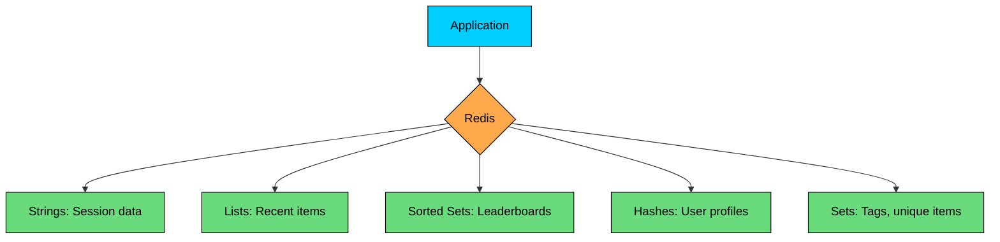

Each data structure solves specific problems elegantly:

- **Sorted Sets** are perfect for leaderboards. Store user scores, and Redis keeps them sorted automatically. Getting the top 100" One command.
- **Sets** give you O(1) membership tests. Perfect for "has this user already voted"" checks.
- **Hashes** let you store objects without serialization overhead. Update one field without reading/writing the whole object.
- **Streams** (newer addition) support event streaming with consumer groups, similar to Kafka but simpler.

Redis also supports persistence (RDB snapshots, append-only log), replication (master-replica), and clustering (sharding across nodes). It's not just a cache; it can be your primary data store for the right use cases.

#### **Redis is the default choice for:**

- Caching database queries
- Session storage
- Rate limiting (using sorted sets or Lua scripts)
- Leaderboards and rankings
- Real-time counters and analytics
- Distributed locks
- Pub/sub messaging (simple cases)

> 💡 **Key Insight:**

> **TIP**
>
> #### **Interview tip**
>
> When you say "cache," interviewers expect you to say "Redis." But go further. Mention specific data structures. "I'd use a Redis sorted set for the leaderboard because it automatically maintains order and supports efficient range queries" shows depth.

---

## Memcached

<!-- Icon: devicon:memcached -->

Memcached is the simpler, older alternative to Redis. It does one thing: fast key-value caching. No data structures, no persistence, no pub/sub. Just keys and values, extremely fast.

#### **When would you pick Memcached over Redis"**

In practice, Redis is almost always the better choice. But Memcached still has its place:

- **Multi-threaded:** Memcached uses multiple threads, so it can utilize multiple CPU cores directly. Redis is single-threaded (though Redis 6+ has I/O threading). For pure caching with massive throughput, Memcached can be more efficient.
- **Memory efficiency:** Memcached has lower memory overhead per key. If you're storing billions of small values and every byte matters, Memcached wins.
- **Simplicity:** Less can go wrong. Memcached is just a cache. It doesn't try to be a database or message broker.

#### **Redis vs Memcached at a glance:**

| Aspect | Redis | Memcached |
|--------|-------|-----------|
| Data structures | Rich (lists, sets, hashes, sorted sets) | Key-value only |
| Persistence | Yes (RDB, AOF) | No |
| Replication | Yes | No |
| Clustering | Yes | Client-side sharding |
| Threading | Single-threaded core | Multi-threaded |
| Memory overhead | Higher | Lower |
| Use cases | Caching + more | Pure caching |

**The honest recommendation:** Start with Redis. It does everything Memcached does plus much more. Only consider Memcached if you have a specific performance reason and don't need Redis's features.

---

# 4. Message Queues and Streaming

This category often confuses candidates because there are two fundamentally different models: **message queues** (work distribution) and **event streaming** (event logs). Kafka and RabbitMQ look similar at first glance, but they solve different problems.

## Apache Kafka

<!-- Icon: skill-icons:kafka -->

Kafka isn't really a message queue. It's a distributed commit log. Messages are written to an append-only log, and consumers read from that log at their own pace. Messages aren't deleted when consumed; they stay in the log until they age out.

#### **Why this matters:**

This log-based model enables powerful patterns:

- **Replay:** A new consumer can start from the beginning and process all historical events.
- **Multiple consumers:** Different consumer groups read the same topic independently. The analytics team and the billing team can both process orders.
- **Event sourcing:** The log becomes the source of truth. You can reconstruct state by replaying events.

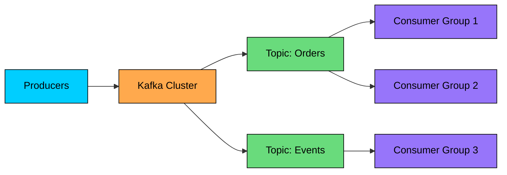

#### **Kafka's architecture:**

Topics are divided into **partitions** for parallelism. Each partition is an ordered log. Within a **consumer group**, each partition is consumed by exactly one consumer, allowing parallel processing while maintaining order within a partition.

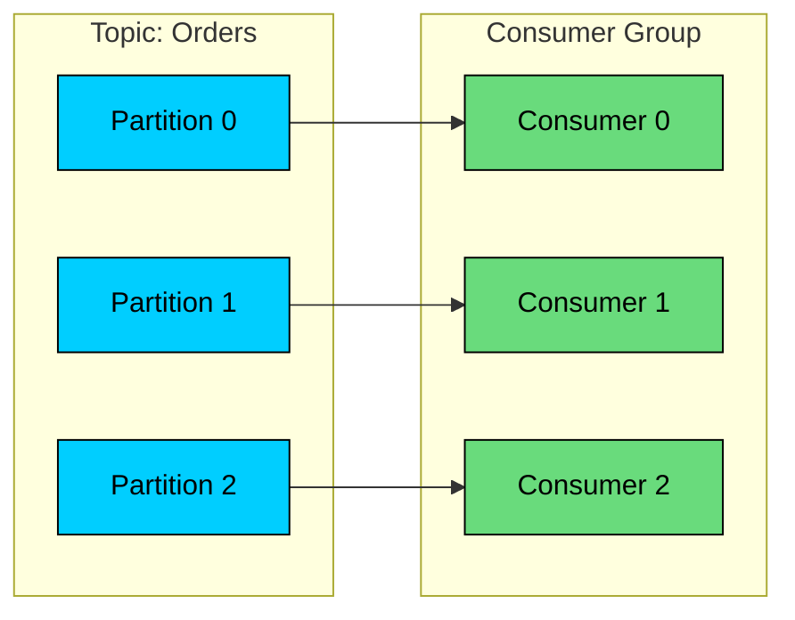

#### **Kafka is the right choice when:**

- You need event streaming or event sourcing
- Multiple systems need to react to the same events
- You need message replay (auditing, debugging, rebuilding state)
- Throughput requirements are massive (millions of events per second)
- You're building real-time data pipelines

#### **Kafka is overkill when:**

- You just need a simple task queue (use RabbitMQ or SQS)
- Message volume is low
- You don't need replay or multiple consumer groups

> 💡 **Key Insight:**

> **TIP**
>
> #### **Interview tip**
>
> Mention Kafka for event-driven architectures, analytics pipelines, and activity feeds. Be ready to explain partitions and consumer groups.

---

## RabbitMQ

<!-- Icon: devicon:rabbitmq -->

RabbitMQ is a traditional message broker. Unlike Kafka's log-based model, RabbitMQ is designed for task distribution: send a message, exactly one consumer processes it, message is deleted.

#### **When RabbitMQ shines:**

RabbitMQ excels at work distribution. You have tasks (resize images, send emails, process payments), and you want to distribute them across workers. RabbitMQ handles the queuing, acknowledgments, retries, and dead-letter handling.

It also supports sophisticated routing. With exchanges and bindings, you can route messages based on patterns, headers, or topics. Need to send order messages to both the billing queue and the shipping queue" RabbitMQ handles that elegantly.

#### **RabbitMQ vs Kafka:**

| Aspect | RabbitMQ | Kafka |
|--------|----------|-------|
| Mental model | Smart broker, simple consumers | Dumb broker, smart consumers |
| Message fate | Deleted after acknowledgment | Retained in log |
| Multiple consumers | Competing (one wins) | Each group gets all messages |
| Ordering | Per queue | Per partition |
| Replay | No | Yes |
| Routing | Rich (exchanges, bindings) | Simple (topics) |
| Best for | Task queues, RPC | Event streaming, logs |

**The simple rule:** If you need work distribution (one message = one task for one worker), use RabbitMQ. If you need event streaming (one event potentially processed by many systems), use Kafka.

---

## Amazon SQS

<!-- Icon: logos:aws-sqs -->

SQS is AWS's managed queue service. It's the simplest option if you're on AWS and just need a reliable queue without managing infrastructure.

#### **Why SQS makes sense:**

Zero ops. No servers to manage, no clusters to configure, no ZooKeeper to babysit. You create a queue, send messages, receive messages. AWS handles availability, durability, and scaling.

SQS offers two queue types:

- **Standard queues:** Maximum throughput, best-effort ordering, at-least-once delivery
- **FIFO queues:** Exactly-once processing, strict ordering, lower throughput (3,000 messages/second with batching)

#### **SQS is the right choice when:**

- You're building on AWS and want zero infrastructure management
- Your queuing needs are straightforward (no complex routing)
- You value simplicity over control
- FIFO queues meet your ordering needs

#### **SQS is limiting when:**

- You need complex routing (RabbitMQ is better)
- You need message replay (Kafka is better)
- Multi-cloud is a requirement

#### **Choosing between message technologies:**

| Need | Technology |
|------|------------|
| Event streaming, replay, multiple consumers | Kafka |
| Task distribution, complex routing | RabbitMQ |
| Simple queuing on AWS, zero ops | SQS |
| Simple queuing on GCP | Cloud Pub/Sub |

---

# 5. Search Technologies

When someone types "blue running shoes size 10" into a search box, your relational database isn't going to cut it. Full-text search requires specialized technology that understands relevance, typos, synonyms, and ranking.

## Elasticsearch

<!-- Icon: devicon:elasticsearch -->

Elasticsearch is the dominant player in search. Built on Apache Lucene, it provides full-text search, analytics, and a powerful query language, all accessible via a REST API.

#### **Why you need Elasticsearch:**

Your PostgreSQL database can do basic search with LIKE queries, but it struggles with:

- Relevance ranking (which results are most relevant")
- Fuzzy matching (user types "shoees" but means "shoes")
- Faceted search (filter by brand, price range, size simultaneously)
- Auto-complete (suggest "running shoes" as user types "run")
- Synonyms (searching "laptop" should find "notebook")

Elasticsearch handles all of this natively.

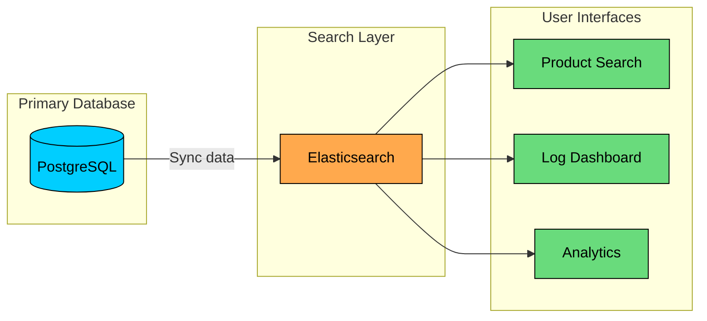

**The typical pattern:** Your primary database (PostgreSQL, MongoDB) is the source of truth. You sync data to Elasticsearch for search. Users search against Elasticsearch, then fetch full records from the primary database.

#### **Common Elasticsearch use cases:**

- **Product search:** E-commerce sites use Elasticsearch for search with filters, facets, and ranking.
- **Log analytics:** The ELK stack (Elasticsearch, Logstash, Kibana) is the standard for aggregating and searching application logs.
- **Application search:** Any search box in your application probably should use Elasticsearch.
- **Auto-complete:** Type-ahead suggestions with fuzzy matching.

#### **Elasticsearch considerations:**

Elasticsearch is **not** a primary database. It sacrifices durability and consistency for search performance. Always use it alongside a primary data store.

It also has a learning curve. The query DSL is powerful but complex. Indexing strategies, mapping types, and shard configuration require thought.

> 💡 **Key Insight:**

> **TIP**
>
> #### **Interview tip**
>
> Mention Elasticsearch whenever search comes up: product catalogs, autocomplete, log analytics. Note that you'd use it alongside a primary database, not as a replacement.

---

# 6. Object Storage

Your database stores structured data. But what about profile pictures, uploaded documents, video files, and backups" That's where object storage comes in.

## Amazon S3

<!-- Icon: logos:aws-s3 -->

S3 has become synonymous with object storage. It's the default answer when someone asks "where do we store files"" in any cloud architecture.

#### **Why S3 dominates:**

S3 offers effectively unlimited storage with remarkable durability: 99.999999999% (11 nines). That's designed to lose less than one object per 10 million objects over 10,000 years. For practical purposes, data in S3 doesn't disappear.

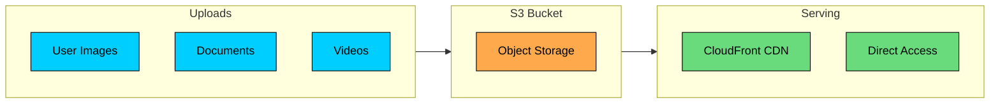

#### **S3 storage classes save money:**

Not all data is accessed equally. S3 offers storage classes that trade access speed for cost:

| Storage Class | Access Pattern | Relative Cost |
|--------------|----------------|---------------|
| Standard | Frequent access | $$$$ |
| Intelligent-Tiering | Unknown/changing patterns | $$$ (auto-moves) |
| Standard-IA | Infrequent access | $$ |
| Glacier Instant | Archive, instant retrieval | $ |
| Glacier Deep Archive | Archive, hours to retrieve | ¢ |

**Lifecycle policies** automate transitions. For example: after 30 days, move to IA. After 90 days, move to Glacier. After 7 years, delete.

#### **Common S3 patterns:**

- **User uploads:** Profile pictures, documents, attachments. Generate pre-signed URLs so users upload directly to S3, bypassing your servers.
- **Static assets:** Host your website's images, CSS, and JavaScript in S3, served via CloudFront.
- **Backups:** Database dumps, application backups, disaster recovery.
- **Data lakes:** Raw data storage for analytics pipelines.

> 💡 **Key Insight:**

> **TIP**
>
> #### **Interview tip**
>
> S3 is the default for any file storage. Mention CDN integration for serving user-facing content and lifecycle policies for cost optimization.

---

## HDFS (Hadoop Distributed File System)

HDFS is specialized for big data. If you're processing terabytes or petabytes with Hadoop, Spark, or similar frameworks, HDFS is purpose-built for that.

Unlike S3 (which is accessed over HTTP), HDFS provides high-throughput access for batch processing workloads. It shines when you need to process massive files with frameworks that expect a distributed filesystem.

**When to mention HDFS in interviews:** Big data pipelines, batch processing at massive scale, data warehousing. For general file storage, S3 is the better answer.

---

# 7. Load Balancers

When you have multiple servers, you need something to distribute traffic between them. That's your load balancer. But there's more to the choice than just "use a load balancer."

## Layer 4 vs Layer 7 Load Balancing

The key distinction is what layer of the network stack the load balancer understands:

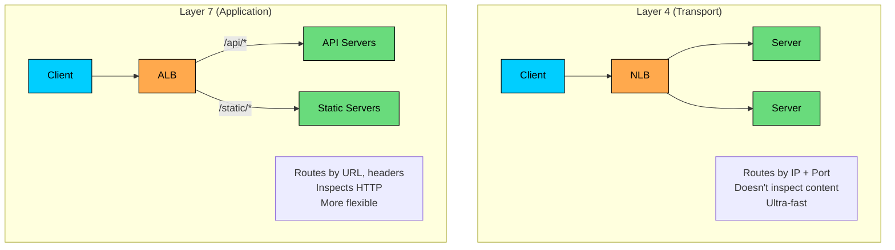

**Layer 4 (NLB, HAProxy in TCP mode):** Routes based on IP address and port. Doesn't understand HTTP. Extremely fast, handles millions of connections. Use for non-HTTP protocols (databases, game servers) or when you need maximum performance.

**Layer 7 (ALB, Nginx, HAProxy in HTTP mode):** Understands HTTP. Can route based on URL paths, headers, or cookies. Can do SSL termination, add headers, rewrite URLs. More flexible but slightly slower.

## Nginx

<!-- Icon: devicon:nginx -->

Nginx is the workhorse for many organizations. It's a web server, reverse proxy, and load balancer in one package.

#### **Nginx is the go-to when you need:**

- HTTP load balancing with flexible routing
- SSL termination
- Static file serving
- Rate limiting
- Caching at the edge
- Custom request/response manipulation

For simpler setups or when you want full control, Nginx is often the answer.

## Cloud Load Balancers

If you're on AWS, GCP, or Azure, their managed load balancers are often the simplest choice:

| Cloud | Layer 7 | Layer 4 |
|-------|---------|---------|
| AWS | ALB (Application LB) | NLB (Network LB) |
| GCP | HTTP(S) Load Balancing | TCP/UDP Load Balancing |
| Azure | Application Gateway | Azure Load Balancer |

---

# 8. CDN (Content Delivery Network)

A CDN caches your content on servers distributed globally. Instead of every user hitting your origin in Virginia, users hit the nearest edge location, which might be in their city.

### Why CDN Matters

The speed of light is fixed. A user in Tokyo requesting data from a server in New York has a minimum ~100ms network latency. There's no software optimization that can fix physics.

A CDN puts cached copies of your content on edge servers worldwide. Now that Tokyo user hits a Tokyo edge server with ~10ms latency.

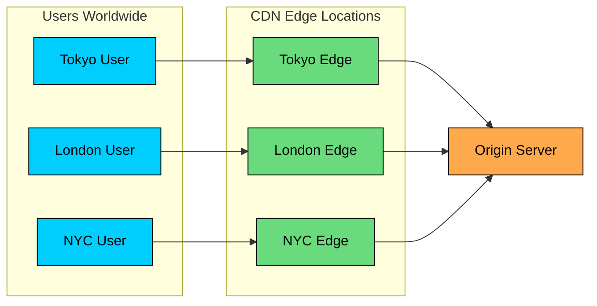

## CloudFront vs Cloudflare

**CloudFront** is AWS's CDN. If you're on AWS, it integrates seamlessly with S3, ALB, and other AWS services. Lambda@Edge lets you run code at edge locations.

**Cloudflare** is a CDN-plus-more. Beyond caching, it provides DDoS protection, a Web Application Firewall (WAF), DNS services, and Workers for edge computing. Many companies use Cloudflare even if they're on AWS.

> 💡 **Key Insight:**

> **TIP**
>
> #### **Interview tip**
>
> Mention CDN whenever you're serving static content to a global audience. Pair S3 with CloudFront for static assets. Mention DDoS protection as a side benefit.

---

# 9. Container Orchestration

Containers have become the standard way to package and deploy applications. But running containers at scale requires orchestration: scheduling, scaling, healing, and networking. That's where Kubernetes comes in.

## Docker (The Container Runtime)

Docker packages your application and its dependencies into a container, which runs consistently across environments. No more "it works on my machine" problems.

You don't need deep Docker knowledge for system design interviews, but understand the basics:

- **Image:** A snapshot of your application plus dependencies
- **Container:** A running instance of an image
- **Registry:** Where images are stored (Docker Hub, ECR, GCR)

## Kubernetes (The Orchestrator)

Kubernetes (K8s) manages containerized applications across a cluster of machines. It handles the operational concerns that become critical at scale.

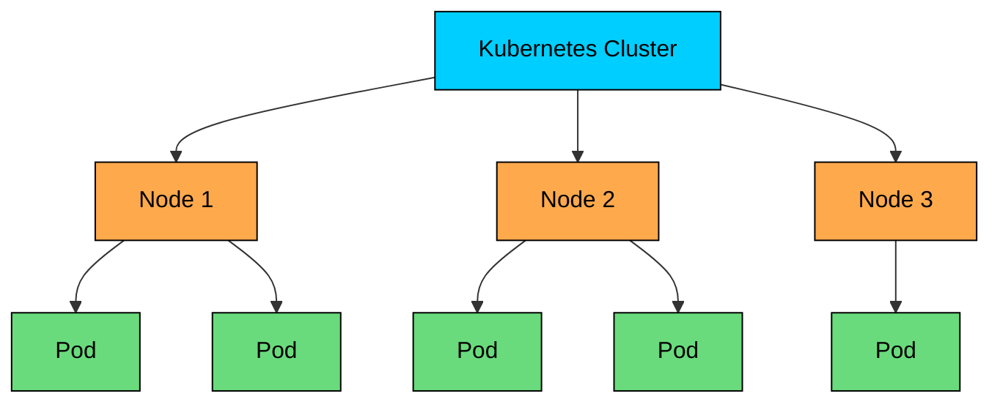

#### **What Kubernetes gives you:**

- **Scheduling:** Kubernetes decides which node runs each container based on resource requirements.
- **Scaling:** Define desired replicas, and Kubernetes maintains that count. Add auto-scaling based on CPU, memory, or custom metrics.
- **Self-healing:** If a container dies, Kubernetes restarts it. If a node fails, Kubernetes reschedules its workloads elsewhere.
- **Service discovery:** Services get DNS names. Pods find each other without hardcoded IPs.
- **Rolling updates:** Deploy new versions with zero downtime. Kubernetes gradually replaces old pods with new ones.

#### **Key concepts to know:**

- **Pod:** Smallest unit. Usually one container, sometimes tightly coupled containers.
- **Deployment:** Declares desired state (image, replicas). Kubernetes makes reality match.
- **Service:** Stable network endpoint for a set of pods.
- **Ingress:** Routes external HTTP traffic to services.

> 💡 **Key Insight:**

> **TIP**
>
> #### **Interview tip**
>
> You don't need to know Kubernetes internals for most system design interviews. Knowing that "we'd deploy this on Kubernetes for scaling, self-healing, and zero-downtime deployments" is usually enough. Go deeper only if specifically asked.

---

# 10. Monitoring and Observability

You can't fix what you can't see. In production, observability is how you understand what your system is actually doing: is it healthy, is it fast enough, and when something breaks, why"

### The Three Pillars

Modern observability combines three types of data:

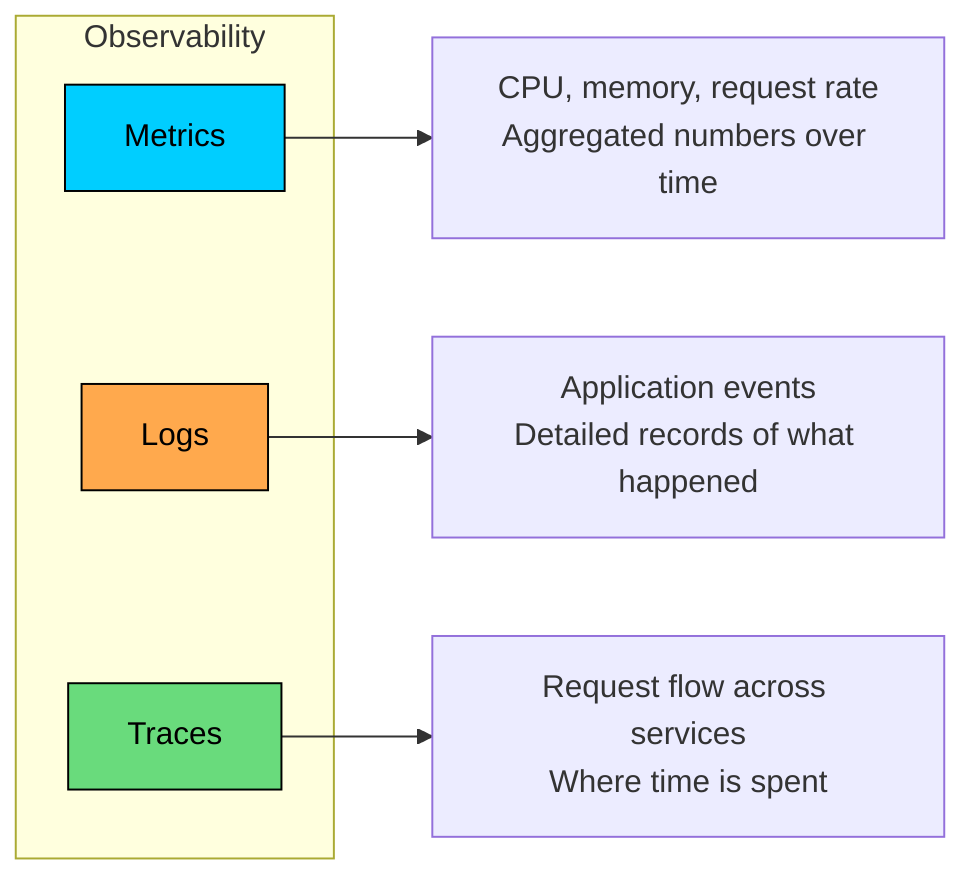

## Prometheus + Grafana

This combination is the standard for metrics in Kubernetes environments.

**Prometheus** collects and stores time-series metrics. It pulls metrics from your services (they expose an endpoint), stores them efficiently, and provides a powerful query language (PromQL) for analysis and alerting.

**Grafana** visualizes those metrics as dashboards. It connects to Prometheus (and many other data sources) and lets you build dashboards that show system health at a glance.

This stack is open-source, battle-tested, and runs everywhere. Most Kubernetes clusters come with Prometheus pre-configured.

## Managed Alternatives

**Datadog, New Relic, and Splunk** are commercial platforms that provide metrics, logs, and traces in one package. You pay more, but you get a unified experience and less operational burden.

**CloudWatch** (AWS) is the default for AWS services. It's basic but integrated.

> 💡 **Key Insight:**

> **TIP**
>
> #### **Interview tip**
>
> Mention monitoring as part of your design. "We'd expose Prometheus metrics from each service and set up Grafana dashboards for request latency, error rates, and resource utilization. Alerts would fire if p99 latency exceeds 500ms." This shows operational maturity.

---

# 11. API Gateway

An API gateway is the front door to your microservices. It's the single entry point that handles cross-cutting concerns so your services don't have to.

Instead of each service implementing authentication, rate limiting, and logging, the gateway handles it centrally:

- **Authentication/Authorization:** Validate tokens before requests reach services
- **Rate limiting:** Protect services from abuse
- **Request routing:** Route `/users/*` to the user service, `/orders/*` to the order service
- **SSL termination:** Handle HTTPS at the edge
- **Request transformation:** Add headers, rewrite paths
- **Logging and metrics:** Centralized request logging

## Options

**AWS API Gateway** is fully managed and integrates with Lambda and other AWS services. Good for serverless architectures.

**Kong** is open-source with an enterprise version. Feature-rich, runs anywhere.

**Ambassador/Emissary** is Kubernetes-native, built on Envoy.

For simpler cases, Nginx or your cloud's load balancer might be enough.

> 💡 **Key Insight:**

> **TIP**
>
> #### **Interview tip**
>
> In microservices designs, mention an API gateway for handling authentication and rate limiting centrally, rather than implementing these in every service.

---

# Technology Selection Framework

Choosing technologies isn't about memorizing which is "best." It's about matching tools to requirements. Here's a mental framework for making those decisions in interviews.

```mermaid
flowchart TD
    A[What are the requirements"]:::primary --> B{Primary Data Store"}

    B -->|Structured + Transactions| C[PostgreSQL]:::orange
    B -->|Documents + Flexibility| D[MongoDB]:::orange
    B -->|Massive writes + HA| E[Cassandra]:::orange
    B -->|Key-value + Zero ops| F[DynamoDB]:::orange

    A --> G{Need Speed"}
    G -->|Cache hot data| H[Redis]:::green
    G -->|Global static content| I[CDN + S3]:::green

    A --> J{Async Communication"}
    J -->|Task distribution| K[RabbitMQ / SQS]:::purple
    J -->|Event streaming| L[Kafka]:::purple

    A --> M{Special Needs"}
    M -->|Full-text search| N[Elasticsearch]:::pink
    M -->|File storage| O[S3]:::pink
    M -->|Real-time updates| P[WebSockets]:::pink

    classDef primary fill:#00ceff,stroke:#000,color:#000
    classDef orange fill:#ffa94d,stroke:#000,color:#000
    classDef green fill:#69db7c,stroke:#000,color:#000
    classDef purple fill:#9775fa,stroke:#000,color:#000
    classDef pink fill:#f783ac,stroke:#000,color:#000
```

## Questions to Ask

Before naming a technology, ask:

1. **What's the data model"** Relational tables, documents, key-value pairs, time-series"
2. **What are the access patterns"** Read-heavy, write-heavy, or balanced" Simple lookups or complex queries"
3. **What scale are we dealing with"** Thousands of users or millions" Gigabytes or petabytes"
4. **What consistency do we need"** Is eventual consistency acceptable, or do we need strong guarantees"
5. **What's the latency budget"** Milliseconds for interactive features, seconds for batch jobs"
6. **What's the operational burden"** Can the team manage this, or should we use a managed service"

---

# Quick Reference

When you're in an interview and need to quickly recall which technology to mention:

| Problem | Go-to Choice | Alternative |
|---------|------------|-------------|
| Relational data, transactions | PostgreSQL | MySQL |
| Document data, flexible schema | MongoDB | DynamoDB |
| Massive writes, time-series | Cassandra | TimescaleDB |
| Caching, leaderboards, sessions | Redis | Memcached |
| Task queue, work distribution | SQS / RabbitMQ | Redis (simple cases) |
| Event streaming, logs | Kafka | Pulsar, Kinesis |
| Full-text search | Elasticsearch | Algolia (managed) |
| File storage | S3 | GCS, Azure Blob |
| Load balancing (L7) | ALB / Nginx | HAProxy |
| CDN | CloudFront / Cloudflare | Akamai |
| Container orchestration | Kubernetes | ECS, Cloud Run |
| Metrics + Visualization | Prometheus + Grafana | Datadog |

---

# Key Takeaways

**Master the defaults.** Most designs use the same core technologies: PostgreSQL for relational data, Redis for caching, Kafka for event streaming, Elasticsearch for search, S3 for files. Know these well.

**Trade-offs are the point.** There's no universally "best" database or queue. Every choice involves trade-offs. The interviewer wants to see that you understand what you're trading away, not just what you're getting.

**Go deep on a few, wide on the rest.** You can't be an expert in everything. Pick 2-3 technologies you know deeply (probably PostgreSQL, Redis, and Kafka or RabbitMQ). For the rest, know enough to choose appropriately and explain why.

**Justify your choices.** "I'd use Redis" is weak. "I'd use Redis because we need sub-millisecond latency for session lookups and it gives us data structures like sorted sets that would be perfect for the leaderboard" shows understanding.

**Consider operations.** A technology that's theoretically perfect but operationally painful might not be the right choice. Managed services trade cost and lock-in for reduced operational burden. That's often a good trade.

**Stay practical.** Interview answers should reflect what you'd actually do in production. Don't over-engineer. Start with the simplest technology that meets requirements. You can always explain when you'd scale up.

---

# Quiz
