**Every system design decision is a tradeoff.**

Choose strong consistency and you sacrifice availability. Optimize for reads and writes become expensive. Pick a simple architecture and you limit future scalability.

Interviewers do not expect you to design perfect systems. They want to see that you understand these fundamental tensions and can reason through them intelligently.

In this chapter, I'll cover the **12 most important tradeoffs** you need to understand for system design interviews.

---

# 1. Consistency vs Availability (CAP Theorem)

> [!PAYWALL] This content is for premium members only.

The CAP theorem is the foundation of distributed systems tradeoffs. It states that during a network partition, you can only guarantee two of three properties:

- **Consistency (C):** Every read receives the most recent write
- **Availability (A):** Every request receives a response
- **Partition Tolerance (P):** The system continues operating despite network failures

> 💡 **Key Insight:**

> **NOTE**
>
> Network partitions are not optional. They will happen. Switches fail, cables get cut, data centers lose connectivity. So in practice, P is not really a choice. The real decision is what happens when a partition occurs. Do you favor consistency or availability"

### CP Systems (Consistency over Availability)

CP systems take a conservative stance: if they cannot guarantee the data is correct, they would rather refuse the request entirely. 

During a network partition, nodes that cannot communicate with the primary simply stop accepting writes. Some requests fail, but no request ever returns wrong data.

**Examples:** ZooKeeper, HBase, MongoDB (in certain configurations), etcd

#### **When to choose CP:**

- Financial transactions where incorrect data is worse than no data
- Inventory systems where overselling is unacceptable
- Leader election and distributed locking
- Configuration management

### AP Systems (Availability over Consistency)

AP systems take the opposite stance: always respond, even if you are not 100% sure the data is current. When a partition happens, each side of the split keeps accepting requests. Users get responses, but those responses might be based on slightly outdated information.

**Examples:** Cassandra, CouchDB, DynamoDB (default configuration)

#### **When to choose AP:**

- Social media feeds where showing a slightly stale post is acceptable
- Shopping carts where temporary inconsistency is tolerable
- DNS systems where availability is critical
- Caching layers

---

# 2. Latency vs Throughput

Latency and throughput seem like they should go hand in hand. Faster requests should mean more requests per second, right" Not always. 

These two metrics are often in tension, and understanding why helps you make better design decisions.

- **Latency:** How long it takes to complete a single request
- **Throughput:** How many requests you can process per unit time

### The Batching Tradeoff

The most common place this tension shows up is batching. You can process requests one at a time for the lowest possible latency, or you can batch them together for much higher throughput. You cannot do both.

**Consider a database write scenario:**

| ##### Approach | ##### Latency | ##### Throughput | ##### Resource Usage |
| --- | --- | --- | --- |
| Write each record immediately | ~5ms per record | 200 writes/sec | High (many small I/O ops) |
| Batch 100 records, write together | ~50ms per batch | 2000 writes/sec | Low (fewer large I/O ops) |

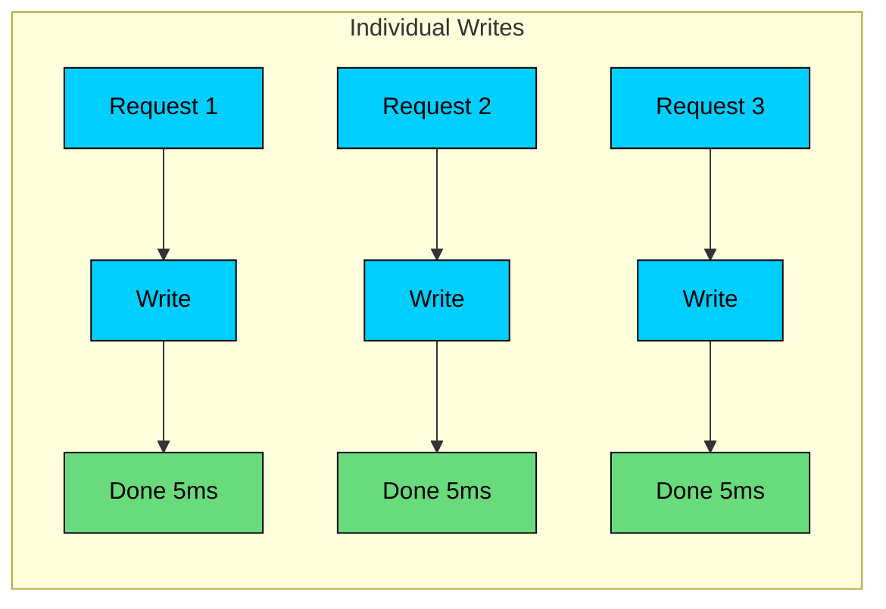

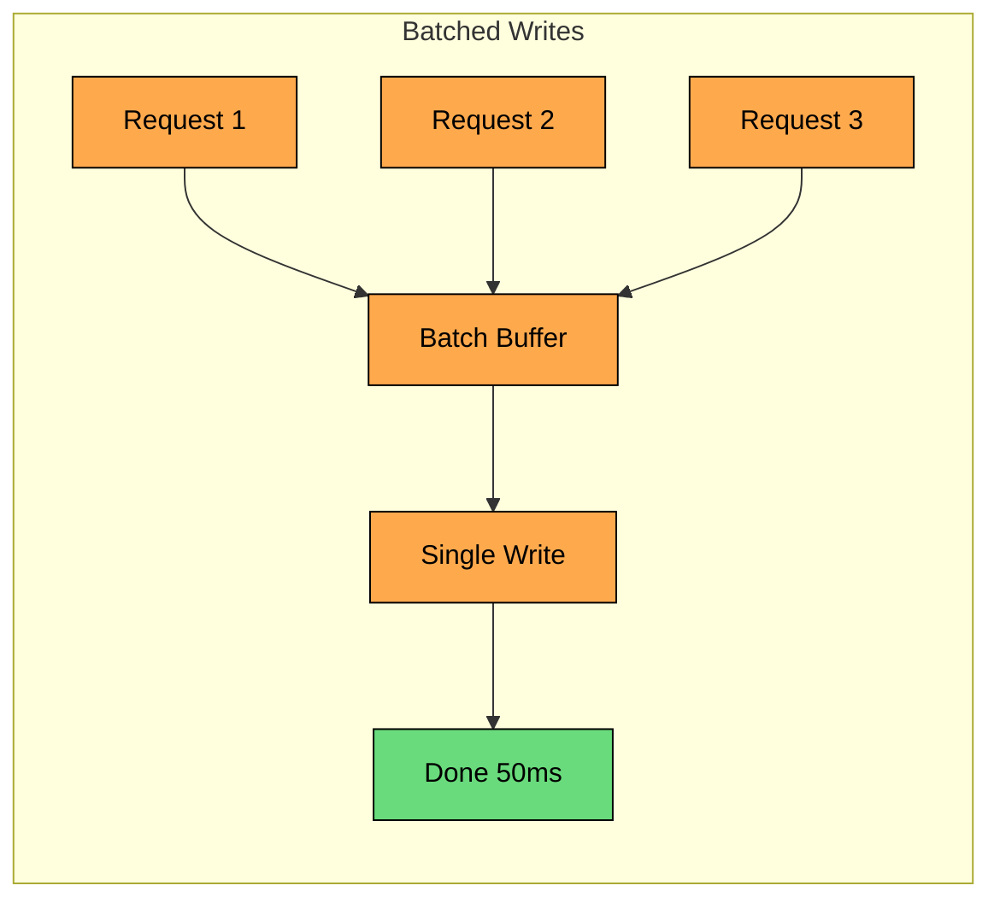

The math here is straightforward. Batching amortizes fixed costs, things like network round trips and disk seeks, across many requests. Your overall efficiency goes way up. But every individual request now has to wait for the batch to fill up or a timeout to trigger. The first request in the batch pays the full wait time.

### Queuing Theory

There is another, less obvious tension between latency and throughput. As your system gets busier, latency does not increase linearly. It increases exponentially.

At 50% utilization, things feel fine. At 80%, queues start building and latency creeps up. At 95%, the system feels sluggish even though technically everything is working. This is why experienced engineers never run systems at maximum capacity. You need headroom.

The practical implication: you cannot maximize both latency and throughput at the same time. Decide which one matters more for your use case and design accordingly.

### When to Optimize for Latency

- User-facing APIs where response time affects user experience
- Real-time gaming where delays break gameplay
- Trading systems where milliseconds matter
- Interactive search suggestions

### When to Optimize for Throughput

- Batch processing pipelines
- Log aggregation systems
- Data warehouse loading
- Background job processing
- Analytics pipelines

---

# 3. Read Optimization vs Write Optimization

One of the first questions you should ask about any system is: what is the read to write ratio" Because the answer fundamentally changes your design. Optimizing for reads makes writes more expensive, and vice versa. You have to pick a side.

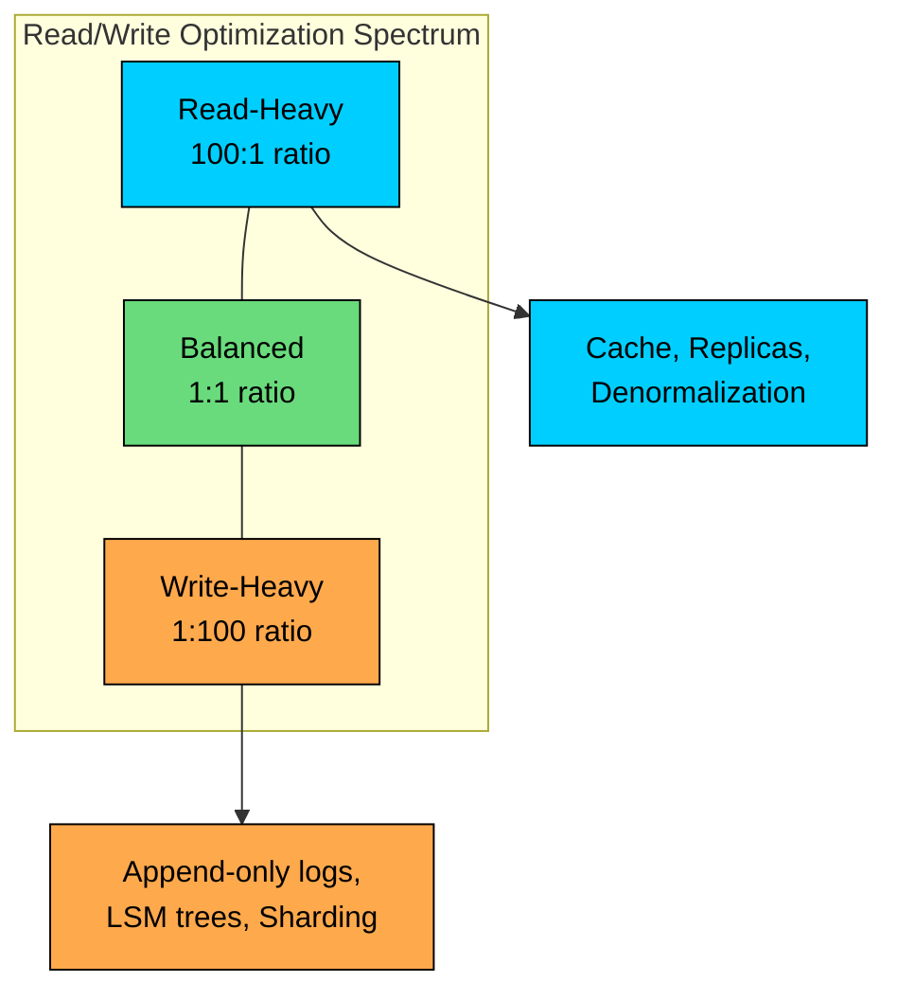

### Read-Heavy Optimization

When reads vastly outnumber writes, you should pay the cost on the write side to make reads cheap. The idea is simple: do work once when data changes rather than repeating that work on every read.

#### Common techniques include:

- **Caching:** Store computed results so you do not have to recalculate them
- **Read replicas:** Spread read traffic across multiple database copies
- **Denormalization:** Store data redundantly to avoid expensive joins
- **Pre-computation:** Calculate results ahead of time, before anyone asks for them
- **Fan-out on write:** When something changes, push updates to all the places that need them

> 💡 **Key Insight:**

> **TRADEOFF**
>
> The cost shows up on writes. Every write now has to update the cache, sync to replicas, update denormalized copies, recalculate pre-computed values, and fan out to feeds. A single write can trigger dozens of downstream operations.

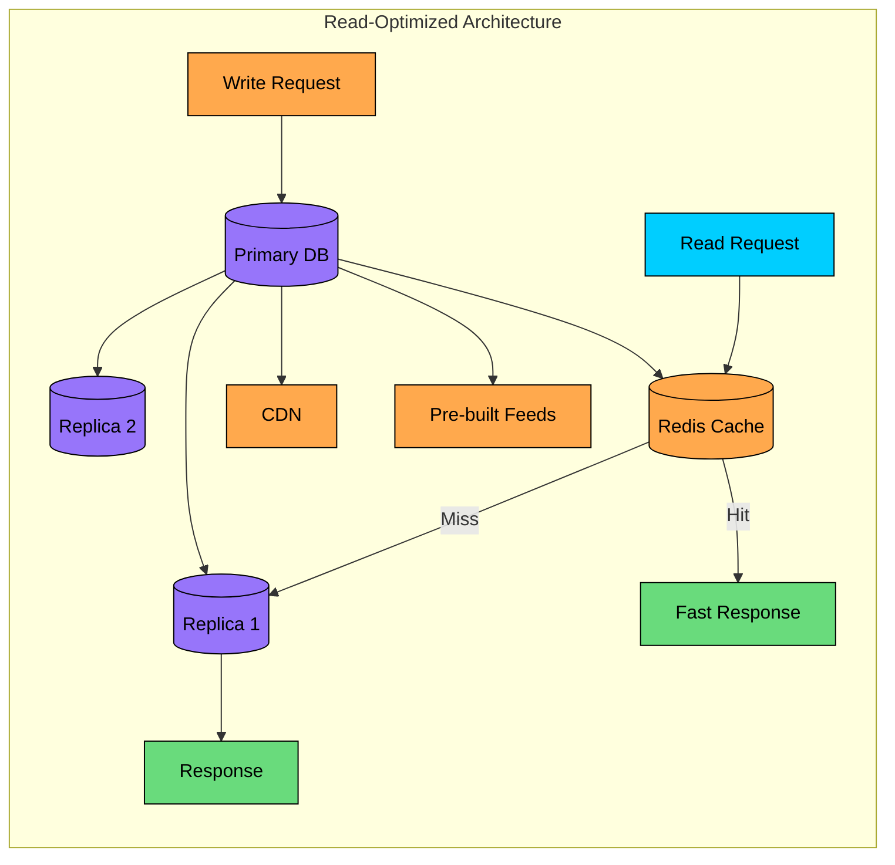

### Write-Heavy Optimization

When writes dominate, you flip the approach. Accept data as fast as possible and defer the hard work to read time.

#### **Common techniques include:**

- **Append-only logs:** Sequential writes are faster than random updates
- **LSM trees:** Buffer writes in memory, flush to disk periodically
- **Write sharding:** Distribute write load across partitions
- **Async processing:** Accept writes quickly, process later
- **Fan-out on read:** Compute results at read time instead of write time

> 💡 **Key Insight:**

> **TRADEOFF**
>
> The cost shows up on reads. You might have to aggregate data from multiple shards, perform joins that would have been avoided with denormalization, or compute results that could have been pre-calculated. Reads get slower and more resource-intensive.

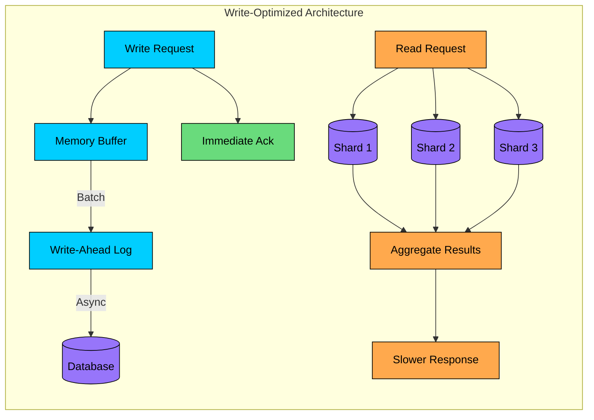

### Example: Twitter's Hybrid Approach

Twitter is a great case study because they hit both extremes. When a regular user with 200 followers posts, it is no big deal. When a celebrity with 50 million followers posts a tweet, the math changes dramatically.

```mermaid
flowchart LR
    subgraph Twitter["Twitter's Hybrid Fan-out"]
        Tweet[New Tweet]:::primary

        Tweet --> Check{Celebrity"<br/>>10K followers}

        Check -->|No| Push[Fan-out on Write]:::green
        Push --> T1[Timeline 1]:::green
        Push --> T2[Timeline 2]:::green
        Push --> T3[Timeline N]:::green

        Check -->|Yes| Store[Store Once]:::orange
        Store --> DB[(Tweet DB)]:::purple

        Read[User Views Timeline]:::primary
        Read --> Merge[Merge at Read Time]:::orange
        DB --> Merge
        T1 --> Merge
    end

    classDef primary fill:#00ceff,stroke:#000,color:#000
    classDef orange fill:#ffa94d,stroke:#000,color:#000
    classDef purple fill:#9775fa,stroke:#000,color:#000
    classDef green fill:#69db7c,stroke:#000,color:#000
```

**Pure fan-out on write:** Write the tweet to 50 million timelines. The write is painfully slow, but every follower has an instantly ready timeline.

**Pure fan-out on read:** Store the tweet once. When someone loads their timeline, pull in tweets from everyone they follow. The write is instant, but timeline loads get expensive.

Neither extreme works well for Twitter. Their solution is to use both approaches based on the user. Regular users get fan-out on write because the cost is reasonable. Celebrities get fan-out on read because pushing to 50 million timelines is too slow. When you load your timeline, the system merges pre-computed results from regular users with on-demand fetches for celebrities.

---

# 4. SQL vs NoSQL

This debate often gets framed as old versus new, or traditional versus modern. That framing misses the point entirely. SQL and NoSQL databases make fundamentally different tradeoffs. Neither is inherently better. They are optimized for different things.

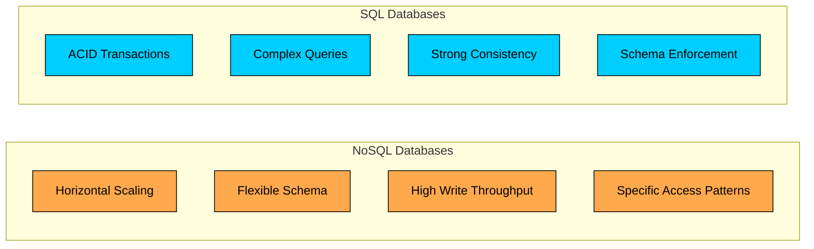

### SQL Databases

SQL databases are built around a simple idea: your data has structure, and the database should enforce it. This gives you some powerful guarantees.

#### **What you get:**

- ACID transactions that ensure data integrity even when things go wrong
- Rich query capabilities including joins, aggregations, and ad-hoc queries
- Strong consistency by default
- Decades of tooling, optimization, and battle-tested reliability
- Schema enforcement that catches bugs before they corrupt your data

#### **What you give up:**

- Horizontal scaling is hard. Sharding a SQL database is painful.
- Schema changes require migrations, which can be disruptive
- Unstructured or rapidly evolving data does not fit naturally
- Joins get expensive as your data grows

**Best for:** Financial systems, e-commerce transactions, applications with complex queries, and anything where data integrity is non-negotiable.

### NoSQL Databases

NoSQL databases started from a different premise: what if we gave up some of SQL's guarantees in exchange for easier scaling and more flexibility"

#### **What you get:**

- Horizontal scaling that was designed in from the start
- Flexible schemas that adapt as your product evolves
- High write throughput for ingesting large volumes of data
- Geographic distribution across data centers
- Query patterns optimized for specific access patterns

#### **What you give up:**

- Rich query capabilities. You often have to know your access patterns in advance.
- Strong consistency. Eventual consistency adds complexity to your application.
- Standardization. Every NoSQL database has its own query language and semantics.
- Maturity. The tooling is improving but still behind SQL in many areas.

**Best for:** High-volume logging, time-series data, content management, real-time analytics, and systems where you can predict your access patterns.

### Types of NoSQL and Their Tradeoffs

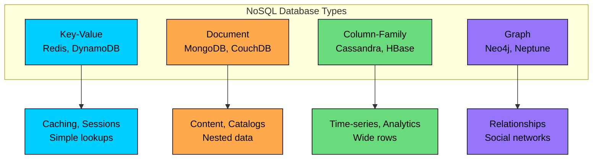

| ##### Type | ##### Examples | ##### Best For | ##### Tradeoff |
| --- | --- | --- | --- |
| Key-Value | Redis, DynamoDB | Caching, sessions | No complex queries |
| Document | MongoDB, CouchDB | Content, catalogs | No joins |
| Column-Family | Cassandra, HBase | Time-series, analytics | Complex data modeling |
| Graph | Neo4j, Neptune | Relationships | Limited to graph queries |

### When to Use Both

Many production systems use both SQL and NoSQL. The question is not which one is better. It is which one is better for which part of your system.

Use SQL for transactional data (orders, payments) and NoSQL for high-volume reads (product catalogs, user activity).

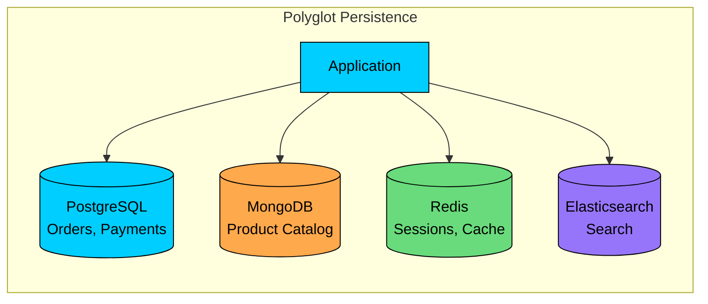

---

# 5. Strong Consistency vs Eventual Consistency

Most candidates think of consistency as a binary choice: you either have it or you do not. The reality is more nuanced. Consistency exists on a spectrum, and picking the right point on that spectrum is one of the most important decisions you will make.

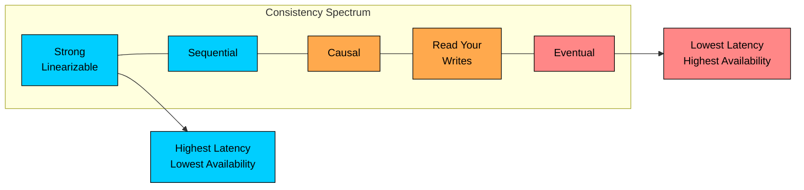

### Strong Consistency

With strong consistency, every read returns the most recent write. Period. No matter which server you talk to, you see the same data. All nodes agree on the current state at all times.

#### **How it works:**

The system waits. When you write data, the write does not complete until all replicas have acknowledged. Only then does the system tell you the write succeeded.

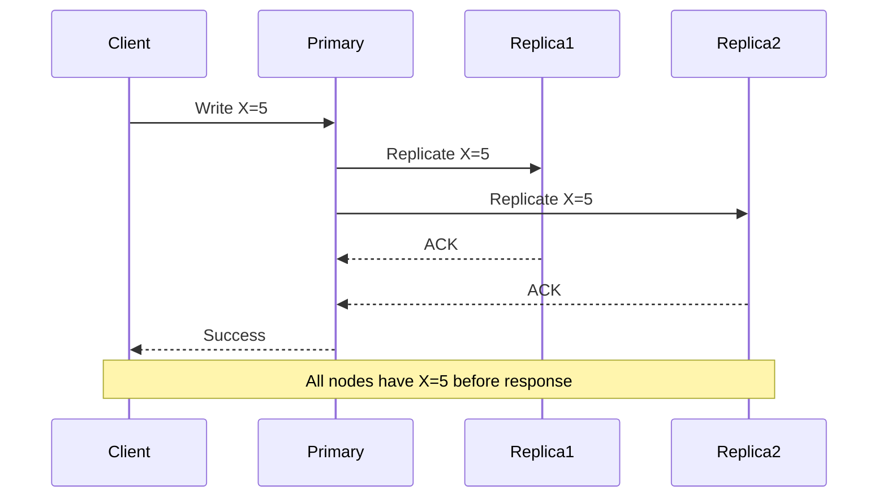

#### **Cost:**

- Higher latency because you wait for the slowest replica
- Lower availability because a single replica being down can block writes
- Higher coordination overhead across your cluster

#### **Use strong consistency when:**

- Incorrect data causes real harm. Think financial transactions where double-charging a customer is unacceptable.
- Users expect immediate visibility. When you book a flight, you need confirmation that the seat is actually yours.
- Business logic depends on accurate state. Inventory counts need to be right, not eventually right.

### Eventual Consistency

Eventual consistency makes a weaker promise: given enough time without new updates, all replicas will converge to the same state. But in the meantime" You might read stale data.

#### **How it works:** 

Speed over correctness. When you write data, the primary acknowledges immediately and you can continue. Replication to other nodes happens in the background. You get your response fast, but other clients might see old data for a while.

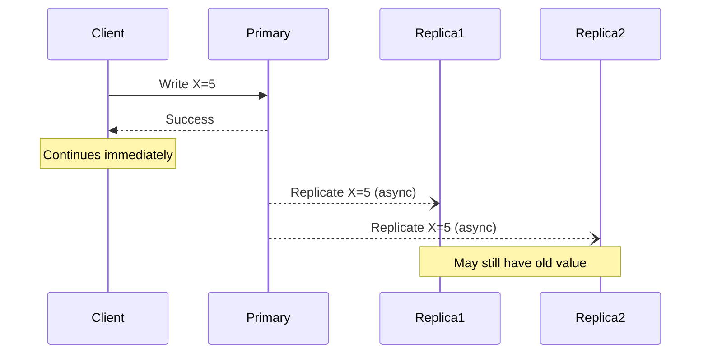

#### **Cost:**

- Your code must handle stale reads gracefully
- Conflict resolution becomes your problem, not the database's
- Users might see different data depending on which server they hit

#### **Use eventual consistency when:**

- Stale data is acceptable. Does it really matter if a social media post shows 4,523 likes instead of 4,524"
- Availability trumps accuracy. A shopping cart that occasionally shows stale data is better than one that errors out.
- High write throughput is critical. Logging systems cannot afford to wait for synchronous replication.

### Consistency Models in Between

| ##### Model | ##### Guarantee | ##### Example |
| --- | --- | --- |
| Strong | Read sees latest write | Bank account balance |
| Linearizable | Operations appear instantaneous | Distributed locks |
| Sequential | Operations ordered consistently | Version control |
| Causal | Cause precedes effect | Chat message threads |
| Read-your-writes | You see your own writes | Profile updates |
| Eventual | Eventually consistent | DNS propagation |

### Example: Amazon Shopping Cart

Amazon's shopping cart is a classic case study in choosing the right consistency model. They deliberately chose eventual consistency, and understanding why illuminates the tradeoff beautifully.

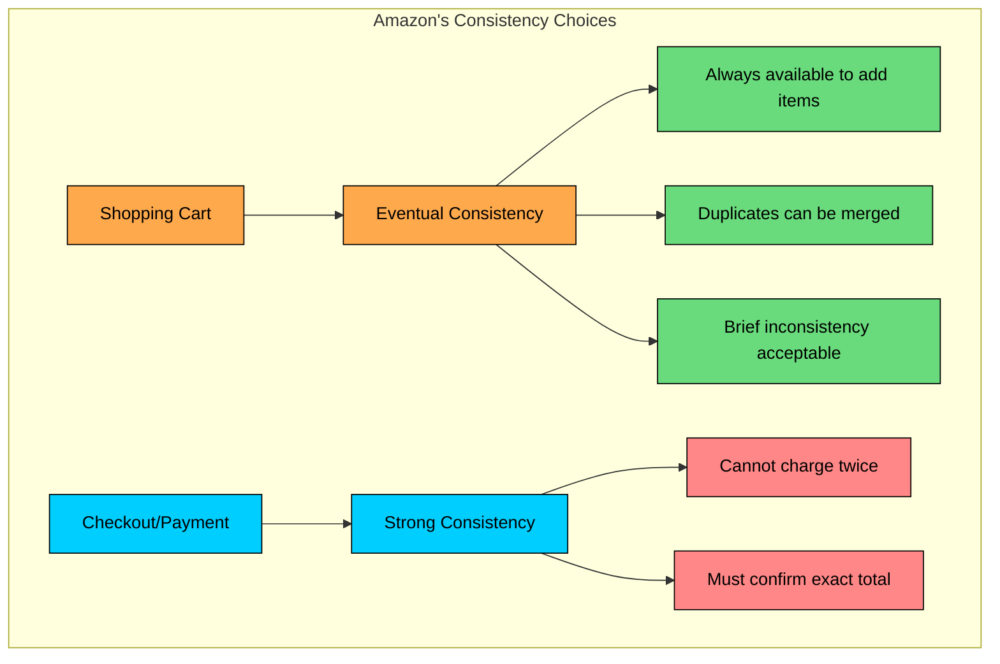

Think about what matters for a shopping cart:

- Users can always add items. An unavailable cart means a lost sale.
- Duplicate items can be merged. If the cart briefly shows two of an item instead of one, just merge them.
- Brief inconsistency is recoverable. Showing a slightly stale cart does not cause real harm.

But here is the key insight: when you move to checkout and payment, Amazon switches to strong consistency. They accept the latency and availability tradeoffs because charging a customer twice causes real harm that cannot be undone.

---

# 6. Synchronous vs Asynchronous Processing

This choice affects almost everything about your system: latency, reliability, complexity, and how you handle failures. The right answer depends on what your users need to know and when they need to know it.

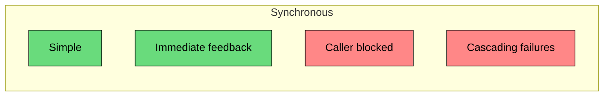

### Synchronous Processing

With synchronous processing, what you see is what you get. The caller makes a request, waits for the operation to complete, and gets the result. Simple, predictable, but potentially slow.

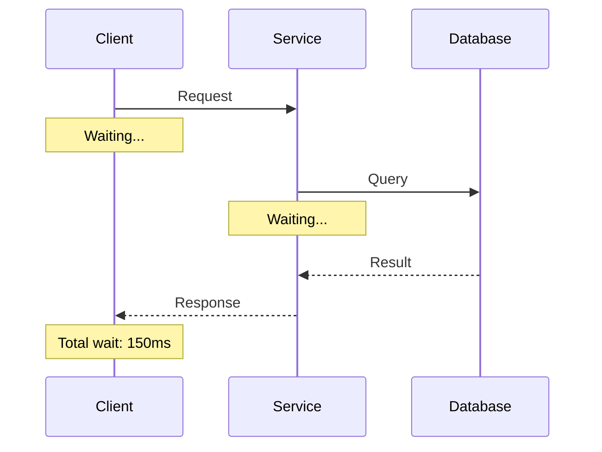

#### **Pros:**

- Simple to understand and debug
- Immediate feedback to the caller
- Easy error handling
- No additional infrastructure

#### **Cons:**

- Caller is blocked waiting
- Failures in downstream services cause caller failures
- Poor tolerance for slow operations
- Harder to scale write-heavy workloads

### Asynchronous Processing

Async flips the model. The caller gets an immediate acknowledgment that their request was received, and then the actual work happens in the background. The caller does not wait around.

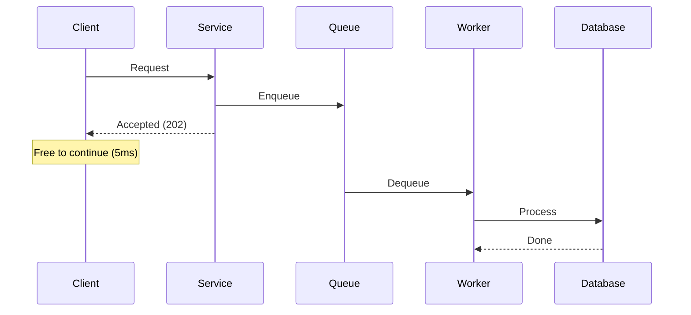

#### **Pros:**

- Caller is not blocked
- Better fault isolation
- Handles traffic spikes via buffering
- Can retry failed operations

#### **Cons:**

- More complex architecture
- Harder to debug
- No immediate feedback
- Requires additional infrastructure (queues, workers)

### When to Use Each

| ##### Scenario | ##### Approach | ##### Reason |
| --- | --- | --- |
| User login | Sync | Need immediate success/failure |
| Password reset email | Async | User can wait, do not block login flow |
| Payment processing | Sync | User needs confirmation |
| Order confirmation email | Async | Email delivery can be delayed |
| Search query | Sync | User expects immediate results |
| Video transcoding | Async | Takes minutes, user cannot wait |

### Hybrid Patterns

In practice, most real systems use both. The key is knowing which operations need synchronous handling and which can be async.

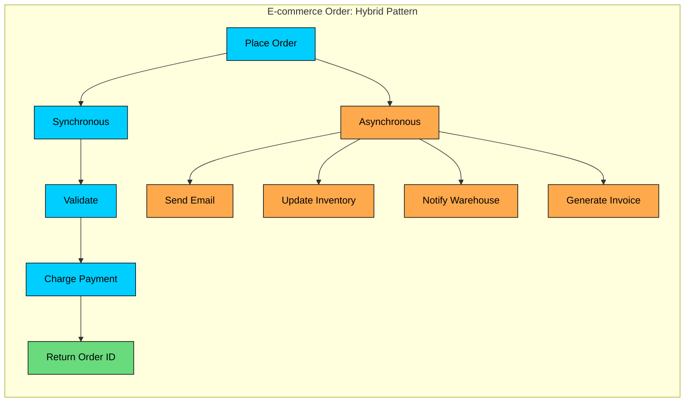

Consider an e-commerce order. What does the user actually need to know right now"

1. **Sync:** Validate the order, charge their payment, return an order ID. The user cannot proceed without knowing these succeeded.
2. **Async:** Send confirmation email, update inventory counts, notify the warehouse, generate an invoice. These can happen in the next few seconds or minutes.

The user gets immediate feedback on the critical path. The system stays responsive because slow operations happen in the background.

---

# 7. Push vs Pull Architecture

When data needs to get from point A to point B, you have two fundamental approaches. Either A pushes data to B whenever something changes, or B pulls from A whenever it wants updates. Each has profound implications for your system's behavior.

### Push (Publish-Subscribe)

With push, producers actively send data to consumers. When something changes, the producer notifies everyone who cares. Consumers do not have to ask. They just receive.

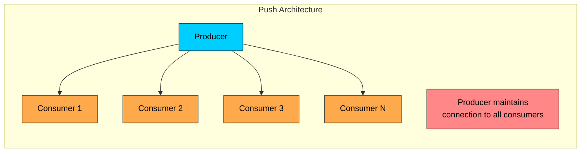

**Examples:** WebSockets, Server-Sent Events, push notifications, webhooks

#### **Pros:**

- Low latency updates (consumers notified immediately)
- Efficient for data that changes frequently
- Reduces polling load on servers

#### **Cons:**

- Producer must track all consumers
- Consumers must be online to receive updates
- Harder to scale with many consumers
- Connection management complexity

### Pull (Request-Response)

With pull, consumers ask for data when they need it. Nothing happens until the consumer makes a request. The producer just sits there waiting.

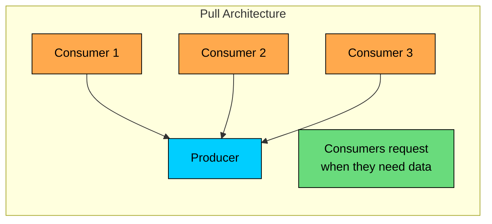

**Examples:** REST APIs, RSS feeds, database queries, polling

#### **Pros:**

- Simpler server implementation
- Works with offline consumers
- Consumers control their own rate
- Easier to cache

#### **Cons:**

- Higher latency (must wait for next poll)
- Wasted requests if no new data
- Polling frequency tradeoff (too slow = stale, too fast = wasteful)

### Comparison

| ##### Aspect | ##### Push | ##### Pull |
| --- | --- | --- |
| Latency | Low | Depends on poll interval |
| Server load | Connection overhead | Request overhead |
| Offline consumers | Missed updates | Can catch up |
| Fan-out | Producer broadcasts | Each consumer requests |
| Scalability | Harder | Easier |

---

# 8. Normalization vs Denormalization

This tradeoff sits at the heart of database design. Do you store data once and join it together when needed" Or do you duplicate data to avoid those expensive joins"

### Normalization

The normalized approach follows a simple principle: store each piece of data exactly once. If you need to connect related data, use foreign keys and join at query time.

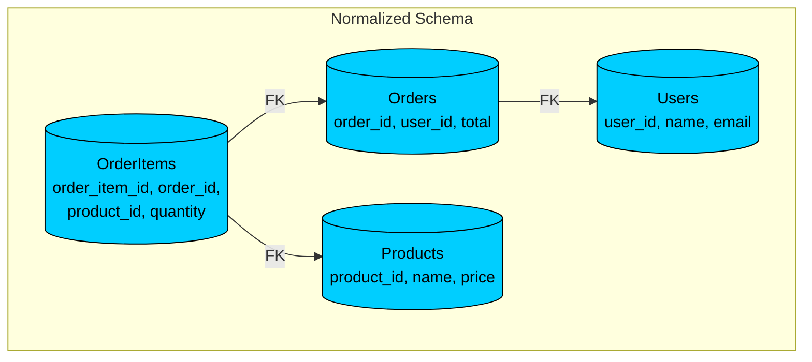

#### **Example: Normalized Schema**

#### **Pros:**

- No data duplication
- Easier updates (change in one place)
- Smaller storage footprint
- Data integrity via constraints

#### **Cons:**

- Joins required for queries
- Join performance degrades at scale
- More complex queries

### Denormalization

Denormalization takes the opposite approach. Duplicate data deliberately so you do not need joins. Store related information together, even if that means the same data exists in multiple places.

```mermaid
flowchart TD
    subgraph Denormalized["Denormalized Schema"]
        Orders[(Orders<br/>order_id, user_id,<br/>user_name, user_email,<br/>product_details_json, total)]:::orange

        Note[All data in one document<br/>No joins needed]:::green
    end

    classDef orange fill:#ffa94d,stroke:#000,color:#000
    classDef green fill:#69db7c,stroke:#000,color:#000
```

#### **Example: Denormalized Schema**

#### **Pros:**

- Fast reads (no joins)
- Simpler queries
- Better for read-heavy workloads
- Works well with NoSQL

#### **Cons:**

- Data duplication
- Update anomalies (must update in multiple places)
- Larger storage footprint
- Risk of inconsistency

### When to Denormalize

| ##### Scenario | ##### Normalize | ##### Denormalize |
| --- | --- | --- |
| Data changes frequently | Yes | No |
| Read-heavy workload | No | Yes |
| Storage is expensive | Yes | No |
| Query latency is critical | No | Yes |
| Data integrity is paramount | Yes | No |
| Using NoSQL database | No | Yes |

---

# 9. Vertical vs Horizontal Scaling

At some point, your system will need more capacity. You have two fundamental approaches, and understanding when to use each saves you from both over-engineering and under-provisioning.

### Vertical Scaling (Scale Up)

The simplest answer: get a bigger machine. More CPU, more RAM, faster disks. Your code does not change at all.

```mermaid
flowchart TD
    subgraph Vertical["Vertical Scaling"]
        V1[4 CPU, 8GB RAM<br/>$100/mo]:::primary
        V1 --> V2[8 CPU, 32GB RAM<br/>$400/mo]:::primary
        V2 --> V3[32 CPU, 128GB RAM<br/>$1600/mo]:::primary
        V3 --> V4[Hardware Limit!<br/>Cannot go bigger]:::red
    end

    classDef primary fill:#00ceff,stroke:#000,color:#000
    classDef red fill:#ff8787,stroke:#000,color:#000
```

#### **Pros:**

- Simple (no code changes)
- No distributed system complexity
- Data consistency is easier
- Lower operational overhead

#### **Cons:**

- Hardware limits (you can only get so big)
- Single point of failure
- Expensive at high end
- Downtime during upgrades

### Horizontal Scaling (Scale Out)

The alternative: add more machines and spread the work across them. Your code gets more complex, but you have no ceiling.

```mermaid
flowchart LR
    subgraph Horizontal["Horizontal Scaling"]
        LB[Load Balancer]:::green
        LB --> S1[Server 1<br/>$100/mo]:::orange
        LB --> S2[Server 2<br/>$100/mo]:::orange
        LB --> S3[Server 3<br/>$100/mo]:::orange
        LB --> S4[Server N<br/>$100/mo]:::orange

        Note[Add more as needed<br/>No upper limit]:::green
    end

    classDef orange fill:#ffa94d,stroke:#000,color:#000
    classDef green fill:#69db7c,stroke:#000,color:#000
```

#### **Pros:**

- No hardware ceiling
- Better fault tolerance
- Can scale incrementally
- Cost-effective at scale

#### **Cons:**

- Distributed system complexity
- Data consistency challenges
- More operational overhead
- Network becomes a factor

### When to Use Each

**Start with vertical scaling when:**

- You are building an MVP
- Traffic is predictable and moderate
- You want to keep things simple
- Your team is small

**Move to horizontal scaling when:**

- You hit hardware limits
- You need fault tolerance
- Traffic is unpredictable or very high
- You need geographic distribution

### The Realistic Scaling Path

Here is how most successful companies actually scale. They do not start with a distributed system. They grow into it.

```mermaid
flowchart LR
    subgraph Path["Typical Scaling Journey"]
        S1[Single Server]:::primary
        S1 --> S2[Bigger Server]:::primary
        S2 --> S3[Add Read Replicas]:::orange
        S3 --> S4[Add Caching]:::orange
        S4 --> S5[Shard Database]:::orange
        S5 --> S6[Microservices +<br/>Multi-region]:::green
    end

    classDef primary fill:#00ceff,stroke:#000,color:#000
    classDef orange fill:#ffa94d,stroke:#000,color:#000
    classDef green fill:#69db7c,stroke:#000,color:#000
```

The pattern is consistent across companies:

1. **Start:** Single server. Get your product working.
2. **Grow:** Bigger server. The simplest solution that works.
3. **Hit limits:** Add read replicas. Your first step into horizontal territory.
4. **More growth:** Add a caching layer. Buy yourself time.
5. **Even more:** Shard the database. Now you are fully horizontal.
6. **At scale:** Microservices, multiple regions, the whole distributed systems playbook.

The key lesson: do not jump to step 6 on day one. Many candidates propose over-engineered solutions for systems that do not need them yet. Start simple. Add complexity when you have evidence that you need it.

---

# 10. Monolith vs Microservices

This is perhaps the most debated architectural tradeoff. It affects not just your technology choices but your team structure, development velocity, and operational burden.

### Monolith

A monolith puts everything in one deployable unit. One codebase, one database, one deployment. Simple to understand, simple to run.

```mermaid
flowchart LR
    subgraph Monolith["Monolithic Architecture"]
		M1[User Service]:::primary
		M2[Order Service]:::primary
		M3[Payment Service]:::primary
		M4[Inventory Service]:::primary
    end

    classDef primary fill:#00ceff,stroke:#000,color:#000
    classDef purple fill:#9775fa,stroke:#000,color:#000
```

#### **Pros:**

- Simple to develop initially
- Easy to debug (everything in one place)
- No network latency between components
- Simpler deployment
- ACID transactions across features

#### **Cons:**

- Harder to scale specific components
- Long build and deploy times as it grows
- Tight coupling between components
- Single technology stack
- Harder for large teams to work in parallel

### Microservices

Microservices split your system into independent services, each with its own codebase, database, and deployment pipeline. Each service owns a specific capability and communicates with others over the network.

```mermaid
flowchart LR
    subgraph Microservices["Microservices Architecture"]
        GW[API Gateway]:::green

        GW --> US[User Service]:::primary
        GW --> OS[Order Service]:::orange
        GW --> PS[Payment Service]:::purple
        GW --> IS[Inventory Service]:::secondary

        US --> DB1[(User DB)]:::primary
        OS --> DB2[(Order DB)]:::orange
        PS --> DB3[(Payment DB)]:::purple
        IS --> DB4[(Inventory DB)]:::secondary

        OS --> Q[Message Queue]:::green
        Q --> PS
        Q --> IS
    end

    classDef primary fill:#00ceff,stroke:#000,color:#000
    classDef orange fill:#ffa94d,stroke:#000,color:#000
    classDef purple fill:#9775fa,stroke:#000,color:#000
    classDef secondary fill:#38d9a9,stroke:#000,color:#000
    classDef green fill:#69db7c,stroke:#000,color:#000
```

#### **Pros:**

- Independent scaling
- Independent deployment
- Technology flexibility per service
- Clear boundaries between teams
- Fault isolation

#### **Cons:**

- Distributed system complexity
- Network latency and failures
- Data consistency challenges
- Operational overhead (many services to monitor)
- Harder to debug across services

### Complexity Comparison

```mermaid
flowchart LR
    subgraph MonoComplexity["Monolith Complexity"]
        MC1[Deploy: Simple]:::green
        MC2[Debug: Easy]:::green
        MC3[Scale: All or nothing]:::red
        MC4[Teams: Coordination needed]:::red
    end

    subgraph MicroComplexity["Microservices Complexity"]
        MS1[Deploy: Per service]:::green
        MS2[Debug: Distributed tracing]:::red
        MS3[Scale: Per service]:::green
        MS4[Teams: Independent]:::green
    end

    classDef green fill:#69db7c,stroke:#000,color:#000
    classDef red fill:#ff8787,stroke:#000,color:#000
```

### Decision Framework

| ##### Factor | ##### Monolith | ##### Microservices |
| --- | --- | --- |
| Team size | < 50 engineers | 50+ engineers |
| Domain complexity | Well-understood | Multiple distinct domains |
| Scaling needs | Uniform | Different per component |
| Development speed | Critical (MVP) | Sustainable long-term |
| Operational maturity | Low | High |

### The Middle Ground: Modular Monolith

There is a third option that many teams overlook. A modular monolith gives you clear service boundaries without the operational complexity of a distributed system.

You structure your code with clear module boundaries and defined interfaces between them, but you deploy everything as a single unit. You get the organizational benefits of separation without the operational overhead of a distributed system.

The real advantage: when you eventually need to extract a module into a service, the boundaries already exist. You are not untangling a mess. You are just changing how you deploy.

---

# 11. Caching Tradeoffs

Caching seems simple. Store frequently accessed data in memory, serve it fast. But the details matter enormously, and different caching strategies make very different tradeoffs.

### Cache-Aside (Lazy Loading)

The most common pattern. Your application checks the cache first. If the data is there, great. If not, fetch from the database and store it in the cache for next time.

```mermaid
flowchart LR
    subgraph CacheAside["Cache-Aside Pattern"]
        App[Application]:::primary
        Cache[(Cache)]:::orange
        DB[(Database)]:::purple

        App -->|"1. Check cache"| Cache
        Cache -->|"2. Miss"| App
        App -->|"3. Query DB"| DB
        DB -->|"4. Return data"| App
        App -->|"5. Populate cache"| Cache
        App -->|"6. Return to client"| Client[Client]:::green
    end

    classDef primary fill:#00ceff,stroke:#000,color:#000
    classDef orange fill:#ffa94d,stroke:#000,color:#000
    classDef purple fill:#9775fa,stroke:#000,color:#000
    classDef green fill:#69db7c,stroke:#000,color:#000
```

**Pros:** Only requested data is cached, cache failures do not block reads 

**Cons:** Initial request is slow (cache miss), potential for stale data

### Write-Through

With write-through, every write goes to both the cache and the database synchronously. The cache is always consistent with the database, but writes take longer.

```mermaid
flowchart TD
    subgraph WriteThrough["Write-Through Pattern"]
        App[Application]:::primary
        Cache[(Cache)]:::orange
        DB[(Database)]:::purple

        App -->|"1. Write"| Cache
        Cache -->|"2. Write (sync)"| DB
        DB -->|"3. ACK"| Cache
        Cache -->|"4. ACK"| App

        Note[Cache always consistent<br/>but writes are slow]:::red
    end

    classDef primary fill:#00ceff,stroke:#000,color:#000
    classDef orange fill:#ffa94d,stroke:#000,color:#000
    classDef purple fill:#9775fa,stroke:#000,color:#000
    classDef red fill:#ff8787,stroke:#000,color:#000
```

**Pros:** Cache is always consistent with database 

**Cons:** Higher write latency, cache may contain unused data

### Write-Behind (Write-Back)

Write-behind optimizes for write speed. Writes go to the cache immediately, and the cache asynchronously flushes to the database in the background. Blazing fast writes, but with risk.

```mermaid
flowchart TD
    subgraph WriteBehind["Write-Behind Pattern"]
        App[Application]:::primary
        Cache[(Cache)]:::orange
        DB[(Database)]:::purple

        App -->|"1. Write"| Cache
        Cache -->|"2. ACK immediately"| App
        Cache -.->|"3. Async batch write"| DB

        Note[Super fast writes<br/>but risk of data loss]:::red
    end

    classDef primary fill:#00ceff,stroke:#000,color:#000
    classDef orange fill:#ffa94d,stroke:#000,color:#000
    classDef purple fill:#9775fa,stroke:#000,color:#000
    classDef red fill:#ff8787,stroke:#000,color:#000
```

**Pros:** Very fast writes, batching possible

**Cons:** Risk of data loss if cache fails before database write

### Comparison Table

| ##### Strategy | ##### Write Speed | ##### Read Speed | ##### Consistency | ##### Complexity |
| --- | --- | --- | --- | --- |
| Cache-Aside | Fast (no cache write) | Slow on miss | Eventually | Low |
| Write-Through | Slow (sync writes) | Fast | Strong | Medium |
| Write-Behind | Very fast | Fast | Eventual (risky) | High |

### Cache Invalidation: The Hard Part

*"There are only two hard things in Computer Science: cache invalidation and naming things."* — Phil Karlton

Putting data in the cache is easy. Knowing when to take it out is the hard part.

```mermaid
flowchart TD
    subgraph Invalidation["Cache Invalidation Strategies"]
        TTL[TTL-Based]:::primary
        Event[Event-Based]:::orange
        Version[Versioning]:::green

        TTL --> TTL1[Simple<br/>Data can be stale until expiry]:::primary
        Event --> Event1[Accurate<br/>Requires event infrastructure]:::orange
        Version --> Version1[Flexible<br/>Old versions stick around]:::green
    end

    classDef primary fill:#00ceff,stroke:#000,color:#000
    classDef orange fill:#ffa94d,stroke:#000,color:#000
    classDef green fill:#69db7c,stroke:#000,color:#000
```

**Time-based (TTL):** Set an expiration and let the data age out. Simple to implement, but you accept that data might be stale until the TTL expires.

**Event-based:** When the source data changes, explicitly invalidate the cache entry. More accurate, but now you need event infrastructure and have to think carefully about all the places that can modify data.

**Versioning:** Include a version number in the cache key. When data changes, increment the version. Old entries just age out. Clean, but old versions stick around taking up space.

---

# 12. Batch vs Real-time Processing

How quickly do you need results" The answer determines whether you process data in batches or as a continuous stream. Each approach has different strengths.

### Batch Processing

With batch processing, you accumulate data over some period, hours or a day, then process it all at once.

```mermaid
flowchart LR
    subgraph Batch["Batch Processing"]
        D1[Data]:::primary --> B[Batch<br/>Accumulator]:::primary
        D2[Data]:::primary --> B
        D3[Data]:::primary --> B
        D4[Data]:::primary --> B

        B -->|"Scheduled<br/>e.g., daily"| P[Process<br/>All at Once]:::orange
        P --> O[Output]:::green

        T[Latency: Hours]:::red
    end

    classDef primary fill:#00ceff,stroke:#000,color:#000
    classDef orange fill:#ffa94d,stroke:#000,color:#000
    classDef green fill:#69db7c,stroke:#000,color:#000
    classDef red fill:#ff8787,stroke:#000,color:#000
```

**Examples:** Daily reports, nightly ETL jobs, monthly billing

#### **Pros:**

- High throughput (optimized for bulk)
- Lower cost (efficient resource use)
- Simpler error handling (retry entire batch)
- Good for complex transformations

#### **Cons:**

- High latency (wait for next batch window)
- All-or-nothing (batch fails entirely or succeeds)
- Bursty resource usage

### Real-time (Stream) Processing

Stream processing handles data as it arrives. Each event gets processed immediately, and results are available in seconds or less.

```mermaid
flowchart LR
    subgraph Stream["Stream Processing"]
        D1[Event]:::orange --> P1[Process]:::orange --> O1[Output]:::green
        D2[Event]:::orange --> P2[Process]:::orange --> O2[Output]:::green
        D3[Event]:::orange --> P3[Process]:::orange --> O3[Output]:::green

        T[Latency: Seconds]:::green
    end

    classDef orange fill:#ffa94d,stroke:#000,color:#000
    classDef green fill:#69db7c,stroke:#000,color:#000
```

**Examples:** Fraud detection, live dashboards, real-time recommendations

#### **Pros:**

- Low latency (immediate results)
- Continuous insights
- Smoother resource usage

#### **Cons:**

- Higher complexity
- Lower throughput per operation
- Harder error handling
- More expensive infrastructure

### Comparison

| ##### Aspect | ##### Batch | ##### Real-time |
| --- | --- | --- |
| Latency | Hours | Seconds |
| Throughput | Very high | Moderate |
| Complexity | Lower | Higher |
| Cost | Lower | Higher |
| Use case | Historical analysis | Immediate action |

### Lambda Architecture: Getting Both

What if you need both historical accuracy and real-time speed" Lambda architecture runs batch and stream processing in parallel, combining their results.

```mermaid
flowchart TD
    subgraph Lambda["Lambda Architecture"]
        Data[Incoming Data]:::primary

        Data --> Batch[Batch Layer<br/>All historical data]:::primary
        Data --> Speed[Speed Layer<br/>Recent data only]:::orange

        Batch --> BatchView[(Batch View<br/>Accurate, delayed)]:::primary
        Speed --> SpeedView[(Speed View<br/>Fast, approximate)]:::orange

        BatchView --> Serving[Serving Layer]:::green
        SpeedView --> Serving

        Serving --> Query[Query merges<br/>both views]:::green
    end

    classDef primary fill:#00ceff,stroke:#000,color:#000
    classDef orange fill:#ffa94d,stroke:#000,color:#000
    classDef green fill:#69db7c,stroke:#000,color:#000
```

The idea is straightforward:

- **Batch layer:** Processes all historical data. Results are accurate but delayed, perhaps by hours.
- **Speed layer:** Processes recent data in real-time. Results are fast but might miss some data or be approximate.
- **Serving layer:** Merges both views. Recent data comes from the speed layer, older data from the batch layer.

> 💡 **Key Insight:**

> **TRADEOFF**
>
> The tradeoff is operational complexity. You are now maintaining two parallel pipelines that do essentially the same thing. Many teams have moved to unified streaming architectures that can handle both use cases, but lambda architecture remains common for systems that need both real-time and deep historical analysis.

### Decision Flow

```mermaid
flowchart TD
    Q1{Need results<br/>in seconds"}
    Q1 -->|Yes| Q2{Budget for<br/>streaming infra"}
    Q1 -->|No| Batch[Use Batch]:::primary

    Q2 -->|Yes| Stream[Use Streaming]:::orange
    Q2 -->|No| Q3{Can accept<br/>some delay"}

    Q3 -->|Yes| Micro[Micro-batching<br/>Minutes delay]:::green
    Q3 -->|No| Stream

    classDef primary fill:#00ceff,stroke:#000,color:#000
    classDef orange fill:#ffa94d,stroke:#000,color:#000
    classDef green fill:#69db7c,stroke:#000,color:#000
```

---

# 13. How to Discuss Tradeoffs in Interviews

Knowing tradeoffs matters, but knowing how to communicate them is what separates good candidates from great ones. Here is how to do it well.

### The Three-Part Framework

```mermaid
flowchart TD
    subgraph Framework["Tradeoff Framework"]
        W[1. What you chose]:::primary
        W --> Why[2. Why you chose it]:::orange
        Why --> Give[3. What you gave up]:::red
        Give --> OK[4. Why that is OK]:::green
    end

    classDef primary fill:#00ceff,stroke:#000,color:#000
    classDef orange fill:#ffa94d,stroke:#000,color:#000
    classDef red fill:#ff8787,stroke:#000,color:#000
    classDef green fill:#69db7c,stroke:#000,color:#000
```

When making a design decision, always state:

1. **What you chose**
2. **Why you chose it**
3. **What you are giving up**

> 💡 **Key Insight:**

> **Example**
>
> *"I am choosing Cassandra for the activity feed storage [what]. It gives us high write throughput and horizontal scalability, which we need for our write-heavy workload of 100K events per second [why].*
>
> *The tradeoff is that we get eventual consistency, so users might see their own activity with a slight delay. For a social feed, this is acceptable [what we give up and why it is okay]."*

### Anchor to Requirements

```mermaid
flowchart TD
    subgraph Anchor["Anchor Decisions to Requirements"]
        Req[Requirements<br/>p99 < 100ms]:::primary
        Req --> Dec[Decision<br/>Cache + Read Replicas]:::orange
        Dec --> Trade[Tradeoff<br/>Eventual consistency]:::red
        Trade --> Just[Justification<br/>Stale data OK for this use case]:::green
    end

    classDef primary fill:#00ceff,stroke:#000,color:#000
    classDef orange fill:#ffa94d,stroke:#000,color:#000
    classDef red fill:#ff8787,stroke:#000,color:#000
    classDef green fill:#69db7c,stroke:#000,color:#000
```

Always tie tradeoffs back to requirements you clarified at the start.

> 💡 **Key Insight:**

> **Example**
>
> *"Earlier we established that p99 latency under 100ms is critical for this API. That is why I am prioritizing caching and read replicas over strong consistency. For this use case, showing slightly stale data is acceptable, but slow responses are not."*

### Show Alternatives Considered

```mermaid
flowchart LR
    subgraph Alternatives["Alternatives"]
        Problem[Problem]:::primary

        Problem --> A1[Option A<br/>SQL Database]:::orange
        Problem --> A2[Option B<br/>Document DB]:::orange
        Problem --> A3[Option C<br/>Key-Value Store]:::orange

        A1 --> P1[Pro: ACID<br/>Con: Scaling]:::orange
        A2 --> P2[Pro: Flexible<br/>Con: No joins]:::orange
        A3 --> P3[Pro: Fast<br/>Con: Limited queries]:::orange

        P2 --> Choice[Chosen: Document DB<br/>Best fit for requirements]:::green
    end

    classDef primary fill:#00ceff,stroke:#000,color:#000
    classDef orange fill:#ffa94d,stroke:#000,color:#000
    classDef green fill:#69db7c,stroke:#000,color:#000
```

> 💡 **Key Insight:**

> **EXAMPLE**
>
> *"We could use a relational database here and get strong consistency and ACID transactions. But given our 100:1 read/write ratio and need for horizontal scaling, a document database makes more sense. If the requirements change and we need complex transactions, we would revisit this."*

### Avoid Absolute Statements

Do not say: "NoSQL is better than SQL."

Do say: "For this specific workload with flexible schemas and high write volume, NoSQL is a better fit."

### Invite Discussion

After explaining your tradeoff, invite the interviewer to explore:

*"This is the approach I would take given these requirements. Would you like me to explore what changes if we needed stronger consistency guarantees""*

---

# Key Takeaways

1. **Every design decision is a tradeoff.** There are no perfect solutions. There are only solutions that are better for specific requirements. Accepting this is the first step to thinking clearly about system design.
2. **Know the major tradeoffs by heart.** CAP theorem, consistency models, SQL vs NoSQL, sync vs async, push vs pull, batch vs real-time, monolith vs microservices. These come up repeatedly.
3. **Anchor decisions to requirements.** The "right" choice depends entirely on what you are optimizing for. This is why clarifying requirements at the start of the interview matters so much.
4. **State what you are giving up.** Explicitly acknowledging the downsides of your choice shows mature engineering judgment. Interviewers notice when candidates do this.
5. **Think through the extremes.** What happens at 10x traffic" What if this component fails" Stress-testing your design mentally reveals tradeoffs you might otherwise miss.
6. **Start simple, add complexity when justified.** Premature optimization and over-engineering are real problems. The simplest solution that meets requirements is usually the right one.
7. **Real systems use multiple strategies.** Twitter uses both push and pull. Amazon uses both SQL and NoSQL. Airbnb uses both monolith and microservices. Think in terms of what fits where, not what is universally better.
8. **Practice articulating tradeoffs out loud.** The difference between passing and failing often comes down to communication. You might understand the tradeoffs perfectly but still fail if you cannot explain them clearly.

The engineers who do best in system design interviews are not necessarily those who know the most technologies. They are the ones who can navigate tradeoffs thoughtfully, explain their reasoning clearly, and adapt their decisions as new information emerges. That is what we are looking for.

---

# References

- [Designing Data-Intensive Applications by Martin Kleppmann](https://www.oreilly.com/library/view/designing-data-intensive-applications/9781491903063/) - The definitive guide to understanding distributed systems tradeoffs
- [CAP Theorem Revisited](https://www.infoq.com/articles/cap-twelve-years-later-how-the-rules-have-changed/) - Eric Brewer's updated perspective on CAP after 12 years
- [Amazon DynamoDB: A Scalable, Predictably Performant, and Fully Managed NoSQL Database Service](https://www.usenix.org/conference/atc22/presentation/elhemali) - How Amazon navigates consistency vs availability
- [Scaling Memcache at Facebook](https://www.usenix.org/conference/nsdi13/technical-sessions/presentation/nishtala) - Real-world caching tradeoffs at scale
- [Kafka: a Distributed Messaging System for Log Processing](https://www.microsoft.com/en-us/research/wp-content/uploads/2017/09/Kafka.pdf) - Understanding push vs pull and batch vs real-time
- [Building Microservices by Sam Newman](https://www.oreilly.com/library/view/building-microservices-2nd/9781492034018/) - When microservices make sense and when they do not

---

# Quiz
