The data structures that matter in system design are different from what you learned in your algorithms course. 

Arrays, linked lists, and binary search trees are building blocks, but they're not what interviewers are looking for. They want to know if you understand bloom filters, LSM trees, inverted indexes, and consistent hashing. These are the structures that power real distributed systems.

What makes these special" They operate at a different scale. They make deliberate trade-offs between memory, accuracy, and performance. They're designed for the realities of distributed systems: machines fail, networks partition, and you can't keep everything in memory.

This chapter covers the data structures that appear most frequently in system design interviews. For each one, I'll explain how it works, when to use it, and how to talk about it convincingly in an interview.

---

# 1. Hash Tables and Hash Functions

> [!PAYWALL] This content is for premium members only.

You already know hash tables from DSA. O(1) average lookup, insert, delete. 

But in system design, hashing shows up in unexpected places: caching layers, database sharding, load balancers, content deduplication, and distributed key-value stores. 

The concept is simple. The applications are everywhere.

### The Core Idea

A hash function transforms any input into a fixed-size number. That number determines where data lives.

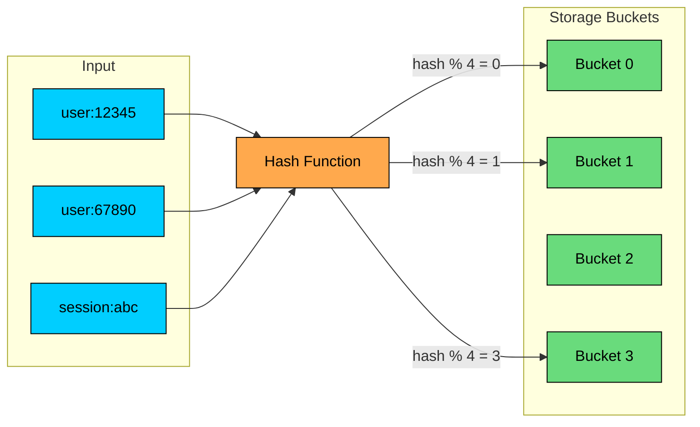

The magic is that you can find where something lives without searching. Compute the hash, go directly to that bucket. O(1).

### What Makes a Good Hash Function"

Not all hash functions are equal. For system design, you care about:

| Property | Why It Matters |
|----------|-------------|
| Deterministic | Same key must always hash to same location |
| Uniform distribution | Keys should spread evenly; clusters create hot spots |
| Fast computation | You're hashing millions of times per second |
| Avalanche effect | Similar inputs should produce very different hashes |

That last one matters more than people realize. If "user:1" and "user:2" hash to adjacent buckets, you haven't really randomized your distribution.

### Collision Handling

With enough keys, two will eventually hash to the same bucket. This is unavoidable. The question is: how do you handle it"

**Chaining:** Each bucket holds a linked list. Collisions just extend the list.

**Open Addressing:** If the target bucket is occupied, probe to find an empty one.

Chaining is more common in practice. It's simpler, degrades gracefully, and doesn't require resizing as urgently.

### Where Hashing Shows Up in System Design

Understanding hash tables is one thing. Recognizing where hashing appears in system design is another:

| Application | How Hashing Is Used |
|-------------|---------------------|
| Caching (Redis) | Hash the key to find the cached value in O(1) |
| Database sharding | Hash the primary key to determine which shard stores the row |
| Load balancing | Hash the client IP or session ID to pick a consistent server |
| Content deduplication | Hash file contents to detect duplicates (Google Drive, S3) |
| URL shorteners | Hash the long URL to generate a short code |
| Bloom filters | Multiple hash functions probe a bit array |

### Hash Functions You Should Know

Different hash functions for different purposes:

| Hash Function | Speed | Output Size | Use Case |
|---------------|-------|-------------|----------|
| MurmurHash3 | Very fast | 32/128-bit | Hash tables, bloom filters |
| xxHash | Fastest | 64-bit | High-throughput hashing |
| MD5 | Fast | 128-bit | Checksums (not for security) |
| SHA-256 | Slower | 256-bit | Security, blockchain, integrity |
| CRC32 | Very fast | 32-bit | Error detection |

For hash tables and data structures, use MurmurHash or xxHash. They're designed for speed and distribution. For security or content addressing where tampering matters, use SHA-256.

### Example: URL Shortener

> 💡 **Key Insight:**

> **TIP**
>
> #### **Interview tip**
>
> When discussing hash tables at scale, always address two things: (1) collision handling, and (2) what happens when the hash table needs to resize or when servers change.The second point leads naturally to consistent hashing, which we'll cover later.

---

# 2. Trees: B-Trees and LSM Trees

Every database stores data on disk. The question is how. The answer is almost always one of two structures: B-Trees or LSM Trees. These aren't just academic concepts. They're the reason PostgreSQL behaves differently from Cassandra, and why some databases handle writes better than others.

If an interviewer asks "Why would you choose Cassandra over PostgreSQL for this workload"", the answer often comes down to B-Trees vs LSM Trees.

### B-Trees

B-Trees are the workhorse of traditional relational databases. MySQL, PostgreSQL, Oracle, SQL Server, they all use B-Trees for their indexes.

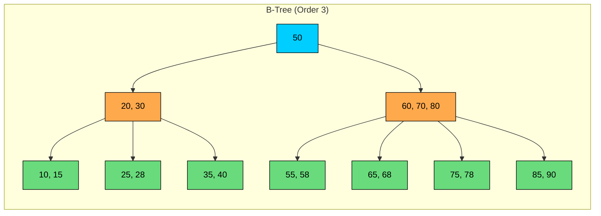

#### **Why B-Trees dominate databases:**

The key insight is that disk I/O is expensive. Reading from disk is 100,000x slower than reading from memory. B-Trees minimize disk reads by:

1. **Storing many keys per node.** A typical B-Tree node holds hundreds of keys, matching the disk page size (4KB-16KB). This creates a very shallow tree.
2. **Keeping the tree balanced.** All leaves are at the same depth. No worst-case scenarios.
3. **Maintaining sorted order.** Keys within a node are sorted, enabling binary search within the node and efficient range scans.

A B-Tree with a fan-out of 500 can index a billion keys in just 3-4 levels. That's 3-4 disk reads to find any record.

| Operation | Time Complexity | Disk Reads |
|-----------|-----------------|----------|
| Point lookup | O(log n) | 3-4 for billion keys |
| Range scan | O(log n + k) | Initial lookup + sequential reads |
| Insert | O(log n) | 3-4 + possible splits |
| Update | O(log n) | Read + write in place |

**B-Trees favor reads over writes.** Updates modify data in place, which requires reading the page, modifying it, and writing it back. For read-heavy OLTP workloads, this is fine. For write-heavy workloads, it becomes a bottleneck.

### LSM Trees (Log-Structured Merge Trees)

LSM Trees flip the trade-off. They optimize for writes by making reads slightly more expensive.

The core insight: random writes to disk are slow, but sequential writes are fast. LSM Trees convert random writes into sequential writes.

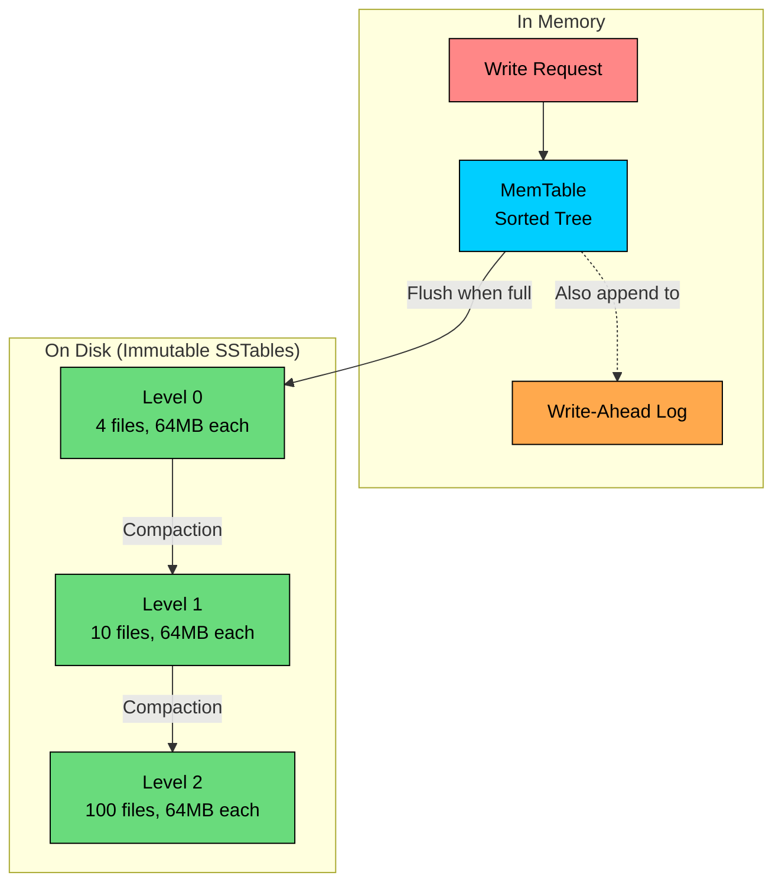

#### **How it works:**

1. **Writes go to memory first.** The MemTable is a sorted in-memory structure (typically a skip list or red-black tree). Writes are fast because they're in memory.
2. **Durability via Write-Ahead Log.** Every write is also appended to a log file. Sequential disk write. Fast.
3. **Flush to disk when MemTable fills.** The MemTable is written as an immutable SSTable (Sorted String Table). This is a sequential write of a large chunk, which disks handle well.
4. **Compaction merges SSTables.** Background process combines SSTables, removing duplicates and tombstones (deleted keys). This keeps read performance reasonable.

#### **The read penalty:**

To read a key, you might need to check the MemTable, then Level 0 SSTables, then Level 1, and so on. Each level is a potential disk read. This is why LSM Trees favor writes over reads.

| Operation | Performance | Notes |
|-----------|-------------|-------|
| Write | Very fast | Memory write + sequential log append |
| Point read | Slower | May check multiple levels |
| Range scan | Reasonable | Merge results from multiple levels |

### B-Trees vs LSM Trees

This is one of the most important comparisons in database internals:

| Factor | B-Trees | LSM Trees |
|--------|---------|-----------|
| Write speed | Slower (random I/O) | Faster (sequential I/O) |
| Read speed | Faster (single location) | Slower (multiple levels) |
| Space usage | Efficient | Higher (duplicates until compaction) |
| Write amplification | Higher (read-modify-write) | Lower per write, but compaction overhead |
| Predictability | Consistent latency | Compaction can cause latency spikes |

**Databases using B-Trees:** MySQL, PostgreSQL, Oracle, SQL Server

**Databases using LSM Trees:** Cassandra, LevelDB, RocksDB, HBase, ScyllaDB

### Choosing Between Them

#### **Reach for B-Trees (PostgreSQL, MySQL) when:**

- Workload is read-heavy or balanced
- You need predictable read latency
- Frequent updates to existing rows
- Transaction isolation matters

#### **Reach for LSM Trees (Cassandra, RocksDB) when:**

- Workload is write-heavy
- Data is mostly append-only (logs, events, time-series)
- You can tolerate slightly variable read latency
- You need very high write throughput

---

# 3. Tries (Prefix Trees)

Every time you type in a search box and see suggestions appear, there's likely a trie behind it. Tries are the natural data structure for prefix-based operations: autocomplete, spell checking, IP routing tables, and dictionary lookups.

### The Structure

A trie stores strings character by character. Each path from root to a marked node represents a complete string.

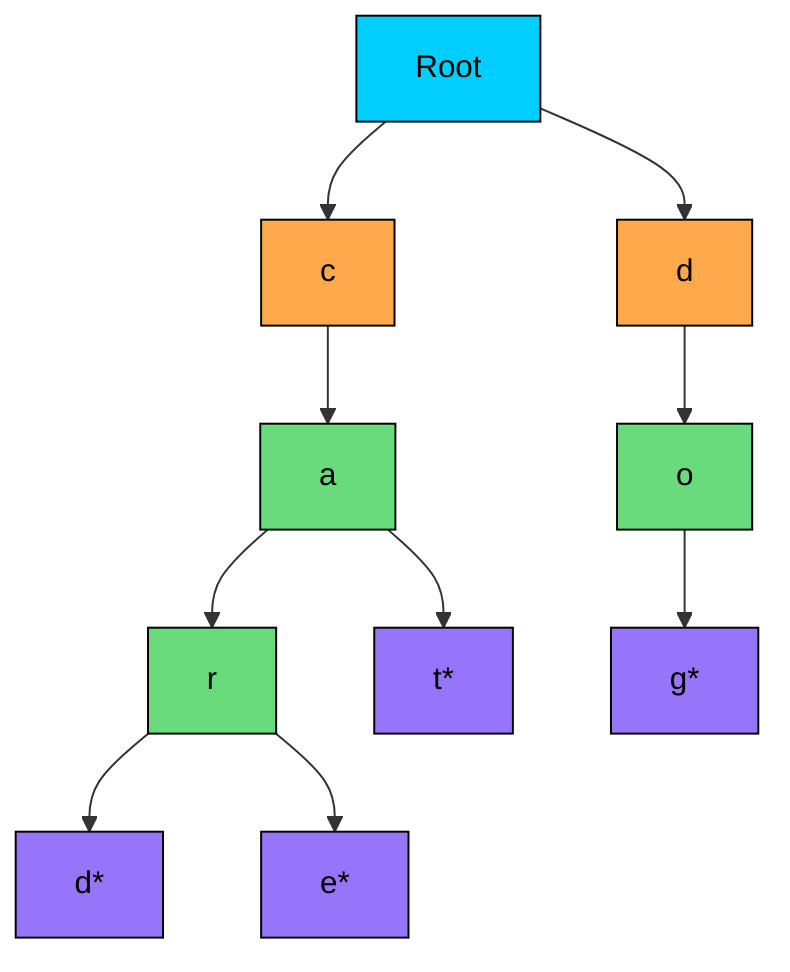

Words stored: "cat", "card", "care", "dog" (nodes marked with * are word endings)

#### **Why tries work for prefixes:**

To find all words starting with "ca", you traverse to the "ca" node and collect all descendants. You don't scan the entire dictionary. You go directly to the relevant subtree. That's O(prefix length + number of matches), not O(total words).

| Operation | Complexity | Notes |
|-----------|------------|-------|
| Insert | O(m) | m = length of string |
| Exact search | O(m) | Independent of dictionary size |
| Prefix search | O(p + k) | p = prefix, k = results |

### Where Tries Appear in System Design

#### **Autocomplete / Typeahead:**

This is the classic application. User types "new", system returns "new york", "news", "new jersey" instantly.

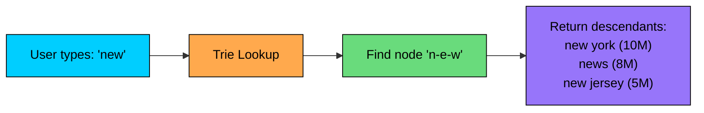

The trick is caching top-k results at each node. Instead of traversing the entire subtree, you precompute and store the most popular completions.

#### **IP Routing (Longest Prefix Match):**

Routers use tries to find the most specific route for an IP address:

#### **Spell Checking and Fuzzy Matching:**

When exact search fails, you can explore nearby branches to suggest corrections:

#### **Dictionary / Word Games:**

### Memory Considerations

Standard tries can be memory-intensive. Each node might have 26 children (for lowercase letters) or 256 (for all ASCII). That adds up quickly.

**Compressed Tries (Radix Trees)** solve this by merging chains of single-child nodes:

In production, systems use additional optimizations:

- Cache top-k completions at each node (avoid subtree traversal)
- Shard tries by first character across multiple servers
- Use succinct representations (bit-level encoding) for massive dictionaries

### Building an Autocomplete System

> 💡 **Key Insight:**

> **Interview tip**
>
> When discussing autocomplete, focus on the caching strategy. Without caching at nodes, you'd traverse potentially millions of descendants for every keystroke. With top-k caching, it's O(1) to return results after finding the node.

---

# 4. Bloom Filters

Here's a common problem: you have a billion URLs in your web crawler's database. Before crawling a new URL, you want to check if you've seen it before. Querying the database for every URL is expensive. Keeping a billion URLs in memory is impractical.

Bloom filters solve this. They answer "Have I seen this before"" using a fraction of the memory, with one catch: they can have **false positives**. 

A bloom filter might say "yes, you've seen this" when you haven't. But it will never say "no" when you have. For a web crawler, occasionally re-crawling a URL is fine. Missing a URL because the filter said "already crawled" would be bad.

### How It Works

A bloom filter is a bit array plus multiple hash functions.

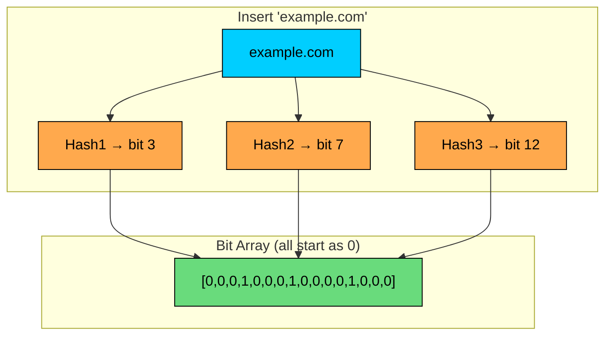

**To insert:** Hash the element k times, set those k bits to 1.

**To check:** Hash the element k times, check if all k bits are 1.

- If any bit is 0 → definitely not in the set
- If all bits are 1 → probably in the set (might be false positive)

### The Trade-off: Memory vs Accuracy

The more bits and hash functions you use, the lower your false positive rate. It's configurable:

| 1 billion elements | False Positive Rate | Memory Needed |
|--------------------|---------------------|---------------|
| Exact set | 0% | ~100 GB |
| Bloom filter | 1% | ~1.2 GB |
| Bloom filter | 0.1% | ~1.8 GB |
| Bloom filter | 10% | ~0.6 GB |

For most applications, a 1% false positive rate is acceptable. You get 100x memory savings.

### Where Bloom Filters Appear

#### **Databases avoiding disk reads:**

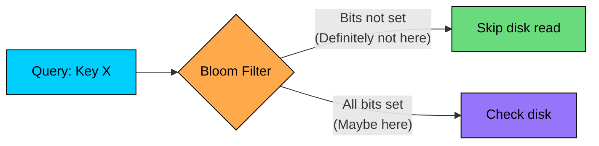

Cassandra and HBase use bloom filters to avoid reading SSTables that definitely don't contain a key. Without the filter, they'd have to check every SSTable on disk.

| System | Use Case |
|--------|----------|
| Cassandra/HBase | Skip SSTables that don't have the key |
| Chrome | Check URLs against malicious site list |
| Medium | Don't recommend articles user already read |
| CDN | Filter out one-hit wonders from cache |
| Bitcoin | SPV clients verify transactions without full blockchain |

### Sizing a Bloom Filter

```shell
Given:
- 1 billion URLs to track
- 1% acceptable false positive rate

Formula: m = -n × ln(p) / (ln(2))^2
- m = -1B × ln(0.01) / 0.48
- m ≈ 9.6 billion bits ≈ 1.2 GB

Optimal hash functions: k = (m/n) × ln(2) ≈ 7
```

Compare that to storing the actual URLs: 1 billion × 50 bytes average = 50 GB. Bloom filter: 1.2 GB. That's a 40x memory reduction.

### Limitations

- **No deletion:** Once a bit is set, you can't unset it (other elements might share that bit). Counting Bloom Filters solve this with counters instead of bits, but use 4x memory.
- **No enumeration:** You can't list what's in the filter.
- **Fixed size:** You need to know roughly how many elements you'll insert.

### False Positive Rate Formula

### Counting Bloom Filters

Standard Bloom filters don't support deletion. Counting Bloom filters use counters instead of bits.

Trade-off: More memory (4 bits per counter vs 1 bit).

---

# 5. Skip Lists

When Redis needed a data structure for sorted sets, they could have used a red-black tree. Balanced trees have been around forever, they're well understood, and they give you O(log n) operations. 

But Redis chose skip lists instead. Why"

The answer comes down to simplicity and concurrency. Balanced trees require rotations to maintain balance, and those rotations are tricky to get right, especially with concurrent access. Skip lists achieve the same O(log n) performance through randomization, with code that's much easier to reason about.

### The Express Lane Concept

Think of a skip list like a subway system. The base level is a local train that stops at every station. Higher levels are express trains that skip stations. To get somewhere quickly, you take the express as far as it goes, then switch to local for the final stops.

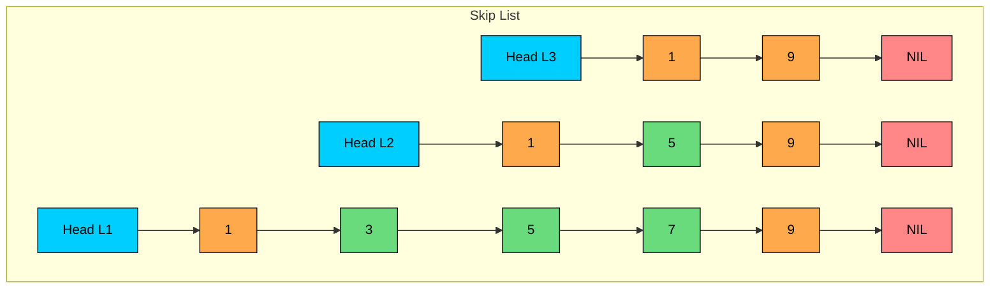

Level 0 is a complete sorted linked list. Higher levels are progressively sparser, providing shortcuts for faster navigation.

### Search Operation

To find element 7, you start at the highest level and work your way down:

The express lanes cut the search space roughly in half at each level. With a well-balanced skip list, you examine O(log n) nodes on average.

### Level Assignment

Here's what makes skip lists elegant: instead of complex rebalancing, they use coin flips.

When inserting a new element, you flip a coin to decide its height:

This probabilistic approach produces a balanced structure on average. Some individual elements might be tall or short, but across millions of elements, the distribution evens out. The beauty is that you never need to rebalance. Each insert is independent.

### Performance Characteristics

| Operation | Average Case | Worst Case | Notes |
|-----------|--------------|------------|-------|
| Search | O(log n) | O(n) | Worst case is rare with good randomness |
| Insert | O(log n) | O(n) | No rebalancing needed |
| Delete | O(log n) | O(n) | Update forward pointers at each level |
| Range Query | O(log n + k) | O(n) | Find start, then traverse level 0 |

The worst case O(n) happens when randomization produces a degenerate structure, like all elements at level 1. With a good random number generator, this is astronomically unlikely.

### Skip Lists vs Balanced Trees

Why would you pick a skip list over a red-black tree" The comparison isn't always obvious:

| Factor | Skip List | Balanced Tree |
|--------|-----------|---------------|
| Implementation | 100-200 lines | 500+ lines (rotations are tricky) |
| Concurrency | Lock per level or lock-free | Full tree lock for rotations |
| Range queries | Trivial: walk level 0 | In-order traversal |
| Space overhead | ~1.33 pointers per node (with p=0.5) | 2 child pointers + balance info |
| Cache locality | Poor (random jumps) | Better (tree structure) |
| Worst case | Probabilistic O(n) | Guaranteed O(log n) |

Skip lists win when simplicity and concurrency matter. Red-black trees win when you need guaranteed worst-case performance or better cache utilization.

### Where Skip Lists Shine in Production

#### **Redis Sorted Sets:**

This is the canonical example. Redis uses skip lists for sorted sets because:

- Range queries by score: `ZRANGEBYSCORE leaderboard 1000 2000`
- Range queries by rank: `ZRANGE leaderboard 0 9` (top 10)
- Fast insertions as scores change
- Simple concurrent access model

#### **LevelDB/RocksDB MemTable:**

LSM tree implementations often use skip lists for their in-memory write buffer:

- Writes are fast (no rebalancing)
- Concurrent insertions from multiple threads
- Easy to iterate in sorted order when flushing to SSTable

#### **In-Memory Indexes:**

Any time you need a sorted index that changes frequently:

- Time-series data with timestamp ordering
- Session stores sorted by expiration
- Priority queues with dynamic priorities

### Practical Example: Game Leaderboard

The skip list enables all these operations efficiently because you can jump to any position and walk from there.

> 💡 **Key Insight:**

> **TIP**
>
> #### **Interview tip** 
>
> Skip lists are the answer when someone asks "How would you implement a sorted set with fast insertions and range queries"" Don't reach for a balanced tree without mentioning skip lists. They're simpler, more concurrent-friendly, and power one of the most widely-used data stores in the world.

---

# 6. Consistent Hashing

Every distributed cache faces the same problem. You have 5 cache servers. You use `hash(key) % 5` to pick which server stores each key. It works fine until you add a 6th server.

Suddenly, `hash(key) % 6` gives different results for almost every key. Your cache hit rate drops to near zero. You've just created a thundering herd to your database.

Consistent hashing solves this. When you add or remove servers, only a small fraction of keys need to move. It's not just a performance optimization. For large-scale distributed systems, it's essential.

### The Problem with Simple Hashing

Let's see why simple hashing fails:

With N servers, adding one server remaps roughly (N-1)/N of all keys. Remove a server" Same problem. This makes scaling operations extremely painful.

### How Consistent Hashing Works

Consistent hashing arranges servers on a circular hash space:

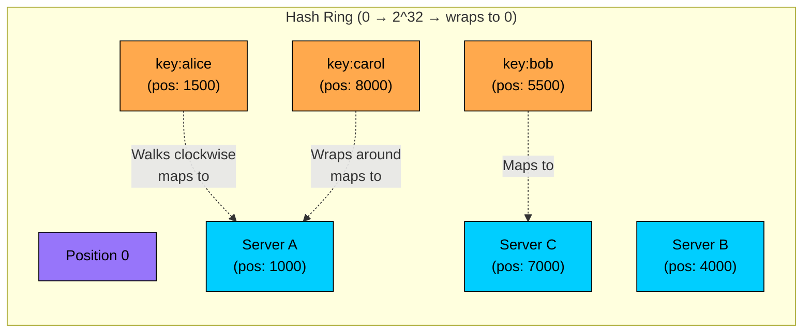

#### **How it works:**

1. Hash each server to a position on a ring (0 to 2^32-1)
2. Hash each key to a position on the same ring
3. Walk clockwise from the key's position until you hit a server. That's where the key lives.

#### **Why this is better:**

When you add Server D at position 5500:

- Only keys between positions 4001 and 5500 move (they were on Server C, now on Server D)
- Keys before position 4001" Still on their original servers. Untouched.

On average, adding a server moves only 1/N of the keys. Remove a server" Same thing, only 1/N keys need to relocate.

### Virtual Nodes: Fixing Uneven Distribution

There's a catch with the basic ring. With only 3 servers on a ring of 4 billion positions, the distribution can be wildly uneven. One server might own 50% of the ring while another owns 15%.

Virtual nodes solve this by placing each physical server at multiple positions:

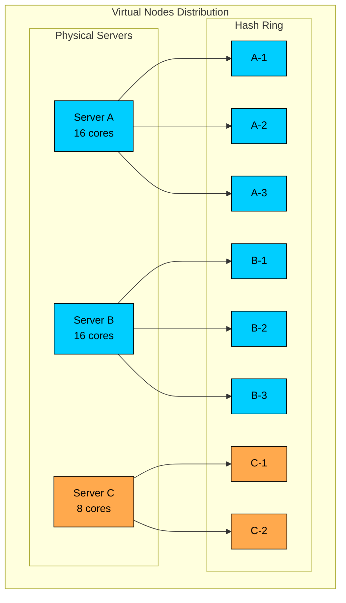

```shell
Physical Server A → Virtual nodes: A-1, A-2, A-3, ... A-150
Physical Server B → Virtual nodes: B-1, B-2, B-3, ... B-150
Physical Server C → Virtual nodes: C-1, C-2, C-3, ... C-100 (smaller machine)

Ring positions: A-47, B-12, C-89, A-23, B-156, C-34, ...
```

With 100-200 virtual nodes per server, the distribution evens out. The math works: variance drops as you add more points.

**Bonus:** Virtual nodes let you weight servers. Got a beefier machine" Give it more virtual nodes. It'll handle proportionally more keys.

### Replication with Consistent Hashing

Consistent hashing makes replication natural. To replicate data, just keep walking clockwise:

This is exactly how Cassandra and DynamoDB work. The ring determines both partitioning and replication in one elegant structure.

### Where Consistent Hashing Appears

| System     | Use of Consistent Hashing              |
| **Cassandra**  | Distribute data across nodes           |
| **DynamoDB**   | Partition data across storage nodes    |
| **Memcached**  | Client-side sharding                   |
| **Akamai CDN** | Route requests to edge servers         |
| **Discord**    | Distribute users across servers        |

### Implementation Details

#### **Choosing a hash function:**

- xxHash or MurmurHash for speed
- MD5 if you want consistency with existing implementations
- Don't use modulo, use the full 32 or 64-bit hash space

#### **How many virtual nodes"**

- 100-200 per physical server is typical
- More nodes = better distribution, but more memory for the ring
- Discord uses 100. Cassandra uses 256.

#### **Ring data structure:**

- Sorted array of (position, server) pairs
- Binary search to find the first server clockwise from a key's position
- O(log V) lookup where V = total virtual nodes

### Practical Example: Distributed Cache Cluster

> 💡 **Key Insight:**

> **TIP**
>
> #### **Interview insight:**
>
> Consistent hashing comes up in almost every distributed system design. When you mention caching, sharding, or load balancing, follow up with "I'd use consistent hashing with virtual nodes to minimize disruption when nodes are added or removed." 
>
> It shows you understand the operational reality of distributed systems, not just the happy path.

---

# 7. Quadtrees and Geospatial Indexes

Open Uber and request a ride. Within seconds, you see drivers on the map, the app matches you with one, and tracks their approach in real-time. Behind this is a "find nearby" query running against millions of drivers, answering in milliseconds.

You can't do this with a regular database index. B-trees index one dimension at a time. Latitude alone doesn't help when you need both latitude and longitude together. Spatial data structures solve this by organizing data in two (or more) dimensions, enabling queries like "find everything within this rectangle" or "find the 10 closest points."

### The Problem with Simple Approaches

### Quadtree Structure

A quadtree recursively divides a 2D area into four quadrants. Dense areas get subdivided more; sparse areas stay coarse.

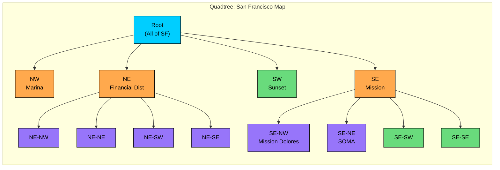

#### **Building a Quadtree:**

1. Start with a bounding box around all your data (e.g., the entire city)
2. If a node has more than K points (say, 100), split it into 4 children
3. Points move to the appropriate child based on their coordinates
4. Keep splitting until each leaf has at most K points (or you hit max depth)

The result: dense downtown areas are finely divided, suburbs are coarse. The tree adapts to data density.

### Querying a Quadtree

The power of quadtrees comes from pruning. You only examine nodes that could contain relevant results.

```shell
Query: Find restaurants within 1 km of (37.78, -122.41)

1. Start at root. Query circle overlaps which children"
2. NE and SE intersect. NW and SW don't. Skip them entirely.
3. Recurse into NE. Two of its children intersect. Skip the others.
4. Eventually reach leaves. Check each point in intersecting leaves.
5. Return points within 1 km.

With 1 million restaurants:
  Naive scan: 1,000,000 distance calculations
  Quadtree: ~1,000-5,000 distance calculations (only leaf candidates)
```

| Operation          | Time Complexity              |
| **Insert**            | O(log n) average             |
| **Delete**            | O(log n) average             |
| **Range Query**       | O(log n + k) for k results   |
| **Nearest Neighbor**  | O(log n) average             |

### Geohashing: Flattening 2D to 1D

Quadtrees work great in memory, but what about database queries" You can't easily store a tree structure in MySQL. Geohashing solves this by encoding a 2D location as a 1D string:

#### **Why this is powerful for databases:**

```sql
-- Find restaurants near user (geohash = "9q8yy")
SELECT * FROM restaurants
WHERE geohash LIKE '9q8y%'  -- Uses index!
AND distance(lat, lon, user_lat, user_lon) < 1000  -- Refine
```

The prefix query uses the B-tree index. The distance check is only on the small result set. Best of both worlds.

### S2 Geometry (Google)

Geohash has edge problems. Cells at the same latitude have the same prefix, but cells straddling the equator don't, even if they're adjacent. S2 fixes this by projecting Earth onto a cube and using a space-filling curve:

```shell
S2 Cell Levels:
  Level 0:  Face of cube (~10,000 km)
  Level 10: ~1,000 m²
  Level 12: ~250 m² (3.3 km²) ← Uber uses this for matching
  Level 14: ~16 m²
  Level 30: ~1 cm²
```

#### **S2 advantages:**

- Cells are roughly equal area everywhere (geohash cells shrink near poles)
- No weird boundary effects at cell edges
- Efficient covering: represent any shape with minimal cells
- Better for polygons, not just points

**Who uses S2:** Uber, Google Maps, Foursquare, Pokemon Go

### Choosing a Spatial Index

| Structure | Best For | Trade-offs |
|-----------|----------|------------|
| Quadtree | In-memory, irregular density | Harder to persist, memory overhead |
| Geohash | Database indexes, simple queries | Edge effects, rectangular cells |
| S2 | Production systems, complex shapes | More complex, library needed |
| R-Tree | Database (PostGIS), polygons | Write-heavy updates slower |

### Practical Example: Ride-Matching System

> 💡 **Key Insight:**

> **TIP**
>
> #### **Interview tip**
>
> Location-based questions always come back to "how do you find things nearby"" The answer is spatial indexing with geohash, S2, or quadtrees. Mention that you'd use S2 for production (it's what Uber actually uses), but explain the simpler geohash concept first to show you understand the fundamentals.

---

# 8. Inverted Indexes

Type a query into Google. Hit enter. In 200 milliseconds, you get results from billions of web pages. How" You certainly can't scan every page for every query.

The trick is inverting the problem. Instead of asking "which words are in this document"", you pre-compute "which documents contain this word"" That's an inverted index, the data structure behind every search engine.

### Forward Index vs Inverted Index

```python
Forward Index (what you store):
  Doc1 → ["the", "quick", "brown", "fox"]
  Doc2 → ["the", "lazy", "dog"]
  Doc3 → ["quick", "brown", "dog"]

To find documents containing "quick":
  Scan Doc1: contains "quick" ✓
  Scan Doc2: doesn't contain "quick" ✗
  Scan Doc3: contains "quick" ✓
  Time: O(number of documents × document length)

Inverted Index (what you query):
  "quick" → [Doc1, Doc3]
  "brown" → [Doc1, Doc3]
  "fox"   → [Doc1]
  "dog"   → [Doc2, Doc3]

To find documents containing "quick":
  Lookup "quick" → [Doc1, Doc3]
  Time: O(1) lookup + O(k) for k matches
```

The inversion is key. You pay the cost once at index time, then queries are fast.

### What's in a Posting List

Each term points to a posting list: the documents containing that term, plus metadata for ranking and phrase matching.

```shell
Term: "python"
Posting List:
  Doc 42: positions [5, 89, 201], tf=3, doc_length=500
  Doc 187: positions [12], tf=1, doc_length=150
  Doc 2041: positions [1, 45, 67, 89], tf=4, doc_length=800
```

Positions enable phrase queries. Term frequency (tf) and document length enable relevance scoring.

### Building the Index

The indexing pipeline transforms raw text into searchable terms:

```python
Original: "The Quick Brown Fox jumps over the lazy dog!"

1. Tokenize: ["The", "Quick", "Brown", "Fox", "jumps", "over", "the", "lazy", "dog"]

2. Lowercase: ["the", "quick", "brown", "fox", "jumps", "over", "the", "lazy", "dog"]

3. Remove stop words: ["quick", "brown", "fox", "jumps", "lazy", "dog"]
   (Common words like "the", "over" don't help distinguish documents)

4. Stem: ["quick", "brown", "fox", "jump", "lazi", "dog"]
   ("jumps" → "jump", "lazy" → "lazi" so "jumping" matches "jumps")

5. Add to posting lists with position:
   "quick" → Doc1:pos1
   "brown" → Doc1:pos2
   "fox"   → Doc1:pos3
   "jump"  → Doc1:pos4
   ...
```

### Query Execution

**Boolean queries** combine posting lists:

```python
Query: "python AND tutorial"
  1. Fetch posting list for "python": [Doc42, Doc187, Doc2041]
  2. Fetch posting list for "tutorial": [Doc42, Doc88, Doc2041]
  3. Intersect: [Doc42, Doc2041]

Optimization: Start with the shorter list and probe the longer one.
For sorted lists, use merge (two pointers). O(min(m, n)).

Query: "python OR java"
  1. Fetch both lists
  2. Union: merge and deduplicate

Query: "python NOT beginner"
  1. Fetch "python" list
  2. Fetch "beginner" list
  3. Remove intersection from first list
```

**Phrase queries** use positions:

```python
Query: "quick brown fox"
  1. Find docs with all three terms: [Doc1]
  2. Check positions:
     Doc1: "quick" at 1, "brown" at 2, "fox" at 3
     Positions are consecutive ✓
  Result: Doc1 matches
```

### Relevance Ranking

Finding documents is only half the battle. You need to rank them by relevance.

**TF-IDF intuition:**

```python
Term Frequency (TF): How often does the term appear in this document"
  More mentions = more relevant (but with diminishing returns)

Inverse Document Frequency (IDF): How rare is this term across all documents"
  "the" appears everywhere → low IDF, not discriminative
  "kubernetes" is rare → high IDF, very discriminative

Score = TF × IDF

Example:
  Doc A: mentions "python" 10 times, 1000 words total
  Doc B: mentions "python" 5 times, 100 words total

  Doc B is probably more focused on Python despite fewer mentions.
```

**BM25 (what Elasticsearch uses):**

BM25 improves on TF-IDF with saturation (10 mentions isn't 10x better than 1) and length normalization (short docs get boosted). It's the default in Lucene, Elasticsearch, and most modern search engines.

### Where Inverted Indexes Appear

| System | How They Use It |
|--------|-----------------|
| Elasticsearch | Core search structure, distributed across shards |
| Google Search | Indexes billions of web pages |
| GitHub Code Search | Indexes code, supports regex and symbol search |
| Slack | Searches messages across workspace |
| Gmail | Full-text search across emails |
| E-commerce | Product search with faceting |

### Scaling to Billions of Documents

When you have more documents than fit on one machine, you shard.

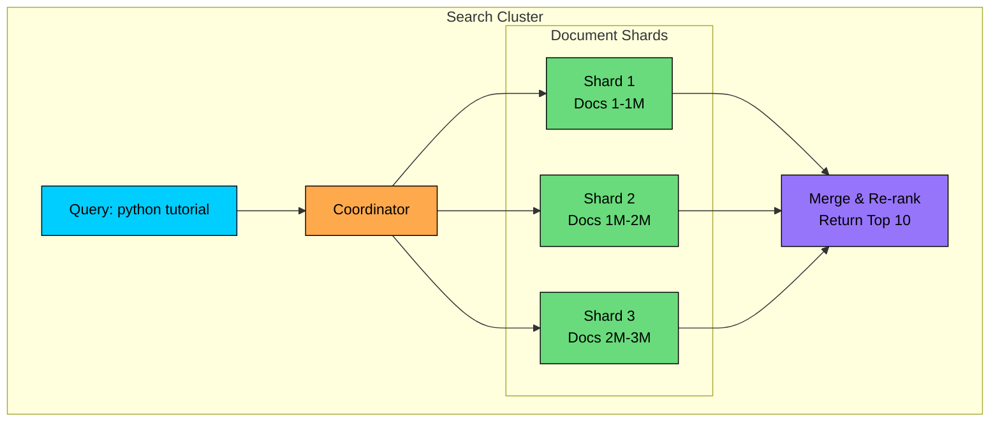

#### **Document-based sharding (Elasticsearch default):**

- Each shard has a complete inverted index for its documents
- Query goes to all shards in parallel
- Each shard returns top K results
- Coordinator merges and re-ranks

#### **Optimizations used in production:**

- Skip pointers in posting lists for faster intersection
- Block compression (posting lists compress well)
- Query caching for popular searches
- Early termination (stop after finding enough good results)
- Tiered storage (hot shards on SSD, cold on HDD)

### Practical Example: E-commerce Search

```python
Requirements:
- 10 million products
- Full-text search on title, description, brand
- Faceted filtering (category, price range, rating)
- Autocomplete suggestions
- < 100ms latency

Design with Elasticsearch:
1. Index product documents:
   {
     "title": "Sony WH-1000XM4 Wireless Headphones",
     "description": "Industry-leading noise cancellation...",
     "brand": "Sony",
     "category": "Electronics > Audio > Headphones",
     "price": 348.00,
     "rating": 4.8
   }

2. Create index mappings:
   - title: text field (analyzed, for full-text search)
   - title.keyword: keyword field (for exact match, sorting)
   - brand: keyword (for filtering, aggregations)
   - price: float (for range queries)

3. Query:
   - BM25 on title and description
   - Boost matches in title (title^2)
   - Filter by category and price range
   - Aggregate for facet counts

4. Autocomplete:
   - Separate edge-ngram index for suggestions
   - Or use completion suggester
```

---

# 9. HyperLogLog

"How many unique users visited our site today"" Seems simple. Store every user ID in a set, count the set. 

But what if you have 100 million daily visitors" That's 800 MB just for user IDs. Now multiply by every page, every day, every geographic region. You're looking at terabytes.

HyperLogLog answers the same question using 12 KB of memory. The catch" It's an estimate. But with 0.81% error on average, "100 million ± 810,000" is good enough for analytics.

### The Probability Trick

The insight behind HyperLogLog is clever. When you hash random values, half will start with 0, a quarter with 00, an eighth with 000, and so on.

```shell
If you've seen a hash starting with:
  1...       → You've probably seen ~2 items
  01...      → You've probably seen ~4 items
  001...     → You've probably seen ~8 items
  0000001... → You've probably seen ~128 items

The more leading zeros you've seen, the more elements you've processed.
```

It's like flipping a coin. Getting 10 heads in a row is rare. If you've observed it, you've probably flipped a lot of coins.

```shell
Example:
  Add "alice" → hash = 00101... (2 leading zeros)
  Add "bob"   → hash = 10011... (0 leading zeros)
  Add "carol" → hash = 00001... (4 leading zeros)

  Max leading zeros seen = 4
  Estimated cardinality ≈ 2^4 = 16

  (With just one observation, this is very noisy.)
```

### Multiple Registers for Accuracy

One maximum is too noisy. HyperLogLog uses many registers (typically 16,384) and averages them:

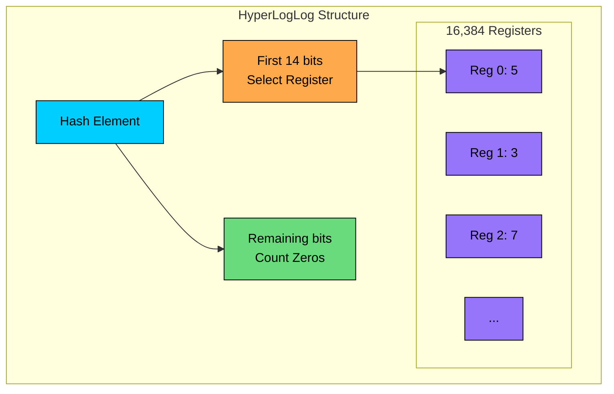

#### **Algorithm:**

1. Hash each element to a 64-bit value
2. Use first 14 bits to select one of 16,384 registers
3. In remaining 50 bits, count leading zeros (call it ρ)
4. If ρ+1 > register value, update register
5. Estimate cardinality using harmonic mean of 2^(register values)

The harmonic mean reduces the impact of outliers. Math proves the error is roughly 1.04/√m where m = number of registers. With 16,384 registers: 1.04/√16384 ≈ 0.81%.

### Memory vs Accuracy Trade-off

| Registers | Memory | Standard Error |
|-----------|--------|----------------|
| 16 | 12 bytes | 26% |
| 256 | 192 bytes | 6.5% |
| 4,096 | 3 KB | 1.6% |
| 16,384 | 12 KB | 0.81% |
| 65,536 | 48 KB | 0.4% |

For most analytics, 12 KB with 0.81% error is the sweet spot.

### The Merge Superpower

HyperLogLog structures can be merged by taking the max of each register:

```shell
HLL for Page A: [3, 7, 2, 5, ...] (12 KB)
HLL for Page B: [4, 5, 6, 3, ...] (12 KB)

Merged HLL:     [4, 7, 6, 5, ...] (still 12 KB!)

This gives unique visitors across BOTH pages,
accounting for users who visited both (no double counting).
```

You can't do this with exact sets without storing all IDs. HLL gives you union cardinality for free.

### Where HyperLogLog Appears

| System | How They Use It |
|--------|-----------------|
| Redis | PFADD, PFCOUNT, PFMERGE commands |
| BigQuery | APPROX_COUNT_DISTINCT() |
| Presto/Trino | approx_distinct() |
| Druid | Built-in HLL aggregator |
| Flink | Streaming cardinality |

### Example: Counting Unique Visitors

> 💡 **Key Insight:**

> **TIP**
>
> #### **Interview tip**
>
> Whenever a system design question asks about unique counts, think HyperLogLog. "How many unique videos were watched"" "How many distinct IP addresses hit our API"" "How many unique search queries"" 
>
> The answer is always: "I'd use HyperLogLog. 12 KB per counter, 0.81% error, and I can merge counters to get uniques across time periods or segments without recounting."

---

# 10. Count-Min Sketch

HyperLogLog answers "how many unique items"" Count-Min Sketch answers a different question: "how often does each item appear""

Imagine tracking trending hashtags on Twitter/X. Millions of distinct hashtags per day. You can't keep exact counts for all of them in memory. But you don't need to. You just need to find the heavy hitters, the hashtags appearing thousands of times. 

Count-Min Sketch gives you frequency estimates using fixed memory, no matter how many distinct items you see.

### The Structure

Count-Min Sketch is a 2D array of counters with d rows and w columns. Each row uses a different hash function.

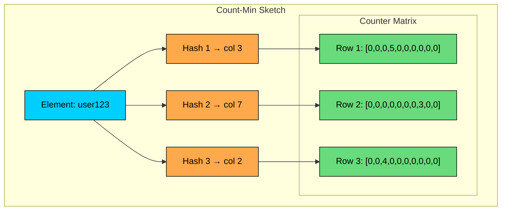

#### **To add an item:**

1. Hash it with each of d hash functions
2. Increment the counter at (row i, hash_i(item))

#### **To query frequency:**

1. Hash with same d functions
2. Look up each counter
3. Return the minimum

### Why Minimum Works

Collisions can only increase counts. If "#python" hashes to column 847 in row 1, and "#java" also hashes there, the counter is inflated. But it's unlikely that "#java" collides with "#python" in all d rows. The minimum is the least likely to be inflated by collisions.

```shell
True count of "#python": 10
Row 1 counter: 15 (5 collisions from other items)
Row 2 counter: 12 (2 collisions)
Row 3 counter: 10 (0 collisions)

Query returns: min(15, 12, 10) = 10 ✓

Key property: Count-Min Sketch never underestimates.
It may say 12 when truth is 10, but never 8.
```

### Sizing for Your Use Case

```shell
Parameters:
  ε = acceptable error rate
  δ = failure probability

Formulas:
  width  w = ⌈e/ε⌉ ≈ 2.72/ε
  depth  d = ⌈ln(1/δ)⌉

Example: 1% error with 99% confidence
  w = 2.72/0.01 = 272 columns
  d = ln(100) ≈ 5 rows
  Memory = 272 × 5 × 4 bytes = 5.4 KB

Example: 0.1% error with 99.9% confidence
  w = 2.72/0.001 = 2,720 columns
  d = ln(1000) ≈ 7 rows
  Memory = 2,720 × 7 × 4 bytes = 76 KB
```

### Count-Min Sketch vs Exact Counting

| Aspect | Exact (Hash Map) | Count-Min Sketch |
|--------|------------------|------------------|
| Memory | O(n) grows with unique items | O(w × d) fixed |
| Accuracy | Exact | May overestimate |
| 1M unique items, 4-byte counts | ~16 MB | ~5 KB |
| 1B unique items | ~16 GB | still ~5 KB |

The sketch shines when you have many unique items but only care about approximate counts, especially for heavy hitters.

### Finding Heavy Hitters

The classic application: find items appearing more than some threshold.

```shell
Algorithm:
1. Maintain Count-Min Sketch for frequencies
2. Maintain small heap of candidate heavy hitters

For each item in stream:
  1. Update sketch
  2. Query estimated frequency
  3. If frequency > threshold and not in heap:
     Add to heap (with current estimate)
  4. If heap is full:
     Evict the lowest if new item's estimate is higher

The heap stays small (top K items).
The sketch handles millions of distinct items in fixed memory.
```

### Where Count-Min Sketch Appears

| System | Use Case |
|--------|----------|
| Network monitoring | Detect DDoS (IPs with unusual traffic) |
| Ad systems | Click fraud detection (users clicking too often) |
| Stream processing | Find trending topics, popular products |
| Databases | Query optimization (estimate selectivity) |
| CDN | Identify hot content for caching |

### Practical Example: Trending Hashtags

```shell
Requirements:
- Process 50,000 tweets/second
- Find top 100 trending hashtags in last hour
- Refresh every minute
- Memory-constrained edge servers

Design:
1. Rolling window: 60 Count-Min Sketches (one per minute)
   Each sketch: 10,000 cols × 5 rows × 4 bytes = 200 KB
   Total: 12 MB for rolling hour

2. Top-K tracker: Min-heap of 100 candidates
   On each hashtag: update current minute's sketch, query sum across all 60

3. Every minute:
   - Discard oldest sketch
   - Create new empty sketch
   - Refresh top-100 heap

Query "trending":
  Return heap (already ranked)

Performance:
  Add: 5 hash + 5 counter increments ≈ microseconds
  Query: 5 hash + 5 lookups × 60 sketches ≈ microseconds
  Memory: 12 MB fixed (vs. GB for exact per-minute counts)
```

> 💡 **Key Insight:**

> **TIP**
>
> #### **Interview application**
>
> Count-Min Sketch is your answer for "how do we find heavy hitters in a stream"" or "how do we detect anomalies without storing everything"" 
>
> The key points: fixed memory regardless of stream size, never underestimates (safe for threshold detection), and pairs well with a small heap for top-K queries.

---

# 11. Merkle Trees

You're syncing a 10 GB file between two machines. One byte changed in the middle. Without any cleverness, you'd have to compare every byte to find the difference, or just re-transfer the whole thing.

Merkle trees solve this with logarithmic efficiency. By organizing data into a hash tree, you can pinpoint exactly which blocks differ with just O(log n) comparisons. It's the data structure behind Git, Bitcoin, and every distributed database that needs to verify or sync data.

### Building a Merkle Tree

A Merkle tree is a binary tree of hashes. Leaves hash data blocks. Parents hash their children. The root hash summarizes the entire dataset.

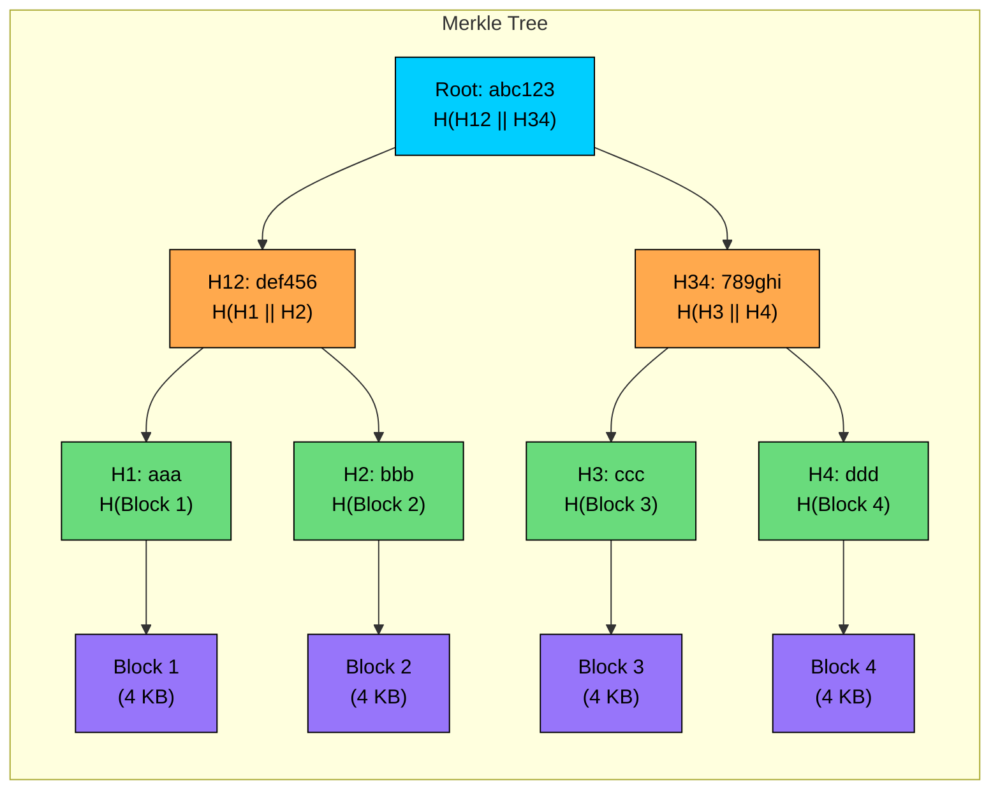

**Key property:** If any single bit of data changes, its leaf hash changes, which propagates up to change the root hash. The root is a fingerprint of all data.

### Finding Differences Efficiently

Here's the magic. Two nodes with 1 million data blocks want to sync. Instead of comparing all blocks:

```shell
Syncing Node A and Node B (1 million blocks each):

Step 1: Compare root hashes
  A.root = "abc123"
  B.root = "xyz789"
  Different → something changed. Recurse.

Step 2: Compare children
  A.H_left = "def456", B.H_left = "def456" → Match! Skip left half (500K blocks)
  A.H_right = "ghi789", B.H_right = "jkl012" → Different. Recurse right.

Step 3: Keep recursing on differing branches
  ...eventually narrow down to exactly 3 blocks that differ.

Comparisons: ~20 hash comparisons (log₂ 1M ≈ 20)
vs. 1 million block comparisons without Merkle tree.
```

### Verifying Data Without Trusting Anyone

In Bitcoin, you want to verify a transaction without downloading the entire blockchain. Merkle trees enable this:

```shell
Merkle Proof for "Transaction TX5 is in Block 12345":

Block 12345 has 1000 transactions organized in a Merkle tree.
Root hash is in the block header (trusted, mined with proof-of-work).

To verify TX5:
  1. Hash TX5 → H5
  2. Receive proof: [H6, H3-4, H1-2, H7-8 subtree hash]
  3. Compute up the tree:
     H5-6 = H(H5 + H6)
     H5-8 = H(H5-6 + H7-8)
     H1-8 = H(H1-4 + H5-8)
  4. Compare H1-8 with trusted root.

Proof size: ~10 hashes (log₂ 1000)
Without Merkle tree: Would need all 1000 transactions.
```

This is how Bitcoin light clients work. They verify transactions without storing the full blockchain.

### Where Merkle Trees Appear

| System | How They Use It |
|--------|-----------------|
| Git | Content-addressable storage (commits, trees, blobs) |
| Bitcoin/Ethereum | Transaction verification, state roots |
| Cassandra | Anti-entropy repair between replicas |
| IPFS | Content verification and deduplication |
| AWS S3 | ETag for multi-part uploads |
| rsync | File synchronization |
| Certificate Transparency | Tamper-evident logs |

### Practical Example: Database Replica Sync

```shell
Problem:
  Cassandra has 3 replicas for each partition.
  Network partitions and failures cause replicas to diverge.
  Need to detect and fix inconsistencies without comparing all data.

Solution: Merkle tree anti-entropy repair

1. Each replica builds a Merkle tree:
   - Divide keyspace into 256 ranges
   - Each range is a leaf: hash of all keys in that range
   - Build tree up to root

2. Repair process:
   - Replica A sends root hash to Replica B
   - If roots match: done! Replicas are consistent.
   - If different: exchange child hashes
   - Recursively identify differing ranges

3. Only sync the differing ranges:
   - 10 GB total data, 3 ranges differ (30 MB)
   - Transfer only 30 MB instead of comparing 10 GB

Complexity:
  Tree depth: log₂(256) = 8 levels
  Hash comparisons: 8-16 per inconsistent range
  Bandwidth: proportional to differences, not total size
```

### Practical Example: Large File Sync

```shell
Scenario:
  10 GB video file stored as 4 KB blocks (2.5 million blocks)
  User edits 30 seconds in the middle (modifies ~100 blocks)
  Need to sync change to backup server

Without Merkle tree:
  Option A: Re-upload 10 GB (wasteful)
  Option B: Compare all 2.5M blocks (slow, 2.5M round trips)

With Merkle tree:
  1. Both sides have Merkle tree of file
  2. Compare roots: different
  3. Binary search through tree: ~22 comparisons (log₂ 2.5M)
  4. Identify exactly which 100 blocks changed
  5. Transfer only those 100 × 4 KB = 400 KB

Improvement:
  Transfer: 400 KB vs 10 GB (25,000x better)
  Comparisons: 22 vs 2.5 million (100,000x better)
```

> 💡 **Key Insight:**

> **TIP**
>
> #### **Interview insight**
>
> Merkle trees answer "How do you efficiently verify or sync large datasets"" Three key properties to mention: (1) the root hash fingerprints all data, (2) you can find differences in O(log n) comparisons, and (3) you can verify individual pieces with a small proof. 
>
> Whenever you see sync, integrity verification, or tamper detection in a problem, Merkle trees should come to mind.

---

# Quick Reference: Choosing the Right Structure

When you're in an interview and need to pick a data structure, here's how to think about it:

| Problem | Data Structure | Why |
|---------|----------------|-----|
| Fast key-value lookup | Hash Table | O(1) access |
| Range queries on sorted data | B-Tree | Read-optimized, range scans |
| High write throughput | LSM Tree | Sequential writes, append-only |
| Prefix matching, autocomplete | Trie | O(prefix length) lookup |
| "Have I seen this"" with memory limits | Bloom Filter | Bit array, false positives OK |
| Sorted set with fast updates | Skip List | Simple, concurrent, range queries |
| Distribute data across servers | Consistent Hashing | Minimize reshuffling on scale |
| Find nearby locations | Quadtree/S2/Geohash | Spatial indexing |
| Full-text search | Inverted Index | Term → document mapping |
| Count unique items at scale | HyperLogLog | 12 KB, 0.81% error |
| Find heavy hitters in streams | Count-Min Sketch | Fixed memory, frequency estimates |
| Verify/sync large datasets | Merkle Tree | O(log n) difference detection |

### Patterns to Remember

#### **Probabilistic structures trade accuracy for memory:**

- Bloom filter: 1% error saves 100x memory
- HyperLogLog: 0.81% error in 12 KB
- Count-Min Sketch: never underestimates

Use them when "approximately correct" is good enough. Analytics, caching decisions, duplicate detection, that's where they shine.

#### **Storage engines define database behavior:**

- B-Trees (MySQL, PostgreSQL): reads are fast, writes do in-place updates
- LSM Trees (Cassandra, RocksDB): writes are fast, reads may check multiple levels

When someone asks "Why would you choose Cassandra over PostgreSQL"", this is often the answer.

#### **Distributed systems need consistent hashing:**

- Adding/removing nodes should only move 1/N of data
- Virtual nodes smooth out distribution
- The hash ring determines both partitioning and replication

Any time you mention caching, sharding, or load balancing at scale, consistent hashing should follow.

#### **Spatial queries need spatial indexes:**

- Can't use B-tree on (lat, lon) because it's 2D
- Quadtree adapts to density
- Geohash makes spatial queries use string indexes
- S2 is what Uber actually uses

#### **Search needs inverted indexes:**

- Forward index: document → words (useless for search)
- Inverted index: word → documents (enables search)
- BM25 for ranking, sharding for scale

#### **Merkle trees answer "how do you verify or sync"":**

- Root hash fingerprints all data
- O(log n) to find differences
- Used in Git, Bitcoin, Cassandra, file sync

### The Meta-Skill

The real skill isn't memorizing data structures. It's pattern matching: hearing a requirement and immediately knowing which structure fits. "Count unique users" → HyperLogLog. "Find nearby drivers" → S2 cells. "Avoid disk reads for missing keys" → Bloom filter.

When you can make these connections quickly and explain the trade-offs clearly, you'll stand out in system design interviews.

---

# References

- [Designing Data-Intensive Applications](https://www.oreilly.com/library/view/designing-data-intensive-applications/9781491903063/) - Martin Kleppmann's comprehensive book on data systems
- [Database Internals](https://www.oreilly.com/library/view/database-internals/9781492040330/) - Alex Petrov's deep dive into storage engines and distributed systems
- [Bloom Filters by Example](https://llimllib.github.io/bloomfilter-tutorial/) - Interactive tutorial on Bloom filters
- [HyperLogLog in Practice](https://research.google/pubs/pub40671/) - Google's paper on practical cardinality estimation
- [Consistent Hashing and Random Trees](https://www.cs.princeton.edu/courses/archive/fall09/cos518/papers/chash.pdf) - Original consistent hashing paper
- [The Log-Structured Merge-Tree](https://www.cs.umb.edu/~poneil/lsmtree.pdf) - O'Neil et al.'s foundational LSM tree paper

---

# Quiz
