Caching appears in virtually every system design interview. Whether you are designing a social media feed, e-commerce platform, or URL shortener, caching is essential for achieving low latency and high throughput.

Interviewers expect you to know not just that caching helps, but how to choose the right caching strategy, where to place caches, how to handle invalidation, and what trade-offs each decision involves.

This chapter provides a deep understanding of caching for system design interviews. We will explore caching fundamentals, different caching layers, strategies for reads and writes, eviction policies, distributed caching with Redis and Memcached, cache consistency challenges, and common interview scenarios.

---

# 1. Why Caching Matters

Every system design problem eventually comes down to one question: how do you make it fast enough" Caching is usually the answer.

### 1.1 The Speed Gap

The reason caching works so well comes down to physics. Different storage systems operate at wildly different speeds:

Look at those numbers. A database query takes 10ms. Serving the same data from an in-memory cache takes microseconds, about 10,000 times faster. When you're handling thousands of requests per second, that difference is everything.

### 1.2 The Impact of Caching

Let me show you what this speed difference means in practice. Consider a system handling 1,000 requests per second:

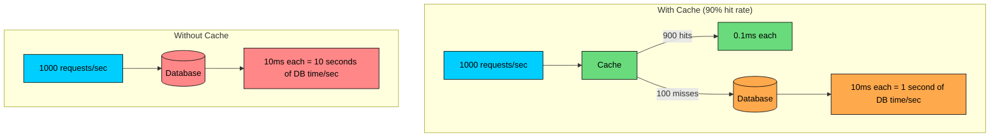

With a 90% cache hit rate, you reduce database load by 90%. That is the difference between needing 10 database replicas and needing just one.

#### **What caching gives you:**

| Benefit | Description |
|---------|-------------|
| Reduced latency | Serve data in microseconds instead of milliseconds |
| Reduced database load | 90% cache hit rate = 90% fewer database queries |
| Cost savings | Fewer database instances needed |
| Improved availability | Serve cached data even if backend is slow/down |
| Better user experience | Faster page loads, more responsive applications |

### 1.3 When Caching Helps Most

Not all data benefits equally from caching. The sweet spot is data that gets read often, changes rarely, and tolerates some staleness:

**1. Read-heavy workloads:**

- Read/write ratio > 10:1
- Same data accessed repeatedly

**2. Expensive computations:**

- Complex aggregations
- Machine learning predictions
- Search results

**3. Data that changes infrequently:**

- Configuration data
- Product catalogs
- User profiles

**4. Data that tolerates staleness:**

- Social media feeds
- Analytics dashboards
- Recommendations

```mermaid
flowchart TD
    A{High read/write ratio"}:::primary
    A -->|Yes| B{Data changes infrequently"}
    B -->|Yes| C[Excellent caching candidate]:::green
    B -->|No| D{Staleness acceptable"}
    D -->|Yes| E[Good caching candidate]:::green
    D -->|No| F[Cache with short TTL or skip]:::orange
    A -->|No| G{Expensive to compute"}
    G -->|Yes| H[Cache computation results]:::green
    G -->|No| I[Caching may not help much]:::red

    classDef primary fill:#00ceff,stroke:#000,color:#000
    classDef green fill:#69db7c,stroke:#000,color:#000
    classDef orange fill:#ffa94d,stroke:#000,color:#000
    classDef red fill:#ff8787,stroke:#000,color:#000
```

### 1.4 When Caching Can Hurt

Caching is not free. It adds complexity, uses memory, and can cause consistency issues. Here is when to think twice:

| Scenario | Why It Hurts |
|----------|---------|
| Write-heavy workload | Cache invalidation overhead exceeds the benefit |
| Highly unique requests | Low hit rate means you're paying for memory you do not use |
| Consistency-critical data | Financial transactions cannot tolerate stale data |
| Small dataset that fits in memory | Database is already fast enough |
| Cache thrashing | Data gets evicted before anyone reads it again |

---

# 2. The Caching Hierarchy

A request from a user travels through multiple layers before hitting your database. Each layer is an opportunity to cache. Understanding where to place caches, and what to cache at each layer, is one of the most practical skills you can bring to an interview.

### 2.1 Client-Side Caching

The fastest cache is the one closest to the user: their own browser.

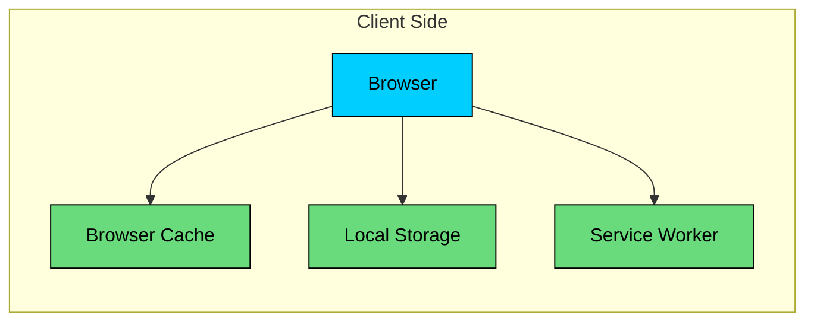

**Browser cache:**

- Stores HTTP responses based on cache headers
- Controlled by Cache-Control, ETag, Last-Modified
- Automatic, no application code needed

**Local Storage / IndexedDB:**

- Application-controlled storage
- Persists across sessions
- Good for user preferences, offline data

**Service Worker cache:**

- Programmable network proxy
- Enables offline functionality
- Fine-grained caching control

**Cache-Control headers:**

### 2.2 CDN Caching

When browser cache misses, the next layer is the CDN. Content Delivery Networks place cache servers at edge locations around the world, bringing your content closer to users.

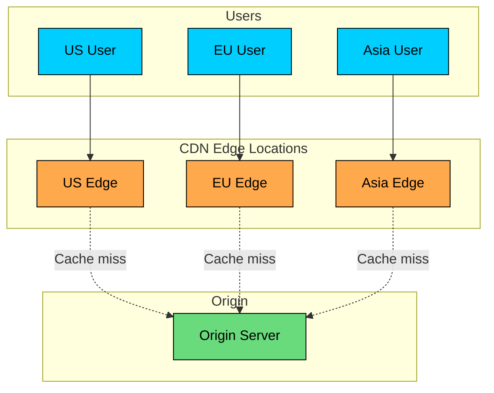

**What CDNs cache:**

- Static assets (images, CSS, JavaScript)
- HTML pages
- API responses (with proper headers)
- Video/audio content

**CDN cache configuration:**

| Setting | Description |
|---------|-------------|
| TTL | How long to cache content |
| Cache key | What makes a cached item unique (URL, headers, cookies) |
| Purge | Manually invalidate cached content |
| Vary | Cache different versions based on headers |

**Popular CDNs:** Cloudflare, AWS CloudFront, Akamai, Fastly

### 2.3 Load Balancer / API Gateway Caching

A less common but useful layer: some load balancers and API gateways can cache responses before they reach your application servers.

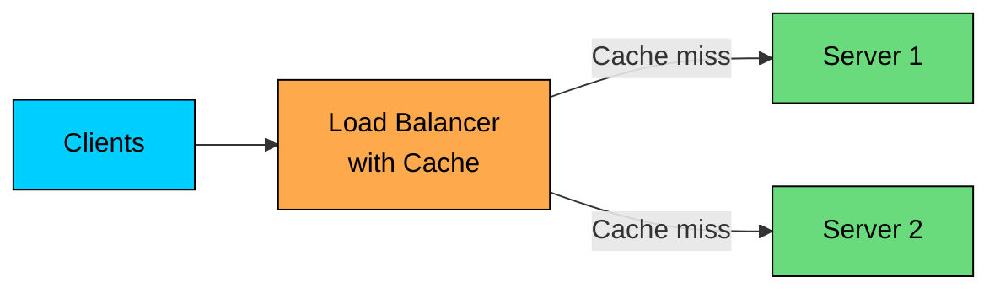

**Benefits:**

- Reduces load on backend servers
- Simple to configure
- No application code changes

**Limitations:**

- Usually limited to GET requests
- Cache size limited
- Less flexible than application cache

### 2.4 Application-Level Caching

This is where you have the most control. Application-level caching lets you decide exactly what to cache, how long to keep it, and when to invalidate it.

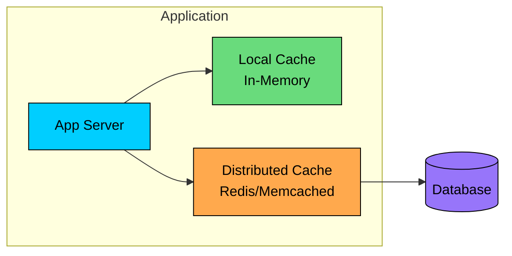

**Local cache (in-process):**

- Fastest access (no network)
- Limited to single server
- Lost on restart
- Example: HashMap, Guava Cache, Caffeine

**Distributed cache:**

- Shared across servers
- Survives server restarts
- Network overhead
- Example: Redis, Memcached

### 2.5 Database Caching

Even your database has caches. Before data hits the disk, it passes through memory buffers that the database manages automatically.

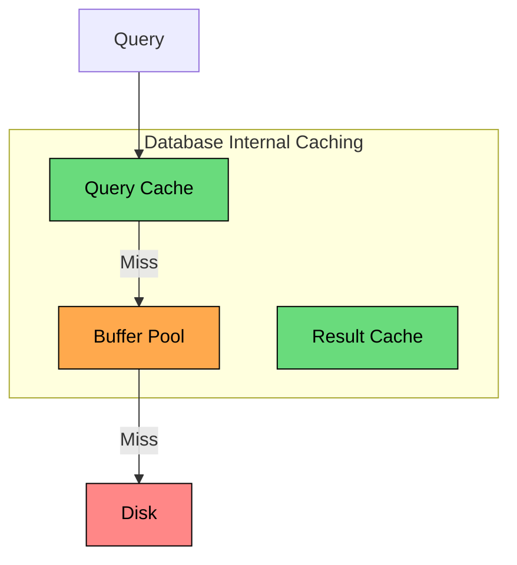

| Cache Type | Description |
|------------|-------------|
| Buffer pool | Caches data pages in memory |
| Query cache | Caches query results (MySQL) |
| Result cache | Caches computation results (Oracle) |

Database caching is automatic and helpful, but you have no control over it. Application-level caching gives you the flexibility to cache exactly what matters for your workload.

### 2.6 The Complete Picture

Here is how all these layers fit together:

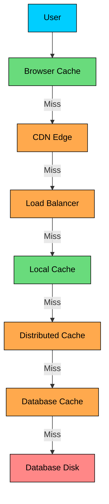

**Cache hit at each level:**

| Level | Latency | Bandwidth Cost |
|-------|---------|----------------|
| Browser | ~0ms | None |
| CDN | ~10-50ms | Minimal |
| Load Balancer | ~1-5ms | Low |
| Local Cache | ~0.1ms | None |
| Distributed Cache | ~1-5ms | Low |
| Database Cache | ~1-10ms | Low |
| Database Disk | ~10-100ms | High |

> 💡 **Key Insight:**

> **Interview tip**
>
> When discussing caching, identify which layer is most appropriate. "For static assets, we'll use CDN caching with long TTLs. For user-specific data, we'll use Redis with application-level caching."

---

# 3. Caching Strategies for Reads

Now that you know where to cache, the next question is how. Different strategies optimize for different access patterns. Knowing which one to use is a common interview topic.

### 3.1 Cache-Aside (Lazy Loading)

This is the most common pattern, and the one you should reach for by default. The application checks the cache first, and only hits the database on a miss.

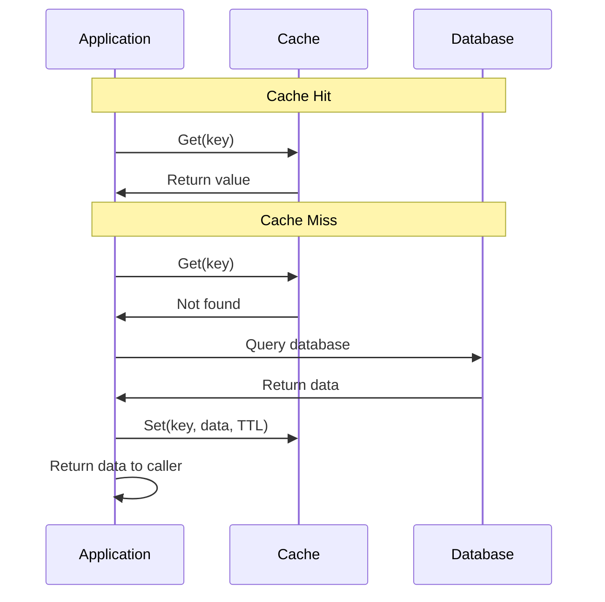

**Implementation:**

**Pros:**

- Only requested data is cached
- Cache failures don't break reads (fallback to DB)
- Simple to implement

**Cons:**

- First request always slow (cache miss)
- Stale data possible (cache not updated on write)
- Cache stampede risk on cold cache

### 3.2 Read-Through

With read-through, the cache itself handles misses. Your application just asks the cache for data, and the cache fetches from the database if needed.

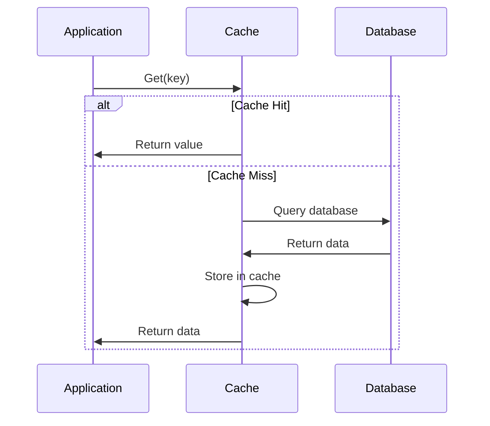

**Pros:**

- Application code simpler (doesn't manage cache population)
- Cache always contains requested data

**Cons:**

- First request still slow
- Cache and database tightly coupled
- More complex cache implementation

### 3.3 Cache-Aside vs Read-Through

The practical difference: with cache-aside, your code explicitly handles cache misses. With read-through, that logic is hidden inside the cache layer.

| Aspect | Cache-Aside | Read-Through |
|--------|-------------|--------------|
| Who populates cache | Application | Cache itself |
| Code complexity | Higher | Lower |
| Cache coupling | Loose | Tight |
| Flexibility | More | Less |
| Common tools | Redis, Memcached, any cache | Some ORMs, AWS DAX |

Most teams use cache-aside because it gives you full control. Read-through is nice when you want to hide caching logic from application code.

### 3.4 Refresh-Ahead

Both cache-aside and read-through have a problem: the first request after a cache miss is slow. Refresh-ahead solves this by refreshing data before it expires.

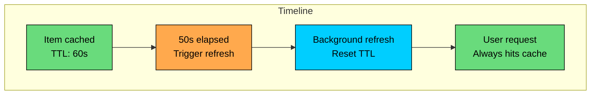

**Implementation:**

**Pros:**

- Eliminates cache miss latency for hot data
- Smooth performance (no periodic spikes)

**Cons:**

- More complex to implement
- Wastes resources refreshing rarely-accessed data
- Need to track access patterns

---

# 4. Caching Strategies for Writes

Reading from cache is the easy part. Writing is where things get tricky. You need to keep the cache in sync with the database, and there are multiple ways to do it.

### 4.1 Write-Through

The safest option: write to both cache and database together. The cache is always consistent with the database.

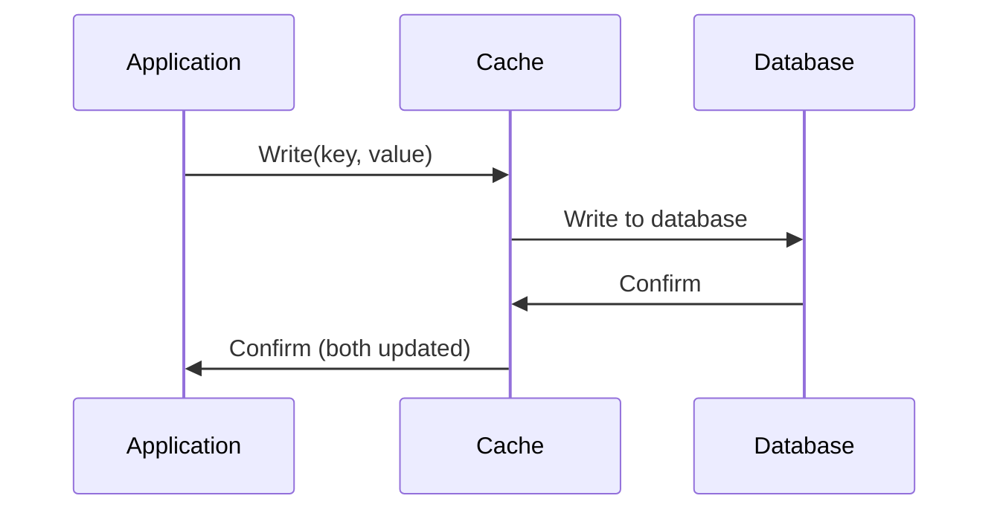

**Pros:**

- Cache always consistent with database
- Simple mental model
- Reads after writes always see latest data

**Cons:**

- Higher write latency (two writes)
- All data cached (even if never read)
- Single point of failure (if cache fails, writes fail)

### 4.2 Write-Behind (Write-Back)

If write latency matters more than durability, write-behind is faster. Write to cache immediately and persist to the database asynchronously in the background.

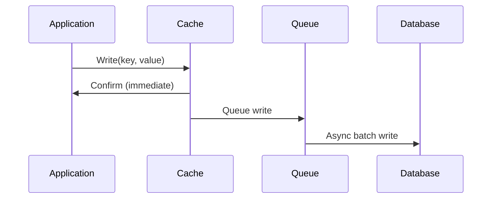

**Pros:**

- Very low write latency
- Can batch multiple writes
- Reduces database load

**Cons:**

- Data loss risk if cache fails before persist
- Complex failure handling
- Eventual consistency

**Write-behind batching:**

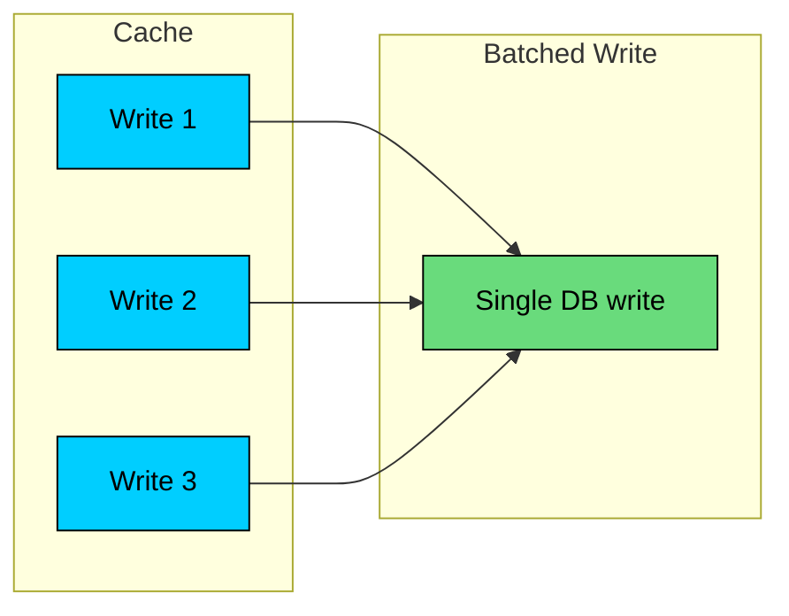

### 4.3 Write-Around

Sometimes you do not want to cache data on write at all. Write-around skips the cache entirely and lets reads populate it later. This makes sense when data is written once but rarely read afterwards.

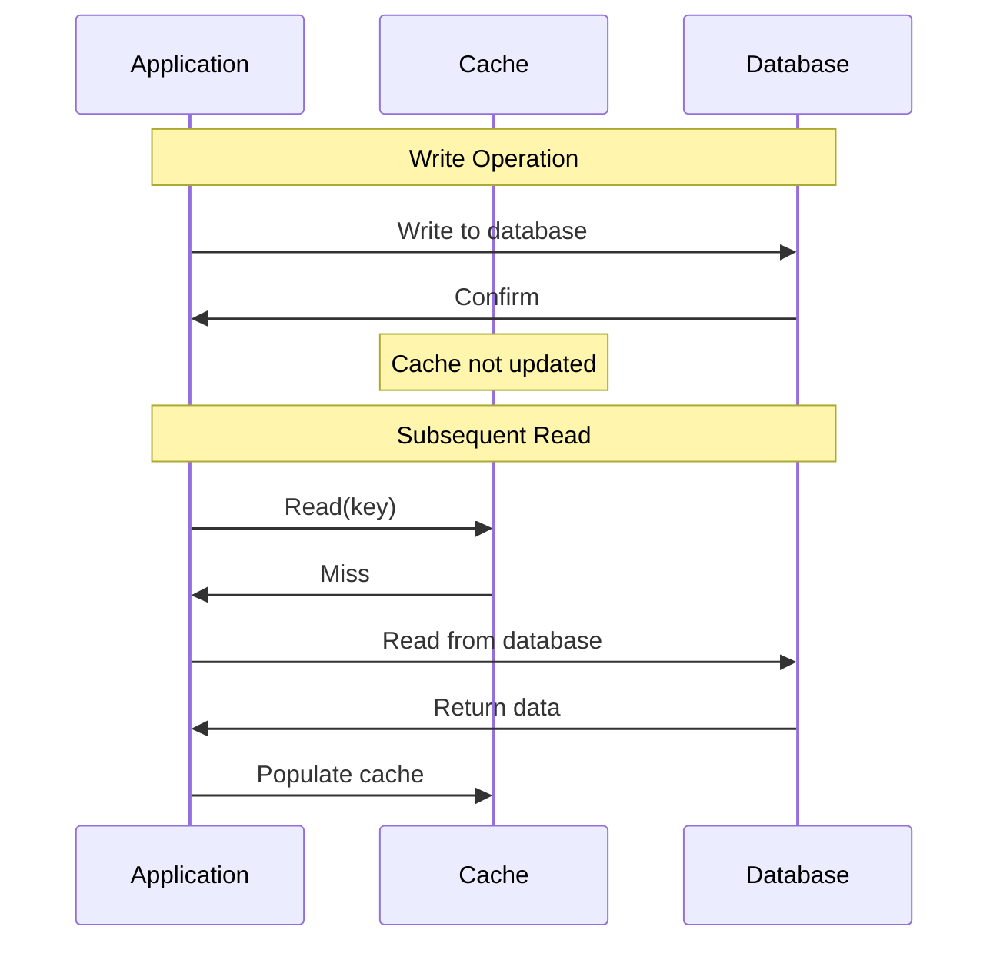

**Pros:**

- Cache not flooded with write-once data
- Simpler write path
- Good for write-heavy, read-light data

**Cons:**

- First read after write is slow (cache miss)
- Inconsistency window between write and read

### 4.4 Choosing a Write Strategy

The right choice depends on your access patterns and consistency requirements:

```mermaid
flowchart TD
    A{What matters most"}:::primary
    A -->|Consistency| B[Write-Through]:::green
    A -->|Write latency| C[Write-Behind]:::orange
    A -->|Not caching writes| D[Write-Around]:::purple

    B --> B1[Use when reads follow writes]
    C --> C1[Use for high write throughput]
    D --> D1[Use for write-once data]

    classDef primary fill:#00ceff,stroke:#000,color:#000
    classDef green fill:#69db7c,stroke:#000,color:#000
    classDef orange fill:#ffa94d,stroke:#000,color:#000
    classDef purple fill:#9775fa,stroke:#000,color:#000
```

| Strategy | Write Latency | Consistency | Data Loss Risk | Best For |
|----------|---------------|-------------|----------------|----------|
| Write-Through | Higher | Strong | Low | Read-heavy, consistency critical |
| Write-Behind | Low | Eventual | Higher | Write-heavy, latency critical |
| Write-Around | Medium | Eventual | Low | Write-once, read-rarely |

### 4.5 Cache Invalidation on Write

With cache-aside, you face a choice: when data changes, do you delete the cache entry or update it" This seems like a minor decision, but it has real implications.

**Option 1: Delete from cache**

**Option 2: Update cache**

**Delete vs Update:**

| Approach | Pros | Cons |
|----------|------|------|
| Delete | Simple, consistent | First read is slow |
| Update | No cache miss after write | Risk of inconsistency if write fails |

---

# 5. Cache Eviction Policies

Memory is finite. When your cache fills up, you need to decide what to throw away. The eviction policy determines which items get removed to make room for new ones. This is a common interview topic because different policies optimize for different access patterns.

### 5.1 LRU (Least Recently Used)

The most popular choice. Remove whichever item was accessed longest ago. The assumption is that recently accessed items are likely to be accessed again soon.

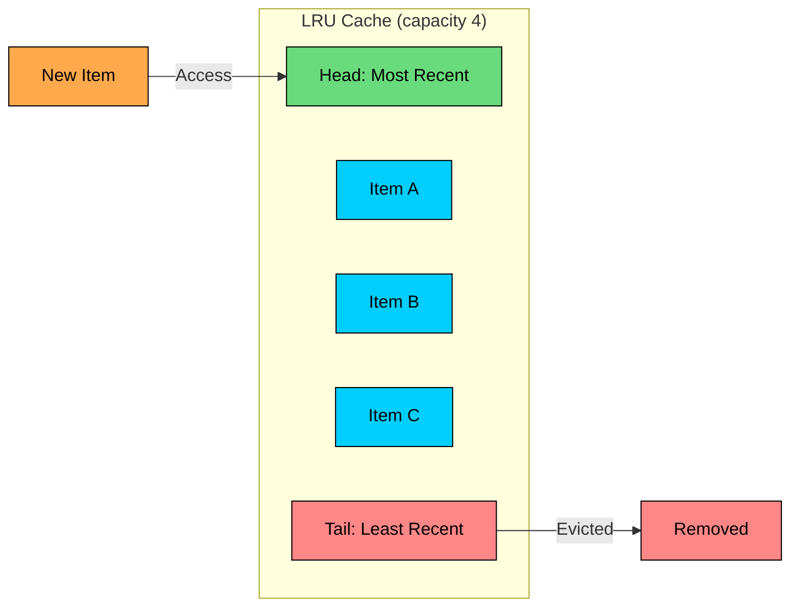

**Implementation:** Doubly linked list + hash map for O(1) operations.

**Pros:**

- Simple and effective
- Good for temporal locality
- O(1) operations with proper implementation

**Cons:**

- Single access can keep item in cache
- No frequency consideration

### 5.2 LFU (Least Frequently Used)

LFU tracks how many times each item has been accessed and removes the one with the lowest count. This keeps popular items around even if they have not been accessed recently.

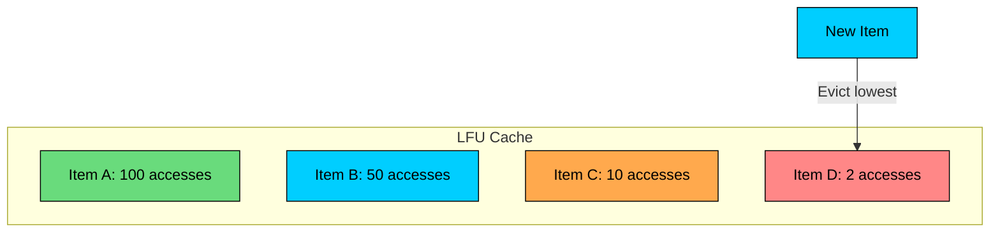

**Pros:**

- Keeps frequently accessed items
- Better for stable access patterns

**Cons:**

- Old popular items may never be evicted
- More complex to implement
- Slow to adapt to changing patterns

### 5.3 FIFO (First In, First Out)

The simplest policy: remove whatever was added first, regardless of how often it was accessed. This works when all items have roughly equal value.

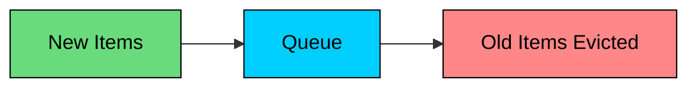

**Pros:**

- Simple implementation
- Predictable behavior
- Good when all items have similar value

**Cons:**

- Ignores access patterns
- May evict frequently used items

### 5.4 TTL (Time To Live)

TTL is not really an eviction policy, it is a data freshness policy. Items expire after a fixed duration regardless of how much space is available. You typically combine TTL with another policy like LRU.

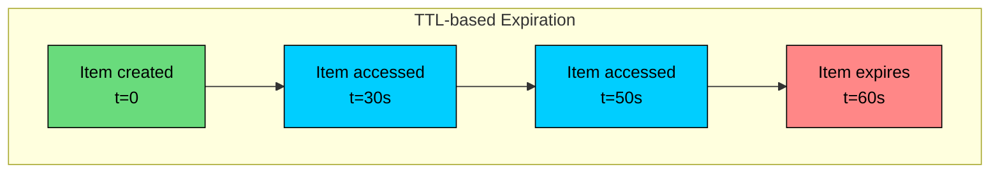

**Pros:**

- Ensures data freshness
- Simple to understand
- Natural cleanup of stale data

**Cons:**

- May evict still-useful items
- Choosing right TTL is tricky

### 5.5 Random Replacement

Evict a random item when cache is full.

**Pros:**

- Simplest implementation
- No metadata overhead

**Cons:**

- May evict important items
- Unpredictable behavior

### 5.6 Advanced Policies

For most use cases, LRU with TTL is enough. But if you are building a cache library or need the best possible hit rates, there are more sophisticated options:

**W-TinyLFU (used by Caffeine):** Combines recency and frequency using a probabilistic counting structure. It achieves near-optimal hit rates while using minimal memory overhead. If you are writing Java, Caffeine with W-TinyLFU is the gold standard for local caches.

**ARC (Adaptive Replacement Cache):** Dynamically balances between LRU and LFU based on the workload. It tracks both recently used and frequently used items, adapting as access patterns change.

**SLRU (Segmented LRU):** Divides the cache into two segments: probationary and protected. New items enter probationary. If accessed again, they are promoted to protected. This prevents one-time accesses from evicting valuable items.

### 5.7 Choosing an Eviction Policy

```mermaid
flowchart TD
    A{Access pattern"}:::primary
    A -->|Recent items accessed again| B[LRU]:::green
    A -->|Some items much more popular| C[LFU]:::green
    A -->|Uniform access, time-sensitive| D[TTL]:::orange
    A -->|Unknown or mixed| E[LRU with TTL]:::green

    classDef primary fill:#00ceff,stroke:#000,color:#000
    classDef green fill:#69db7c,stroke:#000,color:#000
    classDef orange fill:#ffa94d,stroke:#000,color:#000
```

| Policy | Best For |
|--------|----------|
| LRU | General purpose, temporal locality |
| LFU | Stable popularity, streaming |
| FIFO | Simple queues, batch processing |
| TTL | Time-sensitive data, consistency |
| Random | Uniform importance, simplicity |
| LRU + TTL | Most production systems |

---

# 6. Distributed Caching

Local caching works great until you have multiple application servers. Each server maintains its own cache, leading to duplicated data, inconsistency, and cold caches whenever a server restarts. Distributed caching solves these problems by providing a shared cache layer that all servers can access.

### 6.1 Why Distributed Caching"

```mermaid
flowchart TD

    subgraph Distributed["Distributed Cache Solution"]
        DS1[Server 1]:::primary
        DS2[Server 2]:::primary
        DS3[Server 3]:::primary
        DC[Shared Cache<br/>Redis Cluster]:::green
    end

    subgraph Local["Local Cache Problem"]
        S1[Server 1<br/>Cache A]:::orange
        S2[Server 2<br/>Cache A']:::orange
        S3[Server 3<br/>Cache A'']:::orange
    end

    DS1 --> DC
    DS2 --> DC
    DS3 --> DC

    classDef primary fill:#00ceff,stroke:#000,color:#000
    classDef orange fill:#ffa94d,stroke:#000,color:#000
    classDef green fill:#69db7c,stroke:#000,color:#000
```

**Problems with local-only cache:**

- Data duplicated across servers
- Inconsistency between servers
- Cold cache on new/restarted servers
- Limited by single server memory

**Distributed cache benefits:**

- Single source of truth
- Larger total capacity
- Survives server restarts
- Shared across all application instances

### 6.2 Distributed Cache Architecture

```mermaid
flowchart TD
    subgraph App["Application Tier"]
        A1[App 1]:::primary
        A2[App 2]:::primary
        A3[App 3]:::primary
    end

    subgraph Cache["Cache Tier"]
        C1[Cache Node 1]:::orange
        C2[Cache Node 2]:::orange
        C3[Cache Node 3]:::orange
    end

    subgraph DB["Database Tier"]
        D1[(Primary)]:::purple
        D2[(Replica)]:::purple
    end

    A1 --> C1
    A1 --> C2
    A2 --> C2
    A2 --> C3
    A3 --> C1
    A3 --> C3
    C1 -.-> D1
    C2 -.-> D1
    C3 -.-> D1

    classDef primary fill:#00ceff,stroke:#000,color:#000
    classDef orange fill:#ffa94d,stroke:#000,color:#000
    classDef purple fill:#9775fa,stroke:#000,color:#000
```

### 6.3 Data Partitioning

When you have multiple cache nodes, you need to decide which node stores which data. The naive approach (modulo hashing) breaks down when nodes are added or removed, causing most keys to be remapped. Consistent hashing solves this.

**Consistent Hashing:**

```mermaid
flowchart TD
    subgraph Ring["Hash Ring"]
        N1[Node 1<br/>0-90]:::primary
        N2[Node 2<br/>91-180]:::orange
        N3[Node 3<br/>181-270]:::green
        N4[Node 4<br/>271-360]:::purple
    end

    K1[Key A<br/>hash=45]:::primary --> N1
    K2[Key B<br/>hash=150]:::orange --> N2
    K3[Key C<br/>hash=200]:::green --> N3
    K4[Key D<br/>hash=300]:::purple --> N4

    classDef primary fill:#00ceff,stroke:#000,color:#000
    classDef orange fill:#ffa94d,stroke:#000,color:#000
    classDef green fill:#69db7c,stroke:#000,color:#000
    classDef purple fill:#9775fa,stroke:#000,color:#000
```

**Why consistent hashing"**

When a node is added or removed, only keys near that node move:

| Approach | Keys Remapped on Node Change |
|----------|------------------------------|
| Modulo hash | ~100% (all keys) |
| Consistent hash | ~1/N (minimal) |

**Virtual nodes:**

Each physical node has multiple positions on the ring for better distribution.

### 6.4 Replication

Replicate data across nodes for availability.

```mermaid
flowchart LR
    subgraph Replication["Replication Factor = 3"]
        P[Primary]:::green
        R1[Replica 1]:::orange
        R2[Replica 2]:::orange
    end

    W[Write]:::primary --> P
    P --> R1
    P --> R2
    R[Read]:::primary --> P
    R -.-> R1
    R -.-> R2

    classDef primary fill:#00ceff,stroke:#000,color:#000
    classDef green fill:#69db7c,stroke:#000,color:#000
    classDef orange fill:#ffa94d,stroke:#000,color:#000
```

**Replication strategies:**

| Strategy | Consistency | Availability | Use Case |
|----------|-------------|--------------|----------|
| Single copy | N/A | Low | Development |
| Async replication | Eventual | High | Most production |
| Sync replication | Strong | Medium | Consistency-critical |

### 6.5 Two-Tier Caching

The best of both worlds: combine a small local cache for hot data with a larger distributed cache for everything else. This gives you sub-millisecond latency for the hottest items while maintaining a shared cache for all servers.

```mermaid
flowchart LR
    A[Application]:::primary --> L1[L1: Local Cache<br/>~1ms]:::green
    L1 -->|Miss| L2[L2: Redis<br/>~5ms]:::orange
    L2 -->|Miss| DB[(Database<br/>~50ms)]:::purple

    classDef primary fill:#00ceff,stroke:#000,color:#000
    classDef green fill:#69db7c,stroke:#000,color:#000
    classDef orange fill:#ffa94d,stroke:#000,color:#000
    classDef purple fill:#9775fa,stroke:#000,color:#000
```

**Two-tier caching:**

**L1/L2 configuration:**

| Tier | Size | TTL | Consistency |
|------|------|-----|-------------|
| L1 (Local) | Small (100MB) | Short (1 min) | May be stale |
| L2 (Redis) | Large (10GB) | Longer (1 hour) | Source of truth |

---

# 7. Cache Consistency and Invalidation

"There are only two hard things in Computer Science: cache invalidation and naming things." This quote exists because cache invalidation really is hard. The moment you have a cache and a database, they can get out of sync.

### 7.1 The Consistency Challenge

Here is a race condition that catches many developers off guard:

```mermaid
flowchart TD
    subgraph Problem["Race Condition"]
        T1[Thread 1: Read DB]:::primary
        T2[Thread 2: Update DB]:::orange
        T3[Thread 2: Delete Cache]:::orange
        T4[Thread 1: Write Cache<br/>with stale data!]:::red
    end

    T1 --> T2 --> T3 --> T4

    classDef primary fill:#00ceff,stroke:#000,color:#000
    classDef orange fill:#ffa94d,stroke:#000,color:#000
    classDef red fill:#ff8787,stroke:#000,color:#000
```

**Timeline:**

### 7.2 Invalidation Strategies

There is no perfect solution. Each approach trades off between complexity, consistency, and performance.

#### **1. TTL-Based Expiration**

The simplest approach: set an expiration time on cached items and accept that data might be stale until the TTL expires.

**Pros:** Simple, automatic cleanup 

**Cons:** Stale data until TTL expires

#### **2. Event-Based Invalidation**

Invalidate on data changes.

**Pros:** Immediate consistency 

**Cons:** Must track all dependent caches

#### **3. Write-Through**

Update cache and database together.

**Pros:** Cache always up-to-date 

**Cons:** Write latency, failure handling

#### **4. Publish-Subscribe Invalidation**

Broadcast invalidation messages.

```mermaid
flowchart TD
    W[Writer]:::primary --> DB[(Database)]:::purple
    W --> PUB[Pub/Sub Channel]:::orange
    PUB --> S1[Server 1<br/>Invalidate Cache]:::green
    PUB --> S2[Server 2<br/>Invalidate Cache]:::green
    PUB --> S3[Server 3<br/>Invalidate Cache]:::green

    classDef primary fill:#00ceff,stroke:#000,color:#000
    classDef purple fill:#9775fa,stroke:#000,color:#000
    classDef orange fill:#ffa94d,stroke:#000,color:#000
    classDef green fill:#69db7c,stroke:#000,color:#000
```

### 7.3 Dealing with Race Conditions

The race condition from Section 7.1 is a real problem. Here are solutions that actually work in production:

```mermaid
sequenceDiagram
    participant T1 as Thread 1
    participant T2 as Thread 2
    participant C as Cache
    participant D as Database

    T1->>C: Get user:123 (miss)
    T1->>D: Read user:123
    T2->>D: Update user:123
    T2->>C: Delete user:123
    T1->>C: Set user:123 (stale!)
```

**Solution 1: Delayed double deletion**

**Solution 2: Cache versioning**

**Solution 3: Distributed locks**

### 7.4 Cache Stampede Prevention

When a popular cache entry expires, dozens or hundreds of requests might simultaneously hit the database to refetch it. This is called a cache stampede (or thundering herd), and it can take down your database.

```mermaid
flowchart TD
    subgraph Stampede["Cache Stampede"]
        E[Cache Expires]:::red
        R1[Request 1]:::orange --> DB[(Database)]:::purple
        R2[Request 2]:::orange --> DB
        R3[Request 3]:::orange --> DB
        R4[Request 100]:::orange --> DB
    end

    classDef red fill:#ff8787,stroke:#000,color:#000
    classDef orange fill:#ffa94d,stroke:#000,color:#000
    classDef purple fill:#9775fa,stroke:#000,color:#000
```

**Solution 1: Locking (single flight)**

**Solution 2: Probabilistic early expiration**

**Solution 3: Stale-while-revalidate**

### 7.5 Consistency Levels

Not all data needs the same consistency guarantees. Understanding the spectrum helps you make the right trade-offs:

```mermaid
flowchart LR
    subgraph Consistency["Consistency Spectrum"]
        S[Strong]:::green
        E[Eventual]:::orange
        W[Weak]:::red
    end

    S --> E --> W

    classDef green fill:#69db7c,stroke:#000,color:#000
    classDef orange fill:#ffa94d,stroke:#000,color:#000
    classDef red fill:#ff8787,stroke:#000,color:#000
```

| Level | Description | Trade-off | Use Case |
|-------|-------------|---------|----------|
| Strong | Cache always matches DB | Higher latency, complex | Financial data, inventory |
| Eventual | Cache catches up eventually | Some staleness | User profiles, product info |
| Weak | Cache may be stale | Fastest, simplest | Recommendations, analytics |

---

# 8. Cache Failures and Resilience

This is often the question that separates junior from senior candidates: "What happens when your cache goes down"" If you have not thought about this, your design has a single point of failure.

### 8.1 Failure Modes

```mermaid
flowchart LR
    subgraph Failures["Cache Failure Modes"]
        F1[Cache unavailable]:::red
        F2[Cache slow]:::orange
        F3[Partial failure]:::orange
        F4[Data corruption]:::red
        F5[Memory exhaustion]:::red
    end

    classDef red fill:#ff8787,stroke:#000,color:#000
    classDef orange fill:#ffa94d,stroke:#000,color:#000
```

### 8.2 Handling Cache Unavailability

The goal is to keep your system running even when the cache is down. Here are the strategies:

**Strategy 1: Graceful degradation**

Skip the cache and go straight to the database. This is slower but keeps things working.

**Strategy 2: Circuit breaker**

```mermaid
flowchart LR
    subgraph States["Circuit Breaker States"]
        C[Closed<br/>Normal]:::green
        O[Open<br/>Skip Cache]:::red
        H[Half-Open<br/>Testing]:::orange
    end

    C -->|Failures > threshold| O
    O -->|Timeout| H
    H -->|Success| C
    H -->|Failure| O

    classDef green fill:#69db7c,stroke:#000,color:#000
    classDef red fill:#ff8787,stroke:#000,color:#000
    classDef orange fill:#ffa94d,stroke:#000,color:#000
```

### 8.3 Preventing Cascading Failures

Here is the nightmare scenario: cache goes down, all requests hit the database, database gets overwhelmed, database goes down, entire system fails. This is a cascading failure.

```mermaid
flowchart TD
    subgraph Normal["Normal Operation"]
        R1[10K req/s]:::primary --> C1[Cache<br/>90% hit]:::green
        C1 -->|1K req/s| D1[(Database)]:::purple
    end

    subgraph Failure["Cache Failure"]
        R2[10K req/s]:::primary --> C2[Cache Down]:::red
        C2 -->|10K req/s| D2[(Database<br/>Overloaded!)]:::red
    end

    classDef primary fill:#00ceff,stroke:#000,color:#000
    classDef green fill:#69db7c,stroke:#000,color:#000
    classDef purple fill:#9775fa,stroke:#000,color:#000
    classDef red fill:#ff8787,stroke:#000,color:#000
```

**Protection strategies:**

**1. Rate limiting to database:**

**2. Request coalescing:**

**3. Serve stale data:**

### 8.4 Cache Warming

A cold cache is almost as bad as no cache. After a deployment or cache restart, your hit rate drops to zero and the database gets hammered. Cache warming pre-populates the cache before it takes live traffic.

```mermaid
flowchart TD
    subgraph Warming["Cache Warming Strategies"]
        S1[On deployment:<br/>Pre-load hot data]:::green
        S2[Gradual rollout:<br/>Shift traffic slowly]:::orange
        S3[Background job:<br/>Populate periodically]:::primary
    end

    classDef green fill:#69db7c,stroke:#000,color:#000
    classDef orange fill:#ffa94d,stroke:#000,color:#000
    classDef primary fill:#00ceff,stroke:#000,color:#000
```

**Pre-warming script:**

---

# 9. Caching Patterns in Practice

Theory is useful, but seeing how caching applies to real problems is where it clicks. These patterns appear constantly in system design interviews.

### 9.1 User Session Caching

Sessions are a perfect fit for Redis: they are accessed on every request, shared across servers, and can tolerate brief unavailability.

```mermaid
flowchart LR
    U[User]:::primary -->|Session Token| LB[Load Balancer]:::orange
    LB --> S1[Server 1]:::green
    LB --> S2[Server 2]:::green
    S1 --> R[(Redis<br/>Session Store)]:::purple
    S2 --> R

    classDef primary fill:#00ceff,stroke:#000,color:#000
    classDef orange fill:#ffa94d,stroke:#000,color:#000
    classDef green fill:#69db7c,stroke:#000,color:#000
    classDef purple fill:#9775fa,stroke:#000,color:#000
```

### 9.2 Feed/Timeline Caching

Social media timelines are one of the most cache-intensive features you can build. The pattern here is fanout on write: when a user posts, push the post ID to all their followers' timeline caches.

```mermaid
flowchart TD
    subgraph Write["Post Created"]
        P[New Post]:::primary --> F[Fanout Service]:::orange
        F --> T1[Timeline: User A]:::green
        F --> T2[Timeline: User B]:::green
        F --> T3[Timeline: User C]:::green
    end

    classDef primary fill:#00ceff,stroke:#000,color:#000
    classDef orange fill:#ffa94d,stroke:#000,color:#000
    classDef green fill:#69db7c,stroke:#000,color:#000
```

### 9.3 Leaderboard Caching

Redis sorted sets are purpose-built for leaderboards. You get O(log N) updates and O(log N) + M range queries, where M is the number of results returned.

### 9.4 Rate Limiting with Cache

Rate limiting requires tracking request counts with very low latency. Redis sorted sets make this elegant: store each request timestamp, remove expired entries, and count what remains.

### 9.5 URL Shortener Cache

URL shorteners are almost entirely read traffic. Some URLs (viral content) get millions of hits. This is a textbook case for multi-tier caching.

```mermaid
flowchart LR
    U[User]:::primary --> N[Nginx<br/>Cache]:::orange
    N -->|Miss| A[App Server]:::green
    A --> R[(Redis)]:::purple
    R -->|Miss| D[(Database)]:::red

    classDef primary fill:#00ceff,stroke:#000,color:#000
    classDef orange fill:#ffa94d,stroke:#000,color:#000
    classDef green fill:#69db7c,stroke:#000,color:#000
    classDef purple fill:#9775fa,stroke:#000,color:#000
    classDef red fill:#ff8787,stroke:#000,color:#000
```

### 9.6 E-commerce Product Cache

Product pages are read-heavy, but inventory changes frequently. The pattern here is to cache product details with moderate TTL, but invalidate aggressively when inventory changes (to avoid selling out-of-stock items).

---

# Summary

Caching is essential for building high-performance systems. Here are the key takeaways:

1. **Understand the hierarchy.** Cache at multiple levels: client, CDN, application, database. Each level has different trade-offs for latency, consistency, and complexity.
2. **Choose the right strategy.** Cache-aside for flexibility, read-through for simplicity, write-through for consistency, write-behind for write performance. Match strategy to access patterns.
3. **Eviction matters.** LRU with TTL works for most cases. Monitor hit rate and eviction rate to tune cache size and TTL.
4. **Distributed caching scales.** Use Redis or Memcached when local cache is not enough. Understand consistent hashing, replication, and cluster architectures.
5. **Invalidation is hard.** Plan your invalidation strategy carefully. Consider TTL, event-based invalidation, and race condition handling.
6. **Prevent stampedes.** Use locking, probabilistic refresh, or stale-while-revalidate to prevent thundering herd on cache expiration.
7. **Design for failure.** Cache failures should not bring down your system. Use circuit breakers, fallbacks, and cache warming.
8. **Monitor continuously.** Track hit rate, latency, eviction rate, and memory usage. Low hit rate means your caching strategy needs work.
9. **Consistency is a spectrum.** Strong consistency is expensive. Accept eventual consistency where possible and design for it.
10. **Cache what matters.** The Pareto principle applies: 20% of data gets 80% of requests. Focus caching efforts on hot data.

---

# Quiz
