Distributed systems are at the heart of every modern tech company. When your interviewer asks "How would you scale this system"" or "What happens if a server fails"", they are really asking about distributed systems concepts.

Yet many candidates only scratch the surface: "We add more servers and a load balancer." That is not enough. Interviewers want to understand your knowledge of CAP theorem, consistency models, failure detection, consensus algorithms, and the fundamental trade-offs that shape every distributed system.

This chapter provides a deep understanding of distributed systems for system design interviews. We will work through CAP theorem, consistency models, consensus algorithms, failure detection, and the patterns that make real systems work at scale.

---

# 1. Why Distributed Systems

> [!PAYWALL] This content is for premium members only.

Every system starts on a single server. And at some point, every successful system outgrows it. Understanding why we distribute, and what we give up in exchange, is foundational to everything that follows.

## 1.1 The Single Server Limit

A single server, no matter how powerful, hits a ceiling:

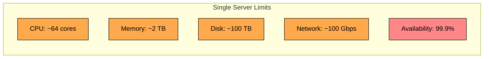

**Why a single server is not enough:**

| Limitation | Real-World Impact |
|------------|-------------------|
| CPU | Cannot process millions of requests per second |
| Memory | Cannot hold petabytes of data in memory |
| Disk | Single disk failure loses all data |
| Network | Single NIC creates bottleneck |
| Availability | Hardware fails, maintenance requires downtime |

## 1.2 What Distribution Provides

Spreading work across multiple machines breaks through these limits. But more importantly, it changes the failure model from "when will my server fail" to "which servers are failing right now, and does it matter""

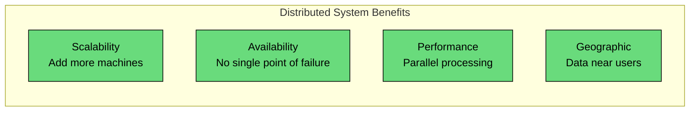

**Benefits of distribution:**

| Benefit | How It Works |
|---------|--------------|
| Horizontal scaling | Add machines to handle more load |
| Fault tolerance | System survives machine failures |
| Lower latency | Place servers near users globally |
| Cost efficiency | Use commodity hardware |

## 1.3 The Distribution Tax

Here is the uncomfortable truth: distribution makes everything harder. Problems that do not exist on a single server suddenly dominate your engineering time.

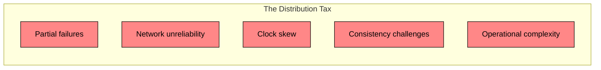

**Distribution challenges:**

| Challenge | Why It Is Hard |
|-----------|----------------|
| Partial failures | Some nodes fail while others work |
| Network partitions | Nodes cannot communicate |
| No global clock | Cannot agree on time across machines |
| Ordering events | No single source of truth for what happened when |
| Split-brain | Multiple nodes think they are the leader |

> 💡 **Key Insight:**

> **Interview Insight**
>
> **In an Interview:** When you propose a distributed architecture, acknowledge the trade-offs. 
>
> **Example:** "We are distributing for scalability and availability, but this means we need to handle partial failures, network partitions, and consistency trade-offs. For this use case, we can accept eventual consistency for user profiles but need strong consistency for the payment flow."

---

# 2. Fundamental Properties and Trade-offs

CAP theorem is probably the most cited, and most misunderstood, concept in distributed systems. Let me cut through the confusion.

## 2.1 The CAP Theorem

CAP says you cannot have all three of Consistency, Availability, and Partition Tolerance. But here is the key insight most people miss: you do not actually get to choose. Network partitions happen whether you like it or not. The real choice is what your system does when a partition occurs.

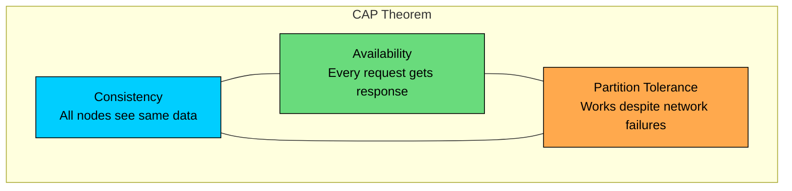

**The three properties:**

| Property | Definition |
|----------|------------|
| Consistency | Every read receives the most recent write |
| Availability | Every request receives a response (not an error) |
| Partition Tolerance | System operates despite network partitions |

## 2.2 Why You Must Choose

Network partitions are not a theoretical concern. Switches fail, cables get cut, datacenters lose connectivity. When that happens, your nodes cannot talk to each other. Now what"

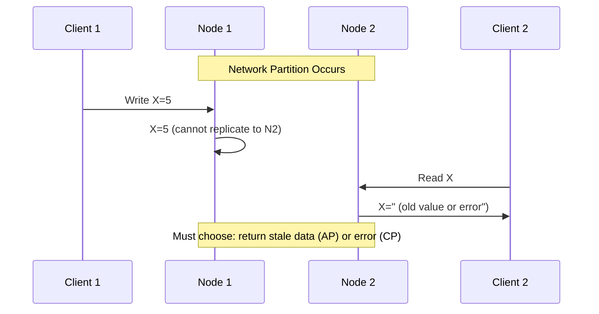

**During a partition, you must choose:**

| Choice | Behavior | Trade-off |
|--------|----------|-----------|
| CP | Reject operations that could be inconsistent | Sacrifices availability |
| AP | Accept operations, allow inconsistency | Sacrifices consistency |

## 2.3 CP vs AP Systems

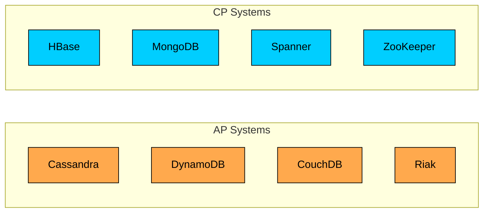

**Choosing CP or AP:**

| Use Case | Choice | Reason |
|----------|--------|--------|
| Financial transactions | CP | Incorrect balance is unacceptable |
| Shopping cart | AP | Better to see cart than nothing |
| User session | AP | Slight staleness is okay |
| Inventory for orders | CP | Overselling is costly |
| View counts | AP | Approximate count is fine |

## 2.4 PACELC: Beyond CAP

CAP has a blind spot: it only talks about what happens during partitions. But partitions are rare. What about the 99.99% of the time when your network is fine" 

That is where PACELC comes in.

```mermaid
flowchart TD
    subgraph pacelc["PACELC Theorem"]
        Q{Network Partition"}:::primary
        Q -->|Yes| PAC[Choose: Availability or Consistency]:::orange
        Q -->|No| ELC[Choose: Latency or Consistency]:::green
    end

    classDef primary fill:#00ceff,stroke:#000,color:#000
    classDef orange fill:#ffa94d,stroke:#000,color:#000
    classDef green fill:#69db7c,stroke:#000,color:#000
```

**PACELC categories:**

| System | If Partition (PA/PC) | Else (EL/EC) |
|--------|---------------------|--------------|
| DynamoDB | PA | EL (eventual consistency default) |
| Cassandra | PA | EL (tunable) |
| MongoDB | PC | EC (strong reads from primary) |
| Spanner | PC | EC (TrueTime for consistency) |
| PostgreSQL | PC | EC |

---

# 3. The Eight Fallacies of Distributed Computing

In the 1990s, engineers at Sun Microsystems documented the assumptions that kept breaking their distributed systems. These fallacies are still relevant today. I see candidates make these exact mistakes in interviews, designing systems as if they were running on a single machine with perfect networking.

## 3.1 The Fallacies

Every one of these sounds obviously wrong when stated explicitly. Yet we code as if they were true:

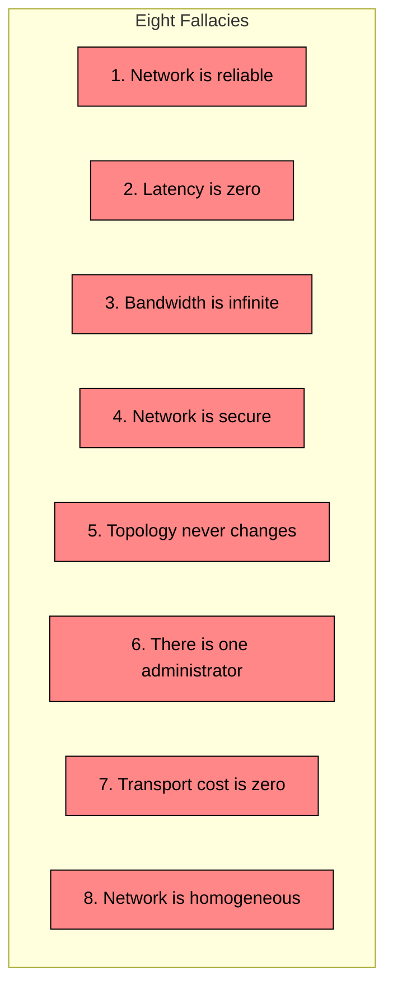

## 3.2 Fallacy 1: The Network Is Reliable

This is the big one. Every HTTP call, every RPC, every database query can fail in ways that a local function call cannot:

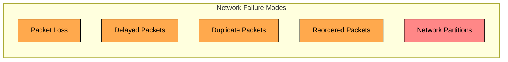

**Design implications:**

| Assumption | Reality | Solution |
|------------|---------|----------|
| Request arrives | May be lost | Implement retries with timeouts |
| Request arrives once | May arrive multiple times | Make operations idempotent |
| Response arrives | May be lost | Implement acknowledgments |
| Order preserved | May be reordered | Use sequence numbers |

## 3.3 Fallacy 2: Latency Is Zero

Local function calls take nanoseconds. Network calls take milliseconds, a million times slower. And that latency is not constant. Here is what you are actually dealing with:

**Design implications:**

| Assumption | Reality | Solution |
|------------|---------|----------|
| Calls are fast | Calls add latency | Minimize network round trips |
| Latency is constant | Latency varies | Design for worst case, use timeouts |
| Sync calls are fine | They block | Use async where possible |

## 3.4 Fallacy 3: Bandwidth Is Infinite

We often design as if we can send any amount of data anywhere instantly. In reality, bandwidth is finite, expensive, and shared:

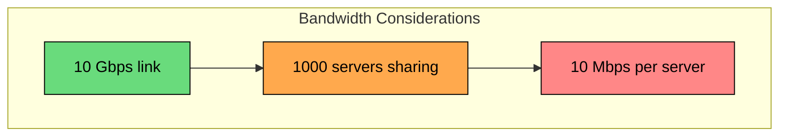

**Design implications:**

| Assumption | Reality | Solution |
|------------|---------|----------|
| Send anything | Bandwidth costs money | Compress data, use efficient serialization |
| Send everything | Network saturates | Send only necessary data, paginate |
| Uniform bandwidth | Varies by location | Cache at edge, use CDNs |

## 3.5 Remaining Fallacies

| Fallacy | Reality | Design Implication |
|---------|---------|-------------------|
| Network is secure | Attacks happen | Encrypt, authenticate, authorize |
| Topology never changes | Nodes come and go | Design for dynamic membership |
| One administrator | Multiple teams, providers | Design for operational complexity |
| Transport cost is zero | Cloud charges for transfer | Minimize cross-region traffic |
| Network is homogeneous | Different hardware, protocols | Use abstraction layers |

---

# 4. Time, Clocks, and Ordering

On a single machine, "what happened first"" is trivial. On multiple machines, it becomes one of the hardest problems in computer science. 

And it matters more than you might think: databases need it for conflict resolution, debuggers need it to reconstruct what happened, and distributed locks need it to be safe.

## 4.1 Why Time Is Hard

You might think: just synchronize all the clocks. The problem is that perfect synchronization is physically impossible:

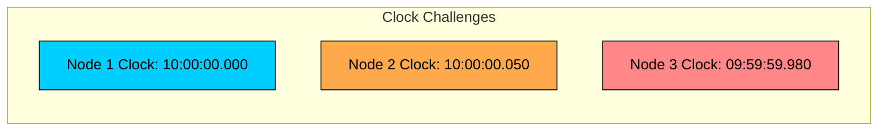

**Problems with physical clocks:**

| Problem | Description |
|---------|-------------|
| Clock drift | Clocks run at slightly different rates |
| Clock skew | Clocks show different times at same moment |
| NTP adjustments | Clocks can jump forward or backward |
| Leap seconds | Time can repeat or skip |

## 4.2 Physical Clock Synchronization

NTP (Network Time Protocol) synchronizes clocks but has limitations.

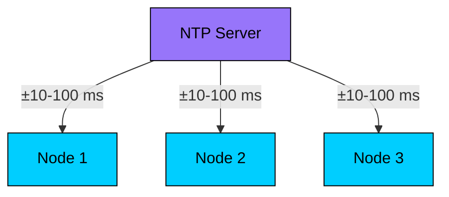

**NTP accuracy:**

| Environment | Typical Accuracy |
|-------------|------------------|
| Internet | 10-100 ms |
| Datacenter | 1-10 ms |
| Google Spanner (GPS/atomic) | < 7 ms |

**Why NTP is not enough:**

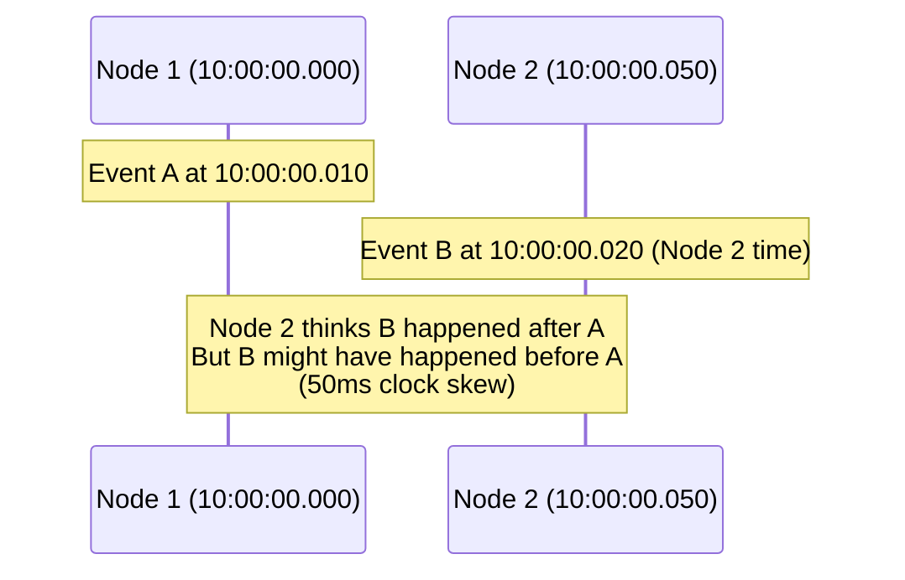

## 4.3 Logical Clocks

If we cannot trust physical time, we need a different approach. Logical clocks do not try to answer "what time did this happen"" Instead, they answer "did this happen before that"" which is often all we need.

#### **Lamport Timestamps:**

The simplest logical clock. Each node maintains a counter that increases with every event:

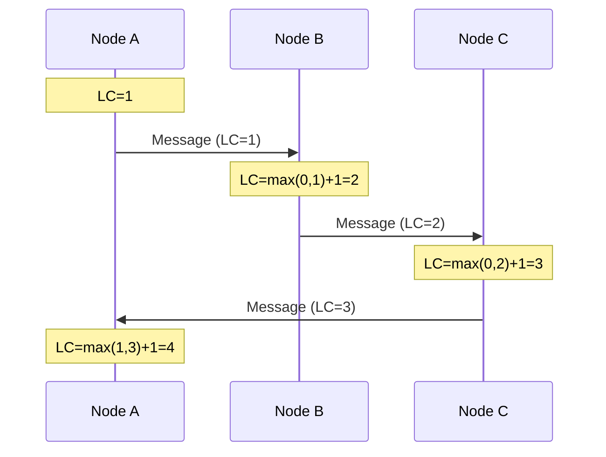

**Lamport clock rules:**

1. Before any event, increment local counter
2. When sending message, include current counter
3. When receiving, set counter to max(local, received) + 1

**Limitation:** Lamport clocks give total order but do not capture causality. If A has a lower timestamp than B, we cannot tell if A caused B or they were concurrent.

## 4.4 Vector Clocks

Lamport clocks have a limitation: if event A has a lower timestamp than event B, we cannot tell if A caused B or if they were concurrent. Vector clocks solve this by tracking the causal history of each event.

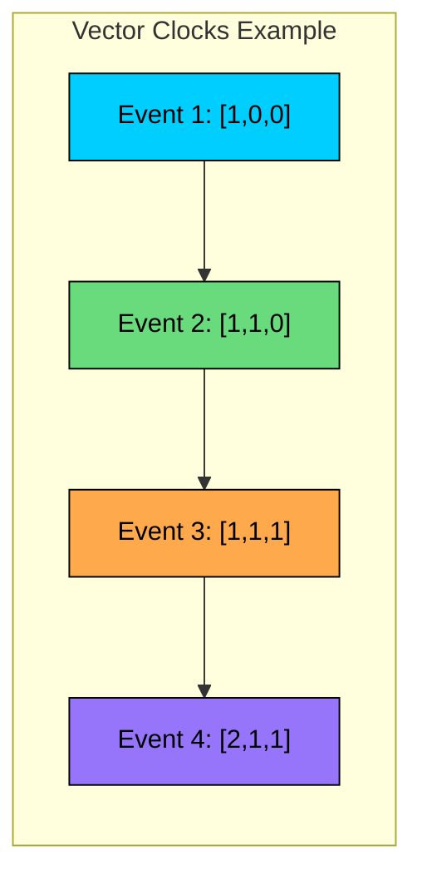

**Vector clock rules:**

1. Each node maintains a vector with one entry per node
2. On local event, increment own entry
3. On send, include entire vector
4. On receive, take max of each entry, then increment own

**Comparing vector clocks:**

| VC1 vs VC2 | Meaning |
|------------|---------|
| All entries in VC1 <= VC2 | VC1 happened before VC2 |
| All entries in VC2 <= VC1 | VC2 happened before VC1 |
| Neither | Concurrent events |

## 4.5 Hybrid Logical Clocks (HLC)

Vector clocks have a practical problem: they grow linearly with the number of nodes. With thousands of nodes, the overhead becomes significant. Hybrid Logical Clocks give us causality tracking with bounded size by combining physical time with a logical counter.

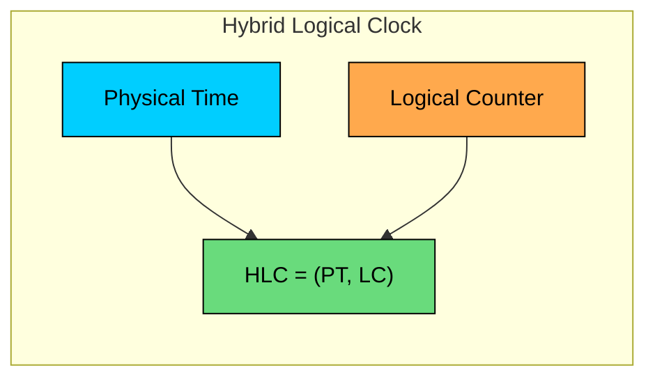

**HLC benefits:**

| Benefit | Explanation |
|---------|-------------|
| Close to physical time | Easier to reason about |
| Captures causality | Like vector clocks |
| Bounded size | Unlike unbounded vector clocks |
| Wait-free | No synchronization needed |

Used by CockroachDB and other modern distributed databases.

---

# 5. Failure Detection and Handling

Here is a fundamental truth about distributed systems: you cannot tell the difference between a dead node and a slow one. This simple fact has profound implications for how we design systems.

## 5.1 Types of Failures

Not all failures are equal. Some are easy to handle, others are nearly impossible:

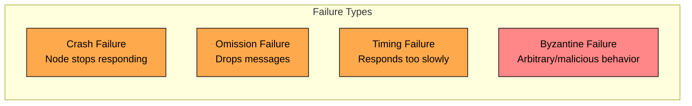

**Failure severity hierarchy:**

| Failure Type | Description | Handling Difficulty |
|--------------|-------------|---------------------|
| Crash | Node stops, does not recover | Easiest |
| Crash-recovery | Node stops, may recover | Moderate |
| Omission | Drops some messages | Moderate |
| Timing | Responds outside expected time | Hard |
| Byzantine | Arbitrary, possibly malicious | Hardest |

## 5.2 The Failure Detection Problem

When you send a message and get no response, you face an impossible question:

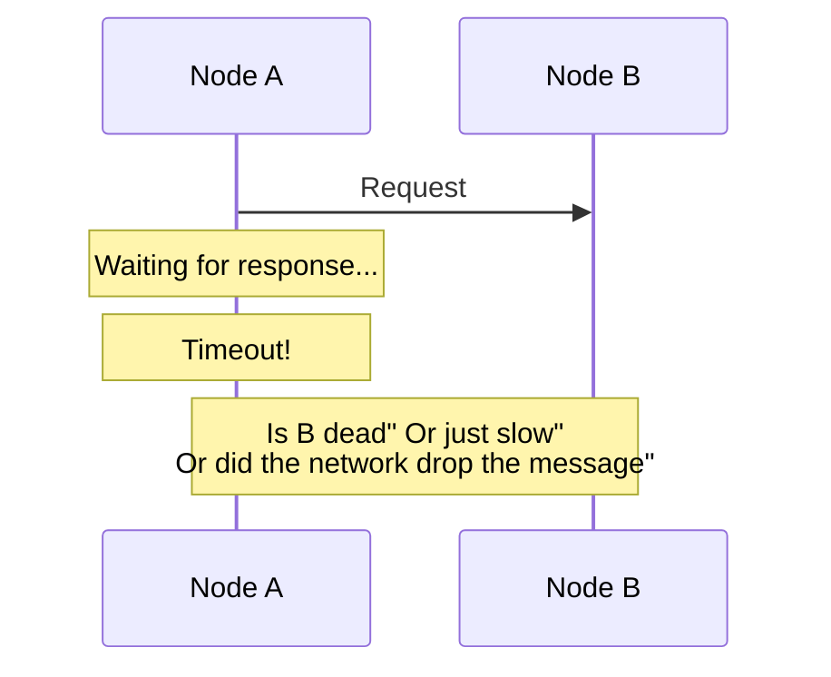

**The fundamental problem:**

| Scenario | Symptom | Reality |
|----------|---------|---------|
| Node crashed | No response | Node is dead |
| Node is slow | No response (yet) | Node is alive |
| Network partition | No response | Node is alive, unreachable |
| Message lost | No response | Node is alive |

## 5.3 Heartbeat-Based Detection

The simplest solution: have nodes periodically say "I am alive." If you stop hearing from a node, assume it is dead. Simple, but the devil is in the parameters.

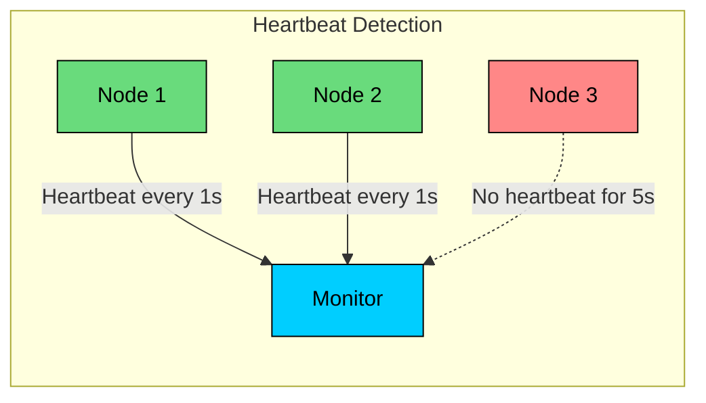

**Heartbeat parameters:**

| Parameter | Description | Trade-off |
|-----------|-------------|-----------|
| Interval | How often to send | More frequent = more overhead |
| Timeout | When to declare failure | Too short = false positives |
| Threshold | Missed beats before failure | Higher = slower detection |

**Typical configuration:**

## 5.4 Phi Accrual Failure Detector

Binary heartbeat detection has a problem: network conditions vary. A node that usually responds in 1ms might occasionally take 100ms during a GC pause. Phi accrual detection adapts to these patterns by computing a suspicion level instead of a binary judgment.

```mermaid
flowchart LR
    subgraph phi["Phi Accrual Detector"]
        H[Heartbeat History]:::primary
        PHI[φ Value<br/>Suspicion Level]:::orange
        D{φ > Threshold"}:::purple
        ALIVE[Alive]:::green
        DEAD[Dead]:::red
    end

    H --> PHI --> D
    D -->|No| ALIVE
    D -->|Yes| DEAD

    classDef primary fill:#00ceff,stroke:#000,color:#000
    classDef orange fill:#ffa94d,stroke:#000,color:#000
    classDef purple fill:#9775fa,stroke:#000,color:#000
    classDef green fill:#69db7c,stroke:#000,color:#000
    classDef red fill:#ff8787,stroke:#000,color:#000
```

**How it works:**

1. Track historical heartbeat arrival times
2. Model arrival times as a probability distribution
3. Compute φ = -log₁₀(P(heartbeat not received given history))
4. Higher φ = higher suspicion of failure

**Benefits:**

| Benefit | Explanation |
|---------|-------------|
| Adaptive | Adjusts to network conditions |
| Probabilistic | Gives confidence level, not binary |
| Fewer false positives | Accounts for variable latency |

Used by Cassandra, Akka, and other distributed systems.

## 5.5 Gossip-Based Detection

Centralized failure detection has a single point of failure. Gossip protocols solve this by having nodes share their observations with each other, like rumors spreading through a crowd.

```mermaid
flowchart LR
    subgraph gossip["Gossip Protocol"]
        N1[Node 1]:::green
        N2[Node 2]:::green
        N3[Node 3]:::green
        N4[Node 4]:::red
    end

    N1 <-->|"Gossip: N4 suspicious"| N2
    N2 <-->|"Gossip: N4 suspicious"| N3
    N3 <-->|"Gossip: N4 suspicious"| N1

    classDef green fill:#69db7c,stroke:#000,color:#000
    classDef red fill:#ff8787,stroke:#000,color:#000
```

**How gossip detection works:**

1. Each node periodically picks random node to gossip with
2. Exchange heartbeat information about all known nodes
3. If multiple nodes report node X as unresponsive, X is likely failed
4. Quorum requirement reduces false positives

## 5.6 Handling Detected Failures

Detecting a failure is only half the battle. What you do about it matters more:

```mermaid
flowchart TD
    DETECT[Failure Detected]:::red --> WHAT{What to do"}
    WHAT --> RETRY[Retry]:::orange
    WHAT --> FAILOVER[Failover]:::green
    WHAT --> CIRCUIT[Circuit Breaker]:::primary
    WHAT --> GRACEFUL[Graceful Degradation]:::purple

    classDef red fill:#ff8787,stroke:#000,color:#000
    classDef orange fill:#ffa94d,stroke:#000,color:#000
    classDef green fill:#69db7c,stroke:#000,color:#000
    classDef primary fill:#00ceff,stroke:#000,color:#000
    classDef purple fill:#9775fa,stroke:#000,color:#000
```

**Failure handling strategies:**

| Strategy | When to Use | Implementation |
|----------|-------------|----------------|
| Retry | Transient failures | Exponential backoff with jitter |
| Failover | Node failure | Route to replica |
| Circuit breaker | Cascading failures | Stop calling failing service |
| Graceful degradation | Partial outage | Return cached/default data |

---

# 6. Consensus and Coordination

At some point, your distributed nodes need to agree on something: who is the current leader, what is the order of operations, whether a transaction should commit. Getting machines to agree sounds simple until you consider that any of them might crash mid-decision, and messages between them might be lost or delayed.

## 6.1 The Consensus Problem

The basic question: given multiple nodes that might propose different values, how do we ensure they all agree on exactly one"

```mermaid
flowchart LR
    subgraph consensus["Consensus Problem"]
        N1[Node 1: proposes A]:::primary
        N2[Node 2: proposes B]:::orange
        N3[Node 3: proposes C]:::green
        AGREE[All agree on one value]:::purple
    end

    N1 --> AGREE
    N2 --> AGREE
    N3 --> AGREE

    classDef primary fill:#00ceff,stroke:#000,color:#000
    classDef orange fill:#ffa94d,stroke:#000,color:#000
    classDef green fill:#69db7c,stroke:#000,color:#000
    classDef purple fill:#9775fa,stroke:#000,color:#000
```

**Consensus requirements:**

| Property | Description |
|----------|-------------|
| Agreement | All non-faulty nodes decide same value |
| Validity | If all propose same value, that is decided |
| Termination | All non-faulty nodes eventually decide |
| Integrity | Each node decides at most once |

## 6.2 FLP Impossibility

Here is the sobering reality: in 1985, Fischer, Lynch, and Paterson proved that consensus is impossible to guarantee in an asynchronous system if even one node can fail. This is not a limitation of our algorithms, it is a fundamental result.

```mermaid
flowchart LR
    subgraph flp["FLP Impossibility"]
        ASYNC[Asynchronous<br/>System]:::primary
        FAULT[One Crash<br/>Failure]:::red
        DET[Deterministic<br/>Algorithm]:::orange
    end

    ASYNC --> IMPOSSIBLE[Consensus Impossible]:::red
    FAULT --> IMPOSSIBLE
    DET --> IMPOSSIBLE

    classDef primary fill:#00ceff,stroke:#000,color:#000
    classDef red fill:#ff8787,stroke:#000,color:#000
    classDef orange fill:#ffa94d,stroke:#000,color:#000
```

**How real systems work despite FLP:**

| Approach | How It Works |
|----------|--------------|
| Timing assumptions | Assume partial synchrony |
| Randomization | Make algorithm non-deterministic |
| Failure detectors | Assume imperfect failure detection |

## 6.3 Paxos

Paxos is the foundational consensus algorithm, invented by Leslie Lamport. It is famously difficult to understand, but the core idea is elegant: a proposer cannot succeed unless a majority of acceptors agree to hear it out.

```mermaid
sequenceDiagram
    participant P as Proposer
    participant A1 as Acceptor 1
    participant A2 as Acceptor 2
    participant A3 as Acceptor 3
    participant L as Learner

    Note over P,A3: Phase 1: Prepare

    P->>A1: Prepare(n=1)
    P->>A2: Prepare(n=1)
    P->>A3: Prepare(n=1)

    A1->>P: Promise(n=1, no previous)
    A2->>P: Promise(n=1, no previous)
    A3->>P: Promise(n=1, no previous)

    Note over P,A3: Phase 2: Accept

    P->>A1: Accept(n=1, v=X)
    P->>A2: Accept(n=1, v=X)
    P->>A3: Accept(n=1, v=X)

    A1->>P: Accepted(n=1, v=X)
    A2->>P: Accepted(n=1, v=X)
    A3->>P: Accepted(n=1, v=X)

    Note over P,L: Value X is chosen

    A1->>L: Learn(v=X)
    A2->>L: Learn(v=X)
```

**Paxos roles:**

| Role | Responsibility |
|------|----------------|
| Proposer | Proposes values |
| Acceptor | Votes on proposals |
| Learner | Learns decided value |

**Why Paxos is hard:**

- Multiple rounds for single value
- Complex failure cases
- Difficult to implement correctly
- Multi-Paxos needed for log replication

## 6.4 Raft

Raft was explicitly designed to be understandable. Where Paxos optimizes for theoretical elegance, Raft optimizes for clarity. The result is an algorithm you can actually implement correctly. Most modern distributed systems use Raft or a Raft-like protocol.

```mermaid
flowchart LR
    subgraph raft["Raft Consensus"]
        L[Leader]:::green
        F1[Follower 1]:::orange
        F2[Follower 2]:::orange
        F3[Follower 3]:::orange
        F4[Follower 4]:::orange
    end

    L -->|Append Entries| F1
    L -->|Append Entries| F2
    L -->|Append Entries| F3
    L -->|Append Entries| F4

    classDef green fill:#69db7c,stroke:#000,color:#000
    classDef orange fill:#ffa94d,stroke:#000,color:#000
```

**Raft key concepts:**

| Concept | Description |
|---------|-------------|
| Leader election | One leader per term |
| Log replication | Leader replicates entries to followers |
| Safety | Never return incorrect results |
| Commitment | Entry committed when majority has it |

**Raft state machine:**

```mermaid
stateDiagram-v2
    [*] --> Follower
    Follower --> Candidate: Election timeout
    Candidate --> Follower: Discover leader or new term
    Candidate --> Leader: Receive majority votes
    Leader --> Follower: Discover higher term
```

**Leader election:**

```mermaid
sequenceDiagram
    participant F1 as Follower 1
    participant C as Candidate
    participant F2 as Follower 2
    participant F3 as Follower 3

    Note over F1,F3: Election timeout on Candidate

    C->>F1: RequestVote(term=2)
    C->>F2: RequestVote(term=2)
    C->>F3: RequestVote(term=2)

    F1->>C: Vote granted
    F2->>C: Vote granted
    F3->>C: Vote granted

    Note over C: Majority received, becomes Leader

    C->>F1: AppendEntries (heartbeat)
    C->>F2: AppendEntries (heartbeat)
    C->>F3: AppendEntries (heartbeat)
```

## 6.5 Raft vs Paxos

| Aspect | Paxos | Raft |
|--------|-------|------|
| Understandability | Complex | Designed for clarity |
| Leader | Not required (but helps) | Always has one leader |
| Log structure | Gaps possible | No gaps |
| Membership changes | Complex | Joint consensus |
| Implementations | Chubby, Spanner | etcd, Consul, CockroachDB |

## 6.6 Coordination Services

The practical advice for interviews: do not implement consensus yourself. Use a coordination service like ZooKeeper, etcd, or Consul. These systems have been battle-tested for years and provide the primitives you need.

```mermaid
flowchart LR
    subgraph coord["Coordination Service"]
        APP1[Application 1]:::primary
        APP2[Application 2]:::primary
        APP3[Application 3]:::primary
        ZK[ZooKeeper/etcd]:::purple
    end

    APP1 --> ZK
    APP2 --> ZK
    APP3 --> ZK

    classDef primary fill:#00ceff,stroke:#000,color:#000
    classDef purple fill:#9775fa,stroke:#000,color:#000
```

**Primitives provided:**

| Primitive | Use Case |
|-----------|----------|
| Configuration | Store shared config |
| Service discovery | Find service instances |
| Leader election | Choose single leader |
| Distributed locks | Mutual exclusion |
| Barriers | Coordinate phases |

---

# 7. Consistency Models

When you read data from a distributed system, what guarantees do you have about what you will see" Consistency models answer this question. Understanding them is crucial because different parts of your system likely need different guarantees.

## 7.1 The Consistency Spectrum

Consistency is not binary. It is a spectrum, and stronger consistency comes at higher cost:

```mermaid
flowchart LR
    subgraph spectrum["Consistency Spectrum"]
        E[Eventual]:::red
        M[Monotonic]:::orange
        CC[Causal]:::orange
        SEQ[Sequential]:::green
        LIN[Linearizable]:::green
    end

    E -->|"Weaker"| M -->|to| CC -->|to| SEQ -->|"Stronger"| LIN

    classDef red fill:#ff8787,stroke:#000,color:#000
    classDef orange fill:#ffa94d,stroke:#000,color:#000
    classDef green fill:#69db7c,stroke:#000,color:#000
```

## 7.2 Eventual Consistency

The weakest useful guarantee: if you stop writing, eventually all replicas will have the same data. But "eventually" might be seconds, and in the meantime, different readers might see different values.

```mermaid
sequenceDiagram
    participant W as Writer
    participant R1 as Replica 1
    participant R2 as Replica 2
    participant Reader as Reader

    W->>R1: Write X=5
    R1->>R2: Replicate (async)
    Reader->>R2: Read X
    R2->>Reader: X=0 (stale!)

    Note over R1,R2: Eventually...

    Reader->>R2: Read X
    R2->>Reader: X=5 (converged)
```

**Properties:**

| Property | Value |
|----------|-------|
| Read consistency | May read stale data |
| Convergence | Guaranteed (eventually) |
| Availability | High |
| Latency | Low |

**Use cases:** DNS, caches, view counters, likes.

## 7.3 Causal Consistency

Causal consistency is the sweet spot for many applications. It guarantees that if event A caused event B, everyone will see A before B. But unrelated events can appear in any order.

```mermaid
flowchart LR
    subgraph causal["Causal Ordering"]
        A["Alice: Going to party!"]:::primary
        B["Bob: (reads Alice) Me too!"]:::green
        C["Carol: Nice weather"]:::orange
    end

    A -->|Causes| B
    C -.->|"No relationship"| A

    classDef primary fill:#00ceff,stroke:#000,color:#000
    classDef green fill:#69db7c,stroke:#000,color:#000
    classDef orange fill:#ffa94d,stroke:#000,color:#000
```

**Rules:**

1. If A happened before B on same process, everyone sees A before B
2. If B read from A, everyone sees A before B
3. Concurrent events can be seen in any order

**Use cases:** Social feeds, collaborative editing, chat.

## 7.4 Sequential Consistency

All operations appear to happen in some sequential order, and operations from each process appear in program order.

```mermaid
sequenceDiagram
    participant P1 as Process 1
    participant P2 as Process 2
    participant Sys as System

    P1->>Sys: Write X=1
    P2->>Sys: Write Y=1
    P1->>Sys: Read Y → 0 or 1
    P2->>Sys: Read X → 0 or 1

    Note over P1,Sys: Not allowed: P1 reads Y=1, P2 reads X=0<br/>AND P1 reads X=1, P2 reads Y=0<br/>(no valid sequential order)
```

**Properties:**

- Total order of all operations
- Each process's operations appear in program order
- Does NOT guarantee real-time ordering

## 7.5 Linearizability (Strong Consistency)

The strongest guarantee: operations appear to happen instantaneously at some point between when you call them and when they return. The system behaves as if there is only one copy of the data. This is what most people mean when they say "consistent."

```mermaid
sequenceDiagram
    participant C1 as Client 1
    participant Sys as System
    participant C2 as Client 2

    C1->>Sys: Write X=5 (starts)
    Note over Sys: Linearization point
    Sys->>C1: OK (completes)

    C2->>Sys: Read X (starts after write completes)
    Sys->>C2: X=5 (must see the write)
```

**Properties:**

| Property | Description |
|----------|-------------|
| Real-time ordering | If op1 completes before op2 starts, op1 < op2 |
| Atomicity | Operations appear instantaneous |
| Single-copy illusion | System behaves like one copy |

**Cost:**

| Cost | Reason |
|------|--------|
| Higher latency | Coordination required |
| Lower availability | Cannot serve during partitions |
| More complex | Requires consensus |

## 7.6 Choosing Consistency Level

```mermaid
flowchart TD
    Q1{Stale reads OK"}:::primary
    Q1 -->|Yes| EVEN[Eventual Consistency]:::green
    Q1 -->|No| Q2{Need real-time order"}
    Q2 -->|No| CAUS[Causal Consistency]:::orange
    Q2 -->|Yes| Q3{Can tolerate unavailability"}
    Q3 -->|Yes| LIN[Linearizability]:::green
    Q3 -->|No| TRADEOFF[Reconsider requirements]:::red

    classDef primary fill:#00ceff,stroke:#000,color:#000
    classDef green fill:#69db7c,stroke:#000,color:#000
    classDef orange fill:#ffa94d,stroke:#000,color:#000
    classDef red fill:#ff8787,stroke:#000,color:#000
```

| Use Case | Recommended Consistency |
|----------|------------------------|
| Session data | Eventual (with read-your-writes) |
| User profile | Causal |
| Comment threads | Causal |
| Bank account balance | Linearizable |
| Inventory for orders | Linearizable |
| Analytics counts | Eventual |

---

# 8. Distributed System Patterns

These are the building blocks you will use again and again. Each pattern solves a specific problem that arises in distributed systems. Knowing when to apply each one is a key skill for system design interviews.

## 8.1 Leader Election

Sometimes you need exactly one node to do something: process a queue, coordinate writes, run a scheduled job. Leader election ensures exactly one node holds that responsibility at any time.

```mermaid
flowchart LR
    subgraph election["Leader Election"]
        N1[Node 1]:::orange
        N2[Node 2]:::green
        N3[Node 3]:::orange
        N4[Node 4]:::orange
    end

    N2 -->|"I am leader"| N1
    N2 -->|"I am leader"| N3
    N2 -->|"I am leader"| N4

    classDef green fill:#69db7c,stroke:#000,color:#000
    classDef orange fill:#ffa94d,stroke:#000,color:#000
```

**Implementation approaches:**

| Approach | How It Works | Used By |
|----------|--------------|---------|
| Consensus-based | Use Raft/Paxos to elect | etcd, ZooKeeper |
| Lease-based | Leader holds time-limited lease | Chubby, many DBs |
| Bully algorithm | Highest ID wins | Simple systems |

**Lease-based election:**

```mermaid
sequenceDiagram
    participant L as Leader
    participant Z as Coordination Service
    participant F as Followers

    L->>Z: Acquire lease (10s)
    Z->>L: Lease granted

    loop Every 3 seconds
        L->>Z: Renew lease
        Z->>L: Renewed
    end

    Note over L: Leader crashes
    Note over Z: Lease expires (10s)

    F->>Z: Acquire lease
    Z->>F: New leader
```

## 8.2 Distributed Locking

When multiple processes need exclusive access to a resource, you need a distributed lock. But distributed locks are tricky: the lock holder might crash, the network might partition, and you still need to make progress.

```mermaid
flowchart LR
    subgraph lock["Distributed Lock"]
        P1[Process 1]:::primary
        P2[Process 2]:::orange
        P3[Process 3]:::orange
        LOCK[Lock Service]:::purple
        RES[Shared Resource]:::green
    end

    P1 -->|"Holds lock"| LOCK
    P2 -.->|"Waiting"| LOCK
    P3 -.->|"Waiting"| LOCK
    P1 --> RES

    classDef primary fill:#00ceff,stroke:#000,color:#000
    classDef orange fill:#ffa94d,stroke:#000,color:#000
    classDef purple fill:#9775fa,stroke:#000,color:#000
    classDef green fill:#69db7c,stroke:#000,color:#000
```

**Redlock algorithm (Redis):**

**Distributed lock challenges:**

| Challenge | Solution |
|-----------|----------|
| Process pauses (GC) | Use fencing tokens |
| Clock skew | Use monotonic clocks for timeouts |
| Network delays | Account for RTT in TTL |
| Split brain | Require majority for lock |

## 8.3 Saga Pattern

Traditional database transactions do not work across services. The saga pattern is the alternative: break the transaction into a sequence of local transactions, each with a compensating action that can undo it if something fails later.

```mermaid
flowchart LR
    subgraph saga["Saga: Order Processing"]
        T1[Create Order]:::green
        T2[Reserve Inventory]:::green
        T3[Process Payment]:::red
        T4[Ship Order]:::orange
    end

    subgraph compensate["Compensating Transactions"]
        C1[Cancel Order]:::orange
        C2[Release Inventory]:::orange
    end

    T1 --> T2 --> T3
    T3 -->|"Failure"| C2
    C2 --> C1

    classDef green fill:#69db7c,stroke:#000,color:#000
    classDef red fill:#ff8787,stroke:#000,color:#000
    classDef orange fill:#ffa94d,stroke:#000,color:#000
```

**Saga types:**

| Type | Coordination | Pros | Cons |
|------|--------------|------|------|
| Choreography | Events between services | Loose coupling | Hard to track |
| Orchestration | Central coordinator | Easy to understand | Single point |

## 8.4 Event Sourcing

Instead of storing current state, store the sequence of events that led to it. This gives you a complete audit trail and the ability to reconstruct state at any point in time.

```mermaid
flowchart LR
    subgraph events["Event Store"]
        E1["AccountCreated<br/>{id: 1}"]:::primary
        E2["MoneyDeposited<br/>{amount: 100}"]:::green
        E3["MoneyWithdrawn<br/>{amount: 30}"]:::orange
        E4["MoneyDeposited<br/>{amount: 50}"]:::green
    end

    STATE["Current State<br/>Balance: 120"]:::purple

    E1 --> E2 --> E3 --> E4 --> STATE

    classDef primary fill:#00ceff,stroke:#000,color:#000
    classDef green fill:#69db7c,stroke:#000,color:#000
    classDef orange fill:#ffa94d,stroke:#000,color:#000
    classDef purple fill:#9775fa,stroke:#000,color:#000
```

**Benefits:**

| Benefit | Description |
|---------|-------------|
| Complete audit trail | All changes recorded |
| Time travel | Reconstruct state at any point |
| Event replay | Rebuild read models |
| Debug production | Replay events to reproduce issues |

## 8.5 CQRS (Command Query Responsibility Segregation)

Reads and writes often have different requirements. CQRS separates them completely: writes go to one model optimized for validation and consistency, reads go to another optimized for queries.

```mermaid
flowchart TD
    subgraph cqrs["CQRS Pattern"]
        CMD[Commands]:::primary
        WM[Write Model]:::green
        ES[(Event Store)]:::purple
        RM[Read Model]:::orange
        Q[Queries]:::primary
    end

    CMD --> WM --> ES
    ES -->|"Project"| RM
    Q --> RM

    classDef primary fill:#00ceff,stroke:#000,color:#000
    classDef green fill:#69db7c,stroke:#000,color:#000
    classDef purple fill:#9775fa,stroke:#000,color:#000
    classDef orange fill:#ffa94d,stroke:#000,color:#000
```

**When to use CQRS:**

| Use Case | Why CQRS Helps |
|----------|----------------|
| Read-heavy workloads | Optimize read model independently |
| Complex domains | Separate write validation from read queries |
| Event sourcing | Natural fit for projecting events |
| Multiple read formats | Different views of same data |

## 8.6 Circuit Breaker

When a service fails, continuing to call it makes things worse: you waste resources, add latency, and risk cascading the failure. Circuit breakers stop calling a failing service, give it time to recover, then cautiously try again.

```mermaid
stateDiagram-v2
    [*] --> Closed
    Closed --> Open: Failure threshold exceeded
    Open --> HalfOpen: Timeout expires
    HalfOpen --> Closed: Success
    HalfOpen --> Open: Failure
```

**States:**

| State | Behavior |
|-------|----------|
| Closed | Requests flow normally |
| Open | Requests fail immediately |
| Half-Open | Limited requests to test recovery |

**Configuration:**

---

# 9. Observability and Debugging

In a distributed system, you cannot attach a debugger and step through code. Your request might touch ten services across three datacenters. Without proper observability, you are flying blind.

## 9.1 The Three Pillars of Observability

Every production distributed system needs all three:

```mermaid
flowchart LR
    subgraph pillars["Three Pillars"]
        LOGS[Logs<br/>What happened]:::primary
        METRICS[Metrics<br/>How much/many]:::green
        TRACES[Traces<br/>Request flow]:::orange
    end

    classDef primary fill:#00ceff,stroke:#000,color:#000
    classDef green fill:#69db7c,stroke:#000,color:#000
    classDef orange fill:#ffa94d,stroke:#000,color:#000
```

## 9.2 Distributed Tracing

The killer feature for debugging distributed systems: follow a single request as it bounces between services. Each hop is a "span," and all the spans together form a "trace."

```mermaid
flowchart LR
    subgraph trace["Distributed Trace"]
        GW[API Gateway<br/>Span 1]:::primary
        AUTH[Auth Service<br/>Span 2]:::green
        USER[User Service<br/>Span 3]:::orange
        DB[(Database<br/>Span 4)]:::purple
    end

    GW --> AUTH --> USER --> DB

    classDef primary fill:#00ceff,stroke:#000,color:#000
    classDef green fill:#69db7c,stroke:#000,color:#000
    classDef orange fill:#ffa94d,stroke:#000,color:#000
    classDef purple fill:#9775fa,stroke:#000,color:#000
```

**Trace components:**

| Component | Description |
|-----------|-------------|
| Trace ID | Unique identifier for entire request |
| Span | Single unit of work |
| Span ID | Unique identifier for span |
| Parent Span ID | Links spans in hierarchy |
| Tags | Key-value metadata |

**Trace propagation:**

## 9.3 Key Metrics for Distributed Systems

```mermaid
flowchart LR
    subgraph metrics["Essential Metrics"]
        M1[Latency<br/>p50, p95, p99]:::primary
        M2[Error Rate<br/>4xx, 5xx]:::red
        M3[Throughput<br/>RPS]:::green
        M4[Saturation<br/>Resource usage]:::orange
    end

    classDef primary fill:#00ceff,stroke:#000,color:#000
    classDef red fill:#ff8787,stroke:#000,color:#000
    classDef green fill:#69db7c,stroke:#000,color:#000
    classDef orange fill:#ffa94d,stroke:#000,color:#000
```

**The RED method (for services):**

| Metric | Meaning |
|--------|---------|
| Rate | Requests per second |
| Errors | Failed requests per second |
| Duration | Latency distribution |

**The USE method (for resources):**

| Metric | Meaning |
|--------|---------|
| Utilization | % time resource is busy |
| Saturation | Queue length |
| Errors | Error count |

## 9.4 Structured Logging

Human-readable logs do not scale. When you have a billion log lines, you need to query them programmatically. Structured logging makes this possible.

**Bad:**

**Good:**

**Benefits:**

| Benefit | Description |
|---------|-------------|
| Searchable | Query by any field |
| Aggregatable | Count by user, order, etc. |
| Correlatable | Join with traces via trace_id |
| Alertable | Trigger on specific patterns |

## 9.5 Debugging Distributed Systems

```mermaid
flowchart LR
    ISSUE[Issue Reported]:::red
    METRICS[Check Metrics<br/>What changed"]:::primary
    LOGS[Search Logs<br/>Error messages]:::orange
    TRACES[Find Traces<br/>Request flow]:::green
    ROOT[Root Cause]:::purple

    ISSUE --> METRICS --> LOGS --> TRACES --> ROOT

    classDef red fill:#ff8787,stroke:#000,color:#000
    classDef primary fill:#00ceff,stroke:#000,color:#000
    classDef orange fill:#ffa94d,stroke:#000,color:#000
    classDef green fill:#69db7c,stroke:#000,color:#000
    classDef purple fill:#9775fa,stroke:#000,color:#000
```

**Debugging workflow:**

1. **Identify the symptom** - What exactly is failing"
2. **Check metrics** - Did latency spike" Error rate increase"
3. **Narrow time window** - When did it start"
4. **Find affected traces** - Sample failed requests
5. **Follow the trace** - Where does it fail"
6. **Check logs** - What errors at that service"
7. **Form hypothesis** - Why would that fail"
8. **Verify** - Check metrics/logs to confirm
9. **Fix and validate** - Deploy fix, monitor metrics

---

# 10. Common Interview Questions

## 10.1 Conceptual Questions

**Q: Explain the CAP theorem and its practical implications.**

**Q: How do you handle distributed transactions"**

**Q: How do you ensure exactly-once delivery in distributed systems"**

## 10.2 Design Questions

**Q: Design a distributed rate limiter.**

**Q: Design a distributed job scheduler.**

## 10.3 Troubleshooting Questions

**Q: How would you debug a latency spike in a distributed system"**

**Q: A service is seeing intermittent failures. How do you investigate"**

## 10.4 Quick Reference

| Topic | Key Points |
|-------|------------|
| CAP theorem | P is mandatory; choose between C and A during partitions |
| PACELC | Extends CAP to normal operation (Latency vs Consistency) |
| Consensus | Paxos/Raft for agreement; use existing implementations |
| Clocks | Physical clocks drift; use logical/hybrid clocks for ordering |
| Failures | Cannot distinguish slow from dead; use timeouts + retries |
| Consistency | Spectrum from eventual to linearizable; choose per use case |
| Transactions | Prefer sagas over 2PC for availability |
| Observability | Logs + metrics + traces; correlate with trace IDs |

---

# Summary

Distributed systems are complex, but understanding their fundamental principles makes design decisions clearer. Here are the key takeaways:

1. **Distribution is a trade-off.** We distribute for scalability, availability, and performance, but we pay with complexity. Every design must account for partial failures and network partitions.
2. **CAP theorem is fundamental.** You cannot have consistency, availability, and partition tolerance simultaneously. Know when to choose CP vs AP based on your requirements.
3. **Time is hard.** Physical clocks drift and cannot be trusted for ordering. Use logical clocks (Lamport, vector, HLC) when ordering matters.
4. **Failure detection is imperfect.** We cannot distinguish slow nodes from dead nodes. Design for false positives and false negatives in failure detection.
5. **Consensus is solved.** Use existing implementations (etcd, ZooKeeper) rather than implementing Paxos or Raft yourself. Focus on using these tools correctly.
6. **Consistency is a spectrum.** From eventual to linearizable, different use cases need different guarantees. Stronger consistency costs performance and availability.
7. **Patterns help.** Leader election, distributed locking, sagas, circuit breakers, and event sourcing are battle-tested patterns. Know when to apply each.
8. **Observability is essential.** You cannot debug what you cannot see. Invest in logging, metrics, and distributed tracing from day one.
9. **Idempotency enables retries.** Make operations idempotent so you can safely retry. This is key to handling the unreliable network.
10. **Design for failure.** Assume nodes will crash, networks will partition, and messages will be lost. Build systems that degrade gracefully.

When discussing distributed systems in interviews, demonstrate depth beyond buzzwords. Explain the trade-offs behind your choices, acknowledge the limitations of your design, and show how you would handle failures. This depth separates senior engineers from those who just know the terminology.

---

## References

- [Designing Data-Intensive Applications](https://dataintensive.net/) - Martin Kleppmann's definitive guide to distributed systems
- [Time, Clocks, and the Ordering of Events in a Distributed System](https://lamport.azurewebsites.net/pubs/time-clocks.pdf) - Leslie Lamport's foundational paper on logical clocks
- [In Search of an Understandable Consensus Algorithm](https://raft.github.io/raft.pdf) - The Raft paper by Diego Ongaro and John Ousterhout
- [The Eight Fallacies of Distributed Computing](https://www.researchgate.net/publication/322500050_Fallacies_of_Distributed_Computing_Explained) - Peter Deutsch's classic fallacies explained
- [Jepsen: Distributed Systems Safety Research](https://jepsen.io/) - Kyle Kingsbury's analysis of consistency in distributed databases
- [Google's Spanner Paper](https://research.google/pubs/spanner-googles-globally-distributed-database/) - How Google achieves global consistency with TrueTime

---

# Quiz
