Memcached is the original distributed caching system and remains one of the most efficient solutions for high-throughput caching workloads. Companies like Facebook, Twitter, and YouTube rely on Memcached to handle billions of requests per day with sub-millisecond latency.

<!-- Icon: devicon:memcached -->

While Redis has become more popular due to its rich feature set, Memcached still excels in specific scenarios. Knowing **when** to choose Memcached over Redis, **how** it distributes data, and understanding its architecture is valuable knowledge for system design interviews.

This chapter covers the practical knowledge you need to discuss Memcached confidently in interviews: architecture, consistent hashing, memory management, scaling strategies, and common patterns.

---

### Memcached Architecture Overview

> [!PAYWALL] This content is for premium members only.

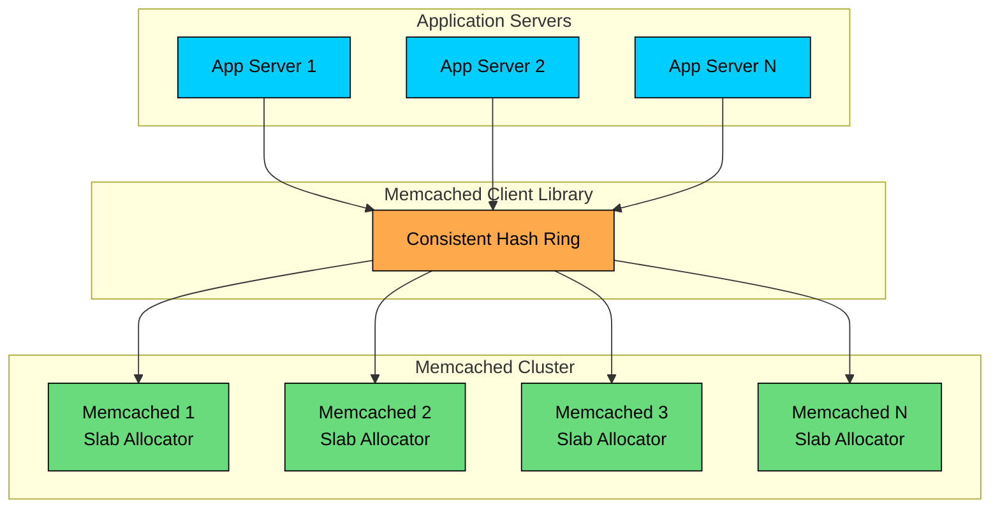

Application servers don’t connect to a “Memcached cluster manager.” Instead, Memcached is **client-sharded**.

Each application instance uses a **Memcached client library** that maintains a **consistent hash ring**. For any cache key, the client hashes the key and deterministically selects the Memcached node responsible for it. That’s why the diagram routes traffic from the apps → hash ring → specific Memcached nodes.

Inside the cluster, Memcached nodes are **independent**:

- no replication
- no coordination
- no automatic failover built into Memcached itself

Each node stores key-value data purely in memory and uses a **slab allocator** to manage memory efficiently by partitioning it into fixed-size classes. This reduces fragmentation and keeps allocations fast, which is important for high-throughput caching.

Operationally, scaling is straightforward: add more nodes and update the client’s server list. Consistent hashing helps minimize cache churn—only a fraction of keys remap when nodes are added or removed. The trade-off is that when a node fails, the keys on that node are simply lost, and the application must tolerate cache misses and repopulate from the source of truth (typically a database).

---

# 1. When to Choose Memcached

In interviews, you need to justify your technology choice with specific reasons. Here is when Memcached excels and when it does not.

### 1.1 Choose Memcached When You Have

#### **Simple key-value caching**

Memcached does one thing exceptionally well, storing and retrieving string values by key. If that is all you need, it is the most efficient option.

#### **Maximum throughput requirements**

Memcached's multi-threaded architecture utilizes all CPU cores, delivering higher throughput than single-threaded alternatives for simple operations.

#### **Large number of small objects**

Memcached's slab allocator is optimized for storing many small objects efficiently with minimal memory fragmentation.

#### **Horizontal scaling needs**

Adding or removing cache nodes is straightforward. Consistent hashing ensures minimal cache invalidation during scaling.

#### **Memory efficiency priority**

Memcached has lower memory overhead per key compared to Redis, making it more cost-effective for simple caching.

#### **Stateless caching**

When cached data can be regenerated from the source of truth and you do not need persistence.

```mermaid
flowchart TD
    A[Need simple key-value cache"]:::primary
    A -->|Yes| B[Need maximum throughput"]:::primary
    A -->|No| C[Consider Redis]:::orange
    B -->|Yes| D[Data structures needed"]:::primary
    B -->|No| E[Consider Redis or Memcached]:::orange
    D -->|No| F[Memcached is a good fit]:::green
    D -->|Yes| G[Consider Redis]:::orange

    classDef primary fill:#00ceff,stroke:#000,color:#000
    classDef green fill:#69db7c,stroke:#000,color:#000
    classDef orange fill:#ffa94d,stroke:#000,color:#000
```

### 1.2 Avoid Memcached When You Need

#### **Rich data structures**

Memcached only supports strings. If you need lists, sets, sorted sets, or hashes, use Redis.

#### **Persistence**

Memcached is purely in-memory with no persistence options. Restarting a node loses all data.

#### **Replication**

Memcached has no built-in replication. Each node is independent. For high availability at the cache layer, you need application-level solutions.

#### **Pub/Sub or messaging**

Memcached provides no messaging capabilities. Redis Pub/Sub or Streams are needed for this.

#### **Complex operations**

No transactions, Lua scripting, or atomic operations beyond basic increment/decrement.

#### **Large values**

Memcached has a 1 MB default value size limit. While configurable, it is not designed for large objects.

### 1.3 Common Interview Systems Using Memcached

| System | Why Memcached Works |
|--------|---------------------|
| Database query cache | Simple key-value, high throughput |
| Session storage | Small objects, horizontal scaling |
| Page fragment cache | String values, low latency |
| API response cache | Simple lookups, scales horizontally |
| Object cache | Serialized objects, efficient memory |
| Rate limiting counters | Atomic increment, auto-expiration |

> 💡 **Key Insight:**

> **TIP**
>
> When proposing Memcached, emphasize its simplicity and efficiency. 
>
> **Example:** "We would use Memcached because we only need simple key-value caching and Memcached's multi-threaded architecture gives us higher throughput per node than Redis for this use case."

---

# 2. Architecture and How It Works

Understanding Memcached's architecture helps you explain its performance characteristics in interviews.

### 2.1 High-Level Architecture

Memcached is a distributed cache where the distribution logic lives in the client, not the server.

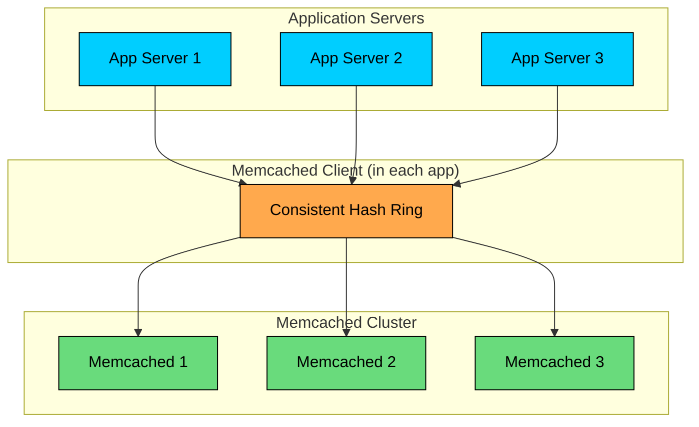

**Key insight:** Memcached servers do not communicate with each other. Each server is completely independent. The client library decides which server holds each key.

### 2.2 Request Flow

### 2.3 Server Internals

Each Memcached server is simple by design:

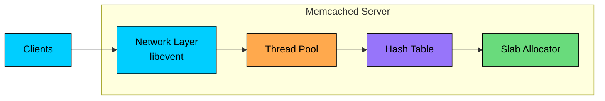

**Network layer:** Uses libevent for efficient async I/O handling.

**Thread pool:** Multiple worker threads process requests in parallel (unlike Redis's single-threaded model).

**Hash table:** O(1) key lookups using a global hash table.

**Slab allocator:** Pre-allocated memory chunks for efficient storage.

### 2.4 Multi-Threaded Model

Memcached uses multiple threads to utilize all CPU cores:

This is why Memcached can achieve higher throughput than single-threaded caches for simple operations.

### 2.5 Basic Operations

| Command | Description |
|---------|-------------|
| get | Retrieve value by key |
| set | Store value (overwrites) |
| add | Store only if key does not exist |
| replace | Store only if key exists |
| delete | Remove key |
| incr/decr | Atomic increment/decrement |
| gets/cas | Check-and-set for optimistic locking |

---

# 3. Consistent Hashing and Data Distribution

Consistent hashing is fundamental to how Memcached distributes data. Understanding it is essential for interviews.

### 3.1 The Problem with Simple Hashing

With simple modulo hashing, adding or removing a server invalidates most of the cache:

### 3.2 Consistent Hashing Solution

Consistent hashing minimizes key remapping when the server count changes.

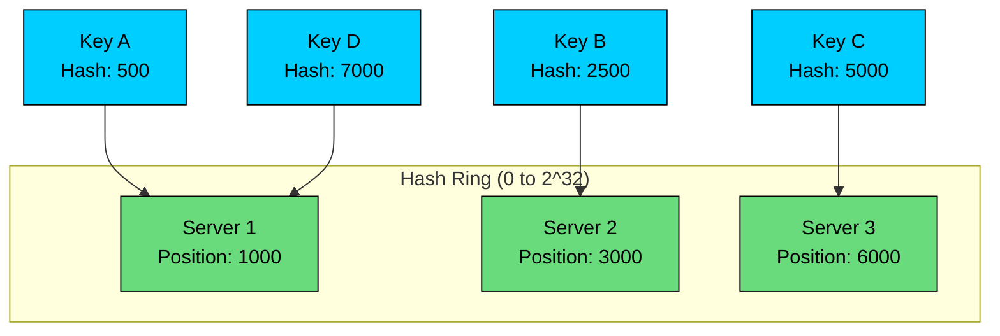

**How it works:**

1. Servers are hashed onto a ring (0 to 2^32)
2. Keys are also hashed onto the same ring
3. Each key is stored on the first server clockwise from its position
4. Adding/removing a server only affects keys in one segment

### 3.3 Virtual Nodes

Problem: With few servers, keys may distribute unevenly.

Solution: Each physical server gets multiple positions (virtual nodes) on the ring.

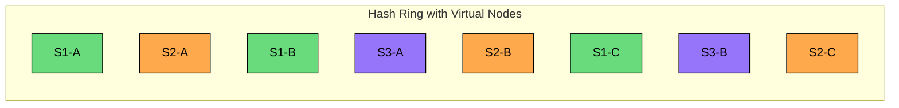

### 3.4 Client Library Implementation

The consistent hashing logic lives entirely in the client:

### 3.5 Key Distribution Strategies

| Strategy | Description | Use Case |
|----------|-------------|----------|
| Consistent hashing | Keys follow ring positions | Default, general purpose |
| Ketama | Specific consistent hashing implementation | Most Memcached clients |
| Modulo | Simple hash % servers | Testing only (fragile) |
| Key prefix routing | Route by key prefix | Multi-tenant isolation |

---

# 4. Memory Management and Slab Allocation

Memcached's slab allocator is key to its performance. Understanding it helps explain memory behavior.

### 4.1 The Slab Allocator

Instead of allocating memory for each item individually, Memcached pre-allocates memory into slabs of fixed-size chunks.

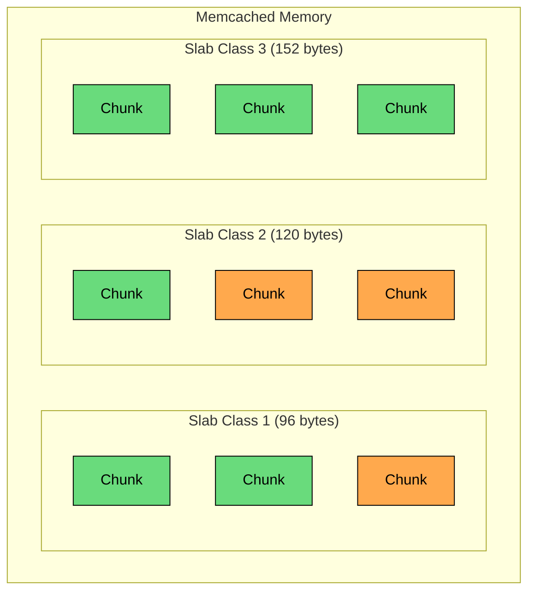

**How it works:**

1. Memory is divided into slab classes (96B, 120B, 152B, 192B, ...)
2. Each class handles items up to that size
3. Items are stored in the smallest class that fits
4. No memory fragmentation within a slab class

### 4.2 Memory Allocation Example

### 4.3 Slab Rebalancing

Problem: Once memory is assigned to a slab class, it cannot be moved (by default).

### 4.4 LRU Eviction

When a slab class is full, Memcached evicts the Least Recently Used item:

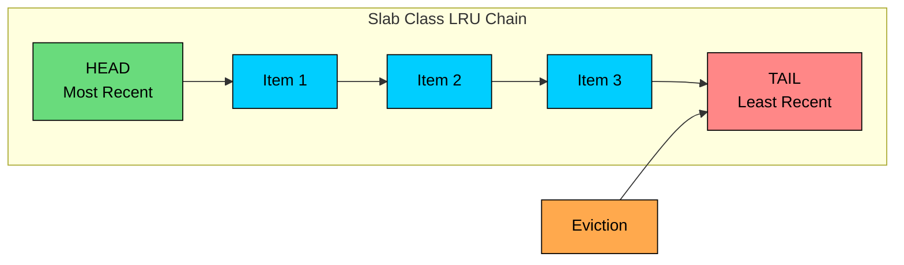

### 4.5 Memory Efficiency Tips

| Tip | Benefit |
|-----|---------|
| Compress values | Store more items in smaller slab classes |
| Tune chunk sizes | Match your data distribution with -f flag |
| Enable slab rebalancing | Adapt to changing workloads |
| Monitor slab stats | Identify inefficient slab usage |
| Use consistent value sizes | Reduce internal fragmentation |

### 4.6 Memory Configuration

---

# 5. Scaling Strategies

Memcached scales horizontally by adding more nodes. Understanding the implications is important for interviews.

### 5.1 Horizontal Scaling

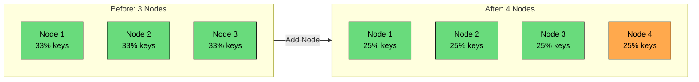

**Scaling process:**

1. Add new Memcached node
2. Update client configuration with new node
3. Consistent hashing redistributes ~1/N keys to new node
4. Cache misses for redistributed keys hit database
5. Cache warms up over time

### 5.2 Handling Node Failures

Since Memcached has no replication, node failures cause cache misses.

**Strategy 1: Accept cache misses**

**Strategy 2: Client-side failover**

**Strategy 3: Redundant storage**

### 5.3 Preventing Hot Spots

When certain keys are accessed much more frequently:

**Problem: Hot key**

**Solution 1: Key replication**

**Solution 2: Local caching**

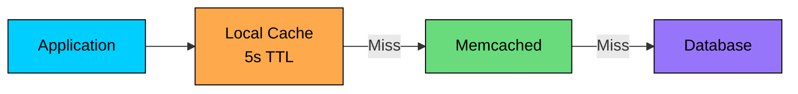

### 5.4 Capacity Planning

### 5.5 Scaling Considerations

| Factor | Consideration |
|--------|---------------|
| Adding nodes | ~1/N keys invalidated, plan for cache warming |
| Removing nodes | Remaining nodes receive more traffic |
| Node failure | Cache misses spike, database must handle load |
| Network | Ensure sufficient bandwidth between app and cache |
| Connection limits | Each node has max connections (default 1024) |

---

# 6. Cache Patterns and Best Practices

These patterns appear frequently in system design discussions.

### 6.1 Cache-Aside Pattern

The most common pattern. Application manages cache explicitly.

```mermaid
flowchart TD
    A[Request]:::primary --> B{Cache hit"}
    B -->|Yes| C[Return from cache]:::green
    B -->|No| D[Query database]:::orange
    D --> E[Store in cache]:::orange
    E --> F[Return to client]:::green

    classDef primary fill:#00ceff,stroke:#000,color:#000
    classDef green fill:#69db7c,stroke:#000,color:#000
    classDef orange fill:#ffa94d,stroke:#000,color:#000
```

**Pros:** Simple, application has full control **Cons:** Cache miss = latency penalty, potential for stale data

### 6.2 Write-Through Pattern

Writes go to cache and database together.

**Pros:** Cache always consistent with database **Cons:** Write latency includes cache update, may cache rarely-read data

### 6.3 Write-Behind (Write-Back) Pattern

Writes go to cache first, database updated asynchronously.

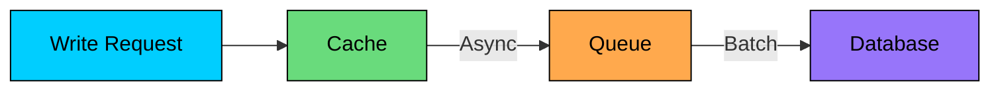

**Pros:** Fast writes, batch database updates **Cons:** Risk of data loss, complex implementation, not ideal with Memcached (no persistence)

### 6.4 Cache Invalidation

**Time-based expiration:**

**Explicit invalidation:**

**Version-based invalidation:**

### 6.5 Preventing Cache Stampede

When a popular key expires, many requests hit the database simultaneously.

**Solution 1: Locking**

**Solution 2: Probabilistic early refresh**

**Solution 3: Stale-while-revalidate**

### 6.6 Key Design Best Practices

| Practice | Example | Benefit |
|----------|---------|---------|
| Namespace keys | `users:123`, `products:456` | Avoid collisions |
| Include version | `users:123:v2` | Easy invalidation |
| Keep keys short | `u:123` in production | Less memory |
| Predictable format | `{type}:{id}:{attribute}` | Easy debugging |
| Avoid special chars | Alphanumeric and colons | Compatibility |

---

# 7. Handling Cache Failures

Cache failures are inevitable. Designing for resilience is critical.

### 7.1 Failure Modes

| Failure | Impact | Mitigation |
|---------|--------|------------|
| Single node down | ~1/N keys unavailable | Client failover, accept misses |
| Network partition | Subset of nodes unreachable | Timeout handling, circuit breaker |
| Memory exhaustion | Excessive evictions | Monitor, scale, tune LRU |
| Hot key | Single node overloaded | Key replication, local cache |
| Entire cluster down | All cache unavailable | Database must handle full load |

### 7.2 Circuit Breaker Pattern

Prevent cascading failures when cache is unavailable.

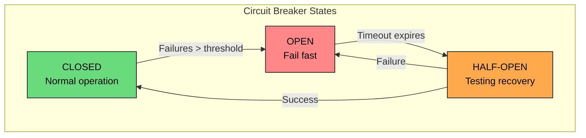

### 7.3 Graceful Degradation

### 7.4 Database Protection

When cache fails, protect the database from being overwhelmed.

**Rate limiting at application layer:**

**Request coalescing:**

### 7.5 Monitoring and Alerting

| Metric | Alert Threshold | Action |
|--------|-----------------|--------|
| Hit rate | < 80% | Investigate cache misses |
| Eviction rate | > 100/sec | Add memory or nodes |
| Connection count | > 80% of max | Scale or tune |
| Response time p99 | > 10ms | Network or overload issue |
| Memory usage | > 90% | Scale or tune eviction |

---

# 8. Memcached vs Redis

This comparison comes up frequently in interviews. Know the trade-offs.

### 8.1 Feature Comparison

| Feature | Memcached | Redis |
|---------|-----------|-------|
| Data types | Strings only | Strings, Lists, Sets, Hashes, Sorted Sets, Streams |
| Persistence | None | RDB, AOF |
| Replication | None | Master-replica |
| Clustering | Client-side consistent hashing | Redis Cluster |
| Threading | Multi-threaded | Single-threaded (mostly) |
| Memory efficiency | Better for simple strings | Higher overhead per key |
| Max value size | 1 MB (default) | 512 MB |
| Pub/Sub | No | Yes |
| Lua scripting | No | Yes |
| Transactions | No (only CAS) | MULTI/EXEC |

### 8.2 Performance Comparison

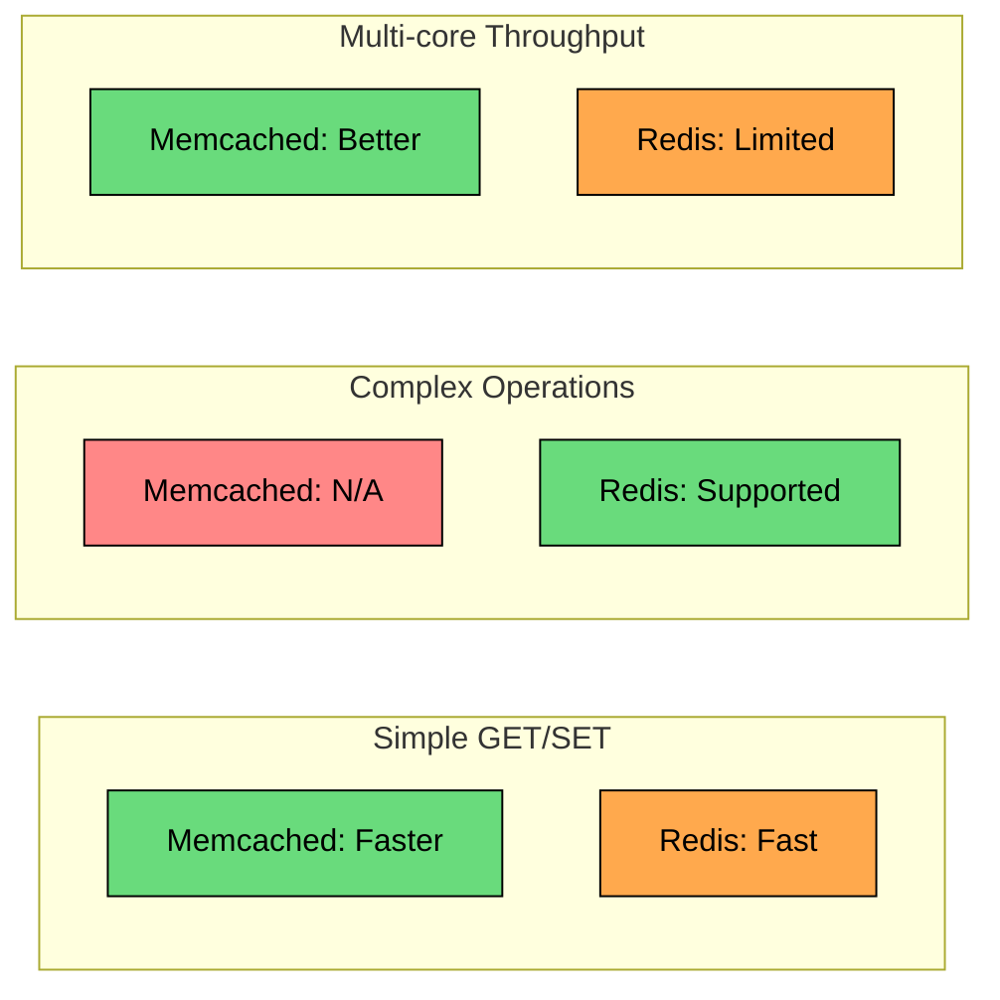

#### **Benchmark context:**

- Simple operations: Memcached ~10-20% faster
- Multi-core: Memcached scales better with threads
- Complex operations: Only Redis supports them

### 8.3 When to Choose Each

#### **Choose Memcached when:**

- Simple key-value caching is sufficient
- Maximum throughput is priority
- Memory efficiency matters (many small objects)
- You do not need persistence or replication
- Multi-threaded performance is important

#### **Choose Redis when:**

- Need rich data structures
- Persistence is required
- Built-in replication is important
- Need Pub/Sub or Streams
- Complex atomic operations (Lua scripts)
- Features like sorted sets for leaderboards

### 8.4 Hybrid Architecture

Some systems use both:

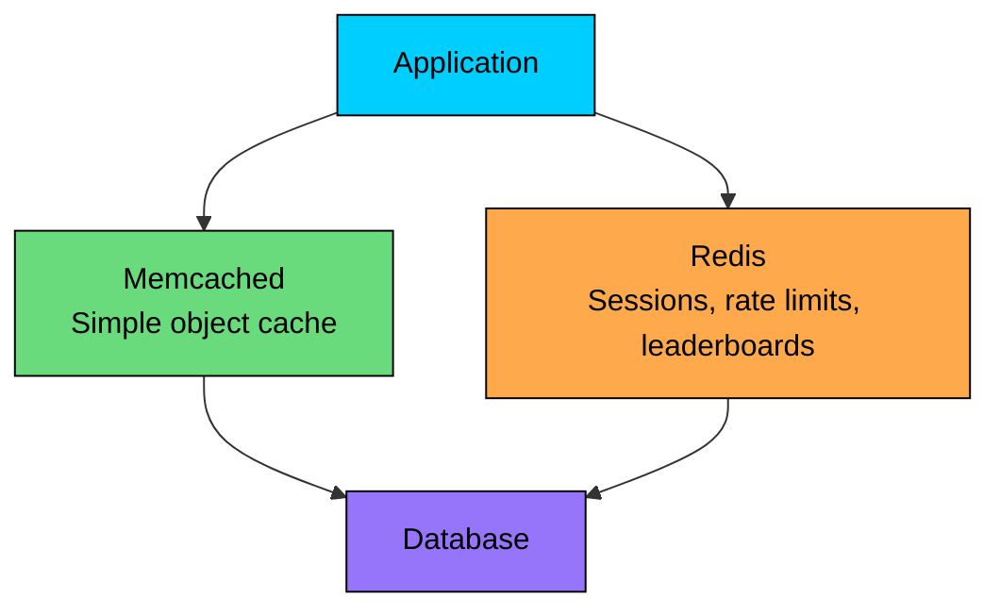

---

# Summary

Memcached remains relevant for specific use cases despite Redis's popularity. Here are the key takeaways for interviews:

1. **Choose Memcached for simplicity.** When you only need key-value caching without persistence, replication, or data structures, Memcached is more efficient.
2. **Understand consistent hashing.** The distribution logic lives in the client. Adding or removing nodes only affects ~1/N keys. Virtual nodes ensure even distribution.
3. **Know the slab allocator.** Memory is pre-allocated in fixed-size chunks. This eliminates fragmentation but can waste space if item sizes vary widely.
4. **Plan for no persistence.** Memcached is purely in-memory. Design your system to handle cache cold starts and node failures gracefully.
5. **Scale horizontally.** Add more nodes for more capacity and throughput. Consistent hashing makes scaling straightforward.
6. **Prevent stampedes.** Use locking, probabilistic refresh, or stale-while-revalidate patterns to prevent database overload when popular keys expire.
7. **Compare with Redis fairly.** Memcached wins on simple throughput and memory efficiency. Redis wins on features. Sometimes you use both.
8. **Design for failure.** Circuit breakers, graceful degradation, and database protection are essential when cache is unavailable.

When proposing Memcached in an interview, emphasize its simplicity and efficiency for pure caching workloads. Show that you understand the trade-off: Memcached sacrifices features for performance in scenarios where those features are not needed.

---

# References

- [Memcached Official Documentation](https://github.com/memcached/memcached/wiki) - Official wiki covering architecture and configuration
- [Scaling Memcache at Facebook](https://www.usenix.org/conference/nsdi13/technical-sessions/presentation/nishtala) - NSDI paper on Facebook's Memcached deployment
- [Consistent Hashing and Random Trees](https://www.cs.princeton.edu/courses/archive/fall09/cos518/papers/chash.pdf) - Original paper on consistent hashing
- [Memcached Internals](https://www.adayinthelifeof.nl/2011/02/06/memcache-internals/) - Deep dive into slab allocator and memory management

---

# Quiz
