Picture this: you're building an e-commerce system where placing an order needs to trigger half a dozen downstream actions. Inventory must be reserved, a confirmation email sent, analytics updated, fraud detection run, and a shipping label generated. If you try to do all of this synchronously, your checkout endpoint becomes slow and fragile. Any downstream failure blocks the entire order.

This is where message brokers shine, and RabbitMQ has been solving this problem since 2007. Originally developed at Rabbit Technologies and now maintained by VMware, it's one of the most battle-tested message brokers in the industry, running in production at companies from small startups to large enterprises.

<!-- Icon: devicon:rabbitmq -->

But here's what makes RabbitMQ unique: **its routing model is fundamentally more flexible than alternatives like Kafka or SQS**. While Kafka focuses on high-throughput streaming with simple topic-based routing, RabbitMQ's exchange system lets you implement sophisticated message routing patterns, route by exact match, by wildcard patterns, or broadcast to all consumers, all without writing custom code.

This chapter covers the practical knowledge you need: exchange types and routing patterns, message reliability guarantees, clustering for high availability, and common architectural patterns. 

By the end, you'll be able to confidently design systems using RabbitMQ and explain your choices.

---

### RabbitMQ Architecture Overview

> [!PAYWALL] This content is for premium members only.

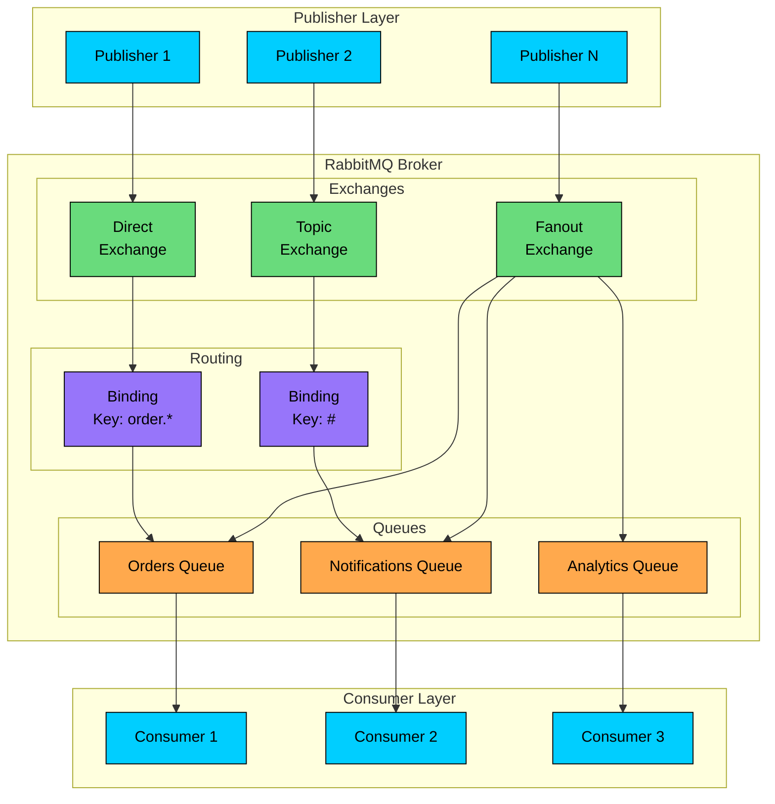

Publishers (P1–P3) don’t send messages directly to queues. They publish to **exchanges**, and the exchange decides where each message should go. That separation is the core RabbitMQ idea: **producers write to exchanges, consumers read from queues, and routing happens in between**.

In the broker, you have multiple exchange types:

- **Direct exchange (EX1)** routes based on an exact routing key match.
- **Topic exchange (EX2)** routes using pattern matching (e.g., `order.*`, `#`).
- **Fanout exchange (EX3)** broadcasts every message to all bound queues.

Routing rules are defined by **bindings** (B1, B2). A binding connects an exchange to a queue, optionally with a binding key that controls which routing keys match. In the diagram:

- EX1 uses a binding rule (B1 like `order.*`) to route matching messages to the **Orders Queue (Q1)**.
- EX2 uses a broader rule (B2 like `#`) to route messages to the **Notifications Queue (Q2)**.
- EX3 fanouts to **Q1, Q2, and Q3**, effectively duplicating the message to all three queues.

Consumers (C1–C3) pull messages from their respective queues. This gives you clean decoupling: producers don’t need to know who consumes, and you can scale consumers horizontally by adding more consumers to a queue (competing consumers pattern).

Net effect: RabbitMQ is a routing-centric broker—exchanges provide flexible delivery semantics (direct, topic, broadcast), bindings encode routing logic, and queues provide buffering and backpressure between publishers and consumers.

---

# 1. When to Choose RabbitMQ

The first question interviewers ask when you propose a technology is "why this one"" With message brokers, you typically have several options: RabbitMQ, Kafka, SQS, Redis Pub/Sub, and others. Each has distinct strengths, and choosing wisely demonstrates mature engineering judgment.

Let's break down when RabbitMQ is the right fit and when you should look elsewhere.

### 1.1 Choose RabbitMQ When You Have

**Complex routing requirements**: RabbitMQ's exchange types (direct, topic, fanout, headers) enable sophisticated message routing that would require custom code in simpler systems.

**Traditional work queues**: When you need workers to process tasks with guaranteed delivery and acknowledgment, RabbitMQ's queue semantics are a natural fit.

**Request-reply patterns**: RabbitMQ supports RPC-style communication with correlation IDs and reply queues out of the box.

**Multiple protocol support**: Need AMQP, MQTT, STOMP, or HTTP" RabbitMQ supports them all, making it ideal for heterogeneous environments.

**Message priority**: RabbitMQ supports priority queues where higher-priority messages are delivered first.

**Delayed messaging**: With plugins, RabbitMQ can delay message delivery, useful for scheduled tasks and retry logic.

**Lower throughput, higher flexibility**: When you need tens of thousands of messages per second (not millions) with flexible routing.

```mermaid
flowchart TD
    A[Need async messaging"]:::primary
    A -->|Yes| B[Complex routing needed"]:::primary
    A -->|No| C[Consider synchronous calls]:::red
    B -->|Yes| D[RabbitMQ]:::green
    B -->|No| E[Need message replay"]:::primary
    E -->|Yes| F[Consider Kafka]:::orange
    E -->|No| G[Need request-reply"]:::primary
    G -->|Yes| D
    G -->|No| H[RabbitMQ or SQS]:::orange

    classDef primary fill:#00ceff,stroke:#000,color:#000
    classDef green fill:#69db7c,stroke:#000,color:#000
    classDef orange fill:#ffa94d,stroke:#000,color:#000
    classDef red fill:#ff8787,stroke:#000,color:#000
```

### 1.2 Avoid RabbitMQ When You Need

**Very high throughput**: Kafka handles millions of messages per second. RabbitMQ typically maxes out at tens of thousands per queue.

**Message replay**: Once a message is consumed and acknowledged in RabbitMQ, it is gone. Kafka retains messages for replay.

**Long-term message storage**: RabbitMQ is designed for message transit, not storage. Messages should be consumed relatively quickly.

**Event sourcing**: The append-only log model of Kafka is better suited for event sourcing than RabbitMQ's queue model.

**Multiple independent consumers**: In RabbitMQ, a message goes to one consumer per queue. Kafka's consumer groups allow multiple groups to independently consume the same messages.

**Strict ordering at scale**: RabbitMQ ordering guarantees are per-queue. Scaling with multiple queues complicates ordering.

### 1.3 Common Interview Systems Using RabbitMQ

| System | Why RabbitMQ Works |
|--------|-------------------|
| Task Queue | Worker pools with acknowledgment |
| Email Service | Route by type (transactional, marketing) |
| Order Processing | Priority handling, dead letter queues |
| Microservices Communication | Request-reply, event broadcasting |
| IoT Backend | MQTT protocol support |
| Notification System | Fan-out to multiple channels |
| Scheduled Jobs | Delayed message delivery |
| Image Processing | Work distribution with retries |

---

# 2. Core Architecture

Now that we understand when to use RabbitMQ, let's explore how it works. RabbitMQ's architecture differs fundamentally from Kafka's topic-partition model. Understanding the exchange-queue-binding abstraction is essential for designing effective messaging systems.

### 2.1 Key Components

The core insight of RabbitMQ's design is the separation of concerns: producers don't know about queues, and consumers don't know about producers. Exchanges sit in the middle, making routing decisions based on bindings. This decoupling enables flexible, maintainable messaging topologies:

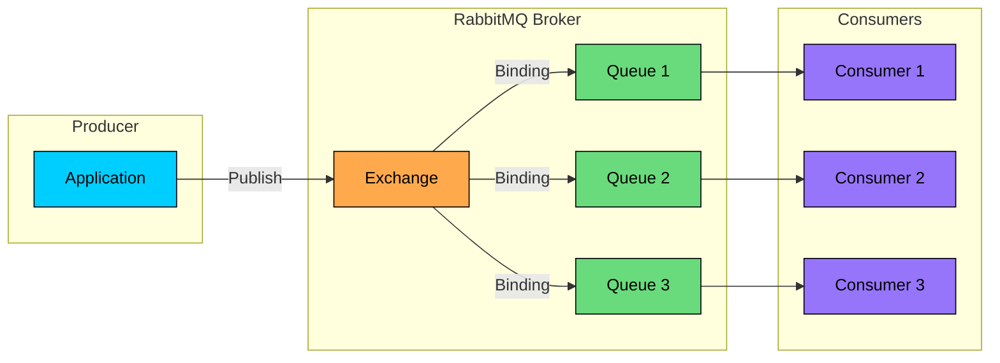

**Producer**: Application that sends messages to an exchange. Does not send directly to queues.

**Exchange**: Receives messages from producers and routes them to queues based on bindings and routing keys. Think of it as a post office.

**Queue**: Buffer that stores messages until consumed. Messages wait here for consumers.

**Binding**: Rule that tells an exchange which queues should receive messages. Can include routing key patterns.

**Consumer**: Application that receives messages from queues and processes them.

**Connection**: TCP connection between application and broker. Long-lived and expensive to create.

**Channel**: Virtual connection within a TCP connection. Lightweight, used for actual communication. Multiple channels per connection.

### 2.2 Message Flow

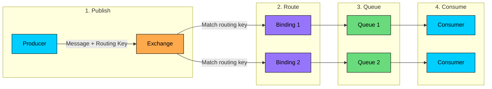

1. Producer publishes message with routing key to exchange
2. Exchange evaluates bindings to determine target queues
3. Message is copied to all matching queues
4. Consumers receive messages from their queues

### 2.3 Message Structure

**Key properties:**

- `delivery_mode`: 1 (transient) or 2 (persistent)
- `correlation_id`: Links request to response in RPC
- `reply_to`: Queue for RPC responses
- `expiration`: Message TTL in milliseconds

### 2.4 Virtual Hosts

Virtual hosts (vhosts) provide logical separation within a broker:

**Benefits:**

- Isolated namespaces (same names in different vhosts)
- Separate permissions per vhost
- Resource limits per vhost
- Multi-tenant deployments

**Visualizing architecture in interviews:**

When explaining RabbitMQ, sketch the exchange-queue-binding model on the whiteboard. Start with a producer, draw an exchange, then show multiple queues with bindings. Trace a message through the system: "The producer publishes to the orders exchange with routing key 'order.created.us'. The exchange checks bindings and routes to both the us-orders queue (bound with 'order.*.us') and the all-orders queue (bound with '#')."

This walkthrough demonstrates you understand the routing layer, not just the component names. It also sets up a natural conversation about which exchange type you'd choose for different scenarios.

---

# 3. Exchange Types and Routing

The exchange is where RabbitMQ's flexibility really shows. Each exchange type implements different routing logic, and choosing the right one is a key design decision. Let's explore each type and when to use it.

### 3.1 Direct Exchange

The simplest routing model: a message goes to queues whose binding key exactly matches the message's routing key. Think of it like addressing a letter to a specific mailbox.

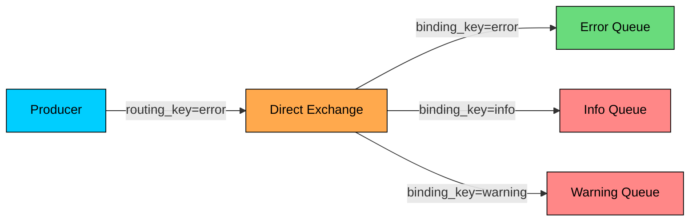

**Behavior:**

- Message routing key must exactly match binding key
- One-to-one or one-to-many (multiple queues with same binding)

**Use cases:**

- Task distribution by type
- Log level routing
- Direct point-to-point messaging

### 3.2 Topic Exchange

When exact matching isn't flexible enough, topic exchanges allow wildcard patterns. This is one of RabbitMQ's most powerful features, enabling consumers to subscribe to message categories without knowing the exact routing keys in advance.

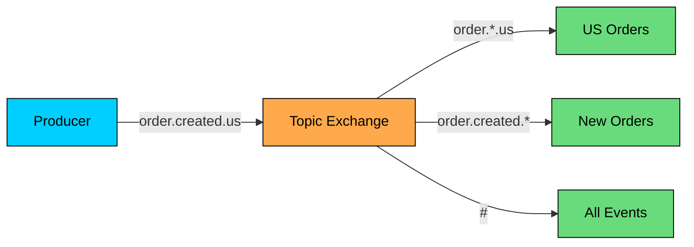

**Pattern syntax:**

- `*` matches exactly one word
- `#` matches zero or more words
- Words are separated by dots

**Examples:**

**Use cases:**

- Geographic routing (order.*.us, order.*.eu)
- Event type filtering (user.created.*, user.deleted.*)
- Hierarchical categorization

### 3.3 Fanout Exchange

Sometimes you want every consumer to receive every message. Fanout exchanges ignore routing keys entirely and broadcast to all bound queues. It's the simplest and fastest exchange type.

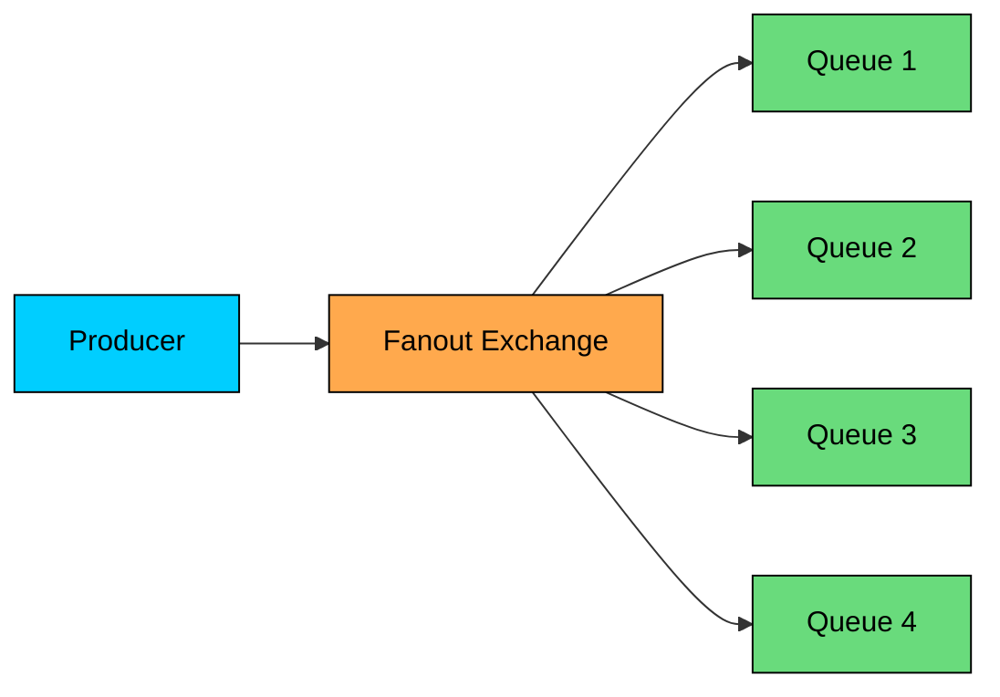

**Behavior:**

- Routing key is ignored
- Message goes to all bound queues
- Simplest and fastest exchange type

**Use cases:**

- Broadcasting events to multiple services
- Real-time notifications
- Cache invalidation
- Logging to multiple destinations

### 3.4 Headers Exchange

What if your routing logic needs multiple attributes, not just a single routing key" Headers exchanges route based on message header values, supporting AND/OR matching across multiple criteria.

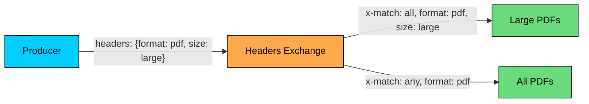

**Matching modes:**

- `x-match: all` - All specified headers must match
- `x-match: any` - At least one header must match

**Use cases:**

- Multi-attribute routing
- Content-based routing
- When routing logic is complex

### 3.5 Default Exchange

Every queue is automatically bound to the default exchange with a binding key equal to the queue name.

### 3.6 Exchange Type Comparison

| Exchange | Routing Logic | Performance | Use Case |
|----------|---------------|-------------|----------|
| Direct | Exact match | Fast | Task routing by type |
| Topic | Pattern match | Medium | Hierarchical routing |
| Fanout | Broadcast | Fastest | Pub/sub, notifications |
| Headers | Header match | Slower | Complex attribute routing |

---

# 4. Message Reliability

The value of a message broker largely comes from its reliability guarantees. What happens if the broker crashes" If a consumer dies mid-processing" Understanding these scenarios, and how RabbitMQ addresses them, is essential for designing robust systems.

### 4.1 Publisher Confirms

When a producer sends a message, how does it know the broker actually received it" Without publisher confirms, messages can silently disappear if the network drops or the broker crashes before persisting. Publisher confirms close this gap:

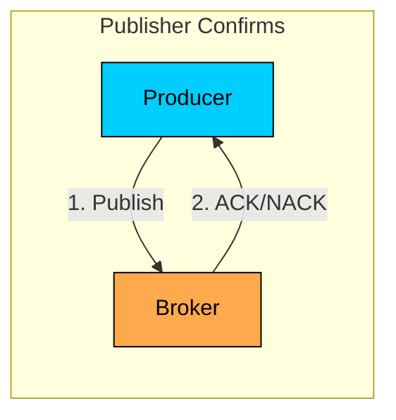

**How it works:**

1. Enable confirms on channel
2. Publish message
3. Broker sends ACK when message is safely stored
4. Broker sends NACK if message cannot be routed

**Confirmation modes:**

### 4.2 Message Persistence

Publisher confirms guarantee the broker received the message, but what if the broker restarts before the message is consumed" By default, messages live only in memory. Persistence writes them to disk, but requires configuring both the queue and the message:

```mermaid
flowchart TD
    A[Message Published]:::primary --> B{Queue Durable"}
    B -->|No| C[Lost on restart]:::red
    B -->|Yes| D{Message Persistent"}
    D -->|No| C
    D -->|Yes| E{Disk Sync"}
    E -->|Lazy Queue| F[Immediately on disk]:::green
    E -->|Classic Queue| G[Eventually on disk]:::orange

    classDef primary fill:#00ceff,stroke:#000,color:#000
    classDef green fill:#69db7c,stroke:#000,color:#000
    classDef orange fill:#ffa94d,stroke:#000,color:#000
    classDef red fill:#ff8787,stroke:#000,color:#000
```

### 4.3 Consumer Acknowledgments

The producer confirmed the message, and it's persisted on disk. But what if a consumer receives the message and crashes before processing it" Consumer acknowledgments handle this: the message stays in the queue until the consumer explicitly confirms successful processing.

```mermaid
flowchart TD
    A[Message Delivered]:::primary --> B[Consumer Processing]:::orange
    B --> C{Success"}
    C -->|Yes| D[ACK]:::green
    C -->|No| E{Retry"}
    E -->|Yes| F[NACK + Requeue]:::orange
    E -->|No| G[NACK + Dead Letter]:::red

    classDef primary fill:#00ceff,stroke:#000,color:#000
    classDef orange fill:#ffa94d,stroke:#000,color:#000
    classDef green fill:#69db7c,stroke:#000,color:#000
    classDef red fill:#ff8787,stroke:#000,color:#000
```

**Consumer prefetch:**

### 4.4 Dead Letter Exchanges

Handle messages that cannot be processed:

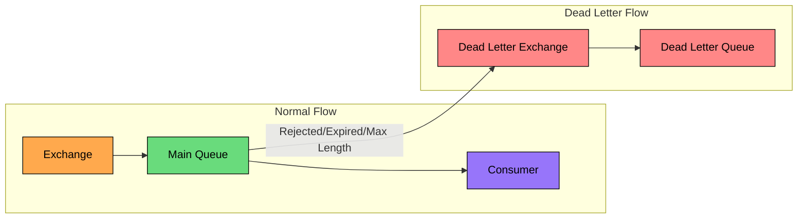

**Messages go to DLX when:**

- Consumer rejects with `requeue=false`
- Message TTL expires
- Queue max length exceeded

**Configuration:**

**Use cases:**

- Error investigation
- Retry queues (with TTL)
- Audit trail of failures

### 4.5 Message TTL

Expire messages after a duration:

### 4.6 Reliability Summary

Here's how all the reliability features work together end-to-end:

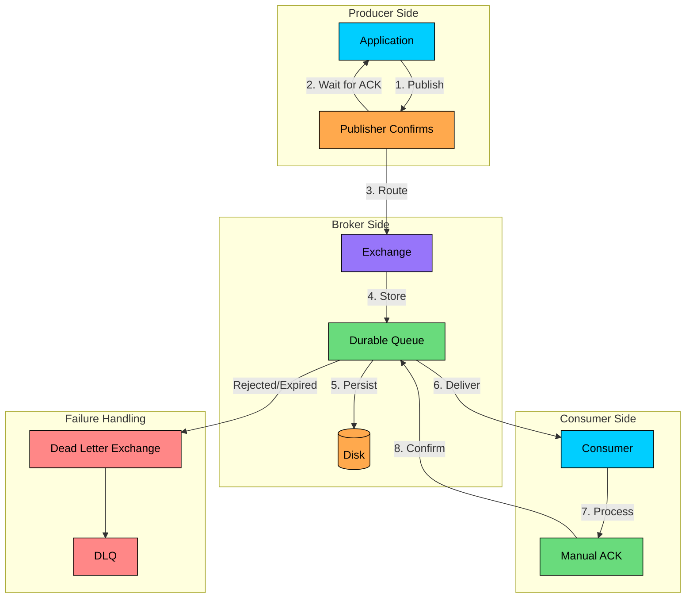

| Feature | Purpose | Trade-off |
|---------|---------|-----------|
| Publisher confirms | Ensure broker received | Latency |
| Persistent messages | Survive restarts | Disk I/O |
| Manual acks | Ensure processing | Complexity |
| Dead letter exchange | Handle failures | Extra queues |
| Message TTL | Prevent queue buildup | Message loss |

#### **Configuring reliability for different scenarios:**

Not all messages deserve the same reliability treatment. Here's how to reason about it:

**Payment processing:** "Losing a payment message is unacceptable, so I'd use the full reliability stack: publisher confirms to ensure the broker received it, persistent messages with durable queues to survive restarts, and manual acks so we only remove the message after successful processing. Failed payments go to a dead letter queue for investigation and potential manual retry. The latency cost of this configuration is justified by the business impact of lost payments."

**Metrics collection:** "Metrics are valuable but not critical. A few lost data points won't significantly affect our dashboards. I'd skip publisher confirms and use auto-ack for maximum throughput. If we lose some metrics during a broker restart, that's acceptable."

**Background jobs with idempotency:** "For our image thumbnail generation, jobs are idempotent, processing the same image twice produces the same result. I'd use persistent messages for durability, but auto-ack is fine. If a worker crashes, the job is lost, but the user can retry, and processing twice is harmless."

The key insight: design reliability to match business requirements, not to maximize every queue.

---

# 5. Clustering and High Availability

A single RabbitMQ node is a single point of failure. For production systems, you need clustering. But RabbitMQ's clustering model has nuances that differ from other distributed systems, and understanding them is essential for making good design decisions.

### 5.1 Cluster Architecture

Here's the critical insight: by default, RabbitMQ clusters share metadata (exchanges, queue definitions, bindings), but not queue contents. If a node with a queue goes down, those messages become unavailable until the node recovers.

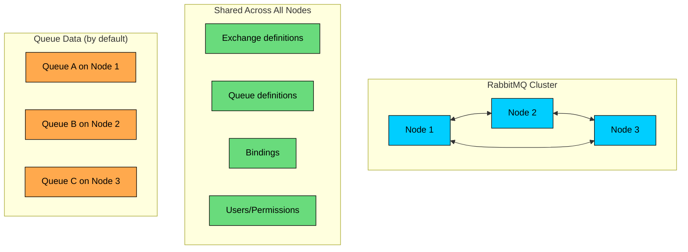

**What is shared:**

- Exchange, queue, and binding definitions
- User accounts and permissions
- Policies and runtime parameters

**What is NOT shared by default:**

- Queue contents (messages)
- Message data lives on the node that owns the queue

### 5.2 Classic Mirrored Queues (Deprecated)

The older approach to queue replication:

### 5.3 Quorum Queues

This is the modern answer to RabbitMQ replication. Quorum queues use the Raft consensus algorithm, the same algorithm behind etcd and Consul, to replicate messages across multiple nodes. A write only succeeds when a majority of nodes confirm it.

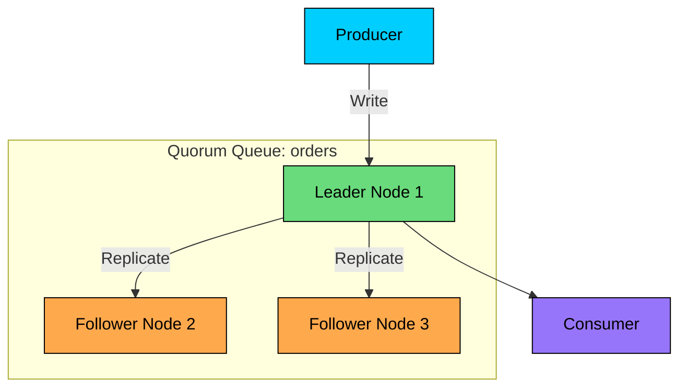

**How quorum queues work:**

1. Based on Raft consensus algorithm
2. One leader, multiple followers
3. Writes require majority acknowledgment
4. Leader election on failure

**Declaring a quorum queue:**

**Benefits over mirrored queues:**

- Data safety (Raft consensus)
- Better performance
- Predictable behavior
- Poison message handling built-in

**Trade-offs:**

- Higher memory usage
- Not suitable for transient data
- Minimum 3 nodes recommended

### 5.4 Streams

What if you need Kafka-like capabilities but want to stay within RabbitMQ" Streams are RabbitMQ's answer: append-only logs with time-based retention and the ability to replay from any offset. They're useful when you need multiple consumers to independently process the same message stream.

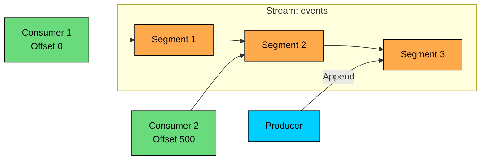

**Stream features:**

- Append-only log
- Multiple consumers can read from different offsets
- Replay capability
- High throughput
- Time-based or size-based retention

**Use cases:**

- Event sourcing
- Audit logs
- Large fan-out (many consumers)
- When you need replay

### 5.5 Queue Type Comparison

| Feature | Classic | Quorum | Stream |
|---------|---------|--------|--------|
| Replication | Mirroring (deprecated) | Raft consensus | Raft consensus |
| Message model | FIFO queue | FIFO queue | Append-only log |
| Replay | No | No | Yes |
| Performance | High | Medium | Very high |
| Memory usage | Low | Medium | Low |
| Data safety | Lower | High | High |
| Use case | Transient, non-critical | Critical messages | Event streaming |

### 5.6 Load Balancing

Distributing connections across cluster nodes:

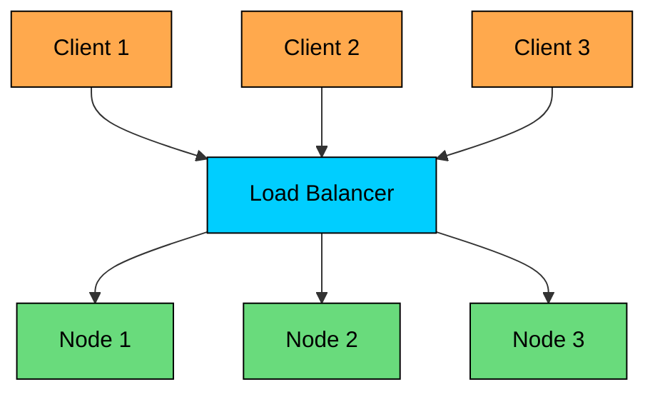

**Approaches:**

1. **DNS round-robin**: Simple, no health checks
2. **HAProxy/Nginx**: Health checks, connection distribution
3. **Client-side**: Connect to random node from list

**Important:** Load balancer should use TCP mode, not HTTP.

---

# 6. Queue Types and Features

We've covered the main queue types in the clustering section. Let's dive deeper into specific features that help you design better messaging systems.

### 6.1 Classic Queues

The original queue type, still useful for specific scenarios:

### 6.2 Lazy Queues

What happens when your queue grows to millions of messages" Classic queues try to keep messages in memory, which can exhaust RAM and trigger expensive paging. Lazy queues take a different approach: write to disk immediately and only load messages to memory when consumers request them.

### 6.3 Priority Queues

Not all messages are equally urgent. A password reset email should jump ahead of a weekly digest. Priority queues let consumers process higher-priority messages first, regardless of arrival order:

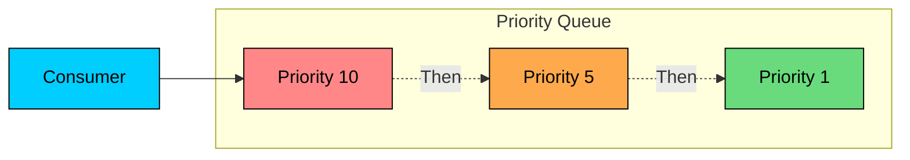

**Considerations:**

- Higher memory usage (one queue per priority)
- Lower throughput than regular queues
- Priority is within the queue, not across queues
- Maximum 255 priority levels (10 recommended)

### 6.4 Exclusive Queues

Private queues for a single connection:

### 6.5 Auto-Delete Queues

Queues that clean up automatically:

### 6.6 Queue Length Limits

Control queue size:

### 6.7 Single Active Consumer

Sometimes you need strict ordering that survives consumer failures. With normal competing consumers, if one consumer is slow, messages get distributed to faster consumers, breaking order. Single active consumer ensures only one consumer receives messages at a time, with automatic failover:

---

# 7. Common Messaging Patterns

With the foundational concepts covered, let's see how they combine into common architectural patterns. These patterns appear frequently in system design interviews, and understanding when to apply each one is as important as knowing how they work.

### 7.1 Work Queues (Task Distribution)

The most common pattern: distribute tasks among multiple workers for parallel processing. Each message goes to exactly one worker, enabling horizontal scaling:

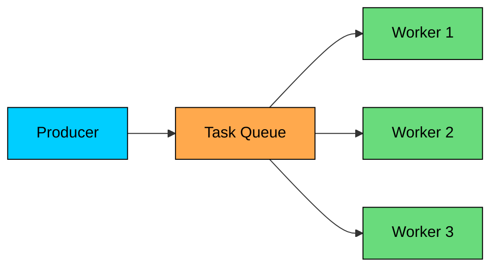

**Implementation:**

**Key features:**

- Round-robin distribution by default
- `prefetch_count=1` for fair dispatch
- Manual acks prevent task loss
- Easy to scale by adding workers

### 7.2 Publish/Subscribe

When multiple services need to react to the same event, use pub/sub. Unlike work queues where each message goes to one consumer, here every subscriber gets a copy:

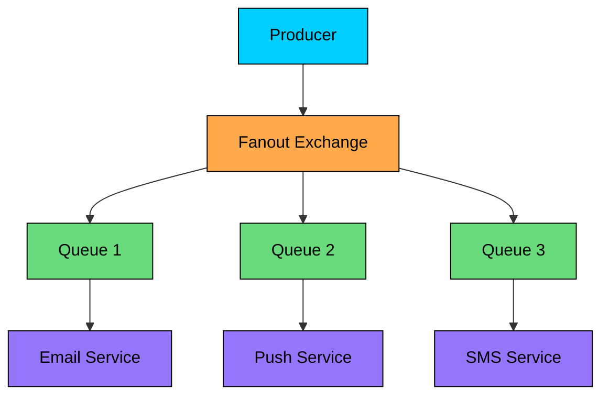

**Implementation:**

### 7.3 Routing

Selective message delivery:

```mermaid
flowchart TD
    P[Producer]:::primary -->|"severity=error"| E[Direct Exchange]:::orange
    E -->|"error"| Q1[Error Handler]:::red
    E -->|"info"| Q2[Info Logger]:::green
    E -->|"warning"| Q3[Warning Alerts]:::orange

    classDef primary fill:#00ceff,stroke:#000,color:#000
    classDef orange fill:#ffa94d,stroke:#000,color:#000
    classDef green fill:#69db7c,stroke:#000,color:#000
    classDef red fill:#ff8787,stroke:#000,color:#000
```

**Implementation:**

### 7.4 Topics (Pattern Matching)

Route based on patterns:

```mermaid
flowchart TD
    P[Producer]:::primary -->|"order.created.us"| E[Topic Exchange]:::orange
    E -->|"order.*.us"| Q1[US Order Handler]:::green
    E -->|"order.created.#"| Q2[Order Creator]:::green
    E -->|"#.us"| Q3[US Analytics]:::green

    classDef primary fill:#00ceff,stroke:#000,color:#000
    classDef orange fill:#ffa94d,stroke:#000,color:#000
    classDef green fill:#69db7c,stroke:#000,color:#000
```

**Use cases:**

- Geographic routing
- Event type filtering
- Multi-level categorization

### 7.5 Request-Reply (RPC)

What if you need request-response semantics but want the benefits of async messaging" RabbitMQ's correlation IDs and reply-to headers enable RPC patterns over message queues:

```mermaid
flowchart LR
    subgraph Client
        C[Client]:::primary
        RQ[Reply Queue]:::green
    end

    subgraph Server
        S[Server]:::purple
    end

    RQ2[Request Queue]:::orange

    C -->|"1. Request\ncorrelation_id=abc\nreply_to=reply-queue"| RQ2
    RQ2 --> S
    S -->|"2. Response\ncorrelation_id=abc"| RQ
    RQ --> C

    classDef primary fill:#00ceff,stroke:#000,color:#000
    classDef orange fill:#ffa94d,stroke:#000,color:#000
    classDef green fill:#69db7c,stroke:#000,color:#000
    classDef purple fill:#9775fa,stroke:#000,color:#000
```

**Implementation:**

**Key elements:**

- `correlation_id`: Links request to response
- `reply_to`: Where to send response
- Exclusive reply queue per client

### 7.6 Delayed Messages

Sometimes you want a message processed later, not immediately. Send a reminder email 24 hours after signup. Retry a failed payment in 5 minutes. RabbitMQ doesn't have native delay support, but you can build it with TTL and dead letter exchanges:

```mermaid
flowchart LR
    P[Producer]:::primary --> DQ[Delay Queue\nTTL: 5min]:::orange
    DQ -->|After TTL| DLX[Dead Letter Exchange]:::purple
    DLX --> MQ[Main Queue]:::green
    MQ --> C[Consumer]:::primary

    classDef primary fill:#00ceff,stroke:#000,color:#000
    classDef orange fill:#ffa94d,stroke:#000,color:#000
    classDef purple fill:#9775fa,stroke:#000,color:#000
    classDef green fill:#69db7c,stroke:#000,color:#000
```

**Implementation using TTL + DLX:**

**Use cases:**

- Retry with backoff
- Scheduled tasks
- Rate limiting

### 7.7 Retry with Exponential Backoff

Transient failures happen: a downstream API times out, a database connection drops, a rate limit is hit. Retrying immediately often fails again. Exponential backoff gives systems time to recover:

```mermaid
flowchart TD
    Q[Main Queue]:::primary --> C[Consumer]:::green
    C -->|Success| Done[Done]:::green
    C -->|Failure| R1[Retry 1\n1 min delay]:::orange
    R1 --> Q
    R1 -->|Failure| R2[Retry 2\n5 min delay]:::orange
    R2 --> Q
    R2 -->|Failure| R3[Retry 3\n30 min delay]:::orange
    R3 --> Q
    R3 -->|Failure| DLQ[Dead Letter Queue]:::red

    classDef primary fill:#00ceff,stroke:#000,color:#000
    classDef green fill:#69db7c,stroke:#000,color:#000
    classDef orange fill:#ffa94d,stroke:#000,color:#000
    classDef red fill:#ff8787,stroke:#000,color:#000
```

**Implementation:**

#### **Applying patterns in system design:**

Let's walk through a complete notification system design that combines several patterns:

"When a user signs up, the user service publishes to a fanout exchange. Three services subscribe: email sends a welcome message, analytics tracks the conversion, and the CRM creates a contact record. Each has its own queue, so they process independently.

The email worker uses manual acknowledgments. If SMTP fails, we check the retry count in the message headers. For counts 1-3, we route to delay queues with increasing TTLs: 1 minute, 5 minutes, 30 minutes. The delay queues have dead letter exchanges pointing back to the main email queue. After 3 retries, we route to a DLQ for manual investigation.

For password resets, we publish to a topic exchange with routing key `email.transactional.password_reset`. The transactional email queue binds with `email.transactional.*` and has higher priority than the marketing queue bound with `email.marketing.#`. This ensures password resets aren't stuck behind a batch of newsletter sends.

The entire system uses quorum queues for durability. We monitor queue depth, if it exceeds 10,000, we scale up workers."

This comprehensive answer shows you can combine patterns into a coherent, production-ready design.

---

# 8. Performance Tuning

Understanding RabbitMQ's performance characteristics helps you make informed trade-offs. Let's cover the key tuning parameters and their implications.

### 8.1 Producer Performance

The producer side has several knobs that affect throughput and reliability:

**Batching:**

**Publisher confirms strategy:**

| Strategy | Throughput | Latency | Complexity |
|----------|------------|---------|------------|
| Sync per message | Low | High | Simple |
| Batch confirm | Medium | Medium | Medium |
| Async confirm | High | Low | Complex |

### 8.2 Consumer Performance

**Prefetch count:**

**Consumer scaling:**

```mermaid
flowchart LR
    Q[Queue\n10K msgs]:::primary --> C1[Consumer 1]:::green
    Q --> C2[Consumer 2]:::green
    Q --> C3[Consumer 3]:::green
    Q --> C4[Consumer 4]:::green

    classDef primary fill:#00ceff,stroke:#000,color:#000
    classDef green fill:#69db7c,stroke:#000,color:#000
```

**Scaling rules:**

- Add consumers until throughput stops increasing
- Prefetch * consumers should not exceed queue depth
- Monitor consumer utilization

### 8.3 Queue Performance

**Lazy queues for large backlogs:**

**Queue length limits:**

### 8.4 Connection and Channel Management

**Connection pooling:**

```mermaid
flowchart TD
    A[Application]:::primary --> C[Connection]:::orange
    C --> Ch1[Channel 1\nProducer]:::green
    C --> Ch2[Channel 2\nConsumer A]:::green
    C --> Ch3[Channel 3\nConsumer B]:::green

    classDef primary fill:#00ceff,stroke:#000,color:#000
    classDef orange fill:#ffa94d,stroke:#000,color:#000
    classDef green fill:#69db7c,stroke:#000,color:#000
```

### 8.5 Persistence vs Performance

| Configuration | Throughput | Durability |
|---------------|------------|------------|
| Transient messages + non-durable queue | Highest | None |
| Persistent messages + durable queue | Lower | High |
| Lazy queue + persistent messages | Lowest | Highest |

**Recommendation:**

- Critical data: Persistent + durable + publisher confirms
- High throughput non-critical: Transient + non-durable
- Large queues: Lazy queues

### 8.6 Monitoring Metrics

| Metric | Healthy Range | Action if Exceeded |
|--------|---------------|-------------------|
| Queue depth | < 10K per queue | Add consumers |
| Consumer utilization | > 70% | Processing is keeping up |
| Memory usage | < 80% watermark | Add nodes or reduce load |
| Disk usage | < 80% | Increase retention limits |
| Connection count | < 1000 per node | Use connection pooling |
| Channel count | < 10000 per node | Reduce channel creation |

---

# 9. RabbitMQ vs Other Systems

Interviewers often ask you to compare technologies. The goal isn't to memorize feature matrices but to understand when each tool's design makes it the right choice.

### 9.1 RabbitMQ vs Kafka

This is the most common comparison question. The key insight: they're designed for different problems. RabbitMQ is a message broker, Kafka is a distributed log.

| Aspect | RabbitMQ | Kafka |
|--------|----------|-------|
| Model | Message broker | Distributed log |
| Throughput | 10K-50K msg/sec | Millions msg/sec |
| Message retention | Until consumed | Configurable (days/weeks) |
| Replay | No | Yes |
| Routing | Flexible (exchanges) | Topic-based only |
| Ordering | Per queue | Per partition |
| Consumer model | Push or pull | Pull only |
| Protocol | AMQP, MQTT, STOMP | Kafka protocol |
| Use case | Task queues, RPC | Event streaming, logs |

**Choose RabbitMQ:**

- Complex routing requirements
- Request-reply patterns
- Multiple protocol support
- Traditional work queues
- Lower throughput, higher flexibility

**Choose Kafka:**

- Very high throughput
- Message replay needed
- Event sourcing
- Multiple consumer groups
- Long-term message retention

### 9.2 RabbitMQ vs Amazon SQS

| Aspect | RabbitMQ | Amazon SQS |
|--------|----------|------------|
| Management | Self-managed | Fully managed |
| Routing | Rich (exchanges) | None (direct to queue) |
| Protocol | AMQP, MQTT | HTTP API |
| Ordering | Per queue | FIFO queues only |
| Throughput | High | High (with sharding) |
| Message size | No practical limit | 256 KB |
| Delay | Plugin required | Native (up to 15 min) |
| Dead letter | Yes | Yes |

**Choose RabbitMQ:**

- Complex routing needed
- On-premise or multi-cloud
- Message priorities
- RPC patterns
- Protocol variety

**Choose SQS:**

- AWS-native integration
- Minimal operations
- Serverless architecture
- Simple queue needs
- Pay-per-use pricing

### 9.3 RabbitMQ vs Redis Pub/Sub

| Aspect | RabbitMQ | Redis Pub/Sub |
|--------|----------|---------------|
| Persistence | Yes | No |
| Acknowledgments | Yes | No |
| Delivery guarantee | At-least-once | At-most-once |
| Pattern matching | Topic exchange | Channel patterns |
| Queue features | Full | None |
| Throughput | High | Very high |
| Use case | Reliable messaging | Real-time broadcast |

**Choose RabbitMQ:**

- Need message persistence
- Guaranteed delivery required
- Work queue patterns
- Message acknowledgment

**Choose Redis Pub/Sub:**

- Real-time, fire-and-forget
- Highest performance needed
- Already using Redis
- Transient notifications

### 9.4 RabbitMQ vs Apache ActiveMQ

| Aspect | RabbitMQ | ActiveMQ |
|--------|----------|----------|
| Protocol | AMQP (native) | JMS, AMQP, STOMP |
| Language | Erlang | Java |
| Clustering | Built-in | Requires config |
| Performance | Higher | Lower |
| JMS support | Limited | Native |
| Community | Larger | Large |

**Choose RabbitMQ:**

- Better performance
- AMQP-first applications
- Erlang ecosystem

**Choose ActiveMQ:**

- JMS requirement
- Java enterprise integration
- Existing ActiveMQ expertise

---

# Summary

We've covered a lot of ground. Let me distill this into the key concepts that will serve you well in system design interviews:

**Know when RabbitMQ is the right choice.** RabbitMQ shines for complex routing patterns, request-reply communication, and systems requiring flexible message semantics. For high-throughput streaming or event replay, Kafka is often better. For simple task queues in AWS, SQS might suffice. Being able to articulate these trade-offs shows mature engineering judgment.

**Master the exchange-queue-binding model.** This is RabbitMQ's core abstraction. Producers publish to exchanges, exchanges route to queues based on bindings, and consumers read from queues. Understanding how to combine direct, topic, fanout, and headers exchanges for different routing needs demonstrates real expertise.

**Configure reliability to match requirements.** Publisher confirms ensure the broker received your message. Persistent messages survive broker restarts. Manual acknowledgments guarantee processing before removal. Dead letter exchanges handle failures gracefully. Not every queue needs all of these, knowing when to apply each is key.

**Use quorum queues for durability.** They're the modern answer to RabbitMQ replication, using Raft consensus to ensure messages survive node failures. Three nodes minimum, and writes require majority acknowledgment. Understand the trade-off: higher latency and memory usage in exchange for data safety.

**Apply patterns appropriately.** Work queues distribute tasks, pub/sub broadcasts events, RPC enables request-reply, and delay queues with dead letter exchanges enable retry logic. Knowing when each pattern applies, and how to combine them, shows you can architect complete systems.

**Tune for your specific needs.** Prefetch count balances fairness and throughput. Lazy queues handle large backlogs. Priority queues serve urgent messages first. Connection pooling reduces overhead. Match configuration to requirements, don't apply defaults everywhere.

The strongest interview answers don't just mention RabbitMQ. They explain why RabbitMQ's specific characteristics, its flexible routing, reliability features, and queue semantics, solve the problem at hand better than alternatives. That level of reasoning is what this article aimed to help you develop.

---

# References

- [RabbitMQ Documentation](https://www.rabbitmq.com/documentation.html) - Official documentation covering all RabbitMQ features
- [RabbitMQ in Action](https://www.manning.com/books/rabbitmq-in-action) - Manning book covering architecture and patterns
- [CloudAMQP Blog](https://www.cloudamqp.com/blog/index.html) - Practical RabbitMQ tutorials and best practices
- [RabbitMQ Tutorials](https://www.rabbitmq.com/getstarted.html) - Official tutorials for common messaging patterns
- [Designing Data-Intensive Applications](https://www.oreilly.com/library/view/designing-data-intensive-applications/9781491903063/) - Martin Kleppmann's book with excellent coverage of message queues
- [RabbitMQ vs Kafka](https://www.confluent.io/blog/kafka-vs-rabbitmq/) - Detailed comparison from Confluent

---

# Quiz
