Imagine you're designing an image processing system. Users upload photos, and your service needs to generate thumbnails, extract metadata, run content moderation, and update search indexes. If you process these synchronously in the upload request, users wait 30 seconds while your endpoint becomes a fragile chain of service calls.

The solution is obvious: decouple with a message queue. But now you face a choice. Do you spin up a RabbitMQ cluster" Deploy Kafka and manage ZooKeeper" Or do you use something simpler"

This is where **Amazon SQS** shines. Launched in 2006 as one of AWS's first services, SQS has quietly become the backbone of countless production systems. It's not the most feature-rich message broker, but that's precisely its strength. **SQS trades flexibility for operational simplicity**, and for many workloads, that's exactly the right trade-off.

<!-- Icon: logos:aws-sqs -->

There are no servers to provision, no clusters to configure, no replication to worry about. You create a queue, start sending messages, and AWS handles everything else, scaling from zero to millions of messages without you lifting a finger.

In system design interviews, the ability to recognize when SQS's simplicity is the right choice, and when you need something more powerful, demonstrates mature engineering judgment.

This article covers the practical knowledge you need: queue types and their trade-offs, message lifecycle, scaling patterns, AWS integrations, and how SQS compares to alternatives. By the end, you'll be able to confidently design systems using SQS and explain your choices.

---

# 1. When to Choose SQS

> [!PAYWALL] This content is for premium members only.

Every technology has a sweet spot, and SQS is no exception. Understanding where SQS excels helps you make confident recommendations in interviews. More importantly, knowing its limitations helps you recognize when to reach for something more powerful.

Let's break down the scenarios where SQS shines and where you should consider alternatives.

### 1.1 Choose SQS When You Have

**Serverless architecture**: SQS integrates seamlessly with Lambda, API Gateway, and other AWS services. No servers to manage.

**Variable workloads**: SQS scales automatically from zero to millions of messages. You pay only for what you use.

**Simple queuing needs**: When you need a reliable queue without complex routing, SQS provides exactly that.

**AWS-native applications**: If you are already on AWS, SQS integrates with IAM, CloudWatch, X-Ray, and other services out of the box.

**Decoupling services**: Buffer between producers and consumers with automatic scaling and high availability.

**Cost optimization**: Pay-per-request pricing is often cheaper than running dedicated message broker infrastructure.

**Minimal operational overhead**: No clusters to manage, no capacity planning, no software updates.

```mermaid
flowchart TD
    A[Need message queue"]:::primary
    A -->|Yes| B[On AWS"]:::primary
    A -->|No| C[Consider alternatives]:::red
    B -->|Yes| D[Need complex routing"]:::primary
    B -->|No| E[Consider RabbitMQ/Kafka]:::orange
    D -->|Yes| F[Consider SNS + SQS or RabbitMQ]:::orange
    D -->|No| G[Need message replay"]:::primary
    G -->|Yes| H[Consider Kafka/Kinesis]:::orange
    G -->|No| I[SQS is a good fit]:::green

    classDef primary fill:#00ceff,stroke:#000,color:#000
    classDef green fill:#69db7c,stroke:#000,color:#000
    classDef orange fill:#ffa94d,stroke:#000,color:#000
    classDef red fill:#ff8787,stroke:#000,color:#000
```

### 1.2 Avoid SQS When You Need

**Message replay**: Once a message is deleted from SQS, it is gone. Kafka and Kinesis retain messages for replay.

**Complex routing**: SQS has no built-in routing. For topic-based routing, use SNS with SQS. For complex patterns, consider RabbitMQ.

**Very high throughput with ordering**: FIFO queues are limited to 3,000 messages per second (with batching). Kafka handles much higher throughput.

**Multi-cloud or on-premise**: SQS is AWS-only. For portability, consider Kafka or RabbitMQ.

**Long message retention**: SQS retains messages for up to 14 days. Kafka can retain indefinitely.

**Exactly-once processing built-in**: SQS provides at-least-once delivery. Exactly-once requires application-level deduplication (or FIFO queues).

**Sub-second latency requirements**: SQS polling adds latency. For real-time needs, consider other options.

### 1.3 Common Interview Systems Using SQS

| System | Why SQS Works |
|--------|---------------|
| Order Processing | Decouple order intake from fulfillment |
| Image Processing | Buffer uploads for async processing |
| Email/Notification Service | Queue messages for delivery services |
| Log Processing | Buffer logs before writing to storage |
| Microservices Communication | Async communication between services |
| Batch Processing | Collect items for batch operations |
| Webhook Handling | Buffer incoming webhooks |
| Task Scheduling | Delay message delivery |

---

# 2. Core Concepts

Now that we understand when to use SQS, let's explore how it works. The concepts here, visibility timeout, message lifecycle, long polling, form the foundation for designing reliable systems.

### 2.1 Architecture Overview

SQS follows a simple producer-queue-consumer model, but the details matter:

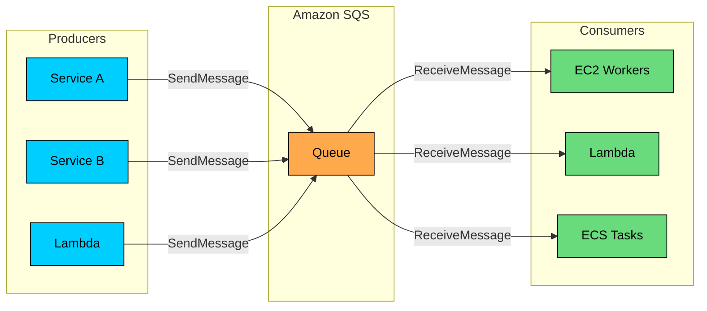

**Key characteristics:**

- Fully managed, no servers to provision
- Highly available across multiple AZs
- Unlimited throughput (Standard queues)
- Automatic scaling
- Pay-per-request pricing

### 2.2 Message Structure

**Message size:**

- Maximum 256 KB per message
- For larger payloads, store in S3 and send reference
- Extended Client Library handles this automatically

### 2.3 Queue Types

SQS offers two queue types with different guarantees:

| Feature | Standard Queue | FIFO Queue |
|---------|---------------|------------|
| Throughput | Unlimited | 3,000 msg/sec (with batching) |
| Ordering | Best effort | Strict FIFO |
| Delivery | At-least-once (may duplicate) | Exactly-once processing |
| Deduplication | None | Content-based or ID-based |
| Use case | High throughput | Ordering required |

### 2.4 Pricing Model

#### **Understanding the cost model:**

SQS pricing surprises some engineers. You pay per request, not per message stored. This has design implications:

- A single message costs at least 3 requests: SendMessage, ReceiveMessage, DeleteMessage
- Batching up to 10 messages per request drops costs by 90%
- Long polling (WaitTimeSeconds=20) eliminates empty receive responses
- For high-volume systems, batching and long polling aren't optimizations, they're requirements

For example, at 10 million messages per day without batching: 30M requests × $0.40/million = $12/day. With batching: 3M requests = $1.20/day. That's a 10x difference.

---

# 3. Standard vs FIFO Queues

One of the most common SQS questions in interviews is "Standard or FIFO"" The answer isn't always obvious, and the trade-offs go deeper than just ordering guarantees.

Let's explore both queue types and build a framework for choosing between them.

### 3.1 Standard Queues

Standard queues are the default, and for good reason. They offer virtually unlimited throughput, but with two important caveats: messages might occasionally be delivered out of order, and the same message might be delivered more than once.

For many workloads, these trade-offs are perfectly acceptable:

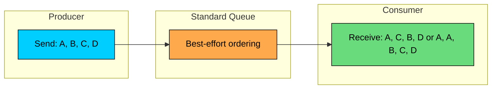

**Characteristics:**

- Nearly unlimited throughput
- Best-effort ordering (usually FIFO, not guaranteed)
- At-least-once delivery (occasional duplicates)
- Messages may be delivered out of order

**When to use:**

- Order does not matter
- Application handles duplicates
- Maximum throughput needed
- Cost-sensitive (cheaper than FIFO)

**Example use cases:**

- Log processing
- Image thumbnailing
- Email sending
- Async notifications

### 3.2 FIFO Queues

When ordering and exactly-once processing matter, FIFO queues deliver both, but at a cost. Throughput is capped at 3,000 messages per second (with batching), and there's additional latency for the ordering guarantees.

The name says it all: first in, first out. Messages are delivered exactly in the order they were sent:

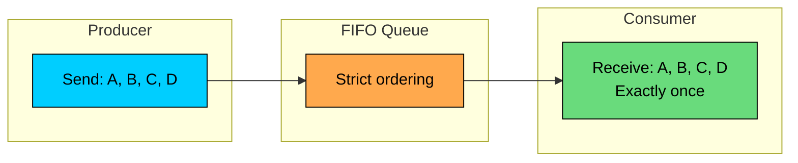

**Characteristics:**

- 3,000 messages/second (with batching), 300 without
- Strict FIFO ordering within message group
- Exactly-once processing (no duplicates)
- Queue name must end with `.fifo`

**When to use:**

- Order matters (financial transactions, commands)
- Duplicates are unacceptable
- Lower throughput is acceptable

**Example use cases:**

- Order processing (events must be in sequence)
- Financial transactions
- User command sequences
- Inventory updates

### 3.3 Message Groups (FIFO)

Here's where FIFO queues get interesting. The 3,000 messages/second limit applies per queue, but with message groups, you can achieve parallel processing while maintaining order within each group.

Think of it this way: if you're processing order events, orders for user A must be processed in sequence, but orders for user B can be processed in parallel. Message groups enable exactly this pattern:

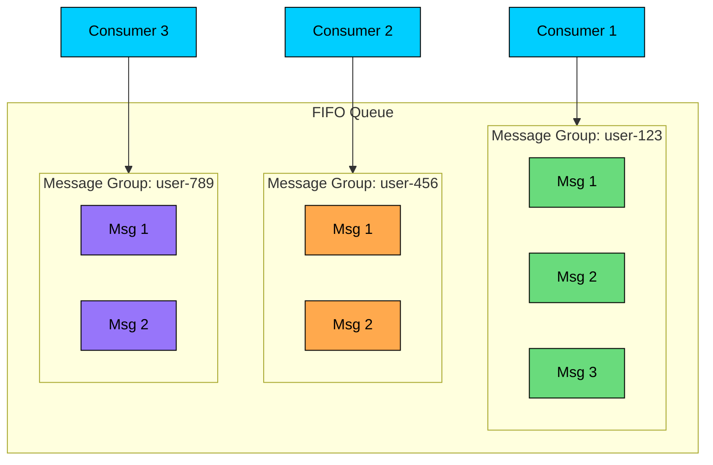

**How it works:**

- Messages with same `MessageGroupId` are delivered in order
- Different message groups can be processed in parallel
- One consumer per message group at a time

**Example:**

### 3.4 Deduplication (FIFO)

Network failures happen. A producer sends a message, the network times out, and the producer retries. Now you might have two copies of the same message. FIFO queues solve this with built-in deduplication:

**Example:**

### 3.5 Choosing Between Standard and FIFO

```mermaid
flowchart TD
    A[Does order matter"]:::primary
    A -->|No| B[Standard Queue]:::green
    A -->|Yes| C[Can you tolerate duplicates"]:::primary
    C -->|Yes| B
    C -->|No| D[Need >3K msg/sec"]:::primary
    D -->|No| E[FIFO Queue]:::green
    D -->|Yes| F[FIFO with sharding or Kafka]:::orange

    classDef primary fill:#00ceff,stroke:#000,color:#000
    classDef green fill:#69db7c,stroke:#000,color:#000
    classDef orange fill:#ffa94d,stroke:#000,color:#000
```

---

# 4. Message Lifecycle

Understanding how messages flow through SQS, from send to delete, is essential for designing reliable systems. The visibility timeout behavior, in particular, is a common source of confusion and interview questions.

### 4.1 Message States

A message in SQS is always in one of three states:

```mermaid
flowchart TD
    A[SendMessage]:::primary --> B[Message in Queue\nVisible]:::green
    B --> C[ReceiveMessage]:::primary
    C --> D[Message In-Flight\nInvisible]:::orange
    D --> E{Processed"}
    E -->|Yes| F[DeleteMessage]:::green
    E -->|No| G[Visibility Timeout Expires]:::red
    G --> B
    F --> H[Message Deleted]:::purple

    classDef primary fill:#00ceff,stroke:#000,color:#000
    classDef green fill:#69db7c,stroke:#000,color:#000
    classDef orange fill:#ffa94d,stroke:#000,color:#000
    classDef red fill:#ff8787,stroke:#000,color:#000
    classDef purple fill:#9775fa,stroke:#000,color:#000
```

**States:**

1. **Visible**: Available to be received
2. **In-Flight**: Being processed, invisible to other consumers
3. **Deleted**: Successfully processed and removed

### 4.2 Send Message

**Batching:**

### 4.3 Receive Message

**Long Polling vs Short Polling:**

```mermaid
flowchart LR
    subgraph Short["Short Polling"]
        S1[Request]:::primary --> S2{Messages"}
        S2 -->|No| S3[Empty response\nImmediate]:::red
        S2 -->|Yes| S4[Return messages]:::green
    end

    subgraph Long["Long Polling (WaitTimeSeconds=20)"]
        L1[Request]:::primary --> L2{Messages"}
        L2 -->|No| L3[Wait up to 20s]:::orange
        L3 --> L2
        L2 -->|Yes| L4[Return messages]:::green
    end

    classDef primary fill:#00ceff,stroke:#000,color:#000
    classDef green fill:#69db7c,stroke:#000,color:#000
    classDef orange fill:#ffa94d,stroke:#000,color:#000
    classDef red fill:#ff8787,stroke:#000,color:#000
```

**Long polling benefits:**

- Reduces empty responses (cost savings)
- Reduces CPU usage on consumers
- Messages delivered faster (no polling interval)
- Set `WaitTimeSeconds=20` for maximum benefit

### 4.4 Delete Message

**Deletion patterns:**

The order of operations matters:

```mermaid
flowchart LR
    subgraph Safe["Safe Pattern"]
        S1[1. Receive]:::primary --> S2[2. Process]:::green
        S2 --> S3{Success"}
        S3 -->|Yes| S4[3. Delete]:::green
        S3 -->|No| S5[Message reappears\nafter timeout]:::orange
    end

    subgraph Unsafe["Unsafe Pattern"]
        U1[1. Receive]:::primary --> U2[2. Delete]:::red
        U2 --> U3[3. Process]:::red
        U3 --> U4[If fails:\nMessage LOST]:::red
    end

    classDef primary fill:#00ceff,stroke:#000,color:#000
    classDef green fill:#69db7c,stroke:#000,color:#000
    classDef orange fill:#ffa94d,stroke:#000,color:#000
    classDef red fill:#ff8787,stroke:#000,color:#000
```

The safe pattern ensures messages are only removed after successful processing. The unsafe pattern risks permanent message loss.

### 4.5 Delay Queues and Message Timers

**Delay Queue (queue-level):**

**Message Timer (per-message):**

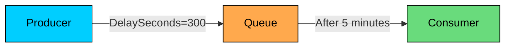

---

# 5. Visibility Timeout

If there's one SQS concept that trips up engineers, it's visibility timeout. Understanding it deeply is essential, both for building reliable systems and for acing interviews.

Here's the core question: when a consumer receives a message and starts processing it, what prevents another consumer from receiving the same message"

### 5.1 How Visibility Timeout Works

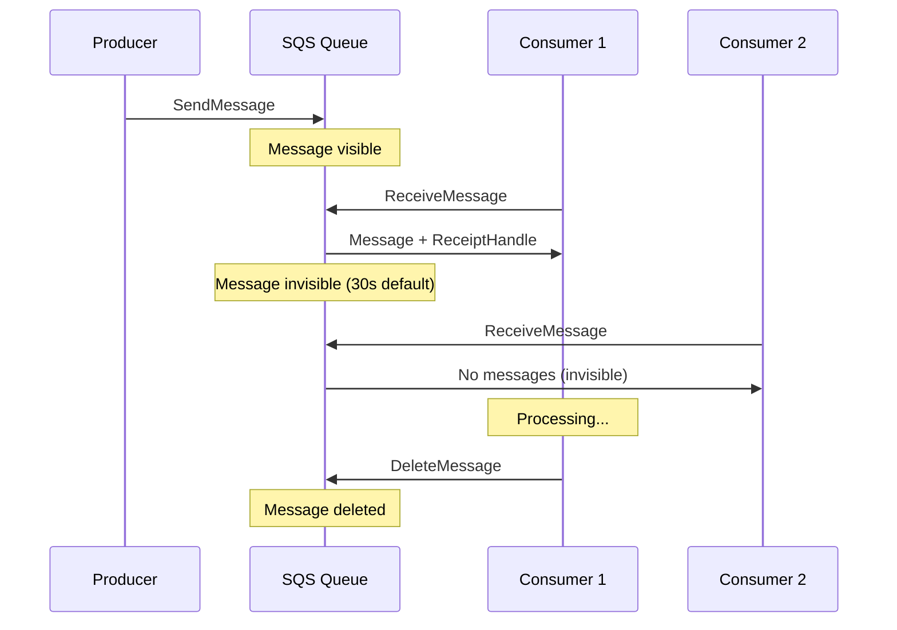

### 5.2 Timeout Scenarios

**Successful processing:**

**Processing exceeds timeout:**

**Processing fails:**

### 5.3 Setting Visibility Timeout

**Setting methods:**

### 5.4 Extending Visibility Timeout

For long-running tasks, extend the timeout during processing:

```mermaid
flowchart TD
    A[Receive Message\nTimeout: 60s]:::primary --> B[Start Processing]:::green
    B --> C{Processing\nat 45s"}
    C -->|Yes| D[ChangeMessageVisibility\n+60s]:::orange
    D --> E[Continue Processing]:::green
    E --> F{Complete"}
    F -->|No| C
    F -->|Yes| G[DeleteMessage]:::green

    classDef primary fill:#00ceff,stroke:#000,color:#000
    classDef green fill:#69db7c,stroke:#000,color:#000
    classDef orange fill:#ffa94d,stroke:#000,color:#000
```

**Heartbeat pattern:**

### 5.5 In-Flight Messages Limit

**Avoiding the limit:**

- Process and delete messages quickly
- Use shorter visibility timeouts
- Scale consumers to reduce backlog
- Use multiple queues for sharding

### 5.6 Visibility Timeout Best Practices

| Scenario | Recommendation |
|----------|----------------|
| Fast processing (<5s) | 30 seconds (default) |
| Medium processing (5-30s) | 3-5 minutes |
| Long processing (>30s) | Heartbeat pattern, extend dynamically |
| Unknown duration | Start low, extend as needed |
| Lambda consumer | Match Lambda timeout |

---

# 6. Dead Letter Queues

Every system has messages that fail to process. Maybe the payload is malformed, maybe a downstream service is permanently down, maybe there's a bug in your consumer code. Dead Letter Queues (DLQs) ensure these problem messages don't block your queue forever or disappear silently.

### 6.1 How DLQs Work

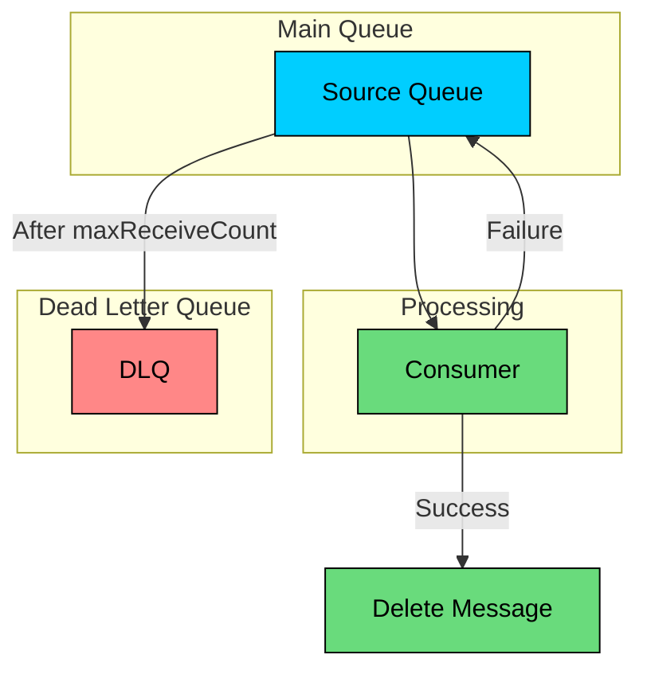

**Configuration:**

### 6.2 DLQ Configuration

### 6.3 Handling DLQ Messages

```mermaid
flowchart TD
    A[Message in DLQ]:::red --> B{Investigate}:::orange
    B --> C{Fixable"}
    C -->|Yes, fix and retry| D[Redrive to Source]:::green
    C -->|No, permanent failure| E[Archive/Log and Delete]:::purple
    C -->|Bug in consumer| F[Fix code, then redrive]:::orange

    classDef red fill:#ff8787,stroke:#000,color:#000
    classDef orange fill:#ffa94d,stroke:#000,color:#000
    classDef green fill:#69db7c,stroke:#000,color:#000
    classDef purple fill:#9775fa,stroke:#000,color:#000
```

**DLQ Redrive (AWS feature):**

### 6.4 DLQ Patterns

**Pattern 1: Alert and Manual Review**

**Pattern 2: Automated Retry with Delay**

**Pattern 3: DLQ Consumer for Logging**

### 6.5 DLQ Best Practices

| Practice | Reason |
|----------|--------|
| Always configure DLQ | Prevent message loss |
| Set maxReceiveCount appropriately | 3-5 for most cases |
| Monitor DLQ depth | Alert on non-zero |
| Set longer retention on DLQ | Time to investigate |
| Include context in messages | Easier debugging |
| Automate redrive for known issues | Reduce manual work |

### 6.6 Message Attributes for Debugging

When a message moves to DLQ, SQS adds attributes:

#### **Designing DLQ handling in practice:**

DLQ strategy often reveals your operational maturity:

"For our payment processing system, failed payments are critical. Here's the full strategy:

1. The main queue has maxReceiveCount of 3. Three failures mean something is genuinely wrong, not a transient issue.
2. A Lambda is triggered by the DLQ. It logs the failure details to CloudWatch Logs, archives the message to S3 for audit compliance, and sends a PagerDuty alert with the message body and ApproximateReceiveCount.
3. The on-call engineer investigates. Common causes: invalid payment data (log and skip), downstream service outage (wait and redrive), or code bug (fix, deploy, then redrive).
4. After fixing the root cause, we use SQS redrive to move messages back to the main queue. For code bugs, we might need to process the messages with special handling, so we sometimes redrive to a recovery queue with different consumer logic.
5. We have a CloudWatch alarm on ApproximateNumberOfMessagesVisible for the DLQ. Any messages there trigger an alert immediately. A healthy system has zero DLQ messages."

---

# 7. Scaling and Performance

One of SQS's greatest strengths is how it handles scale. You don't provision capacity or shard queues. But understanding how SQS scales, and how to scale your consumers to match, is essential for production systems.

### 7.1 Throughput Characteristics

Let's start with what SQS can handle:

### 7.2 Consumer Scaling

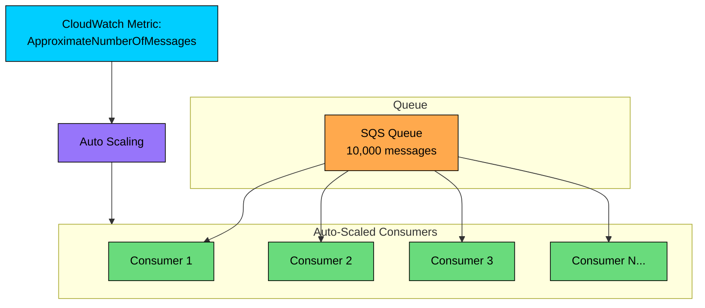

**Scaling strategies:**

**EC2/ECS Auto Scaling:**

**Lambda (automatic):**

### 7.3 Lambda Integration

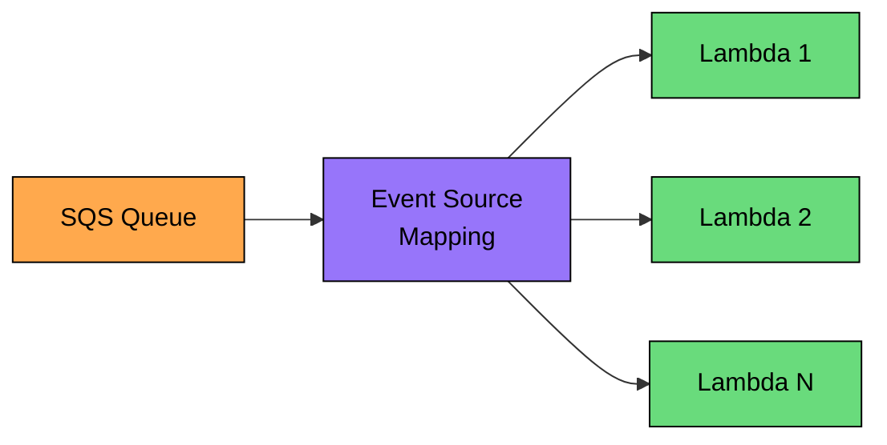

**Event Source Mapping Configuration:**

**Partial batch failure:**

### 7.4 High-Throughput Patterns

**Pattern 1: Multiple Queues (Sharding)**

**Pattern 2: Batch Everything**

**Pattern 3: Long Polling + Multiple Consumers**

### 7.5 Performance Metrics

| Metric | Meaning | Action |
|--------|---------|--------|
| ApproximateNumberOfMessages | Total messages | Scale if high |
| ApproximateNumberOfMessagesVisible | Ready for processing | Scale consumers |
| ApproximateNumberOfMessagesNotVisible | In-flight | Monitor for stuck |
| NumberOfMessagesReceived | Throughput | Monitor trends |
| NumberOfMessagesDeleted | Processing rate | Should match received |
| ApproximateAgeOfOldestMessage | Lag | Alert if high |

**Key alarms:**

---

# 8. Integration Patterns

SQS rarely exists in isolation. Its real power emerges when combined with other AWS services. These integration patterns appear frequently in system design interviews, and knowing them helps you design complete solutions, not just queue configurations.

### 8.1 SNS + SQS Fan-Out

This is the most common pattern: one event needs to trigger multiple independent actions. SNS handles the broadcasting, and each SQS queue buffers work for its consumer:

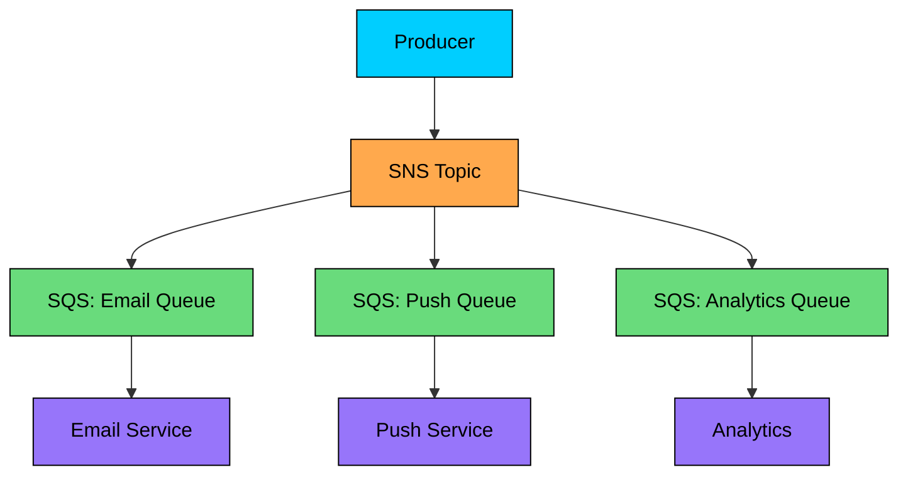

**Benefits:**

- Multiple subscribers get same message
- Each queue processes independently
- Different processing rates per subscriber
- Subscriber-specific filtering with SNS filter policies

**SNS Filter Policy:**

### 8.2 API Gateway + SQS

Direct integration without Lambda:

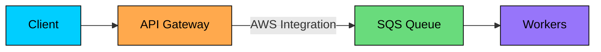

**Benefits:**

- No Lambda for simple message ingestion
- Lower latency
- Cost-effective for high volume
- Built-in throttling via API Gateway

### 8.3 S3 + SQS Event Notifications

Process S3 events asynchronously:

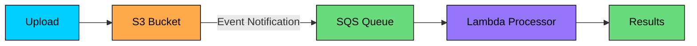

**Use cases:**

- Image/video processing pipeline
- Log file processing
- Data ingestion workflows
- Backup verification

### 8.4 Step Functions + SQS

Orchestrate workflows with queues:

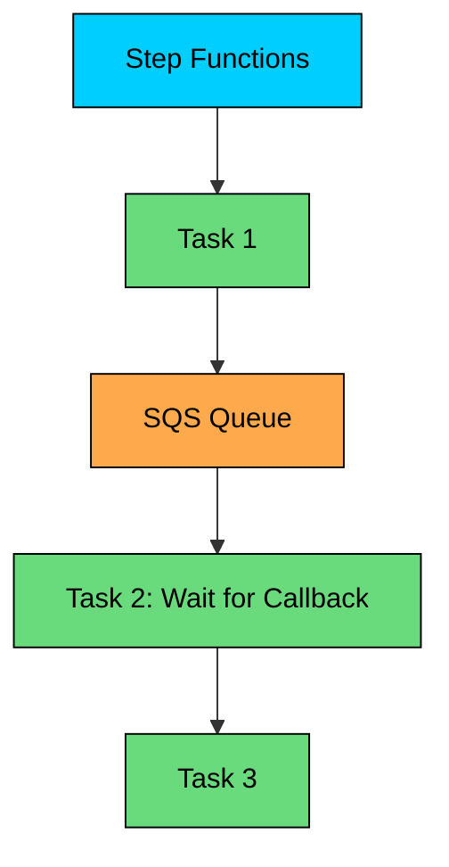

**Patterns:**

- **Send to Queue**: Step Functions sends message, continues
- **Wait for Callback**: Pause workflow, resume when worker completes
- **Activity Tasks**: Workers poll for tasks

### 8.5 EventBridge + SQS

Route events based on rules:

```mermaid
flowchart TD
    E[Event Sources]:::primary --> EB[EventBridge]:::orange
    EB -->|Rule: order.*| Q1[Orders Queue]:::green
    EB -->|Rule: user.*| Q2[Users Queue]:::green
    EB -->|Rule: analytics.*| Q3[Analytics Queue]:::green

    classDef primary fill:#00ceff,stroke:#000,color:#000
    classDef orange fill:#ffa94d,stroke:#000,color:#000
    classDef green fill:#69db7c,stroke:#000,color:#000
```

**Benefits over SNS:**

- More powerful filtering (content-based)
- Schema registry
- Archive and replay
- Cross-account routing

### 8.6 Common Integration Patterns

| Pattern | Components | Use Case |
|---------|------------|----------|
| Fan-out | SNS → SQS[] | Multi-consumer broadcast |
| Buffered API | API GW → SQS → Lambda | Handle spikes |
| Event processing | S3 → SQS → Lambda | File processing |
| Saga orchestration | Step Functions + SQS | Distributed transactions |
| Cross-service events | EventBridge → SQS | Event-driven architecture |
| Request buffering | ALB → SQS → Workers | Load leveling |

---

# 9. SQS vs Other Systems

In interviews, you'll often need to compare SQS with alternatives. The goal isn't to memorize feature matrices but to understand when each tool's design makes it the right choice.

### 9.1 SQS vs Kafka

This is the most common comparison. They serve different purposes: SQS is a message queue, Kafka is a distributed log.

| Aspect | SQS | Kafka |
|--------|-----|-------|
| Management | Fully managed | Self-managed or MSK |
| Throughput | High (unlimited Standard) | Very high (millions/sec) |
| Message retention | 14 days max | Unlimited |
| Replay | No | Yes |
| Ordering | FIFO queues only | Per partition |
| Consumer model | Competing consumers | Consumer groups |
| Routing | None (use SNS) | Topic-based |
| Cost model | Per request | Per broker/hour |
| Use case | Task queues, simple messaging | Event streaming, logs |

**Choose SQS:**

- Simple queuing needs
- Serverless/AWS-native architecture
- Variable workload (pay per use)
- Minimal operations

**Choose Kafka:**

- Message replay needed
- Very high throughput
- Event sourcing
- Multiple independent consumers

### 9.2 SQS vs RabbitMQ

| Aspect | SQS | RabbitMQ |
|--------|-----|----------|
| Management | Fully managed | Self-managed or CloudAMQP |
| Routing | None | Exchanges (flexible) |
| Protocols | HTTP API | AMQP, MQTT, STOMP |
| Ordering | FIFO queues | Per queue |
| Priority | No | Yes |
| Request-reply | Manual | Built-in (correlation ID) |
| DLQ | Built-in | Built-in |
| Max message size | 256 KB | No limit |

**Choose SQS:**

- AWS-native integration
- Minimal operations
- Simple routing (SNS for fan-out)
- Serverless architecture

**Choose RabbitMQ:**

- Complex routing patterns
- Multiple protocol support
- On-premise or multi-cloud
- Priority queues

### 9.3 SQS vs Kinesis

| Aspect | SQS | Kinesis Data Streams |
|--------|-----|---------------------|
| Model | Message queue | Data stream |
| Ordering | FIFO queues | Per shard |
| Retention | 14 days | 7 days (365 extended) |
| Replay | No | Yes |
| Throughput | Unlimited (Standard) | Per shard (1 MB/s in) |
| Consumers | One per message | Multiple (fan-out) |
| Scaling | Automatic | Manual (shard splitting) |
| Cost | Per request | Per shard-hour |

**Choose SQS:**

- Traditional work queues
- One consumer per message
- Variable throughput
- Simpler pricing

**Choose Kinesis:**

- Real-time streaming
- Multiple consumers same data
- Replay needed
- Consistent high throughput

### 9.4 SQS Standard vs FIFO Comparison

| Aspect | Standard | FIFO |
|--------|----------|------|
| Throughput | Unlimited | 3,000 msg/sec |
| Ordering | Best effort | Strict |
| Duplicates | Possible | Prevented |
| Deduplication | None | Built-in |
| Message groups | N/A | Yes |
| Lambda scaling | Aggressive | Limited by message groups |
| Cost | $0.40/million | $0.50/million |

---

# Summary

We've covered a lot of ground. Let me distill this into the key concepts that will serve you well in system design interviews:

**Know when SQS is the right choice.** SQS shines for AWS-native applications that need reliable, scalable message queuing without operational overhead. It's perfect for serverless architectures, variable workloads, and simple task distribution. For message replay, complex routing, or very high throughput with ordering, look elsewhere. Being able to articulate these trade-offs shows mature engineering judgment.

**Master Standard vs FIFO.** Standard queues offer unlimited throughput with best-effort ordering and at-least-once delivery. FIFO queues guarantee ordering and exactly-once processing but cap at 3,000 messages/second. Message groups enable parallelism within FIFO queues while preserving per-group ordering. Choose based on your actual requirements, not defaults.

**Understand visibility timeout deeply.** This is the mechanism that prevents duplicate processing. Set it to 6x your processing time, extend it with heartbeats for long tasks, and understand what happens when it expires. Many production bugs trace back to visibility timeout misconfiguration.

**Design for failures with DLQs.** Configure dead letter queues for every production queue. Set maxReceiveCount based on how many retries make sense. Monitor DLQ depth and alert on non-zero. Have a clear process for investigating and redriving failed messages.

**Optimize for cost and latency.** Long polling (WaitTimeSeconds=20) eliminates empty receives. Batching up to 10 messages per request reduces costs by 90%. These aren't optimizations, they're requirements for high-volume systems.

**Leverage AWS integrations.** Lambda event source mapping, SNS fan-out, API Gateway direct integration, S3 event notifications. SQS's power multiplies when combined with other AWS services. Know these patterns and when to apply them.

**Compare alternatives appropriately.** Kafka for streaming and replay, RabbitMQ for complex routing, Kinesis for real-time streams with replay. Each tool has its sweet spot. The ability to recommend the right one for each situation demonstrates breadth of knowledge.

---

# References

- [Amazon SQS Documentation](https://docs.aws.amazon.com/sqs/) - Official AWS documentation covering all SQS features
- [Amazon SQS Developer Guide](https://docs.aws.amazon.com/AWSSimpleQueueService/latest/SQSDeveloperGuide/) - Detailed guide for SQS implementation
- [AWS Well-Architected Framework](https://docs.aws.amazon.com/wellarchitected/latest/framework/) - Best practices for building on AWS
- [Designing Data-Intensive Applications](https://www.oreilly.com/library/view/designing-data-intensive-applications/9781491903063/) - Martin Kleppmann's book with excellent coverage of message queues
- [AWS re:Invent SQS Sessions](https://www.youtube.com/results"search_query=aws+reinvent+sqs) - Deep-dive presentations from AWS experts
- [AWS Architecture Blog](https://aws.amazon.com/blogs/architecture/) - Real-world architecture patterns using SQS

---

# Quiz
