Picture this: your application works perfectly on your laptop. Tests pass, features work, everything is smooth. Then you deploy to production, and it breaks. Different OS version, missing library, conflicting dependency. Hours of debugging later, you discover the server has Python 3.9 while you developed on Python 3.11.

This scenario, affectionately known as "it works on my machine," plagued software teams for decades. Docker solved it by letting you package your application along with its entire environment: runtime, libraries, system tools, and configuration.

<!-- Icon: devicon:docker -->

In system design interviews, Docker comes up constantly. You will discuss it when designing microservices architectures, deployment pipelines, scaling strategies, and development workflows. 

This chapter gives you the depth you need to discuss docker confidently in interviews. We will cover container architecture from the Linux kernel features that make it possible, through image optimization strategies, to production deployment patterns.

---

# 1. When to Choose Docker

> [!PAYWALL] This content is for premium members only.

Before we dive into the technical details of how Docker works, let us first understand what problems it solves. This context will help you explain architectural decisions in interviews, because knowing when to use a technology is as important as knowing how it works.

### 1.1 What Docker Solves

Think about what happens when you deploy traditionally. You write code on your machine with certain library versions, a specific OS, and particular system configurations. Then you hand it off to operations, who deploy it on servers with different configurations. Things break in subtle ways. A path that exists on macOS does not exist on Linux. A library update on the server breaks backward compatibility.

Docker eliminates this by packaging applications with their complete environment into containers. The container carries everything: your code, runtime, system libraries, and configuration. If it runs in the container on your laptop, it runs the same way in production.

This solves several critical problems:

#### **Environment consistency**

The same container runs in development, testing, staging, and production. When something fails in production, you can reproduce it locally by running the exact same container. No more "works on my machine" mysteries.

#### **Dependency isolation**

Each container has its own isolated filesystem with its own dependencies. Application A can run Python 3.8 while Application B uses Python 3.11 on the same host. They cannot conflict because they do not share libraries.

#### **Rapid deployment**

Virtual machines take minutes to boot because they load an entire operating system. Containers start in seconds because they share the host kernel and only need to start the application process. This speed matters for scaling and recovery.

#### **Resource efficiency**

A virtual machine might need 1GB of RAM just for the guest OS before your application even starts. A container needs only enough memory for your application because there is no separate OS. You can run dozens of containers on hardware that could only support a handful of VMs.

#### **Microservices architecture**

Each service can run in its own container with its own dependencies, deployed and scaled independently. The payment service can use Node.js 18 while the recommendation service uses Python 3.11, without any coordination between teams.

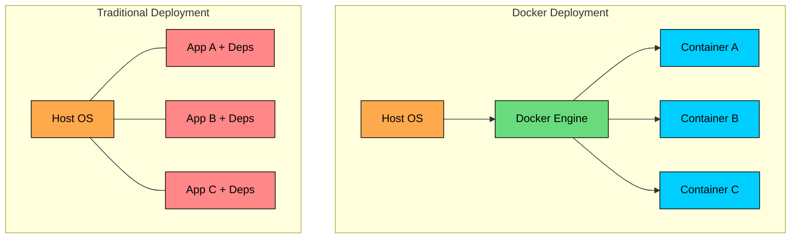

### 1.2 When to Use Docker

Now that we understand what Docker solves, let us look at specific scenarios where it shines:

#### **Microservices architecture**

When you break a monolith into services, each service has its own dependencies, deployment schedule, and scaling requirements. Containers provide natural boundaries. The user service team can deploy three times a day while the billing team deploys weekly, without coordination.

#### **Consistent development environments**

A new developer joins your team. Instead of spending a day installing databases, message queues, and configuring services, they run `docker compose up` and have the entire stack running in minutes. Everyone works with identical environments.

#### **CI/CD pipelines**

You build a container image once during CI. That exact image, byte for byte, runs through testing, staging, and production. No more "but it passed in CI" issues because CI and production run the same artifact.

#### **Application isolation**

You need to run multiple applications on the same host, maybe a legacy PHP app alongside a modern Node.js service. Containers keep them completely isolated. The PHP app cannot see or interfere with the Node.js service's files or processes.

#### **Horizontal scaling**

Traffic spikes and you need more capacity. Spinning up another container takes seconds. Put multiple instances behind a load balancer and scale horizontally without provisioning new VMs.

#### **Stateless services**

APIs, web servers, and workers that do not store local state are perfect for containers. You can create, destroy, and replace them freely. If one crashes, start another. If you need more capacity, add more.

### 1.3 When NOT to Use Docker

Containers are not always the right choice. Knowing when to avoid them shows architectural maturity.

#### **Stateful applications with complex storage**

Running PostgreSQL in a container is possible, but you take on the responsibility of managing persistent volumes, backups, and recovery. For production databases, managed services like RDS or Cloud SQL handle these concerns and provide features like automated backups, point-in-time recovery, and read replicas that would be complex to implement yourself.

#### **Legacy monolithic applications**

A 15-year-old application with hardcoded paths, system-level dependencies, and assumptions about its environment may require significant refactoring to containerize. The effort might not be worth it if the application is stable and not actively developed.

#### **GUI applications**

Docker was designed for server-side workloads. Desktop applications with graphical interfaces need display servers, GPU access, and window management that containers do not naturally provide. While possible with workarounds, it adds complexity without clear benefit.

#### **High-performance computing requiring direct hardware access**

Containers add a thin layer of abstraction. For most applications, this overhead is negligible. But for HPC workloads where every CPU cycle matters, or applications needing direct access to specific hardware like GPUs or network cards, bare metal or VMs with hardware passthrough may be better choices.

#### **Simple single-server deployments**

If you have one application on one server with no plans to scale, Docker adds operational complexity without proportional benefit. A simple systemd service might be simpler to manage.

---

# 2. Docker Architecture

Now that we know when to use Docker, let us look at how it actually works. Understanding the architecture is not just academic. It helps you debug issues, optimize performance, and answer the inevitable "how does Docker achieve isolation"" interview question.

Docker follows a client-server architecture with several components working together.

### 2.1 Core Components

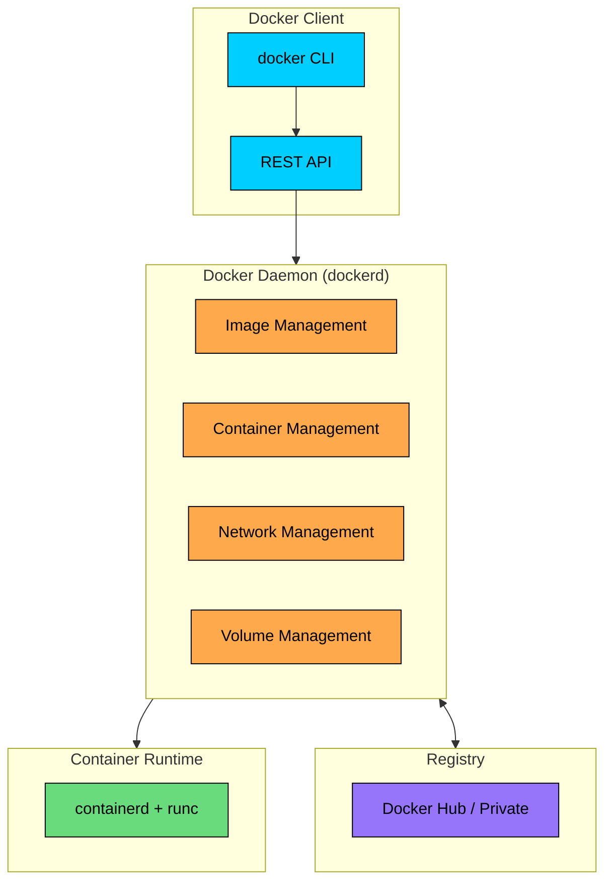

#### **Docker Client**

This is the command-line interface you interact with. When you type `docker run nginx`, the client sends that command to the daemon over a REST API. The client itself does not run containers. It can connect to a local daemon or a remote daemon on another machine, which enables remote management.

#### **Docker Daemon (dockerd)**

The daemon is a background service that does the heavy lifting. It manages containers, images, networks, and volumes. It listens for API requests from the client and orchestrates the container runtime to execute them.

#### **containerd**

This is the industry-standard container runtime that the daemon delegates to. It manages the complete container lifecycle: creating, starting, stopping, and destroying containers. Docker contributed containerd to the Cloud Native Computing Foundation, and it now runs independently of Docker in Kubernetes and other systems.

#### **runc**

This is the low-level runtime that actually creates containers. It talks directly to the Linux kernel, setting up namespaces, cgroups, and other isolation mechanisms. When you start a container, containerd tells runc to create it, and runc does the kernel-level work.

#### **Registry**

This is where images are stored and distributed. When you pull an image, Docker contacts a registry. Docker Hub is the default public registry with millions of images. Organizations often run private registries for proprietary applications.

### 2.2 How Docker Creates Containers

Let us trace what happens when you run a simple command like `docker run nginx`. Understanding this flow helps you debug issues and explain container lifecycle in interviews.

```mermaid
flowchart TD
    A[docker run nginx]:::primary --> B[Docker Client]:::orange
    B --> C[Docker Daemon]:::orange
    C --> D{Image locally"}:::purple
    D -->|No| E[Pull from Registry]:::orange
    D -->|Yes| F[Create Container]:::green
    E --> F
    F --> G[Allocate Network]:::green
    G --> H[Mount Volumes]:::green
    H --> I[Start Container]:::green
    I --> J[Running Container]:::primary

    classDef primary fill:#00ceff,stroke:#000,color:#000
    classDef orange fill:#ffa94d,stroke:#000,color:#000
    classDef green fill:#69db7c,stroke:#000,color:#000
    classDef purple fill:#9775fa,stroke:#000,color:#000
```

**Step 1:** The client parses your command and sends it to the daemon via the REST API. If you are using a remote daemon, this request goes over the network.

**Step 2:** The daemon checks whether the nginx image exists in the local image store. Images are identified by name and tag (nginx:latest by default if you do not specify a tag).

**Step 3:** If the image is not found locally, the daemon contacts the registry (Docker Hub by default), authenticates if necessary, and pulls the image layers. We will discuss layers in detail in Section 4.

**Step 4:** The daemon creates a new container from the image. This means setting up a writable layer on top of the read-only image layers.

**Step 5:** The daemon allocates a network interface and assigns an IP address within a Docker network. By default, this is the bridge network.

**Step 6:** Any specified volumes are mounted to the container filesystem.

**Step 7:** The daemon tells containerd to start the container. containerd delegates to runc, which makes the kernel calls to create the isolated process with its own namespaces and resource limits.

**Step 8:** The container is now running, and the nginx process thinks it has its own isolated system.

### 2.3 Linux Kernel Features

Here is where Docker's "magic" happens. Containers are not virtual machines. They do not emulate hardware or run separate kernels. Instead, they use Linux kernel features to create isolated environments within a shared kernel. Understanding these features helps you explain how containers achieve isolation and where their limitations lie.

#### Namespaces

Namespaces partition kernel resources so that one set of processes sees one set of resources while another set of processes sees a different set. Each container gets its own namespaces, creating the illusion of an isolated system.

| Namespace | What It Isolates | Effect |
|-----------|----------|--------|
| PID | Process IDs | Container sees only its own processes, PID 1 is the container's init |
| NET | Network stack | Container has its own network interfaces, IP addresses, routing tables |
| MNT | Mount points | Container has its own filesystem view, cannot see host mounts |
| UTS | Hostname | Container can have its own hostname independent of host |
| IPC | Inter-process communication | Containers cannot communicate via shared memory or semaphores |
| USER | User and group IDs | Container root can map to non-root on host for security |

When a process inside a container runs `ps aux`, it only sees processes within that container's PID namespace. The process thinks it is PID 1, even though the host sees it as PID 45892.

#### Control Groups (cgroups)

Namespaces provide isolation, but they do not prevent a container from consuming all available CPU or memory. That is where cgroups come in. Cgroups limit and account for resource usage, ensuring one container cannot starve others.

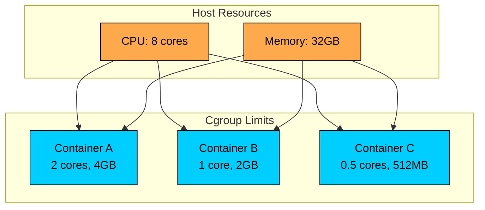

When a container exceeds its memory limit, the kernel's OOM killer terminates processes in that container. When a container hits its CPU limit, the kernel throttles it. This prevents a misbehaving container from affecting others.

#### Union File Systems

Union filesystems layer multiple directories into a single unified view. Docker uses this to implement image layers efficiently. The base image is read-only, additional layers stack on top, and a final writable layer captures container changes.

This architecture enables efficient storage: if 10 containers run from the same image, they share the read-only layers and only need storage for their individual writable layers.

### 2.4 Container Lifecycle

Containers go through defined states during their lifetime. Understanding these states helps you manage containers and debug issues.

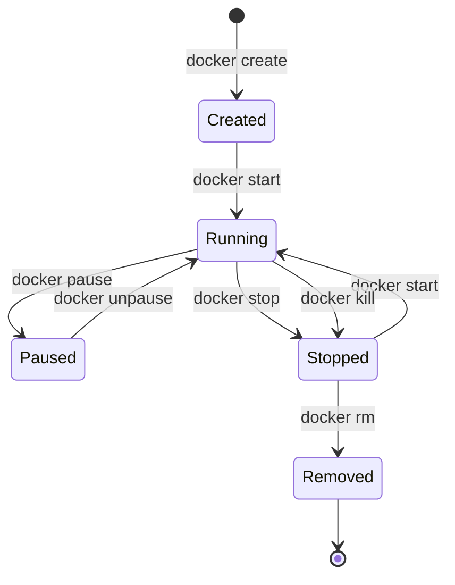

**Created:** The container exists but is not running. Filesystem layers are set up, configuration is stored, but no process is executing. You might create containers ahead of time and start them later.

**Running:** The main process is executing. The container has CPU time allocated and can perform work. Most containers spend the majority of their time in this state.

**Paused:** The container's processes are frozen using SIGSTOP. They do not consume CPU but still hold memory. Useful for temporarily suspending work without losing state.

**Stopped:** The main process has terminated. The container's filesystem and configuration still exist, so you can inspect logs or restart it. Data in the writable layer persists until you remove the container.

**Removed:** The container is deleted. The writable layer and all associated resources are freed. Only volumes persist independently.

**Understanding the shutdown sequence:** When you run `docker stop`, Docker sends SIGTERM to the main process, giving it a chance to clean up gracefully. If the process does not exit within the timeout (10 seconds by default), Docker sends SIGKILL to force termination. Well-designed applications handle SIGTERM to close connections and flush data before exiting.

**Explaining container isolation in interviews:** When interviewers ask how containers achieve isolation, they want to see that you understand the mechanisms, not just the benefits. Here is a solid answer:

"Containers use Linux kernel features rather than hardware virtualization. Namespaces create isolated views of system resources: the PID namespace makes a container see only its own processes, the network namespace gives it its own IP address and interfaces, and the mount namespace isolates its filesystem. Cgroups complement this by limiting resource consumption, so a container cannot use more than its allocated CPU or memory. The key insight is that containers share the host kernel, which is why they start faster and use less memory than VMs, but it also means the isolation is at the kernel level, not the hardware level."

---

# 3. Containers vs Virtual Machines

"Should we use containers or VMs"" This question comes up in nearly every system design discussion about deployment infrastructure. The answer depends on your requirements, and interviewers want to see that you understand the trade-offs rather than defaulting to one technology.

Let us compare the architectures and understand when each makes sense.

### 3.1 Architecture Comparison

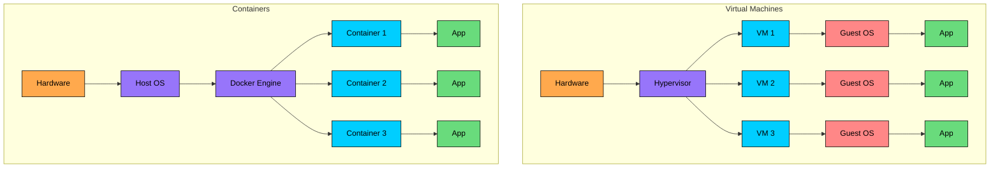

The diagram illustrates the fundamental difference. Look at where the isolation boundary sits.

#### **Virtual Machines**

Each VM runs a complete guest operating system on top of a hypervisor. The hypervisor emulates hardware, allowing you to run Windows on a Linux host or vice versa. Each guest OS consumes resources for its kernel, system services, and memory management. You get strong isolation because each VM has its own kernel, but you pay for it with resource overhead.

#### **Containers**

All containers share the host operating system's kernel. Docker Engine uses kernel features (namespaces and cgroups) to isolate processes, but there is no guest OS to boot. A container is essentially a regular process with fancy isolation. This is why containers start in seconds rather than minutes, and why you can run hundreds of containers on a single host.

### 3.2 Resource Comparison

The numbers tell the story clearly:

| Aspect | Virtual Machines | Containers |
|--------|------------------|------------|
| Startup time | Minutes | Seconds |
| Memory overhead | GBs (full OS) | MBs (app only) |
| Disk space | GBs per VM | MBs per container |
| Isolation | Strong (hardware level) | Good (kernel level) |
| Density | 10-100 per host | 100-1000 per host |
| Portability | Hypervisor dependent | Highly portable |
| OS flexibility | Any OS | Same OS family as host |

The density difference is striking. On a host with 64GB of RAM, you might run 10 VMs if each needs a few GB for the guest OS. With containers, you could run hundreds because each container only needs memory for the application itself.

The OS flexibility row is often overlooked. Containers share the host kernel, which means you cannot run Windows containers on a Linux host or Linux containers on a native Windows host (Docker Desktop uses a hidden Linux VM on Mac and Windows for this reason). VMs have no such restriction because each runs its own kernel.

### 3.3 Security Comparison

Security is where the trade-off becomes most apparent.

**Virtual Machines:**

- Each VM has its own kernel. If an attacker compromises a VM, they cannot access the host kernel without a hypervisor escape, which is a rare and difficult attack.
- The security boundary has decades of hardening and is well understood.
- VMs are the standard choice for multi-tenant environments where different customers share infrastructure.

**Containers:**

- All containers share the host kernel. A kernel vulnerability potentially affects all containers on that host.
- Container escape vulnerabilities have occurred (though they are rare and patched quickly).
- Security has improved significantly with user namespaces, seccomp profiles, AppArmor/SELinux, and rootless containers.
- For single-tenant workloads where you control all the code running, container security is typically sufficient.

The practical advice: use VMs for isolation boundaries between untrusted workloads, containers for isolation within trusted workloads.

### 3.4 When to Use Each

```mermaid
flowchart TD
    A[What do you need"]:::primary
    A --> B{Different OS than host"}
    B -->|Yes| C[Virtual Machine]:::orange
    B -->|No| D{Maximum isolation"}
    D -->|Yes| E[Virtual Machine]:::orange
    D -->|No| F{Fast scaling needed"}
    F -->|Yes| G[Container]:::green
    F -->|No| H{Resource efficiency"}
    H -->|Priority| G
    H -->|Not priority| I[Either works]:::purple

    classDef primary fill:#00ceff,stroke:#000,color:#000
    classDef orange fill:#ffa94d,stroke:#000,color:#000
    classDef green fill:#69db7c,stroke:#000,color:#000
    classDef purple fill:#9775fa,stroke:#000,color:#000
```

#### **Choose VMs when:**

- You need to run a different OS than the host (Windows on Linux, or vice versa)
- Maximum security isolation is required (regulatory compliance, untrusted code execution)
- Multi-tenant environments where customers share infrastructure
- Legacy applications that require full OS access or have not been containerized

#### **Choose Containers when:**

- Building microservices architectures
- Rapid scaling is a requirement
- Resource efficiency matters (high container density)
- CI/CD automation is a priority
- Running Linux applications on Linux hosts (or Windows on Windows)

#### **Combine both:**

Many production environments use both. A common pattern is to run Kubernetes worker nodes as VMs, with containers running inside those VMs. Each VM provides an isolation boundary, while containers within provide efficient resource utilization. For multi-tenant platforms, each tenant might get their own VM or node pool, with their containers running inside.

---

# 4. Images and Layers

Understanding images is essential for efficient Docker usage. Images affect build times, deployment speed, and storage consumption. A poorly structured Dockerfile can result in 10-minute builds that should take 30 seconds. Let us look at how images work so you can optimize them.

### 4.1 Image Basics

An image is a read-only template that contains everything needed to run an application:

- Application code
- Runtime (Node.js, Python, JVM)
- Libraries and dependencies
- Environment variables and configuration

When you run a container, Docker takes this read-only image and adds a thin writable layer on top. The container can write to this layer, but the underlying image remains unchanged. This design means many containers can share the same base image efficiently.

### 4.2 Layer Architecture

Here is the key insight: images are built in layers, and each instruction in a Dockerfile creates a new layer. Understanding this architecture is the foundation for writing efficient Dockerfiles.

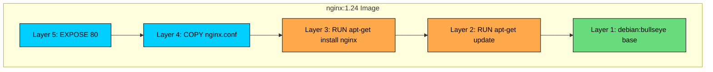

Each layer stores only the differences from the layer below it. When you install nginx, Layer 3 contains only the nginx files, not a copy of the entire filesystem.

#### **Why layers matter:**

- **Caching:** Docker caches each layer. When you rebuild an image, unchanged layers are reused from cache. If Layer 1-3 have not changed, Docker skips rebuilding them.
- **Sharing:** If you have 10 images based on `node:18-alpine`, they all share that base layer. Your disk stores it once, not 10 times.
- **Transfer efficiency:** When you push or pull an image, Docker transfers only the layers the destination does not have. If the registry already has `debian:bullseye`, pulling your image transfers only the layers you added.
- **Read-only immutability:** Once a layer is built, it never changes. This guarantees reproducibility. The same image tag always contains the same layers.

### 4.3 Dockerfile Best Practices

**Best practices:**

| Practice | Why |
|----------|-----|
| Use specific base image tags | Reproducible builds |
| Order instructions by change frequency | Maximize cache hits |
| Combine RUN commands | Fewer layers |
| Use .dockerignore | Smaller build context |
| Run as non-root user | Security |
| Use multi-stage builds | Smaller final images |

### 4.4 Multi-Stage Builds

Separate build-time dependencies from runtime, resulting in smaller images.

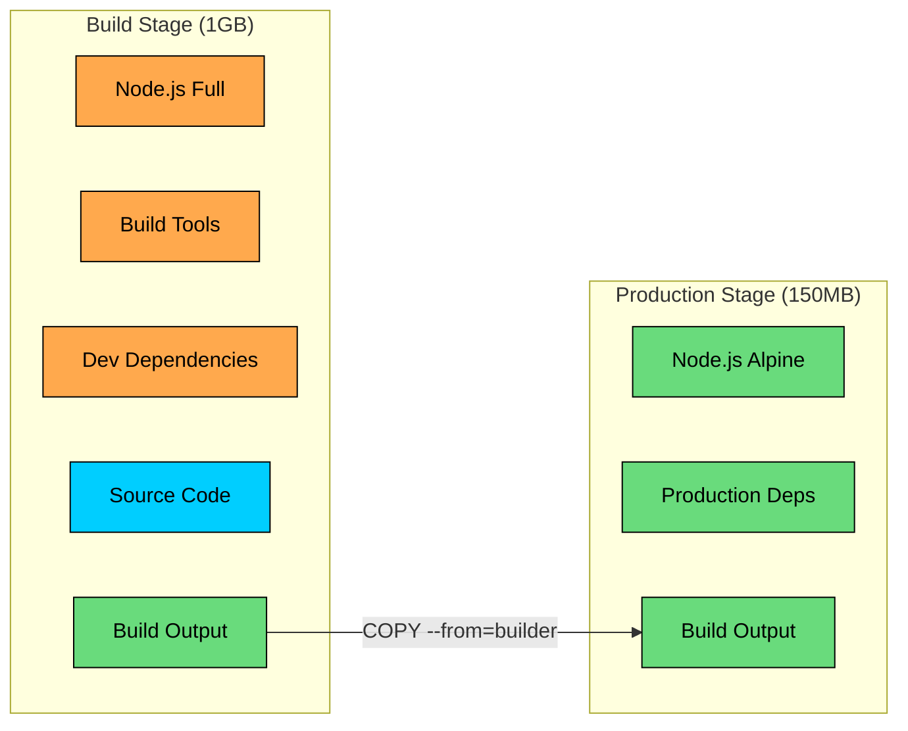

**Benefits:**

- Build tools not included in final image
- Significantly smaller production images
- Faster deployment and startup
- Reduced attack surface

### 4.5 Layer Caching Strategy

Layer caching is where image optimization gets interesting. Docker caches each layer and reuses it if nothing has changed. But here is the catch: if any layer changes, all subsequent layers must be rebuilt. This is why the order of instructions in your Dockerfile matters so much.

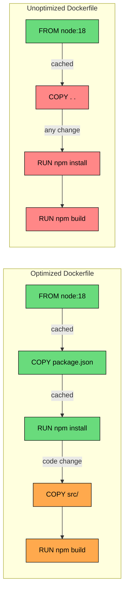

In the optimized version, when you change application code in `src/`, only Layer 4 and 5 rebuild. The expensive `npm install` step (Layer 3) stays cached because `package.json` did not change.

In the unoptimized version, any code change invalidates Layer 2 (`COPY . .`), which forces Layer 3 and 4 to rebuild. You wait for `npm install` every time, even though dependencies have not changed.

#### **Cache invalidation rules:**

1. **Cascade effect:** If a layer changes, all subsequent layers are rebuilt. There is no way to skip intermediate layers.
2. **Order by change frequency:** Put rarely-changing instructions early (base image, system packages, dependencies) and frequently-changing instructions late (application code).
3. **Content-based invalidation:** ADD and COPY compare file contents. If the content changes, the cache is invalidated. Even a timestamp change does not invalidate, only actual content differences.
4. **Command-based caching:** RUN instructions cache based on the command string, not the result. `RUN apt-get update` caches even if new packages are available. This is why you often see `apt-get update && apt-get install` combined.

### 4.6 Image Size Optimization

Image size directly affects deployment speed and storage costs. A 1GB image takes longer to pull than a 100MB image. At scale, the difference is significant.

| Technique | Impact |
|-----------|--------|
| Use Alpine base images | 5MB vs 100MB+ |
| Multi-stage builds | Remove build tools |
| Minimize layers | Combine RUN commands |
| Clean up in same layer | Remove cache, temp files |
| Use .dockerignore | Exclude unnecessary files |

Notice that we clean up (`rm -rf /var/lib/apt/lists/*`) in the same RUN command. If we did it in a separate RUN command, the cleanup would create a new layer, but the files would still exist in the previous layer. The image would not get smaller. Layers are additive: deleting files in a new layer does not reduce the size of previous layers.

---

# 5. Networking

Once you have containers running, they need to communicate: with each other, with databases, with external services, and with users. Docker provides several networking models to handle these scenarios.

Understanding Docker networking helps you design service-to-service communication in microservices architectures. It also explains how containers are exposed to the outside world and how to implement network-level isolation between services.

### 5.1 Network Types

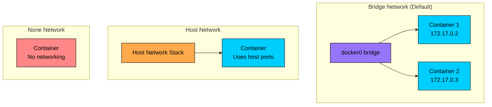

| Network Type | Description | Use Case |
|--------------|-------------|----------|
| bridge | Default, isolated network | Most applications |
| host | Container uses host network directly | Maximum network performance |
| none | No networking | Security isolation |
| overlay | Multi-host networking | Swarm/Kubernetes |
| macvlan | Container gets MAC address | Legacy applications |

The bridge network is what you will use most often. Let us look at it in detail.

### 5.2 Bridge Networking

When you start a container without specifying a network, Docker connects it to the default bridge network. Each container gets a private IP address (typically in the 172.17.0.0/16 range) and can communicate with other containers on the same bridge.

However, there is an important distinction between the default bridge and user-defined bridges. The default bridge requires you to use IP addresses to communicate between containers. User-defined bridges provide automatic DNS resolution, so containers can reach each other by name.

With a user-defined network like `mynet`, the API container can connect to `db:5432` without knowing the database's IP address. Docker's embedded DNS server resolves container names to their current IP addresses. This is essential for microservices because container IPs can change when containers restart.

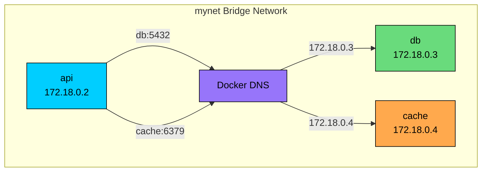

### 5.3 Port Mapping

Expose container ports to the host.

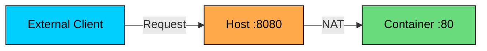

### 5.4 Container-to-Container Communication

**Same network:** Use container names as hostnames.

**Different networks:** Containers cannot communicate directly. Connect container to multiple networks if needed.

### 5.5 Network Isolation

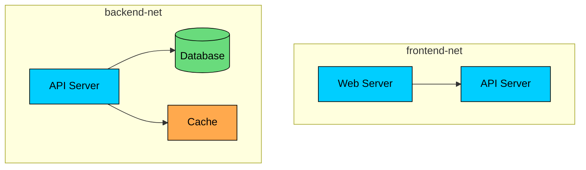

**Security pattern:**

- Frontend network: Web servers and API
- Backend network: API, database, cache
- API connects to both networks
- Database not accessible from frontend

### 5.6 Host Networking

Container shares the host network stack directly.

**Pros:**

- No NAT overhead means slightly better network performance
- Container sees the actual host network interfaces
- Simpler debugging (container ports are directly accessible)

**Cons:**

- No network isolation from the host
- Port conflicts with other applications on the host
- Container can potentially access other host services

Host networking is primarily useful when you need maximum network performance and the container is trusted. For most applications, bridge networking is preferred for its isolation.

---

# 6. Storage and Volumes

By default, containers are ephemeral. When you remove a container, any data written inside it disappears. This is by design: containers should be disposable, easily replaced by new instances running the same image.

But some data needs to outlive containers. Database files, uploaded content, application logs, and configuration files all need persistence. Docker volumes solve this problem.

### 6.1 Storage Types

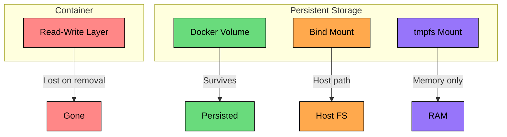

| Type | Description | Use Case |
|------|-------------|----------|
| Container layer | Read-write, ephemeral | Temporary files |
| Volumes | Docker-managed storage | Database data, persistent state |
| Bind mounts | Map host directory | Development, config files |
| tmpfs | Memory-only storage | Secrets, cache |

Let us understand when to use each.

### 6.2 Docker Volumes

Volumes are the recommended way to persist data in Docker. Docker manages them independently of containers, storing them in `/var/lib/docker/volumes/` on the host. The key advantage: volumes persist even when containers are removed, and they can be shared between containers.

**Volume lifecycle:**

```mermaid
flowchart LR
    A[Create Volume]:::primary --> B[Attach to Container]:::orange
    B --> C[Container Runs]:::green
    C --> D[Container Stops]:::orange
    D --> E{Remove Container"}:::purple
    E -->|Yes| F[Data Persists in Volume]:::green
    E -->|No| D
    F --> G[Attach to New Container]:::orange
    G --> C

    classDef primary fill:#00ceff,stroke:#000,color:#000
    classDef orange fill:#ffa94d,stroke:#000,color:#000
    classDef green fill:#69db7c,stroke:#000,color:#000
    classDef purple fill:#9775fa,stroke:#000,color:#000
```

### 6.3 Bind Mounts

Map a host directory directly into the container.

**Use cases:**

- Development: Edit code on host, run in container
- Configuration: Share config files
- Build artifacts: Output to host filesystem

**Caution:** Container has direct access to host filesystem. Security risk if misused.

### 6.4 Storage for Databases

Running databases in containers requires careful volume management.

**Best practices for stateful services:**

- Always use named volumes (not anonymous)
- Regular backup strategy
- Consider external storage (EBS, NFS)
- Test recovery procedures

### 6.5 Volume Drivers

Docker supports external storage through volume drivers.

| Driver | Storage Backend |
|--------|-----------------|
| local | Host filesystem (default) |
| nfs | Network File System |
| aws-ebs | Amazon Elastic Block Store |
| azure-file | Azure File Storage |
| gce-pd | Google Persistent Disk |

### 6.6 Stateless vs Stateful Containers

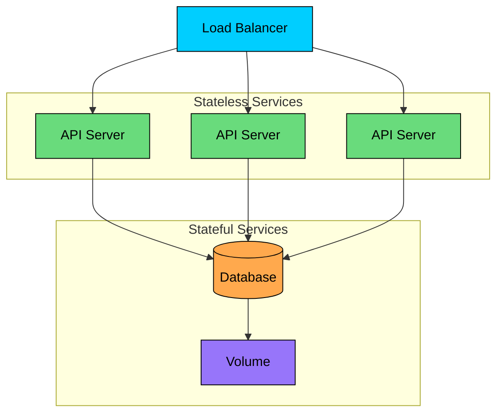

**Stateless containers:**

- No persistent data in container
- Can be replaced freely
- Scale horizontally
- Examples: API servers, web servers, workers

**Stateful containers:**

- Require persistent volumes
- Cannot be replaced without data migration
- Scale carefully
- Examples: Databases, message queues

---

# 7. Docker Compose

Running individual `docker run` commands becomes tedious when you have multiple containers that need to work together. Your application might need an API server, a database, a cache, and a message queue. Starting each manually, with the right network configuration and volumes, is error-prone.

Docker Compose solves this by letting you define your entire stack in a single YAML file. One command starts everything with the correct configuration.

### 7.1 Compose File Structure

### 7.2 Architecture Diagram

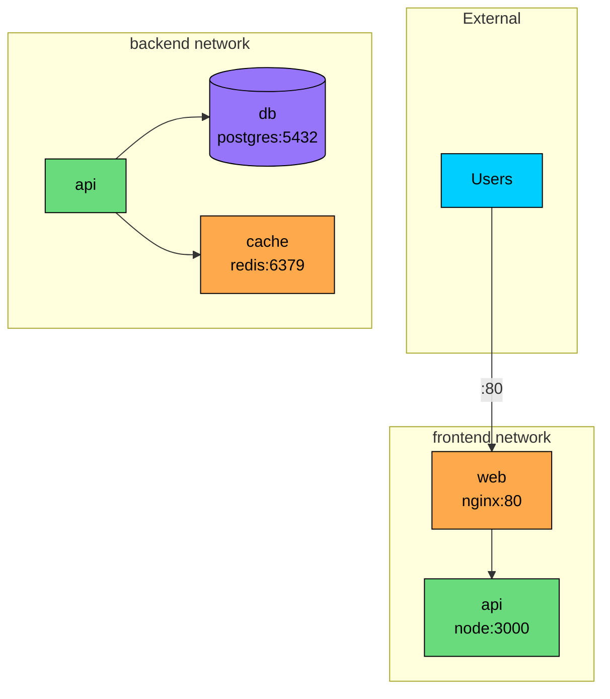

### 7.3 Common Commands

### 7.4 Key Configuration Options

| Option | Description |
|--------|-------------|
| build | Build image from Dockerfile |
| image | Use existing image |
| ports | Port mapping |
| volumes | Volume mounts |
| environment | Environment variables |
| env_file | Load env from file |
| depends_on | Service dependencies |
| networks | Network connections |
| restart | Restart policy |
| healthcheck | Health check command |

### 7.5 Environment Configuration

**Environment precedence:**

1. Compose file environment
2. Shell environment variables
3. env_file values
4. Dockerfile ENV

### 7.6 Health Checks

### 7.7 Development vs Production

---

# 8. Container Orchestration

Docker Compose works well for local development and simple deployments, but it runs on a single host. What happens when your application grows beyond what one machine can handle" What happens when that machine fails"

Production workloads need to run across multiple hosts for both capacity and reliability. This is where container orchestration comes in. An orchestrator manages containers across a cluster of machines, handling deployment, scaling, networking, and failure recovery automatically.

### 8.1 Why Orchestration"

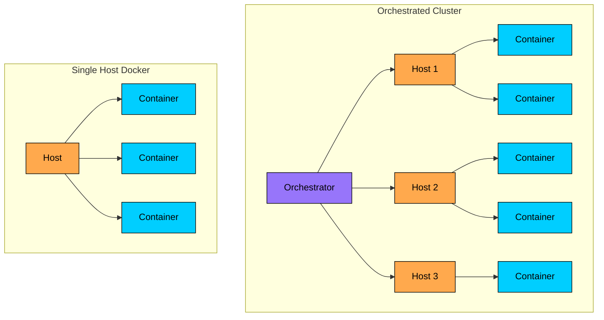

#### **Orchestration provides:**

- Multi-host deployment
- Automatic scaling
- Service discovery
- Load balancing
- Rolling updates
- Self-healing (restart failed containers)
- Resource management

### 8.2 Kubernetes Overview

Kubernetes (K8s) is the industry standard for container orchestration.

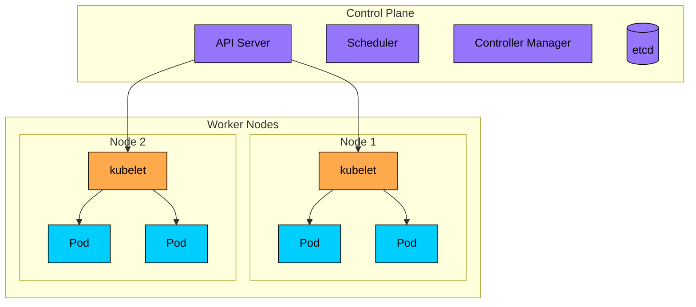

**Key concepts:**

| Concept | Description |
|---------|-------------|
| Pod | Smallest deployable unit (one or more containers) |
| Deployment | Manages pod replicas and updates |
| Service | Stable endpoint for pods |
| ConfigMap | Configuration data |
| Secret | Sensitive data |
| Ingress | External access to services |

### 8.3 Basic Kubernetes Deployment

### 8.4 Docker Swarm

Simpler alternative to Kubernetes, built into Docker.

**Swarm vs Kubernetes:**

| Aspect | Docker Swarm | Kubernetes |
|--------|--------------|------------|
| Complexity | Simple | Complex |
| Features | Basic | Extensive |
| Ecosystem | Limited | Large |
| Learning curve | Low | Steep |
| Production adoption | Lower | Industry standard |

### 8.5 Managed Kubernetes Services

| Provider | Service |
|----------|---------|
| AWS | EKS (Elastic Kubernetes Service) |
| Google Cloud | GKE (Google Kubernetes Engine) |
| Azure | AKS (Azure Kubernetes Service) |
| DigitalOcean | DOKS |

#### **Benefits of managed services:**

- Control plane managed by provider
- Automatic upgrades
- Integration with cloud services
- Reduced operational burden

### 8.6 When to Use Orchestration

```mermaid
flowchart TD
    A[How many containers"]:::primary
    A --> B{More than 10"}
    B -->|No| C{Multiple hosts needed"}
    C -->|No| D[Docker Compose]:::green
    C -->|Yes| E[Consider Swarm/K8s]:::orange
    B -->|Yes| F{Need advanced features"}
    F -->|Yes| G[Kubernetes]:::purple
    F -->|No| H[Start with Swarm]:::orange

    classDef primary fill:#00ceff,stroke:#000,color:#000
    classDef orange fill:#ffa94d,stroke:#000,color:#000
    classDef green fill:#69db7c,stroke:#000,color:#000
    classDef purple fill:#9775fa,stroke:#000,color:#000
```

**Docker Compose:** Development, simple applications, single host

**Docker Swarm:** Simple multi-host, moderate scale, Docker-native

**Kubernetes:** Production workloads, complex applications, large scale

---

# 9. Docker in Production

The patterns that work for local development do not always translate directly to production. Running containers at scale requires attention to security, resource management, logging, monitoring, and deployment strategies. Let us look at the key production considerations.

### 9.1 Security Best Practices

#### **Image security:**

- Use official or verified images
- Scan images for vulnerabilities
- Keep base images updated
- Use minimal base images (Alpine, distroless)

#### **Container security:**

- Run as non-root user
- Use read-only filesystem where possible
- Limit capabilities
- Set resource limits

### 9.2 Resource Limits

Prevent containers from consuming excessive resources.

**In Compose:**

### 9.3 Logging

Configure appropriate log drivers for production.

**Log drivers:**

| Driver | Destination |
|--------|-------------|
| json-file | Local JSON files (default) |
| syslog | Syslog daemon |
| journald | systemd journal |
| fluentd | Fluentd collector |
| awslogs | CloudWatch Logs |
| gcplogs | Google Cloud Logging |

### 9.4 Monitoring

```mermaid
flowchart LR
    subgraph Containers
        C1[Container 1]:::primary
        C2[Container 2]:::primary
        C3[Container 3]:::primary
    end

    subgraph Monitoring["Monitoring Stack"]
        CA[cAdvisor]:::orange
        PROM[Prometheus]:::green
        GRAF[Grafana]:::purple
    end

    C1 --> CA
    C2 --> CA
    C3 --> CA
    CA --> PROM
    PROM --> GRAF

    classDef primary fill:#00ceff,stroke:#000,color:#000
    classDef orange fill:#ffa94d,stroke:#000,color:#000
    classDef green fill:#69db7c,stroke:#000,color:#000
    classDef purple fill:#9775fa,stroke:#000,color:#000
```

**Key metrics:**

- CPU usage
- Memory usage
- Network I/O
- Disk I/O
- Container count
- Restart count
- Health check status

### 9.5 CI/CD Pipeline

```mermaid
flowchart LR
    A[Code Push]:::primary --> B[Build Image]:::orange
    B --> C[Run Tests]:::orange
    C --> D[Scan Image]:::orange
    D --> E[Push to Registry]:::green
    E --> F[Deploy to Staging]:::green
    F --> G[Integration Tests]:::orange
    G --> H[Deploy to Production]:::green

    classDef primary fill:#00ceff,stroke:#000,color:#000
    classDef orange fill:#ffa94d,stroke:#000,color:#000
    classDef green fill:#69db7c,stroke:#000,color:#000
```

**Pipeline stages:**

1. **Build:** Create Docker image from code
2. **Test:** Run unit tests in container
3. **Scan:** Check for vulnerabilities
4. **Push:** Upload to container registry
5. **Deploy:** Update running containers

### 9.6 Zero-Downtime Deployments

**Rolling update strategy:**

```mermaid
flowchart LR
    subgraph Step1["Step 1: Running v1"]
        V1A[v1]:::orange
        V1B[v1]:::orange
        V1C[v1]:::orange
    end

    subgraph Step2["Step 2: Deploy v2"]
        V2A[v2]:::green
        V1D[v1]:::orange
        V1E[v1]:::orange
    end

    subgraph Step3["Step 3: Continue"]
        V2B[v2]:::green
        V2C[v2]:::green
        V1F[v1]:::orange
    end

    subgraph Step4["Step 4: Complete"]
        V2D[v2]:::green
        V2E[v2]:::green
        V2F[v2]:::green
    end

    Step1 --> Step2 --> Step3 --> Step4

    classDef orange fill:#ffa94d,stroke:#000,color:#000
    classDef green fill:#69db7c,stroke:#000,color:#000
```

**In Kubernetes:**

---

# Summary

Docker has become foundational infrastructure for modern applications. In system design interviews, you will encounter it in discussions about microservices, deployment pipelines, and scaling strategies. Here are the key points to internalize:

#### **Understand the fundamentals, not just the commands**

Containers work because of Linux kernel features: namespaces provide isolation, cgroups limit resources, and union filesystems enable efficient layering. When you explain how containers achieve isolation, this understanding sets you apart from candidates who only know the surface.

#### **Know when to use containers, and when not to**

Containers excel at stateless services, microservices architectures, and CI/CD pipelines. They struggle with stateful applications that need complex storage management. Being able to articulate trade-offs shows architectural maturity.

#### **Container vs VM is about trade-offs, not preference**

Containers are fast and efficient because they share the host kernel. VMs provide stronger isolation because each has its own kernel. In many production systems, you use both: VMs for tenant isolation, containers for efficient resource utilization within each tenant.

#### **Image optimization directly affects your deployment pipeline**

Structure Dockerfiles to maximize cache hits by ordering instructions from least to most frequently changing. Use multi-stage builds to keep production images small. These practices determine whether your builds take 30 seconds or 10 minutes.

#### **Network design is part of your security model**

Use separate networks to isolate tiers. The database should not be directly accessible from the web tier. Docker's built-in DNS lets services discover each other by name, which simplifies configuration and handles container IP changes automatically.

#### **Production containers need production practices**

Run containers as non-root users, limit capabilities, set resource limits, and scan images for vulnerabilities. Implement health checks so orchestrators can detect and replace unhealthy containers. Use rolling updates for zero-downtime deployments.

When discussing Docker in interviews, go beyond "we use containers." Explain your image strategy, network topology, storage approach, and production deployment patterns. This depth demonstrates that you understand containerized systems as a complete architecture, not just a deployment mechanism.

---

# References

- [Docker Documentation](https://docs.docker.com/) - Official Docker documentation covering all features and best practices
- [Kubernetes Documentation](https://kubernetes.io/docs/) - Official Kubernetes documentation for container orchestration
- [Docker Deep Dive](https://www.amazon.com/Docker-Deep-Dive-Nigel-Poulton/dp/1521822808) - Nigel Poulton's comprehensive book on Docker internals
- [The Twelve-Factor App](https://12factor.net/) - Methodology for building cloud-native applications that work well with containers
- [Container Security](https://www.oreilly.com/library/view/container-security/9781492056690/) - Liz Rice's book on securing containerized applications
- [CNCF Cloud Native Interactive Landscape](https://landscape.cncf.io/) - Overview of the container and cloud-native ecosystem

---

# Quiz
