Imagine you have 50 microservices, each running multiple instances across a cluster of machines. Some services need to scale up during peak hours. Others need to restart when they crash. You need to deploy new versions without downtime, route traffic between services, and make sure a failure on one machine does not bring down your application.

Doing all this manually would be impossible. This is where **Kubernetes** comes in.

<!-- Icon: devicon:kubernetes -->

Kubernetes (often abbreviated as K8s) automates the deployment, scaling, and management of containerized applications across clusters. It handles the operational complexity that would otherwise require a team of operators working around the clock. 

When a container crashes, Kubernetes restarts it. When traffic spikes, it can add more instances. When you deploy a new version, it rolls it out gradually to avoid downtime.

This chapter gives you the depth to discuss kubernetes confidently in interviews. We will cover cluster architecture, core abstractions, networking, storage, scaling, deployment strategies, and production considerations.

---

# 1. When to Choose Kubernetes

> [!PAYWALL] This content is for premium members only.

Kubernetes is powerful, but it is not always the right choice. Understanding when to use it, and when simpler alternatives are better, shows architectural maturity in interviews. Let us start with the problems Kubernetes solves.

### 1.1 What Kubernetes Solves

At its core, Kubernetes answers a question: "How do I run and manage containers reliably across a cluster of machines""

Before Kubernetes, running containers at scale meant solving many problems yourself:

- Which machine should this container run on" You had to decide.
- What happens when a container crashes" You had to detect it and restart it.
- How do containers find each other" You had to configure service discovery.
- How do you deploy a new version without downtime" You had to orchestrate it manually.

Kubernetes handles all of this automatically. Here is what it provides:

#### **Container orchestration**

Kubernetes distributes containers across a cluster of machines based on resource requirements and constraints. You do not decide which node runs which container. The scheduler does.

#### **Self-healing**

When a container crashes, Kubernetes restarts it. When a node fails, it reschedules the containers elsewhere. When a container fails health checks, Kubernetes stops sending it traffic and eventually replaces it. This happens automatically, without human intervention.

#### **Service discovery and load balancing**

Containers find each other by name rather than IP address. Kubernetes provides built-in DNS for service discovery and automatically load-balances traffic across healthy instances.

#### **Horizontal scaling**

Scale from 3 replicas to 30 with a single command, or let Kubernetes do it automatically based on CPU utilization, memory usage, or custom metrics like requests per second.

#### **Rolling updates and rollbacks**

Deploy new versions gradually. Kubernetes starts new containers, verifies they are healthy, then terminates old ones. If something goes wrong, roll back to the previous version with one command.

#### **Declarative configuration**

You define the desired state ("I want 5 replicas of this application, each with 512MB of memory"). Kubernetes continuously works to make reality match that state. If a container dies, the actual count drops below desired, and Kubernetes creates a replacement.

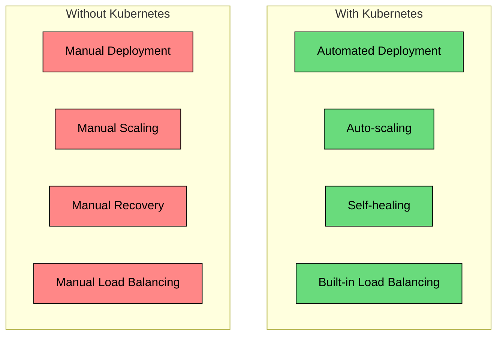

### 1.2 When to Use Kubernetes

Kubernetes shines in specific scenarios. Recognizing these helps you justify the choice in interviews:

#### **Microservices at scale**

When you have 10, 20, or 50 services that need to communicate, scale independently, and be deployed by different teams on different schedules. The overhead of Kubernetes is justified by the operational complexity it handles.

#### **Dynamic workloads**

Applications with variable traffic patterns benefit from auto-scaling. An e-commerce site that gets 10x traffic on Black Friday can scale up automatically and scale down afterward to save costs.

#### **High availability requirements**

Applications that must survive machine failures without human intervention. Kubernetes automatically reschedules workloads when nodes fail, often before users notice anything is wrong.

#### **Multi-team environments**

When multiple teams deploy to shared infrastructure, Kubernetes namespaces and RBAC provide isolation and access control. Team A cannot accidentally affect Team B's services.

#### **CI/CD automation**

When you need frequent, reliable deployments with automatic rollback. Kubernetes makes "deploy 10 times a day" practical rather than terrifying.

#### **Hybrid and multi-cloud**

When you want the same deployment mechanism across AWS, GCP, and on-premises data centers. Kubernetes abstracts the underlying infrastructure.

### 1.3 When NOT to Use Kubernetes

Kubernetes has significant operational complexity. Using it when you do not need it is a common mistake:

#### **Simple applications**

A single service running on a few servers does not need Kubernetes. Docker Compose or a simple systemd service is simpler to operate. The complexity of Kubernetes is not worth it until you have enough services and scale to justify it.

#### **Small teams without platform expertise**

The learning curve is steep. Without someone who understands Kubernetes well, you will spend more time debugging cluster issues than building features. Consider managed platforms like Heroku, Render, or cloud-native services (Lambda, Cloud Run) that abstract away infrastructure.

#### **Monolithic applications**

If your application is a single deployable unit that scales vertically, Kubernetes adds overhead without providing proportional benefit. The advantages of Kubernetes emerge with multiple independently deployable services.

#### **Cost-constrained projects**

Kubernetes requires multiple nodes for high availability (at minimum, 3 for a resilient control plane). Managed Kubernetes services like EKS or GKE add cost. For a small project, this overhead may not make sense.

#### **Purely stateful workloads**

While Kubernetes can run databases using StatefulSets, managed database services (RDS, Cloud SQL, Atlas) are usually simpler and more reliable. Running your own database on Kubernetes means taking on operational burden that managed services handle for you.

### 1.4 **Justifying Kubernetes in interviews**

When you propose Kubernetes in a system design, explain why it fits rather than just naming it. Here is an example:

> 💡 **Key Insight:**

> **DISCUSSION**
>
> "For this e-commerce platform, I would use Kubernetes for several reasons. We have 15+ microservices that need to scale independently. The product catalog service handles steady traffic, but the checkout service needs to scale 5x during flash sales. Kubernetes HPA handles this automatically based on CPU and request rate.
>
> We also deploy frequently. Each team releases their service independently, sometimes multiple times per day. Kubernetes rolling updates let us deploy without downtime, and if something goes wrong, we can roll back in seconds.
>
> That said, for a simpler application, maybe a single API with a database, I would use something simpler like ECS or even just EC2 with an auto-scaling group. Kubernetes is worth the complexity only when you have enough services and operational requirements to justify it."

This response shows you understand both the benefits of Kubernetes and when it becomes overkill.

---

# 2. Kubernetes Architecture

Understanding Kubernetes architecture is not just academic. It helps you debug issues, understand failure modes, and explain to interviewers how Kubernetes actually works under the hood. Let us look at the components and how they interact.

### 2.1 Cluster Overview

A Kubernetes cluster has two types of machines: the control plane nodes that make decisions about the cluster, and worker nodes that run your actual application workloads.

<!-- payload:embedBlock:START {"id":"694c2e9a2100a90b7019cde9","url":"https://link.excalidraw.com/readonly/YVC8QUPp6rihBjlKd6WN","mermaidCode":"flowchart LR\n    subgraph ControlPlane[\"Control Plane\"]\n        API[API Server]:::purple\n        ETCD[(etcd)]:::purple\n        SCHED[Scheduler]:::purple\n        CM[Controller Manager]:::purple\n    end\n\n    subgraph Workers[\"Worker Nodes\"]\n        subgraph Node1[\"Node 1\"]\n            K1[kubelet]:::orange\n            KP1[kube-proxy]:::orange\n            CR1[Container Runtime]:::orange\n            P1[Pod]:::primary\n            P2[Pod]:::primary\n        end\n\n        subgraph Node2[\"Node 2\"]\n            K2[kubelet]:::orange\n            KP2[kube-proxy]:::orange\n            CR2[Container Runtime]:::orange\n            P3[Pod]:::primary\n            P4[Pod]:::primary\n        end\n\n        subgraph Node3[\"Node 3\"]\n            K3[kubelet]:::orange\n            KP3[kube-proxy]:::orange\n            CR3[Container Runtime]:::orange\n            P5[Pod]:::primary\n            P6[Pod]:::primary\n        end\n    end\n\n    API <--> ETCD\n    API <--> SCHED\n    API <--> CM\n    API <--> K1\n    API <--> K2\n    API <--> K3\n\n    classDef primary fill:#00ceff,stroke:#000,color:#000\n    classDef orange fill:#ffa94d,stroke:#000,color:#000\n    classDef purple fill:#9775fa,stroke:#000,color:#000"} -->
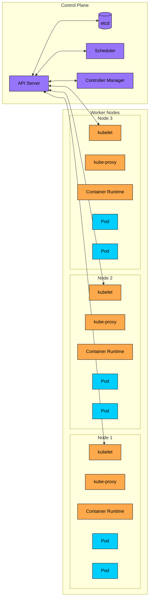

### 2.2 Control Plane Components

The control plane is the brain of Kubernetes. It makes decisions about where to run pods, monitors cluster health, and responds to changes. All control plane components work together, but each has a specific responsibility.

#### **API Server (kube-apiserver)**

The API server is the front door to Kubernetes. Every interaction with the cluster, whether from kubectl, your CI/CD pipeline, or the cluster's own components, goes through the API server. It exposes a RESTful API, validates requests, and persists state to etcd. Think of it as the central hub that everything talks to.

When you run `kubectl apply -f deployment.yaml`, kubectl sends the YAML to the API server. The API server validates it, stores it in etcd, and other components react to the change.

#### **etcd**

etcd is a distributed key-value store that holds all cluster state. Every piece of information about your cluster, which pods exist, what their desired state is, which nodes are available, lives in etcd. It is the source of truth.

Because etcd stores everything, it is critical to back it up regularly. Losing etcd means losing the cluster state. In production, etcd runs as a cluster of 3 or 5 nodes for high availability.

#### **Scheduler (kube-scheduler)**

When you create a pod, it starts with no assigned node. The scheduler watches for these unassigned pods and decides where to place them. It considers resource requirements (does the node have enough CPU and memory"), constraints (does the pod require a specific node type"), affinity rules, and taints/tolerations.

The scheduler does not run pods. It only decides where they should run and updates the pod specification with the chosen node. The actual work of starting the container happens on the worker node.

#### **Controller Manager (kube-controller-manager)**

The controller manager runs multiple controllers, each watching a specific type of resource and ensuring actual state matches desired state. This is the heart of Kubernetes' self-healing capability.

- **ReplicaSet Controller:** You specify 3 replicas. If a pod dies and only 2 exist, this controller creates a new one.
- **Node Controller:** Watches node health. If a node stops responding, it marks it unhealthy and triggers pod rescheduling.
- **Deployment Controller:** Manages rolling updates, ensuring new pods come up before old ones terminate.
- **Endpoint Controller:** Keeps track of which pods back each Service.

Each controller runs in a reconciliation loop: observe current state, compare to desired state, take action to close the gap. This pattern is fundamental to how Kubernetes works.

### 2.3 Worker Node Components

While the control plane makes decisions, worker nodes do the actual work of running your applications. Each worker node runs several components that together make containers work.

#### **kubelet**

The kubelet is an agent that runs on every worker node. It is responsible for actually running pods on that node. When the scheduler assigns a pod to a node, the kubelet on that node receives the pod specification and tells the container runtime to start the required containers.

The kubelet also monitors container health, restarts containers that crash, and reports status back to the control plane. If a container's liveness probe fails, the kubelet kills it and starts a new one.

#### **kube-proxy**

kube-proxy runs on every node and implements the networking that makes Services work. When you create a Service, kube-proxy sets up rules (using iptables or IPVS) that route traffic destined for the Service's virtual IP to the actual pod IPs behind it.

This is what enables service discovery. When a pod connects to `api-service:80`, kube-proxy's rules route that traffic to one of the pods backing the service, implementing load balancing.

#### **Container Runtime**

The container runtime is the software that actually runs containers. Kubernetes supports multiple runtimes through the Container Runtime Interface (CRI). Common options include containerd (most common), CRI-O, and Docker (via dockershim, now deprecated).

When the kubelet needs to start a container, it tells the container runtime to pull the image and start the container. The runtime handles the low-level details of namespaces, cgroups, and filesystem layering.

### 2.4 How Kubernetes Works

Let us trace what happens when you deploy an application. Understanding this flow helps you debug issues and explain Kubernetes to interviewers.

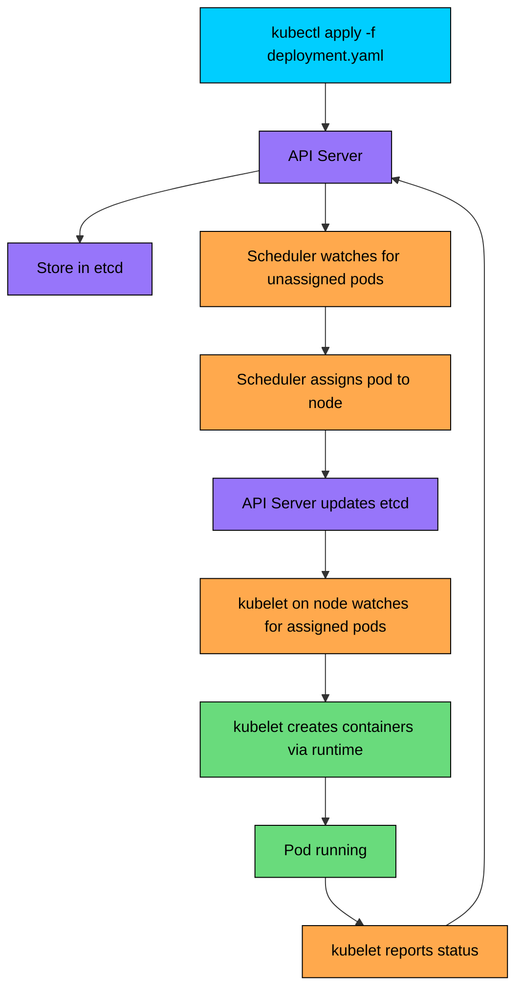

**Step 1:** You run `kubectl apply -f deployment.yaml`. kubectl sends the Deployment specification to the API server.

**Step 2:** The API server validates the request, checking syntax and permissions, then stores the Deployment object in etcd.

**Step 3:** The Deployment controller (running in the controller manager) notices a new Deployment. It creates a ReplicaSet based on the Deployment specification.

**Step 4:** The ReplicaSet controller notices the new ReplicaSet and sees it needs 3 pods but 0 exist. It creates 3 pod objects (but they are not yet running, just specifications in etcd).

**Step 5:** The scheduler notices pods without assigned nodes. For each pod, it evaluates available nodes, considering resource requirements, affinity rules, and constraints. It assigns each pod to a node.

**Step 6:** The kubelet on each assigned node watches for pods assigned to it. When it sees a new pod, it tells the container runtime to pull the image and start the containers.

**Step 7:** The pod starts running. The kubelet continuously monitors container health and reports status back to the API server.

**The Reconciliation Loop:**

This pattern of watching for changes and reconciling state is central to Kubernetes. Controllers run in continuous loops:

```mermaid
flowchart LR
    A[Observe<br/>Current State]:::primary --> B[Compare to<br/>Desired State]:::orange
    B --> C{Match"}:::purple
    C -->|No| D[Take Action<br/>to Fix]:::green
    C -->|Yes| E[Wait and<br/>Watch]:::primary
    D --> A
    E --> A

    classDef primary fill:#00ceff,stroke:#000,color:#000
    classDef orange fill:#ffa94d,stroke:#000,color:#000
    classDef purple fill:#9775fa,stroke:#000,color:#000
    classDef green fill:#69db7c,stroke:#000,color:#000
```

If you specify 3 replicas but only 2 are running (maybe one crashed), the controller notices the mismatch and creates a new pod. If you scale to 5 replicas, the controller sees 3 exist but 5 are desired, and creates 2 more. This is why Kubernetes is self-healing: controllers constantly work to make reality match your declared intent.

### 2.5 Declarative vs Imperative

Kubernetes supports two approaches to managing resources, but one is strongly preferred in production.

**Imperative approach (tell Kubernetes what to do):**

With imperative commands, you tell Kubernetes exactly what action to take. This works for quick experiments but has problems: you cannot version control a sequence of commands, you cannot easily reproduce the same state, and there is no audit trail of what changed.

**Declarative approach (tell Kubernetes what you want):**

With the declarative approach, you describe the desired end state in a YAML file. Kubernetes figures out what changes are needed to reach that state. If nginx already has 3 replicas, nothing happens. If it has 2, one more is created. If it has 5, two are terminated.

**Declarative is the standard for production** because:

- YAML files can be version controlled in Git
- You can reproduce the same state in any environment
- Changes are reviewable in pull requests
- GitOps workflows become possible (Git as the source of truth)
- You can see exactly what is deployed without running commands

**Explaining the declarative model in interviews:**

"Kubernetes uses a declarative model where you define the desired state, and controllers continuously work to make reality match that state. This is different from imperative systems where you issue commands like 'start 3 instances.'

When I create a Deployment with 3 replicas, I am not telling Kubernetes to start 3 pods. I am declaring that 3 pods should exist. The ReplicaSet controller watches for any gap between desired and actual state. If a pod crashes and only 2 exist, the controller creates a replacement. If I change the replica count to 5, it creates 2 more.

This reconciliation loop is why Kubernetes is self-healing. It does not just run your initial command and forget. It continuously ensures reality matches your intent."

---

# 3. Core Concepts: Pods, Deployments, Services

Now that we understand the architecture, let us look at the core abstractions you will work with daily. These are the building blocks: Pods run your containers, Deployments manage pod replicas, and Services provide stable network endpoints. Understanding how they fit together is essential for designing Kubernetes-based systems.

### 3.1 Pods

A Pod is the smallest deployable unit in Kubernetes. You do not deploy containers directly. You deploy pods, and pods contain containers.

Most pods contain a single container, but pods can hold multiple containers that need to work closely together. Containers in the same pod share the same network namespace (they can communicate via localhost) and can share storage volumes.

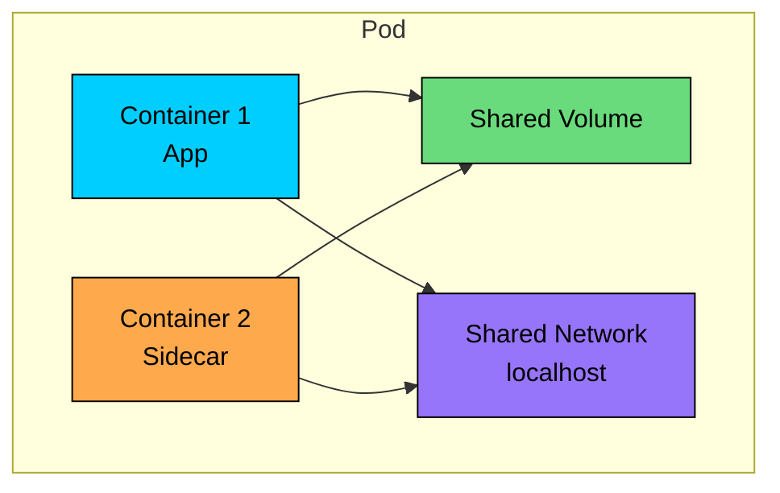

**Why pods exist:**

You might wonder why Kubernetes does not just manage containers directly. Pods exist because some containers need to be co-located and share resources. A web application might need a sidecar container that collects logs. A service mesh proxy might run alongside your application. These containers need to share the same network and storage, which pods provide.

**Key characteristics:**

- Containers in a pod share the same IP address. From the network perspective, the pod is the addressable unit.
- Containers within a pod communicate via localhost. They are like processes on the same machine.
- Pods are ephemeral. They can be created, destroyed, and recreated. Never rely on a specific pod IP address. Use Services instead.
- Most pods contain one container. The multi-container pattern is for specific use cases like sidecars.

**Pod YAML:**

**Common sidecar patterns:**

| Pattern | Description |
|---------|-------------|
| Logging | Collects and forwards logs |
| Proxy | Handles network traffic (service mesh) |
| Adapter | Transforms data for external systems |
| Init container | Runs setup tasks before main container |

### 3.2 ReplicaSets

A ReplicaSet ensures a specified number of pod replicas are running at any time.

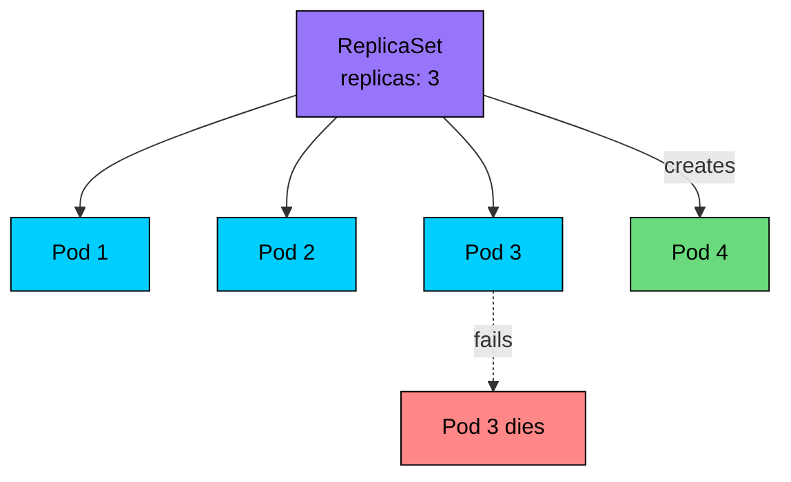

**You rarely create ReplicaSets directly.** Use Deployments instead.

### 3.3 Deployments

A Deployment provides declarative updates for Pods and ReplicaSets. It is the most common way to deploy applications.

**Deployment features:**

- Manages ReplicaSets automatically
- Rolling updates and rollbacks
- Scaling up/down
- Pause and resume deployments

### 3.4 Services

A Service provides a stable endpoint to access a set of Pods. Pods are ephemeral, but Services provide consistent discovery.

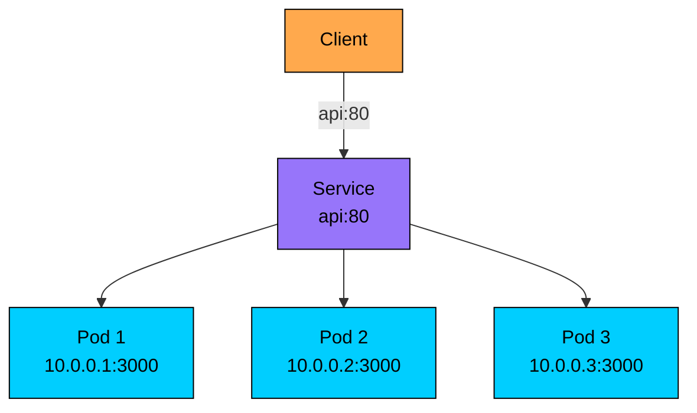

**Service YAML:**

**Service types:**

| Type | Description | Use Case |
|------|-------------|----------|
| ClusterIP | Internal cluster IP (default) | Internal services |
| NodePort | Exposes on each node's IP at static port | Development, simple external access |
| LoadBalancer | Provisions cloud load balancer | Production external access |
| ExternalName | Maps to external DNS | External service reference |

### 3.5 Labels and Selectors

Labels are key-value pairs attached to objects. Selectors query objects by labels.

**Common label patterns:**

| Label | Purpose |
|-------|---------|
| app | Application name |
| version | Version identifier |
| environment | dev, staging, production |
| team | Owning team |
| tier | frontend, backend, database |

### 3.6 Namespaces

Namespaces provide logical isolation within a cluster. Think of them as virtual clusters that share the same physical infrastructure but are isolated from each other.

**Built-in namespaces:**

- `default`: Where objects go if you do not specify a namespace
- `kube-system`: Kubernetes system components (API server, scheduler, etc.)
- `kube-public`: Conventionally for publicly accessible data
- `kube-node-lease`: Node heartbeat data for node health detection

**Why use namespaces:**

Namespaces help organize resources and enforce boundaries:

- **Environment separation:** Run dev, staging, and production in the same cluster with different namespaces
- **Team isolation:** Each team gets their own namespace with their own resources
- **Resource quotas:** Limit CPU, memory, and object count per namespace to prevent one team from consuming all cluster resources
- **Network policies:** Apply network isolation rules at the namespace level

---

# 4. Networking

Networking in Kubernetes can seem complex, but it follows clear principles. Understanding how pods communicate, how services provide discovery, and how external traffic reaches your applications helps you design systems and debug issues.

### 4.1 Networking Model

Unlike traditional environments where network isolation is the default, Kubernetes assumes a flat network. Every pod can communicate with every other pod without NAT. This simplifies application design but requires proper network policies for security.

1. All pods can communicate with all other pods without NAT
2. All nodes can communicate with all pods without NAT
3. The IP that a pod sees itself as is the same IP others see it as

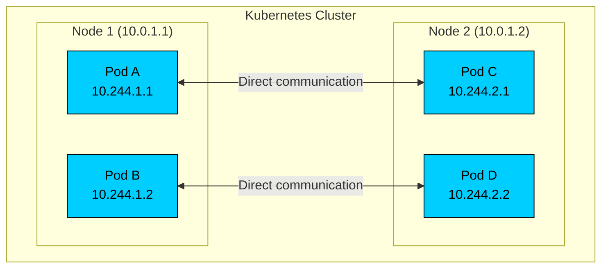

### 4.2 Pod-to-Pod Communication

Pods get unique IP addresses from the cluster's pod CIDR range.

**Same node:** Pods communicate via the virtual bridge (cbr0).

**Different nodes:** Network plugin (CNI) handles routing between nodes.

**Common CNI plugins:**

| Plugin | Description |
|--------|-------------|
| Calico | Network policies, BGP routing |
| Flannel | Simple overlay network |
| Cilium | eBPF-based, advanced security |
| Weave | Mesh network, encryption |
| AWS VPC CNI | Native AWS networking |

### 4.3 Service Discovery

Kubernetes provides built-in DNS for service discovery.

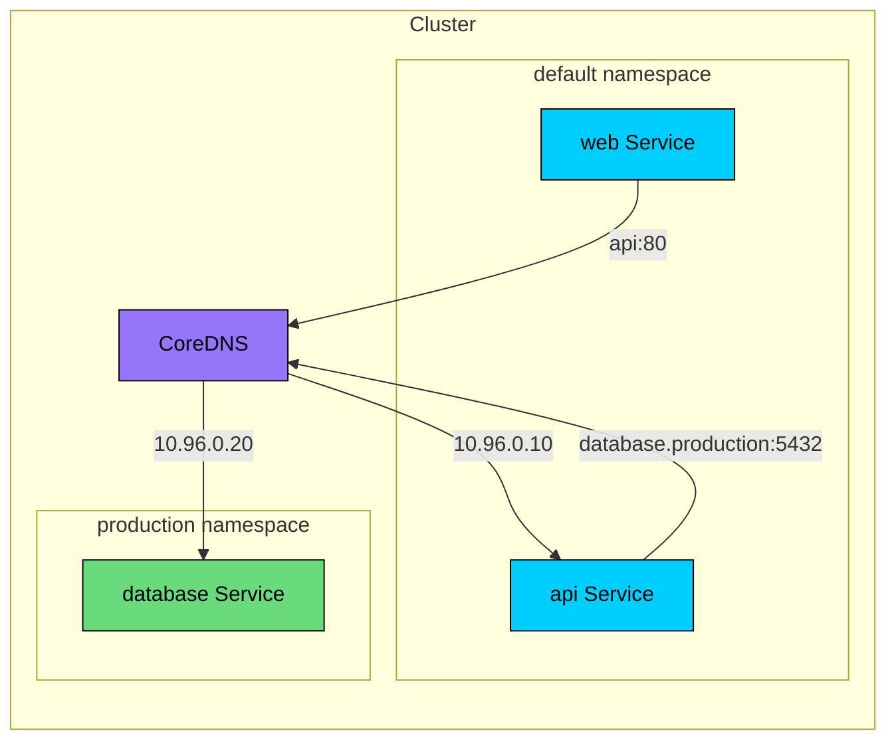

### 4.4 Ingress

Ingress manages external access to services, typically HTTP/HTTPS.

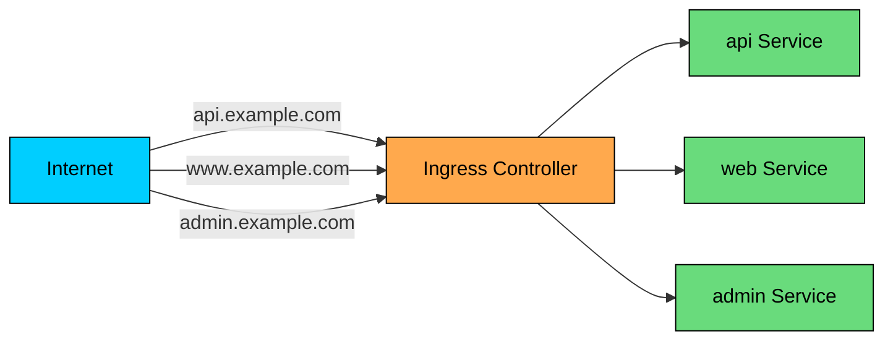

**Ingress YAML:**

**Ingress controllers:**

- NGINX Ingress Controller
- AWS ALB Ingress Controller
- Traefik
- HAProxy
- Istio Gateway

### 4.5 Network Policies

Network Policies control traffic flow between pods (like a firewall).

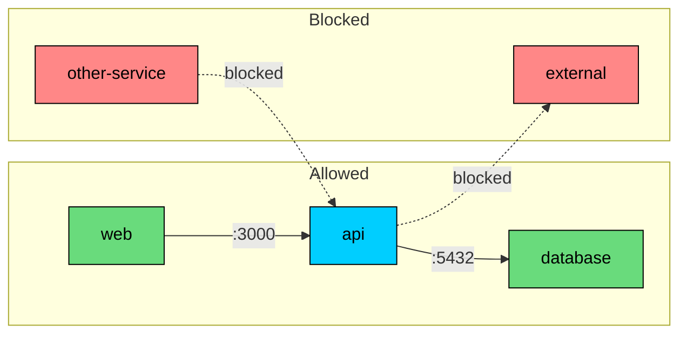

**Default behavior:** All pods can communicate with all pods (no isolation).

**With NetworkPolicy:** Only explicitly allowed traffic is permitted.

### 4.6 Service Mesh

For complex microservices, a service mesh provides advanced networking features.

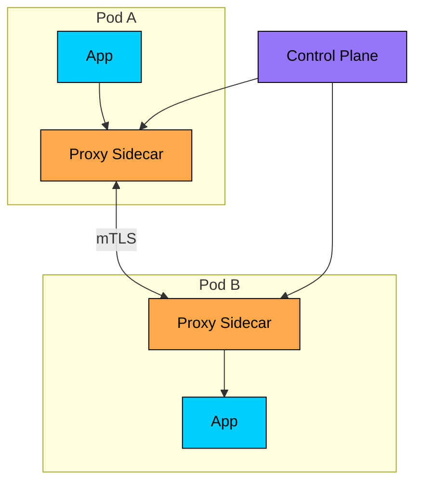

**Service mesh features:**

- Mutual TLS (mTLS) encryption
- Traffic management (canary, A/B testing)
- Observability (metrics, tracing)
- Retries and circuit breakers

**Popular service meshes:**

- Istio (feature-rich but complex)
- Linkerd (lightweight, simpler)
- Consul Connect (HashiCorp ecosystem)

---

# 5. Storage

Pods are ephemeral. When a pod dies, any data inside its containers is lost. For stateless applications, this is fine. For databases, caches that need persistence, or any application that stores data, we need storage that outlives pods.

Kubernetes provides abstractions that separate "I need 100GB of fast storage" from "Here is a specific disk on a specific machine." This abstraction allows portable applications and dynamic provisioning.

### 5.1 Storage Concepts

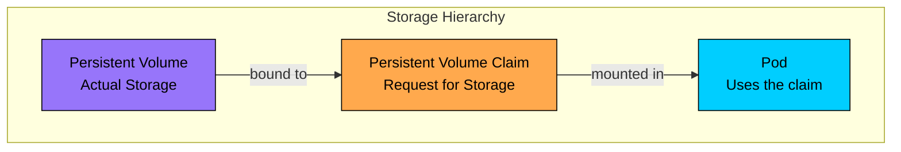

**Persistent Volume (PV):** A piece of storage in the cluster provisioned by an administrator or dynamically.

**Persistent Volume Claim (PVC):** A request for storage by a user. Pods use PVCs to request storage.

**Storage Class:** Defines types of storage available (fast SSD, slow HDD, etc.) for dynamic provisioning.

### 5.2 Persistent Volumes and Claims

**PersistentVolume:**

**PersistentVolumeClaim:**

**Pod using PVC:**

### 5.3 Access Modes

| Mode | Abbreviation | Description |
|------|--------------|-------------|
| ReadWriteOnce | RWO | Single node read-write |
| ReadOnlyMany | ROX | Multiple nodes read-only |
| ReadWriteMany | RWX | Multiple nodes read-write |
| ReadWriteOncePod | RWOP | Single pod read-write (K8s 1.22+) |

### 5.4 Storage Classes

Storage Classes enable dynamic provisioning. When a PVC requests storage, Kubernetes automatically creates the PV.

**Reclaim policies:**

- `Retain`: Keep the volume after PVC deletion (manual cleanup)
- `Delete`: Delete the volume when PVC is deleted
- `Recycle`: Basic scrub (deprecated)

### 5.5 StatefulSets

StatefulSets manage stateful applications with stable identities and persistent storage.

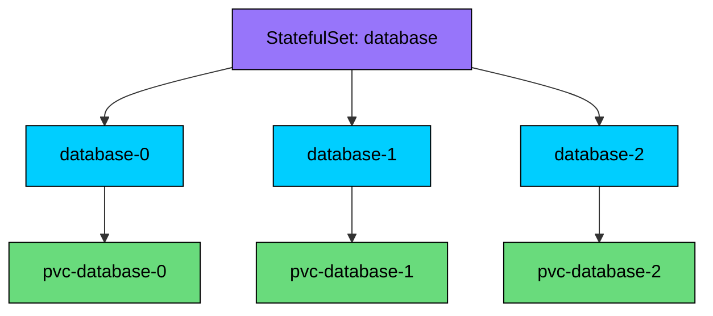

**StatefulSet guarantees:**

- Stable, unique network identifiers (database-0, database-1)
- Stable, persistent storage per pod
- Ordered, graceful deployment and scaling
- Ordered, automated rolling updates

**When to use StatefulSet:**

- Databases (PostgreSQL, MySQL, MongoDB)
- Message queues (Kafka, RabbitMQ)
- Distributed systems requiring stable identity (Elasticsearch, ZooKeeper)

**StatefulSet vs managed services:**

Before using StatefulSets for databases, consider whether a managed service is more appropriate. StatefulSets give you control but require you to handle backups, failover, and recovery. Managed databases like RDS, Cloud SQL, or Atlas handle these operationally complex tasks. For most teams, the operational simplicity of managed services outweighs the control of running your own.

### 5.6 ConfigMaps and Secrets as Volumes

Configuration often needs to be mounted as files that your application reads.

---

# 6. Scaling and Auto-scaling

One of Kubernetes' most powerful features is its ability to automatically scale applications based on demand. Instead of provisioning for peak load and wasting resources during quiet periods, you can let Kubernetes add capacity when needed and remove it when not.

Kubernetes provides scaling at multiple levels: scaling pods within a deployment, scaling resources within a pod, and scaling the nodes themselves. Understanding how these work together helps you design cost-effective, responsive systems.

### 6.1 Manual Scaling

The simplest form of scaling is manual. You decide when to scale and by how much.

### 6.2 Horizontal Pod Autoscaler (HPA)

HPA automatically scales pods based on observed metrics.

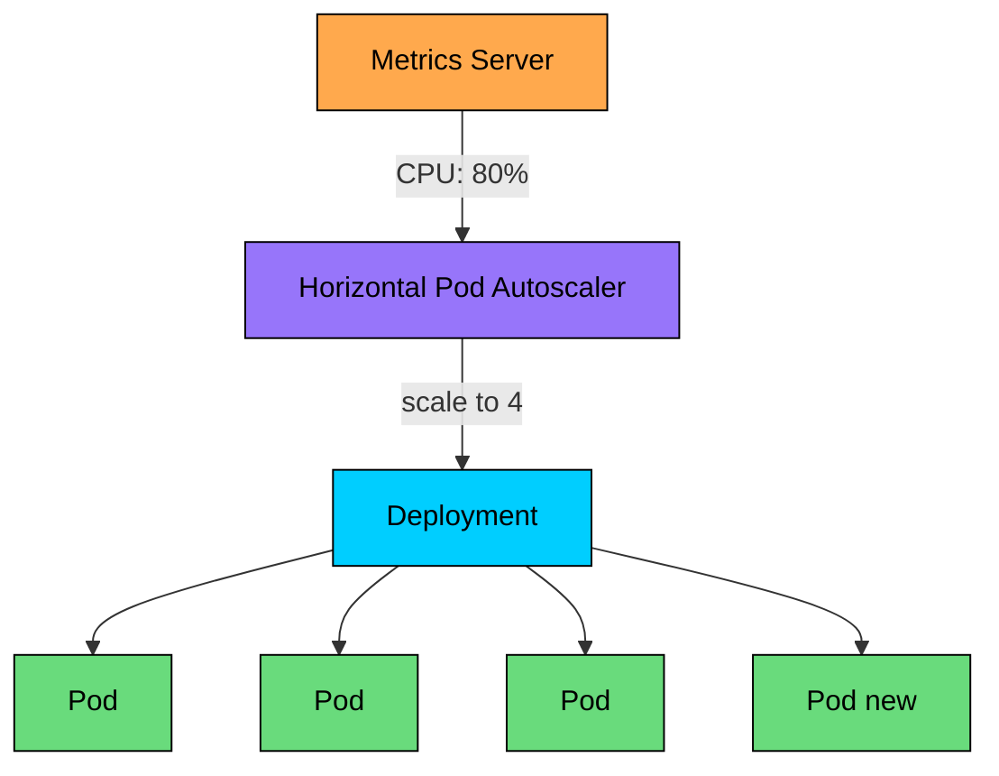

**HPA YAML:**

**Key settings:**

- `minReplicas`: Never scale below this
- `maxReplicas`: Never scale above this
- `averageUtilization`: Target percentage
- `stabilizationWindowSeconds`: Prevent thrashing

### 6.3 Custom Metrics

Scale based on custom metrics from Prometheus or other sources.

**Common custom metrics:**

- Requests per second
- Queue depth
- Connection count
- Custom business metrics

### 6.4 Vertical Pod Autoscaler (VPA)

VPA automatically adjusts CPU and memory requests/limits.

**VPA modes:**

- `Off`: Only recommendations
- `Initial`: Apply only at pod creation
- `Auto`: Apply recommendations (recreates pods)

**Note:** VPA and HPA should not target the same metric.

### 6.5 Cluster Autoscaler

Cluster Autoscaler adjusts the number of nodes in the cluster.

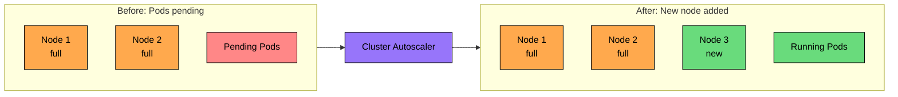

**How it works:**

1. Pods cannot be scheduled due to insufficient resources
2. Cluster Autoscaler detects pending pods
3. Adds nodes from cloud provider
4. Pods get scheduled on new nodes
5. Removes underutilized nodes when load decreases

### 6.6 Scaling Strategy Summary

| Mechanism | What it scales | Based on |
|-----------|----------------|----------|
| Manual | Pods | Operator decision |
| HPA | Pods | CPU, memory, custom metrics |
| VPA | Pod resources | Resource usage analysis |
| Cluster Autoscaler | Nodes | Pending pods, node utilization |

```mermaid
flowchart TD
    A[Traffic increase]:::primary
    A --> B{Pods at limit"}
    B -->|No| C[HPA scales pods]:::green
    B -->|Yes| D{Node resources available"}
    D -->|Yes| C
    D -->|No| E[Cluster Autoscaler adds nodes]:::orange
    E --> C

    classDef primary fill:#00ceff,stroke:#000,color:#000
    classDef orange fill:#ffa94d,stroke:#000,color:#000
    classDef green fill:#69db7c,stroke:#000,color:#000
```

---

# 7. Deployments and Rollouts

Deploying new versions of your application is one of the riskiest operations in production. A bug in the new version can affect all users. A slow rollout wastes time. Kubernetes provides deployment strategies that balance safety and speed, allowing zero-downtime updates with automatic rollback if things go wrong.

### 7.1 Rolling Update Strategy

The default strategy gradually replaces old pods with new ones. At no point are all pods unavailable, and if something goes wrong, you can stop the rollout before it affects all instances.

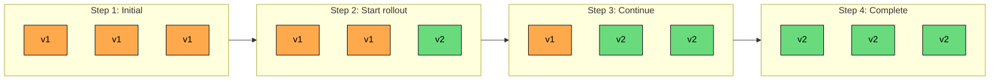

**Configuration:**

**Settings explained:**

- `maxSurge: 25%` allows 4 pods during update of 3-replica deployment
- `maxUnavailable: 25%` ensures at least 75% capacity during update

### 7.2 Recreate Strategy

Terminate all existing pods before creating new ones.

**Use when:**

- Application cannot run multiple versions simultaneously
- Database migrations require exclusive access
- Testing/development environments where downtime is acceptable

### 7.3 Deployment Commands

### 7.4 Health Checks

Health checks ensure only healthy pods receive traffic.

| Probe | Purpose | Failure Action |
|-------|---------|----------------|
| Readiness | Is pod ready to receive traffic" | Remove from Service endpoints |
| Liveness | Is pod healthy" | Restart container |
| Startup | Has pod started" | Prevent liveness checks until ready |

### 7.5 Canary Deployments

Deploy new version to a subset of users to validate before full rollout.

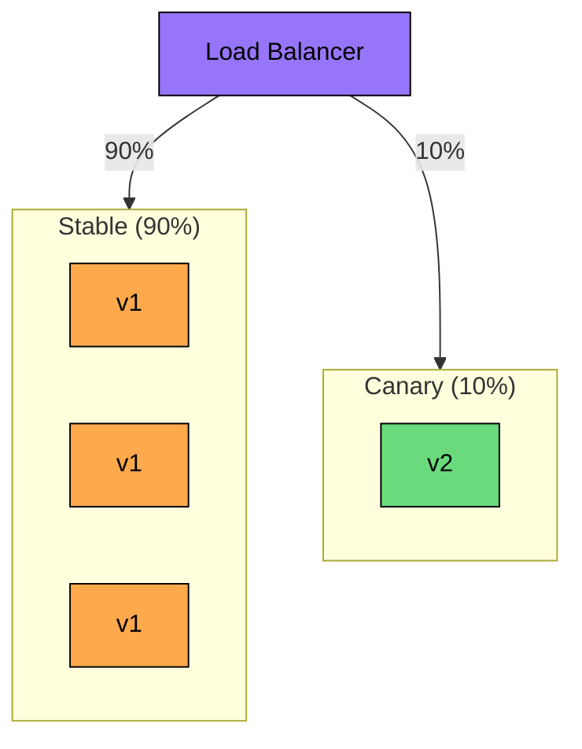

**Implementation approaches:**

- **Multiple Deployments:**

- **Service mesh (Istio):**

### 7.6 Blue-Green Deployments

Run two identical environments, switch traffic instantly.

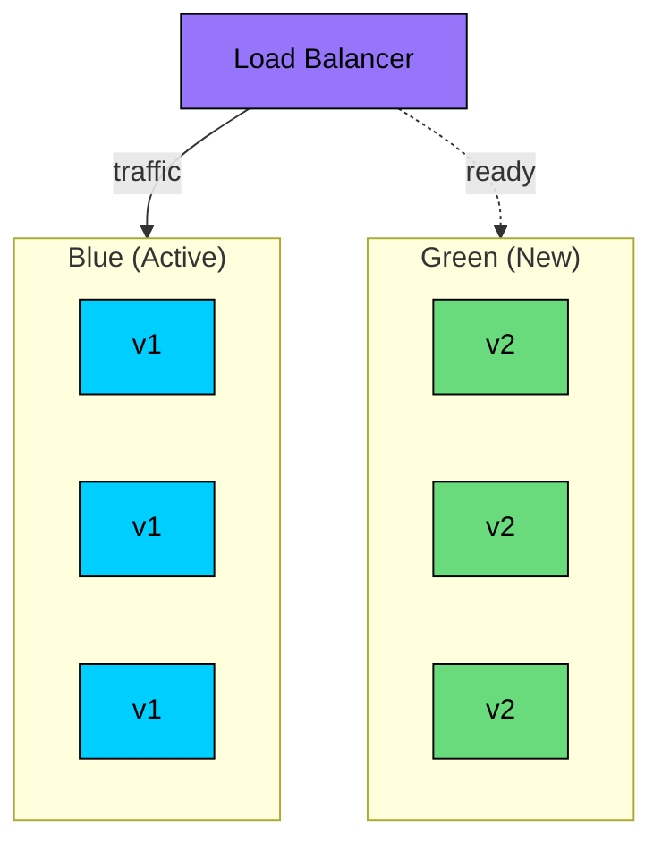

**Implementation:**

**Switching:** Update Service selector from `version: blue` to `version: green`.

---

# 8. Configuration and Secrets

Good practice separates configuration from code. Database URLs, feature flags, and API endpoints should not be hardcoded. Kubernetes provides ConfigMaps and Secrets to inject configuration into pods without rebuilding images.

This separation means the same container image can run in development, staging, and production with different configurations. It also means you can change configuration without redeploying the application.

### 8.1 ConfigMaps

ConfigMaps store non-sensitive configuration data as key-value pairs or entire files.

**Using ConfigMaps:**

### 8.2 Secrets

Store sensitive data (passwords, tokens, keys). Base64 encoded (not encrypted by default).

**Using Secrets:**

### 8.3 Secret Types

| Type | Purpose |
|------|---------|
| Opaque | Generic secrets (default) |
| kubernetes.io/service-account-token | Service account token |
| kubernetes.io/dockerconfigjson | Docker registry credentials |
| kubernetes.io/tls | TLS certificate and key |
| kubernetes.io/basic-auth | Username and password |

### 8.4 Secret Management Best Practices

```mermaid
flowchart TD
    subgraph Bad["Bad Practice"]
        B1[Secrets in YAML files]:::red
        B2[Secrets in Git]:::red
        B3[Unencrypted etcd]:::red
    end

    subgraph Good["Good Practice"]
        G1[External secret manager]:::green
        G2[Encrypted at rest]:::green
        G3[RBAC restrictions]:::green
    end

    classDef red fill:#ff8787,stroke:#000,color:#000
    classDef green fill:#69db7c,stroke:#000,color:#000
```

**Best practices:**

- **Enable encryption at rest:**

- **Use external secret managers:**
   - AWS Secrets Manager
   - HashiCorp Vault
   - Azure Key Vault
   - Google Secret Manager
- **External Secrets Operator:**

### 8.5 Configuration Updates

**ConfigMap/Secret updates:**

- Environment variables: Requires pod restart
- Volume mounts: Updated automatically (kubelet sync period)

**Force update:**

**Immutable ConfigMaps/Secrets:**

Benefits of immutable:

- Prevents accidental changes
- Better performance (no watches)
- Requires new name for updates (forces deployment)

---

# 9. Kubernetes in Production

Running Kubernetes in development is straightforward. Running it in production is where the complexity appears. You need to manage resources carefully, implement proper security, monitor everything, ensure high availability, and establish reliable deployment practices.

This section covers the production considerations that separate a playground cluster from one serving real traffic.

### 9.1 Resource Management

Resource management is one of the most important aspects of running Kubernetes well. Without it, a single misbehaving pod can starve others. Always set resource requests and limits.

**Requests vs Limits:**

- **Requests:** Guaranteed resources, used for scheduling
- **Limits:** Maximum resources, exceeded = throttled (CPU) or killed (memory)

**Quality of Service (QoS) classes:**

| Class | Criteria | Behavior |
|-------|----------|----------|
| Guaranteed | requests = limits for all containers | Highest priority |
| Burstable | requests < limits | Medium priority |
| BestEffort | No requests or limits | First to be evicted |

### 9.2 Resource Quotas

Limit resource consumption per namespace.

### 9.3 Security

**Pod Security:**

**RBAC (Role-Based Access Control):**

### 9.4 Observability

```mermaid
flowchart LR
    subgraph Cluster
        P1[Pod]:::primary
        P2[Pod]:::primary
        P3[Pod]:::primary
    end

    subgraph Observability["Observability Stack"]
        M[Metrics<br/>Prometheus]:::orange
        L[Logs<br/>Loki/ELK]:::green
        T[Traces<br/>Jaeger]:::purple
    end

    G[Grafana]:::primary

    P1 --> M
    P2 --> L
    P3 --> T
    M --> G
    L --> G
    T --> G

    classDef primary fill:#00ceff,stroke:#000,color:#000
    classDef orange fill:#ffa94d,stroke:#000,color:#000
    classDef green fill:#69db7c,stroke:#000,color:#000
    classDef purple fill:#9775fa,stroke:#000,color:#000
```

**Three pillars of observability:**

1. **Metrics:** Prometheus + Grafana
   - Node and pod metrics
   - Application metrics
   - Alerting rules
2. **Logs:** Loki, Elasticsearch, or cloud logging
   - Centralized log aggregation
   - Structured logging
   - Log-based alerting
3. **Traces:** Jaeger, Zipkin, or cloud tracing
   - Distributed request tracing
   - Latency analysis
   - Service dependencies

### 9.5 High Availability

**Control plane HA:**

- Multiple API server replicas
- etcd cluster (3 or 5 nodes)
- Multiple scheduler and controller manager (leader election)

**Worker node HA:**

- Multiple nodes across availability zones
- Pod anti-affinity to spread replicas
- PodDisruptionBudget for maintenance

### 9.6 Managed Kubernetes Services

| Provider | Service | Notes |
|----------|---------|-------|
| AWS | EKS | Integrates with AWS services |
| Google Cloud | GKE | Autopilot mode available |
| Azure | AKS | Azure AD integration |
| DigitalOcean | DOKS | Simpler, cost-effective |

**Benefits of managed services:**

- Control plane managed by provider
- Automatic upgrades
- Integrated monitoring and logging
- Easier node management

### 9.7 GitOps

Store desired state in Git, automatically sync to cluster.

```mermaid
flowchart LR
    DEV[Developer]:::primary -->|"push"| GIT[Git Repo]:::orange
    GIT -->|"watch"| ARGO[ArgoCD/Flux]:::purple
    ARGO -->|"sync"| K8S[Kubernetes]:::green

    classDef primary fill:#00ceff,stroke:#000,color:#000
    classDef orange fill:#ffa94d,stroke:#000,color:#000
    classDef purple fill:#9775fa,stroke:#000,color:#000
    classDef green fill:#69db7c,stroke:#000,color:#000
```

**GitOps tools:**

- ArgoCD
- Flux
- Jenkins X

**Benefits:**

- Version controlled infrastructure
- Audit trail of changes
- Easy rollbacks
- Consistent deployments

---

# Summary

Kubernetes has become the standard for running containerized applications at scale. In system design interviews, you will encounter it when discussing microservices architectures, deployment strategies, and high availability. Here are the key points to internalize:

#### **Understand when Kubernetes makes sense**

It excels when you have multiple services that need to scale independently, deploy frequently, and survive failures automatically. But it has significant complexity. For simple applications, managed platforms or even a single server with Docker Compose may be more appropriate. Being able to articulate when Kubernetes is overkill shows maturity.

#### **The declarative model is fundamental**

You define desired state in YAML, and controllers continuously work to make reality match. This reconciliation loop is why Kubernetes self-heals: if a pod crashes, the controller notices the gap between desired and actual replicas and creates a replacement. Understanding this model helps you explain how Kubernetes achieves reliability.

#### **Know the core abstractions and how they connect**

Pods run containers, Deployments manage pod replicas, Services provide stable network endpoints, Ingress routes external traffic. Labels and selectors tie these together. When you describe a Kubernetes design, you should be able to explain this layering.

#### **Networking has sensible defaults but needs security**

Kubernetes provides flat networking where all pods can reach all pods, and built-in DNS for service discovery. But this openness requires Network Policies to enforce least-privilege access in production.

#### **Stateless is simpler than stateful**

Deployments handle stateless workloads elegantly. Stateful workloads need StatefulSets with persistent storage, which adds complexity. For databases, seriously consider managed services that handle the operational burden.

#### **Scaling works at multiple levels**

HPA scales pods based on metrics. Cluster Autoscaler scales nodes based on pending pods. Together they handle traffic spikes automatically while minimizing costs during quiet periods.

#### **Deployment strategies protect users**

Rolling updates provide zero-downtime deployments by default. Readiness probes ensure traffic only reaches healthy pods. Canary deployments limit blast radius for risky changes.

#### **Production requires operational maturity**

Resource limits prevent runaway pods. RBAC controls access. Observability with metrics, logs, and traces enables debugging. GitOps provides audit trails and reliable deployments.

When discussing Kubernetes in interviews, go beyond "we deploy on Kubernetes." Explain your Deployment configuration, how services discover each other, your scaling strategy, and what happens when something fails. This depth demonstrates that you understand Kubernetes as an operational system, not just a deployment target.

---

# References

- [Kubernetes Documentation](https://kubernetes.io/docs/) - Official Kubernetes documentation covering all concepts and APIs
- [Kubernetes in Action](https://www.manning.com/books/kubernetes-in-action-second-edition) - Marko Luksa's comprehensive book on Kubernetes
- [Kubernetes Patterns](https://www.oreilly.com/library/view/kubernetes-patterns/9781492050278/) - Bilgin Ibryam's book on design patterns for Kubernetes
- [The Kubernetes Book](https://www.amazon.com/Kubernetes-Book-Version-January-2024/dp/B0CVCPZ3GH) - Nigel Poulton's practical guide to Kubernetes
- [CNCF Landscape](https://landscape.cncf.io/) - Overview of the cloud-native ecosystem around Kubernetes
- [Kubernetes Failure Stories](https://k8s.af/) - Real-world lessons from Kubernetes incidents

---

# Quiz
