Modern applications need to show users the latest information instantly. When a friend sends you a message, you expect to see it immediately. When a stock price changes, traders need to know within milliseconds. When someone likes your post, the notification should appear right away.

These experiences feel seamless, almost magical. But behind the scenes, they represent one of the trickiest challenges in distributed systems: getting data from the server to the client the instant something changes.

The traditional HTTP model does not help here. A client makes a request, the server responds, and the connection closes. If something changes on the server a millisecond later, the client has no way of knowing. It would have to ask again. And again. And again.

This is the problem of **real-time updates**, and there are four fundamentally different ways to solve it. Each has trade-offs that matter deeply depending on your use case. Choose wrong, and you will either waste enormous resources or deliver a frustrating user experience.

---

# Where This Pattern Shows Up

Real-time updates appear across a wide range of systems:

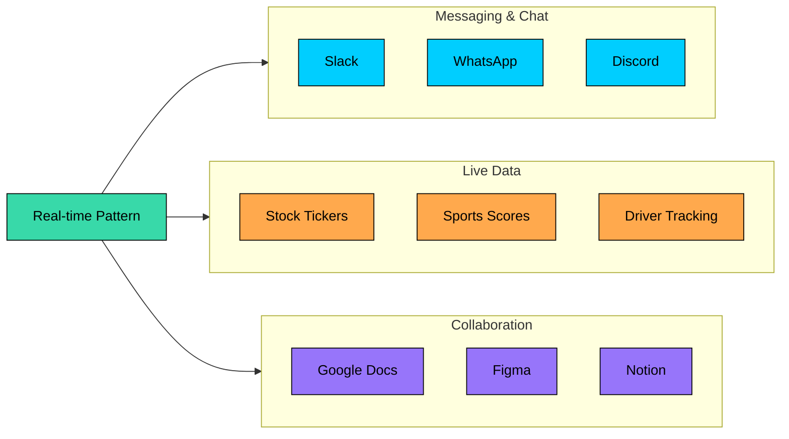

| Problem | Why Real-time Matters |
|---------|----------------------|
| **Design Chat System** | Messages must appear instantly, typing indicators need to feel live |
| **Design Uber/Lyft** | Drivers move continuously, riders need to see position updates every few seconds |
| **Design Trading Platform** | Price movements happen in milliseconds, stale data means lost money |
| **Design Collaborative Editor** | Multiple users editing the same document need to see each other's changes immediately |
| **Design Notification System** | Alerts lose value if they arrive minutes after the triggering event |
| **Design Live Sports App** | Fans expect scores and play-by-play updates as they happen |

The four main approaches to real-time updates form a spectrum:

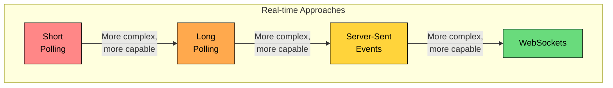

- **Short Polling**: Client repeatedly asks "any updates"" Simple but wasteful.
- **Long Polling**: Server holds the connection open until there is data. More efficient, still HTTP.
- **Server-Sent Events (SSE)**: Server pushes updates over a persistent one-way channel. Built for streaming.
- **WebSockets**: Full two-way communication over a single connection. Most powerful, most complex.

Each approach sits at a different point on the simplicity-vs-capability spectrum. The right choice depends on your specific requirements, and understanding the trade-offs deeply will help you make that decision confidently. Let us walk through each one.

---

# Approach 1: Short Polling

**Short polling** is the simplest approach, and often the first thing that comes to mind. The client asks "anything new"" at regular intervals, and the server responds immediately with whatever it has.

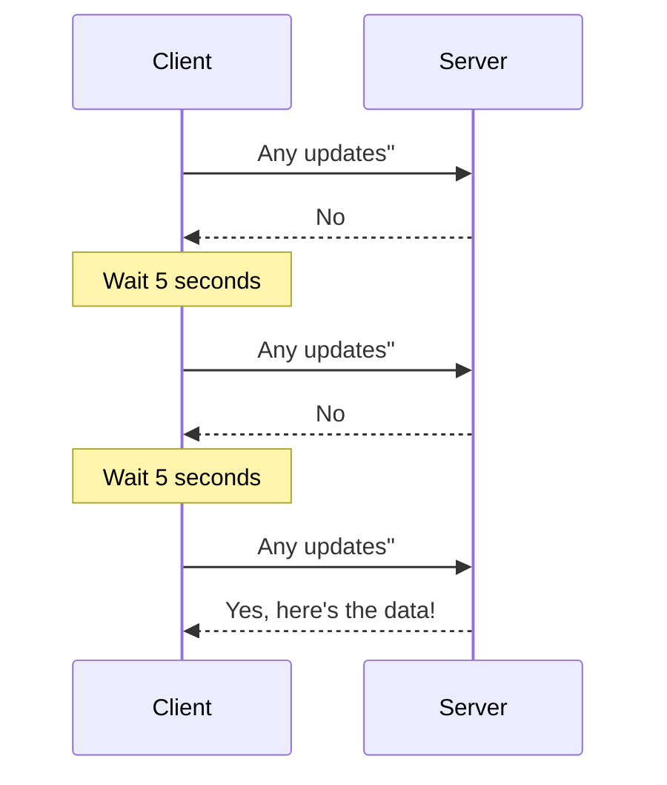

### How It Works

The client sets a timer, say every 5 seconds, and sends an HTTP request when it fires. The server checks for new data and responds immediately, either with updates or an empty response. The client processes any data, waits for the next interval, and repeats.

Think of it like checking your mailbox every morning. Most days there is nothing new, but you check anyway because you do not know when something will arrive. The approach is predictable and easy to reason about, but it does not scale gracefully.

### The Fundamental Trade-off

Short polling forces you into an uncomfortable choice between latency and resource consumption:

| | Poll Every 1 Second | Poll Every 30 Seconds |
|---|---|---|
| **Latency** | Updates arrive quickly | Updates delayed up to 30 seconds |
| **Request Volume** | 3,600 requests/hour per client | 120 requests/hour per client |
| **Server Load** | Server under constant load | Server load manageable |
| **Battery** | High battery drain on mobile | Battery-friendly |

Poll frequently and you get faster updates but hammer your servers. Poll less often and you save resources but users wait longer for new data. There is no middle ground that solves both problems.

The math is unforgiving. With a 5-second polling interval and 1 million connected users, you are looking at 200,000 requests per second, and most of those requests return nothing useful. That is a lot of infrastructure cost for empty responses.

### Pros and Cons

**Advantages:**

- Dead simple to implement, just standard HTTP requests on a timer
- Works everywhere, every browser and every HTTP client supports it
- Stateless on the server side, which makes horizontal scaling straightforward
- Easy to debug because each request-response cycle is independent

**Disadvantages:**

- Most requests return nothing, wasting bandwidth and server resources
- Updates are delayed by half the polling interval on average
- At scale, millions of clients polling creates enormous server load
- Drains mobile batteries with constant network activity

### When Short Polling Makes Sense

Despite its limitations, short polling remains a reasonable choice in specific scenarios:

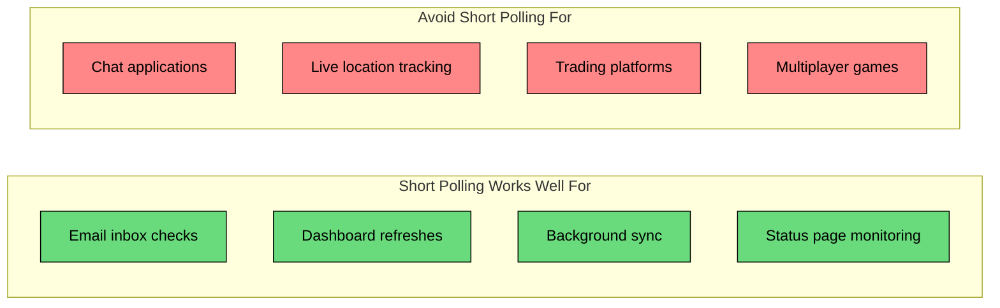

If updates are infrequent and a delay of a few seconds is acceptable, short polling keeps your architecture simple. But if users expect updates to appear instantly, you need something better.

---

# Approach 2: Long Polling

**Long polling** takes the basic polling idea and flips it on its head. Instead of responding immediately with "nothing new," the server holds the connection open and waits until there is actually something to send.

This small change makes a significant difference in how the system behaves.

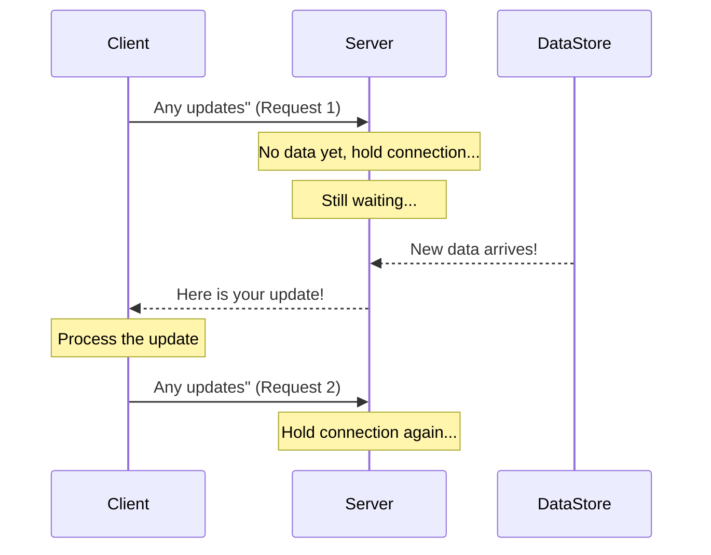

### How It Works

The client sends an HTTP request asking for updates. If the server has new data, it responds immediately. If not, it holds the connection open and waits, typically with a timeout of 30 to 60 seconds.

When new data arrives, the server immediately responds to the waiting request. The client processes the data and immediately opens a new request. This creates a continuous loop where updates arrive as soon as they are available.

The key insight is that instead of the client asking "is there anything new"" over and over, it asks once and waits for the answer. The server only responds when it has something meaningful to say.

### Visualizing the Difference

The contrast with short polling becomes clear when you look at the request patterns side by side:

```shell
Short Polling (30 seconds):
Request → Empty → Wait 5s → Request → Empty → Wait 5s → Request → Data! → ...
   1        2                   3        4                   5        6

Long Polling (30 seconds):
Request → Waiting... → Waiting... → Data! → Request → Waiting...
   1                                  2        3
```

Short polling sends 6 requests in 30 seconds, most returning empty. Long polling sends 2 requests, each returning meaningful data.

### The Server-Side Challenge

The tricky part with long polling is what happens on the server while it waits. You cannot simply have a thread sitting in a loop checking for updates. That would waste CPU and limit how many connections you can handle.

Production implementations rely on event-driven architectures and pub/sub systems:

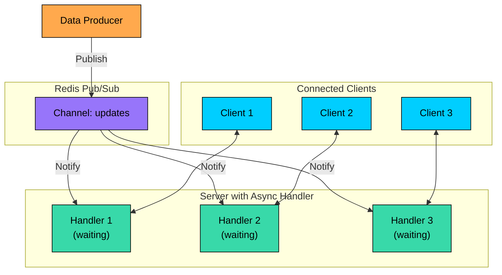

When a request comes in, the handler subscribes to a Redis channel and then yields control. No CPU is consumed while waiting. When new data publishes to the channel, all subscribed handlers wake up instantly and respond to their clients.

### Pros and Cons

**Advantages:**

- Near real-time delivery, updates arrive as soon as they are available
- Far fewer wasted requests compared to short polling
- Works through firewalls and proxies since it is still standard HTTP
- Simpler to implement than WebSockets, no special protocol to learn
- Works with existing HTTP infrastructure like load balancers and CDNs

**Disadvantages:**

- Each waiting client holds a server connection open, which consumes resources
- Requires async server frameworks to handle thousands of concurrent connections efficiently
- After each response, the client must establish a new request, adding latency
- Timeout handling requires careful thought, especially for mobile clients with unstable connections
- Message ordering can be tricky when responses and new requests overlap

### When Long Polling Shines

Long polling occupies a useful middle ground. It delivers near real-time updates while staying within the familiar HTTP paradigm.

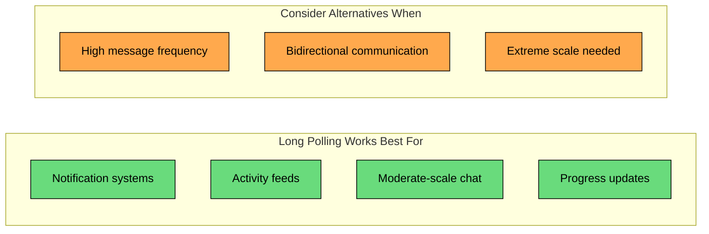

Long polling works well for notification systems, activity feeds, or any application that needs real-time updates but does not require the client to send frequent messages. It is a solid stepping stone before committing to the complexity of WebSockets.

---

# Approach 3: Server-Sent Events (SSE)

**Server-Sent Events** represent a fundamentally different approach. Instead of the client asking for updates repeatedly, it opens a single long-lived connection and the server pushes data through it whenever something changes.

This is closer to how we intuitively think about real-time: the server notifies you when something happens rather than you asking "has anything changed"" over and over.

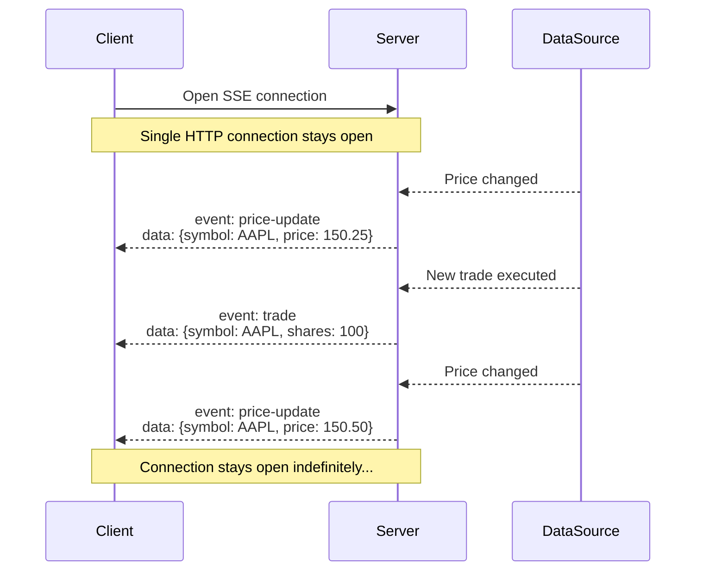

### How It Works

The client opens a connection using the browser's built-in EventSource API. The server responds with a special content type (`text/event-stream`) and keeps the connection open. From that point on, the server can push events at any time. The client registers handlers for different event types and processes them as they arrive.

The beauty of SSE is how little code you need on the client side. The browser handles the connection management, reconnection logic, and event parsing. You just listen for events.

### The Event Format

SSE uses a dead-simple text-based protocol. Each message is a series of field-value pairs separated by newlines:

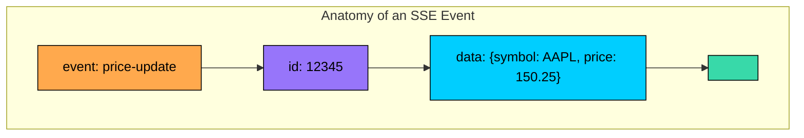

| Field | Purpose |
|-------|---------|
| `event` | Names the event type so clients can route to specific handlers |
| `id` | Unique identifier for resumption after disconnection |
| `data` | The actual payload, usually JSON |
| `retry` | Tells the client how long to wait before reconnecting |

The text-based format makes SSE easy to debug. You can see exactly what the server is sending by watching network traffic.

### Automatic Reconnection

What makes SSE genuinely powerful is its built-in reconnection handling. When the connection drops, whether from network issues, server restarts, or anything else, the browser automatically attempts to reconnect.

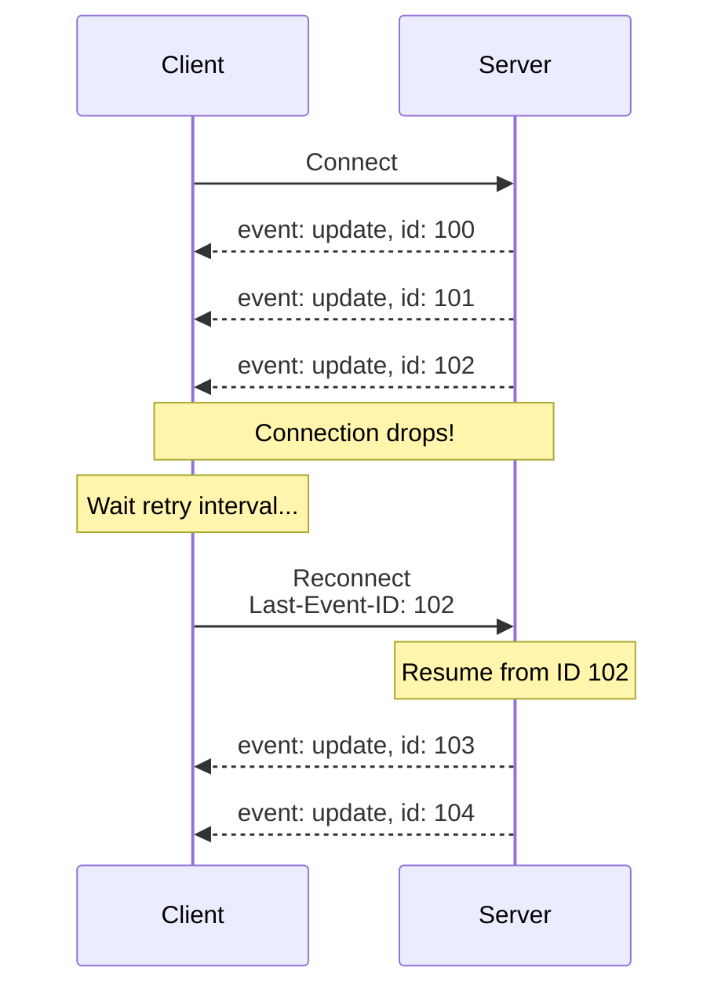

The browser sends the `Last-Event-ID` header when reconnecting, allowing the server to resume from where it left off. You get reliable delivery with zero client-side reconnection code. This is functionality you would have to build yourself with WebSockets.

### Pros and Cons

**Advantages:**

- Native browser support through the EventSource API, minimal client code needed
- Automatic reconnection and message resumption built into the protocol
- Text-based format makes debugging straightforward
- Works seamlessly with existing HTTP infrastructure, load balancers, and proxies
- Lighter weight than WebSockets, both in protocol complexity and server resources

**Disadvantages:**

- One-way only, the server can push to the client but not vice versa
- Browsers limit connections per domain to around 6, which can be problematic in HTTP/1.1
- Text-only protocol, binary data requires Base64 encoding which adds overhead
- No support in older browsers like Internet Explorer, though polyfills exist

### SSE vs Long Polling

At first glance, SSE and long polling seem similar since both involve holding connections open. But there is a crucial difference:

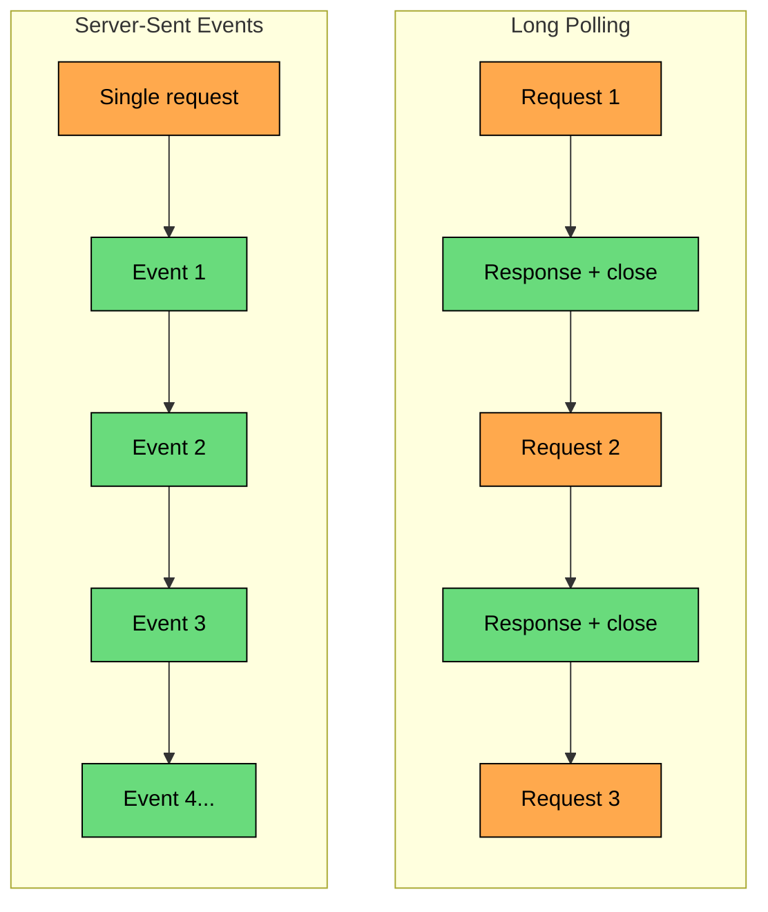

Long polling creates a new HTTP request for each update. SSE streams multiple updates over a single connection. This makes SSE more efficient for high-frequency updates and eliminates the gap between responses where messages could be missed.

### When SSE Shines

SSE excels when data flows primarily from server to client:

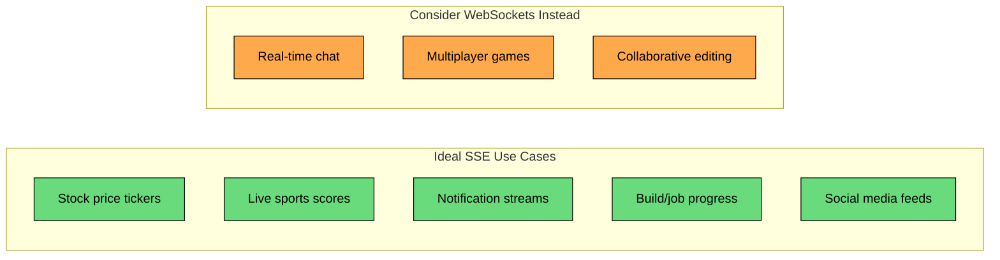

If the client rarely needs to send data, or when it does a simple HTTP POST suffices, SSE gives you real-time push with less complexity than WebSockets. Many teams default to WebSockets when SSE would serve them better.

---

# Approach 4: WebSockets

**WebSockets** are the most powerful option. They provide true bidirectional communication where both client and server can send messages at any time over a single persistent connection.

While SSE gives you server-to-client push, WebSockets give you a full two-way channel. This opens up possibilities that are difficult or impossible with the other approaches.

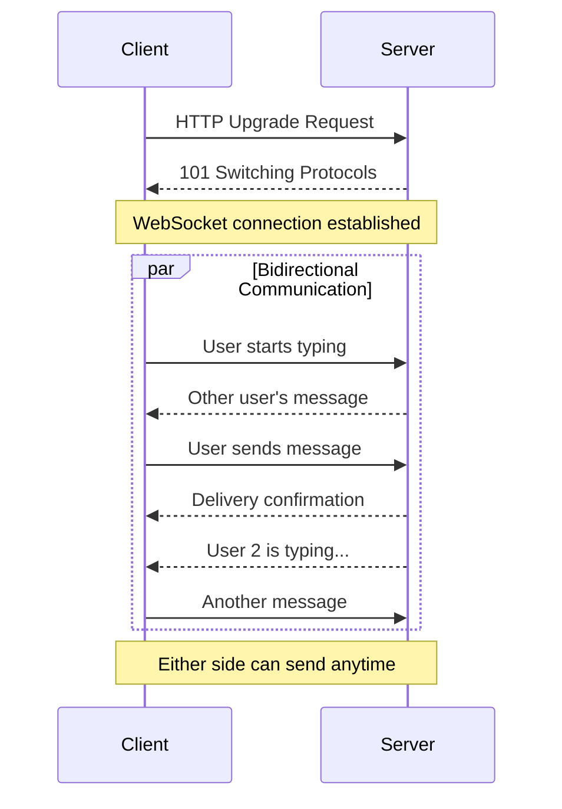

### How It Works

The connection begins life as an HTTP request. The client sends an upgrade request asking to switch protocols. If the server agrees, it responds with "101 Switching Protocols" and from that moment on, both sides speak WebSocket instead of HTTP.

Once established, either side can send messages whenever they want. There is no request-response pattern anymore. The client can send while the server is sending. Messages flow in both directions simultaneously. This is true full-duplex communication.

### The Protocol Upgrade

The transition from HTTP to WebSocket happens through a handshake:

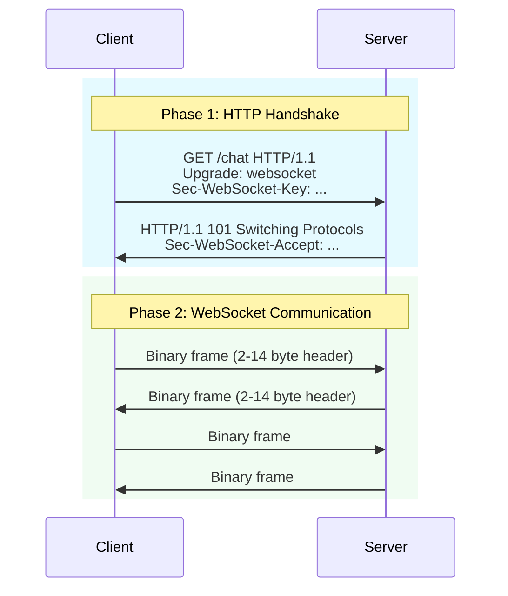

After the handshake, messages are exchanged as WebSocket frames. Unlike HTTP, which has verbose headers for every request, WebSocket frames have tiny headers of just 2 to 14 bytes. This makes WebSockets dramatically more efficient for high-frequency messaging.

### Why WebSockets Are Different

The fundamental difference between WebSockets and everything else is the communication model:

| Aspect | HTTP-based Approaches | WebSocket |
|--------|----------------------|-----------|
| **Initiation** | Client initiates every exchange | Either side can initiate |
| **Pattern** | Request/Response | No request/response pattern |
| **Connection** | Opens and closes | Stays open |
| **Overhead** | Headers on every message | Minimal per-message overhead (2-14 bytes) |

With HTTP, every exchange starts with the client. Even with SSE, the client opens the connection and the server responds. With WebSockets, the server can send a message to the client at any time without any prior request. This enables patterns like typing indicators, presence updates, and real-time collaboration that would be awkward with HTTP.

### The Scaling Challenge

WebSockets introduce a scaling complexity that does not exist with stateless HTTP. Each client maintains a persistent connection to a specific server. This creates an interesting problem: what happens when Client A, connected to Server 1, wants to send a message to Client B, who is connected to Server 2"

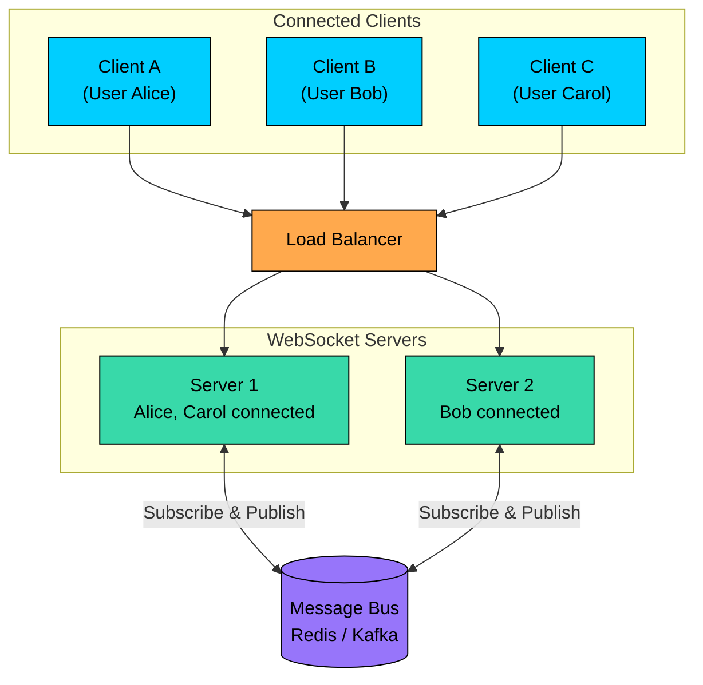

The standard solution is a pub/sub layer. When Alice sends a message, Server 1 publishes it to a shared message bus like Redis or Kafka. Server 2 subscribes to relevant channels and forwards incoming messages to Bob. Every server acts as both publisher and subscriber, routing messages to whichever clients happen to be connected to it.

This architecture works, but it adds operational complexity. You need to manage the message bus, handle its failure modes, and design your channel structure thoughtfully.

### Connection State Management

Another challenge with WebSockets is managing connection state. With HTTP, each request is independent. With WebSockets, you need to track which users are connected to which servers.

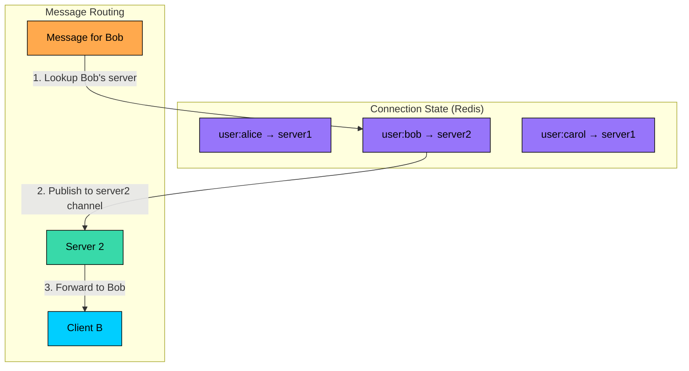

You need to handle what happens when a server crashes, when clients reconnect to different servers, and when the connection registry gets out of sync with reality. These are solvable problems, but they require careful design.

### Pros and Cons

**Advantages:**

- True bidirectional communication, either side can send at any time
- Lowest latency with minimal per-message overhead
- Efficient binary framing reduces bandwidth usage
- Ideal for high-frequency, interactive applications

**Disadvantages:**

- More complex than HTTP-based approaches to implement and operate
- Scaling requires additional infrastructure like message buses
- Stateful connections are inherently harder to manage than stateless HTTP
- Some corporate proxies and firewalls block WebSocket traffic
- No automatic reconnection, you must implement it yourself
- Debugging is harder since you cannot simply inspect request/response pairs

### When WebSockets Are Worth the Complexity

WebSockets make sense when you genuinely need bidirectional, high-frequency communication. Before reaching for them, ask yourself: does the client really need to send messages frequently, or could SSE with occasional HTTP POSTs work"

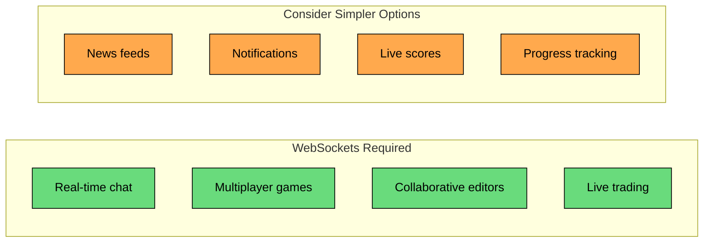

Chat applications, multiplayer games, collaborative editing, and live trading platforms genuinely benefit from WebSockets. For notification systems, live feeds, or progress updates, SSE is usually simpler and sufficient.

---

# Comparing All Four Approaches

Now that we have examined each approach in detail, let us put them side by side to see how they compare across different dimensions.

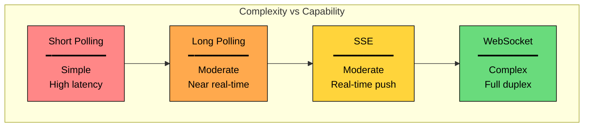

| Aspect | Short Polling | Long Polling | SSE | WebSocket |
|--------|--------------|--------------|-----|-----------|
| **Communication** | Client → Server | Client → Server | Server → Client | Bidirectional |
| **Latency** | High (polling interval) | Low (instant on data) | Low | Lowest |
| **Connection overhead** | New connection each poll | New connection each response | Single persistent | Single persistent |
| **Server complexity** | Simplest | Moderate | Moderate | Highest |
| **Scaling complexity** | Easy (stateless) | Medium | Medium | Hard (stateful) |
| **Reconnection** | Not needed | Manual | Automatic | Manual |
| **Browser support** | Universal | Universal | Modern browsers | Modern browsers |
| **Firewall friendly** | Yes | Yes | Yes | Sometimes blocked |
| **Binary data** | Via encoding | Via encoding | Via encoding | Native support |

---

# Choosing the Right Approach

The decision tree for selecting an approach is surprisingly straightforward once you understand the trade-offs:

```mermaid
flowchart TD
    START["What does your<br/>application need""]:::primary

    Q1{"Real-time updates<br/>required""}:::orange
    Q2{"Client sends<br/>frequent messages""}:::orange
    Q3{"High message<br/>frequency""}:::orange

    SP["Short Polling"]:::red
    LP["Long Polling"]:::yellow
    SSE["Server-Sent Events"]:::green
    SSEHTTP["SSE + HTTP POST"]:::green
    WS["WebSockets"]:::purple

    START --> Q1
    Q1 -->|"No, seconds of delay OK"| SP
    Q1 -->|"Yes"| Q2
    Q2 -->|"No, server push only"| SSE
    Q2 -->|"Rarely"| SSEHTTP
    Q2 -->|"Yes, frequently"| Q3
    Q3 -->|"Moderate"| LP
    Q3 -->|"High"| WS

    classDef primary fill:#00ceff,stroke:#000,color:#000
    classDef orange fill:#ffa94d,stroke:#000,color:#000
    classDef red fill:#ff8787,stroke:#000,color:#000
    classDef yellow fill:#ffd43b,stroke:#000,color:#000
    classDef green fill:#69db7c,stroke:#000,color:#000
    classDef purple fill:#9775fa,stroke:#000,color:#000
```

The key questions to ask:

1. **Does the client need to receive updates in real-time"** If a few seconds of delay is acceptable, short polling is the simplest solution.
2. **Does the client need to send messages frequently"** If data flows primarily from server to client, SSE is simpler than WebSockets and handles most use cases well.
3. **How frequently do messages flow"** For high-frequency bidirectional communication, WebSockets are worth the complexity. For occasional messages, SSE with HTTP POSTs or long polling works fine.

### Recommendations by Use Case

| Use Case | Recommended Approach | Why |
|----------|---------------------|-----|
| Email inbox updates | Short polling | Updates every minute is fine, simplicity wins |
| Dashboard metrics | Short polling or SSE | Depends on freshness requirements |
| Notification system | SSE | Server push, built-in reconnection |
| Activity feed | SSE | Continuous stream of updates, one direction |
| Stock price ticker | SSE | High-frequency server push |
| Live sports scores | SSE | Real-time server push |
| Build/CI progress | SSE | Progress updates flow one way |
| Basic chat | Long polling or SSE + POST | Works for moderate scale |
| Real-time chat | WebSocket | Typing indicators, read receipts, high frequency |
| Multiplayer games | WebSocket | Low latency bidirectional required |
| Collaborative editing | WebSocket | Continuous bidirectional sync |
| Live trading | WebSocket | Every millisecond matters |

---

# Implementation Best Practices

Regardless of which approach you choose, certain problems appear in every real-time system. Handling them well separates robust production systems from fragile prototypes.

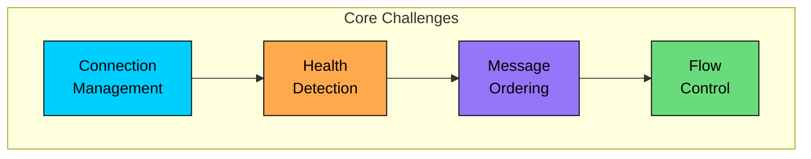

### Reconnection with Exponential Backoff

Connections will drop. Mobile users switch between WiFi and cellular. Servers restart for deployments. Network equipment fails. Your system must handle disconnection gracefully.

The standard approach is exponential backoff with jitter:

```mermaid
flowchart LR
    subgraph Backoff["Reconnection Strategy"]
        direction TB
        F1["Attempt 1: wait 1s"]:::green
        F2["Attempt 2: wait 2s"]:::green
        F3["Attempt 3: wait 4s"]:::yellow
        F4["Attempt 4: wait 8s"]:::yellow
        F5["Attempt 5: wait 16s"]:::orange
        F6["Attempt 6+: wait 30s (cap)"]:::red
    end

    F1 --> F2 --> F3 --> F4 --> F5 --> F6

    classDef green fill:#69db7c,stroke:#000,color:#000
    classDef yellow fill:#ffd43b,stroke:#000,color:#000
    classDef orange fill:#ffa94d,stroke:#000,color:#000
    classDef red fill:#ff8787,stroke:#000,color:#000
```

Start with a short delay (1 second), double it on each failure, and cap at a reasonable maximum (30 seconds). Add random jitter to prevent thundering herd problems when many clients reconnect simultaneously after a server restart. Reset the delay counter after a successful connection.

### Heartbeats for Connection Health

A quiet connection and a dead connection look identical from the network perspective. Without active probing, you cannot tell if the other side is still there.

```mermaid
sequenceDiagram
    participant Client
    participant Server

    Note over Client,Server: Connection established
    Client->>Server: Message
    Server-->>Client: Response

    Note over Client,Server: 30 seconds of silence...

    Client->>Server: PING
    Server-->>Client: PONG

    Note over Client,Server: 30 more seconds...

    Client->>Server: PING
    Note over Server: Server crashed!

    Note over Client: No PONG received...
    Note over Client: Timeout! Reconnect.
```

Send periodic pings, every 30 seconds is a reasonable default, and expect a response within a timeout window. If no response arrives, assume the connection is dead and initiate reconnection. This catches scenarios like server crashes, network partitions, and zombie connections that TCP keepalives might miss.

### Message Ordering and Deduplication

In distributed systems, messages can arrive out of order or be delivered multiple times. This is especially common after reconnections when the client might request a replay of recent messages.

```mermaid
flowchart TB
    subgraph MessageHandling["Handling Out-of-Order Messages"]
        direction TB
        M["Incoming message<br/>seq: 105"]:::primary
        CHECK{"Last seen:<br/>seq 102"}:::orange
        BUFFER["Buffer until<br/>103, 104 arrive"]:::yellow
        DELIVER["Deliver in order:<br/>103, 104, 105"]:::green
    end

    M --> CHECK
    CHECK -->|"Gap detected"| BUFFER
    BUFFER --> DELIVER

    classDef primary fill:#00ceff,stroke:#000,color:#000
    classDef orange fill:#ffa94d,stroke:#000,color:#000
    classDef yellow fill:#ffd43b,stroke:#000,color:#000
    classDef green fill:#69db7c,stroke:#000,color:#000
```

Assign sequence numbers or unique IDs to messages. Track the last processed ID on the client. Buffer out-of-order messages until gaps are filled. Detect and discard duplicates. For SSE, the built-in event ID mechanism handles much of this automatically.

### Backpressure and Flow Control

Sometimes clients cannot keep up with the rate of incoming messages. A mobile device on a slow connection, a browser tab in the background, or a client doing expensive processing can all fall behind.

```mermaid
flowchart LR
    subgraph Backpressure["Handling Slow Clients"]
        direction LR
        FAST["Server generating<br/>100 msgs/sec"]:::primary
        SLOW["Client processing<br/>10 msgs/sec"]:::red
        BUFFER["Send buffer<br/>growing..."]:::orange
        CHOICES["Options"]:::yellow
    end

    FAST --> BUFFER
    SLOW --> BUFFER
    BUFFER --> CHOICES

    subgraph Options["What to Do"]
        direction LR
        O1["Drop low-priority<br/>messages"]:::green
        O2["Aggregate/batch<br/>updates"]:::green
        O3["Disconnect slow<br/>client"]:::red
    end

    CHOICES --> Options

    classDef primary fill:#00ceff,stroke:#000,color:#000
    classDef red fill:#ff8787,stroke:#000,color:#000
    classDef orange fill:#ffa94d,stroke:#000,color:#000
    classDef yellow fill:#ffd43b,stroke:#000,color:#000
    classDef green fill:#69db7c,stroke:#000,color:#000
```

Monitor send buffer sizes. When a client falls behind, you have choices: drop non-critical messages, aggregate multiple updates into one, or disconnect the client entirely. The right choice depends on your use case. A stock ticker might drop intermediate price updates and send only the latest. A chat application might need to deliver every message and should disconnect clients that fall too far behind.

### Compression for High-Volume Connections

For connections that carry significant data volume, per-message compression can reduce bandwidth substantially. WebSocket supports the `permessage-deflate` extension, which compresses each message individually. Most WebSocket libraries support this with a configuration flag.

The trade-off is CPU usage for compression and decompression. For text-heavy payloads like JSON, compression typically reduces size by 60-80%. For already-compressed data like images, it provides little benefit. Enable it selectively based on your payload characteristics.

---

# Key Takeaways

Real-time updates have become table stakes for modern applications. Users expect immediate feedback, whether they are chatting with friends, tracking a delivery, or monitoring a build pipeline.

The four approaches we covered form a progression from simple to sophisticated:

```mermaid
flowchart LR
    subgraph Summary["Summary of Approaches"]
        direction LR
        SP["Short Polling<br/>━━━━━━━━━━<br/>Start here if<br/>slight delays OK"]:::red
        LP["Long Polling<br/>━━━━━━━━━━<br/>Need real-time<br/>stick with HTTP"]:::orange
        SSE["SSE<br/>━━━━━━━━━━<br/>Server push only<br/>built-in reliability"]:::yellow
        WS["WebSockets<br/>━━━━━━━━━━<br/>Full bidirectional<br/>high frequency"]:::green
    end

    SP --> LP --> SSE --> WS

    classDef red fill:#ff8787,stroke:#000,color:#000
    classDef orange fill:#ffa94d,stroke:#000,color:#000
    classDef yellow fill:#ffd43b,stroke:#000,color:#000
    classDef green fill:#69db7c,stroke:#000,color:#000
```

#### **Key principles to remember:**

1. **Start simple.** If short polling meets your requirements, use it. The simplest solution that works is often the best solution.
2. **SSE is underrated.** Many teams reach for WebSockets when SSE would serve them better. If data flows primarily from server to client, SSE is simpler and gives you automatic reconnection for free.
3. **WebSockets are powerful but complex.** Reserve them for cases that genuinely need bidirectional, high-frequency communication. The scaling and operational complexity is real.
4. **Plan for failure.** Connections will drop. Implement reconnection with exponential backoff, heartbeats for health detection, and message ordering for reliability.
5. **Match the tool to the problem.** A notification system and a multiplayer game have fundamentally different requirements. Do not use the same solution for both just because you are familiar with it.

The best approach is the one that solves your problem with the least complexity. Start with simpler solutions and evolve only when you have evidence that you need more capability.

---

# References

- [MDN Web Docs: WebSockets API](https://developer.mozilla.org/en-US/docs/Web/API/WebSockets_API)
- [MDN Web Docs: Server-Sent Events](https://developer.mozilla.org/en-US/docs/Web/API/Server-sent_events)
- [RFC 6455: The WebSocket Protocol](https://datatracker.ietf.org/doc/html/rfc6455)
- [High Performance Browser Networking - WebSocket](https://hpbn.co/websocket/)
- [Martin Kleppmann: Designing Data-Intensive Applications](https://dataintensive.net/)

---

# Quiz
