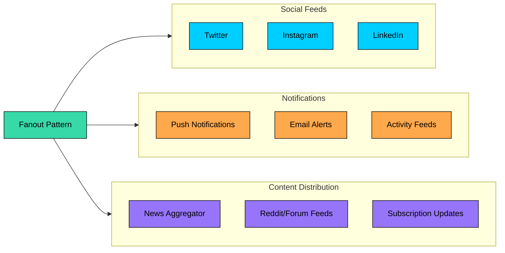
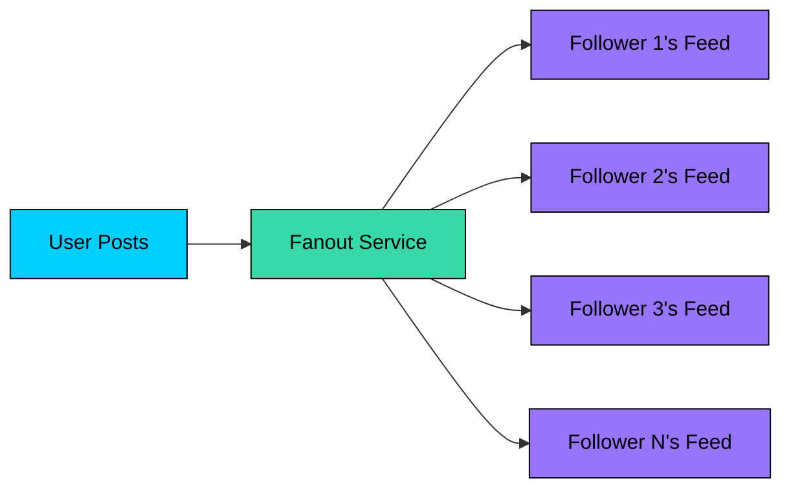
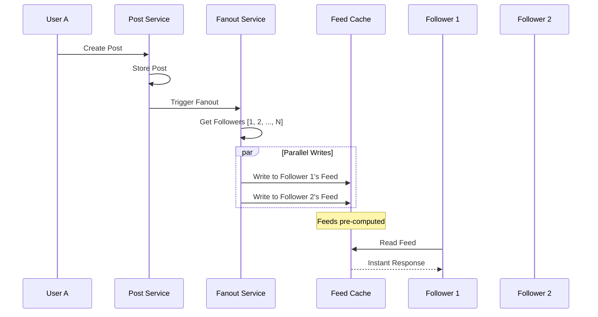
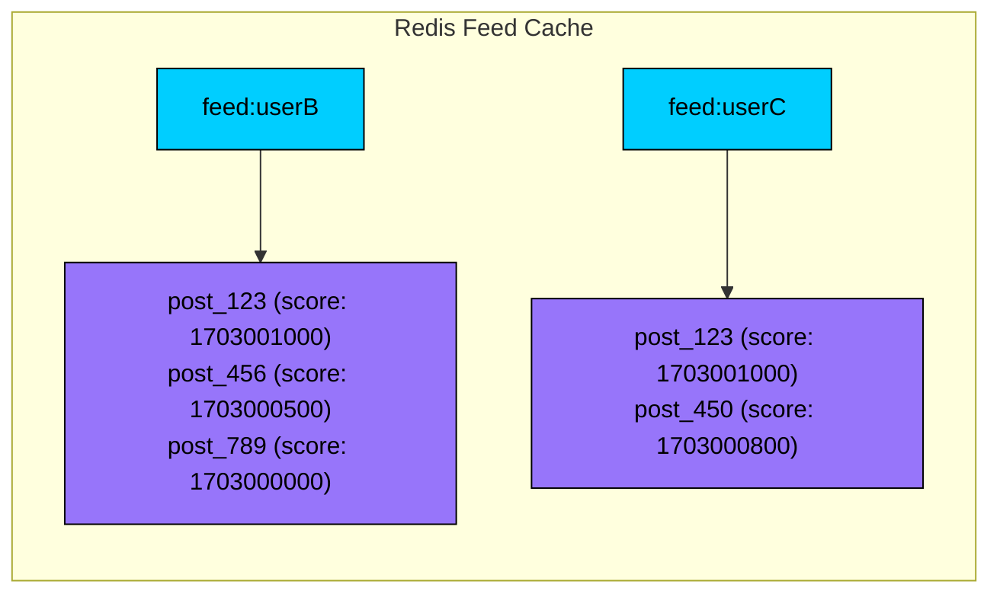
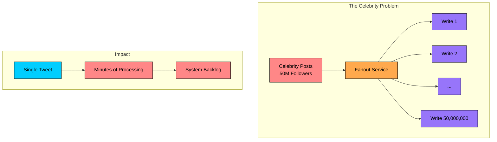
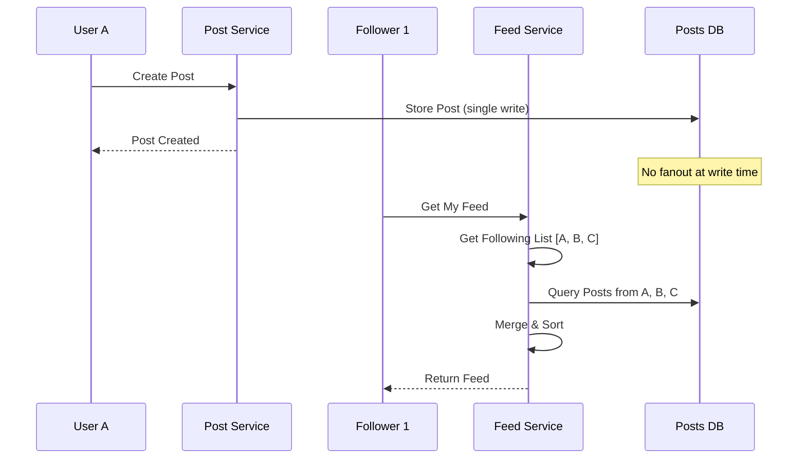
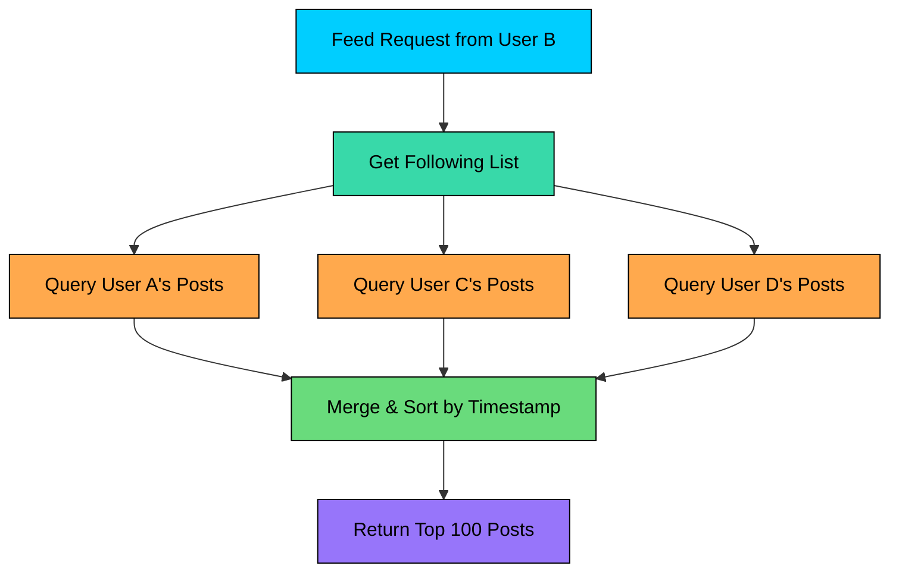
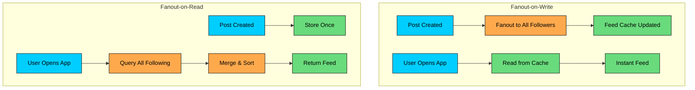
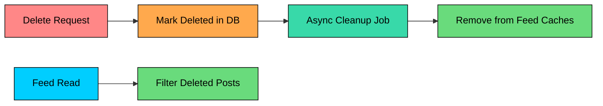
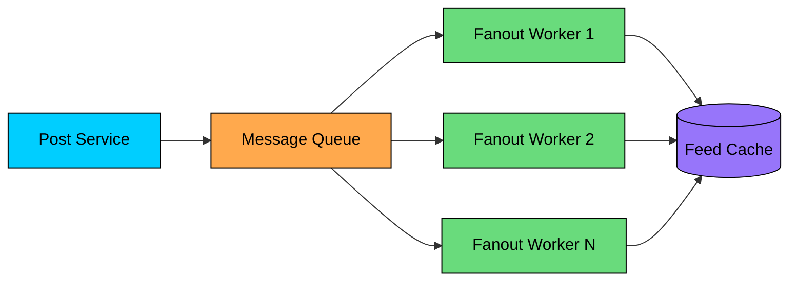

Fanout (sometimes called **fan-out on write** or **fan-out on read**) is the pattern you reach for when **one event needs to reach many recipients**—fast, reliably, and at scale.

Picture a single user posting “Hello world” on a social app. That’s one write. But the moment it happens, thousands (or millions) of people might need to see it in their feeds, get a push notification, update counters, refresh recommendations, and trigger analytics. 

The system’s real work isn’t storing the post, it’s **expanding that one input into many outputs** without melting down.

The **fanout pattern** solves this problem. It's a fundamental technique for distributing data from one source to many destinations, and it powers some of the most demanding systems in tech: **Twitter's timeline**, **Facebook's news feed**, **LinkedIn's activity feed**, and **notification systems** at scale.

---

### Where This Pattern Applies

> [!PAYWALL] This content is for premium members only.

You'll encounter fanout in many system design interview problems:



| Problem | Why Fanout Matters |
|---------|-------------------|
| **Design Twitter/Instagram** | Delivering posts to millions of followers |
| **Design Notification System** | Broadcasting alerts to subscribed users |
| **Design News Feed** | Aggregating content from followed sources |
| **Design Activity Feed** | Showing actions from connections |
| **Design Reddit/Forum** | Distributing posts to subscribers |

Understanding fanout helps you answer the fundamental question these systems face: when a user creates content, how do you get it to everyone who should see it"

---

# 1. What is Fanout"

**Fanout** is a messaging pattern where a single message gets delivered to multiple recipients.

The term comes from electronics, where "fan-out" describes how many inputs a single output can drive. In distributed systems, it refers to the ratio of writes generated per incoming write operation.



When a user with 1000 followers posts an update, one write (the post) triggers 1000 writes (one to each follower's feed). That's a **fanout ratio of 1:1000**.

This amplification is what makes fanout both powerful and challenging. A single celebrity tweet can trigger millions of writes. So the key question becomes: **when** should this fanout happen"

There are two main approaches, and choosing between them shapes your entire system architecture.

---

# 2. Fanout-on-Write (Push Model)

The first approach is **fanout-on-write**, where we pre-compute and store data for all recipients the moment content is created. Think of it as "push" - you're pushing the content to everyone who needs it right away.

### How It Works

When User A creates a post, the system immediately looks up all of A's followers and writes the post reference to each follower's pre-computed feed cache. Later, when followers open their app, their feed is already waiting for them.



### Implementation Example

### Data Structures

The feed cache typically lives in Redis or a similar in-memory store. Each user gets a sorted set keyed by their user ID, containing post IDs ordered by timestamp:



Redis sorted sets work well here because they give you O(log N) insertion and O(log N + M) range queries, so fetching the top 100 posts is fast regardless of how many total posts exist in the feed.

### Advantages

This approach shines at read time:

- **Fast reads**: The feed is pre-computed. Just read from cache and you're done.
- **Predictable latency**: Read latency stays consistent regardless of how many people a user follows.
- **Simple read path**: No complex aggregation logic when users open their feed.
- **Great for read-heavy systems**: Most social apps see 100x more reads than writes, so optimizing reads makes sense.

### Disadvantages

The problems show up at write time:

- **Slow writes**: You have to fanout to all followers before confirming the post is published.
- **Wasted work**: You're pre-computing feeds for users who might never log in.
- **Storage overhead**: The same post_id gets stored in millions of feed caches.

But the biggest issue is the **celebrity problem**:



When a celebrity with 50 million followers posts a tweet, the system needs to perform 50 million writes. This creates massive write amplification that can overwhelm your infrastructure and delay other users' posts.

This limitation led engineers to explore the opposite approach.

---

# 3. Fanout-on-Read (Pull Model)

The second approach flips the model entirely. In **fanout-on-read**, we compute the feed dynamically when a user requests it. Think of it as "pull" - the user pulls their feed together on demand.

### How It Works

When a user creates a post, we simply store it once. No fanout happens. Later, when a follower opens their feed, the system queries posts from everyone they follow and merges the results in real-time.



### Implementation Example

### Query Pattern

A naive implementation might use a single SQL query:

But this gets slow when a user follows thousands of accounts. In practice, systems break this into parallel queries and merge the results:



### Advantages

This approach shines at write time:

- **Fast writes**: Single write, instant confirmation. No fanout delay.
- **No wasted work**: Only compute feeds for users who actually request them.
- **No celebrity problem**: Celebrity posts are stored once, regardless of follower count.
- **Lower storage**: No duplicate post references across millions of feed caches.

### Disadvantages

The problems show up at read time:

- **Slow reads**: Every feed request triggers multiple database queries plus a merge operation.
- **Variable latency**: Users following many accounts experience slower feeds.
- **Complex read path**: Aggregation logic runs on every single feed view.
- **High read load**: Popular times of day can overwhelm your database.

For read-heavy applications like social media (where users refresh their feed far more often than they post), these read-time costs add up quickly.

---

# 4. Comparison: Write vs Read

Let's put these two approaches side by side:



| Aspect | Fanout-on-Write | Fanout-on-Read |
|--------|-----------------|----------------|
| **Write latency** | High (N writes per post) | Low (1 write per post) |
| **Read latency** | Low (single cache read) | High (N queries + merge) |
| **Storage cost** | High (duplicate references) | Low (single storage) |
| **Compute cost** | At write time | At read time |
| **Best for** | Read-heavy, uniform follower counts | Write-heavy, high follower variance |
| **Celebrity problem** | Severe | None |
| **Stale data risk** | Can be stale if fanout delayed | Always fresh |

The key insight: **you're choosing when to pay the cost of distribution**.

Fanout-on-write pays at write time and benefits at read time. Fanout-on-read does the opposite. Neither approach is perfect for all scenarios, which is why production systems rarely use just one.

---

# 5. The Hybrid Approach

Real-world systems like Twitter and Facebook don't pick one approach. They combine both strategies based on user characteristics.

### The Core Idea

The insight is simple: most users have a small number of followers, but a few users have millions. Treat them differently:

- **Regular users** (< 10K followers): Use fanout-on-write
- **Celebrity users** (> 10K followers): Use fanout-on-read

This gives you the best of both worlds. Celebrities don't trigger massive fanouts that clog your system. Regular users still get instant feed loads.

### How It Works

```mermaid
flowchart TD
    P[New Post]:::primary --> C{Celebrity"}:::orange

    C -->|No: < 10K followers| FOW[Fanout-on-Write]:::green
    FOW --> FC[Write to Follower Caches]:::green

    C -->|Yes: > 10K followers| FOR[Store Only]:::purple
    FOR --> DB[(Posts DB)]:::purple

    R[Feed Request]:::primary --> M[Merge]:::secondary
    FC --> M
    DB --> M
    M --> F[Final Feed]:::green

    classDef primary fill:#00ceff,stroke:#000,color:#000
    classDef secondary fill:#38d9a9,stroke:#000,color:#000
    classDef orange fill:#ffa94d,stroke:#000,color:#000
    classDef green fill:#69db7c,stroke:#000,color:#000
    classDef purple fill:#9775fa,stroke:#000,color:#000
```

### Feed Generation in Hybrid Model

When a user requests their feed:

1. **Read from pre-computed cache** (contains posts from regular users they follow)
2. **Query celebrity posts** (from users they follow who are marked as celebrities)
3. **Merge both sources** by timestamp
4. **Return combined feed**

### Threshold Selection

How do you decide who counts as a celebrity" There's no universal answer. Common thresholds range from 10K to 100K followers, but the right number depends on your system:

- **System capacity**: What's your fanout service throughput"
- **Posting frequency**: High-frequency posters might need a lower threshold.
- **Active followers**: A user with 50K followers where only 1K are active is different from one where 40K are active.

The threshold should be tunable. Start conservative and adjust based on observed system load.

### Implementation Considerations

You'll need to track which users are celebrities. A simple approach adds a flag to your user table:

```mermaid
flowchart LR
    subgraph Users["User Table"]
        direction TB
        U1["user_A | 15M followers | celebrity=true"]:::red
        U2["user_B | 500 followers | celebrity=false"]:::green
        U3["user_C | 50K followers | celebrity=true"]:::red
    end

    subgraph Flow["Post Creation Flow"]
        direction TB
        P[New Post] --> C{Is Author<br/>Celebrity"}
        C -->|No| FO[Fanout to Followers]:::green
        C -->|Yes| SO[Store Only]:::orange
    end

    classDef green fill:#69db7c,stroke:#000,color:#000
    classDef red fill:#ff8787,stroke:#000,color:#000
    classDef orange fill:#ffa94d,stroke:#000,color:#000
```

A background job can periodically scan follower counts and update the celebrity flag, so you don't need to check thresholds on every post.

---

# 7. Handling Edge Cases

Any fanout implementation needs to handle some tricky scenarios. Here are the common ones.

### Celebrity Posting Frequently

A celebrity with 50M followers posting every minute would overwhelm even the hybrid approach. Solutions include rate limiting at the celebrity level, delayed fanout for non-time-sensitive content, and sampling (not every follower needs immediate delivery).

### Follower Count Changes

What happens when a user goes viral and suddenly crosses the celebrity threshold" You can't instantly migrate them. Solutions include periodic threshold checks (daily or weekly), gradual transitions where both approaches are used temporarily, and background jobs to migrate feed cache data.

### Deletions and Updates

When a user deletes a post that's already been fanned out to millions of feeds, you have a cleanup problem. The typical approach:



The read path also filters out deleted posts as a safety net, so users don't see stale content even if the cleanup job hasn't run yet.

### Feed Consistency

A user posts, immediately opens their feed, and doesn't see their own post. This "read-your-writes" problem frustrates users. Solutions include always including recent own posts in the feed response, client-side optimistic updates (show the post immediately while fanout happens in the background), or special consistency guarantees for the posting user.

---

# 8. Performance Optimization

A few techniques make fanout systems practical at scale.

### Batching

Writing to each follower individually is inefficient. Instead, batch the writes. A user with 10,000 followers doesn't need 10,000 separate write operations. Group them into batches of 1,000 and bulk-write to Redis.

### Async Processing

The key optimization is decoupling post creation from fanout. Don't make users wait while you write to millions of feed caches.



The post service writes to a message queue and returns immediately. Fanout workers consume from the queue and write to feed caches in the background. This gives you faster post confirmation, horizontal scaling (just add more workers), and resilience (failed fanouts can be retried).

### Multi-Layer Caching

A production system typically uses multiple cache layers:

| Layer | Purpose | Technology |
|-------|---------|------------|
| **Feed cache** | Pre-computed feeds | Redis Sorted Sets |
| **Post cache** | Hydrated post content | Redis/Memcached |
| **User cache** | Follower lists, user metadata | Redis |
| **CDN** | Static content, images | Cloudflare, CloudFront |

### Feed Cache Sizing

You don't need to store every post in every feed cache. A reasonable policy might store only the last 800 posts per user and evict anything older than 7 days. Older content can be fetched from the database if needed, which happens rarely since users mostly care about recent posts.

---

# 9. Key Takeaways

Here's what to remember about fanout:

1. **Fanout is about timing.** You're choosing when to pay the cost of distribution. Pay at write time (fanout-on-write) or pay at read time (fanout-on-read). Neither is free.
2. **Fanout-on-write optimizes for reads.** Pre-compute feeds at write time for instant loads. Works well when reads vastly outnumber writes and follower counts are relatively uniform.
3. **Fanout-on-read optimizes for writes.** Compute feeds on demand. Works better when you have highly variable follower counts or write-heavy workloads.
4. **Hybrid is what production systems use.** Twitter, Facebook, and LinkedIn all combine both approaches. The celebrity threshold is tunable based on your system's capacity.
5. **Async processing is essential.** Never make users wait for fanout to complete. Use message queues to decouple posting from distribution.
6. **The celebrity problem is unavoidable.** Any social system must explicitly handle users with millions of followers. Ignoring it means your system breaks when it matters most.

---

# References

- [Designing Data-Intensive Applications](https://www.oreilly.com/library/view/designing-data-intensive-applications/9781491903063/) by Martin Kleppmann, Chapter on Derived Data
- [The Architecture Twitter Uses to Deal with 150M Active Users](https://www.infoq.com/presentations/Twitter-Timeline-Scalability/) - Twitter engineering talk on timeline architecture
- [Scaling Instagram Infrastructure](https://www.youtube.com/watch"v=hnpzNAPiC0E) - How Instagram handles feed generation at scale
- [Facebook's News Feed Architecture](https://engineering.fb.com/2015/07/14/core-data/serving-facebook-multifeed-efficiency-performance-gains-through-redesign/) - Meta engineering blog on feed serving
- [LinkedIn's Follow Feed](https://engineering.linkedin.com/blog/2016/03/followfeed--linkedin-s-feed-made-faster-and-smarter) - LinkedIn engineering on feed optimization

---

# Quiz
